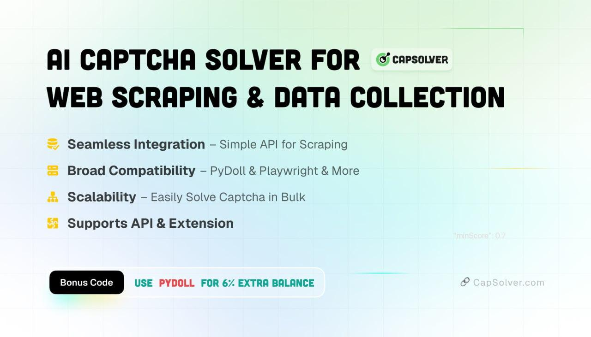

<p align="center">
     <br>
</p>
</p> <h1 align="center">Pydoll: The Evasion-First Web Automation Framework</h1> <p align="center"> A 100% Typed, <b><code>async</code>-native</b> automation library built for modern bot evasion and high-performance scraping. </p>

<p align="center">
    <a href="https://github.com/autoscrape-labs/pydoll/stargazers"></a>
    <a href="https://codecov.io/gh/autoscrape-labs/pydoll" >
        
    </a>
    
    
    
    = 3.10">
    <a href="https://deepwiki.com/autoscrape-labs/pydoll"></a>
</p>


<p align="center">   📖 <a href="https://pydoll.tech/">Full Documentation</a> •   🚀 <a href="#-getting-started-in-60-seconds">Getting Started</a> •   ⚡ <a href="#-the-pydoll-feature-ecosystem">Advanced Features</a> •   🧠 <a href="#-more-than-an-api-a-knowledge-base">Deep Dives</a> •   💖 <a href="#-support-this-project">Support This Project</a> </p>

Pydoll is built on a simple philosophy: powerful automation shouldn't require you to fight the browser.

Forget broken `webdrivers`, compatibility issues, or being blocked by `navigator.webdriver=true`. Pydoll connects directly to the Chrome DevTools Protocol (CDP), providing a natively asynchronous, robust, and **fully typed** architecture.

It's designed for modern scraping, combining an **intuitive high-level API** (for productivity) with **deep-level control** over the network and browser behavior (for evasion), allowing you to bypass complex anti-bot defenses.

### Sponsors

<a href="https://www.thordata.com/?ls=github&lk=pydoll">

</a>

Pydoll is proudly sponsored by **[Thordata](https://www.thordata.com/?ls=github&lk=pydoll)**: a residential proxy network built for serious web scraping and automation. With **190+ real residential and ISP locations**, fully encrypted connections, and infrastructure optimized for high-performance workflows, Thordata is an excellent choice for scaling your Pydoll automations.

**[Sign up through our link](https://www.thordata.com/?ls=github&lk=pydoll)** to support the project and get **1GB free** to get started.

---


<a href="https://dashboard.capsolver.com/passport/register?inviteCode=WPhTbOsbXEpc">

</a>

Pydoll excels at behavioral evasion, but it doesn't solve captchas. That's where **[CapSolver](https://dashboard.capsolver.com/passport/register?inviteCode=WPhTbOsbXEpc)** comes in. An AI-powered service that handles reCAPTCHA, Cloudflare challenges, and more, seamlessly integrating with your automation workflows.

**[Register with our invite code](https://dashboard.capsolver.com/passport/register?inviteCode=WPhTbOsbXEpc)** and use code **PYDOLL** to get an extra **6% balance bonus**.

---

### The Pydoll Philosophy

* **Stealth-by-Design:** Pydoll is built for evasion. Our [human-like interactions](https://pydoll.tech/docs/features/automation/human-interactions/) simulate real user clicks, typing, and scrolling to pass behavioral analysis, while granular [Browser Preferences](https://pydoll.tech/docs/features/configuration/browser-preferences/) control lets you patch your browser fingerprint.
* **Async & Typed Architecture:** Built from the ground up on `asyncio` and **100% type-checked** with `mypy`. This means top-tier I/O performance for concurrent tasks and a fantastic Developer Experience (DX) with autocompletion and error-checking in your IDE.
* **Total Network Control:** Go beyond basic HTTP proxies. Pydoll gives you tools to [intercept](https://pydoll.tech/docs/features/network/interception/) (to block ads/trackers) and [monitor](https://pydoll.tech/docs/features/network/monitoring/) traffic, plus [deep documentation](https://pydoll.tech/docs/deep-dive/network/socks-proxies/) on why SOCKS5 is essential to prevent DNS leaks.
* **Hybrid Automation (The Game-Changer):** Use the UI automation to log in, then use `tab.request` to make blazing-fast API calls that [inherit the entire browser session](https://pydoll.tech/docs/features/network/http-requests/).
* **Ergonomics Meets Power:** Easy for the simple, powerful for the complex. Use `tab.find()` for 90% of cases and `tab.query()` for complex [CSS/XPath selectors](https://pydoll.tech/docs/deep-dive/guides/selectors-guide/).

## 📦 Installation

```bash
pip install pydoll-python
```
That's it. No `webdrivers`. No external dependencies.

## 🆕 What's New

<details>
<summary><b>Humanized Keyboard Input (<code>humanize=True</code>)</b></summary>
<br>

Pydoll now includes a **humanized typing engine** that simulates realistic human typing behavior:

- **Variable keystroke timing**: 30-120ms between keys (not fixed intervals)
- **Realistic typos**: ~2% error rate with automatic correction behavior
- **No more `interval` parameter**: Just use `humanize=True` for anti-bot evasion

```python
# Old way (detectable)
await element.type_text("hello", interval=0.1)

# New way (human-like, anti-bot)
await element.type_text("hello", humanize=True)
```
</details>

<details>
<summary><b>Humanized Scroll with Physics Engine (<code>humanize=True</code>)</b></summary>
<br>

The scroll API now features a **Cubic Bezier curve physics engine** for realistic scrolling:

- **Momentum & friction**: Natural acceleration and deceleration
- **Micro-pauses**: Brief stops during long scrolls (simulates reading)
- **Jitter injection**: Small random variations in scroll path
- **Overshoot correction**: Occasionally scrolls past target and corrects back

```python
# Smooth scroll (CSS animation, predictable timing)
await tab.scroll.by(ScrollPosition.DOWN, 500, smooth=True)

# Humanized scroll (physics engine, anti-bot)
await tab.scroll.by(ScrollPosition.DOWN, 500, humanize=True)
await tab.scroll.to_bottom(humanize=True)
```

| Mode | Parameter | Use Case |
|------|-----------|----------|
| **Instant** | `smooth=False` | Speed-critical operations |
| **Smooth** | `smooth=True` | General browsing simulation |
| **Humanized** | `humanize=True` | **Anti-bot evasion** |

[**📖 Human-Like Interactions Docs**](https://pydoll.tech/docs/features/automation/human-interactions/)
</details>

## 🚀 Getting Started in 60 Seconds

Thanks to its `async` architecture and context managers, Pydoll is clean and efficient.

```python
import asyncio
from pydoll.browser import Chrome
from pydoll.constants import Key

async def google_search(query: str):
    # Context manager handles browser start() and stop()
    async with Chrome() as browser:
        tab = await browser.start()
        await tab.go_to('https://www.google.com')

        # Intuitive finding API: find by HTML attributes
        search_box = await tab.find(tag_name='textarea', name='q')
        
        # "Human-like" interactions simulate typing
        await search_box.insert_text(query)
        await search_box.press_keyboard_key(Key.ENTER)

        # Find by text and click (simulates mouse movement)
        first_result = await tab.find(
            tag_name='h3',
            text='autoscrape-labs/pydoll', # Supports partial text matching
            timeout=10,
        )
        await first_result.click()

        # Wait for an element to confirm navigation
        await tab.find(id='repository-container-header', timeout=10)
        print(f"Page loaded: {await tab.title}")

asyncio.run(google_search('pydoll python'))
```

## ⚡ The Pydoll Feature Ecosystem

Pydoll is a complete toolkit for professional automation.

<details>
<summary><b>1. Hybrid Automation (UI + API): The Game-Changer</b></summary>
<br>

Tired of manually extracting and managing cookies to use `requests` or `httpx`? Pydoll solves this.

Use the UI automation to pass a complex login (with CAPTCHAs, JS challenges, etc.) and then use `tab.request` to make **authenticated** API calls that automatically inherit all cookies, headers, and session state from the browser. It's the best of both worlds: the robustness of UI automation for auth, and the speed of direct API calls for data extraction.

```python
# 1. Log in via the UI (handles CAPTCHAs, JS, etc.)
await tab.go_to('https://my-site.com/login')
await (await tab.find(id='username')).type_text('user')
await (await tab.find(id='password')).type_text('pass123')
await (await tab.find(id='login-btn')).click()

# 2. Now, use the browser's session to hit the API!
# This request automatically INHERITS the login cookies
response = await tab.request.get('https://my-site.com/api/user/profile')
user_data = response.json()
print(f"Welcome, {user_data['name']}!")
```
[**📖 Read more about Hybrid Automation**](https://pydoll.tech/docs/features/network/http-requests/)
</details>

<details>
<summary><b>2. Total Network Control: Monitor & Intercept Traffic</b></summary>
<br>
    
Take full control of the network stack. Pydoll allows you to not only **monitor** traffic for reverse-engineering APIs but also to **intercept** requests in real-time.

Use this to block ads, trackers, images, or CSS to dramatically speed up your scraping and save bandwidth, or even to modify headers and mock API responses for testing.

```python
import asyncio
from pydoll.browser.chromium import Chrome
from pydoll.protocol.fetch.events import FetchEvent, RequestPausedEvent
from pydoll.protocol.network.types import ErrorReason

async def block_images():
    async with Chrome() as browser:
        tab = await browser.start()

        async def block_resource(event: RequestPausedEvent):
            request_id = event['params']['requestId']
            resource_type = event['params']['resourceType']
            url = event['params']['request']['url']

            # Block images and stylesheets
            if resource_type in ['Image', 'Stylesheet']:
                await tab.fail_request(request_id, ErrorReason.BLOCKED_BY_CLIENT)
            else:
                # Continue other requests
                await tab.continue_request(request_id)

        await tab.enable_fetch_events()
        await tab.on(FetchEvent.REQUEST_PAUSED, block_resource)

        await tab.go_to('https://example.com')
        await asyncio.sleep(3)
        await tab.disable_fetch_events()

asyncio.run(block_images())
```
[**📖 Network Monitoring Docs**](https://pydoll.tech/docs/features/network/monitoring/) | [**📖 Request Interception Docs**](https://pydoll.tech/docs/features/network/interception/)
</details>

<details>
<summary><b>3. Deep Browser Control: The Fingerprint Evasion Manual</b></summary>
<br>

A `User-Agent` isn't enough. Pydoll gives you granular control over [Browser Preferences](https://pydoll.tech/docs/features/configuration/browser-preferences/), allowing you to modify hundreds of internal Chrome settings to build a robust and consistent fingerprint.

Our documentation doesn't just give you the tool; it [explains in detail](https://pydoll.tech/docs/deep-dive/fingerprinting/browser-fingerprinting/) how `canvas`, WebGL, font, and timezone fingerprinting works, and how to use these preferences to defend your automation.

```python
options = ChromiumOptions()

# Create a realistic and clean browser profile
options.browser_preferences = {
    'profile': {
        'default_content_setting_values': {
            'notifications': 2,       # Block notification popups
            'geolocation': 2,        # Block location requests
        },
        'password_manager_enabled': False # Disable "save password" prompt
    },
    'intl': {
        'accept_languages': 'en-US,en', # Make consistent with your proxy IP
    },
    'browser': {
        'check_default_browser': False,   # Don't ask to be default browser
    }
}
```
[**📖 Full Guide to Browser Preferences**](https://pydoll.tech/docs/features/configuration/browser-preferences/)
</details>

<details>
<summary><b>4. Built for Scale: Concurrency, Contexts & Remote Connections</b></summary>
<br>

Pydoll is built for scale. Its `async` architecture allows you to manage [multiple tabs](https://pydoll.tech/docs/features/browser-management/tabs/) and [browser contexts](https://pydoll.tech/docs/features/browser-management/contexts/) (isolated sessions) in parallel.

Furthermore, Pydoll excels in production architectures. You can run your browser in a Docker container and **connect to it remotely** from your Python script, decoupling the controller from the worker. Our documentation includes guides on [how to set up your own remote server](https://pydoll.tech/docs/features/advanced/remote-connections/).

```python
# Example: Scrape 2 sites in parallel

async def scrape_page(url, tab):
    await tab.go_to(url)
    return await tab.title

async def concurrent_scraping():
    async with Chrome() as browser:
        tab_google = await browser.start()
        tab_ddg = await browser.new_tab() # Create a new tab

        # Execute both scraping tasks concurrently
        tasks = [
            scrape_page('https://google.com/', tab_google),
            scrape_page('https://duckduckgo.com/', tab_ddg)
        ]
        results = await asyncio.gather(*tasks)
        print(results)
```
[**📖 Multi-Tab Management Docs**](https://pydoll.tech/docs/features/browser-management/tabs/) | [**📖 Remote Connection Docs**](https://pydoll.tech/docs/features/advanced/remote-connections/)
</details>

<details>
<summary><b>5. Robust Engineering: `@retry` Decorator & 100% Typed</b></summary>
<br>

**Reliable Engineering:** Pydoll is **fully typed**, providing a fantastic Developer Experience (DX) with full autocompletion in your IDE and error-checking before you even run your code. [Read about our Type System](https://pydoll.tech/docs/deep-dive/fundamentals/typing-system/).

**Robust-by-Design:** The `@retry` decorator turns fragile scripts into production-ready automations. It doesn't just "try again"; it lets you execute custom **recovery logic** (`on_retry`), like refreshing the page or rotating a proxy, before the next attempt.

```python
from pydoll.decorators import retry
from pydoll.exceptions import ElementNotFound, NetworkError

@retry(
    max_retries=3,
    exceptions=[ElementNotFound, NetworkError], # Only retry on these specific errors
    on_retry=my_recovery_function,          # Run your custom recovery logic
    exponential_backoff=True              # Wait 2s, 4s, 8s...
)
async def scrape_product(self, url: str):
    # ... your scraping logic ...
```
[**📖 `@retry` Decorator Docs**](https://pydoll.tech/docs/features/advanced/decorators/)
</details>

---

## 🧠 More Than an API: A Knowledge Base

Pydoll is not a black box. We believe that to defeat anti-bot systems, you must understand them. Our documentation is one of the most comprehensive public resources on the subject, teaching you not just the "how," but the "why."

### 1. The Battle Against Fingerprinting (Strategic Guide)
Understand how bots are detected and how Pydoll is designed to win.
* **[Evasion Techniques Guide](https://pydoll.tech/docs/deep-dive/fingerprinting/evasion-techniques/)**: Our unified 3-layer evasion strategy.
* **[Network Fingerprinting](https://pydoll.tech/docs/deep-dive/fingerprinting/network-fingerprinting/)**: How your IP, TTL, and TLS (JA3) headers give you away.
* **[Browser Fingerprinting](https://pydoll.tech/docs/deep-dive/fingerprinting/browser-fingerprinting/)**: How `canvas`, WebGL, and fonts create your unique ID.
* **[Behavioral Fingerprinting](https://pydoll.tech/docs/deep-dive/fingerprinting/behavioral-fingerprinting/)**: Why mouse/keyboard telemetry is the new front line of detection.

### 2. The Advanced Networking Manual (The Foundation)
Proxies are more than just `--proxy-server`.
* **[HTTP vs. SOCKS5](https://pydoll.tech/docs/deep-dive/network/socks-proxies/)**: Why SOCKS5 is superior (it solves DNS leaks).
* **[Proxy Detection](https://pydoll.tech/docs/deep-dive/network/proxy-detection/)**: How sites know you're using a proxy (WebRTC Leaks).
* **[Build Your Own Proxy](https://pydoll.tech/docs/deep-dive/network/build-proxy/)**: Yes, we even teach you how to build your own SOCKS5 proxy server in Python.

### 3. Transparent Architecture (Software Engineering)
Software engineering you can trust.
* **[Domain-Driven Design (OOP)](https://pydoll.tech/docs/deep-dive/architecture/browser-domain/)**: The clean architecture behind `Browser`, `Tab`, and `WebElement`.
* **[The FindElements Mixin](https://pydoll.tech/docs/deep-dive/architecture/find-elements-mixin/)**: The magic behind the intuitive `find()` API.
* **[The Connection Layer](https://pydoll.tech/docs/deep-dive/fundamentals/connection-layer/)**: How Pydoll manages `asyncio` and the CDP.

---

## 🤝 Contributing

We would love your help to make Pydoll even better! Check out our [contribution guidelines](CONTRIBUTING.md) to get started.

## 💖 Support This Project

If you find Pydoll useful, consider [sponsoring my work on GitHub](https://github.com/sponsors/thalissonvs). Every contribution helps keep the project alive and drives new features!

## 📄 License

Pydoll is licensed under the [MIT License](LICENSE).

<p align="center">
  <b>Pydoll</b> — Web automation, taken seriously.
</p>
