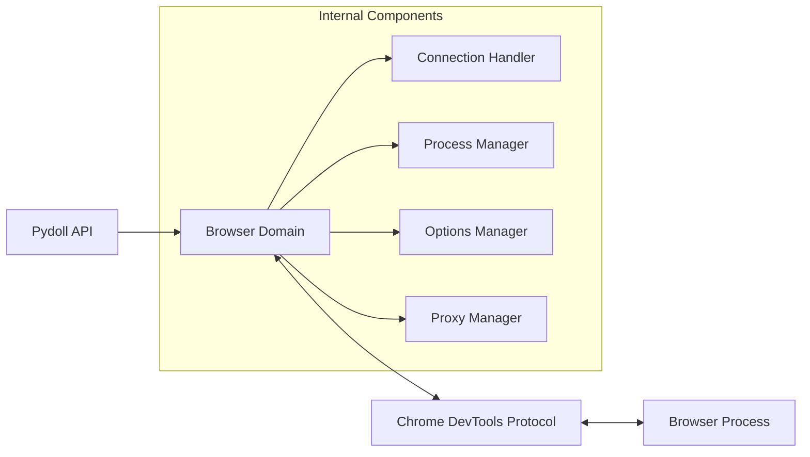
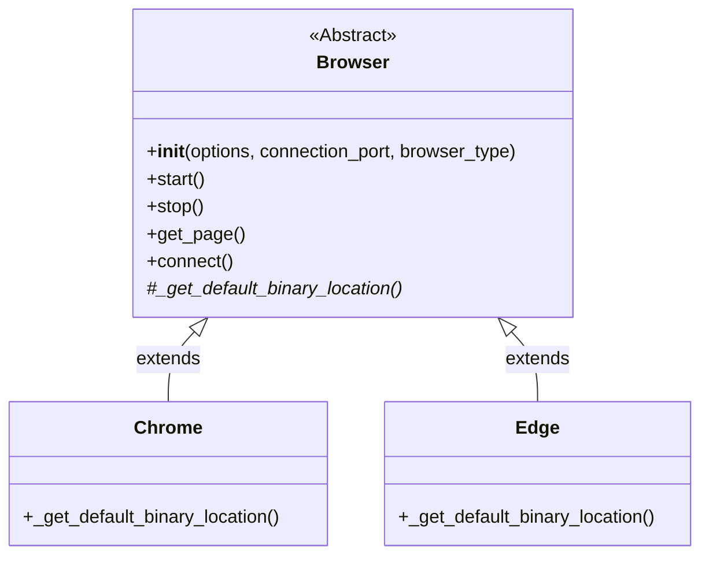
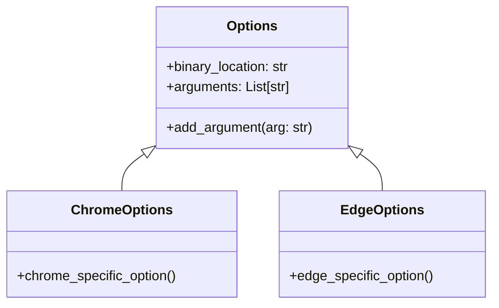

# Browser Domain

The Browser domain is the backbone of Pydoll's zero-webdriver architecture. This component provides a direct interface to browser instances through the Chrome DevTools Protocol (CDP), eliminating the need for traditional webdrivers while delivering superior performance and reliability.



## Technical Architecture

At its core, the Browser domain is implemented as an abstract base class (`Browser`) that establishes the fundamental contract for all browser implementations. Specific browser classes like `Chrome` and `Edge` extend this base class to provide browser-specific behavior while sharing the common architecture.

```python
# Abstract base class (simplified)
class Browser(ABC):
    def __init__(self, options=None, connection_port=None, browser_type=None):
        # Initialize components
        # ...
    
    @abstractmethod
    def _get_default_binary_location(self) -> str:
        """Must be implemented by subclasses"""
        pass

    async def start(self):
        # Start browser process
        # Establish CDP connection
        # Configure initial state
        # ...

# Implementation for Chrome
class Chrome(Browser):
    def _get_default_binary_location(self) -> str:
        # Return path to Chrome binary
        # ...
```

The abstraction allows Pydoll to support multiple browsers through a unified interface, with each implementation handling browser-specific details such as executable discovery, command-line arguments, and protocol variations.

## Core Usage Patterns

The Browser domain follows a consistent pattern for initialization, page management, and cleanup:

```python
import asyncio
from pydoll.browser.chrome import Chrome

async def simple_browser_example():
    # Create and start a browser instance
    browser = Chrome()
    await browser.start()
    
    try:
        # Get a page and navigate to a URL
        page = await browser.get_page()
        await page.go_to("https://example.com")
        
        # Perform operations with the page
        title = await page.execute_script("return document.title")
        print(f"Page title: {title}")
        
    finally:
        # Always ensure the browser is properly closed
        await browser.stop()

# Run the async example
asyncio.run(simple_browser_example())
```

!!! tip "Context Manager Usage"
    For cleaner resource management, use the context manager pattern:
    
    ```python
    async def context_manager_example():
        async with Chrome() as browser:
            await browser.start()
            page = await browser.get_page()
            await page.go_to("https://example.com")
            # The browser is automatically closed when exiting the context
    
    asyncio.run(context_manager_example())
    ```

## Hierarchy of Browser Implementations

The Browser domain follows a clear inheritance hierarchy that promotes code reuse while allowing for browser-specific implementations:



This architecture allows Pydoll to support multiple browser types through a unified interface. Each concrete implementation (Chrome, Edge) needs only to provide browser-specific details like executable discovery, while inheriting the robust core functionality from the base Browser class.

## Initialization Parameters

The Browser domain accepts three primary parameters during initialization, each controlling a different aspect of the browser's behavior:

### Options Parameter

The `options` parameter accepts an instance of the `Options` class that configures the browser's runtime environment:

```python
from pydoll.browser.chrome import Chrome
from pydoll.browser.options import Options

options = Options()
options.binary_location = '/usr/bin/google-chrome-stable'
options.add_argument('--headless=new')
options.add_argument('--disable-gpu')
options.add_argument('--window-size=1920,1080')

browser = Chrome(options=options)
```

#### Key Option Properties

| Property | Description | Example |
|----------|-------------|---------|
| `binary_location` | Path to browser executable | `/usr/bin/chrome` |
| `arguments` | Command-line arguments | `['--headless=new', '--disable-gpu']` |
| `extensions` | Browser extensions to load | `['/path/to/extension.crx']` |

!!! info "Option Inheritance"
    Each browser implementation inherits from a base `Options` class but may provide additional browser-specific options. For example, `ChromeOptions` extends the base class with Chrome-specific capabilities.



### Connection Port Parameter

The `connection_port` parameter defines which port to use for the CDP WebSocket connection:

```python
# Specify exact port for connection
browser = Chrome(connection_port=9222)
```

This parameter serves two distinct purposes:

1. **For browser launching**: Specifies which port the browser should open for CDP communication
2. **For connection to existing browser**: Defines which port to connect to when using `connect()` instead of `start()`

!!! warning "Port Availability"
    When not specified, Pydoll selects a random available port between 9223 and 9322. If your environment has firewall or network restrictions, you may need to explicitly set a port that's accessible.

### Browser Type Parameter

The `browser_type` parameter explicitly defines which browser type is being instantiated:

```python
from pydoll.browser.constants import BrowserType
from pydoll.browser.chrome import Chrome

browser = Chrome(browser_type=BrowserType.CHROME)
```

This parameter is primarily used internally and for specialized scenarios, as the browser type is typically inferred from the class being instantiated.

## Internal Components

The Browser domain coordinates several specialized components to provide its functionality:

### Connection Handler

The ConnectionHandler establishes and maintains communication with the browser through the Chrome DevTools Protocol. It provides a layer of abstraction over the WebSocket connection, handling command execution, response processing, and event subscription.

This component is a fundamental part of Pydoll's architecture and will be explored in more detail in the dedicated Connection Domain section.

### Browser Process Manager

The BrowserProcessManager handles the browser process lifecycle:

```python
class BrowserProcessManager:
    def start_browser_process(self, binary, port, arguments):
        # Launch browser executable with proper arguments
        # Monitor process startup
        # ...
        
    def stop_process(self):
        # Terminate browser process
        # Cleanup resources
        # ...
```

This separation of concerns ensures that browser process management is decoupled from protocol communication, making the code more maintainable and testable.

### Options Manager

The BrowserOptionsManager handles option validation and defaulting:

```python
class BrowserOptionsManager:
    @staticmethod
    def initialize_options(options, browser_type):
        # Create options instance if None
        # Set appropriate defaults
        # ...
        
    @staticmethod
    def add_default_arguments(options):
        # Add required CDP arguments
        # Configure automation settings
        # ...
```

### Proxy Manager

The ProxyManager configures browser proxy settings:

```python
class ProxyManager:
    def __init__(self, options):
        # Parse proxy settings from options
        # ...
        
    def get_proxy_credentials(self):
        # Extract authentication details
        # Format proxy configuration
        # ...
```

This component is crucial for automated web scraping or testing scenarios that require proxy rotation or authentication.

## Lifecyle and Context Management

The Browser domain implements Python's asynchronous context management protocol (`__aenter__` and `__aexit__`) to provide automatic resource cleanup:

```python
async def scrape_data():
    async with Chrome() as browser:
        await browser.start()
        page = await browser.get_page()
        await page.go_to('https://example.com')
        # Work with page...
        # Browser automatically closes when exiting the context
```

This pattern ensures that browser processes are properly terminated even if exceptions occur during automation, preventing resource leaks.

## Connection Modes

The Browser domain supports two primary modes of operation:

### 1. Start Mode

The `start()` method launches a new browser instance:

```python
browser = Chrome()
await browser.start()
page = await browser.get_page()
```

### 2. Connect Mode

The `connect()` method attaches to an existing browser instance:

```python
# Connect to Chrome running with --remote-debugging-port=9222
browser = Chrome(connection_port=9222)
page = await browser.connect()
```

!!! info "Development Workflow Tip"
    The connect mode is particularly valuable during development:
    
    ```python
    # Fast development loop
    browser = Chrome(connection_port=9222)
    
    while True:
        try:
            page = await browser.connect()
            # Test your automation code
            # No need to restart browser between runs
            break
        except Exception as e:
            print(f"Error: {e}, retrying...")
    ```

## Page Management

The Browser domain provides several methods for managing browser pages:

### Creating and Getting Pages

```python
# Create a new empty page
new_page_id = await browser.new_page()

# Create a new page and navigate to a URL
new_page_id = await browser.new_page("https://example.com")

# Get a page object from an existing or new page
page = await browser.get_page()

# Get a page object for a specific page ID
page = await browser.get_page_by_id(page_id)
```

!!! tip "Multi-Page Automation"
    You can work with multiple pages simultaneously:
    
    ```python
    async def multi_page_example():
        browser = Chrome()
        await browser.start()
        
        # Create and work with multiple pages
        page1 = await browser.get_page()
        await page1.go_to("https://example.com")
        
        page2 = await browser.get_page()
        await page2.go_to("https://github.com")
        
        # Get information from both pages
        title1 = await page1.execute_script("return document.title")
        title2 = await page2.execute_script("return document.title")
        
        print(f"Page 1: {title1}")
        print(f"Page 2: {title2}")
        
        await browser.stop()
    ```

### Listing Open Pages

To get information about all open pages in the browser:

```python
# Get all targets (pages, service workers, etc.)
targets = await browser.get_targets()

# Filter for page targets only
pages = [t for t in targets if t.get('type') == 'page']

for page in pages:
    print(f"Page ID: {page['targetId']}")
    print(f"URL: {page['url']}")
```

## Window Management

The Browser domain provides methods to control the browser window:

```python
# Get the current window ID
window_id = await browser.get_window_id()

# Set window bounds (position and size)
await browser.set_window_bounds({
    'left': 100,
    'top': 100,
    'width': 1024,
    'height': 768
})

# Maximize the window
await browser.set_window_maximized()

# Minimize the window
await browser.set_window_minimized()
```

!!! info "Window Management Use Cases"
    Window management is particularly useful for:
    - Setting precise window sizes for consistent screenshots
    - Positioning windows for multi-monitor setups
    - Creating user-friendly automation that's visible during development

## Cookie Management

The Browser domain provides methods for browser-wide cookie management:

```python
# Set cookies at the browser level
cookies_to_set = [
    {
        "name": "session_id",
        "value": "global_session_123",
        "domain": "example.com",
        "path": "/",
        "secure": True,
        "httpOnly": True
    }
]
await browser.set_cookies(cookies_to_set)

# Get all cookies from the browser
all_cookies = await browser.get_cookies()
print(f"Number of cookies: {len(all_cookies)}")

# Delete all cookies from the browser
await browser.delete_all_cookies()
```

!!! tip "Browser vs Page Cookie Management"
    - **Browser-level cookies** (using the methods above) apply to all pages in the browser
    - **Page-level cookies** (using `page.set_cookies()`) apply only to that specific page
    
    Choose the appropriate scope based on your automation needs.

## Download Management

You can specify a download path for browser downloads:

```python
# Set a custom download path
download_path = "/path/to/downloads"
await browser.set_download_path(download_path)

# Navigate to a page with downloadable content
page = await browser.get_page()
await page.go_to("https://example.com/download")

# Click a download link
download_link = await page.find_element(By.ID, "download-button")
await download_link.click()

# Files will be saved to the specified path
```

## Event System Overview

The Browser domain provides methods to enable and monitor various types of events. These methods include `enable_fetch_events()` and the `on()` method for registering event callbacks.

!!! warning "Browser vs Page Event Scope"
    When enabling events at the Browser level (e.g., `browser.enable_fetch_events()`), they apply **globally** to all pages in the browser. In contrast, enabling events at the Page level (e.g., `page.enable_fetch_events()`) affects only that specific page.
    
    This distinction is important for performance and resource management. Enable events at the browser level when you need to monitor activity across all pages, and at the page level when you only care about a specific page's events.
    
    Not all event types are available at both levels. For example, Page-specific events can only be enabled at the Page level, while browser-wide events can only be enabled at the Browser level.

!!! info "Detailed Event System Documentation"
    The event system is a core component of Pydoll's architecture and will be covered in detail in a dedicated section. This will include event types, handling patterns, and advanced event-driven techniques.

## Proxy Configuration

Pydoll supports using proxies for browser connections. This is useful for web scraping, testing geo-specific content, or bypassing IP-based rate limits:

```python
from pydoll.browser.chrome import Chrome
from pydoll.browser.options import Options

options = Options()

# Configure a proxy
options.add_argument('--proxy-server=http://proxy.example.com:8080')

# For proxies requiring authentication
browser = Chrome(options=options)
await browser.start()

# Pydoll automatically handles proxy authentication challenges
page = await browser.get_page()
await page.go_to("https://example.com")
```

!!! tip "Private Proxy Authentication"
    Pydoll handles private proxy authentication automatically:
    
    1. When a proxy authentication challenge is detected, Pydoll intercepts it
    2. The proxy credentials are applied from the options
    3. The authentication is completed transparently
    4. Your automation continues without interruption
    
    This makes working with authenticated proxies much simpler compared to traditional browser automation.

## Conclusion

The Browser domain serves as the foundation of Pydoll's architecture, providing a powerful interface to browser instances through the Chrome DevTools Protocol. By understanding its capabilities and patterns, you can create sophisticated browser automation that's more reliable and efficient than traditional webdriver-based approaches.

The combination of a clean abstraction layer, comprehensive event system, and direct control over the browser process enables advanced automation scenarios while maintaining a simple and intuitive API.
