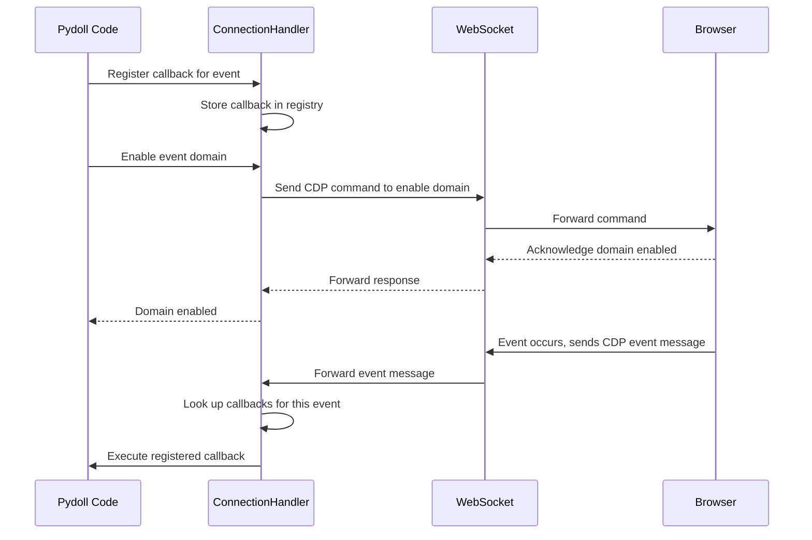
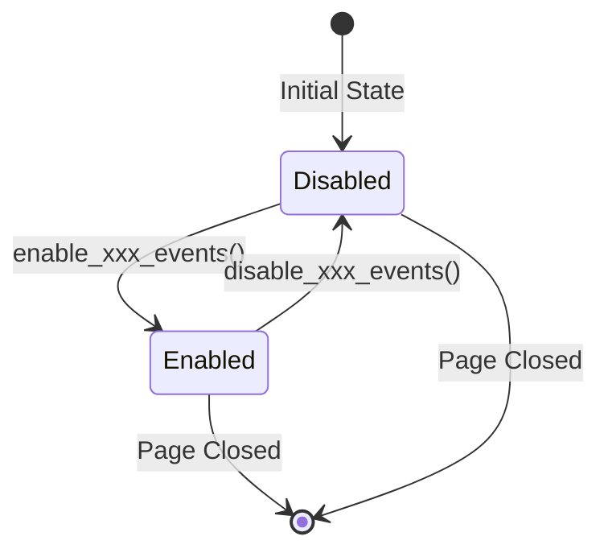
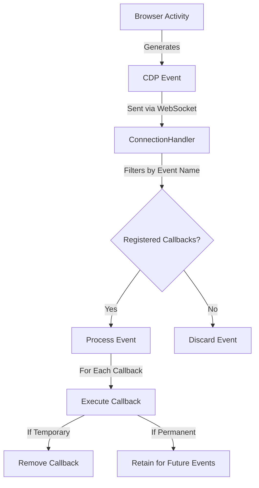
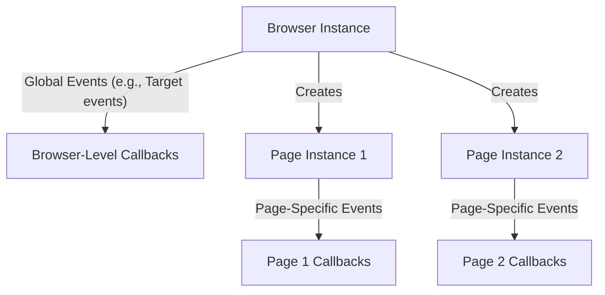

# Event System

The event system is a foundational component of Pydoll's architecture, providing a powerful mechanism for responding to browser activities in real-time. This asynchronous notification system enables your automation code to react to various browser events as they occur, creating dynamic and responsive interactions.


## WebSocket Communication and CDP

At the core of Pydoll's event system is the Chrome DevTools Protocol (CDP), which provides a structured way to interact with and monitor browser activities over WebSocket connections. This bidirectional communication channel allows your code to both send commands to the browser and receive events back.



### WebSocket Communication Model

The WebSocket connection between Pydoll and the browser follows this pattern:

1. **Connection Establishment**: When the browser starts, a WebSocket server is created, and Pydoll establishes a connection to it
2. **Bidirectional Messaging**: Both Pydoll and the browser can send messages at any time
3. **Message Types**:
   - **Commands**: Sent from Pydoll to the browser (e.g., navigation, DOM manipulation)
   - **Command Responses**: Sent from the browser to Pydoll in response to commands
   - **Events**: Sent from the browser to Pydoll when something happens (e.g., page load, network activity)

### Chrome DevTools Protocol Structure

CDP organizes its functionality into domains, each responsible for a specific area of browser functionality:

| Domain | Responsibility | Typical Events |
|--------|----------------|----------------|
| Page | Page lifecycle | Load events, navigation, dialogs |
| Network | Network activity | Request/response monitoring, WebSockets |
| DOM | Document structure | DOM changes, attribute modifications |
| Fetch | Request interception | Request paused, authentication required |
| Runtime | JavaScript execution | Console messages, exceptions |
| Browser | Browser management | Window creation, tabs, contexts |

Each domain must be explicitly enabled before it will emit events, which helps manage performance by only processing events that are actually needed.

## Event Domains and Enabling

Pydoll organizes events into logical domains that correspond to the CDP domains. Each domain must be explicitly enabled before it will emit events, which is handled through specific enabling methods.

```python
# Enable page events to monitor page load, navigation, dialogs, etc.
await page.enable_page_events()

# Enable network events to monitor requests, responses, etc.
await page.enable_network_events()

# Enable DOM events to monitor DOM changes
await page.enable_dom_events()

# Enable fetch events to intercept and modify requests
await page.enable_fetch_events()
```

!!! info "Domain Ownership"
    Events belong to specific domains based on their functionality. For example, page load events belong to the Page domain, while network request events belong to the Network domain. Some domains are only available at certain levels - for instance, Page events are available on the Page instance but not directly at the Browser level.

### Why Enable/Disable is Required

The explicit enable/disable pattern serves several important purposes:

1. **Performance Optimization**: By only enabling domains you're interested in, you reduce the overhead of event processing
2. **Resource Management**: Some event domains (like Network or DOM monitoring) can generate large volumes of events that consume memory
3. **Clarity of Intent**: Explicit enabling makes the automation code's intentions clear and self-documenting
4. **Controlled Cleanup**: Explicitly disabling domains ensures proper cleanup when events are no longer needed



!!! warning "Event Leak Prevention"
    Failing to disable event domains when they're no longer needed can lead to memory leaks and performance degradation, especially in long-running automation. Always disable event domains when you're done with them, particularly for high-volume events like network monitoring.

### Domain-Specific Enabling Methods

Different domains are enabled through specific methods on the appropriate objects:

| Domain | Enable Method | Disable Method | Available On |
|--------|--------------|----------------|--------------|
| Page | `enable_page_events()` | `disable_page_events()` | Page |
| Network | `enable_network_events()` | `disable_network_events()` | Page |
| DOM | `enable_dom_events()` | `disable_dom_events()` | Page |
| Fetch | `enable_fetch_events()` | `disable_fetch_events()` | Page, Browser |
| File Chooser | `enable_intercept_file_chooser_dialog()` | `disable_intercept_file_chooser_dialog()` | Page |

## Registering Event Callbacks

The central method for subscribing to events is the `on()` method, available on both Page and Browser instances:

```python
async def on(
    self, event_name: str, callback: callable, temporary: bool = False
) -> int:
    """
    Registers an event listener for the page.

    Args:
        event_name (str): The event name to listen for.
        callback (callable): The callback function to execute when the
            event is triggered.
        temporary (bool): If True, the callback will be removed after it's
            triggered once. Defaults to False.

    Returns:
        int: The ID of the registered callback.
    """
```

This method returns a callback ID that can be used to remove the callback later if needed.

### Callback Types and Parameters

Callbacks can be either synchronous functions or asynchronous coroutines:

```python
# Synchronous callback example
def handle_page_load(event):
    print(f"Page loaded at: {time.time()}")

# Asynchronous callback example
async def handle_network_request(event):
    request_url = event['params']['request']['url']
    print(f"Request sent to: {request_url}")
    # Can perform async operations here
    await save_request_details(request_url)

# Register the callbacks
await page.on('Page.loadEventFired', handle_page_load)
await page.on('Network.requestWillBeSent', handle_network_request)
```

!!! tip "Asynchronous Callbacks"
    Using async callbacks provides greater flexibility, allowing you to perform other async operations within the callback, such as making additional CDP commands or waiting for conditions.

### Using Partial for Page Access in Callbacks

A powerful technique is to use `functools.partial` to pass the Page instance to your callbacks, allowing the callback to interact with the page:

```python
from functools import partial

# Define a callback that needs access to the page
async def handle_navigation(page, event):
    # The callback can now use the page object
    print(f"Navigation occurred to: {await page.current_url}")
    
    # Access page methods directly
    elements = await page.find_elements(By.TAG_NAME, "a")
    print(f"Found {len(elements)} links on the new page")

# Register with partial to bind the page parameter
await page.enable_page_events()
await page.on(PageEvents.FRAME_NAVIGATED, partial(handle_navigation, page))
```

This technique is essential when:
1. Your callback needs to interact with the page (finding elements, executing scripts)
2. You want to maintain state between events
3. You need to coordinate actions across different event types

!!! info "Why Use Partial?"
    The event system only passes the event data to callbacks. Using `partial` lets you pre-configure callbacks with additional parameters (like the page object) without modifying the callback signature expected by the event system.

### Temporary Callbacks

For events you only want to handle once, you can use the `temporary` flag:

```python
# This callback will automatically be removed after the first time it fires
await page.on('Page.loadEventFired', handle_first_load, temporary=True)
```

This is particularly useful for:
- One-time setup operations
- Waiting for a specific event before continuing
- Handling the first occurrence of an event differently

## Event Flow and Lifecycle

Understanding the event flow is crucial for effective event handling:



The event lifecycle follows these steps:

1. Something happens in the browser (page loads, request sent, DOM changes)
2. Browser generates a CDP event message
3. Message is sent over WebSocket to Pydoll
4. The ConnectionHandler receives the event
5. ConnectionHandler checks its registry for callbacks matching the event name
6. If callbacks exist, each is executed with the event data
7. If a callback was registered as temporary, it's removed after execution

## Predefined Event Constants

Pydoll provides a comprehensive set of predefined event constants in the `events` package, making it easier to reference common events without remembering exact CDP event strings:

```python
from pydoll.events import PageEvents, NetworkEvents, DOMEvents, FetchEvents

# Using predefined events
await page.on(PageEvents.PAGE_LOADED, handle_page_load)
await page.on(NetworkEvents.REQUEST_WILL_BE_SENT, handle_request)
await page.on(DOMEvents.DOCUMENT_UPDATED, handle_dom_update)
await page.on(FetchEvents.REQUEST_PAUSED, handle_fetch_intercept)
```

!!! info "Custom CDP Events"
    While Pydoll provides constants for common events, you can use any valid CDP event string directly. This is useful for less common events that don't have predefined constants:
    
    ```python
    # Using a direct CDP event string
    await page.on('Security.certificateError', handle_cert_error)
    ```

### Common Event Types

Here are some of the most useful events for automation and scraping:

#### Page Events

| Constant | CDP Event | Description |
|----------|-----------|-------------|
| `PageEvents.PAGE_LOADED` | `Page.loadEventFired` | Fired when the page load event is triggered |
| `PageEvents.DOM_CONTENT_LOADED` | `Page.domContentEventFired` | Fired when DOM content has been loaded |
| `PageEvents.FILE_CHOOSER_OPENED` | `Page.fileChooserOpened` | Fired when a file picker dialog is shown |
| `PageEvents.JS_DIALOG_OPENING` | `Page.javascriptDialogOpening` | Fired when a JavaScript dialog is shown |
| `PageEvents.FRAME_NAVIGATED` | `Page.frameNavigated` | Fired when a frame has navigated to a new URL |

#### Network Events

| Constant | CDP Event | Description |
|----------|-----------|-------------|
| `NetworkEvents.REQUEST_WILL_BE_SENT` | `Network.requestWillBeSent` | Fired when a request is about to be sent |
| `NetworkEvents.RESPONSE_RECEIVED` | `Network.responseReceived` | Fired when an HTTP response is received |
| `NetworkEvents.LOADING_FAILED` | `Network.loadingFailed` | Fired when a request fails to load |
| `NetworkEvents.LOADING_FINISHED` | `Network.loadingFinished` | Fired when a request has finished loading |
| `NetworkEvents.WEBSOCKET_FRAME_SENT` | `Network.webSocketFrameSent` | Fired when a WebSocket frame is sent |

#### DOM Events

| Constant | CDP Event | Description |
|----------|-----------|-------------|
| `DOMEvents.DOCUMENT_UPDATED` | `DOM.documentUpdated` | Fired when the document is updated |
| `DOMEvents.SET_CHILD_NODES` | `DOM.setChildNodes` | Fired when child nodes are set |
| `DOMEvents.ATTRIBUTE_MODIFIED` | `DOM.attributeModified` | Fired when an element's attribute is modified |
| `DOMEvents.ATTRIBUTE_REMOVED` | `DOM.attributeRemoved` | Fired when an element's attribute is removed |

## Advanced Event Patterns

### Event-Driven Scraping

Events allow you to create reactive scrapers that respond to page changes in real-time:

```python
import asyncio
from functools import partial
from pydoll.browser.chrome import Chrome
from pydoll.constants import By
from pydoll.events import NetworkEvents, PageEvents

async def scrape_dynamic_content():
    browser = Chrome()
    await browser.start()
    page = await browser.get_page()
    
    # Create a data storage container
    scraped_data = []
    data_complete = asyncio.Event()
    
    # Set up a callback to extract data when AJAX responses are received
    async def extract_data_from_response(page, event):
        if 'api/products' in event['params']['response']['url']:
            # Extract the response body
            request_id = event['params']['requestId']
            body, is_base64 = await page.get_network_response_body(request_id)
            
            # Process the data
            products = json.loads(body)
            for product in products:
                scraped_data.append({
                    'id': product['id'],
                    'name': product['name'],
                    'price': product['price']
                })
            
            print(f"Extracted {len(products)} products")
            
            # If we've collected enough data, signal completion
            if len(scraped_data) >= 100:
                data_complete.set()
    
    # Set up navigation monitoring
    async def handle_page_load(page, event):
        print(f"Page loaded: {await page.current_url}")
        
        # Now that the page is loaded, trigger the infinite scroll
        await page.execute_script("""
            function scrollDown() {
                window.scrollTo(0, document.body.scrollHeight);
                setTimeout(scrollDown, 1000);
            }
            scrollDown();
        """)
    
    # Enable events and register callbacks
    await page.enable_network_events()
    await page.enable_page_events()
    await page.on(NetworkEvents.RESPONSE_RECEIVED, partial(extract_data_from_response, page))
    await page.on(PageEvents.PAGE_LOADED, partial(handle_page_load, page))
    
    # Navigate to the page with dynamic content
    await page.go_to("https://example.com/products")
    
    # Wait for data collection to complete or timeout after 60 seconds
    try:
        await asyncio.wait_for(data_complete.wait(), timeout=60)
    except asyncio.TimeoutError:
        print("Timeout reached, continuing with data collected so far")
    
    # Process the collected data
    print(f"Total products collected: {len(scraped_data)}")
    
    # Clean up
    await browser.stop()
    
    return scraped_data
```

### Parallel Scraping with Events

Events are particularly powerful when combined with concurrent execution for maximum efficiency. Pydoll excels at managing multiple Pages (tabs) simultaneously, which is one of its greatest advantages for high-performance automation.

#### Multiple Browser Instances Approach

The first approach uses multiple browser instances for completely isolated scraping tasks:

```python
import asyncio
from functools import partial
from pydoll.browser.chrome import Chrome
from pydoll.constants import By
from pydoll.events import PageEvents, NetworkEvents

async def scrape_with_events(url, product_type):
    # Create an individual scraping task
    browser = Chrome()
    await browser.start()
    page = await browser.get_page()
    
    # Data container and completion signal
    results = []
    scraping_done = asyncio.Event()
    
    # Define callbacks for data extraction
    async def product_data_handler(page, product_type, event):
        if f'api/{product_type}' in event['params'].get('response', {}).get('url', ''):
            request_id = event['params']['requestId']
            body, _ = await page.get_network_response_body(request_id)
            data = json.loads(body)
            results.extend(data['items'])
            
            # Check if we have all the data we need
            if len(results) >= 20 or data.get('isLastPage', False):
                scraping_done.set()
    
    # Setup monitoring
    await page.enable_network_events()
    await page.on(
        NetworkEvents.RESPONSE_RECEIVED, 
        partial(product_data_handler, page, product_type)
    )
    
    # Navigate and wait for data
    await page.go_to(f"{url}/{product_type}")
    
    try:
        # Wait up to 30 seconds for data collection
        await asyncio.wait_for(scraping_done.wait(), 30)
    except asyncio.TimeoutError:
        print(f"Timeout for {product_type}, collected {len(results)} items")
    
    await browser.stop()
    return results

async def main():
    # Define different product categories to scrape in parallel
    product_types = ['electronics', 'clothing', 'books', 'home']
    base_url = 'https://example.com/products'
    
    # Launch concurrent scraping tasks
    tasks = [scrape_with_events(base_url, product_type) for product_type in product_types]
    all_results = await asyncio.gather(*tasks)
    
    # Process combined results
    for product_type, results in zip(product_types, all_results):
        print(f"{product_type}: {len(results)} products found")
        
        # Process specific category data
        for item in results[:3]:  # Show first 3 items
            print(f"  - {item['name']}: ${item['price']}")
    
    # Calculate overall statistics
    total_products = sum(len(category) for category in all_results)
    print(f"Total products across all categories: {total_products}")

# Run the concurrent scraper
asyncio.run(main())
```

#### Multi-Tab Single Browser Approach

A more efficient approach is to use multiple tabs within a single browser instance:

```python
import asyncio
from functools import partial
import json
from pydoll.browser.chrome import Chrome
from pydoll.constants import By
from pydoll.events import NetworkEvents

async def multi_tab_scraping():
    # Create a single browser instance for all tabs
    browser = Chrome()
    await browser.start()
    
    # Categories to scrape
    categories = ['electronics', 'clothing', 'books', 'home']
    base_url = 'https://example.com/products'
    
    # Track results for each category
    results = {category: [] for category in categories}
    completion_events = {category: asyncio.Event() for category in categories}
    
    # Create a callback for processing category data
    async def process_category_data(page, category, event):
        if f'api/{category}' in event['params'].get('response', {}).get('url', ''):
            request_id = event['params']['requestId']
            body, _ = await page.get_network_response_body(request_id)
            data = json.loads(body)
            
            # Add results to the appropriate category
            results[category].extend(data['items'])
            print(f"Added {len(data['items'])} items to {category}, total: {len(results[category])}")
            
            # Signal completion if we have enough data
            if len(results[category]) >= 20 or data.get('isLastPage', False):
                completion_events[category].set()
    
    # Prepare pages, one for each category
    pages = {}
    for category in categories:
        # Create a new tab
        page_id = await browser.new_page()
        page = await browser.get_page_by_id(page_id)
        pages[category] = page
        
        # Setup event monitoring for this tab
        await page.enable_network_events()
        await page.on(
            NetworkEvents.RESPONSE_RECEIVED,
            partial(process_category_data, page, category)
        )
        
        # Start navigation (don't await here to allow parallel loading)
        asyncio.create_task(page.go_to(f"{base_url}/{category}"))
    
    # Wait for all categories to complete or timeout
    try:
        await asyncio.wait_for(
            asyncio.gather(*(event.wait() for event in completion_events.values())),
            timeout=45
        )
    except asyncio.TimeoutError:
        print("Some categories timed out, proceeding with collected data")
    
    # Display results
    total_items = 0
    for category, items in results.items():
        count = len(items)
        total_items += count
        print(f"{category}: collected {count} items")
        
        # Show sample items
        for item in items[:2]:
            print(f"  - {item['name']}: ${item['price']}")
    
    print(f"Total items across all categories: {total_items}")
    
    # Clean up
    await browser.stop()
    return results

# Run the multi-tab scraper
asyncio.run(multi_tab_scraping())
```

#### Dynamic Tab Creation with Events

You can even create new tabs dynamically in response to events:

```python
import asyncio
from functools import partial
from pydoll.browser.chrome import Chrome
from pydoll.constants import By
from pydoll.events import PageEvents, NetworkEvents

async def dynamic_tab_creation():
    browser = Chrome()
    await browser.start()
    main_page = await browser.get_page()
    
    # Store results from all product pages
    all_results = []
    # Count active tabs to know when we're done
    active_tabs = 1  # Start with 1 (main page)
    # Event that signals all work is complete
    all_done = asyncio.Event()
    
    # This callback processes product links and creates a new tab for each
    async def process_category_links(main_page, event):
        # Check if this is the categories response
        if 'api/categories' not in event['params'].get('response', {}).get('url', ''):
            return
            
        # Extract categories from the response
        request_id = event['params']['requestId']
        body, _ = await main_page.get_network_response_body(request_id)
        categories = json.loads(body)
        
        print(f"Found {len(categories)} categories to process")
        nonlocal active_tabs
        active_tabs += len(categories)  # Update tab counter
        
        # Create a new tab for each category
        for category in categories:
            # Create a new tab
            page_id = await browser.new_page()
            page = await browser.get_page_by_id(page_id)
            
            # Setup a callback for this tab
            async def process_product_data(page, category_name, event):
                if 'api/products' not in event['params'].get('response', {}).get('url', ''):
                    return
                    
                # Process the product data
                request_id = event['params']['requestId']
                body, _ = await page.get_network_response_body(request_id)
                products = json.loads(body)
                
                # Add to results
                nonlocal all_results
                all_results.extend(products)
                print(f"Added {len(products)} products from {category_name}")
                
                # Close this tab when done
                nonlocal active_tabs
                await page.close()
                active_tabs -= 1
                
                # If this was the last tab, signal completion
                if active_tabs == 0:
                    all_done.set()
            
            # Enable network events on the new tab
            await page.enable_network_events()
            await page.on(
                NetworkEvents.RESPONSE_RECEIVED,
                partial(process_product_data, page, category['name'])
            )
            
            # Navigate to the category page
            asyncio.create_task(page.go_to(f"https://example.com/products/{category['id']}"))
    
    # Set up the main page to find categories
    await main_page.enable_network_events()
    await main_page.on(
        NetworkEvents.RESPONSE_RECEIVED,
        partial(process_category_links, main_page)
    )
    
    # Navigate to the main categories page
    await main_page.go_to("https://example.com/categories")
    
    # Wait for all tabs to complete their work
    try:
        await asyncio.wait_for(all_done.wait(), timeout=60)
    except asyncio.TimeoutError:
        print("Timeout reached, continuing with data collected so far")
    
    # Process results
    print(f"Total products collected: {len(all_results)}")
    
    # Clean up
    await browser.stop()
    return all_results
```

### Key Advantages of Multi-Tab Automation

Using multiple tabs in a single browser instance offers several significant advantages:

1. **Resource Efficiency**: A single browser instance uses fewer system resources than multiple browsers
2. **Shared Session**: All tabs share the same session, cookies, and cache
3. **Reduced Startup Time**: Opening new tabs is much faster than starting new browser instances
4. **Dynamic Workflows**: Create tabs in response to discoveries on other tabs
5. **Memory Efficiency**: Better memory utilization compared to multiple browser instances

!!! tip "Tab Management Best Practices"
    - Keep track of all tab references to avoid orphaned tabs
    - Consider implementing a tab pool pattern for large-scale operations
    - Close tabs when they're no longer needed to free up resources
    - Use tab IDs to identify and organize tabs
    - Consider adding timeouts to prevent hanging tabs

This multi-tab approach is ideal for scenarios like:
- Category-based scraping where each category needs its own context
- Processing search results where each result needs detailed exploration
- Following multiple user journeys simultaneously
- Load balancing requests across multiple tabs to avoid rate limiting
- Maintaining different user sessions in different tabs

### Coordinating with Event-Driven Actions

Events can be used to coordinate actions in response to browser behavior:

```python
async def wait_for_network_idle():
    network_idle = asyncio.Event()
    in_flight_requests = 0
    
    async def track_request(event):
        nonlocal in_flight_requests
        in_flight_requests += 1
    
    async def track_response(event):
        nonlocal in_flight_requests
        in_flight_requests -= 1
        if in_flight_requests == 0:
            network_idle.set()
    
    await page.enable_network_events()
    await page.on(NetworkEvents.REQUEST_WILL_BE_SENT, track_request)
    await page.on(NetworkEvents.LOADING_FINISHED, track_response)
    await page.on(NetworkEvents.LOADING_FAILED, track_response)
    
    await network_idle.wait()
    
    # Clean up
    await page.disable_network_events()
```

### Using Async Context Managers

Pydoll implements context managers for some common event patterns, like file uploads:

```python
async with page.expect_file_chooser(files="path/to/file.pdf"):
    # Trigger the file chooser dialog
    upload_button = await page.find_element(By.ID, "upload-button")
    await upload_button.click()
    # Context manager handles waiting for and responding to the file chooser event
```

!!! tip "Creating Custom Context Managers"
    You can create custom context managers for common event patterns in your own code:
    
    ```python
    @asynccontextmanager
    async def wait_for_navigation():
        navigation_complete = asyncio.Event()
        
        async def on_navigation(event):
            navigation_complete.set()
        
        # Enable events if not already enabled
        was_enabled = page.page_events_enabled
        if not was_enabled:
            await page.enable_page_events()
            
        # Register temporary callback
        await page.on(PageEvents.FRAME_NAVIGATED, on_navigation, temporary=True)
        
        try:
            yield
            # Wait for navigation to complete
            await navigation_complete.wait()
        finally:
            # Clean up if we enabled events
            if not was_enabled:
                await page.disable_page_events()
    ```

## Domain-Specific Event Features

### Page Domain Events

The Page domain provides events for page lifecycle and JavaScript dialogs:

```python
from functools import partial

# Enable page events
await page.enable_page_events()

# Handle page load
async def handle_page_load(page, event):
    print(f"Page loaded: {await page.current_url}")
    # Perform actions after page load
    await page.find_element(By.ID, "search").type_keys("pydoll")

await page.on(PageEvents.PAGE_LOADED, partial(handle_page_load, page))

# Handle JavaScript dialogs
async def handle_dialog(page, event):
    if await page.has_dialog():
        message = await page.get_dialog_message()
        print(f"Dialog message: {message}")
        await page.accept_dialog()

await page.on(PageEvents.JS_DIALOG_OPENING, partial(handle_dialog, page))
```

### Network Domain Events and Logging

The Network domain provides comprehensive request monitoring and logging:

```python
from functools import partial

# Enable network events
await page.enable_network_events()

# Monitor request activity
async def log_request(page, event):
    url = event['params']['request']['url']
    method = event['params']['request']['method']
    print(f"{method} request to: {url}")
    
    # You can trigger actions based on specific requests
    if 'api/login' in url and method == 'POST':
        print("Login request detected, waiting for response...")

await page.on(NetworkEvents.REQUEST_WILL_BE_SENT, partial(log_request, page))

# After performing actions, retrieve logs
api_logs = await page.get_network_logs(matches=["api", "graphql"])

# Get response bodies for specific requests
json_responses = await page.get_network_response_bodies(matches=["api/data"])
```

### DOM Events for Structure Monitoring

The DOM domain provides events for monitoring document structure changes:

```python
from functools import partial

# Enable DOM events
await page.enable_dom_events()

# Track attribute changes
async def track_attribute_change(page, event):
    node_id = event['params']['nodeId']
    name = event['params']['name']
    value = event['params']['value']
    print(f"Attribute changed on node {node_id}: {name}={value}")
    
    # You can react to specific attribute changes
    if name == 'data-status' and value == 'loaded':
        element = await page.find_element(By.CSS_SELECTOR, f"[data-id='{node_id}']")
        await element.click()

await page.on(DOMEvents.ATTRIBUTE_MODIFIED, partial(track_attribute_change, page))
```

## Browser-Level vs. Page-Level Events

Pydoll's event system operates at both the browser and page levels, with important distinctions:



### Browser-Level Events

Browser-level events operate globally across all pages:

```python
# Register a browser-level event
await browser.on('Target.targetCreated', handle_new_target)
```

Browser-level event domains are limited, and trying to use page-specific events will raise an exception:

```python
# This would raise an EventNotSupported exception
await browser.on(PageEvents.PAGE_LOADED, handle_page_load)  # Error!
```

### Page-Level Events

Page-level events are specific to an individual page:

```python
# Get a specific page
page = await browser.get_page()

# Register a page-level event
await page.enable_page_events()
await page.on(PageEvents.PAGE_LOADED, handle_page_load)

# Each page has its own event context
page2 = await browser.get_page()
await page2.enable_page_events()
await page2.on(PageEvents.PAGE_LOADED, handle_different_page_load)
```

!!! info "Domain-Specific Scope"
    Not all event domains are available at both levels. For example:
    
    - **Fetch Events**: Available at both browser and page levels
    - **Page Events**: Available only at the page level
    - **Target Events**: Available only at the browser level

## Performance Considerations

### Event System Overhead

The event system adds overhead to browser automation, especially for high-frequency events:

| Event Domain | Typical Event Volume | Performance Impact |
|--------------|---------------------|-------------------|
| Page | Low | Minimal |
| Network | High | Moderate to High |
| DOM | Very High | High |
| Fetch | Moderate | Moderate (higher if intercepting) |

To minimize performance impact:

1. **Enable Only What You Need**: Only enable event domains you're actively using
2. **Scope Appropriately**: Use browser-level events only for truly browser-wide concerns
3. **Disable When Done**: Always disable event domains when you're finished with them
4. **Filter Early**: In callbacks, filter out irrelevant events as early as possible
5. **Use Temporary Callbacks**: For one-time events, use the `temporary=True` flag

### Efficient Callback Patterns

Write efficient callbacks to minimize overhead:

```python
# LESS EFFICIENT: Processes every request
async def log_all_requests(event):
    print(f"Request: {event['params']['request']['url']}")

# MORE EFFICIENT: Early filtering
async def log_api_requests(event):
    url = event['params']['request']['url']
    if '/api/' not in url:
        return  # Early exit for non-API requests
    print(f"API Request: {url}")
```

## Conclusion

Pydoll's event system provides a powerful mechanism for creating dynamic, responsive browser automation. By understanding the event flow, domain organization, and callback patterns, you can build sophisticated automation that reacts intelligently to browser state changes.

The event system is particularly valuable for:
- Building reactive scrapers that capture data as soon as it's available
- Creating parallel automation tasks that maximize efficiency
- Coordinating complex interactions that depend on browser state changes
- Implementing robust error handling and retry mechanisms

With techniques like using `partial` to bind page instances to callbacks and combining events with `asyncio.gather` for concurrent operations, you can create highly efficient and scalable automation solutions.
