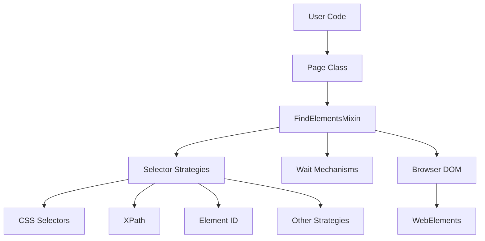
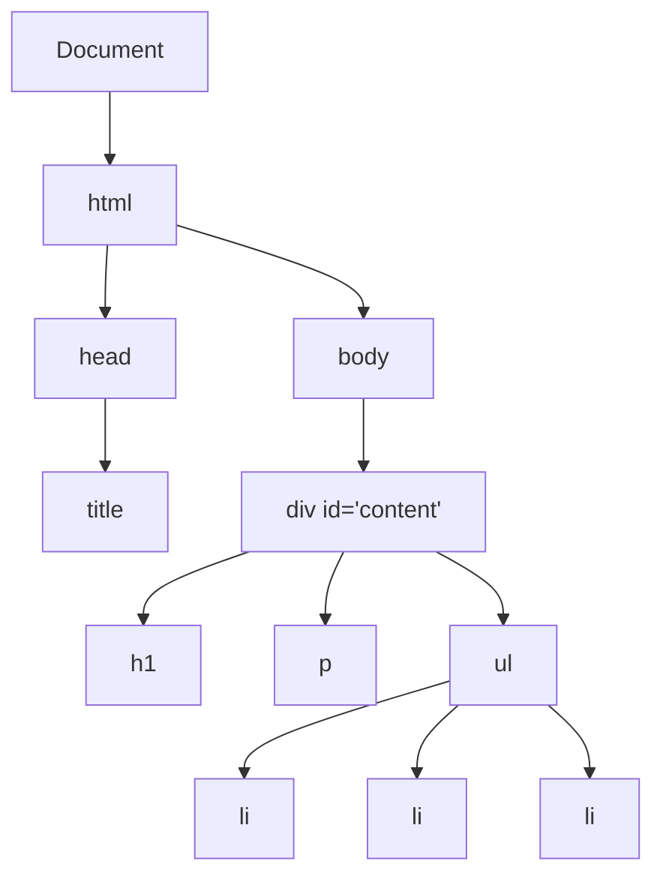
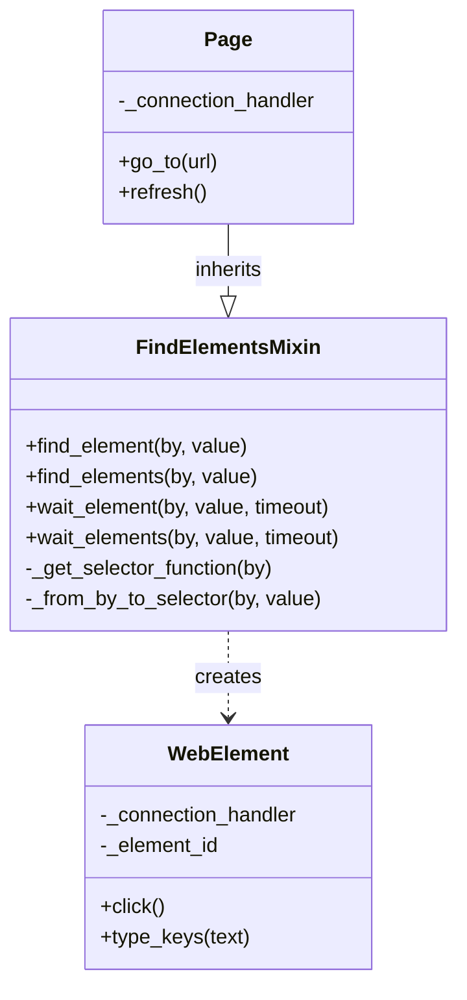

# FindElements Mixin

The FindElementsMixin is a fundamental component in Pydoll's architecture that implements element location strategies using various selector types. This mixin provides the core capabilities for finding and interacting with elements in the DOM, serving as a bridge between high-level automation code and the browser's rendering engine.



## Understanding Mixins in Python

In object-oriented programming, a mixin is a class that provides methods to other classes without being considered a base class. Unlike traditional inheritance where a subclass inherits from a parent class representing an "is-a" relationship, mixins implement a "has-a" capability relationship.

```python
# Example of a mixin in Python
class LoggerMixin:
    def log(self, message):
        print(f"LOG: {message}")
        
    def log_error(self, error):
        print(f"ERROR: {error}")

class DataProcessor(LoggerMixin):
    def process_data(self, data):
        self.log("Processing data...")
        # Process the data
        self.log("Data processing complete")
```

Mixins offer several advantages in complex software architecture:

1. **Code Reuse**: The same functionality can be used by multiple unrelated classes
2. **Separation of Concerns**: Each mixin handles a specific aspect of functionality
3. **Composition Over Inheritance**: Avoids deep inheritance hierarchies
4. **Modularity**: Features can be added or removed independently

!!! info "Mixin vs. Multiple Inheritance"
    While Python supports multiple inheritance, mixins are a specific design pattern within that capability. A mixin is not meant to be instantiated on its own and typically doesn't maintain state. It provides methods that can be used by other classes without establishing an "is-a" relationship.

## The Document Object Model (DOM)

Before diving into element selection strategies, it's important to understand the DOM, which represents the structure of an HTML document as a tree of objects.



The DOM is:

1. **Hierarchical**: Elements nest within other elements, forming parent-child relationships
2. **Manipulable**: JavaScript can modify the structure, content, and styling
3. **Queryable**: Elements can be located using various selection strategies
4. **Event-driven**: Elements can respond to user interactions and other events

### Chrome DevTools Protocol and DOM Access

Pydoll interacts with the DOM through the Chrome DevTools Protocol (CDP), which provides methods for querying and manipulating the document:

| CDP Domain | Purpose | Example Commands |
|------------|---------|------------------|
| DOM | Access to document structure | `querySelector`, `getDocument` |
| Runtime | JavaScript execution in page context | `evaluate`, `callFunctionOn` |
| Page | Page-level operations | `navigate`, `captureScreenshot` |

The CDP allows both direct DOM manipulation through the DOM domain and JavaScript-based interaction through the Runtime domain. FindElementsMixin leverages both approaches for robust element selection.

## Selector Types and Strategies

The FindElementsMixin supports several types of selectors, each with its own strengths and use cases:

### CSS Selectors

CSS selectors are the most common way to locate elements, using the same syntax as CSS stylesheets:

```python
# CSS selector examples
await page.find_element(By.CSS_SELECTOR, "div.content > p.intro")
await page.find_element(By.CSS_SELECTOR, "#login-form input[type='password']")
```

CSS selectors offer:

- **Familiarity**: Web developers already know the syntax
- **Conciseness**: Often shorter than XPath
- **Performance**: Generally faster than XPath in most browsers
- **Specificity**: Can target elements based on attributes, position, and state

Common CSS selector patterns:

| Selector | Description | Example |
|----------|-------------|---------|
| `#id` | Selects by element ID | `#username` |
| `.class` | Selects by class name | `.btn-primary` |
| `element` | Selects by tag name | `div` |
| `parent > child` | Direct child | `form > input` |
| `ancestor descendant` | Any descendant | `form input` |
| `element[attr=value]` | Attribute value | `input[type=password]` |
| `:nth-child(n)` | Positional | `li:nth-child(3)` |
| `:not(selector)` | Negation | `div:not(.hidden)` |

!!! tip "CSS Selector Efficiency"
    For best performance, start your CSS selectors with an ID or a unique attribute when possible. The browser evaluates CSS selectors from right to left, so `#main-content .title` will first find all `.title` elements, then filter for those inside `#main-content`.

### XPath

XPath is a powerful language for navigating XML/HTML documents:

```python
# XPath examples
await page.find_element(By.XPATH, "//div[@id='content']/p[contains(text(), 'Welcome')]")
await page.find_element(By.XPATH, "//button[text()='Submit']")
```

XPath offers:

- **Power**: Can navigate up the DOM tree (unlike CSS selectors)
- **Text Content**: Can select elements based on their text content
- **Axes**: Can select based on relationships (following, preceding, ancestor, etc.)
- **Functions**: Built-in functions for complex matching
- **Logical Operators**: Support for AND, OR and other logical operations

#### Basic XPath Patterns

| Pattern | Description | Example |
|---------|-------------|---------|
| `//tag` | Any tag anywhere | `//div` |
| `/tag` | Direct child of current node | `/html/body` |
| `[@attr='value']` | Attribute condition | `//input[@type='text']` |
| `[text()='text']` | Text content exactly matches | `//button[text()='Submit']` |
| `[contains(@attr, 'value')]` | Attribute contains value | `//div[contains(@class, 'item')]` |
| `[contains(text(), 'text')]` | Text content contains | `//p[contains(text(), 'Welcome')]` |
| `[position()=n]` | Position in parent | `//tr[position()=1]` |
| `parent::tag` | Parent with tag | `//li/parent::ul` |
| `following-sibling::tag` | Following sibling | `//h1/following-sibling::p` |

#### Advanced XPath Techniques

##### Conditional Expressions

XPath supports logical operators for complex conditions:

| Operator | Description | Example |
|----------|-------------|---------|
| `and` | Both conditions must be true | `//input[@type='text' and @required]` |
| `or` | Either condition can be true | `//button[@type='submit' or @class='submit']` |
| `not()` | Negation of a condition | `//input[not(@disabled)]` |
| `|` | Union operator (combines results) | `//button | //input[@type='submit']` |

Consider this HTML example:

```html
<form id="registration">
  <div class="form-group">
    <label for="username">Username</label>
    <input type="text" id="username" name="username" required>
  </div>
  <div class="form-group">
    <label for="email">Email</label>
    <input type="email" id="email" name="email" required>
  </div>
  <div class="form-group">
    <label for="password">Password</label>
    <input type="password" id="password" name="password" required>
  </div>
  <div class="actions">
    <button type="reset" class="btn-secondary">Reset</button>
    <button type="submit" class="btn-primary">Register</button>
  </div>
</form>
```

To select all required text or email inputs:
```python
await page.find_elements(By.XPATH, "//input[(@type='text' or @type='email') and @required]")
```

To select all buttons that are either reset or have the secondary class:
```python
await page.find_elements(By.XPATH, "//button[@type='reset' or contains(@class, 'secondary')]")
```

To select the submit button using the union operator:
```python
await page.find_element(By.XPATH, "//button[@type='submit'] | //input[@type='submit']")
```

##### Ancestor and Other Axes

XPath provides various axes to navigate the DOM in different directions:

| Axis | Description | Example |
|------|-------------|---------|
| `ancestor::` | All ancestors (parent, grandparent, etc.) | `//input[@id='email']/ancestor::form` |
| `ancestor-or-self::` | The node itself and its ancestors | `//div[@class='form-group']/ancestor-or-self::*[@id]` |
| `descendant::` | All descendants (children, grandchildren, etc.) | `//form[@id='registration']/descendant::input` |
| `preceding::` | All nodes that appear before | `//button[@type='submit']/preceding::input` |
| `preceding-sibling::` | Siblings that appear before | `//button[@type='submit']/preceding-sibling::button` |
| `following::` | All nodes that appear after | `//label[@for='username']/following::input` |
| `following-sibling::` | Siblings that appear after | `//button[@type='reset']/following-sibling::button` |

For example, with this HTML structure:

```html
<div id="products">
  <div class="category">
    <h2>Electronics</h2>
    <div class="product" data-id="e1">
      <h3>Smartphone</h3>
      <p class="price">$599</p>
      <p class="description">Latest model with high-resolution camera</p>
      <button class="add-to-cart">Add to Cart</button>
    </div>
    <div class="product" data-id="e2">
      <h3>Laptop</h3>
      <p class="price">$999</p>
      <p class="description">Powerful processor with SSD storage</p>
      <button class="add-to-cart">Add to Cart</button>
    </div>
  </div>
  <div class="category">
    <h2>Books</h2>
    <div class="product" data-id="b1">
      <h3>Python Programming</h3>
      <p class="price">$39</p>
      <p class="description">Learn Python from basics to advanced</p>
      <button class="add-to-cart">Add to Cart</button>
    </div>
  </div>
</div>
```

To find the category that contains a specific product:
```python
await page.find_element(By.XPATH, "//div[@class='product' and contains(.,'Python Programming')]/ancestor::div[@class='category']")
```

To find all products in the same category as the Python book:
```python
await page.find_elements(By.XPATH, "//div[@class='product' and contains(.,'Python Programming')]/ancestor::div[@class='category']/div[@class='product']")
```

To find all prices that come after the Laptop product:
```python
await page.find_elements(By.XPATH, "//div[@class='product' and contains(.,'Laptop')]/following::p[@class='price']")
```

##### Chained Predicates and Functions

XPath allows chaining multiple predicates for precise selection:

```html
<table id="employees">
  <thead>
    <tr>
      <th>ID</th>
      <th>Name</th>
      <th>Department</th>
      <th>Salary</th>
      <th>Start Date</th>
    </tr>
  </thead>
  <tbody>
    <tr>
      <td>1001</td>
      <td>John Smith</td>
      <td>Engineering</td>
      <td>75000</td>
      <td>2019-04-15</td>
    </tr>
    <tr>
      <td>1002</td>
      <td>Maria Garcia</td>
      <td>Marketing</td>
      <td>70000</td>
      <td>2020-08-01</td>
    </tr>
    <tr>
      <td>1003</td>
      <td>Ahmed Khan</td>
      <td>Engineering</td>
      <td>85000</td>
      <td>2018-02-12</td>
    </tr>
  </tbody>
</table>
```

To find employees in Engineering with salary > 80000:
```python
await page.find_elements(
    By.XPATH,
    "//table[@id='employees']//tr[td[3]='Engineering' and number(translate(td[4], '$,', '')) > 80000]"
)
```

To find the newest employee (using date comparison):
```python
await page.find_element(
    By.XPATH,
    "//table[@id='employees']//tr[not(//tr/td[5] > td[5])]"
)
```

##### Dynamic Content and Variable Processing

XPath can be used to extract data from dynamic content structures:

```html
<div id="search-results">
  <div class="result">
    <div class="score">98</div>
    <h3>Result Title 1</h3>
    <div class="metadata">
      <span class="author">User123</span>
      <span class="date">2023-06-15</span>
      <span class="category">Technology</span>
    </div>
  </div>
  <div class="result">
    <div class="score">75</div>
    <h3>Result Title 2</h3>
    <div class="metadata">
      <span class="author">Expert99</span>
      <span class="date">2023-04-22</span>
      <span class="category">Science</span>
    </div>
  </div>
  <!-- More results... -->
</div>
```

To find results with high scores (>=90) in a specific category:
```python
await page.find_elements(
    By.XPATH,
    "//div[@class='result'][number(div[@class='score']) >= 90 and .//span[@class='category']='Technology']"
)
```

To find the most recent result:
```python
await page.find_element(
    By.XPATH,
    "//div[@class='result'][not(//div[@class='result']/div[@class='metadata']/span[@class='date'] > ./div[@class='metadata']/span[@class='date'])]"
)
```

##### Text Manipulation

XPath provides functions to manipulate text content:

```html
<div id="article">
  <h1>Data Analysis with Python</h1>
  <p>This article discusses data analysis techniques using <span class="code">pandas</span> and <span class="code">numpy</span>.</p>
  <div class="section">
    <h2>1. Data Preparation</h2>
    <p>Before analysis, data must be cleaned...</p>
  </div>
  <div class="section">
    <h2>2. Exploratory Analysis</h2>
    <p>Explore patterns using visualization...</p>
  </div>
</div>
```

To find sections with titles containing numbers:
```python
await page.find_elements(
    By.XPATH,
    "//div[@class='section'][contains(translate(h2, '0123456789', '##########'), '#')]"
)
```

To find paragraphs mentioning Python libraries (case-insensitive):
```python
await page.find_elements(
    By.XPATH,
    "//p[contains(translate(., 'ABCDEFGHIJKLMNOPQRSTUVWXYZ', 'abcdefghijklmnopqrstuvwxyz'), 'pandas') or contains(translate(., 'ABCDEFGHIJKLMNOPQRSTUVWXYZ', 'abcdefghijklmnopqrstuvwxyz'), 'numpy')]"
)
```

!!! warning "XPath Performance"
    While extremely powerful, XPath queries can be slower than CSS selectors, especially complex ones. Use CSS selectors for simple cases, and reserve XPath for scenarios that require its unique capabilities.
    
!!! tip "XPath Testing"
    When developing complex XPath expressions, test them in browser DevTools before implementing them in your automation code. In Chrome's DevTools Console, you can use `$x("your xpath here")` to evaluate an XPath expression.

### Other Selector Types

In addition to CSS and XPath, FindElementsMixin supports several convenience selectors:

```python
# ID selector (shorthand for CSS #id)
await page.find_element(By.ID, "username")

# Class name (shorthand for CSS .classname)
await page.find_element(By.CLASS_NAME, "submit-button")

# Tag name (shorthand for CSS tagname)
await page.find_element(By.TAG_NAME, "button")

# Link text (finds <a> elements by their text)
await page.find_element(By.LINK_TEXT, "Click here")

# Partial link text
await page.find_element(By.PARTIAL_LINK_TEXT, "Click")

# Name attribute (shorthand for CSS [name='value'])
await page.find_element(By.NAME, "username")
```

These specialized selectors offer:

- **Simplicity**: More readable for common cases
- **Optimization**: Some browsers optimize certain selector types internally
- **Specificity**: Communicate intent clearly in the code

## FindElementsMixin Architecture

The FindElementsMixin implements element location strategies through a combination of CDP commands and appropriate waiting mechanisms:



The mixin implements several key methods:

1. **find_element**: Finds the first matching element
2. **find_elements**: Finds all matching elements
3. **wait_element**: Waits for an element to appear with a timeout
4. **wait_elements**: Waits for multiple elements to appear

### Selector Strategy Implementation

Internally, the mixin converts the `By` enum and value into the appropriate CDP command:

```python
def _from_by_to_selector(self, by: By, value: str) -> str:
    """Converts a By enum and value to the appropriate selector string."""
    if by == By.ID:
        return f'#{value}'
    elif by == By.CLASS_NAME:
        return f'.{value}'
    elif by == By.TAG_NAME:
        return value
    # ... other conversions
    else:
        return value  # CSS_SELECTOR and XPATH use the value directly
```

Each search method then uses the appropriate CDP domain command:

- **For CSS Selectors**: `DOM.querySelector` or `DOM.querySelectorAll`
- **For XPath**: `Runtime.evaluate` with an XPath evaluation function
- **For other selectors**: Converted to CSS then using DOM methods

!!! info "CDP Command Selection"
    FindElementsMixin intelligently selects the most efficient CDP command based on the selector type. For example, using `DOM.querySelector` for CSS but falling back to JavaScript execution for XPath which is not directly supported by the DOM domain.

## Waiting Mechanisms

A crucial aspect of web automation is handling the asynchronous nature of web pages. FindElementsMixin implements sophisticated waiting mechanisms:

```python
async def wait_element(
    self, by: By, value: str, timeout: int = 10, raise_exc: bool = True
) -> Optional[WebElement]:
    """
    Waits for an element to be present on the page.
    
    Args:
        by: The method to locate the element
        value: The selector value
        timeout: Maximum time to wait in seconds
        raise_exc: Whether to raise exception if element not found
        
    Returns:
        WebElement if found, None otherwise (if raise_exc is False)
        
    Raises:
        ElementNotFound: If the element is not found within timeout
    """
    start_time = time.time()
    while time.time() - start_time < timeout:
        element = await self.find_element(by, value, raise_exc=False)
        if element:
            return element
        await asyncio.sleep(0.1)
        
    if raise_exc:
        raise ElementNotFound(f"Element not found with {by}: {value}")
    return None
```

The waiting logic provides:

1. **Polling**: Periodically checks for the element
2. **Timeout Management**: Limits the maximum wait time
3. **Configurability**: Allows customizing behavior when elements aren't found
4. **Exception Handling**: Clear error messages when timeouts occur

!!! tip "Effective Waiting Strategies"
    When designing robust automation, choose appropriate timeouts based on:
    
    - **Page Load Speed**: Slower sites need longer timeouts
    - **Network Conditions**: Consider variability in connection speeds
    - **Application Behavior**: Some elements appear after client-side rendering
    - **Critical Path**: Key elements may need longer timeouts than optional ones

## Element Creation

Once elements are located, FindElementsMixin creates WebElement instances to represent them:

```python
async def find_element(
    self, by: By, value: str, raise_exc: bool = True
) -> Optional[WebElement]:
    """
    Finds an element on the page using the specified locator strategy.
    
    Args:
        by: The method to locate the element
        value: The selector value
        raise_exc: Whether to raise exception if element not found
        
    Returns:
        WebElement if found, None otherwise (if raise_exc is False)
        
    Raises:
        ElementNotFound: If the element is not found and raise_exc is True
    """
    selector = self._from_by_to_selector(by, value)
    selector_function = self._get_selector_function(by)
    
    result = await selector_function(selector)
    if not result:
        if raise_exc:
            raise ElementNotFound(f"Element not found with {by}: {value}")
        return None
        
    # Create WebElement from result data
    return WebElement(self._connection_handler, result['nodeId'], result['objectId'])
```

This pattern demonstrates the factory method design pattern, where the mixin creates WebElement instances but doesn't tightly couple to the details of how those elements work.

## Selector Translation to CDP

Under the hood, FindElementsMixin translates high-level selector concepts into specific CDP commands:

| Selector Type | CDP Command | JavaScript Fallback |
|---------------|-------------|---------------------|
| CSS Selector | `DOM.querySelector` | `document.querySelector()` |
| XPath | N/A (not directly supported) | `document.evaluate()` |
| ID | `DOM.querySelector` | `document.getElementById()` |
| Class Name | `DOM.querySelectorAll` | `document.getElementsByClassName()` |
| Tag Name | `DOM.querySelectorAll` | `document.getElementsByTagName()` |

The mixin chooses the most efficient approach based on the capabilities of CDP and the browser:

```python
async def _find_by_xpath(self, xpath: str):
    """Finds an element using XPath via JavaScript execution."""
    result = await self._execute_command(
        RuntimeCommands.evaluate_script(
            """
            function getElementByXpath(path) {
              return document.evaluate(
                path, document, null, XPathResult.FIRST_ORDERED_NODE_TYPE, null
              ).singleNodeValue;
            }
            return getElementByXpath(arguments[0]);
            """,
            arguments=[xpath]
        )
    )
    # Process result...
```

!!! info "Performance Considerations"
    The FindElementsMixin optimizes element location based on selector type:
    
    - CSS selectors use direct DOM API calls when possible
    - XPath requires JavaScript execution, which is slightly slower
    - ID lookups are typically the fastest across all browsers
    - Complex selectors may require more processing time

## Conclusion

The FindElementsMixin serves as a critical bridge between Pydoll's high-level automation API and the browser's DOM. By understanding its design and capabilities, you gain insight into how element location works in modern browser automation.

The mixin showcases several important design principles:

1. **Separation of Concerns**: Element location is isolated from other page functionality
2. **Abstraction**: Complex CDP interactions are hidden behind a simple API
3. **Composability**: The mixin can be used by any class needing element location
4. **Robustness**: Built-in waiting mechanisms handle asynchronous page behavior

When combined with the Page and WebElement domains, FindElementsMixin creates a powerful and intuitive API for browser automation that handles the complexities of DOM interaction. 