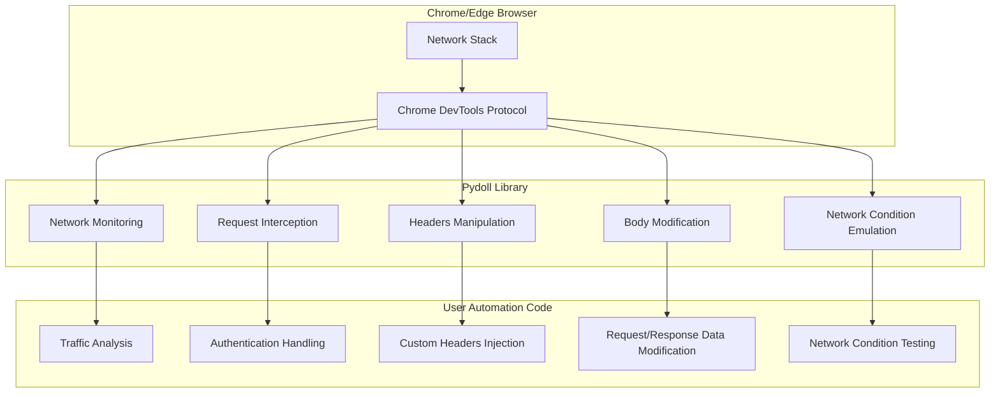
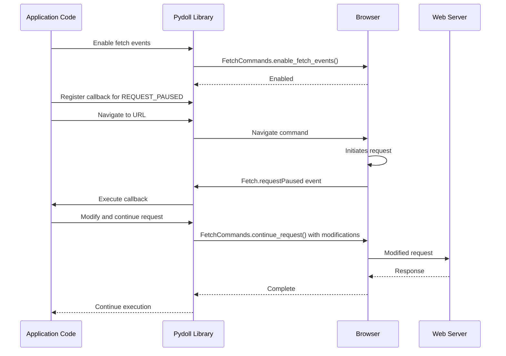

# Network Capabilities

Pydoll provides powerful capabilities for monitoring, intercepting, and manipulating network traffic during browser automation. These features give you fine-grained control over how your browser communicates with the web, enabling advanced use cases like request modification, response analysis, and network optimization.

## Network Architecture Overview

Pydoll's network capabilities are built on top of the Chrome DevTools Protocol (CDP), which provides a direct interface to the browser's internal networking stack. This architecture eliminates the limitations of traditional proxy-based approaches and enables real-time monitoring and modification of requests and responses.



The network capabilities in Pydoll can be organized into two main categories:

1. **Network Monitoring**: Passive observation of network activity
2. **Request Interception**: Active modification of network requests and responses

## Network Monitoring

Network monitoring allows you to observe and analyze the network activity of your browser session without modifying it. This is useful for understanding how a website loads resources, detecting API endpoints, or troubleshooting performance issues.

### Enabling Network Monitoring

To start monitoring network activity, you need to enable network events:

```python
import asyncio
from pydoll.browser.chrome import Chrome
from pydoll.events.network import NetworkEvents
from functools import partial

async def main():
    async with Chrome() as browser:
        await browser.start()
        page = await browser.get_page()
        
        # Enable network monitoring
        await page.enable_network_events()
        
        # Navigate to a page
        await page.go_to('https://example.com')
        
        # Retrieve network logs
        logs = await page.get_network_logs()
        print(f"Captured {len(logs)} network requests")
        
asyncio.run(main())
```

When you enable network events, Pydoll automatically captures information about all network requests, including:

- URLs
- HTTP methods
- Request headers
- Status codes
- Response sizes
- Content types
- Timing information

### Network Event Callbacks

You can register callbacks to be notified about specific network events in real-time:

```python
from pydoll.events.network import NetworkEvents
from functools import partial

# Define a callback to handle request events
async def on_request(page, event):
    url = event['params']['request']['url']
    method = event['params']['request']['method']
    
    print(f"{method} request to: {url}")
    
    # You can access request headers
    headers = event['params']['request'].get('headers', {})
    if 'content-type' in headers:
        print(f"Content-Type: {headers['content-type']}")

# Define a callback to handle response events
async def on_response(page, event):
    url = event['params']['response']['url']
    status = event['params']['response']['status']
    
    print(f"Response from {url}: Status {status}")
    
    # Extract response timing information
    timing = event['params']['response'].get('timing')
    if timing:
        total_time = timing['receiveHeadersEnd'] - timing['requestTime']
        print(f"Request completed in {total_time:.2f}s")

# Register the callbacks
await page.enable_network_events()
await page.on(NetworkEvents.REQUEST_WILL_BE_SENT, partial(on_request, page))
await page.on(NetworkEvents.RESPONSE_RECEIVED, partial(on_response, page))
```

### Key Network Events

Pydoll provides access to a wide range of network-related events:

| Event Constant | Description | Useful Information Available |
|----------------|-------------|------------------------------|
| `NetworkEvents.REQUEST_WILL_BE_SENT` | Fired when a request is about to be sent | URL, method, headers, POST data |
| `NetworkEvents.RESPONSE_RECEIVED` | Fired when HTTP response is received | Status code, headers, MIME type, timing |
| `NetworkEvents.LOADING_FAILED` | Fired when a request fails | Error information, canceled status |
| `NetworkEvents.LOADING_FINISHED` | Fired when a request completes | Encoding, compressed data size |
| `NetworkEvents.RESOURCE_CHANGED_PRIORITY` | Fired when resource loading priority changes | New priority level |
| `NetworkEvents.WEBSOCKET_CREATED` | Fired when a WebSocket is created | URL, initiator |
| `NetworkEvents.WEBSOCKET_FRAME_SENT` | Fired when a WebSocket frame is sent | Payload data |
| `NetworkEvents.WEBSOCKET_FRAME_RECEIVED` | Fired when a WebSocket frame is received | Response data |

### Retrieving Response Bodies

One of the most powerful features of Pydoll's network monitoring is the ability to retrieve the actual content of responses:

```python
import asyncio
import json
from pydoll.browser.chrome import Chrome
from pydoll.events.network import NetworkEvents
from functools import partial

async def main():
    async with Chrome() as browser:
        await browser.start()
        page = await browser.get_page()
        
        # Enable network events
        await page.enable_network_events()
        
        # Track API requests
        api_request_ids = []
        
        async def track_api_request(page, event):
            if '/api/' in event['params']['request']['url']:
                request_id = event['params']['requestId']
                api_request_ids.append(request_id)
        
        await page.on(
            NetworkEvents.REQUEST_WILL_BE_SENT, 
            partial(track_api_request, page)
        )
        
        # Navigate to a page with API calls
        await page.go_to('https://example.com/data-heavy-page')
        
        # Wait a moment for requests to complete
        await asyncio.sleep(3)
        
        # Fetch response bodies for API requests
        for request_id in api_request_ids:
            try:
                body, is_base64 = await page.get_network_response_body(request_id)
                
                # Parse JSON responses
                if not is_base64 and body:
                    try:
                        data = json.loads(body)
                        print(f"API Response Data: {json.dumps(data, indent=2)[:200]}...")
                    except json.JSONDecodeError:
                        print(f"Non-JSON response: {body[:100]}...")
            except Exception as e:
                print(f"Error retrieving response for request {request_id}: {e}")
        
        # Alternative: use the built-in method to get responses matching a pattern
        api_responses = await page.get_network_response_bodies(matches=['api'])
        print(f"Found {len(api_responses)} API responses")
        
asyncio.run(main())
```

The `get_network_response_body` method retrieves the complete response body for a specific request, while `get_network_response_bodies` is a convenience method that retrieves response bodies for all requests matching a URL pattern.

### Filtering Network Logs

You can filter network logs to focus on specific requests:

```python
# Get all network logs
all_logs = await page.get_network_logs()

# Filter logs by URL pattern
api_logs = await page.get_network_logs(matches=['api'])
image_logs = await page.get_network_logs(matches=['.jpg', '.png', '.gif'])
```

This filtering capability is particularly useful when analyzing complex web applications with many network requests.

## Request Interception and Modification

Request interception is where Pydoll's network capabilities truly shine. Unlike traditional browser automation tools that can only observe network traffic, Pydoll allows you to intercept and modify network requests before they are sent.

### The Fetch Domain

The Fetch domain in the Chrome DevTools Protocol provides advanced functionality for intercepting and manipulating network requests. Pydoll exposes this functionality through a clean API that makes it easy to implement complex network manipulation scenarios.



### Enabling Request Interception

To intercept requests, you need to enable the Fetch domain:

```python
import asyncio
from pydoll.browser.chrome import Chrome
from pydoll.events.fetch import FetchEvents
from pydoll.commands.fetch import FetchCommands
from functools import partial

async def main():
    async with Chrome() as browser:
        await browser.start()
        page = await browser.get_page()
        
        # Define a request interceptor
        async def intercept_request(page, event):
            request_id = event['params']['requestId']
            request = event['params']['request']
            url = request['url']
            
            print(f"Intercepted request to: {url}")
            
            # You must continue the request to proceed
            await page._execute_command(
                FetchCommands.continue_request(request_id)
            )
        
        # Enable fetch events and register the interceptor
        await page.enable_fetch_events()
        await page.on(
            FetchEvents.REQUEST_PAUSED, 
            partial(intercept_request, page)
        )
        
        # Navigate to a page
        await page.go_to('https://example.com')
        
asyncio.run(main())
```

!!! warning "Always Continue Intercepted Requests"
    When intercepting requests, you must always call `FetchCommands.continue_request()` to proceed with the request, either with modifications or as is. If you don't, the browser will hang, waiting for a resolution of the intercepted request.

### Interception Scope and Resource Types

You can limit the scope of request interception to specific resource types:

```python
# Intercept all requests (could be resource-intensive)
await page.enable_fetch_events(resource_type='')

# Intercept only document (HTML) requests
await page.enable_fetch_events(resource_type='Document')

# Intercept only XHR/fetch API requests
await page.enable_fetch_events(resource_type='XHR')

# Intercept only image requests
await page.enable_fetch_events(resource_type='Image')
```

Resource types available for interception:

| Resource Type | Description | Common Examples |
|---------------|-------------|----------------|
| `Document` | Main HTML documents | HTML pages, iframes |
| `Stylesheet` | CSS files | .css files |
| `Image` | Image resources | .jpg, .png, .gif, .webp |
| `Media` | Media files | .mp4, .webm, audio files |
| `Font` | Font files | .woff, .woff2, .ttf |
| `Script` | JavaScript files | .js files |
| `TextTrack` | Text track files | .vtt, .srt (captions, subtitles) |
| `XHR` | XMLHttpRequest calls | API calls, AJAX requests |
| `Fetch` | Fetch API requests | Modern API calls |
| `EventSource` | Server-sent events | Stream connections |
| `WebSocket` | WebSocket connections | Real-time communications |
| `Manifest` | Web app manifests | .webmanifest files |
| `Other` | Other resource types | Miscellaneous resources |

### Request Modification Capabilities

When intercepting requests, you can modify various aspects of the request before it's sent to the server:

#### 1. Modifying URL and Method

```python
async def redirect_request(page, event):
    request_id = event['params']['requestId']
    request = event['params']['request']
    url = request['url']
    
    # Redirect requests for one domain to another
    if 'old-domain.com' in url:
        new_url = url.replace('old-domain.com', 'new-domain.com')
        print(f"Redirecting {url} to {new_url}")
        
        await page._execute_command(
            FetchCommands.continue_request(
                request_id=request_id,
                url=new_url
            )
        )
    # Change GET to POST for specific endpoints
    elif '/api/data' in url and request['method'] == 'GET':
        print(f"Converting GET to POST for {url}")
        
        await page._execute_command(
            FetchCommands.continue_request(
                request_id=request_id,
                method='POST'
            )
        )
    else:
        # Continue normally
        await page._execute_command(
            FetchCommands.continue_request(request_id)
        )
```

#### 2. Adding or Modifying Headers

```python
async def inject_headers(page, event):
    request_id = event['params']['requestId']
    request = event['params']['request']
    url = request['url']
    
    # Get existing headers
    headers = request.get('headers', {})
    
    # Add or modify headers
    custom_headers = {
        **headers,  # Keep existing headers
        'X-Custom-Header': 'CustomValue',
        'Authorization': 'Bearer your-token-here',
        'User-Agent': 'Custom User Agent String',
    }
    
    await page._execute_command(
        FetchCommands.continue_request(
            request_id=request_id,
            headers=custom_headers
        )
    )
```

#### 3. Modifying Request Body

```python
async def modify_post_data(page, event):
    request_id = event['params']['requestId']
    request = event['params']['request']
    url = request['url']
    method = request['method']
    
    # Only process POST requests to specific endpoints
    if method == 'POST' and '/api/submit' in url:
        # Get the original post data, if any
        original_post_data = request.get('postData', '{}')
        
        try:
            # Parse the original data
            data = json.loads(original_post_data)
            
            # Modify the data
            data['additionalField'] = 'injected-value'
            data['timestamp'] = int(time.time())
            
            # Convert back to string
            modified_post_data = json.dumps(data)
            
            print(f"Modified POST data for {url}")
            
            await page._execute_command(
                FetchCommands.continue_request(
                    request_id=request_id,
                    post_data=modified_post_data
                )
            )
        except json.JSONDecodeError:
            # If not JSON, continue normally
            await page._execute_command(
                FetchCommands.continue_request(request_id)
            )
    else:
        # Continue normally for non-POST requests
        await page._execute_command(
            FetchCommands.continue_request(request_id)
        )
```

### Authentication Handling

The Fetch domain can also intercept authentication challenges, allowing you to automatically handle HTTP authentication:

```python
async def main():
    async with Chrome() as browser:
        await browser.start()
        page = await browser.get_page()
        
        # Define authentication handler
        async def handle_auth(page, event):
            request_id = event['params']['requestId']
            auth_challenge = event['params']['authChallenge']
            
            print(f"Authentication required: {auth_challenge['origin']}")
            
            # Provide credentials
            await page._execute_command(
                FetchCommands.continue_request_with_auth(
                    request_id=request_id,
                    proxy_username="username",
                    proxy_password="password"
                )
            )
        
        # Enable fetch events with auth handling
        await page.enable_fetch_events(handle_auth=True)
        await page.on(
            FetchEvents.AUTH_REQUIRED, 
            partial(handle_auth, page)
        )
        
        # Navigate to a page requiring authentication
        await page.go_to('https://protected-site.com')
```

## Advanced Network Monitoring Patterns

### Creating a Network Activity Dashboard

You can combine network monitoring with event handling to create a real-time dashboard of network activity:

```python
import asyncio
import time
from pydoll.browser.chrome import Chrome
from pydoll.events.network import NetworkEvents
from functools import partial

async def main():
    # Statistics counters
    stats = {
        'total_requests': 0,
        'completed_requests': 0,
        'failed_requests': 0,
        'bytes_received': 0,
        'request_types': {},
        'status_codes': {},
        'domains': {},
        'start_time': time.time()
    }
    
    async def update_dashboard():
        while True:
            # Calculate elapsed time
            elapsed = time.time() - stats['start_time']
            
            # Clear console and print stats
            print("\033c", end="")  # Clear console
            print(f"Network Activity Dashboard - Running for {elapsed:.1f}s")
            print(f"Total Requests: {stats['total_requests']}")
            print(f"Completed: {stats['completed_requests']} | Failed: {stats['failed_requests']}")
            print(f"Data Received: {stats['bytes_received'] / 1024:.1f} KB")
            
            print("\nRequest Types:")
            for rtype, count in sorted(stats['request_types'].items(), key=lambda x: x[1], reverse=True):
                print(f"  {rtype}: {count}")
            
            print("\nStatus Codes:")
            for code, count in sorted(stats['status_codes'].items()):
                print(f"  {code}: {count}")
            
            print("\nTop Domains:")
            top_domains = sorted(stats['domains'].items(), key=lambda x: x[1], reverse=True)[:5]
            for domain, count in top_domains:
                print(f"  {domain}: {count}")
            
            await asyncio.sleep(1)
    
    # Start the dashboard updater task
    dashboard_task = asyncio.create_task(update_dashboard())
    
    async with Chrome() as browser:
        await browser.start()
        page = await browser.get_page()
        
        # Track request starts
        async def on_request_sent(page, event):
            stats['total_requests'] += 1
            
            # Track request type
            resource_type = event['params'].get('type', 'Other')
            stats['request_types'][resource_type] = stats['request_types'].get(resource_type, 0) + 1
            
            # Track domain
            url = event['params']['request']['url']
            try:
                from urllib.parse import urlparse
                domain = urlparse(url).netloc
                stats['domains'][domain] = stats['domains'].get(domain, 0) + 1
            except:
                pass
        
        # Track responses
        async def on_response(page, event):
            status = event['params']['response']['status']
            stats['status_codes'][status] = stats['status_codes'].get(status, 0) + 1
        
        # Track request completions
        async def on_loading_finished(page, event):
            stats['completed_requests'] += 1
            if 'encodedDataLength' in event['params']:
                stats['bytes_received'] += event['params']['encodedDataLength']
        
        # Track failures
        async def on_loading_failed(page, event):
            stats['failed_requests'] += 1
        
        # Register callbacks
        await page.enable_network_events()
        await page.on(NetworkEvents.REQUEST_WILL_BE_SENT, partial(on_request_sent, page))
        await page.on(NetworkEvents.RESPONSE_RECEIVED, partial(on_response, page))
        await page.on(NetworkEvents.LOADING_FINISHED, partial(on_loading_finished, page))
        await page.on(NetworkEvents.LOADING_FAILED, partial(on_loading_failed, page))
        
        # Navigate to a page with lots of requests
        await page.go_to('https://news.ycombinator.com')
        
        # Wait for user to press Enter to exit
        await asyncio.sleep(60)
    
    # Clean up
    dashboard_task.cancel()

asyncio.run(main())
```

### API Traffic Analysis

You can use network monitoring to analyze API traffic patterns:

```python
import asyncio
import json
from pydoll.browser.chrome import Chrome
from pydoll.events.network import NetworkEvents
from functools import partial

async def analyze_api_traffic():
    api_calls = []
    
    async with Chrome() as browser:
        await browser.start()
        page = await browser.get_page()
        
        # Track API requests
        async def track_api(page, event, request_type='request'):
            if '/api/' in event['params']['request']['url']:
                # Create a new tracking entry for requests
                if request_type == 'request':
                    request_id = event['params']['requestId']
                    request = event['params']['request']
                    
                    api_calls.append({
                        'id': request_id,
                        'url': request['url'],
                        'method': request['method'],
                        'timestamp': event['params'].get('timestamp', 0),
                        'headers': request.get('headers', {}),
                        'postData': request.get('postData'),
                        'status': None,
                        'responseHeaders': None,
                        'responseBody': None,
                        'duration': None
                    })
                
                # Update existing entries with response data
                elif request_type == 'response':
                    request_id = event['params']['requestId']
                    response = event['params']['response']
                    
                    # Find the matching request
                    for call in api_calls:
                        if call['id'] == request_id:
                            call['status'] = response['status']
                            call['responseHeaders'] = response.get('headers', {})
                            
                            # Calculate request duration if timing info is available
                            if 'timing' in response:
                                start = response['timing'].get('requestTime', 0) * 1000
                                end = response['timing'].get('receiveHeadersEnd', 0)
                                call['duration'] = end - start
        
        # Register event handlers
        await page.enable_network_events()
        await page.on(
            NetworkEvents.REQUEST_WILL_BE_SENT, 
            partial(track_api, page, request_type='request')
        )
        await page.on(
            NetworkEvents.RESPONSE_RECEIVED, 
            partial(track_api, page, request_type='response')
        )
        
        # Navigate to the page and wait for activity
        await page.go_to('https://example.com/app')
        await asyncio.sleep(10)  # Wait for API activity
        
        # Fetch response bodies for the API calls
        for call in api_calls:
            try:
                body, is_base64 = await page.get_network_response_body(call['id'])
                if not is_base64:
                    try:
                        call['responseBody'] = json.loads(body)
                    except:
                        call['responseBody'] = body
            except Exception as e:
                print(f"Error retrieving response body: {e}")
        
        # Analyze the API calls
        print(f"Found {len(api_calls)} API calls")
        
        # Group by endpoint
        endpoints = {}
        for call in api_calls:
            url = call['url']
            endpoint = url.split('/api/')[1].split('?')[0]  # Extract endpoint path
            
            if endpoint not in endpoints:
                endpoints[endpoint] = []
            endpoints[endpoint].append(call)
        
        # Print summary of endpoints
        for endpoint, calls in endpoints.items():
            avg_time = sum(c['duration'] for c in calls if c['duration']) / len(calls) if calls else 0
            success_rate = sum(1 for c in calls if 200 <= c.get('status', 0) < 300) / len(calls) if calls else 0
            
            print(f"\nEndpoint: /api/{endpoint}")
            print(f"  Calls: {len(calls)}")
            print(f"  Methods: {set(c['method'] for c in calls)}")
            print(f"  Avg Response Time: {avg_time:.2f}ms")
            print(f"  Success Rate: {success_rate:.1%}")
        
        return api_calls

# Run the analysis
asyncio.run(analyze_api_traffic())
```

## Performance Considerations

While Pydoll's network capabilities are powerful, there are some performance considerations to keep in mind:

1. **Selective Interception**: Intercepting all requests can significantly slow down page loading. Be selective about which resource types you intercept.

2. **Memory Management**: Network logs can consume a significant amount of memory for pages with many requests. Consider clearing logs periodically.

3. **Callback Efficiency**: Keep your event callbacks efficient, especially for high-frequency events like network requests. Inefficient callbacks can slow down the entire automation process.

4. **Cleanup**: Always disable network and fetch events when you're done using them to prevent memory leaks.

```python
# Enable events only when needed
await page.enable_network_events()
await page.enable_fetch_events(resource_type='XHR')  # Only intercept XHR requests

# Do your automation work...

# Clean up when done
await page.disable_network_events()
await page.disable_fetch_events()
```

## Best Practices

### 1. Use Resource Type Filtering Effectively

```python
# Bad: Intercept all requests (performance impact)
await page.enable_fetch_events(resource_type='')

# Good: Only intercept the specific resource types you need
await page.enable_fetch_events(resource_type='XHR')  # For API calls
await page.enable_fetch_events(resource_type='Document')  # For main documents
```

### 2. Always Continue Intercepted Requests

```python
# Always continue every intercepted request
async def intercept_handler(page, event):
    request_id = event['params']['requestId']
    
    # Make any modifications needed
    custom_headers = { ... }
    
    # Continue the request
    await page._execute_command(
        FetchCommands.continue_request(
            request_id=request_id,
            headers=custom_headers
        )
    )
```

### 3. Implement Proper Error Handling

```python
async def safe_network_handler(page, event):
    try:
        # Your interception logic here
        request_id = event['params']['requestId']
        # ...
        await page._execute_command(FetchCommands.continue_request(request_id))
    except Exception as e:
        print(f"Error in request handler: {e}")
        # Try to continue the request even if there was an error
        try:
            request_id = event['params']['requestId']
            await page._execute_command(FetchCommands.continue_request(request_id))
        except:
            pass
```

### 4. Use Partial for Clean Callback Management

```python
from functools import partial

# Define your handler with page object as first parameter
async def handle_request(page, config, event):
    # Now you have access to both page and custom config
    
# Register with partial to pre-bind parameters
config = {"headers_to_add": {"X-Custom": "Value"}}
await page.on(
    FetchEvents.REQUEST_PAUSED, 
    partial(handle_request, page, config)
)
```

## Conclusion

Pydoll's network capabilities provide unprecedented control over browser network traffic, enabling advanced use cases that go beyond traditional browser automation. Whether you're monitoring API calls, injecting custom headers, or modifying request data, these features can greatly enhance your automation workflows.

By leveraging the power of the Chrome DevTools Protocol, Pydoll makes it easy to implement sophisticated network monitoring and interception patterns while maintaining high performance and reliability.

Remember to use these capabilities responsibly and consider the performance implications of extensive network monitoring and interception in your automation scripts.
