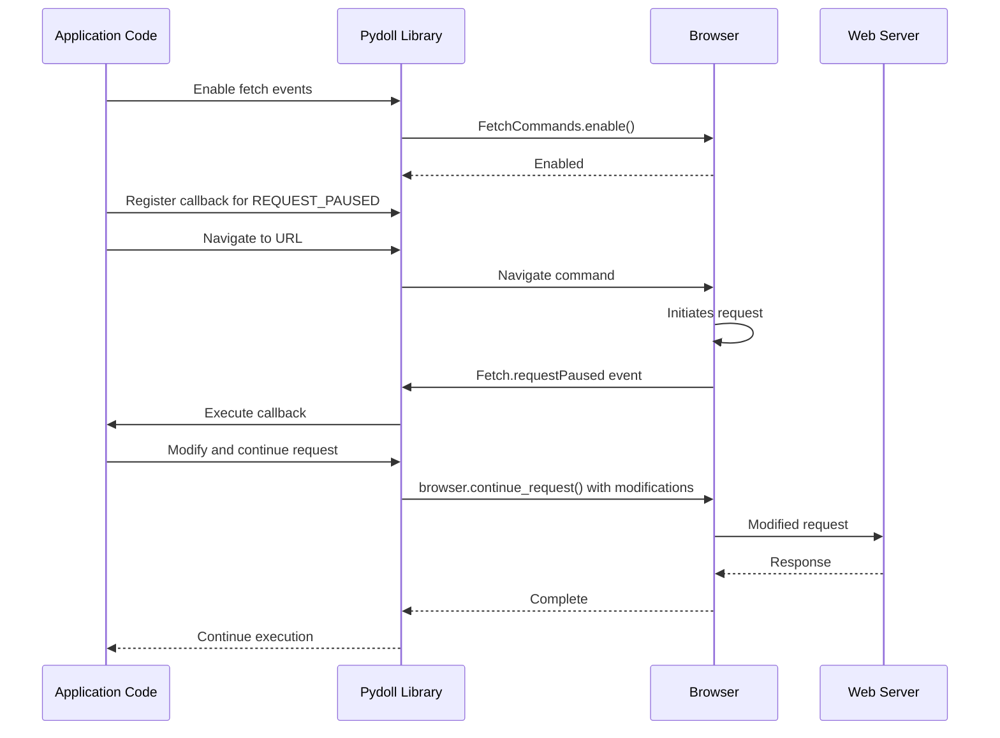

# Network Capabilities

Pydoll provides powerful capabilities for monitoring, intercepting, and manipulating network traffic during browser automation. These features give you fine-grained control over how your browser communicates with the web, enabling advanced use cases like request modification, response analysis, and network optimization.

## Network Architecture Overview

Pydoll's network capabilities are built on top of the Chrome DevTools Protocol (CDP), which provides a direct interface to the browser's internal networking stack. This architecture eliminates the limitations of traditional proxy-based approaches and enables real-time monitoring and modification of requests and responses.


The network capabilities in Pydoll can be organized into two main categories:

1. **Network Monitoring**: Passive observation of network activity
2. **Request Interception**: Active modification of network requests and responses

## Network Monitoring

Network monitoring allows you to observe and analyze the network activity of your browser session without modifying it. This is useful for understanding how a website loads resources, detecting API endpoints, or troubleshooting performance issues.

### Enabling Network Monitoring

To start monitoring network activity, you need to enable network events:

```python
import asyncio
from pydoll.browser.chromium import Chrome
from pydoll.protocol.network.events import NetworkEvent
from functools import partial

async def main():
    async with Chrome() as browser:
        tab = await browser.start()
        
        # Enable network monitoring
        await tab.enable_network_events()
        
        # Navigate to a page
        await tab.go_to('https://example.com')
        
        print("Network monitoring enabled and page loaded")
        
asyncio.run(main())
```

When you enable network events, Pydoll automatically captures information about all network requests, including:

- URLs
- HTTP methods
- Request headers
- Status codes
- Response sizes
- Content types
- Timing information

### Network Event Callbacks

You can register callbacks to be notified about specific network events in real-time:

```python
from pydoll.protocol.network.events import NetworkEvent
from functools import partial

# Define a callback to handle request events
async def on_request(tab, event):
    url = event['params']['request']['url']
    method = event['params']['request']['method']
    
    print(f"{method} request to: {url}")
    
    # You can access request headers
    headers = event['params']['request'].get('headers', {})
    if 'content-type' in headers:
        print(f"Content-Type: {headers['content-type']}")

# Define a callback to handle response events
async def on_response(tab, event):
    url = event['params']['response']['url']
    status = event['params']['response']['status']
    
    print(f"Response from {url}: Status {status}")
    
    # Extract response timing information
    timing = event['params']['response'].get('timing')
    if timing:
        total_time = timing['receiveHeadersEnd'] - timing['requestTime']
        print(f"Request completed in {total_time:.2f}s")

async def main():
    async with Chrome() as browser:
        tab = await browser.start()
        
        # Register the callbacks
        await tab.enable_network_events()
        await tab.on(NetworkEvent.REQUEST_WILL_BE_SENT, partial(on_request, tab))
        await tab.on(NetworkEvent.RESPONSE_RECEIVED, partial(on_response, tab))
        
        # Navigate to trigger network activity
        await tab.go_to('https://example.com')
        
        # Wait to see network activity
        await asyncio.sleep(5)

asyncio.run(main())
```

### Key Network Events

Pydoll provides access to a wide range of network-related events:

| Event Constant | Description | Useful Information Available |
|----------------|-------------|------------------------------|
| `NetworkEvent.REQUEST_WILL_BE_SENT` | Fired when a request is about to be sent | URL, method, headers, POST data |
| `NetworkEvent.RESPONSE_RECEIVED` | Fired when HTTP response is available | Status code, headers, MIME type, timing |
| `NetworkEvent.LOADING_FAILED` | Fired when a request fails | Error information, canceled status |
| `NetworkEvent.LOADING_FINISHED` | Fired when a request completes | Encoding, compressed data size |
| `NetworkEvent.RESOURCE_CHANGED_PRIORITY` | Fired when resource loading priority changes | New priority level |
| `NetworkEvent.WEBSOCKET_CREATED` | Fired when a WebSocket is created | URL, initiator |
| `NetworkEvent.WEBSOCKET_FRAME_SENT` | Fired when a WebSocket frame is sent | Payload data |
| `NetworkEvent.WEBSOCKET_FRAME_RECEIVED` | Fired when a WebSocket frame is received | Response data |

### Advanced Network Monitoring Example

Here's a more comprehensive example that tracks various network metrics:

```python
import asyncio
import time
from pydoll.browser.chromium import Chrome
from pydoll.protocol.network.events import NetworkEvent
from functools import partial

async def main():
    # Statistics counters
    stats = {
        'total_requests': 0,
        'completed_requests': 0,
        'failed_requests': 0,
        'bytes_received': 0,
        'request_types': {},
        'status_codes': {},
        'domains': {},
        'start_time': time.time()
    }
    
    async def update_dashboard():
        while True:
            # Calculate elapsed time
            elapsed = time.time() - stats['start_time']
            
            # Clear console and print stats
            print("\033c", end="")  # Clear console
            print(f"Network Activity Dashboard - Running for {elapsed:.1f}s")
            print(f"Total Requests: {stats['total_requests']}")
            print(f"Completed: {stats['completed_requests']} | Failed: {stats['failed_requests']}")
            print(f"Data Received: {stats['bytes_received'] / 1024:.1f} KB")
            
            print("\nRequest Types:")
            for rtype, count in sorted(stats['request_types'].items(), key=lambda x: x[1], reverse=True):
                print(f"  {rtype}: {count}")
            
            print("\nStatus Codes:")
            for code, count in sorted(stats['status_codes'].items()):
                print(f"  {code}: {count}")
            
            print("\nTop Domains:")
            top_domains = sorted(stats['domains'].items(), key=lambda x: x[1], reverse=True)[:5]
            for domain, count in top_domains:
                print(f"  {domain}: {count}")
            
            await asyncio.sleep(1)
    
    # Start the dashboard updater task
    dashboard_task = asyncio.create_task(update_dashboard())
    
    async with Chrome() as browser:
        tab = await browser.start()
        
        # Track request starts
        async def on_request_sent(tab, event):
            stats['total_requests'] += 1
            
            # Track request type
            resource_type = event['params'].get('type', 'Other')
            stats['request_types'][resource_type] = stats['request_types'].get(resource_type, 0) + 1
            
            # Track domain
            url = event['params']['request']['url']
            try:
                from urllib.parse import urlparse
                domain = urlparse(url).netloc
                stats['domains'][domain] = stats['domains'].get(domain, 0) + 1
            except:
                pass
        
        # Track responses
        async def on_response(tab, event):
            status = event['params']['response']['status']
            stats['status_codes'][status] = stats['status_codes'].get(status, 0) + 1
        
        # Track request completions
        async def on_loading_finished(tab, event):
            stats['completed_requests'] += 1
            if 'encodedDataLength' in event['params']:
                stats['bytes_received'] += event['params']['encodedDataLength']
        
        # Track failures
        async def on_loading_failed(tab, event):
            stats['failed_requests'] += 1
        
        # Register callbacks
        await tab.enable_network_events()
        await tab.on(NetworkEvent.REQUEST_WILL_BE_SENT, partial(on_request_sent, tab))
        await tab.on(NetworkEvent.RESPONSE_RECEIVED, partial(on_response, tab))
        await tab.on(NetworkEvent.LOADING_FINISHED, partial(on_loading_finished, tab))
        await tab.on(NetworkEvent.LOADING_FAILED, partial(on_loading_failed, tab))
        
        # Navigate to a page with lots of requests
        await tab.go_to('https://news.ycombinator.com')
        
        # Wait for user to press Enter to exit
        await asyncio.sleep(60)
    
    # Clean up
    dashboard_task.cancel()

asyncio.run(main())
```

## Request Interception and Modification

Request interception is where Pydoll's network capabilities truly shine. Unlike traditional browser automation tools that can only observe network traffic, Pydoll allows you to intercept and modify network requests before they are sent.

### The Fetch Domain

The Fetch domain in the Chrome DevTools Protocol provides advanced functionality for intercepting and manipulating network requests. Pydoll exposes this functionality through a clean API that makes it easy to implement complex network manipulation scenarios.



### Enabling Request Interception

To intercept requests, you need to enable the Fetch domain:

```python
import asyncio
from pydoll.browser.chromium import Chrome
from pydoll.protocol.fetch.events import FetchEvent
from functools import partial

async def main():
    async with Chrome() as browser:
        tab = await browser.start()
        
        # Define a request interceptor
        async def intercept_request(tab, event):
            request_id = event['params']['requestId']
            request = event['params']['request']
            url = request['url']
            
            print(f"Intercepted request to: {url}")
            
            # You must continue the request to proceed
            await browser.continue_request(request_id)
        
        # Enable fetch events and register the interceptor
        await tab.enable_fetch_events()
        await tab.on(FetchEvent.REQUEST_PAUSED, partial(intercept_request, tab))
        
        # Navigate to a page
        await tab.go_to('https://example.com')
        
asyncio.run(main())
```

!!! warning "Always Continue Intercepted Requests"
    When intercepting requests, you must always call `browser.continue_request()`, `browser.fail_request()`, or `browser.fulfill_request()` to resolve the intercepted request. If you don't, the browser will hang, waiting for a resolution of the intercepted request.

### Interception Scope and Resource Types

You can limit the scope of request interception to specific resource types:

```python
from pydoll.constants import ResourceType

# Intercept all requests (could be resource-intensive)
await tab.enable_fetch_events()

# Intercept only document (HTML) requests
await tab.enable_fetch_events(resource_type=ResourceType.DOCUMENT)

# Intercept only XHR/fetch API requests
await tab.enable_fetch_events(resource_type=ResourceType.XHR)

# Intercept only image requests
await tab.enable_fetch_events(resource_type=ResourceType.IMAGE)
```

Resource types available for interception:

| Resource Type | Description | Common Examples |
|---------------|-------------|----------------|
| `ResourceType.DOCUMENT` | Main HTML documents | HTML pages, iframes |
| `ResourceType.STYLESHEET` | CSS files | .css files |
| `ResourceType.IMAGE` | Image resources | .jpg, .png, .gif, .webp |
| `ResourceType.MEDIA` | Media files | .mp4, .webm, audio files |
| `ResourceType.FONT` | Font files | .woff, .woff2, .ttf |
| `ResourceType.SCRIPT` | JavaScript files | .js files |
| `ResourceType.TEXTTRACK` | Text track files | .vtt, .srt (captions, subtitles) |
| `ResourceType.XHR` | XMLHttpRequest calls | API calls, AJAX requests |
| `ResourceType.FETCH` | Fetch API requests | Modern API calls |
| `ResourceType.EVENTSOURCE` | Server-sent events | Stream connections |
| `ResourceType.WEBSOCKET` | WebSocket connections | Real-time communications |
| `ResourceType.MANIFEST` | Web app manifests | .webmanifest files |
| `ResourceType.OTHER` | Other resource types | Miscellaneous resources |

### Request Modification Capabilities

When intercepting requests, you can modify various aspects of the request before it's sent to the server:

#### 1. Modifying URL and Method

```python
async def redirect_request(tab, event):
    request_id = event['params']['requestId']
    request = event['params']['request']
    url = request['url']
    
    # Redirect requests for one domain to another
    if 'old-domain.com' in url:
        new_url = url.replace('old-domain.com', 'new-domain.com')
        print(f"Redirecting {url} to {new_url}")
        
        await browser.continue_request(
            request_id=request_id,
            url=new_url
        )
    # Change GET to POST for specific endpoints
    elif '/api/data' in url and request['method'] == 'GET':
        print(f"Converting GET to POST for {url}")
        
        await browser.continue_request(
            request_id=request_id,
            method='POST'
        )
    else:
        # Continue normally
        await browser.continue_request(request_id)
```

#### 2. Adding or Modifying Headers

```python
async def inject_headers(tab, event):
    request_id = event['params']['requestId']
    request = event['params']['request']
    url = request['url']
    
    # Get existing headers
    headers = request.get('headers', {})
    
    # Add or modify headers
    custom_headers = [
        {'name': 'X-Custom-Header', 'value': 'CustomValue'},
        {'name': 'Authorization', 'value': 'Bearer your-token-here'},
        {'name': 'User-Agent', 'value': 'Custom User Agent String'},
    ]
    
    # Add existing headers to the list
    for name, value in headers.items():
        custom_headers.append({'name': name, 'value': value})
    
    await browser.continue_request(
        request_id=request_id,
        headers=custom_headers
    )
```

#### 3. Modifying Request Body

```python
import json
import time

async def modify_post_data(tab, event):
    request_id = event['params']['requestId']
    request = event['params']['request']
    url = request['url']
    method = request['method']
    
    # Only process POST requests to specific endpoints
    if method == 'POST' and '/api/submit' in url:
        # Get the original post data, if any
        original_post_data = request.get('postData', '{}')
        
        try:
            # Parse the original data
            data = json.loads(original_post_data)
            
            # Modify the data
            data['additionalField'] = 'injected-value'
            data['timestamp'] = int(time.time())
            
            # Convert back to string
            modified_post_data = json.dumps(data)
            
            print(f"Modified POST data for {url}")
            
            await browser.continue_request(
                request_id=request_id,
                post_data=modified_post_data
            )
        except json.JSONDecodeError:
            # If not JSON, continue normally
            await browser.continue_request(request_id)
    else:
        # Continue normally for non-POST requests
        await browser.continue_request(request_id)
```

### Failing and Fulfilling Requests

Besides continuing requests with modifications, you can also fail requests or fulfill them with custom responses:

#### Failing Requests

```python
from pydoll.constants import NetworkErrorReason

async def block_requests(tab, event):
    request_id = event['params']['requestId']
    request = event['params']['request']
    url = request['url']
    
    # Block requests to tracking domains
    blocked_domains = ['google-analytics.com', 'facebook.com/tr']
    
    if any(domain in url for domain in blocked_domains):
        print(f"Blocking request to: {url}")
        await browser.fail_request(request_id, NetworkErrorReason.BLOCKED_BY_CLIENT)
    else:
        await browser.continue_request(request_id)
```

#### Fulfilling Requests with Custom Responses

```python
async def mock_api_response(tab, event):
    request_id = event['params']['requestId']
    request = event['params']['request']
    url = request['url']
    
    # Mock API responses
    if '/api/user' in url:
        mock_response = {
            'id': 123,
            'name': 'Mock User',
            'email': 'mock@example.com'
        }
        
        response_headers = [
            {'name': 'Content-Type', 'value': 'application/json'},
            {'name': 'Access-Control-Allow-Origin', 'value': '*'}
        ]
        
        print(f"Mocking response for: {url}")
        
        await browser.fulfill_request(
            request_id=request_id,
            response_code=200,
            response_headers=response_headers,
            response_body=json.dumps(mock_response)
        )
    else:
        await browser.continue_request(request_id)
```

### Authentication Handling

The Fetch domain can also intercept authentication challenges, allowing you to automatically handle HTTP authentication:

```python
async def main():
    async with Chrome() as browser:
        tab = await browser.start()
        
        # Define authentication handler
        async def handle_auth(tab, event):
            request_id = event['params']['requestId']
            auth_challenge = event['params']['authChallenge']
            
            print(f"Authentication required: {auth_challenge['origin']}")
            
            # Provide credentials
            await browser.continue_request_with_auth(
                request_id=request_id,
                auth_challenge_response='ProvideCredentials',
                username="username",
                password="password"
            )
        
        # Enable fetch events with auth handling
        await tab.enable_fetch_events(handle_auth=True)
        await tab.on(FetchEvent.AUTH_REQUIRED, partial(handle_auth, tab))
        
        # Navigate to a page requiring authentication
        await tab.go_to('https://protected-site.com')
```

## Advanced Network Patterns

### Comprehensive Request Interception Example

Here's a complete example that demonstrates various interception techniques:

```python
import asyncio
import json
from pydoll.browser.chromium import Chrome
from pydoll.protocol.fetch.events import FetchEvent
from pydoll.constants import NetworkErrorReason, ResourceType
from functools import partial

async def main():
    async with Chrome() as browser:
        tab = await browser.start()
        
        async def comprehensive_interceptor(tab, event):
            request_id = event['params']['requestId']
            request = event['params']['request']
            url = request['url']
            method = request['method']
            
            print(f"Intercepting {method} request to: {url}")
            
            # Block tracking scripts
            if any(tracker in url for tracker in ['google-analytics', 'facebook.com/tr']):
                print(f"Blocking tracker: {url}")
                await browser.fail_request(request_id, NetworkErrorReason.BLOCKED_BY_CLIENT)
                return
            
            # Mock API responses
            if '/api/config' in url:
                mock_config = {
                    'feature_flags': {'new_ui': True, 'beta_features': True},
                    'api_version': '2.0'
                }
                
                await browser.fulfill_request(
                    request_id=request_id,
                    response_code=200,
                    response_headers=[
                        {'name': 'Content-Type', 'value': 'application/json'},
                        {'name': 'Cache-Control', 'value': 'no-cache'}
                    ],
                    response_body=json.dumps(mock_config)
                )
                return
            
            # Inject custom headers for API requests
            if '/api/' in url:
                headers = [
                    {'name': 'X-Custom-Client', 'value': 'Pydoll-Automation'},
                    {'name': 'X-Request-ID', 'value': f'req-{request_id}'}
                ]
                
                # Preserve existing headers
                for name, value in request.get('headers', {}).items():
                    headers.append({'name': name, 'value': value})
                
                await browser.continue_request(
                    request_id=request_id,
                    headers=headers
                )
                return
            
            # Continue all other requests normally
            await browser.continue_request(request_id)
        
        # Enable fetch events for XHR and Fetch requests only
        await tab.enable_fetch_events(resource_type=ResourceType.XHR)
        await tab.on(FetchEvent.REQUEST_PAUSED, partial(comprehensive_interceptor, tab))
        
        # Navigate and interact with the page
        await tab.go_to('https://example.com')
        await asyncio.sleep(5)  # Wait for network activity

asyncio.run(main())
```

## Performance Considerations

While Pydoll's network capabilities are powerful, there are some performance considerations to keep in mind:

1. **Selective Interception**: Intercepting all requests can significantly slow down page loading. Be selective about which resource types you intercept.

2. **Memory Management**: Network event callbacks can consume memory if they store large amounts of data. Be mindful of memory usage in long-running automations.

3. **Callback Efficiency**: Keep your event callbacks efficient, especially for high-frequency events like network requests. Inefficient callbacks can slow down the entire automation process.

4. **Cleanup**: Always disable network and fetch events when you're done using them to prevent memory leaks.

```python
# Enable events only when needed
await tab.enable_network_events()
await tab.enable_fetch_events(resource_type=ResourceType.XHR)  # Only intercept XHR requests

# Do your automation work...

# Clean up when done
await tab.disable_network_events()
await tab.disable_fetch_events()
```

## Best Practices

### 1. Use Resource Type Filtering Effectively

```python
# Bad: Intercept all requests (performance impact)
await tab.enable_fetch_events()

# Good: Only intercept the specific resource types you need
await tab.enable_fetch_events(resource_type=ResourceType.XHR)  # For API calls
await tab.enable_fetch_events(resource_type=ResourceType.DOCUMENT)  # For main documents
```

### 2. Always Resolve Intercepted Requests

```python
# Always resolve every intercepted request
async def intercept_handler(tab, event):
    request_id = event['params']['requestId']
    
    try:
        # Make any modifications needed
        custom_headers = [{'name': 'X-Custom', 'value': 'Value'}]
        
        # Continue the request
        await browser.continue_request(
            request_id=request_id,
            headers=custom_headers
        )
    except Exception as e:
        print(f"Error in request handler: {e}")
        # Always try to continue the request even if there was an error
        try:
            await browser.continue_request(request_id)
        except:
            pass
```

### 3. Implement Proper Error Handling

```python
async def safe_network_handler(tab, event):
    request_id = event['params']['requestId']
    
    try:
        # Your interception logic here
        await process_request(event)
        await browser.continue_request(request_id)
    except Exception as e:
        print(f"Error in request handler: {e}")
        # Try to continue the request even if there was an error
        try:
            await browser.continue_request(request_id)
        except:
            # If we can't continue, try to fail it gracefully
            try:
                await browser.fail_request(request_id, NetworkErrorReason.FAILED)
            except:
                pass
```

### 4. Use Partial for Clean Callback Management

```python
from functools import partial

# Define your handler with tab object as first parameter
async def handle_request(tab, config, event):
    # Now you have access to both tab and custom config
    request_id = event['params']['requestId']
    
    if config['block_trackers'] and is_tracker(event['params']['request']['url']):
        await browser.fail_request(request_id, NetworkErrorReason.BLOCKED_BY_CLIENT)
    else:
        await browser.continue_request(request_id)

# Register with partial to pre-bind parameters
config = {"block_trackers": True}
await tab.on(
    FetchEvent.REQUEST_PAUSED, 
    partial(handle_request, tab, config)
)
```

## Conclusion

Pydoll's network capabilities provide unprecedented control over browser network traffic, enabling advanced use cases that go beyond traditional browser automation. Whether you're monitoring API calls, injecting custom headers, or modifying request data, these features can greatly enhance your automation workflows.

By leveraging the power of the Chrome DevTools Protocol, Pydoll makes it easy to implement sophisticated network monitoring and interception patterns while maintaining high performance and reliability.

Remember to use these capabilities responsibly and consider the performance implications of extensive network monitoring and interception in your automation scripts.
