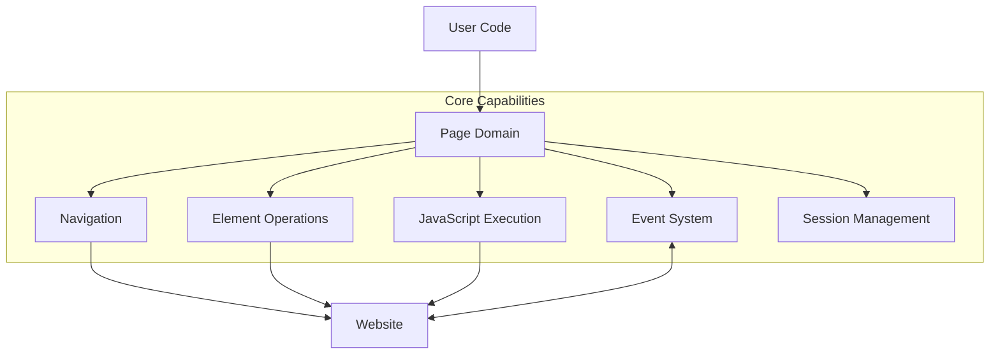
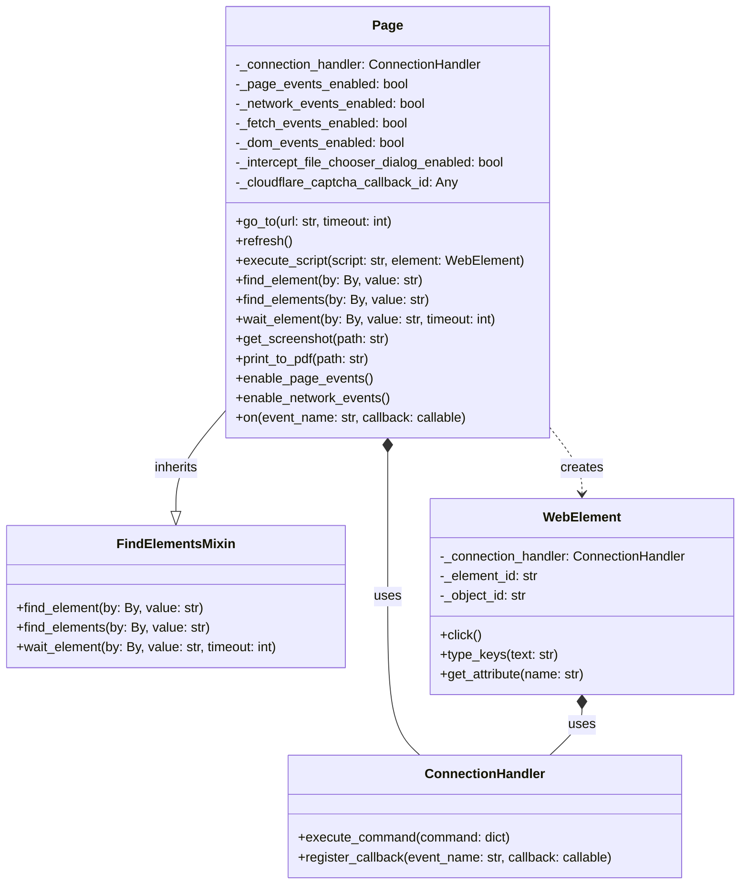
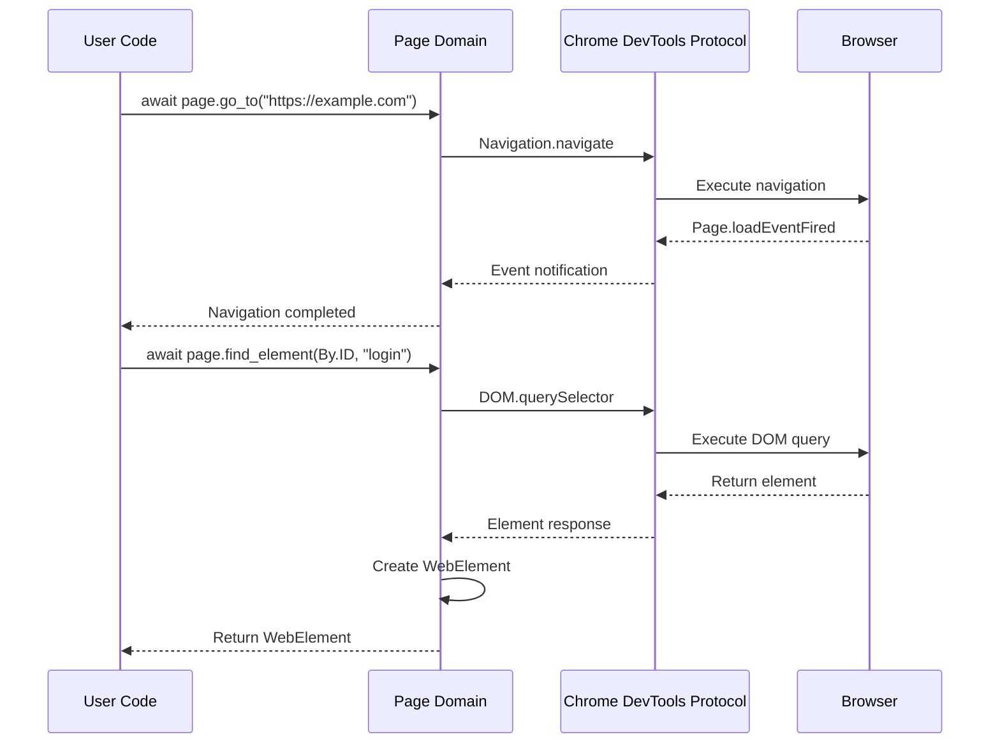
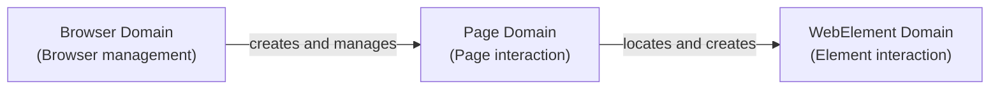

# Page Domain

The Page domain forms the core of Pydoll's architecture, providing a comprehensive interface for controlling browser tabs and their content. This domain bridges your high-level automation code with the browser's capabilities, enabling everything from basic navigation to complex interaction patterns.



## Technical Architecture

The Page domain in Pydoll acts as an integration layer between your automation code and multiple Chrome DevTools Protocol (CDP) domains. It's implemented as a concrete class that integrates multiple functional capabilities through composition and inheritance.



The design leverages several key patterns:

1. **Inheritance** - The Page class inherits from FindElementsMixin to gain element location capabilities
2. **Composition** - It uses a ConnectionHandler to manage CDP communication
3. **Factory Method** - It creates WebElement instances when finding elements in the page
4. **Command** - It translates high-level methods into CDP commands
5. **Observer** - It implements an event system for reacting to browser events

### CDP Integration

The Page domain integrates with multiple CDP domains to provide its functionality:

| CDP Domain | Purpose |
|------------|---------|
| **Page** | Core page lifecycle and navigation |
| **Runtime** | JavaScript execution in page context |
| **DOM** | Document structure and element access |
| **Network** | Network operations and cookie management |
| **Fetch** | Request interception and modification |
| **Input** | User interaction simulation |

This integration creates a powerful abstraction that simplifies browser automation while providing access to the full capabilities of the underlying protocol.



## Initialization and State Management

The Page class is initialized with two key parameters:

```python
def __init__(self, connection_port: int, page_id: str):
    """
    Initializes the Page instance.

    Args:
        connection_port (int): The port number for the connection to the browser.
        page_id (str): The ID of the page, obtained via the DevTools Protocol.
    """
    self._connection_handler = ConnectionHandler(connection_port, page_id)
    self._page_events_enabled = False
    self._network_events_enabled = False
    self._fetch_events_enabled = False
    self._dom_events_enabled = False
    self._intercept_file_chooser_dialog_enabled = False
    self._cloudflare_captcha_callback_id = None
```

The Page class maintains several state flags to track which event domains are currently enabled. This state management is crucial for:

1. Preventing duplicate event registrations
2. Accurately reflecting the current capabilities of the page
3. Enabling proper cleanup when the page is closed

## Core Patterns and Usage

The Page domain follows a consistent pattern for interaction:

```python
import asyncio
from pydoll.browser.chrome import Chrome
from pydoll.constants import By

async def pydoll_example():
    # Create a browser instance
    browser = Chrome()
    await browser.start()
    
    # Get a page
    page = await browser.get_page()
    
    # Work with the page...
    await page.go_to("https://example.com")
    
    # Clean up when done
    await browser.stop()

# Run your example with asyncio
asyncio.run(pydoll_example())
```

Most examples in this documentation assume a browser and page have already been created and will be properly cleaned up.

## Navigation System

The Page domain provides a fluid navigation experience through a combination of methods that abstract the complexities of browser navigation:

```python
# Navigate to a page with custom timeout
await page.go_to("https://example.com", timeout=60)

# Get the current URL
current_url = await page.current_url
print(f"Current URL: {current_url}")

# Refresh the page
await page.refresh()
```

!!! tip "Advanced Navigation"
    For specialized navigation scenarios, you can combine navigation with event listeners:
    
    ```python
    # Listen for network requests during navigation
    await page.enable_network_events()
    await page.on('Network.responseReceived', handle_response)
    
    # Navigate to the page
    await page.go_to('https://example.com')
    ```

Under the hood, the navigation system performs several operations:

1. Sends the navigation command through the connection handler
2. Monitors page load status through periodic JavaScript evaluation
3. Manages timeouts to prevent infinite waits
4. Handles refresh optimization if navigating to the current URL

## Element Interaction

The Page domain inherits from FindElementsMixin to provide element location functionality. This mixin-based architecture allows for code reuse while maintaining separation of concerns.

This architecture enables the finding and interacting with page elements in a straightforward and powerful way:

```python
# Navigate to a search engine
await page.go_to("https://www.google.com")

# Find the search input field
search_box = await page.find_element(By.NAME, "q")

# Type into the search box
await search_box.type_keys("Pydoll browser automation")

# Find and click the search button
search_button = await page.find_element(By.NAME, "btnK")
await search_button.click()

# Wait for results to load
results = await page.wait_element(By.CSS_SELECTOR, "#search")

# Find all result links
links = await page.find_elements(By.CSS_SELECTOR, "a h3")

# Print the first 3 result titles
for i, link in enumerate(links[:3]):
    text = await link.text
    print(f"Result {i+1}: {text}")
```

!!! info "Element Interaction Chain"
    The typical interaction flow in Pydoll follows this pattern:
    
    ```python
    # Find an element
    button = await page.find_element(By.ID, 'submit-button')
    
    # Interact with the element
    await button.click()
    
    # React to the result
    confirmation = await page.wait_element(By.CLASS_NAME, 'success-message')
    ```

This interaction follows a hierarchical pattern where:

1. The Page domain provides methods to find elements
2. These methods return WebElement instances
3. WebElement instances provide specialized interaction methods

## JavaScript Execution

The JavaScript execution system in the Page domain provides two distinct execution modes:

1. **Global Execution**: Evaluates JavaScript in the global page context
2. **Element Context Execution**: Executes JavaScript with an element as the context

This dual-mode architecture enables both global script execution and element-contextualized execution:

```python
# Execute JavaScript in page context
dimensions = await page.execute_script("""
    return {
        width: window.innerWidth,
        height: window.innerHeight,
        devicePixelRatio: window.devicePixelRatio
    }
""")
print(f"Window dimensions: {dimensions}")

# Find an element and manipulate it with JavaScript
heading = await page.find_element(By.TAG_NAME, "h1")

# Execute JavaScript with the element as context
await page.execute_script("""
    // 'argument' refers to the element
    argument.style.color = 'red';
    argument.style.fontSize = '32px';
    argument.textContent = 'Modified by JavaScript';
""", heading)
```

!!! warning "Script Execution Security"
    When executing scripts, be aware of security implications:
    
    - Scripts run with the full permissions of the page
    - Input validation is crucial if script content includes user data
    - Consider using element methods instead of scripts for standard operations

The implementation transforms the provided JavaScript code and parameters to match the CDP requirements:

1. For global execution: 
   - The script is sent directly to Runtime.evaluate
2. For element context execution:
   - The script is wrapped in a function
   - 'argument' references are replaced with 'this'
   - The function is called with the element's objectId as context

## Session State

The Page domain implements a sophisticated session state management system that works across multiple CDP domains, coordinating between the Network and Storage domains.

This architecture enables sophisticated cookie and state management:

```python
# Set a cookie
cookies_to_set = [
    {
        "name": "session_id",
        "value": "test_session_123",
        "domain": "example.com",
        "path": "/",
        "secure": True,
        "httpOnly": True
    }
]
await page.set_cookies(cookies_to_set)

# Get all cookies
all_cookies = await page.get_cookies()
print(f"Number of cookies: {len(all_cookies)}")

# Delete all cookies
await page.delete_all_cookies()
```

!!! info "Page-Specific Cookie Management"
    A powerful feature of Pydoll is the ability to control cookies at the individual Page level. This means you can manage multiple browser tabs, each with its own independent cookie state:
    
    ```python
    # First page with one set of cookies (user A)
    page1 = await browser.get_page()
    await page1.go_to("https://example.com")
    await page1.set_cookies([{"name": "user", "value": "user_a", "domain": "example.com"}])
    
    # Second page with different cookies (user B)
    page2 = await browser.get_page()
    await page2.go_to("https://example.com") 
    await page2.set_cookies([{"name": "user", "value": "user_b", "domain": "example.com"}])
    ```
    
    This capability enables:
    - Testing user interactions between different account types
    - Comparing different user permission levels side-by-side
    - Maintaining multiple authenticated sessions simultaneously

The implementation coordinates between multiple CDP domains to provide coherent state management:

1. **Network Domain**: Manages browser-level cookies
2. **Storage Domain**: Manages storage-level cookies
3. **Page's internal state**: Tracks which types of storage are being used

## Content Capture

The Page domain provides flexible methods for capturing visual content:

```python
# Take a screenshot and save it to a file
screenshot_path = "homepage.png"
await page.get_screenshot(screenshot_path)

# Get a screenshot as base64 (useful for embedding in reports)
screenshot_base64 = await page.get_screenshot_base64()

# Export page as PDF
pdf_path = "homepage.pdf"
await page.print_to_pdf(pdf_path)
```

!!! info "Supported Screenshot Formats"
    Pydoll supports saving screenshots in several formats:
    - PNG (.png): Lossless compression, best for UI testing
    - JPEG (.jpg/.jpeg): Lossy compression, smaller file size
    
    If you attempt to use an unsupported format, Pydoll will raise an `InvalidFileExtension` exception.

These visual capture capabilities are invaluable for:
- Visual regression testing
- Creating documentation
- Debugging automation scripts
- Archiving page content

## Event System Overview

The Page domain provides a comprehensive event system for monitoring and reacting to browser events. The main methods include:

- **Event enabling**: `enable_page_events()`, `enable_network_events()`, `enable_dom_events()`, and `enable_fetch_events()`
- **Event disabling**: `disable_page_events()`, `disable_network_events()`, etc.
- **Event registration**: `on(event_name, callback, temporary=False)` for registering callbacks

```python
# Basic example of enabling events and registering a callback
await page.enable_page_events()
await page.on('Page.loadEventFired', handle_load_event)
```

!!! info "Event Categories"
    Pydoll supports several event categories, each requiring explicit enabling:
    
    - **Page Events**: Navigation, loading, errors, dialog handling
    - **Network Events**: Requests, responses, WebSockets
    - **DOM Events**: Document updates, attribute changes
    - **Fetch Events**: Request interception and modification

!!! info "Detailed Event System Documentation"
    The event system is a core component of Pydoll's architecture and will be covered in detail in a dedicated section. This will include event types, handling patterns, and event-driven programming techniques.

## Advanced Capabilities Implementation

### Captcha Handling

The Page domain provides intelligent Cloudflare captcha handling through two distinct implementation approaches:

1. **Context Manager**: Blocks until captcha is solved
2. **Auto-Solve**: Handles captchas without blocking in the background


```python
# Context manager approach (blocks until captcha is solved)
async with page.expect_and_bypass_cloudflare_captcha():
    await page.go_to("https://site-with-cloudflare.com")
    # Continue only after captcha is solved

# Background processing approach
await page.enable_auto_solve_cloudflare_captcha()
await page.go_to("https://another-protected-site.com")
# Code continues immediately, captcha solved in background

# When finished with auto-solving
await page.disable_auto_solve_cloudflare_captcha()
```

!!! info "Captcha Approach Selection"
    Pydoll offers two approaches for handling captchas:
    
    **Context Manager**: Blocks until captcha is solved
    ```python
    async with page.expect_and_bypass_cloudflare_captcha():
        await page.go_to('https://protected-site.com')
    # Execution continues after captcha is solved
    ```
    
    **Background Processing**: Handles captchas without blocking
    ```python
    await page.enable_auto_solve_cloudflare_captcha()
    await page.go_to('https://protected-site.com')
    # Execution continues immediately, captcha solved in background
    ```

The actual implementation uses various techniques to detect and interact with captcha elements:

1. Wait for the page load event
2. Look for captcha elements using configurable selectors
3. Adjust the element size if needed (via JavaScript)
4. Trigger the captcha interaction
5. Either wait for completion (context manager) or continue (background)

### Dialog Management

Pydoll implements dialog handling through a combination of event monitoring and state tracking in the connection handler.


```python
# Set up a dialog handler
async def handle_dialog(event):
    if await page.has_dialog():
        message = await page.get_dialog_message()
        print(f"Dialog detected: {message}")
        await page.accept_dialog()

# Enable page events to detect dialogs
await page.enable_page_events()
await page.on('Page.javascriptDialogOpening', handle_dialog)

# Trigger an alert dialog
await page.execute_script("alert('This is a test alert')")
```

!!! tip "Dialog State Checking"
    Always check if a dialog is present with `await page.has_dialog()` before attempting to interact with it. If no dialog is present when calling `get_dialog_message()` or `accept_dialog()`, a `LookupError` will be raised.

### File Upload

Pydoll implements file upload handling through a sophisticated context manager pattern that handles the setup, execution, and cleanup phases of file uploads.

This implementation streamlines file uploading:

```python
# Path to a file to upload
file_path = "document.pdf"

# Use the context manager to handle file chooser dialog
async with page.expect_file_chooser(files=file_path):
    # Find and click the upload button
    upload_button = await page.find_element(By.ID, "upload-button")
    await upload_button.click()
```

!!! info "File Chooser Implementation"
    The file chooser context manager:
    1. Enables page events if not already enabled
    2. Enables file chooser dialog interception
    3. Sets up a temporary callback to handle the file upload
    4. Restores previous settings once the upload is complete

## Performance

The Page domain implements several patterns to optimize performance through selective event enabling, temporary callbacks, and proper resource cleanup.

### Event Optimization

Enable only the specific event domains necessary for your current task:

```python
# GOOD: Enable only what you need
await page.enable_network_events()  # Only enable network events

# BAD: Enabling unnecessary events creates overhead
await page.enable_page_events()
await page.enable_network_events()
await page.enable_dom_events()
await page.enable_fetch_events()
```

Each enabled event domain adds processing overhead as events are continuously monitored and processed.


## Domain Relationships

Understanding Pydoll's domain architecture helps clarify how the Page Domain fits into the library's broader ecosystem. The relationship between domains forms a natural hierarchy of responsibilities.



The **Browser Domain** sits at the top of the hierarchy, responsible for browser lifecycle, connection management, and global configuration. It serves as the initial entry point for any automation with Pydoll. This domain creates and manages page instances, providing the necessary environment for navigation.

The **Page Domain** acts as the crucial intermediary, operating within the context of a specific browser. It exposes methods for navigation, content interaction, JavaScript execution, and event handling. A fundamental aspect is its ability to locate elements within the page and create WebElement instances.

The **WebElement Domain** represents specific DOM elements. Each WebElement belongs to a page and provides specialized methods for interactions such as clicking, typing, or retrieving properties. While WebElements are separate entities, they always operate within the context of the page that created them.

This layered architecture provides several benefits:

- **Separation of Concerns**: Each domain has a clear, well-defined purpose
- **Reusability**: Components can be used independently when needed
- **Ease of Use**: The API follows a natural flow from browser → page → element
- **Flexibility**: Multiple pages can operate within a single browser with independent states

Understanding these domain relationships allows you to create more efficient and well-structured automation with Pydoll.

## Network Monitoring

The Page domain implements a sophisticated network monitoring system through event collection, log storage, and response analysis.

This enables powerful network analysis capabilities:

```python
# Enable network events
await page.enable_network_events()

# Perform some action that triggers network requests
await page.go_to("https://example.com")

# Get network logs matching specific patterns
api_logs = await page.get_network_logs(matches=["api", "graphql"])

# Get response bodies for specific requests
json_responses = await page.get_network_response_bodies(matches=["api/data"])

# Get a specific response body by request ID
request_id = api_logs[0]['params']['requestId']
body, is_base64 = await page.get_network_response_body(request_id)
```

!!! info "Network Analysis Use Cases"
    Network monitoring capabilities enable:
    - API response validation
    - Performance analysis
    - Data extraction from XHR responses
    - Debugging request/response cycles

The implementation leverages two key components:

1. **Event Monitoring**: Stores network events in a connection handler buffer
2. **Response Retrieval**: Uses the Network domain to fetch response bodies when needed

## Conclusion

The Page domain is the central workspace for most Pydoll automation tasks. Its sophisticated architecture integrates multiple CDP domains into a unified API that simplifies complex automation scenarios while maintaining the full power of the Chrome DevTools Protocol.

The domain's design leverages several architectural patterns:
- Inheritance and composition for code organization
- Command pattern for CDP communication
- Observer pattern for event handling 
- Factory pattern for element creation
- Context managers for resource management

By understanding the Page domain's architecture, capabilities, and patterns, you can create sophisticated browser automation scripts that effectively handle navigation, interaction, events, and state management. 