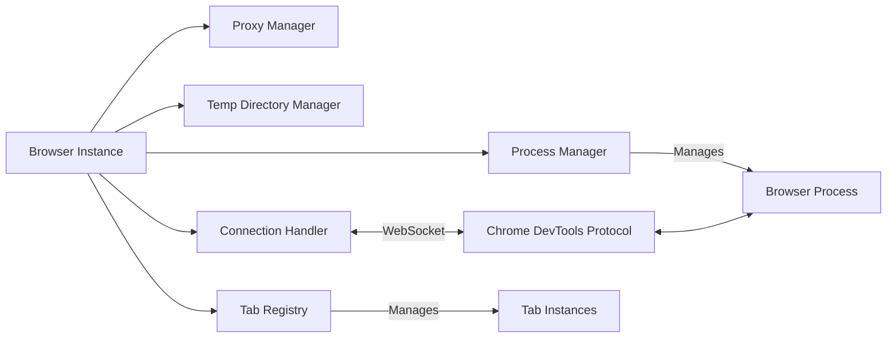
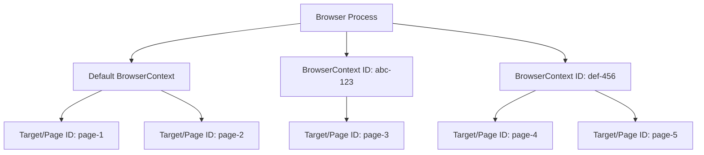

# Browser Domain Architecture

The Browser domain represents the highest level of Pydoll's automation hierarchy, managing the browser process lifecycle, CDP connections, context isolation, and global browser operations. This document explores the internal architecture, design decisions, and technical implementation of browser-level control.

!!! info "Practical Usage Guide"
    For practical examples and usage patterns, see the [Browser Management](../features/browser-management/tabs.md) and [Browser Contexts](../features/browser-management/contexts.md) guides.

## Architectural Overview

The Browser domain sits at the intersection of process management, protocol communication, and resource coordination. It orchestrates multiple specialized components to provide a unified interface for browser automation:



### Hierarchy and Abstraction

The Browser domain is implemented as an **abstract base class** that defines the contract for all browser implementations:

```python
class Browser(ABC):
    """Abstract base class for browser automation via CDP."""
    
    @abstractmethod
    def _get_default_binary_location(self) -> str:
        """Subclasses must provide browser-specific executable path."""
        pass
    
    async def start(self, headless: bool = False) -> Tab:
        """Concrete implementation shared by all browsers."""
        # 1. Resolve binary location
        # 2. Setup user data directory
        # 3. Start browser process
        # 4. Verify CDP connection
        # 5. Configure proxy (if needed)
        # 6. Return initial tab
```

This design enables **polymorphism** - Chrome, Edge, and other Chromium-based browsers share 99% of their code, differing only in executable paths and minor flag variations.

## Component Architecture

The Browser class coordinates several specialized managers, each responsible for a specific aspect of browser automation. Understanding these components is key to understanding Pydoll's design.

### Connection Handler

The ConnectionHandler is the **communication bridge** between Pydoll and the browser process. It manages:

- **WebSocket lifecycle**: Connection establishment, keep-alive, reconnection
- **Command execution**: Sending CDP commands and awaiting responses
- **Event dispatching**: Routing CDP events to registered callbacks
- **Callback registry**: Maintaining event listeners per connection

```python
class Browser:
    def __init__(self, ...):
        # ConnectionHandler is initialized with port or WebSocket address
        self._connection_handler = ConnectionHandler(self._connection_port)
    
    async def _execute_command(self, command, timeout=10):
        """All CDP commands flow through the connection handler."""
        return await self._connection_handler.execute_command(command, timeout)
```

!!! info "Connection Layer Deep Dive"
    For detailed information on WebSocket communication, command/response flow, and async patterns, see [Connection Layer Architecture](./connection-layer.md).

### Process Manager

The BrowserProcessManager handles **operating system process lifecycle**:

```python
class BrowserProcessManager:
    def start_browser_process(self, binary, port, arguments):
        """
        1. Constructs command-line with binary path + arguments
        2. Spawns subprocess with proper stdio handling
        3. Monitors process startup
        4. Stores process handle for later termination
        """
        
    def stop_process(self):
        """
        1. Attempts graceful termination (SIGTERM)
        2. Waits for process exit
        3. Force-kills if timeout exceeded (SIGKILL)
        4. Cleans up process resources
        """
```

**Why separate process management?**

- **Testability**: Process manager can be mocked for unit tests
- **Cross-platform**: Encapsulates OS-specific process handling
- **Reliability**: Handles edge cases like zombie processes, orphaned children

### Tab Registry

The Browser maintains a **registry of Tab instances** to ensure singleton behavior per target:

```python
class Browser:
    def __init__(self, ...):
        self._tabs_opened: dict[str, Tab] = {}
    
    async def new_tab(self, url='', browser_context_id=None) -> Tab:
        # Create target via CDP
        response = await self._execute_command(
            TargetCommands.create_target(browser_context_id=browser_context_id)
        )
        target_id = response['result']['targetId']
        
        # Check if tab already exists in registry
        if target_id in self._tabs_opened:
            return self._tabs_opened[target_id]
        
        # Create new Tab instance and register it
        tab = Tab(self, target_id=target_id, ...)
        self._tabs_opened[target_id] = tab
        return tab
```

**Why singleton Tab instances?**

- **State consistency**: Multiple references to same tab share state (enabled domains, callbacks)
- **Memory efficiency**: Prevents duplicate Tab instances for same target
- **Event routing**: Ensures events route to correct Tab instance

### Proxy Authentication Architecture

Pydoll implements **automatic proxy authentication** via the Fetch domain to avoid exposing credentials in CDP commands. The implementation uses **two distinct mechanisms** depending on proxy scope:

#### Mechanism 1: Browser-Level Proxy Auth (Global Proxy)

When a proxy is configured via `ChromiumOptions` (applies to all tabs in the default context):

```python
# In Browser.start() -> _configure_proxy()
async def _configure_proxy(self, private_proxy, proxy_credentials):
    # Enable Fetch AT BROWSER LEVEL
    await self.enable_fetch_events(handle_auth_requests=True)
    
    # Register callbacks AT BROWSER LEVEL (affects ALL tabs)
    await self.on(FetchEvent.REQUEST_PAUSED, self._continue_request_callback, temporary=True)
    await self.on(FetchEvent.AUTH_REQUIRED, 
                  partial(self._continue_request_with_auth_callback,
                          proxy_username=credentials[0],
                          proxy_password=credentials[1]),
                  temporary=True)
```

**Scope:** Browser-wide WebSocket connection → affects **all tabs in default context**

#### Mechanism 2: Tab-Level Proxy Auth (Per-Context Proxy)

When a proxy is configured per-context via `create_browser_context(proxy_server=...)`:

```python
# Store credentials per context
async def create_browser_context(self, proxy_server, ...):
    sanitized_proxy, extracted_auth = self._sanitize_proxy_and_extract_auth(proxy_server)
    
    response = await self._execute_command(
        TargetCommands.create_browser_context(proxy_server=sanitized_proxy)
    )
    context_id = response['result']['browserContextId']
    
    if extracted_auth:
        self._context_proxy_auth[context_id] = extracted_auth  # Store per context
    
    return context_id

# Setup auth for EACH tab in that context
async def _setup_context_proxy_auth_for_tab(self, tab, browser_context_id):
    creds = self._context_proxy_auth.get(browser_context_id)
    if not creds:
        return
    
    # Enable Fetch ON THE TAB (tab-level WebSocket)
    await tab.enable_fetch_events(handle_auth=True)
    
    # Register callbacks ON THE TAB (affects only this tab)
    await tab.on(FetchEvent.REQUEST_PAUSED, 
                 partial(self._tab_continue_request_callback, tab=tab), 
                 temporary=True)
    await tab.on(FetchEvent.AUTH_REQUIRED,
                 partial(self._tab_continue_request_with_auth_callback,
                         tab=tab,
                         proxy_username=creds[0],
                         proxy_password=creds[1]),
                 temporary=True)
```

**Scope:** Tab-level WebSocket connection → affects **only that specific tab**

#### Why Two Mechanisms?

| Aspect | Browser-Level | Tab-Level |
|--------|---------------|-----------|
| **Trigger** | Proxy in `ChromiumOptions` | Proxy in `create_browser_context()` |
| **WebSocket** | Browser-level connection | Tab-level connection |
| **Scope** | All tabs in default context | Only tabs in that context |
| **Efficiency** | One listener for all tabs | One listener per tab |
| **Isolation** | No context separation | Each context has different credentials |

**Design rationale for tab-level auth:**

- **Context isolation**: Each context can have a **different proxy** with **different credentials**
- **CDP limitation**: Fetch domain cannot be scoped to a specific context at browser level
- **Tradeoff**: Slightly less efficient (one listener per tab), but necessary for per-context proxy support

This architecture ensures **credentials never appear in CDP logs** and authentication is handled transparently.

!!! warning "Fetch Domain Side Effects"
    - **Browser-level Fetch**: Temporarily pauses **all requests across all tabs** in the default context until auth completes
    - **Tab-level Fetch**: Temporarily pauses **all requests in that specific tab** until auth completes
    
    This is a CDP limitation - Fetch enables request interception. After authentication completes, Fetch is disabled to minimize overhead.

## Initialization and Lifecycle

### Constructor Design

The Browser constructor initializes all internal components but **does not start the browser process**. This separation allows configuration before launch:

```python
class Browser(ABC):
    def __init__(
        self,
        options_manager: BrowserOptionsManager,
        connection_port: Optional[int] = None,
    ):
        # 1. Validate parameters
        self._validate_connection_port(connection_port)
        
        # 2. Initialize options via manager
        self.options = options_manager.initialize_options()
        
        # 3. Determine CDP port (random if not specified)
        self._connection_port = connection_port or randint(9223, 9322)
        
        # 4. Initialize specialized managers
        self._proxy_manager = ProxyManager(self.options)
        self._browser_process_manager = BrowserProcessManager()
        self._temp_directory_manager = TempDirectoryManager()
        self._connection_handler = ConnectionHandler(self._connection_port)
        
        # 5. Initialize state tracking
        self._tabs_opened: dict[str, Tab] = {}
        self._context_proxy_auth: dict[str, tuple[str, str]] = {}
        self._ws_address: Optional[str] = None
```

**Key design decisions:**

- **Lazy process start**: Constructor is synchronous; `start()` is async
- **Port flexibility**: Random port prevents collisions in parallel automation
- **Options manager pattern**: Strategy pattern for browser-specific configuration
- **Component composition**: Specialized managers instead of monolithic class

### Start Sequence

The `start()` method orchestrates browser launch and connection:

```python
async def start(self, headless: bool = False) -> Tab:
    # 1. Resolve binary location
    binary_location = self.options.binary_location or self._get_default_binary_location()
    
    # 2. Setup user data directory (temp or persistent)
    self._setup_user_dir()
    
    # 3. Extract proxy credentials (if private proxy)
    proxy_config = self._proxy_manager.get_proxy_credentials()
    
    # 4. Start browser process with arguments
    self._browser_process_manager.start_browser_process(
        binary_location, self._connection_port, self.options.arguments
    )
    
    # 5. Verify CDP endpoint is responsive
    await self._verify_browser_running()
    
    # 6. Configure proxy authentication (via Fetch domain)
    await self._configure_proxy(proxy_config[0], proxy_config[1])
    
    # 7. Get first valid target and create Tab
    valid_tab_id = await self._get_valid_tab_id(await self.get_targets())
    tab = Tab(self, target_id=valid_tab_id, connection_port=self._connection_port)
    self._tabs_opened[valid_tab_id] = tab
    
    return tab
```

!!! tip "Why start() Returns a Tab"
    This is a **design compromise** for ergonomics. Ideally, `start()` would only launch the browser, and users would call `new_tab()` separately. However, returning the initial tab reduces boilerplate for the 90% use case (single-tab automation). The tradeoff: the initial tab cannot be avoided even in multi-tab scenarios.

### Context Manager Protocol

The Browser implements `__aenter__` and `__aexit__` for automatic cleanup:

```python
async def __aexit__(self, exc_type, exc_val, exc_tb):
    # 1. Restore backup preferences (if modified)
    if self._backup_preferences_dir:
        shutil.copy2(self._backup_preferences_dir, ...)
    
    # 2. Check if browser is still running
    if await self._is_browser_running(timeout=2):
        await self.stop()
    
    # 3. Close WebSocket connection
    await self._connection_handler.close()
```

This ensures proper cleanup even if exceptions occur during automation.

## Browser Context Architecture

Browser contexts are Pydoll's most sophisticated isolation mechanism, providing **complete browsing environment separation** within a single browser process. Understanding their architecture is essential for advanced automation.

### CDP Hierarchy: Browser, Context, Target

CDP organizes browser structure into three levels:



**Key concepts:**

1. **Browser Process**: Single Chromium instance with one CDP endpoint
2. **BrowserContext**: Isolated storage/cache/permission boundary (similar to incognito mode)
3. **Target**: Individual page, popup, worker, or background target

### Context Isolation Boundaries

Each browser context maintains **strict isolation** for:

| Resource | Isolation Level | Implementation |
|----------|----------------|----------------|
| Cookies | Full | Separate cookie jar per context |
| localStorage | Full | Separate storage per origin per context |
| IndexedDB | Full | Separate database per origin per context |
| Cache | Full | Independent HTTP cache per context |
| Permissions | Full | Context-specific permission grants |
| Network proxy | Full | Per-context proxy configuration |
| Authentication | Full | Independent auth state per context |

!!! info "Why Contexts Are Lightweight"
    Unlike launching multiple browser processes, contexts share the **rendering engine, GPU process, and network stack**. Only storage and state are isolated. This makes contexts 10-100x faster to create than new browser instances.

### Context Creation and Target Binding

Creating a context and target involves two CDP commands:

```python
# Step 1: Create isolated browsing context
response = await self._execute_command(
    TargetCommands.create_browser_context(
        proxy_server='http://proxy.example.com:8080',
        proxy_bypass_list='localhost,127.0.0.1'
    )
)
context_id = response['result']['browserContextId']

# Step 2: Create target (page) within that context
response = await self._execute_command(
    TargetCommands.create_target(
        browser_context_id=context_id  # Binds target to context
    )
)
target_id = response['result']['targetId']
```

**Critical detail:** The `browser_context_id` parameter **binds the target to the context's isolation boundary**. Without it, the target is created in the default context.

### Window Materialization in Headed Mode

In **headed mode** (visible UI), browser contexts have an important physical constraint:

- A context initially exists only **in memory** (no window)
- The **first target** created in a context **must** open a top-level window
- **Subsequent targets** can open as tabs within that window

This is a **CDP/Chromium limitation**, not a Pydoll design choice:

```python
# First target in context: MUST create window
tab1 = await browser.new_tab(browser_context_id=context_id)  # Opens new window

# Subsequent targets: CAN open as tabs in existing window
tab2 = await browser.new_tab(browser_context_id=context_id)  # Opens as tab
```

**Why does this matter?**

- In **headless mode**: Completely irrelevant (no windows rendered)
- In **headed mode**: First target per context will open a visible window
- In **test environments**: Multiple contexts → multiple windows (can be confusing)

!!! tip "Headless Contexts Are Cleaner"
    For CI/CD, scraping, or batch automation, use headless mode. Context isolation works identically, but without window materialization overhead.

### Context Deletion and Cleanup

Deleting a context **immediately closes all targets** within it:

```python
await browser.delete_browser_context(context_id)
# All tabs in this context are now closed
# All storage for this context is cleared
# Context cannot be reused (ID is invalid)
```

**Cleanup sequence:**

1. CDP sends `Target.disposeBrowserContext` command
2. Browser closes all targets in that context
3. Browser clears all storage for that context
4. Browser invalidates the context ID
5. Pydoll removes context from internal registries

## Event System at Browser Level

The Browser domain supports **browser-wide event listeners** that operate across all tabs and contexts. This is distinct from tab-level events.

### Browser vs Tab Event Scope

```python
# Browser-level event: applies to ALL tabs
await browser.on('Target.targetCreated', handle_new_target)

# Tab-level event: applies to ONE tab
await tab.on('Page.loadEventFired', handle_page_load)
```

**Architectural difference:**

- **Browser events** use the **browser-level WebSocket connection** (port-based or `ws://host/devtools/browser/...`)
- **Tab events** use **tab-level WebSocket connections** (`ws://host/devtools/page/<target_id>`)

### Fetch Domain: Global Request Interception

The Fetch domain can be enabled at **both** browser and tab levels, with different scopes:

```python
# Browser-level Fetch: intercepts requests for ALL tabs
await browser.enable_fetch_events(handle_auth_requests=True)
await browser.on('Fetch.requestPaused', handle_request)

# Tab-level Fetch: intercepts requests for ONE tab
await tab.enable_fetch_events(handle_auth_requests=True)
await tab.on('Fetch.requestPaused', handle_request)
```

**When to use each:**

| Use Case | Level | Reason |
|----------|-------|--------|
| Proxy authentication | Browser | Applies globally to all contexts |
| Ad blocking | Browser | Block ads across all tabs |
| API mocking | Tab | Mock specific API for specific test |
| Request logging | Tab | Log only relevant tab's requests |

!!! warning "Fetch Performance Impact"
    Enabling Fetch at the browser level **pauses all requests** across all tabs until callbacks execute. This adds latency to every request. Use tab-level Fetch when possible to minimize impact.

### Command Routing

All CDP commands flow through the Browser's connection handler:

```python
async def _execute_command(self, command, timeout=10):
    """
    Routes command to appropriate connection:
    - Browser-level commands → browser WebSocket
    - Tab-level commands → delegated to Tab instance
    """
    return await self._connection_handler.execute_command(command, timeout)
```

This centralized routing enables:

- **Request/response correlation**: Match responses to requests via ID
- **Timeout management**: Cancel commands that exceed timeout
- **Error handling**: Convert CDP errors to Python exceptions

## Resource Management

### Cookie and Storage Operations

The Browser domain exposes **browser-wide** and **context-specific** storage operations:

```python
# Browser-level operations (all contexts)
await browser.set_cookies(cookies)
await browser.get_cookies()
await browser.delete_all_cookies()

# Context-specific operations
await browser.set_cookies(cookies, browser_context_id=context_id)
await browser.get_cookies(browser_context_id=context_id)
await browser.delete_all_cookies(browser_context_id=context_id)
```

These operations use the **Storage domain** under the hood:

- `Storage.getCookies`: Retrieve cookies for context or all contexts
- `Storage.setCookies`: Set cookies with domain/path/expiry
- `Storage.clearCookies`: Clear cookies for context or all contexts

!!! info "Browser vs Tab Storage Scope"
    - **Browser-level**: Operates on entire browser or specific context
    - **Tab-level**: Scoped to tab's current origin
    
    Use browser-level for global cookie management (e.g., setting session cookies for all domains). Use tab-level for origin-specific operations (e.g., clearing cookies after logout).

### Permission Grants

The Browser domain provides **programmatic permission control**, bypassing browser prompts:

```python
await browser.grant_permissions(
    [PermissionType.GEOLOCATION, PermissionType.NOTIFICATIONS],
    origin='https://example.com',
    browser_context_id=context_id
)
```

**Architecture:**

- Permissions are granted via the `Browser.grantPermissions` CDP command
- Permissions are **context-specific** (isolated per context)
- Grants override default prompt behavior
- `reset_permissions()` reverts to default behavior

### Download Management

Download behavior is configured via the `Browser.setDownloadBehavior` command:

```python
await browser.set_download_behavior(
    behavior=DownloadBehavior.ALLOW,
    download_path='/path/to/downloads',
    events_enabled=True,  # Emit download progress events
    browser_context_id=context_id
)
```

**Options:**

- `ALLOW`: Save to specified path
- `DENY`: Cancel all downloads
- `DEFAULT`: Show browser's default download UI

### Window Management

Window operations apply to the **physical OS window** of a target:

```python
window_id = await browser.get_window_id_for_target(target_id)
await browser.set_window_bounds({
    'left': 100, 'top': 100,
    'width': 1920, 'height': 1080,
    'windowState': 'normal'  # or 'minimized', 'maximized', 'fullscreen'
})
```

**Implementation details:**

- Uses `Browser.getWindowForTarget` to resolve window ID from target ID
- `Browser.setWindowBounds` modifies window geometry
- **Headless mode**: Window operations are no-ops (no physical windows exist)

## Architectural Insights and Design Tradeoffs

### Singleton Tab Registry: Why?

The tab registry pattern (`_tabs_opened: dict[str, Tab]`) ensures that:

1. **Event routing works correctly**: CDP events contain a `targetId` but no Tab reference. The registry maps `targetId` → `Tab` for correct callback dispatch.
2. **State consistency**: Multiple code paths that reference the same target get the **same Tab instance**, preventing state divergence.
3. **Memory efficiency**: Without the registry, `get_opened_tabs()` would create duplicate Tab instances for every call.

**Tradeoff:** Memory usage grows with tab count, but this is unavoidable for stateful Tab instances.

### Why start() Returns a Tab

This design decision sacrifices purity for **ergonomics**:

- **Downside**: Initial tab cannot be avoided, even in multi-tab automation
- **Upside**: 90% of users (single-tab scripts) don't need boilerplate:

```python
# With start() returning Tab
tab = await browser.start()

# Without (pure design)
await browser.start()
tab = await browser.new_tab()
```

**Alternative explored:** Auto-close initial tab in `new_tab()`. Rejected because it's surprising behavior (implicit side effects).

### Proxy Authentication: Two-Level Architecture Tradeoff

Pydoll's proxy authentication uses two different Fetch domain strategies:

**Browser-Level (Global Proxy):**
- **Security benefit**: Credentials never logged in CDP traces
- **Performance cost**: Fetch pauses **all requests across all tabs** until auth completes
- **Efficiency**: Single listener for all tabs in default context
- **Mitigation**: Fetch is disabled after first auth, minimizing overhead

**Tab-Level (Per-Context Proxy):**
- **Security benefit**: Credentials never logged in CDP traces
- **Performance cost**: Fetch pauses **all requests in that tab** until auth completes
- **Efficiency**: Separate listener per tab (less efficient, but necessary for isolation)
- **Isolation benefit**: Each context can have different proxy credentials
- **Mitigation**: Fetch is disabled after first auth per tab

**Why not use Browser.setProxyAuth?** This CDP command doesn't exist. Fetch is the only mechanism for programmatic auth.

**Why tab-level for contexts?** CDP's Fetch domain cannot be scoped to a specific BrowserContext. Since each context can have a different proxy with different credentials, Pydoll must handle auth at the tab level to respect context boundaries.

### Port Randomization Strategy

Random CDP ports (9223-9322) prevent collisions when running parallel browser instances:

```python
self._connection_port = connection_port or randint(9223, 9322)
```

**Why not increment from 9222?**

- Race conditions in multi-process environments (e.g., pytest-xdist)
- Collision with user's manual port selection

**Tradeoff:** Random ports are harder to debug (can't hardcode). Solution: `browser._connection_port` exposes the chosen port.

### Component Separation: Why Managers?

The Browser class delegates to specialized managers (ProcessManager, ProxyManager, TempDirManager, ConnectionHandler) for:

1. **Testability**: Managers can be mocked independently
2. **Reusability**: ProxyManager logic shared across Browser implementations
3. **Maintainability**: Each manager has single responsibility
4. **Cross-platform**: OS-specific logic isolated in ProcessManager

**Tradeoff:** More indirection, but significantly better code organization at scale.

## Key Takeaways

1. **Browser is a coordinator**, not a monolith. It orchestrates managers and handles CDP communication.
2. **Tab registry ensures singleton instances** per target, critical for event routing and state consistency.
3. **Browser contexts are lightweight isolation**, sharing browser process but separating storage/cache/auth.
4. **Proxy auth via Fetch** is a security tradeoff - hides credentials but adds latency.
5. **Event system has two levels**: Browser-wide and tab-specific, with different WebSocket connections.
6. **Component separation** (managers) improves testability and cross-platform support.

## Related Documentation

For deeper understanding of related architectural components:

- **[Connection Layer](./connection-layer.md)**: WebSocket communication, command/response flow, async patterns
- **[Event Architecture](./event-architecture.md)**: Event dispatch, callback management, domain enabling
- **[Tab Domain](./tab-domain.md)**: Tab-level operations, page navigation, element finding
- **[CDP Deep Dive](./cdp.md)**: Chrome DevTools Protocol fundamentals
- **[Proxy Architecture](./proxy-architecture.md)**: Network-level proxy concepts and implementation

For practical usage patterns:

- **[Tab Management](../features/browser-management/tabs.md)**: Multi-tab automation patterns
- **[Browser Contexts](../features/browser-management/contexts.md)**: Context isolation in practice
- **[Proxy Configuration](../features/configuration/proxy.md)**: Setting up proxies and authentication
