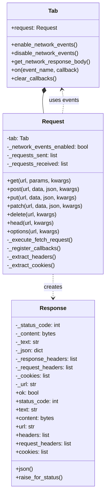
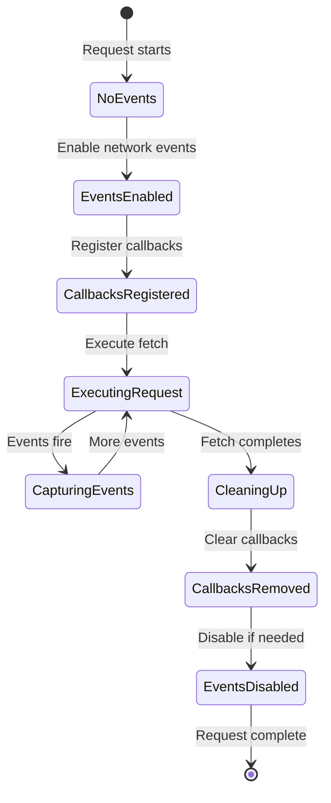
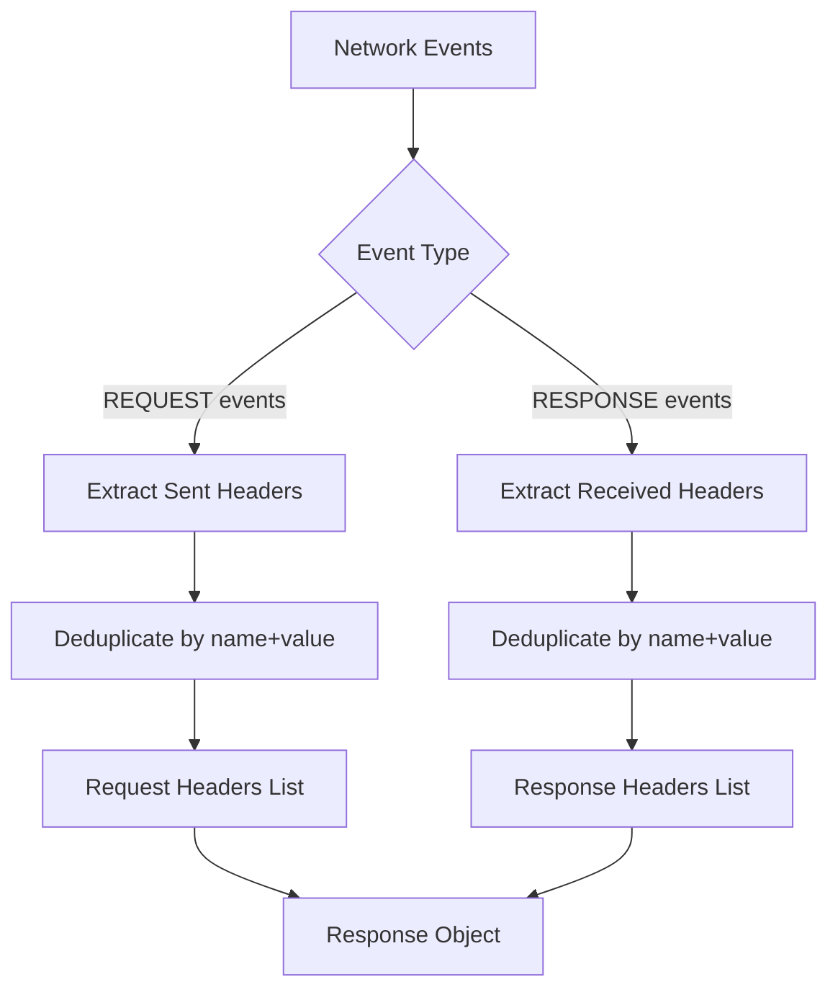
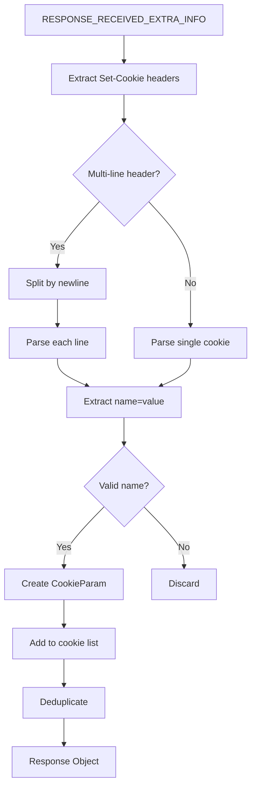

# Browser-Context Requests Architecture

This document explores the architectural design of Pydoll's browser-context HTTP request system, which enables making HTTP requests that seamlessly inherit the browser's session state, cookies, and authentication.

!!! info "Practical Guide Available"
    This is the architectural deep dive. For practical examples and use cases, see [HTTP Requests Guide](../features/network/http-requests.md).

## Architectural Overview

Browser-context requests solve a fundamental problem in hybrid automation: maintaining session continuity between UI interactions and API calls. Traditional approaches require manually extracting cookies and headers, creating fragile coupling between browser and HTTP client.

Pydoll's architecture eliminates this complexity by executing HTTP requests **inside** the browser's JavaScript context, while leveraging CDP network events to capture comprehensive metadata that JavaScript alone cannot provide.

### Why This Architecture?

| Traditional Approach | Pydoll Architecture |
|---------------------|---------------------|
| Separate HTTP client (requests, aiohttp) | Unified browser-based execution |
| Manual cookie extraction and sync | Automatic cookie inheritance |
| Two separate session states | Single session state |
| Limited CORS handling | Browser-native CORS enforcement |
| Complex authentication flows | Transparent auth preservation |


## Component Architecture

The browser-context request system consists of two primary classes that work together with Pydoll's event system:



### Request Class

The `Request` class serves as the interface layer, providing a familiar `requests`-like API while orchestrating the complex interaction between JavaScript execution and network event monitoring.

**Key Responsibilities:**

- Translate Python method calls to Fetch API JavaScript
- Manage temporary network event listeners
- Accumulate network events during request execution
- Extract metadata from CDP events
- Construct Response objects with complete information

### Response Class

The `Response` class provides a `requests.Response`-compatible interface, making migration from traditional HTTP clients seamless.

**Key Features:**

- Multiple content accessors (text, bytes, JSON)
- Lazy JSON parsing with caching
- Comprehensive header information (both sent and received)
- Cookie extraction from Set-Cookie headers
- Final URL after redirects

## Execution Flow

The request execution follows a six-phase pipeline:

```mermaid
flowchart TD
    Start([tab.request.get#40;url#41;]) --> Phase1[<b>1. Preparation</b><br/>Build URL + options]
    
    Phase1 --> Phase2[<b>2. Event Registration</b><br/>Enable network events<br/>Register callbacks]
    
    Phase2 --> Phase3[<b>3. JavaScript Execution</b><br/>Runtime.evaluate&#40;fetch&#41;]
    
    Phase3 --> Phase4{<b>4. Network Activity</b>}
    Phase4 -->|Request sent| Event1[REQUEST_WILL_BE_SENT]
    Phase4 -->|Response received| Event2[RESPONSE_RECEIVED]
    Phase4 -->|Extra info| Event3[*_EXTRA_INFO events]
    
    Event1 --> Collect[Collect metadata]
    Event2 --> Collect
    Event3 --> Collect
    
    Collect --> Phase5[<b>5. Construction</b><br/>Extract headers/cookies<br/>Build Response object]
    
    Phase5 --> Phase6[<b>6. Cleanup</b><br/>Clear callbacks<br/>Disable events]
    
    Phase6 --> End([Return Response])
```



### Phase Details

| Phase | Layer | Key Operations | Asynchronous |
|-------|-------|----------------|--------------|
| **1. Preparation** | Request | URL building, options formatting | No |
| **2. Event Registration** | Tab | Enable events, register callbacks | Yes |
| **3. JavaScript Execution** | CDP/Browser | Execute fetch() in browser context | Yes |
| **4. Network Activity** | Browser/CDP | HTTP request, emit CDP events | Yes (parallel) |
| **5. Construction** | Request | Parse events, build Response | No |
| **6. Cleanup** | Tab | Remove callbacks, disable events | Yes |

## Event System Integration

Browser-context requests are tightly integrated with Pydoll's event system architecture. Understanding this relationship is crucial.

### Temporary Event Lifecycle



### Why Both JavaScript and Events?

A common question: if JavaScript can execute the request, why use network events?

| Information Source | JavaScript (Fetch API) | Network Events (CDP) |
|-------------------|------------------------|----------------------|
| Response status | Available | Available |
| Response body | Available | Not available |
| Response headers | Partial (CORS restricted) | Complete |
| Request headers | Not accessible | Complete |
| Set-Cookie headers | Hidden by browser | Available |
| Timing information | Limited | Comprehensive |
| Redirect chain | Only final URL | Full chain |

**The Solution:** Combine both sources for complete information.

!!! tip "Complementary Technologies"
    JavaScript provides the response body and triggers the request in the browser's context (with cookies, auth). Network events provide the metadata that JavaScript security policies hide.

### CDP Network Event Types

The architecture uses four CDP event types to capture complete metadata:

| Event | Purpose | Key Information |
|-------|---------|----------------|
| `REQUEST_WILL_BE_SENT` | Main outgoing request | URL, method, standard headers |
| `REQUEST_WILL_BE_SENT_EXTRA_INFO` | Additional request metadata | Associated cookies, raw headers |
| `RESPONSE_RECEIVED` | Main response received | Status, headers, MIME type, timing |
| `RESPONSE_RECEIVED_EXTRA_INFO` | Additional response metadata | Set-Cookie headers, security info |

!!! info "Event Multiplicity"
    A single HTTP request generates multiple CDP events. The Request class accumulates all related events and extracts non-duplicate information during the construction phase.

## Header and Cookie Architecture

### Header Extraction Strategy

Headers exist in multiple CDP events with potential duplication. The architecture uses a deduplication strategy:



**Deduplication Logic:**

1. Events are processed in order
2. Each header is identified by `(name, value)` tuple
3. Only first occurrence of each tuple is kept
4. Result: unique, non-redundant header list

### Cookie Parsing Architecture

Cookies require special handling because they come from `Set-Cookie` headers in `RESPONSE_RECEIVED_EXTRA_INFO` events:



**Cookie Extraction Principles:**

- Only `EXTRA_INFO` events contain `Set-Cookie` headers
- Cookie attributes (Path, Domain, Secure, HttpOnly) are ignored
- Browser manages cookie attributes internally
- Only name-value pairs are extracted for informational purposes

!!! warning "Cookie Scope"
    The `Response.cookies` property contains only **new or updated** cookies from this specific response. Existing browser cookies are managed automatically and not exposed through this interface.

## JavaScript Execution Context

The Fetch API execution happens in the browser's JavaScript context, which is key to the architecture's power:

### Fetch API Integration

The request is translated to JavaScript:

```javascript
// Simplified representation
(async () => {
    const response = await fetch(url, {
        method: 'GET',
        headers: {'X-Custom': 'value'},
        // Browser automatically adds:
        // - Cookie header
        // - Authorization if set
        // - Standard headers (User-Agent, Accept, etc.)
    });
    
    return {
        status: response.status,
        url: response.url,  // Final URL after redirects
        text: await response.text(),
        content: new Uint8Array(await response.arrayBuffer()),
        json: response.headers.get('Content-Type')?.includes('application/json')
            ? await response.clone().json()
            : null
    };
})()
```

### Browser Context Benefits

Executing in the browser context provides:

| Benefit | Description |
|---------|-------------|
| **Automatic Cookie Inclusion** | Browser sends all applicable cookies automatically |
| **Auth State Preservation** | Authentication headers maintained from browser session |
| **CORS Enforcement** | Browser applies same CORS policies as user interactions |
| **TLS/SSL Handling** | Browser's certificate validation and security policies apply |
| **Compression** | Automatic handling of gzip, br, deflate |
| **Redirects** | Browser follows redirects transparently |
| **Same Security Context** | Request appears identical to user-initiated requests |

!!! info "Anti-Bot Detection"
    Requests executed in the browser context are indistinguishable from user-initiated requests, making them effective against anti-bot systems that analyze request patterns.

## Performance Considerations

### Event Overhead

Network events add overhead to request execution:

| Scenario | Overhead | Recommendation |
|----------|----------|----------------|
| Single request | Low | Acceptable |
| Multiple sequential requests | Moderate | Enable events once |
| Bulk requests (100+) | High | Consider enabling events at tab level |
| Long-running automation | Memory concern | Disable when done |

### Optimization Pattern

```python
# Inefficient - events enabled/disabled repeatedly
for url in urls:
    response = await tab.request.get(url)

# Efficient - events enabled once
await tab.enable_network_events()
for url in urls:
    response = await tab.request.get(url)
await tab.disable_network_events()
```

!!! tip "Automatic Optimization"
    The Request class checks if network events are already enabled and skips redundant enable/disable operations automatically.

### JSON Parsing Strategy

Response JSON parsing uses lazy evaluation with caching:

1. First call to `response.json()`: Parse and cache
2. Subsequent calls: Return cached result
3. If JSON pre-parsed during construction: Use that

This prevents redundant parsing overhead.

## Security Architecture

### CORS Policy Enforcement

Browser-context requests respect CORS policies:

```mermaid
flowchart TD
    A[tab.request.get&#40;url&#41;] --> B{Same Origin?}
    B -->|Yes| C[Request Allowed]
    B -->|No| D{CORS Headers Present?}
    D -->|Yes| E[Request Allowed]
    D -->|No| F[Request Blocked]
    
    C --> G[Response Returned]
    E --> G
    F --> H[CORS Error]
```



**CORS Behavior:**

- Requests to same origin: Always allowed
- Cross-origin requests: Require CORS headers from server
- Opaque responses: May be blocked by browser

**Workaround for CORS Issues:**

Navigate to the domain first to establish same-origin context:

```python
await tab.go_to('https://different-domain.com')
response = await tab.request.get('https://different-domain.com/api')
```

### Cookie Security

Cookies with security flags (`HttpOnly`, `Secure`, `SameSite`) are handled by the browser:

- **HttpOnly cookies**: Sent automatically but not exposed to JavaScript or CDP
- **Secure cookies**: Only sent over HTTPS
- **SameSite cookies**: Browser enforces SameSite policies

The `Response.cookies` property may not show all cookies due to these security restrictions.

### TLS/SSL Validation

The browser validates SSL certificates. Self-signed or invalid certificates cause requests to fail unless:

```python
options = ChromiumOptions()
options.add_argument('--ignore-certificate-errors')
browser = Chrome(options=options)
```

!!! warning "Security Trade-off"
    Disabling certificate validation reduces security. Only use in controlled environments.

## Limitations and Design Decisions

### Request Body Size

Very large request bodies (files, large datasets) have JavaScript memory constraints. For file uploads, use `WebElement.set_input_files()` or the file chooser interceptor instead.

### Binary Response Handling

Binary responses are converted through JavaScript's `ArrayBuffer` and `Uint8Array`, which adds some overhead for very large responses (>100MB).

### Redirect Transparency

The Fetch API follows redirects automatically. Only the final URL is captured. If you need the redirect chain, use network monitoring separately.

### Event Timing

Events must be registered **before** executing the fetch. The architecture ensures this through the registration phase, but manual event handling requires careful timing.

## Architectural Principles

The browser-context request architecture adheres to these principles:

1. **Session Continuity**: Never break the browser's session state
2. **Zero Manual Sync**: No cookie/header extraction required
3. **Complete Information**: Combine JavaScript + events for full metadata
4. **Automatic Cleanup**: Resources freed after each request
5. **Familiar Interface**: `requests`-compatible API for easy adoption
6. **Performance Conscious**: Optimize for common use cases
7. **Security Aware**: Respect browser security policies

## Integration with Other Systems

### Event System Dependency

Browser-context requests depend on the event system architecture:

- Leverages `Tab.on()` for callback registration
- Uses `Tab.clear_callbacks()` for cleanup
- Respects existing network event enablement
- Integrates with event lifecycle management

See [Event System Architecture](event-architecture.md) for details.

### Type System Integration

The architecture uses Python's type system extensively:

- `HeaderEntry` TypedDict for headers
- `CookieParam` TypedDict for cookies
- Event type definitions from `pydoll.protocol.network.events`
- Provides IDE autocomplete and type safety

See [Typing System](typing-system.md) for details.

## Further Reading

- **[HTTP Requests Guide](../features/network/http-requests.md)** - Practical examples and use cases
- **[Event System Architecture](event-architecture.md)** - Event system internal design
- **[Network Monitoring](../features/network/monitoring.md)** - Passive network observation
- **[Request Interception](../features/network/interception.md)** - Active request modification
- **[Typing System](typing-system.md)** - Type system integration

## Summary

Pydoll's browser-context request architecture achieves seamless HTTP communication by combining JavaScript Fetch API execution with CDP network event monitoring. This hybrid approach provides:

- **Complete metadata** from both JavaScript and CDP events
- **Automatic session continuity** through browser context execution  
- **Familiar interface** compatible with the requests library
- **Performance optimization** through event reuse
- **Security compliance** with browser policies

The architecture demonstrates how combining complementary technologies (JavaScript + CDP events) can solve complex problems elegantly, providing power and convenience without compromising on completeness or security.

