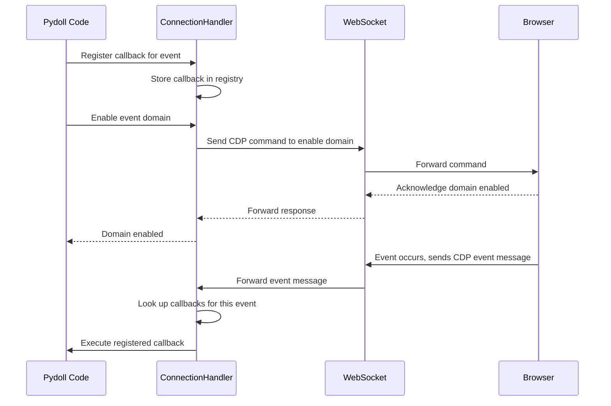
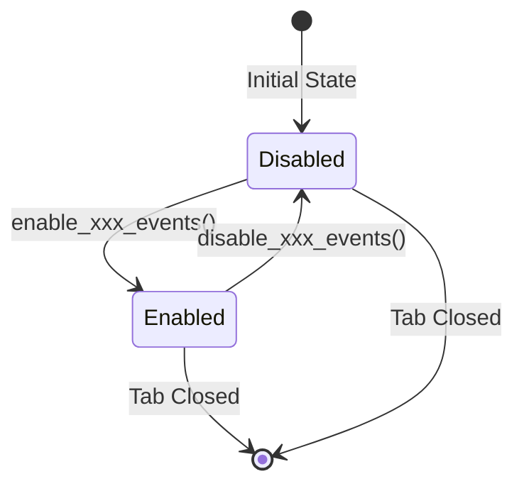
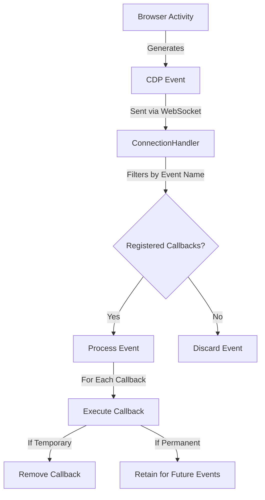
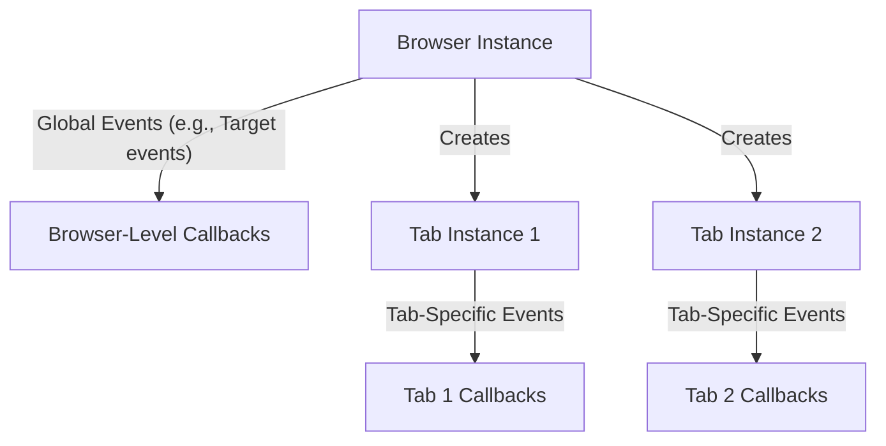

# Event System Architecture

This document explores the internal architecture of Pydoll's event system, covering WebSocket communication, event flow, callback management, and performance considerations.

!!! info "Practical Usage Guide"
    For practical examples and usage patterns, see the [Event System Guide](../features/advanced/event-system.md).

## WebSocket Communication and CDP

At the core of Pydoll's event system is the Chrome DevTools Protocol (CDP), which provides a structured way to interact with and monitor browser activities over WebSocket connections. This bidirectional communication channel allows your code to both send commands to the browser and receive events back.



### WebSocket Communication Model

The WebSocket connection between Pydoll and the browser follows this pattern:

1. **Connection Establishment**: When the browser starts, a WebSocket server is created, and Pydoll establishes a connection to it
2. **Bidirectional Messaging**: Both Pydoll and the browser can send messages at any time
3. **Message Types**:
   - **Commands**: Sent from Pydoll to the browser (e.g., navigation, DOM manipulation)
   - **Command Responses**: Sent from the browser to Pydoll in response to commands
   - **Events**: Sent from the browser to Pydoll when something happens (e.g., page load, network activity)

### Chrome DevTools Protocol Structure

CDP organizes its functionality into domains, each responsible for a specific area of browser functionality:

| Domain | Responsibility | Typical Events |
|--------|----------------|----------------|
| Page | Page lifecycle | Load events, navigation, dialogs |
| Network | Network activity | Request/response monitoring, WebSockets |
| DOM | Document structure | DOM changes, attribute modifications |
| Fetch | Request interception | Request paused, authentication required |
| Runtime | JavaScript execution | Console messages, exceptions |
| Browser | Browser management | Window creation, tabs, contexts |

Each domain must be explicitly enabled before it will emit events, which helps manage performance by only processing events that are actually needed.

## Domain Architecture

### The Enable/Disable Pattern

The explicit enable/disable pattern serves several important architectural purposes:

1. **Performance Optimization**: By only enabling domains you're interested in, you reduce the overhead of event processing
2. **Resource Management**: Some event domains (like Network or DOM monitoring) can generate large volumes of events that consume memory
3. **Protocol Compliance**: CDP requires explicit domain enabling before events are emitted
4. **Controlled Cleanup**: Explicitly disabling domains ensures proper cleanup when events are no longer needed



!!! warning "Event Leak Prevention"
    Failing to disable event domains when they're no longer needed can lead to memory leaks and performance degradation, especially in long-running automation. Always disable event domains when you're done with them, particularly for high-volume events like network monitoring.

### Domain-Specific Enabling Methods

Different domains are enabled through specific methods on the appropriate objects:

| Domain | Enable Method | Disable Method | Available On |
|--------|--------------|----------------|--------------|
| Page | `enable_page_events()` | `disable_page_events()` | Tab |
| Network | `enable_network_events()` | `disable_network_events()` | Tab |
| DOM | `enable_dom_events()` | `disable_dom_events()` | Tab |
| Fetch | `enable_fetch_events()` | `disable_fetch_events()` | Tab, Browser |
| File Chooser | `enable_intercept_file_chooser_dialog()` | `disable_intercept_file_chooser_dialog()` | Tab |

!!! info "Domain Ownership"
    Events belong to specific domains based on their functionality. Some domains are only available at certain levels - for instance, Page events are available on the Tab instance but not directly at the Browser level.

## Event Registration System

### The `on()` Method

The central method for subscribing to events is the `on()` method, available on both Tab and Browser instances:

```python
async def on(
    self, event_name: str, callback: callable, temporary: bool = False
) -> int:
    """
    Registers an event listener.

    Args:
        event_name (str): The event name to listen for.
        callback (callable): The callback function to execute when the
            event is triggered.
        temporary (bool): If True, the callback will be removed after it's
            triggered once. Defaults to False.

    Returns:
        int: The ID of the registered callback.
    """
```

This method returns a callback ID that can be used to remove the callback later if needed.

### Callback Registry

Internally, the `ConnectionHandler` maintains a callback registry:

```python
{
    'Page.loadEventFired': [
        (callback_id_1, callback_function_1, temporary=False),
        (callback_id_2, callback_function_2, temporary=True),
    ],
    'Network.requestWillBeSent': [
        (callback_id_3, callback_function_3, temporary=False),
    ]
}
```

When an event arrives via WebSocket:

1. The event name is extracted from the message
2. The registry is queried for matching callbacks
3. Each callback is executed with the event data
4. Temporary callbacks are removed after execution

### Async Callback Handling

Callbacks can be either synchronous or asynchronous. The event system handles both:

```python
async def _trigger_callbacks(self, event_name: str, event_data: dict):
    for cb_id, cb_data in self._event_callbacks.items():
        if cb_data['event'] == event_name:
            if asyncio.iscoroutinefunction(cb_data['callback']):
                await cb_data['callback'](event_data)
            else:
                cb_data['callback'](event_data)
```

Asynchronous callbacks are awaited sequentially. This means each callback completes before the next one executes, which is important for:

- **Predictable Execution Order**: Callbacks execute in registration order
- **Error Handling**: Exceptions in one callback don't prevent others from executing
- **State Consistency**: Callbacks can rely on sequential state changes

!!! info "Sequential vs Concurrent Execution"
    Callbacks execute sequentially within the same event. However, different events can be processed concurrently since the event loop handles multiple connections simultaneously.

## Event Flow and Lifecycle

The event lifecycle follows these steps:



### Detailed Flow

1. **Browser Activity**: Something happens in the browser (page loads, request sent, DOM changes)
2. **CDP Event Generation**: Browser generates a CDP event message
3. **WebSocket Transmission**: Message is sent over WebSocket to Pydoll
4. **Event Reception**: The ConnectionHandler receives the event
5. **Callback Lookup**: ConnectionHandler checks its registry for callbacks matching the event name
6. **Callback Execution**: If callbacks exist, each is executed with the event data
7. **Temporary Removal**: If a callback was registered as temporary, it's removed after execution

## Browser-Level vs. Tab-Level Events

Pydoll's event system operates at both the browser and tab levels, with important distinctions:



### Browser-Level Events

Browser-level events operate globally across all tabs. These are limited to specific domains like:

- **Target Events**: Tab creation, destruction, crash
- **Browser Events**: Window management, download coordination

```python
# Browser-level event registration
await browser.on('Target.targetCreated', handle_new_target)
```

Browser-level event domains are limited, and trying to use tab-specific events will raise an exception.

### Tab-Level Events

Tab-level events are specific to an individual tab:

```python
# Each tab has its own event context
tab1 = await browser.start()
tab2 = await browser.new_tab()

await tab1.enable_page_events()
await tab1.on(PageEvent.LOAD_EVENT_FIRED, handle_tab1_load)

await tab2.enable_page_events()
await tab2.on(PageEvent.LOAD_EVENT_FIRED, handle_tab2_load)
```

This architecture allows for:

- **Isolated Event Handling**: Events in one tab don't affect others
- **Per-Tab Configuration**: Different tabs can monitor different event types
- **Resource Efficiency**: Only enable events on tabs that need them

!!! info "Domain-Specific Scope"
    Not all event domains are available at both levels:
    
    - **Fetch Events**: Available at both browser and tab levels
    - **Page Events**: Available only at the tab level
    - **Target Events**: Available only at the browser level

## Performance Architecture

### Event System Overhead

The event system adds overhead to browser automation, especially for high-frequency events:

| Event Domain | Typical Event Volume | Performance Impact |
|--------------|---------------------|-------------------|
| Page | Low | Minimal |
| Network | High | Moderate to High |
| DOM | Very High | High |
| Fetch | Moderate | Moderate (higher if intercepting) |

### Performance Optimization Strategies

1. **Selective Domain Enabling**: Only enable event domains you're actively using
2. **Strategic Scoping**: Use browser-level events only for truly browser-wide concerns
3. **Timely Disabling**: Always disable event domains when you're finished with them
4. **Early Filtering**: In callbacks, filter out irrelevant events as early as possible
5. **Temporary Callbacks**: Use the `temporary=True` flag for one-time events

### Memory Management

The event system manages memory through several mechanisms:

1. **Callback Registry Cleanup**: Removing callbacks frees their references
2. **Temporary Auto-Removal**: Temporary callbacks are automatically cleaned up
3. **Domain Disabling**: Disabling a domain stops event generation
4. **Tab Closure**: When a tab closes, all its callbacks are automatically removed

!!! warning "Memory Leak Prevention"
    In long-running automation, always clean up callbacks and disable domains when done. High-frequency events (especially DOM) can accumulate significant memory if left enabled.

## Connection Handler Architecture

The `ConnectionHandler` is the central component managing WebSocket communication and event dispatching.

### Key Responsibilities

1. **WebSocket Management**: Establishing and maintaining the WebSocket connection
2. **Message Routing**: Distinguishing between command responses and events
3. **Callback Registry**: Maintaining the mapping of event names to callbacks
4. **Event Dispatching**: Executing registered callbacks when events arrive
5. **Cleanup**: Removing callbacks and closing connections

### Internal Structure

```python
class ConnectionHandler:
    def __init__(self, ...):
        self._events_handler = EventsManager()
        self._websocket = None
        # ... other attributes
    
    async def register_callback(self, event_name, callback, temporary):
        return self._events_handler.register_callback(event_name, callback, temporary)

class EventsManager:
    def __init__(self):
        self._event_callbacks = {}  # Callback ID -> callback data
        self._callback_id = 0
    
    def register_callback(self, event_name, callback, temporary):
        self._callback_id += 1
        self._event_callbacks[self._callback_id] = {
            'event': event_name,
            'callback': callback,
            'temporary': temporary
        }
        return self._callback_id
    
    async def _trigger_callbacks(self, event_name, event_data):
        callbacks_to_remove = []
        
        for cb_id, cb_data in self._event_callbacks.items():
            if cb_data['event'] == event_name:
                # Execute callback (await if async, call directly if sync)
                if asyncio.iscoroutinefunction(cb_data['callback']):
                    await cb_data['callback'](event_data)
                else:
                    cb_data['callback'](event_data)
                
                # Mark temporary callbacks for removal
                if cb_data['temporary']:
                    callbacks_to_remove.append(cb_id)
        
        # Remove temporary callbacks after all callbacks executed
        for cb_id in callbacks_to_remove:
            self.remove_callback(cb_id)
```

This architecture ensures:

- **Efficient Lookup**: Event names map directly to callback lists
- **Minimal Overhead**: Only registered events are processed
- **Automatic Cleanup**: Temporary callbacks are removed after execution
- **Thread Safety**: Operations are async-safe

## Event Message Format

CDP events follow a standardized message format:

```json
{
    "method": "Network.requestWillBeSent",
    "params": {
        "requestId": "1234.56",
        "loaderId": "7890.12",
        "documentURL": "https://example.com",
        "request": {
            "url": "https://api.example.com/data",
            "method": "GET",
            "headers": {...}
        },
        "timestamp": 123456.789,
        "wallTime": 1234567890.123,
        "initiator": {...},
        "type": "XHR"
    }
}
```

Key components:

- **`method`**: The event name in `Domain.eventName` format
- **`params`**: Event-specific data, varies by event type
- **No `id` field**: Unlike commands, events don't have request IDs

The event system extracts the `method` field to route to the appropriate callbacks, passing the entire message to each callback.

## Multi-Tab Event Coordination

Pydoll's architecture supports sophisticated multi-tab event coordination:

### Independent Tab Contexts

Each tab maintains its own:

- Event domain enablement state
- Callback registry
- Event communication channel
- Network logs (if network events enabled)

!!! info "Communication Architecture"
    Each tab has its own event communication channel to the browser. For technical details on how WebSocket connections and target IDs work at the protocol level, see [Browser Domain Architecture](./browser-domain.md).

### Shared Browser Context

Multiple tabs can share:

- Browser-level event listeners
- Cookie storage
- Cache
- Browser process

This architecture allows for:

1. **Parallel Event Processing**: Multiple tabs can process events simultaneously
2. **Isolated Failures**: Issues in one tab don't affect others
3. **Resource Sharing**: Common browser features are shared efficiently
4. **Coordinated Actions**: Browser-level events can coordinate cross-tab activities

## Conclusion

Pydoll's event system architecture is designed for:

- **Performance**: Minimal overhead through selective domain enabling and efficient callback dispatch
- **Flexibility**: Support for both browser-level and tab-level events
- **Scalability**: Handle multiple tabs with independent event contexts
- **Reliability**: Automatic cleanup and memory management

Understanding this architecture helps you:

- **Optimize Performance**: Know which domains have high overhead
- **Debug Issues**: Understand the event flow when things don't work as expected
- **Design Better Automation**: Leverage the architecture for efficient event-driven workflows
- **Avoid Pitfalls**: Prevent memory leaks and performance degradation

For practical usage patterns and examples, see the [Event System Guide](../features/advanced/event-system.md).

