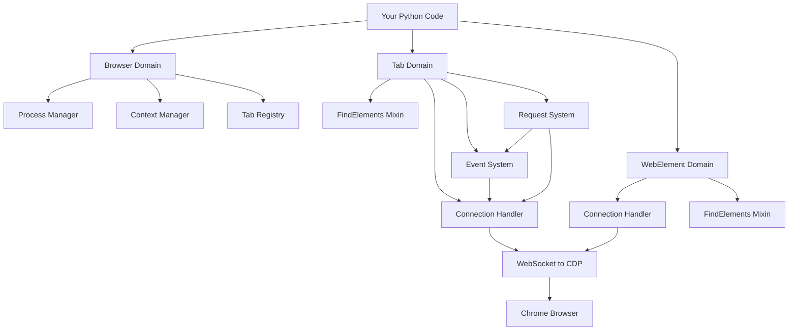

# Internal Architecture

**Understand the design, then break the rules intentionally.**

Most documentation shows you **what** a framework does. This section reveals **how** and **why** Pydoll is architected the way it is: the design patterns, architectural decisions, and tradeoffs that shape every line of code.

## Why Architecture Matters

You can use Pydoll effectively without understanding its internal architecture. But when you need to:

- **Debug** complex issues that span multiple components
- **Optimize** performance bottlenecks in large-scale automation
- **Extend** Pydoll with custom functionality
- **Contribute** improvements to the codebase
- **Build** similar tools for different use cases

...architectural knowledge becomes **indispensable**.

!!! quote "Architecture as Language"
    **"Architecture is frozen music."** - Johann Wolfgang von Goethe
    
    Good architecture isn't just about making code work, it's about making code **understandable**, **maintainable**, and **extensible**. Understanding Pydoll's architecture teaches you patterns you'll apply to every project.

## The Six Architectural Domains

Pydoll's architecture is organized into **six cohesive domains**, each with clear responsibilities and interfaces:

### 1. Browser Domain
**[→ Explore Browser Architecture](./browser-domain.md)**

**The orchestrator: managing processes, contexts, and global state.**

The Browser domain sits at the top of the hierarchy, coordinating:

- **Process management**: Launching/terminating browser executables
- **Browser contexts**: Isolated environments (like incognito windows)
- **Tab registry**: Singleton pattern for Tab instances
- **Proxy authentication**: Automatic auth via Fetch domain
- **Global operations**: Downloads, permissions, window management

**Key architectural patterns**:

- **Abstract base class** for Chrome/Edge/other Chromium browsers
- **Manager pattern** (ProcessManager, ProxyManager, TempDirManager)
- **Singleton registry** for Tab instances (prevents duplicates)
- **Context manager protocol** for automatic cleanup

**Critical insight**: The Browser doesn't directly manipulate pages, it **coordinates** lower-level components. This separation of concerns enables multi-browser support and concurrent tab operations.

---

### 2. Tab Domain
**[→ Explore Tab Architecture](./tab-domain.md)**

**The workhorse: executing commands, managing state, coordinating automation.**

The Tab domain is Pydoll's primary interface, handling:

- **Navigation**: Page loading with configurable wait states
- **Element finding**: Delegated to FindElementsMixin
- **JavaScript execution**: Both page and element contexts
- **Event coordination**: Tab-specific event listeners
- **Network monitoring**: Request/response capture and analysis
- **IFrame handling**: Nested context management

**Key architectural patterns**:

- **Façade pattern**: Simplified interface to complex CDP operations
- **Mixin composition**: FindElementsMixin for element location
- **Per-tab WebSocket**: Independent connections for parallelism
- **State flags**: Track enabled domains (network_events_enabled, etc.)
- **Lazy initialization**: Request object created on first access

**Critical insight**: Each Tab owns its **own ConnectionHandler**, enabling true parallel operations across tabs without contention or state leakage.

---

### 3. WebElement Domain
**[→ Explore WebElement Architecture](./webelement-domain.md)**

**The interactor: bridging Python code and DOM elements.**

The WebElement domain represents **individual DOM elements**, providing:

- **Interaction methods**: Click, type, scroll, select
- **Property access**: Text, HTML, bounds, attributes
- **State queries**: Visibility, enabled status, value
- **Screenshots**: Element-specific image capture
- **Child finding**: Relative element location (also via FindElementsMixin)

**Key architectural patterns**:

- **Proxy pattern**: Python object representing remote browser element
- **Object ID abstraction**: CDP's objectId hidden behind Python API
- **Hybrid properties**: Sync (attributes) vs async (dynamic state)
- **Command pattern**: Interaction methods wrap CDP commands
- **Fallback strategies**: Multiple approaches for robustness

**Critical insight**: WebElement maintains **both cached attributes** (from creation) and **dynamic state** (fetched on demand), balancing performance with freshness.

---

### 4. FindElements Mixin
**[→ Explore FindElements Architecture](./find-elements-mixin.md)**

**The locator: translating selectors into DOM queries.**

The FindElementsMixin provides element-finding capabilities to both Tab and WebElement through **composition**, not inheritance:

- **Attribute-based finding**: `find(id='submit', class_name='btn')`
- **Expression-based querying**: `query('div.container > p')`
- **Strategy resolution**: Optimal selector for single vs. multiple attributes
- **Waiting mechanisms**: Polling with configurable timeouts
- **Context detection**: Document vs. element-relative searches

**Key architectural patterns**:
- **Mixin pattern**: Shared capability without inheritance hierarchy
- **Strategy pattern**: Different selector strategies based on input
- **Template method**: Common flow, strategy-specific implementation
- **Factory function**: Late import to avoid circular dependencies
- **Overload pattern**: Type-safe return types (WebElement vs list)

**Critical insight**: The mixin uses **duck typing** (`hasattr(self, '_object_id')`) to detect Tab vs WebElement, enabling code reuse without tight coupling.

---

### 5. Event Architecture
**[→ Explore Event Architecture](./event-architecture.md)**

**The dispatcher: routing browser events to Python callbacks.**

The Event Architecture enables reactive automation through:

- **Event registration**: `on()` method for subscribing to CDP events
- **Callback dispatch**: Async execution without blocking
- **Domain management**: Explicit enable/disable for performance
- **Temporary callbacks**: Auto-removal after first invocation
- **Multi-level scope**: Browser-wide vs tab-specific events

**Key architectural patterns**:

- **Observer pattern**: Subscribe/notify for event-driven code
- **Registry pattern**: Event name → callback list mapping
- **Wrapper pattern**: Auto-wrap sync callbacks for async execution
- **Cleanup protocol**: Automatic callback removal on tab close
- **Scope isolation**: Independent event contexts per tab

**Critical insight**: Events are **push-based** (browser notifies Python), not poll-based, enabling low-latency reactive automation without busy-waiting.

---

### 6. Browser Requests Architecture
**[→ Explore Requests Architecture](./browser-requests-architecture.md)**

**The hybrid: HTTP requests with browser session state.**

The Browser Requests system bridges HTTP and browser automation:

- **Session continuity**: Cookies and auth automatically included
- **Dual data sources**: JavaScript Fetch API + CDP network events
- **Complete metadata**: Headers, cookies, timing (not all available via JavaScript)
- **`requests`-like API**: Familiar interface with browser power

**Key architectural patterns**:

- **Hybrid execution**: JavaScript for body, CDP for metadata
- **Temporary event registration**: Enable/capture/disable pattern
- **Lazy property initialization**: Request object created on first use
- **Adapter pattern**: Requests-compatible interface to browser fetch

**Critical insight**: Browser requests combine **two information sources** (JavaScript and CDP events). JavaScript provides the response body, CDP provides headers and cookies that JavaScript security policies hide.

---

## Architectural Principles

These six domains follow consistent principles:

### 1. Separation of Concerns
Each domain has a **single, well-defined responsibility**:

- Browser → Process/context management
- Tab → Command execution and state
- WebElement → Element interaction
- FindElements → Element location
- Events → Reactive dispatch
- Requests → HTTP in browser context

**Benefit**: Changes in one domain rarely require changes in others.

### 2. Composition Over Inheritance
Instead of deep inheritance hierarchies, Pydoll uses:

- **Mixins** (FindElementsMixin shared by Tab and WebElement)
- **Managers** (ProcessManager, ProxyManager, TempDirManager)
- **Dependency injection** (ConnectionHandler passed to components)

**Benefit**: Flexible component reuse without tight coupling.

### 3. Async by Default
All I/O operations are `async def` and must be `await`ed:

- WebSocket communication
- CDP command execution
- Event callback dispatch
- Network requests

**Benefit**: Enables true concurrency with multiple tabs, parallel operations, and non-blocking I/O.

### 4. Type Safety
Every public API has type annotations:

- Function parameters and return types
- CDP responses as `TypedDict`
- Event types for callback parameters
- Overloads for polymorphic methods

**Benefit**: IDE autocomplete, static type checking, self-documenting code.

### 5. Resource Management
Context managers ensure cleanup:

- `async with Browser()` → closes browser on exit
- `async with tab.expect_file_chooser()` → disables interceptor
- `async with tab.expect_download()` → cleans temp files

**Benefit**: Automatic resource cleanup, prevents leaks even on exceptions.

## Component Interaction

Understanding how domains interact is key:

**Key interactions**:

1. **Browser creates Tabs** → Tabs stored in registry
2. **Tab and WebElement both use FindElementsMixin** → Shared element location
3. **Each Tab owns a ConnectionHandler** → Independent WebSocket connections
4. **Request system uses Event system** → Network events capture metadata
5. **All components use ConnectionHandler** → Centralized CDP communication

## Prerequisites

To fully benefit from this section:

- **[Core Fundamentals](../fundamentals/cdp.md)** - Understand CDP, async, and types
- **Python design patterns** - Familiarity with common patterns
- **OOP concepts** - Classes, inheritance, composition, interfaces
- **Async Python** - Comfortable with `async def` and `await`  

**If you haven't read Fundamentals**, start there first. Architecture builds on those concepts.

## Beyond Architecture

After mastering internal architecture, you'll be ready for:

- **Contributing code**: Understand where new features fit
- **Performance optimization**: Identify bottlenecks and inefficiencies
- **Custom extensions**: Build on Pydoll's patterns
- **Similar tools**: Apply these patterns to other projects

## Philosophy of Design

Good architecture is **invisible**, it shouldn't get in your way. Pydoll's architecture prioritizes:

1. **Simplicity**: Each component does one thing well
2. **Consistency**: Similar operations have similar patterns
3. **Explicitness**: No magic, no hidden behavior
4. **Type safety**: Catch errors at design time, not runtime
5. **Performance**: Async by default, parallelism without locks

These aren't arbitrary choices, they're **battle-tested principles** from decades of software engineering.

---

## Ready to Understand the Design?

Start with **[Browser Domain](./browser-domain.md)** to understand how process management and context isolation work, then progress through the domains in order.

**This is where usage becomes mastery.**

---

!!! success "After Completing Architecture"
    Once you understand these patterns, you'll see them everywhere in software engineering, not just Pydoll. These are **universal patterns** applied to browser automation:
    
    - Façade (Tab simplifies CDP complexity)
    - Observer (Event system for reactive code)
    - Mixin (FindElementsMixin for code reuse)
    - Registry (Browser tracks Tab instances)
    - Strategy (FindElements resolves optimal selectors)
    
    Good architecture is **timeless knowledge**.
