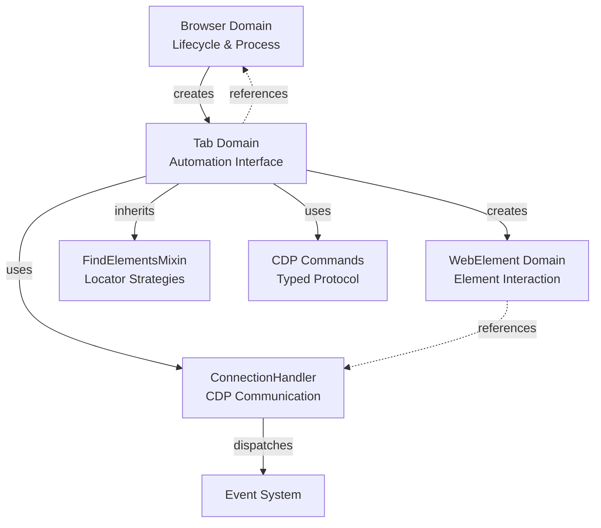

# Tab Domain Architecture

The Tab domain is Pydoll's primary interface for browser automation, acting as an orchestration layer that integrates multiple CDP domains into a cohesive API. This document explores its internal architecture, design patterns, and the engineering decisions that shape its behavior.

!!! info "Practical Usage"
    For usage examples and practical patterns, see the [Tab Management Guide](../features/automation/tabs.md).

## Architectural Overview

The `Tab` class serves as a **façade** over Chrome DevTools Protocol, abstracting the complexity of multi-domain coordination into a unified interface.

### Component Structure

| Component | Relationship | Purpose |
|-----------|-------------|---------|
| **Tab** | Core class | Primary automation interface |
| ↳ **ConnectionHandler** | Composition (owned) | WebSocket communication with CDP |
| ↳ **Browser** | Reference (parent) | Access to browser-level state and configuration |
| ↳ **FindElementsMixin** | Inheritance | Element location capabilities |
| ↳ **WebElement** | Factory (creates) | Individual DOM element representations |

### CDP Domain Integration

The `ConnectionHandler` routes Tab operations to multiple CDP domains:

```
Tab Methods                CDP Domain          Purpose
━━━━━━━━━━━━━━━━━━━━━━━━━━━━━━━━━━━━━━━━━━━━━━━━━━━━━━━━━━━━━━━
go_to(), refresh()     →   Page            →  Navigation & lifecycle
execute_script()       →   Runtime         →  JavaScript execution
find(), query()        →   Runtime/DOM     →  Element location
get_cookies()          →   Storage         →  Session state
enable_network_events()→   Network         →  Traffic monitoring
enable_fetch_events()  →   Fetch           →  Request interception
```

### Core Responsibilities

1. **CDP Command Routing**: Translates high-level operations into domain-specific CDP commands
2. **State Management**: Tracks enabled domains, active callbacks, and session state
3. **Event Coordination**: Bridges CDP events to user-defined callbacks
4. **Element Factory**: Creates `WebElement` instances from CDP `objectId` strings
5. **Lifecycle Management**: Handles cleanup and resource deallocation

## Composition vs Inheritance: The FindElementsMixin

A key architectural decision in the Tab domain is **inheriting from `FindElementsMixin`** rather than using composition:

```python
class Tab(FindElementsMixin):
    def __init__(self, ...):
        self._connection_handler = ConnectionHandler(...)
        # Mixin methods now available on Tab
```

**Why inheritance here?**

| Approach | Pros | Cons | Pydoll's Choice |
|----------|------|------|-----------------|
| **Inheritance** | Clean API (`tab.find()`), type compatibility | Tight coupling | Used |
| Composition | Loose coupling, flexible | Verbose (`tab.finder.find()`), wrapper overhead | Not used |

**Rationale:** The mixin pattern is justified because:

- Element finding is **core to Tab identity** (every tab can find elements)
- The mixin is **stateless** - it only requires `_connection_handler` (dependency injection via duck typing)
- API ergonomics matter - `tab.find()` is more intuitive than `tab.elements.find()`

See [FindElements Mixin Deep Dive](./find-elements-mixin.md) for architectural details.

## State Management Architecture

The Tab class manages **multiple layers of state**:

###  1. Domain Enablement Flags

```python
class Tab:
    def __init__(self, ...):
        self._page_events_enabled = False
        self._network_events_enabled = False
        self._fetch_events_enabled = False
        self._dom_events_enabled = False
        self._runtime_events_enabled = False
        self._intercept_file_chooser_dialog_enabled = False
```

**Why explicit flags?**

- **Idempotency**: Calling `enable_page_events()` twice doesn't double-register
- **State inspection**: Properties like `tab.page_events_enabled` expose current state
- **Cleanup tracking**: Know which domains need disabling on tab close

**Alternative (not used):** Query CDP for enabled domains on each check → Too slow, adds latency.

### 2. Target Identity

```python
self._target_id: str              # Unique CDP identifier
self._browser_context_id: Optional[str]  # Isolation context
self._connection_port: int        # WebSocket port
```

**Design decision:** `target_id` is the **primary identifier**, not the Tab instance itself. This enables:

- **Browser-level Tab registry**: `Browser._tabs_opened[target_id] = tab`
- **Singleton pattern**: Same `target_id` always returns same `Tab` instance
- **Connection reuse**: Multiple operations on same tab share WebSocket

### 3. Feature-Specific State

```python
self._cloudflare_captcha_callback_id: Optional[int] = None  # For cleanup
self._request: Optional[Request] = None  # Lazy initialization
```

**Lazy initialization pattern:** `Request` is only created when `tab.request` is accessed:

```python
@property
def request(self) -> Request:
    if self._request is None:
        self._request = Request(self)
    return self._request
```

**Why lazy?** Most automations don't use browser-context HTTP requests. Saves memory and initialization time.


## JavaScript Execution: Dual Context Architecture

The `execute_script()` method implements **context polymorphism** - same interface, different CDP commands:

| Context | CDP Method | Use Case |
|---------|-----------|----------|
| Global (no element) | `Runtime.evaluate` | `document.title`, global scripts |
| Element-bound | `Runtime.callFunctionOn` | Element-specific operations |

**Key architectural decision:** Auto-detect execution mode based on `element` parameter presence, eliminating separate APIs (`evaluate()` vs `call_function_on()`).

**Script transformation pipeline:**

1. Replace `argument` → `this` (Selenium compatibility)
2. Detect if script is already wrapped in `function() { }`
3. Wrap if needed: `script` → `function() { script }`
4. Route to appropriate CDP command

**Why `argument` keyword?** Migration path for Selenium users, API familiarity.

!!! info "Practical Usage"
    See [Human-Like Interactions](../features/automation/human-interactions.md) for real-world script execution patterns.

## Event System Integration

The Tab acts as a **thin wrapper** over ConnectionHandler's event system, but adds an important layer: **non-blocking callback execution**.

```python
async def on(self, event_name: str, callback: Callable, temporary: bool = False) -> int:
    # Wrap async callbacks to execute in background
    async def callback_wrapper(event):
        asyncio.create_task(callback(event))
    
    if asyncio.iscoroutinefunction(callback):
        function_to_register = callback_wrapper  # Non-blocking wrapper
    else:
        function_to_register = callback  # Sync callbacks execute directly
    
    # Delegate registration to ConnectionHandler
    return await self._connection_handler.register_callback(
        event_name, function_to_register, temporary
    )
```

**Architectural role:** Tab provides tab-scoped event registration with non-blocking execution semantics, while ConnectionHandler handles WebSocket plumbing and sequential callback invocation.

**Key features:**

- **Background execution** via `asyncio.create_task()` for async callbacks (fire-and-forget)
- **Sync/async callback auto-detection**
- **Temporary callbacks** for one-shot handlers
- **Callback ID** for explicit removal

**Execution model:**

| Layer | Behavior | Purpose |
|-------|----------|---------|
| **User callback** | Runs in background task | Never blocks other callbacks or CDP commands |
| **Tab wrapper** | `create_task(callback())` | Launches background task, returns immediately |
| **EventsManager** | `await wrapper()` | Sequentially invokes wrappers for the same event |

**Why the wrapper?** Without it, a slow async callback would block other callbacks for the same event. The `create_task` wrapper ensures all callbacks start "simultaneously" (in separate tasks), preventing one slow callback from delaying others.

!!! info "Detailed Architecture"
    See [Event Architecture Deep Dive](./event-architecture.md) for internal event routing mechanisms and EventsManager's sequential invocation pattern.
    
    **Practical usage:** [Event System Guide](../features/advanced/event-system.md)

## Session State: Cookie Management

**Architectural separation:** Cookies route to **Storage domain** (manipulation), not Network domain (observation).

```python
async def set_cookies(self, cookies: list[CookieParam]):
    return await self._execute_command(
        StorageCommands.set_cookies(cookies, self._browser_context_id)
    )
```

**Context-aware design:** `browser_context_id` parameter ensures cookie isolation, enabling multi-account automation.

!!! info "Practical Cookie Management"
    See [Cookies & Sessions Guide](../features/browser-management/cookies-sessions.md) for usage patterns and anti-detection strategies.

## Content Capture: CDP Target Restrictions

**Critical limitation:** `Page.captureScreenshot` only works on **top-level targets**. Iframe tabs fail silently (no `data` field in response).

```python
try:
    screenshot_data = response['result']['data']
except KeyError:
    raise TopLevelTargetRequired(...)  # Guide users to WebElement.take_screenshot()
```

**Design implication:** Historically, Pydoll created dedicated Tab instances for iframes. The new model keeps iframe interaction inside `WebElement`, so screenshots and other helpers should target elements within the frame (for example, `await iframe_element.find(...).take_screenshot()`).

**PDF Generation:** `Page.printToPDF` returns base64-encoded data. Pydoll abstracts file I/O, but underlying data is always base64 (CDP spec).

!!! info "Practical Usage"
    See [Screenshots & PDFs Guide](../features/automation/screenshots-and-pdfs.md) for parameters, formats, and real-world examples.

## Network Monitoring: Stateful Design

**Architectural principle:** Network methods require **enabled state** - runtime checks prevent accessing nonexistent data.

**Storage separation:**

- **Logs**: Buffered in `ConnectionHandler` (receives all CDP events)
- **Tab**: Queries handler, no duplicate storage
- **Response bodies**: Retrieved on-demand via `Network.getResponseBody(requestId)`

**Critical timing constraint:** Response bodies must be fetched **within ~30s** after response (browser garbage collection).

!!! info "Network Monitoring in Practice"
    See [Network Monitoring Guide](../features/network/monitoring.md) for comprehensive event tracking and analysis patterns.
    
    **Request interception:** [Request Interception Guide](../features/network/interception.md)

## Dialog Management: Event Capture Pattern

**Critical CDP behavior:** JavaScript dialogs **block all CDP commands** until handled.

**Architectural solution:** `ConnectionHandler` captures `Page.javascriptDialogOpening` events immediately, preventing automation hangs.

```python
# Handler stores dialog event before user code runs
self._connection_handler.dialog  # Captured by handler
# Tab queries stored event
async def has_dialog(self) -> bool:
    return bool(self._connection_handler.dialog)
```

**Why this design?** Event fires before user callbacks execute. Without immediate capture, automation would deadlock waiting for blocked CDP responses.

## IFrame Architecture: Tab Reuse Pattern

**Key insight:** IFrames are **first-class CDP targets** → Represented as `Tab` instances.

**Target resolution algorithm:**

1. Extract `src` attribute from iframe element
2. Query all CDP targets via `Target.getTargets()`
3. Match iframe URL to target `targetId`
4. Check singleton registry (`Browser._tabs_opened`)
5. Return existing instance or create + register new Tab

**Design tradeoff:** IFrame tabs inherit all Tab methods, but some fail (e.g., `take_screenshot()`). Alternative (dedicated `IFrame` class) would duplicate 90% of API for minimal benefit.

!!! info "Working with IFrames"
    See [IFrame Interaction Guide](../features/automation/iframes.md) for practical patterns, nested frames, and common pitfalls.

## Context Managers: Automatic Resource Cleanup

**Architectural pattern:** State restoration + optimistic resource acquisition.

### Key Context Managers

| Manager | Pattern | Key Feature |
|---------|---------|-------------|
| `expect_file_chooser()` | State restoration | Restores domain enablement after exit |
| `expect_download()` | Temporary resources | Auto-cleanup temp directories |

**File Chooser Design:**

- Enable required domains (`Page`, file chooser interception)
- Register **temporary callback** (auto-removes after first fire)
- Restore original state on exit (if domains were disabled before, disable again)

**Download Handling Design:**

- Create temporary directory (or use provided path)
- Use `asyncio.Future` for coordination (`will_begin_future`, `done_future`)
- Browser-level configuration (downloads are per-context, not per-tab)
- Guaranteed cleanup via `finally` block

!!! info "Practical File Operations"
    See [File Operations Guide](../features/automation/file-operations.md) for upload patterns, file chooser usage, and download handling.

## Lifecycle: Tab Closure and Invalidation

**Tab closure cascade:**

1. CDP closes browser tab (`Page.close`)
2. Tab unregisters from `Browser._tabs_opened`
3. WebSocket auto-closes (CDP target destroyed)
4. Event callbacks garbage-collected

**Post-closure behavior:** Tab instance becomes **invalid** - further operations fail (closed WebSocket).

**Design decision:** No explicit `_closed` flag. Users manage lifecycle. Alternative (state tracking) adds overhead for marginal safety benefit.

## Key Architectural Decisions

### Per-Tab WebSocket Strategy

**Chosen design:** Each Tab creates its own ConnectionHandler with a dedicated WebSocket connection to `ws://localhost:port/devtools/page/{targetId}`.

**Rationale:**

CDP supports **two connection models**:

1. **Browser-level**: Single connection to `ws://localhost:port/devtools/browser/...` (used by Browser instance)
2. **Tab-level**: Per-tab connections to `ws://localhost:port/devtools/page/{targetId}` (used by Tab instances)

Pydoll uses **both**:

- **Browser** has its own ConnectionHandler for browser-wide operations (contexts, downloads, browser-level events)
- **Each Tab** has its own ConnectionHandler for tab-specific operations (navigation, element finding, tab events)

**Benefits of per-tab WebSockets:**

- **True parallelism**: Multiple tabs can execute CDP commands simultaneously without waiting
- **Independent event streams**: Each tab receives only its own events (no filtering needed)
- **Isolated failures**: Connection issues in one tab don't affect others
- **Simplified routing**: No need to demultiplex messages by targetId

**Tradeoff:** More open connections (one per tab), but CDP and browsers handle this efficiently. For 10 tabs, this is 11 connections total (1 browser + 10 tabs), which is negligible compared to the HTTP connections the tabs themselves create.

!!! info "Browser vs Tab Communication"
    See [Browser Domain Architecture](./browser-domain.md) for details on the browser-level ConnectionHandler and how Browser/Tab coordination works.

### Browser Reference Necessity

**Why Tab stores `_browser` reference:**
- Context queries (`browser_context_id` for cookies)
- Browser-level operations (download behavior, iframe registry)
- Configuration access (`browser.options.page_load_state`)

### API Design Choices

| Choice | Rationale |
|--------|-----------|
| **Async properties** (`current_url`, `page_source`) | Signal live data + CDP cost |
| **Separate `enable`/`disable` methods** | Explicit over implicit, matches CDP naming |
| **No `_closed` flag** | Users manage lifecycle, reduces overhead |
| **`argument` keyword in scripts** | Selenium compatibility, migration path |

## Relationship to Other Domains

The Tab domain sits at the **center** of Pydoll's architecture:



**Key relationships:**

1. **Browser → Tab**: Parent-child. Browser manages Tab lifecycle and shared state.
2. **Tab → ConnectionHandler**: Composition. Tab delegates CDP communication.
3. **Tab → WebElement**: Factory. Tab creates elements from `objectId` strings.
4. **Tab ← FindElementsMixin**: Inheritance. Tab gains element location methods.
5. **Tab ↔ Browser**: Bidirectional reference. Tab queries browser for context info.

## Summary: Design Philosophy

The Tab domain prioritizes **API ergonomics** and **correctness** over micro-optimizations:

- **Façade pattern** abstracts CDP complexity
- **State management** via explicit flags prevents double-enabling
- **Resource management** through context managers
- **Event coordination** with background execution (non-blocking)

**Core tradeoffs:**

| Decision | Benefit | Cost | Verdict |
|----------|---------|------|---------|
| Per-tab WebSocket | True parallelism | More connections | Justified |
| Inherit FindElementsMixin | Clean API | Tight coupling | Justified |
| Lazy Request init | Memory efficiency | Property overhead | Justified |

## Further Reading

**Practical guides:**

- [Tab Management](../features/automation/tabs.md) - Multi-tab patterns, lifecycle, concurrency
- [Element Finding](../features/element-finding.md) - Selectors and DOM traversal
- [Event System](../features/advanced/event-system.md) - Real-time browser monitoring

**Architectural deep-dives:**

- [Event Architecture](./event-architecture.md) - WebSocket plumbing and event routing
- [FindElements Mixin](./find-elements-mixin.md) - Selector resolution algorithms
- [Browser Domain](./browser-domain.md) - Process management and contexts
