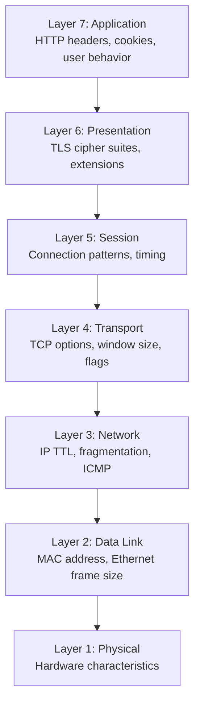
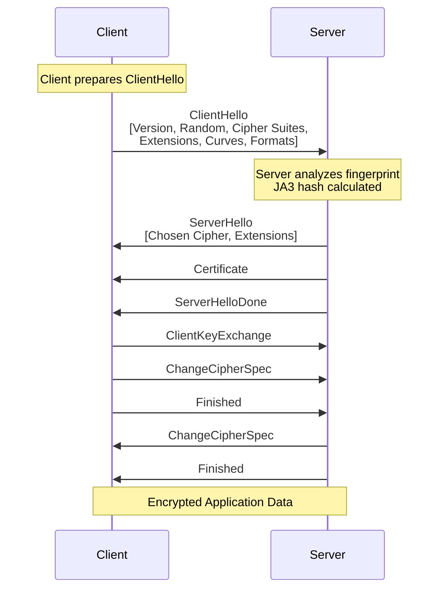

# Network-Level Fingerprinting

This document explores fingerprinting at the network protocol level, from TCP/IP characteristics to TLS handshake patterns. Understanding how devices are identified **before the browser even loads** is crucial for evading sophisticated detection systems.

!!! info "Module Navigation"
    - **[← Fingerprinting Overview](./index.md)** - Module introduction and philosophy
    - **[→ Browser Fingerprinting](./browser-fingerprinting.md)** - Application-layer fingerprinting
    - **[→ Evasion Techniques](./evasion-techniques.md)** - Practical countermeasures
    
    For network fundamentals, see **[Network Fundamentals](../network/network-fundamentals.md)** and **[Proxy Architecture](../network/http-proxies.md)**.

!!! warning "OS-Level Characteristics"
    Network fingerprinting operates at layers 3-6 of the OSI model. Unlike browser-level characteristics (modifiable with JavaScript), network-level fingerprints require **OS-level** or **kernel-level** changes to spoof effectively.

## Network-Level Fingerprinting

Network fingerprinting operates at layers 3-7 of the OSI model, analyzing characteristics of network packets, protocols, and connections to identify the client.

### Why Network Fingerprinting Matters

Unlike browser-level fingerprinting (which can be modified with JavaScript), network-level characteristics are:

- **Harder to modify**: Require OS-level or kernel changes
- **More persistent**: Can't be cleared like cookies or localStorage
- **Cross-application**: Same fingerprint across all applications on the device
- **Proxy-resistant**: Some characteristics survive proxy/VPN tunneling

!!! info "Layered Fingerprinting"
    Sophisticated detection systems use **multiple layers** of fingerprinting. Even if you spoof browser-level characteristics, network-level inconsistencies can reveal automation.

### The OSI Model and Fingerprinting Layers



**Fingerprinting occurs at:**

- **Layer 3 (Network)**: IP TTL, fragmentation behavior
- **Layer 4 (Transport)**: TCP/UDP options, initial sequence numbers, window scaling
- **Layer 6 (Presentation)**: TLS handshake, cipher suites, extensions
- **Layer 7 (Application)**: HTTP headers, HTTP/2 settings, protocol-specific behavior

## TCP/IP Fingerprinting (Layer 3-4)

TCP/IP fingerprinting analyzes characteristics of TCP and IP packets to identify the operating system and network stack implementation.

### TCP Packet Structure

```python
# TCP header fields used for fingerprinting
{
    'ip_ttl': 64,                    # Initial TTL value (OS-specific)
    'window_size': 65535,            # TCP window size
    'window_scaling': 7,             # Window scale factor
    'mss': 1460,                     # Maximum Segment Size
    'timestamp': True,               # TCP timestamp option
    'sack': True,                    # Selective Acknowledgment
    'options_order': ['MSS', 'SACK_PERM', 'TIMESTAMP', 'NOP', 'WSCALE']
}
```

### Key TCP/IP Characteristics

#### 1. Time To Live (TTL)

TTL values are OS-specific and decrease with each network hop:

| Operating System | Initial TTL | After 10 Hops |
|-----------------|-------------|---------------|
| **Linux** | 64 | 54 |
| **Windows** | 128 | 118 |
| **macOS** | 64 | 54 |
| **Cisco/Routers** | 255 | 245 |

```python
# TTL fingerprinting
def detect_os_by_ttl(ttl: int) -> str:
    """
    Detect OS based on TTL value.
    Note: TTL decreases by 1 for each router hop.
    """
    if ttl <= 64:
        return 'Linux/macOS (initial: 64)'
    elif ttl <= 128:
        return 'Windows (initial: 128)'
    elif ttl <= 255:
        return 'Network device (initial: 255)'
    else:
        return 'Unknown'

# Example: Received TTL = 54
# → Original TTL likely 64 (Linux/macOS)
# → Packet traveled through ~10 hops
```

!!! warning "TTL and Proxies"
    When using proxies, the TTL value resets at the proxy server. However, inconsistencies can reveal proxy usage:
    
    - User-Agent says "Windows" → TTL suggests Linux (proxy server OS)
    - TTL too low for claimed location (suggests VPN/proxy routing)

#### 2. TCP Window Size

Initial TCP window size varies by OS and configuration:

```python
# Common window sizes by OS
OS_WINDOW_SIZES = {
    'Windows 10': 8192,          # Default
    'Windows 11': 65535,         # More aggressive
    'Linux (recent)': 29200,     # Modern kernels
    'macOS': 65535,              # Optimistic
    'Android': 65535,            # Mobile-optimized
}
```

#### 3. TCP Options and Their Order

The presence and **order** of TCP options creates a unique fingerprint:

```python
# Example TCP options in SYN packet
{
    # Windows 10 typical order
    'windows': ['MSS', 'NOP', 'WSCALE', 'NOP', 'NOP', 'SACK_PERM'],
    
    # Linux typical order  
    'linux': ['MSS', 'SACK_PERM', 'TIMESTAMP', 'NOP', 'WSCALE'],
    
    # macOS typical order
    'macos': ['MSS', 'NOP', 'WSCALE', 'NOP', 'NOP', 'TIMESTAMP', 'SACK_PERM', 'EOL']
}
```

**TCP Option Codes:**

| Code | Name | Purpose |
|------|------|---------|
| 0 | EOL | End of Options List |
| 1 | NOP | No Operation (padding) |
| 2 | MSS | Maximum Segment Size |
| 3 | WSCALE | Window Scale Factor |
| 4 | SACK_PERM | SACK Permitted |
| 8 | TIMESTAMP | Timestamp for RTT calculation |

### Passive OS Fingerprinting with p0f

[p0f](http://lcamtuf.coredump.cx/p0f3/) is a powerful passive OS fingerprinting tool created by Michal Zalewski that analyzes TCP/IP packet characteristics without sending any traffic to the target.

```bash
# Install p0f
sudo apt-get install p0f

# Passive fingerprinting (reads from interface)
sudo p0f -i eth0

# Read from pcap file
p0f -r capture.pcap

# Output example:
# 192.168.1.100:12345 → 93.184.216.34:443
#   OS: Linux 3.11 and newer
#   Signature: 4:64:0:*:mss*20,10:mss,sok,ts,nop,ws:df,id+:0
```

!!! info "p0f Signature Database"
    p0f maintains an extensive signature database (`p0f.fp`) with thousands of OS fingerprints. The tool is particularly effective because it performs **passive** fingerprinting, analyzing traffic without generating any packets that might alert intrusion detection systems.

**p0f Signature Format:**

```
version:ittl:olen:mss:wsize,scale:olayout:quirks:pclass
```

- `version`: IP version (4 or 6)
- `ittl`: Initial TTL
- `olen`: Options length
- `mss`: Maximum Segment Size
- `wsize,scale`: Window size and scaling
- `olayout`: Options layout (order and types)
- `quirks`: Unusual behaviors (df=don't fragment, id+=non-zero IP ID)
- `pclass`: Payload classification

### Active OS Fingerprinting with Nmap

[Nmap](https://nmap.org/) (Network Mapper) is the de facto standard for active OS fingerprinting, developed by Gordon Lyon (Fyodor). It sends specially crafted packets and analyzes the responses to determine OS characteristics.

```bash
# OS detection
nmap -O 93.184.216.34

# Detailed OS detection with version scanning
nmap -A 93.184.216.34

# TCP/IP fingerprinting only
nmap -sV --script=banner 93.184.216.34

# Output example:
# OS details: Linux 5.4 - 5.10
# Network Distance: 11 hops
# TCP Sequence Prediction: Difficulty=260 (Good luck!)
```

**Nmap's OS Detection Tests:**

- **TCP ISN sampling**: Analyzes Initial Sequence Number generation
- **TCP options**: Tests window size, MSS, SACK, and option ordering
- **ICMP responses**: Sends echo requests and analyzes TTL, code, and payloads
- **Closed port TCP responses**: Sends packets to closed ports and analyzes RST responses
- **IP ID sequence**: Tests how the OS generates IP identification fields

!!! tip "Nmap Fingerprint Database"
    Nmap maintains one of the most comprehensive OS fingerprint databases in the world (`nmap-os-db`), updated regularly by the community. You can submit new fingerprints to improve detection accuracy.

### Python Implementation: TCP Fingerprinting

The following implementation uses [Scapy](https://scapy.net/), a powerful Python library for packet manipulation and network analysis created by Philippe Biondi.

```python
from scapy.all import IP, TCP, sr1, sniff
import logging

logging.basicConfig(level=logging.INFO)
logger = logging.getLogger(__name__)


class TCPFingerprinter:
    """
    Analyze TCP/IP characteristics to fingerprint the remote host.
    """
    
    def __init__(self, target_ip: str, target_port: int = 80):
        self.target_ip = target_ip
        self.target_port = target_port
        self.fingerprint = {}
    
    def capture_syn_ack(self) -> dict:
        """
        Send SYN packet and capture SYN-ACK response.
        """
        # Craft SYN packet
        ip = IP(dst=self.target_ip)
        syn = TCP(sport=40000, dport=self.target_port, flags='S', seq=1000)
        
        # Send and receive
        logger.info(f"Sending SYN to {self.target_ip}:{self.target_port}")
        syn_ack = sr1(ip/syn, timeout=2, verbose=0)
        
        if not syn_ack or not syn_ack.haslayer(TCP):
            logger.error("No SYN-ACK received")
            return {}
        
        # Extract fingerprint characteristics
        tcp_layer = syn_ack.getlayer(TCP)
        ip_layer = syn_ack.getlayer(IP)
        
        fingerprint = {
            'ip_ttl': ip_layer.ttl,
            'ip_id': ip_layer.id,
            'ip_flags': ip_layer.flags,
            'tcp_window': tcp_layer.window,
            'tcp_flags': tcp_layer.flags,
            'tcp_options': self._parse_tcp_options(tcp_layer.options),
            'tcp_options_order': [opt[0] for opt in tcp_layer.options if opt[0] != 'Padding'],
        }
        
        self.fingerprint = fingerprint
        return fingerprint
    
    def _parse_tcp_options(self, options: list) -> dict:
        """Parse TCP options into a readable format."""
        parsed = {}
        
        for option in options:
            opt_name = option[0]
            
            if opt_name == 'MSS':
                parsed['mss'] = option[1]
            elif opt_name == 'WScale':
                parsed['window_scale'] = option[1]
            elif opt_name == 'Timestamp':
                parsed['timestamp'] = option[1]
            elif opt_name == 'SAckOK':
                parsed['sack_permitted'] = True
            elif opt_name == 'NOP':
                pass  # Padding
            elif opt_name == 'EOL':
                break  # End of options
        
        return parsed
    
    def generate_signature(self) -> str:
        """
        Generate p0f-like signature string.
        """
        if not self.fingerprint:
            return ''
        
        fp = self.fingerprint
        
        # Format: version:ttl:window:options_order
        version = 4  # IPv4
        ttl = fp.get('ip_ttl', 0)
        window = fp.get('tcp_window', 0)
        
        # Options order as string
        opts = ','.join(fp.get('tcp_options_order', []))
        
        signature = f"{version}:{ttl}:{window}:{opts}"
        return signature
    
    def detect_os(self) -> str:
        """
        Detect OS based on collected fingerprint.
        """
        if not self.fingerprint:
            return 'Unknown (no data)'
        
        ttl = self.fingerprint.get('ip_ttl', 0)
        window = self.fingerprint.get('tcp_window', 0)
        opts_order = self.fingerprint.get('tcp_options_order', [])
        
        # Simple heuristic-based detection
        if ttl <= 64:
            if window == 29200:
                return 'Linux (recent kernel)'
            elif window == 65535:
                if 'Timestamp' in opts_order and 'SAckOK' in opts_order:
                    return 'Linux 3.x+'
                else:
                    return 'macOS'
            else:
                return 'Linux/Unix'
        
        elif ttl <= 128:
            if window == 8192:
                return 'Windows 10'
            elif window == 65535:
                return 'Windows 11 or Windows Server'
            else:
                return 'Windows'
        
        elif ttl <= 255:
            return 'Network device (router/firewall)'
        
        return 'Unknown OS'
    
    def print_fingerprint(self):
        """Pretty print the fingerprint."""
        if not self.fingerprint:
            print("No fingerprint data available")
            return
        
        print("\n=== TCP/IP Fingerprint ===")
        print(f"Target: {self.target_ip}:{self.target_port}")
        print(f"\nIP Layer:")
        print(f"  TTL: {self.fingerprint.get('ip_ttl')}")
        print(f"  IP ID: {self.fingerprint.get('ip_id')}")
        print(f"  Flags: {self.fingerprint.get('ip_flags')}")
        
        print(f"\nTCP Layer:")
        print(f"  Window Size: {self.fingerprint.get('tcp_window')}")
        print(f"  Flags: {self.fingerprint.get('tcp_flags')}")
        
        print(f"\nTCP Options:")
        for opt, value in self.fingerprint.get('tcp_options', {}).items():
            print(f"  {opt}: {value}")
        
        print(f"\nOptions Order: {' → '.join(self.fingerprint.get('tcp_options_order', []))}")
        print(f"\nSignature: {self.generate_signature()}")
        print(f"Detected OS: {self.detect_os()}")
        print("=" * 30)


# Usage example
def fingerprint_target(ip: str, port: int = 80):
    """Fingerprint a target host."""
    fingerprinter = TCPFingerprinter(ip, port)
    
    try:
        fingerprinter.capture_syn_ack()
        fingerprinter.print_fingerprint()
    except PermissionError:
        print("Error: Raw socket access requires root/admin privileges")
        print("Run with: sudo python3 script.py")
    except Exception as e:
        print(f"Error: {e}")


# Example usage (requires root):
# fingerprint_target('93.184.216.34', 80)  # example.com
```

**Example Output:**

```
=== TCP/IP Fingerprint ===
Target: 93.184.216.34:80

IP Layer:
  TTL: 54
  IP ID: 0
  Flags: DF (Don't Fragment)

TCP Layer:
  Window Size: 29200
  Flags: SA (SYN-ACK)

TCP Options:
  mss: 1460
  window_scale: 7
  sack_permitted: True
  timestamp: (123456789, 0)

Options Order: MSS → SAckOK → Timestamp → NOP → WScale

Signature: 4:54:29200:MSS,SAckOK,Timestamp,NOP,WScale
Detected OS: Linux (recent kernel)
==============================
```

### TCP Initial Sequence Number (ISN) Analysis

```python
def analyze_isn_randomness(target_ip: str, samples: int = 10) -> dict:
    """
    Analyze TCP Initial Sequence Number generation.
    Different OSes use different ISN generation algorithms.
    """
    import statistics
    
    sequence_numbers = []
    
    for i in range(samples):
        syn = IP(dst=target_ip)/TCP(sport=40000+i, dport=80, flags='S')
        syn_ack = sr1(syn, timeout=2, verbose=0)
        
        if syn_ack and syn_ack.haslayer(TCP):
            isn = syn_ack[TCP].seq
            sequence_numbers.append(isn)
        
        # Small delay between probes
        time.sleep(0.1)
    
    if len(sequence_numbers) < 2:
        return {'error': 'Insufficient data'}
    
    # Calculate statistics
    deltas = [sequence_numbers[i+1] - sequence_numbers[i] 
              for i in range(len(sequence_numbers)-1)]
    
    return {
        'sample_count': len(sequence_numbers),
        'isn_values': sequence_numbers,
        'deltas': deltas,
        'avg_delta': statistics.mean(deltas),
        'stdev_delta': statistics.stdev(deltas) if len(deltas) > 1 else 0,
        'min_delta': min(deltas),
        'max_delta': max(deltas),
        'randomness': 'High' if statistics.stdev(deltas) > 100000 else 'Low'
    }
```

**ISN Generation by OS:**

| OS | ISN Algorithm | Predictability |
|----|---------------|----------------|
| **Linux (modern)** | [RFC 6528](https://tools.ietf.org/html/rfc6528) (hash-based) | Very random |
| **Windows** | RFC 6528 | Very random |
| **Old Linux** | Time-based counter | Somewhat predictable |
| **BSD** | [RFC 1948](https://tools.ietf.org/html/rfc1948) (MD5-based) | Random |

!!! danger "ISN Prediction Attacks"
    Historically, predictable ISNs enabled **TCP hijacking attacks** (see [Mitnick attack, 1995](https://en.wikipedia.org/wiki/Kevin_Mitnick#Arrest,_conviction,_and_incarceration)). Modern systems implement [RFC 6528](https://tools.ietf.org/html/rfc6528) "Defending against Sequence Number Attacks" using cryptographically secure random number generators for ISN, making prediction computationally infeasible.

## TLS/SSL Fingerprinting (Layer 6)

TLS fingerprinting is one of the most powerful techniques for identifying clients, as the TLS handshake reveals detailed information about the client's cryptographic capabilities and implementation.

### TLS Handshake Overview



### JA3: TLS Client Fingerprinting

[JA3](https://github.com/salesforce/ja3) is a method developed by John Althouse, Jeff Atkinson, and Josh Atkins at Salesforce for creating fingerprints of TLS clients by analyzing the ClientHello packet. The technique has become an industry standard for TLS fingerprinting.

**JA3 Components:**

```python
# JA3 fingerprint components (in order)
ja3_components = {
    1: 'TLS Version',          # e.g., 771 = TLS 1.2, 772 = TLS 1.3
    2: 'Cipher Suites',        # e.g., '49195,49199,52393'
    3: 'Extensions',           # e.g., '0,10,11,13'  
    4: 'Elliptic Curves',      # e.g., '23,24,25'
    5: 'EC Point Formats',     # e.g., '0'
}

# JA3 string format (comma-separated)
ja3_string = f"{version},{ciphers},{extensions},{curves},{formats}"

# JA3 hash (MD5 of the string)
ja3_hash = hashlib.md5(ja3_string.encode()).hexdigest()
```

**Example JA3:**

```
String: 771,49195-49199-52393-49196-49200-52392,0-10-11-13-65281,23-24-25,0
Hash:   579ccef312d18482fc42e2b822ca2430
```

### Generating JA3 Fingerprints with Python

```python
import hashlib
import ssl
import socket
from typing import Optional, Dict, List


class JA3Generator:
    """
    Generate JA3 fingerprints from TLS ClientHello packets.
    """
    
    # TLS Version mappings
    TLS_VERSIONS = {
        0x0301: 'TLS 1.0',
        0x0302: 'TLS 1.1',
        0x0303: 'TLS 1.2',
        0x0304: 'TLS 1.3',
    }
    
    # Common cipher suites
    CIPHER_SUITES = {
        0x002f: 'TLS_RSA_WITH_AES_128_CBC_SHA',
        0x0035: 'TLS_RSA_WITH_AES_256_CBC_SHA',
        0xc013: 'TLS_ECDHE_RSA_WITH_AES_128_CBC_SHA',
        0xc014: 'TLS_ECDHE_RSA_WITH_AES_256_CBC_SHA',
        0xc02f: 'TLS_ECDHE_RSA_WITH_AES_128_GCM_SHA256',
        0xc02b: 'TLS_ECDHE_ECDSA_WITH_AES_128_GCM_SHA256',
        0x1301: 'TLS_AES_128_GCM_SHA256',          # TLS 1.3
        0x1302: 'TLS_AES_256_GCM_SHA384',          # TLS 1.3
        0x1303: 'TLS_CHACHA20_POLY1305_SHA256',    # TLS 1.3
    }
    
    # TLS Extensions
    EXTENSIONS = {
        0: 'server_name',
        1: 'max_fragment_length',
        5: 'status_request',
        10: 'supported_groups',
        11: 'ec_point_formats',
        13: 'signature_algorithms',
        16: 'application_layer_protocol_negotiation',
        18: 'signed_certificate_timestamp',
        23: 'extended_master_secret',
        27: 'compress_certificate',
        35: 'session_ticket',
        43: 'supported_versions',
        45: 'psk_key_exchange_modes',
        51: 'key_share',
        65281: 'renegotiation_info',
    }
    
    @staticmethod
    def parse_client_hello(client_hello_bytes: bytes) -> Dict:
        """
        Parse ClientHello packet and extract JA3 components.
        """
        if len(client_hello_bytes) < 43:
            raise ValueError("Invalid ClientHello packet (too short)")
        
        # TLS Record Header (5 bytes)
        # Content Type (1) | Version (2) | Length (2)
        content_type = client_hello_bytes[0]
        record_version = int.from_bytes(client_hello_bytes[1:3], 'big')
        
        # Handshake Header (4 bytes)
        # Handshake Type (1) | Length (3)
        handshake_type = client_hello_bytes[5]
        
        if handshake_type != 0x01:  # ClientHello
            raise ValueError("Not a ClientHello packet")
        
        # ClientHello Version (2 bytes at offset 9)
        client_version = int.from_bytes(client_hello_bytes[9:11], 'big')
        
        # Random (32 bytes)
        offset = 11 + 32  # Skip version + random
        
        # Session ID
        session_id_length = client_hello_bytes[offset]
        offset += 1 + session_id_length
        
        # Cipher Suites
        cipher_suites_length = int.from_bytes(client_hello_bytes[offset:offset+2], 'big')
        offset += 2
        
        cipher_suites = []
        for i in range(0, cipher_suites_length, 2):
            cipher = int.from_bytes(client_hello_bytes[offset+i:offset+i+2], 'big')
            cipher_suites.append(cipher)
        
        offset += cipher_suites_length
        
        # Compression Methods
        compression_length = client_hello_bytes[offset]
        offset += 1 + compression_length
        
        # Extensions
        extensions = []
        elliptic_curves = []
        ec_point_formats = []
        
        if offset < len(client_hello_bytes) - 2:
            extensions_length = int.from_bytes(client_hello_bytes[offset:offset+2], 'big')
            offset += 2
            
            extensions_end = offset + extensions_length
            
            while offset < extensions_end:
                ext_type = int.from_bytes(client_hello_bytes[offset:offset+2], 'big')
                ext_length = int.from_bytes(client_hello_bytes[offset+2:offset+4], 'big')
                offset += 4
                
                extensions.append(ext_type)
                
                # Parse specific extensions
                if ext_type == 10:  # supported_groups
                    curves_length = int.from_bytes(client_hello_bytes[offset:offset+2], 'big')
                    for i in range(2, curves_length + 2, 2):
                        curve = int.from_bytes(client_hello_bytes[offset+i:offset+i+2], 'big')
                        elliptic_curves.append(curve)
                
                elif ext_type == 11:  # ec_point_formats
                    formats_length = client_hello_bytes[offset]
                    for i in range(1, formats_length + 1):
                        fmt = client_hello_bytes[offset + i]
                        ec_point_formats.append(fmt)
                
                offset += ext_length
        
        # Filter GREASE values (randomized by browsers to prevent ossification)
        # GREASE (RFC 8701): Generate Random Extensions And Sustain Extensibility
        # GREASE values: 0x0a0a, 0x1a1a, 0x2a2a, 0x3a3a, etc.
        def is_grease(value: int) -> bool:
            return (value & 0x0f0f) == 0x0a0a
        
        cipher_suites = [c for c in cipher_suites if not is_grease(c)]
        extensions = [e for e in extensions if not is_grease(e)]
        elliptic_curves = [c for c in elliptic_curves if not is_grease(c)]
        
        return {
            'version': client_version,
            'cipher_suites': cipher_suites,
            'extensions': extensions,
            'elliptic_curves': elliptic_curves,
            'ec_point_formats': ec_point_formats,
        }
    
    @staticmethod
    def generate_ja3(parsed_hello: Dict) -> tuple[str, str]:
        """
        Generate JA3 string and hash from parsed ClientHello.
        
        Note: GREASE values should already be filtered from parsed_hello
        to ensure consistent fingerprints across connections.
        """
        # Join components with '-'
        version = str(parsed_hello['version'])
        ciphers = '-'.join(str(c) for c in parsed_hello['cipher_suites'])
        extensions = '-'.join(str(e) for e in parsed_hello['extensions'])
        curves = '-'.join(str(c) for c in parsed_hello['elliptic_curves'])
        formats = '-'.join(str(f) for f in parsed_hello['ec_point_formats'])
        
        # JA3 string (comma-separated components)
        ja3_string = f"{version},{ciphers},{extensions},{curves},{formats}"
        
        # JA3 hash (MD5)
        ja3_hash = hashlib.md5(ja3_string.encode()).hexdigest()
        
        return ja3_string, ja3_hash
    
    @staticmethod
    def capture_tls_handshake(hostname: str, port: int = 443) -> Optional[bytes]:
        """
        Capture the ClientHello from a TLS connection.
        Note: This is simplified. For production, use scapy or mitmproxy.
        """
        try:
            # Create socket but don't complete handshake
            sock = socket.socket(socket.AF_INET, socket.SOCK_STREAM)
            sock.settimeout(5)
            sock.connect((hostname, port))
            
            # In practice, you'd need to intercept the actual bytes sent
            # This is just a placeholder - use packet capture tools instead
            
            sock.close()
            return None  # Would return captured ClientHello bytes
            
        except Exception as e:
            print(f"Error capturing handshake: {e}")
            return None


!!! info "GREASE Values in TLS"
    [GREASE (RFC 8701)](https://tools.ietf.org/html/rfc8701) - "Generate Random Extensions And Sustain Extensibility" - is a technique used by modern browsers to prevent protocol ossification. Browsers randomly insert reserved values (like 0x0a0a, 0x1a1a, 0x2a2a) into cipher suites, extensions, and other fields.
    
    **Why GREASE matters for fingerprinting:**
    
    - These values change on every connection, making raw TLS handshakes non-deterministic
    - JA3 implementations must **filter out** GREASE values to create consistent fingerprints
    - Servers that reject GREASE values are non-compliant and reveal themselves
    - Missing GREASE in automation can be a detection signal (real browsers always use it)


def analyze_ja3_from_pcap(pcap_file: str):
    """
    Analyze JA3 fingerprints from a pcap file.
    Requires scapy and tls parsing capabilities.
    """
    from scapy.all import rdpcap, TCP
    from scapy.layers.tls.record import TLS
    from scapy.layers.tls.handshake import TLSClientHello
    
    packets = rdpcap(pcap_file)
    ja3_results = []
    
    for packet in packets:
        if packet.haslayer(TLS) and packet.haslayer(TLSClientHello):
            try:
                # Extract ClientHello layer
                client_hello = packet[TLSClientHello]
                
                # Build JA3 components
                version = client_hello.version
                ciphers = client_hello.ciphers
                extensions = [ext.type for ext in client_hello.ext] if hasattr(client_hello, 'ext') else []
                
                # Parse extensions for curves and formats
                curves = []
                formats = []
                
                if hasattr(client_hello, 'ext'):
                    for ext in client_hello.ext:
                        if ext.type == 10:  # supported_groups
                            curves = ext.groups if hasattr(ext, 'groups') else []
                        elif ext.type == 11:  # ec_point_formats
                            formats = ext.formats if hasattr(ext, 'formats') else []
                
                # Generate JA3
                ja3_str = f"{version},{'-'.join(map(str, ciphers))},{'-'.join(map(str, extensions))},{'-'.join(map(str, curves))},{'-'.join(map(str, formats))}"
                ja3_hash = hashlib.md5(ja3_str.encode()).hexdigest()
                
                ja3_results.append({
                    'src_ip': packet[IP].src if packet.haslayer(IP) else 'unknown',
                    'dst_ip': packet[IP].dst if packet.haslayer(IP) else 'unknown',
                    'ja3_string': ja3_str,
                    'ja3_hash': ja3_hash,
                })
                
            except Exception as e:
                print(f"Error parsing packet: {e}")
                continue
    
    return ja3_results


# Example: Known browser JA3 hashes
KNOWN_JA3_FINGERPRINTS = {
    '579ccef312d18482fc42e2b822ca2430': 'Chrome 90+ on Windows',
    'cd08e31efaa7a0a82988099039d4a289': 'Firefox 88+ on Windows',
    'ac1a36f8b3f5e5d4a6e4f0c3e5a5e5e5': 'Safari 14+ on macOS',
    'b32309a26951912be7dba376398abc3b': 'Python requests library',
    'e7d705a3286e19bd28ca826f69a8b2c9': 'curl 7.88+'

}


def identify_client(ja3_hash: str) -> str:
    """Identify client based on JA3 hash."""
    return KNOWN_JA3_FINGERPRINTS.get(ja3_hash, 'Unknown client')
```

### Tools for TLS Fingerprinting

#### 1. ja3 (Original Implementation)

The original [JA3 implementation from Salesforce](https://github.com/salesforce/ja3) provides tools for generating fingerprints from pcap files.

```bash
# Install ja3
git clone https://github.com/salesforce/ja3.git
cd ja3/python

# Generate JA3 from pcap
python3 ja3.py -a capture.pcap

# Output:
# [JA3] 192.168.1.100:12345 → 93.184.216.34:443
# JA3: 579ccef312d18482fc42e2b822ca2430
# JA3S: e35df3e00ca4ef31d42b34bebaa2f86e
```

#### 2. pmercury (Python Library)

[pmercury](https://pypi.org/project/pmercury/) is a Python library from Cisco for network fingerprinting, including TLS analysis.

```bash
# Install
pip install pmercury

# Use in Python
from pmercury.protocols.tls import TLS

tls = TLS()
protocol_type, fp_str, approx_str, server_name = tls.fingerprint(data)
```

#### 3. ts1-signatures (Advanced TLS/HTTP2 Fingerprinting)

[ts1-signatures](https://pypi.org/project/ts1-signatures/) provides more detailed fingerprinting with JSON output format.

```bash
# Install
pip install ts1-signatures

# Use in Python
import ts1

with open("capture.pcap", "rb") as pcap:
    for tls_client in ts1.tls.process_pcap(pcap):
        signature = tls_client["signature"]
        print(f"TLS Fingerprint: {signature.hash().hexdigest()}")
```

#### 4. tlsfp (Educational TLS Fingerprint Server)

[tlsfp](https://github.com/elpy1/tlsfp) is a Python HTTPS server for TLS fingerprinting, useful for testing and education.

```bash
# Install
git clone https://github.com/elpy1/tlsfp.git
cd tlsfp
python3 tlsfp.py

# Access https://localhost:8443 to see your client's fingerprint
```

#### 5. curl-impersonate

[curl-impersonate](https://github.com/lwthiker/curl-impersonate) allows you to mimic browser TLS fingerprints, useful for understanding evasion techniques.

```bash
# Install (example for Chrome)
wget https://github.com/lwthiker/curl-impersonate/releases/...
chmod +x curl-impersonate-chrome

# Make request mimicking Chrome's TLS fingerprint
./curl-impersonate-chrome https://example.com
```

!!! tip "Wireshark with JA3"
    Wireshark can display JA3 hashes with the [JA3 plugin](https://github.com/salesforce/ja3/tree/master/wireshark). This allows real-time fingerprint analysis during packet capture.

### JA3S: TLS Server Fingerprinting

JA3S is the server-side equivalent, fingerprinting servers based on ServerHello:

```python
def generate_ja3s(server_hello_bytes: bytes) -> tuple[str, str]:
    """
    Generate JA3S fingerprint from ServerHello.
    Format: Version,Cipher,Extensions
    """
    # Parse ServerHello (similar to ClientHello parsing)
    version = parse_version(server_hello_bytes)
    cipher = parse_selected_cipher(server_hello_bytes)
    extensions = parse_extensions(server_hello_bytes)
    
    # JA3S string (simpler than JA3)
    ja3s_string = f"{version},{cipher},{'-'.join(map(str, extensions))}"
    ja3s_hash = hashlib.md5(ja3s_string.encode()).hexdigest()
    
    return ja3s_string, ja3s_hash
```

**JA3S Use Cases:**

- Identify server software (nginx, Apache, Cloudflare, etc.)
- Detect load balancers and CDNs
- Map infrastructure
- Identify potential vulnerabilities based on server stack

## Further Reading and References

### Technical Documents and RFCs

- **[RFC 6528](https://tools.ietf.org/html/rfc6528)**: "Defending against Sequence Number Attacks" - Modern ISN generation
- **[RFC 1948](https://tools.ietf.org/html/rfc1948)**: "Defending Against Sequence Number Attacks" - Original MD5-based ISN
- **[RFC 8701](https://tools.ietf.org/html/rfc8701)**: "Applying Generate Random Extensions And Sustain Extensibility (GREASE) to TLS"
- **[RFC 5246](https://tools.ietf.org/html/rfc5246)**: "The Transport Layer Security (TLS) Protocol Version 1.2"
- **[RFC 8446](https://tools.ietf.org/html/rfc8446)**: "The Transport Layer Security (TLS) Protocol Version 1.3"

### Tools and Libraries

- **[JA3 by Salesforce](https://github.com/salesforce/ja3)**: Original JA3 TLS fingerprinting implementation
- **[p0f](http://lcamtuf.coredump.cx/p0f3/)**: Passive OS fingerprinting tool by Michal Zalewski
- **[Nmap](https://nmap.org/)**: Network mapper and OS fingerprinting tool by Gordon Lyon
- **[Scapy](https://scapy.net/)**: Python packet manipulation library by Philippe Biondi
- **[pmercury](https://pypi.org/project/pmercury/)**: Python library for network fingerprinting from Cisco
- **[ts1-signatures](https://pypi.org/project/ts1-signatures/)**: Advanced TLS/HTTP2 fingerprinting library
- **[tlsfp](https://github.com/elpy1/tlsfp)**: Educational HTTPS TLS fingerprinting server
- **[curl-impersonate](https://github.com/lwthiker/curl-impersonate)**: cURL with browser TLS fingerprint mimicry

### Articles and Blog Posts

- **[TLS Fingerprinting: How it works, where it is used and how to control your signature](https://lwthiker.com/networks/2022/06/17/tls-fingerprinting.html)** by lwthiker - Comprehensive guide on TLS fingerprinting mechanisms
- **[TLS Fingerprinting: Advanced Guide for Security Engineers 2025](https://rebrowser.net/blog/tls-fingerprinting-advanced-guide-for-security-engineers)** by Rebrowser - Modern TLS fingerprinting techniques
- **[Overcoming TLS Fingerprinting in Web Scraping](https://rayobyte.com/blog/tls-fingerprinting/)** by Rayobyte - Practical perspective on TLS fingerprinting in automation
- **[JA3: A Method for Profiling SSL/TLS Clients](https://engineering.salesforce.com/tls-fingerprinting-with-ja3-and-ja3s-247362855967)** by Salesforce Engineering - Original JA3 announcement

### Academic Papers and Research

- **"Remote OS Detection via TCP/IP Stack Fingerprinting"** - Early research on OS fingerprinting techniques
- **"A TCP Initial Sequence Number Attack"** - Historical paper on ISN vulnerabilities
- **"TLS Fingerprinting: New Techniques for Identifying Applications"** - Modern research on TLS-based identification

### Security Resources

- **[OWASP Fingerprinting Guide](https://owasp.org/)**: Web application fingerprinting techniques
- **[IANA TLS Parameters](https://www.iana.org/assignments/tls-parameters/tls-parameters.xhtml)**: Official cipher suite and extension registries
- **[Wireshark Display Filters for TLS](https://wiki.wireshark.org/TLS)**: Guide to analyzing TLS traffic

### Historical References

- **[Kevin Mitnick TCP Hijacking Attack (1995)](https://en.wikipedia.org/wiki/Kevin_Mitnick#Arrest,_conviction,_and_incarceration)**: Famous example of ISN prediction exploitation
- **[Evolution of TCP/IP Fingerprinting](https://lcamtuf.coredump.cx/p0f3/)**: Historical perspective from p0f creator

!!! tip "Stay Updated"
    Fingerprinting techniques evolve constantly as new protocols emerge and systems adapt. Follow security blogs, subscribe to relevant RFCs, and monitor tool repositories for the latest developments.

!!! info "Practical Application"
    For practical fingerprinting evasion in Pydoll:
    
    - **[Browser Options](../features/configuration/browser-options.md)**: Command-line arguments to modify behavior
    - **[Browser Preferences](../features/configuration/browser-preferences.md)**: Internal settings for realistic fingerprints
    - **[Proxy Configuration](../features/configuration/proxy.md)**: Network-level anonymization
    - **[Proxy Architecture](./proxy-architecture.md)**: Deep dive into network fundamentals

---

