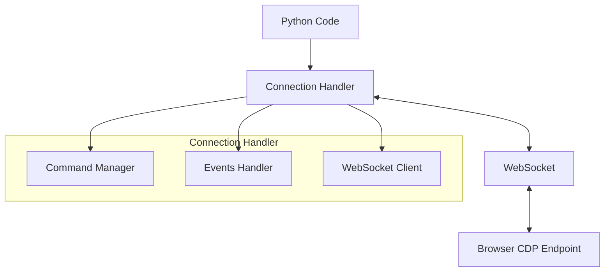
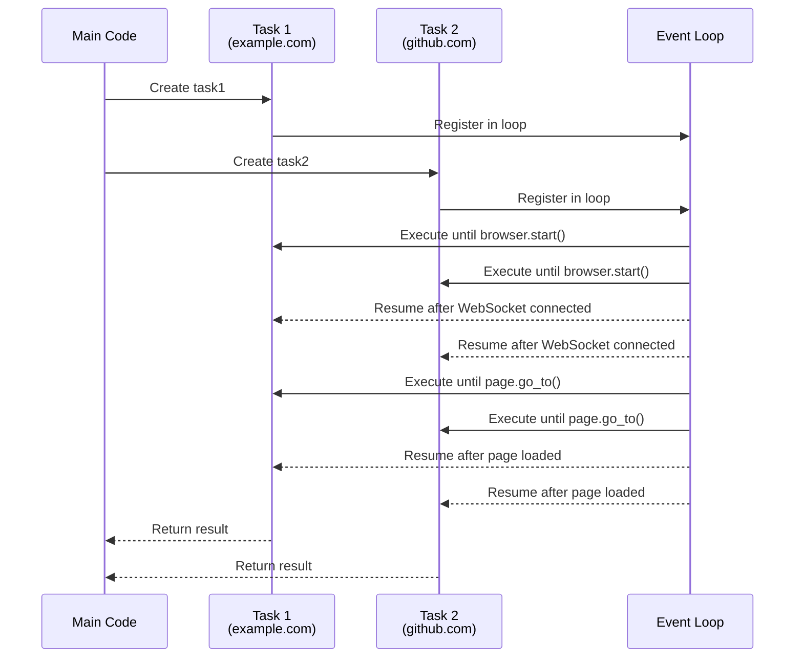
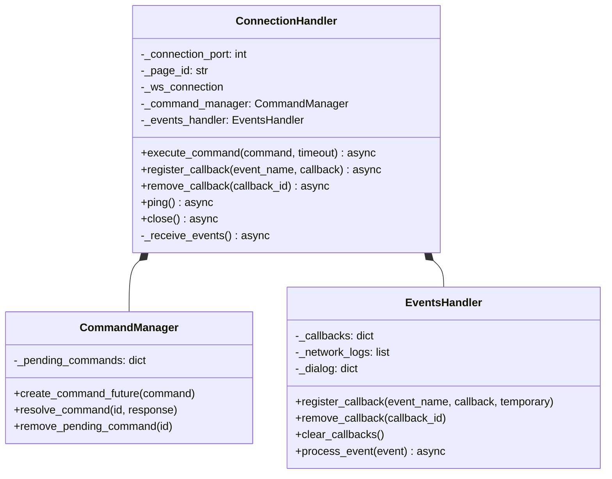
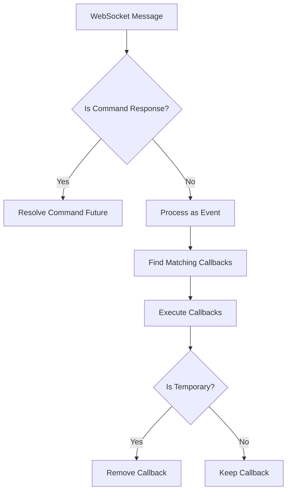
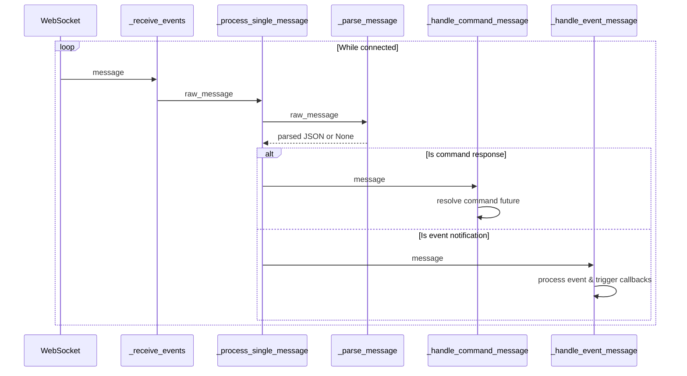

# Connection Handler

The Connection Handler is the foundational layer of Pydoll's architecture, serving as the bridge between your Python code and the browser's Chrome DevTools Protocol (CDP). This component manages the WebSocket connection to the browser, handles command execution, and processes events in a non-blocking, asynchronous manner.



## Asynchronous Programming Model

Pydoll is built on Python's `asyncio` framework, which enables non-blocking I/O operations. This design choice is critical for high-performance browser automation, as it allows multiple operations to occur concurrently without waiting for each to complete.

### Understanding Async/Await


To understand how async/await works in practice, let's examine a more detailed example with two concurrent operations:

```python
import asyncio
from pydoll.browser.chrome import Chrome

async def fetch_page_data(url):
    print(f"Starting fetch for {url}")
    browser = Chrome()
    await browser.start()
    page = await browser.get_page()
    
    # Navigation takes time - this is where we yield control
    await page.go_to(url)
    
    # Get page title
    title = await page.execute_script("return document.title")
    
    # Extract some data
    description = await page.execute_script(
        "return document.querySelector('meta[name=\"description\"]')?.content || ''"
    )
    
    await browser.stop()
    print(f"Completed fetch for {url}")
    return {"url": url, "title": title, "description": description}

async def main():
    # Start two page operations concurrently
    task1 = asyncio.create_task(fetch_page_data("https://example.com"))
    task2 = asyncio.create_task(fetch_page_data("https://github.com"))
    
    # Wait for both to complete and get results
    result1 = await task1
    result2 = await task2
    
    return [result1, result2]

# Run the async function
results = asyncio.run(main())
```

This example demonstrates how we can fetch data from two different websites concurrently, potentially cutting the overall execution time nearly in half compared to sequential execution.

#### Async Execution Flow Diagram

Here's what happens in the event loop when executing the code above:



This sequence diagram illustrates how Python's asyncio manages the two concurrent tasks in our example code:

1. The main function creates two tasks for fetching data from different websites
2. Both tasks are registered in the event loop
3. The event loop executes each task until it hits an `await` statement (like `browser.start()`)
4. When async operations complete (like a WebSocket connection being established), tasks resume
5. The loop continues to switch between tasks at each `await` point
6. When each task completes, it returns its result back to the main function

In the `fetch_page_data` example, this allows both browser instances to work concurrently - while one is waiting for a page to load, the other can be making progress. This is significantly more efficient than sequentially processing each website, as I/O wait times don't block the execution of other tasks.

!!! info "Cooperative Multitasking"
    Asyncio uses cooperative multitasking, where tasks voluntarily yield control at `await` points. This differs from preemptive multitasking (threads), where tasks can be interrupted at any time. Cooperative multitasking can provide better performance for I/O-bound operations but requires careful coding to avoid blocking the event loop.

## Connection Handler Implementation

The `ConnectionHandler` class is designed to manage both command execution and event processing, providing a robust interface to the CDP WebSocket connection.

### Class Initialization

```python
def __init__(
    self,
    connection_port: int,
    page_id: str = 'browser',
    ws_address_resolver: Callable[[int], str] = get_browser_ws_address,
    ws_connector: Callable = websockets.connect,
):
    # Initialize components...
```

The ConnectionHandler accepts several parameters:

| Parameter | Type | Description |
|-----------|------|-------------|
| `connection_port` | `int` | Port number where the browser's CDP endpoint is listening |
| `page_id` | `str` | Identifier for the specific page/target (use 'browser' for browser-level connections) |
| `ws_address_resolver` | `Callable` | Function to resolve the WebSocket URL from the port number |
| `ws_connector` | `Callable` | Function to establish the WebSocket connection |

### Internal Components

The ConnectionHandler orchestrates three primary components:

1. **WebSocket Connection**: Manages the actual WebSocket communication with the browser
2. **Command Manager**: Handles sending commands and receiving responses
3. **Events Handler**: Processes events from the browser and triggers appropriate callbacks



## Command Execution Flow

When executing a command through the CDP, the ConnectionHandler follows a specific pattern:

1. Ensure an active WebSocket connection exists
2. Create a Future object to represent the pending response
3. Send the command over the WebSocket
4. Await the Future to be resolved with the response
5. Return the response to the caller

```python
async def execute_command(self, command: dict, timeout: int = 10) -> dict:
    # Validate command
    if not isinstance(command, dict):
        logger.error('Command must be a dictionary.')
        raise exceptions.InvalidCommand('Command must be a dictionary')

    # Ensure connection is active
    await self._ensure_active_connection()
    
    # Create future for this command
    future = self._command_manager.create_command_future(command)
    command_str = json.dumps(command)

    # Send command and await response
    try:
        await self._ws_connection.send(command_str)
        response: str = await asyncio.wait_for(future, timeout)
        return json.loads(response)
    except asyncio.TimeoutError as exc:
        self._command_manager.remove_pending_command(command['id'])
        raise exc
    except websockets.ConnectionClosed as exc:
        await self._handle_connection_loss()
        raise exc
```

!!! warning "Command Timeout"
    Commands that don't receive a response within the specified timeout period will raise a `TimeoutError`. This prevents automation scripts from hanging indefinitely due to missing responses. The default timeout is 10 seconds, but can be adjusted based on expected response times for complex operations.

## Event Processing System

The event system is a key architectural component that enables reactive programming patterns in Pydoll. It allows you to register callbacks for specific browser events and have them executed automatically when those events occur.

### Event Flow

The event processing flow follows these steps:

1. The `_receive_events` method runs as a background task, continuously receiving messages from the WebSocket
2. Each message is parsed and classified as either a command response or an event
3. Events are passed to the EventsHandler for processing
4. The EventsHandler identifies registered callbacks for the event and invokes them



### Callback Registration

The ConnectionHandler provides methods to register, remove, and manage event callbacks:

```python
# Register a callback for a specific event
callback_id = await connection.register_callback(
    'Page.loadEventFired', 
    handle_page_load
)

# Remove a specific callback
await connection.remove_callback(callback_id)

# Remove all callbacks
await connection.clear_callbacks()
```

!!! tip "Temporary Callbacks"
    You can register a callback as temporary, which means it will be automatically removed after being triggered once. This is useful for one-time events like dialog handling:
    
    ```python
    await connection.register_callback(
        'Page.javascriptDialogOpening',
        handle_dialog,
        temporary=True
    )
    ```

### Asynchronous Callback Execution

Callbacks can be either synchronous functions or asynchronous coroutines. The EventsHandler (managed by the ConnectionHandler) handles both types properly:

```python
# Synchronous callback
def synchronous_callback(event):
    print(f"Event received: {event['method']}")

# Asynchronous callback
async def asynchronous_callback(event):
    await asyncio.sleep(0.1)  # Perform some async operation
    print(f"Event processed asynchronously: {event['method']}")

# Both can be registered the same way
await connection.register_callback('Network.requestWillBeSent', synchronous_callback)
await connection.register_callback('Network.responseReceived', asynchronous_callback)
```

**Sequential Execution Model:**

Asynchronous callbacks are **awaited sequentially** by the EventsManager. This ensures that for a single event, callbacks execute in the order they were registered, preventing race conditions when multiple callbacks modify shared state.

```python
# Inside EventsManager.process_event()
for callback_data in callbacks:
    if asyncio.iscoroutinefunction(callback_data['callback']):
        await callback_data['callback'](event_data)  # Sequential await
    else:
        callback_data['callback'](event_data)  # Sync execution
```

**Non-blocking execution** (for UI callbacks that should not block other operations) is achieved at a **higher level**, such as in the `Tab.on()` method, which wraps the user's callback in an `asyncio.create_task()` before registering it here. This architecture provides:

- **Lower layer** (ConnectionHandler/EventsManager): Guarantees sequential execution and predictable order
- **Higher layer** (Tab.on()): Provides non-blocking semantics when needed

!!! info "Event Architecture Details"
    See [Event Architecture Deep Dive](../architecture/event-architecture.md) for complete details on the multi-layer event system and the rationale behind sequential callback execution.

## Connection Management

The ConnectionHandler implements several strategies to ensure robust connections:

### Lazy Connection Establishment

Connections are established only when needed, typically when the first command is executed or when explicitly requested. This lazy initialization approach conserves resources and allows for more flexible connection management.

### Automatic Reconnection

If the WebSocket connection is lost or closed unexpectedly, the ConnectionHandler will attempt to re-establish it automatically when the next command is executed. This provides resilience against transient network issues.

```python
async def _ensure_active_connection(self):
    """
    Guarantees that an active connection exists before proceeding.
    """
    if self._ws_connection is None or self._ws_connection.closed:
        await self._establish_new_connection()
```

### Resource Cleanup

The ConnectionHandler implements both explicit cleanup methods and Python's asynchronous context manager protocol (`__aenter__` and `__aexit__`), ensuring resources are properly released when no longer needed:

```python
async def close(self):
    """
    Closes the WebSocket connection and clears all callbacks.
    """
    await self.clear_callbacks()
    if self._ws_connection is not None:
        try:
            await self._ws_connection.close()
        except websockets.ConnectionClosed as e:
            logger.info(f'WebSocket connection has closed: {e}')
        logger.info('WebSocket connection closed.')
```

!!! info "Context Manager Usage"
    Using the ConnectionHandler as a context manager is the recommended pattern for ensuring proper resource cleanup:
    
    ```python
    async with ConnectionHandler(9222, 'browser') as connection:
        # Work with the connection...
        await connection.execute_command(...)
    # Connection is automatically closed when exiting the context
    ```

## Message Processing Pipeline

The ConnectionHandler implements a sophisticated message processing pipeline that handles the continuous stream of messages from the WebSocket connection:



This pipeline ensures efficient processing of both command responses and asynchronous events, allowing Pydoll to maintain responsive operation even under high message volume.

## Advanced Usage

The ConnectionHandler is usually used indirectly through the Browser and Page classes, but it can also be used directly for advanced scenarios:

### Direct Event Monitoring

For specialized use cases, you might want to bypass the higher-level APIs and directly monitor specific CDP events:

```python
from pydoll.connection.connection import ConnectionHandler

async def monitor_network():
    connection = ConnectionHandler(9222)
    
    async def log_request(event):
        url = event['params']['request']['url']
        print(f"Request: {url}")
    
    await connection.register_callback(
        'Network.requestWillBeSent', 
        log_request
    )
    
    # Enable network events via CDP command
    await connection.execute_command({
        "id": 1,
        "method": "Network.enable"
    })
    
    # Keep running until interrupted
    try:
        while True:
            await asyncio.sleep(1)
    finally:
        await connection.close()
```

### Custom Command Execution

You can execute arbitrary CDP commands directly:

```python
async def custom_cdp_command(connection, method, params=None):
    command = {
        "id": random.randint(1, 10000),
        "method": method,
        "params": params or {}
    }
    return await connection.execute_command(command)

# Example: Get document HTML without using Page class
async def get_html(connection):
    result = await custom_cdp_command(
        connection,
        "Runtime.evaluate",
        {"expression": "document.documentElement.outerHTML"}
    )
    return result['result']['result']['value']
```

!!! warning "Advanced Interface"
    Direct use of the ConnectionHandler requires a deep understanding of the Chrome DevTools Protocol. For most use cases, the higher-level Browser and Page APIs provide a more intuitive and safer interface.


## Advanced Concurrency Patterns

The ConnectionHandler's asynchronous design enables sophisticated concurrency patterns:

### Parallel Command Execution

Execute multiple commands concurrently and wait for all results:

```python
async def get_page_metrics(connection):
    commands = [
        {"id": 1, "method": "Performance.getMetrics"},
        {"id": 2, "method": "Network.getResponseBody", "params": {"requestId": "..."}},
        {"id": 3, "method": "DOM.getDocument"}
    ]
    
    results = await asyncio.gather(
        *(connection.execute_command(cmd) for cmd in commands)
    )
    
    return results
```

## Conclusion

The ConnectionHandler serves as the foundation of Pydoll's architecture, providing a robust, efficient interface to the Chrome DevTools Protocol. By leveraging Python's asyncio framework and WebSocket communication, it enables high-performance browser automation with elegant, event-driven programming patterns.

Understanding the ConnectionHandler's design and operation provides valuable insights into Pydoll's internal workings and offers opportunities for advanced customization and optimization in specialized scenarios.

For most use cases, you'll interact with the ConnectionHandler indirectly through the higher-level Browser and Page APIs, which provide a more intuitive interface while leveraging the ConnectionHandler's powerful capabilities. 