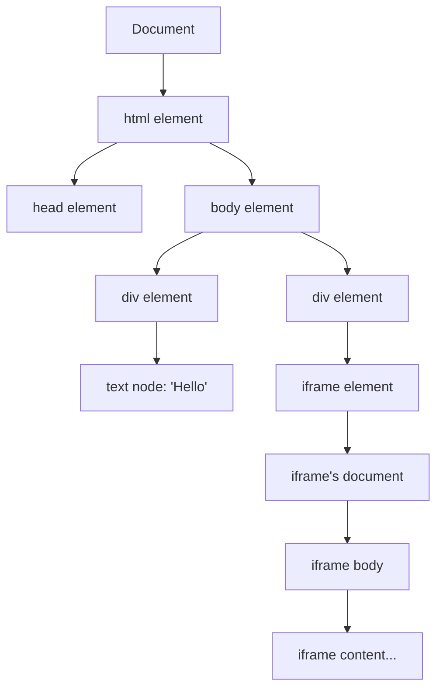
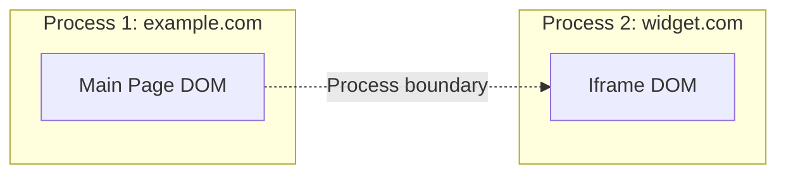
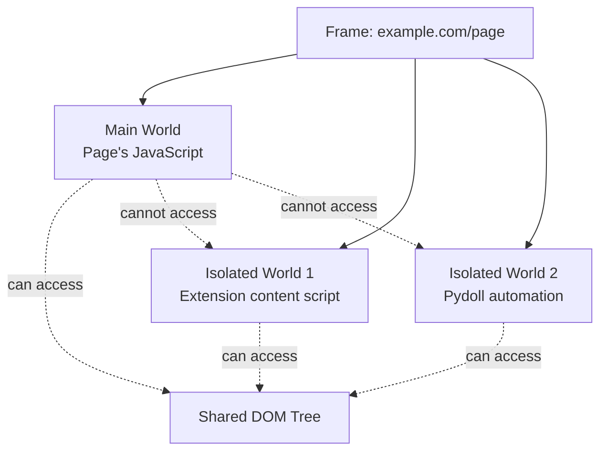
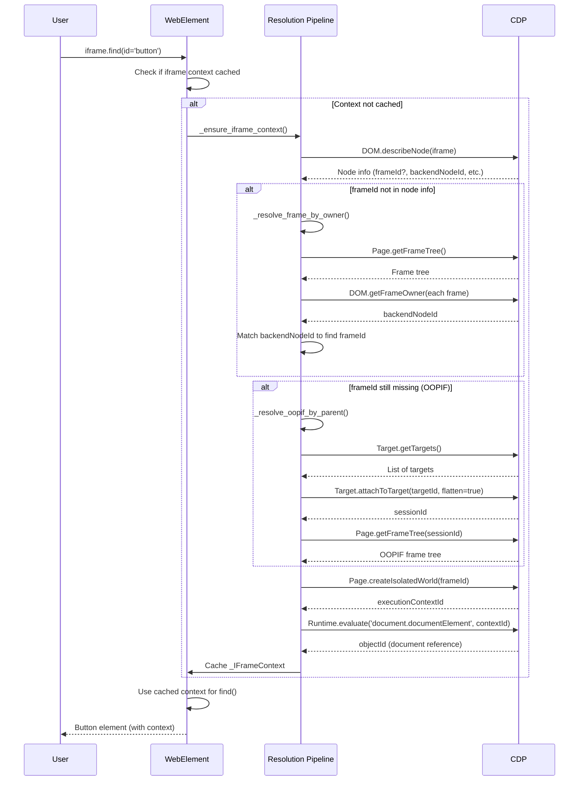
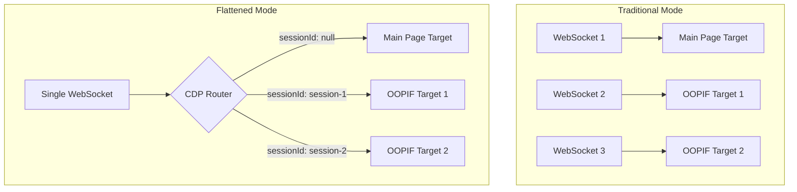

# Iframes, OOPIFs and Execution Contexts (Deep Dive)

Understanding how browser automation handles iframes is critical for building robust automation tools. This comprehensive guide explores the technical foundations of iframe handling in Pydoll, covering the Document Object Model (DOM), Chrome DevTools Protocol (CDP) mechanics, execution contexts, isolated worlds, and the sophisticated resolution pipeline that makes iframe interaction seamless.

!!! info "Practical usage first"
    If you just need to use iframes in your automation scripts, start with the feature guide: **Features → Automation → IFrames**.  
    This deep dive explains the architectural decisions, protocol nuances, and internal implementation details.

---

## Table of Contents

1. [Foundation: The Document Object Model (DOM)](#foundation-the-document-object-model-dom)
2. [What are Iframes and Why They Matter](#what-are-iframes-and-why-they-matter)
3. [The Challenge: Out-of-Process Iframes (OOPIFs)](#the-challenge-out-of-process-iframes-oopifs)
4. [Chrome DevTools Protocol and Frame Management](#chrome-devtools-protocol-and-frame-management)
5. [Execution Contexts and Isolated Worlds](#execution-contexts-and-isolated-worlds)
6. [CDP Identifiers Reference](#cdp-identifiers-reference)
7. [Pydoll's Resolution Pipeline](#pydolls-resolution-pipeline)
8. [Session Routing and Flattened Mode](#session-routing-and-flattened-mode)
9. [Implementation Deep Dive](#implementation-deep-dive)
10. [Performance Considerations](#performance-considerations)
11. [Failure Modes and Debugging](#failure-modes-and-debugging)

---

## Foundation: The Document Object Model (DOM)

Before diving into iframes, we must understand the DOM—the tree structure that represents an HTML document in memory.

### What is the DOM?

The **Document Object Model** is a programming interface for HTML and XML documents. It represents the page structure as a tree of nodes, where each node corresponds to a part of the document:

- **Element nodes**: HTML tags like `<div>`, `<iframe>`, `<button>`
- **Text nodes**: The actual text content
- **Attribute nodes**: Element attributes like `id`, `class`, `src`
- **Document node**: The root of the tree



### DOM Tree Properties

1. **Hierarchical structure**: Every node has a parent (except Document) and can have children
2. **Node identification**: Nodes can be identified by:
   - `nodeId`: Internal identifier within a document context (DOM domain)
   - `backendNodeId`: Stable identifier that can reference nodes across different documents
3. **Live representation**: Changes to the DOM are reflected immediately in the tree

### Why This Matters for Iframes

Each `<iframe>` element creates a **new, independent DOM tree**. The iframe element itself exists in the parent's DOM, but the content loaded into the iframe has its own complete Document node and tree structure. This separation is the foundation of all iframe complexity.

---

## What are Iframes and Why They Matter

### Definition

An **iframe** (inline frame) is an HTML element (`<iframe>`) that embeds another HTML document within the current page. The embedded document maintains its own context, including:

- Independent HTML structure and DOM tree
- Separate JavaScript execution environment
- Its own CSS styling (unless explicitly shared)
- Distinct navigation history

```html
<body>
  <h1>Parent Page</h1>
  <iframe src="https://example.com/embedded.html" id="content-frame"></iframe>
  <p>More parent content</p>
</body>
```

### Common Use Cases

| Use Case | Description | Example |
|----------|-------------|---------|
| **Third-party widgets** | Embed external content safely | Payment forms, social media feeds, chat widgets |
| **Content isolation** | Sandbox untrusted content | User-generated HTML, advertisements |
| **Modular architecture** | Reusable components | Dashboard widgets, plugin systems |
| **Cross-origin content** | Load resources from different domains | Maps, video players, analytics dashboards |

### Security Model: Same-Origin Policy

The browser enforces a **Same-Origin Policy** for iframes:

- **Same-origin iframes**: Parent can access iframe's DOM via JavaScript (`iframe.contentDocument`)
- **Cross-origin iframes**: Parent cannot access iframe's DOM directly (security restriction)

This security boundary is why automation tools need special mechanisms (like CDP) to interact with iframe content.

!!! warning "Important for automation"
    Traditional JavaScript-based automation (like Selenium's early approaches) cannot directly access cross-origin iframe content due to browser security. CDP operates at a lower level, bypassing this limitation for debugging purposes.

---

## The Challenge: Out-of-Process Iframes (OOPIFs)

### What are OOPIFs?

Modern Chromium uses **site isolation** for security and stability. This means different origins may be rendered in separate OS processes. An iframe from a different origin becomes an **Out-of-Process Iframe (OOPIF)**.



### Why OOPIFs Complicate Automation

| Aspect | In-Process Iframe | Out-of-Process Iframe (OOPIF) |
|--------|-------------------|-------------------------------|
| **DOM access** | Shared document tree in memory | Separate target with own document |
| **Command routing** | Single connection | Requires target attachment and session routing |
| **Frame tree** | All frames in one tree | Root frame + separate targets for OOPIFs |
| **JavaScript context** | Same execution context | Different execution context per process |
| **CDP communication** | Direct commands | Commands must include `sessionId` |

### The Traditional Approach (Manual Context Switching)

Without sophisticated handling, automating OOPIFs requires:

```python
# Traditional (manual) approach with other tools
main_page = browser.get_page()
iframe_element = main_page.find_element_by_id("iframe-id")

# Must manually switch context
driver.switch_to.frame(iframe_element)

# Now commands target the iframe
button = driver.find_element_by_id("button-in-iframe")
button.click()

# Must manually switch back
driver.switch_to.default_content()
```

**Problems with this approach:**

1. **Developer burden**: Every iframe requires explicit context management
2. **Nested iframes**: Each level needs another switch
3. **OOPIF detection**: Hard to know when manual attachment is needed
4. **Error-prone**: Forget to switch back → subsequent commands fail
5. **Not composable**: Helper functions must know their iframe context

### Pydoll's Solution: Transparent Context Resolution

Pydoll eliminates manual context switching by resolving iframe contexts automatically:

```python
# Pydoll approach (no manual switching)
iframe = await tab.find(id="iframe-id")
button = await iframe.find(id="button-in-iframe")
await button.click()

# Nested iframes? Same pattern
outer = await tab.find(id="outer-iframe")
inner = await outer.find(tag_name="iframe")
button = await inner.find(text="Submit")
await button.click()
```

The complexity is handled internally. Let's explore how.

---

## Chrome DevTools Protocol and Frame Management

As discussed in [Deep Dive → Fundamentals → Chrome DevTools Protocol](./cdp.md), CDP provides comprehensive browser control via WebSocket communication. Frame management is spread across multiple CDP domains.

### Relevant CDP Domains

#### 1. **Page Domain**

Manages page lifecycle, frames, and navigation.

**Key methods:**

- `Page.getFrameTree()`: Returns the hierarchical structure of all frames in a page
  ```json
  {
    "frameTree": {
      "frame": {
        "id": "main-frame-id",
        "url": "https://example.com",
        "securityOrigin": "https://example.com",
        "mimeType": "text/html"
      },
      "childFrames": [
        {
          "frame": {
            "id": "child-frame-id",
            "parentId": "main-frame-id",
            "url": "https://widget.com/embed"
          }
        }
      ]
    }
  }
  ```

- `Page.createIsolatedWorld(frameId, worldName)`: Creates a new JavaScript execution context in a specific frame
  ```json
  {
    "executionContextId": 42
  }
  ```

**Pydoll usage:** 

```python
# From pydoll/elements/web_element.py
@staticmethod
async def _get_frame_tree_for(
    handler: ConnectionHandler, session_id: Optional[str]
) -> FrameTree:
    """Get the Page frame tree for the given connection/target."""
    command = PageCommands.get_frame_tree()
    if session_id:
        command['sessionId'] = session_id
    response: GetFrameTreeResponse = await handler.execute_command(command)
    return response['result']['frameTree']
```

#### 2. **DOM Domain**

Provides access to the DOM structure.

**Key methods:**

- `DOM.describeNode(objectId)`: Returns detailed information about a DOM node
  ```json
  {
    "node": {
      "nodeId": 123,
      "backendNodeId": 456,
      "nodeName": "IFRAME",
      "frameId": "parent-frame-id",
      "contentDocument": {
        "frameId": "iframe-frame-id",
        "documentURL": "https://embedded.com/page.html"
      }
    }
  }
  ```

- `DOM.getFrameOwner(frameId)`: Returns the `backendNodeId` of the `<iframe>` element that owns a frame
  ```json
  {
    "backendNodeId": 456
  }
  ```

**Pydoll usage:**

```python
# From pydoll/elements/web_element.py
@staticmethod
async def _owner_backend_for(
    handler: ConnectionHandler, session_id: Optional[str], frame_id: str
) -> Optional[int]:
    """Get the backendNodeId of the DOM element that owns the given frame."""
    command = DomCommands.get_frame_owner(frame_id=frame_id)
    if session_id:
        command['sessionId'] = session_id
    response: GetFrameOwnerResponse = await handler.execute_command(command)
    return response.get('result', {}).get('backendNodeId')
```

#### 3. **Target Domain**

Manages browser targets (pages, iframes, workers, etc.).

**Key methods:**

- `Target.getTargets()`: Lists all available targets
  ```json
  {
    "targetInfos": [
      {
        "targetId": "page-target-id",
        "type": "page",
        "title": "Main Page",
        "url": "https://example.com"
      },
      {
        "targetId": "iframe-target-id",
        "type": "iframe",
        "title": "",
        "url": "https://widget.com/embed",
        "parentFrameId": "main-frame-id"
      }
    ]
  }
  ```

- `Target.attachToTarget(targetId, flatten)`: Attaches to a target for debugging
  - When `flatten=true`: Returns a `sessionId` for routing commands in flattened mode
  - All communication happens over the same WebSocket, differentiated by `sessionId`

**Pydoll usage:**

```python
# From pydoll/elements/web_element.py (simplified)
async def _resolve_oopif_by_parent(self, parent_frame_id: str, ...):
    """Resolve an OOPIF using the parent frame id."""
    browser_handler = ConnectionHandler(...)
    targets_response: GetTargetsResponse = await browser_handler.execute_command(
        TargetCommands.get_targets()
    )
    target_infos = targets_response.get('result', {}).get('targetInfos', [])
    
    # Find targets whose parentFrameId matches
    direct_children = [
        target_info for target_info in target_infos
        if target_info.get('parentFrameId') == parent_frame_id
    ]
    
    if direct_children:
        attach_response: AttachToTargetResponse = await browser_handler.execute_command(
            TargetCommands.attach_to_target(
                target_id=direct_children[0]['targetId'], 
                flatten=True
            )
        )
        attached_session_id = attach_response.get('result', {}).get('sessionId')
        # ... use session_id for subsequent commands
```

#### 4. **Runtime Domain**

Executes JavaScript and manages execution contexts.

**Key methods:**

- `Runtime.evaluate(expression, contextId)`: Evaluates JavaScript in a specific execution context
- `Runtime.callFunctionOn(functionDeclaration, objectId)`: Calls a function with a specific object as `this`

**Pydoll usage for iframe document access:**

```python
# From pydoll/elements/web_element.py
async def _set_iframe_document_object_id(self, execution_context_id: int):
    """Evaluate document.documentElement in iframe context and cache its object id."""
    evaluate_command = RuntimeCommands.evaluate(
        expression='document.documentElement',
        context_id=execution_context_id,
    )
    if self._iframe_context and self._iframe_context.session_id:
        evaluate_command['sessionId'] = self._iframe_context.session_id
    
    evaluate_response: EvaluateResponse = await (
        (self._iframe_context.session_handler if self._iframe_context else None)
        or self._connection_handler
    ).execute_command(evaluate_command)
    
    document_object_id = evaluate_response.get('result', {}).get('result', {}).get('objectId')
    if self._iframe_context:
        self._iframe_context.document_object_id = document_object_id
```

---

## Execution Contexts and Isolated Worlds

### What is an Execution Context?

An **execution context** is an environment where JavaScript code is executed. Every frame in a browser has at least one execution context. The context includes:

- **Global object** (`window` in browsers)
- **Scope chain**: How variables are resolved
- **This binding**: What `this` refers to
- **Variable environment**: All declared variables and functions

### Multiple Contexts per Frame

A single frame can have multiple execution contexts:

1. **Main world (default context)**: Where the page's own JavaScript runs
2. **Isolated worlds**: Separate contexts that share the same DOM but have different JavaScript global scopes



### What is an Isolated World?

An **isolated world** is a separate JavaScript execution context that:

- **Shares the same DOM**: Can read/modify DOM elements
- **Has a separate global object**: Variables/functions don't leak between worlds
- **Prevents interference**: Page scripts cannot detect or interfere with isolated world scripts

**Origin**: Isolated worlds were created for browser extensions. Content scripts run in isolated worlds so they can interact with the page DOM without:

- Page scripts overwriting their variables
- Being detected by anti-tamper code
- Conflicting with page JavaScript

### Why Pydoll Uses Isolated Worlds for Iframes

When Pydoll interacts with iframe content, it creates an isolated world in that iframe's context. This provides:

1. **Clean JavaScript environment**: No conflicts with iframe's own scripts
2. **Consistent behavior**: Automation scripts work regardless of what JavaScript the iframe runs
3. **Anti-detection**: The iframe's JavaScript cannot easily detect Pydoll's presence
4. **Safe evaluation**: Automation code cannot accidentally trigger page logic

**Implementation:**

```python
# From pydoll/elements/web_element.py
@staticmethod
async def _create_isolated_world_for_frame(
    frame_id: str,
    handler: ConnectionHandler,
    session_id: Optional[str],
) -> int:
    """Create an isolated world (Page.createIsolatedWorld) for the given frame."""
    create_command = PageCommands.create_isolated_world(
        frame_id=frame_id,
        world_name=f'pydoll::iframe::{frame_id}',
        grant_universal_access=True,
    )
    if session_id:
        create_command['sessionId'] = session_id
    
    create_response: CreateIsolatedWorldResponse = await handler.execute_command(
        create_command
    )
    execution_context_id = create_response.get('result', {}).get('executionContextId')
    if not execution_context_id:
        raise InvalidIFrame('Unable to create isolated world for iframe')
    return execution_context_id
```

The `grant_universal_access=True` parameter allows the isolated world to:

- Access cross-origin frames (normally blocked by same-origin policy)
- Perform privileged operations needed for automation

!!! tip "Isolated worlds in practice"
    Every time you use `await iframe.find(...)`, Pydoll evaluates the selector query in an isolated world created specifically for that iframe. This ensures your automation logic never conflicts with the iframe's own JavaScript, and the iframe cannot detect or block your automation.

---

## CDP Identifiers Reference

Understanding CDP identifiers is crucial for iframe handling. Here's a comprehensive reference:

| Identifier | Domain | Scope | Purpose | Example Use in Pydoll |
|------------|--------|-------|---------|----------------------|
| **`nodeId`** | DOM | Document-local | Identifies a DOM node within a specific document context | Internal CDP operations; not stable across navigations |
| **`backendNodeId`** | DOM | Cross-document stable | Stable identifier for a DOM node; can map frames to owner elements | Used to match iframe elements to frame IDs via `DOM.getFrameOwner` |
| **`frameId`** | Page | Frame | Identifies a frame in the page's frame tree | Used to specify which frame for `Page.createIsolatedWorld` and frame tree traversal |
| **`targetId`** | Target | Global | Identifies a debugging target (page, iframe, worker, etc.) | Used for `Target.attachToTarget` to connect to OOPIFs |
| **`sessionId`** | Target | Target-specific | Routes commands to a specific target in flattened mode | Injected into commands to route them to the correct OOPIF |
| **`executionContextId`** | Runtime | Frame + world | Identifies a JavaScript execution context (including isolated worlds) | Returned by `Page.createIsolatedWorld`; used in `Runtime.evaluate` |
| **`objectId`** | Runtime | Execution context | Remote object reference (e.g., DOM element, function, object) | Reference to iframe's `document.documentElement` for relative queries |

### Identifier Relationships

Here's how identifiers relate to each other during iframe resolution:

```
┌─────────────────────────────────────────────────────────────────────────┐
│                         Resolution Flow                                 │
└─────────────────────────────────────────────────────────────────────────┘

1. Start: <iframe> Element
   └─ backendNodeId: 789
   
2. Find Frame ──────────────[DOM.getFrameOwner]──────────────┐
   └─ frameId: abc-123                                       │
                                                             │
3. OOPIF? Check Origin ─────[Different origin detected]──────┤
   └─ targetId: xyz-456                                      │
                                                             │
4. Attach to Target ────────[Target.attachToTarget]──────────┤
   └─ sessionId: session-789                                 │
                                                             │
5. Create Isolated World ───[Page.createIsolatedWorld]───────┤
   └─ executionContextId: 42                                 │
                                                             │
6. Get Document ────────────[Runtime.evaluate]───────────────┘
   └─ objectId: obj-999
```

**Key transformation points:**

| From | Method | To | Purpose |
|------|--------|-----|---------|
| `backendNodeId` | `DOM.getFrameOwner` | `frameId` | Find which frame owns the iframe element |
| `targetId` | `Target.attachToTarget(flatten=true)` | `sessionId` | Connect to OOPIF for command routing |
| `frameId` | `Page.createIsolatedWorld` | `executionContextId` | Create safe JavaScript environment |
| `executionContextId` | `Runtime.evaluate('document.documentElement')` | `objectId` | Get reference to iframe's document |

### Code Representation in Pydoll

```python
# From pydoll/elements/web_element.py
@dataclass
class _IFrameContext:
    """Encapsulates all identifiers and routing information for an iframe."""
    frame_id: str                                   # frameId: identifies the frame
    document_url: Optional[str] = None              # frame's loaded URL
    execution_context_id: Optional[int] = None      # executionContextId: isolated world
    document_object_id: Optional[str] = None        # objectId: document.documentElement
    session_handler: Optional[ConnectionHandler] = None  # for OOPIF targets
    session_id: Optional[str] = None                # sessionId: routes commands to OOPIF
```

This dataclass is cached on each `WebElement` representing an iframe, enabling automatic routing of all subsequent operations.

---

## Pydoll's Resolution Pipeline

When you access an iframe in Pydoll (e.g., `await iframe.find(...)`), an elaborate resolution pipeline executes behind the scenes. This section breaks down every step.

### High-Level Flow



### Step-by-Step Deep Dive

#### **Step 1: Describe the Iframe Element**

**Goal**: Extract metadata from the `<iframe>` DOM element.

**Method**: `DOM.describeNode(objectId=iframe_object_id)`

**What we get**:

- `backendNodeId`: Stable identifier for the iframe element
- `frameId` (from `contentDocument`): If the iframe's content is already loaded and in-process
- `documentURL`: The URL loaded in the iframe
- `parentFrameId` (from `frameId` field on the node): The frame containing this iframe element

**Code**:

```python
# From pydoll/elements/web_element.py
async def _ensure_iframe_context(self) -> None:
    """Initialize and cache context information for iframe elements."""
    node_info = await self._describe_node(object_id=self._object_id)
    base_handler, base_session_id = self._get_base_session()
    frame_id, document_url, parent_frame_id, backend_node_id = self._extract_frame_metadata(
        node_info
    )
    # ... continue resolution
```

**Helper**:

```python
@staticmethod
def _extract_frame_metadata(
    node_info: Node,
) -> tuple[Optional[str], Optional[str], Optional[str], Optional[int]]:
    """Extract iframe-related metadata from a DOM.describeNode Node."""
    content_document = node_info.get('contentDocument') or {}
    parent_frame_id = node_info.get('frameId')
    backend_node_id = node_info.get('backendNodeId')
    frame_id = content_document.get('frameId')
    document_url = (
        content_document.get('documentURL')
        or content_document.get('baseURL')
        or node_info.get('documentURL')
        or node_info.get('baseURL')
    )
    return frame_id, document_url, parent_frame_id, backend_node_id
```

**Outcome**:

- **If `frame_id` is present**: Great! The iframe is in-process; proceed to Step 4.
- **If `frame_id` is missing**: The iframe might be an OOPIF or not fully loaded; proceed to Step 2.

---

#### **Step 2: Resolve Frame by Owner (backendNodeId matching)**

**Goal**: Find the `frameId` by matching the iframe element's `backendNodeId` to frame owners in the frame tree.

**Strategy**:

1. Fetch the page's frame tree (`Page.getFrameTree`)
2. For each frame in the tree, call `DOM.getFrameOwner(frameId)` to get the `backendNodeId` of the owning iframe element
3. Compare with our iframe's `backendNodeId`
4. When they match, we've found the correct `frameId`

**Code**:

```python
# From pydoll/elements/web_element.py
async def _resolve_frame_by_owner(
    self,
    base_handler: ConnectionHandler,
    base_session_id: Optional[str],
    backend_node_id: int,
    current_document_url: Optional[str],
) -> tuple[Optional[str], Optional[str]]:
    """Resolve a frame id and URL by matching the owner backend_node_id."""
    owner_frame_id, owner_url = await self._find_frame_by_owner(
        base_handler, base_session_id, backend_node_id
    )
    if not owner_frame_id:
        return None, current_document_url
    return owner_frame_id, owner_url or current_document_url

async def _find_frame_by_owner(
    self, handler: ConnectionHandler, session_id: Optional[str], backend_node_id: int
) -> tuple[Optional[str], Optional[str]]:
    """Find a frame by matching the owner backend_node_id of the <iframe> element."""
    frame_tree = await self._get_frame_tree_for(handler, session_id)
    for frame_node in WebElement._walk_frames(frame_tree):
        candidate_frame_id = frame_node.get('id', '')
        if not candidate_frame_id:
            continue
        owner_backend_id = await self._owner_backend_for(
            handler, session_id, candidate_frame_id
        )
        if owner_backend_id == backend_node_id:
            return candidate_frame_id, frame_node.get('url')
    return None, None
```

**Why this is necessary**:

- `DOM.describeNode` sometimes doesn't include the `contentDocument.frameId` for cross-origin or lazy-loaded iframes
- The frame tree always contains all frames (even OOPIFs), so we can find it indirectly

**Outcome**:

- **If `frameId` found**: Proceed to Step 4.
- **If still not found**: The iframe is likely an OOPIF in a separate target; proceed to Step 3.

---

#### **Step 3: Resolve OOPIF by Parent Frame**

**Goal**: For Out-of-Process Iframes, find the correct target, attach to it, and obtain the `frameId` from the target's frame tree (and the routing `sessionId` when needed).

**When this runs**:

- Same-origin / in-process iframes that already have a `frameId` and **no** `backendNodeId` skip this step (they are handled directly).
- Cross-origin / OOPIF iframes (with `backendNodeId`) or iframes whose `frameId` could not be resolved via Step 2 use this step.

**Strategy**:

**3a. Direct child target lookup (fast path)**:

1. Call `Target.getTargets()` to list all debugging targets.
2. Filter targets where `type` is `"iframe"` or `"page"` and `parentFrameId` matches our parent frame.
3. If there is **exactly one** matching child **and we don't have a `backendNodeId`**, attach directly to that target with `Target.attachToTarget(targetId, flatten=true)`.
4. Fetch `Page.getFrameTree(sessionId)` for that target; the root frame of this tree is our iframe's frame.

When there are **multiple** direct children or we have a `backendNodeId` (typical OOPIF case), Pydoll iterates over each child target:

1. Attach via `Target.attachToTarget(flatten=true)`.
2. Fetch `Page.getFrameTree(sessionId)` and read the root `frame.id`.
3. Call `DOM.getFrameOwner(frameId=root_id)` on the **main** connection.
4. Compare the returned `backendNodeId` with our iframe element's `backendNodeId`.
5. The child whose root owner matches is selected as the correct OOPIF target.

**3b. Fallback: Scan all targets (root owner + child search)**:

If no suitable direct child is found (or when `parentFrameId` information is incomplete), Pydoll falls back to scanning **all** iframe/page targets:

1. Iterate all iframe/page targets.
2. Attach to each and fetch its frame tree.
3. First, try to match the **root frame owner** via `DOM.getFrameOwner(root_frame_id)` against our iframe's `backendNodeId`.
4. If that does not match, look for a **child frame** whose `parentId` equals our `parent_frame_id` (this covers cases where the OOPIF is nested under an intermediate frame).

**Code**:

```python
# From pydoll/elements/web_element.py
async def _resolve_oopif_by_parent(
    self,
    parent_frame_id: str,
    backend_node_id: Optional[int],
) -> tuple[Optional[ConnectionHandler], Optional[str], Optional[str], Optional[str]]:
    """Resolve an OOPIF using the given parent frame id."""
    browser_handler = ConnectionHandler(
        connection_port=self._connection_handler._connection_port
    )
    targets_response: GetTargetsResponse = await browser_handler.execute_command(
        TargetCommands.get_targets()
    )
    target_infos = targets_response.get('result', {}).get('targetInfos', [])

    # Strategy 3a: Direct children (fast path)
    direct_children = [
        target_info
        for target_info in target_infos
        if target_info.get('type') in {'iframe', 'page'}
        and target_info.get('parentFrameId') == parent_frame_id
    ]

    is_single_child = len(direct_children) == 1
    for child_target in direct_children:
        attach_response: AttachToTargetResponse = await browser_handler.execute_command(
            TargetCommands.attach_to_target(
                target_id=child_target['targetId'], flatten=True
            )
        )
        attached_session_id = attach_response.get('result', {}).get('sessionId')
        if not attached_session_id:
            continue

        frame_tree = await self._get_frame_tree_for(browser_handler, attached_session_id)
        root_frame = (frame_tree or {}).get('frame', {})
        root_frame_id = root_frame.get('id', '')

        # Same-origin / simple case: single child and no backend_node_id
        if is_single_child and root_frame_id and backend_node_id is None:
            return (
                browser_handler,
                attached_session_id,
                root_frame_id,
                root_frame.get('url'),
            )

        # OOPIF case: confirm ownership via DOM.getFrameOwner
        if root_frame_id and backend_node_id is not None:
            owner_backend_id = await self._owner_backend_for(
                self._connection_handler, None, root_frame_id
            )
            if owner_backend_id == backend_node_id:
                return (
                    browser_handler,
                    attached_session_id,
                    root_frame_id,
                    root_frame.get('url'),
                )

    # Strategy 3b: Scan all targets (root owner + child search)
    for target_info in target_infos:
        if target_info.get('type') not in {'iframe', 'page'}:
            continue
        attach_response = await browser_handler.execute_command(
            TargetCommands.attach_to_target(
                target_id=target_info.get('targetId', ''), flatten=True
            )
        )
        attached_session_id = attach_response.get('result', {}).get('sessionId')
        if not attached_session_id:
            continue

        frame_tree = await self._get_frame_tree_for(browser_handler, attached_session_id)
        root_frame = (frame_tree or {}).get('frame', {})
        root_frame_id = root_frame.get('id', '')

        # Try matching root owner by backend_node_id
        if root_frame_id and backend_node_id is not None:
            owner_backend_id = await self._owner_backend_for(
                self._connection_handler, None, root_frame_id
            )
            if owner_backend_id == backend_node_id:
                return (
                    browser_handler,
                    attached_session_id,
                    root_frame_id,
                    root_frame.get('url'),
                )

        # Fallback: match a child frame whose parentId equals parent_frame_id
        child_frame_id = WebElement._find_child_by_parent(frame_tree, parent_frame_id)
        if child_frame_id:
            return browser_handler, attached_session_id, child_frame_id, None

    return None, None, None, None
```

**Outcome**:

- **If OOPIF resolved**: We now have `sessionId`, `session_handler`, and `frameId`; proceed to Step 4.
- **If resolution fails**: Raise `InvalidIFrame` exception (handled in `_ensure_iframe_context`).

---

#### **Step 4: Create Isolated World**

**Goal**: Create a separate JavaScript execution context in the resolved frame.

**Method**: `Page.createIsolatedWorld(frameId, worldName='pydoll::iframe::<frameId>', grantUniversalAccess=true)`

**Parameters**:
- `frameId`: The frame where the isolated world is created
- `worldName`: Identifier for the world (useful for debugging)
- `grantUniversalAccess`: Allows cross-origin access (needed for automation)

**Response**: `{ executionContextId: 42 }`

**Code**:

```python
# From pydoll/elements/web_element.py
@staticmethod
async def _create_isolated_world_for_frame(
    frame_id: str,
    handler: ConnectionHandler,
    session_id: Optional[str],
) -> int:
    """Create an isolated world for the given frame."""
    create_command = PageCommands.create_isolated_world(
        frame_id=frame_id,
        world_name=f'pydoll::iframe::{frame_id}',
        grant_universal_access=True,
    )
    if session_id:
        create_command['sessionId'] = session_id
    create_response: CreateIsolatedWorldResponse = await handler.execute_command(create_command)
    execution_context_id = create_response.get('result', {}).get('executionContextId')
    if not execution_context_id:
        raise InvalidIFrame('Unable to create isolated world for iframe')
    return execution_context_id
```

**Why isolated world**:

- **Isolation**: Our automation JavaScript doesn't interfere with the iframe's JavaScript
- **Anti-detection**: The iframe cannot detect our presence easily
- **Consistency**: Behavior is predictable regardless of iframe's script environment

**Outcome**: We have an `executionContextId` for running JavaScript in the iframe.

---

#### **Step 5: Pin the Iframe Document as a Runtime Object**

**Goal**: Obtain an `objectId` reference to the iframe's `document.documentElement` (the `<html>` element of the iframe).

**Method**: `Runtime.evaluate(expression='document.documentElement', contextId=executionContextId)`

**Why we need this**:

- To execute **relative queries** (like `element.querySelector()`) inside the iframe
- The `objectId` allows using `Runtime.callFunctionOn(objectId, ...)` with `this` bound to the iframe's document

**Code**:

```python
# From pydoll/elements/web_element.py
async def _set_iframe_document_object_id(self, execution_context_id: int) -> None:
    """Evaluate document.documentElement in the iframe context and cache its object id."""
    evaluate_command = RuntimeCommands.evaluate(
        expression='document.documentElement',
        context_id=execution_context_id,
    )
    if self._iframe_context and self._iframe_context.session_id:
        evaluate_command['sessionId'] = self._iframe_context.session_id
    evaluate_response: EvaluateResponse = await (
        (self._iframe_context.session_handler if self._iframe_context else None)
        or self._connection_handler
    ).execute_command(evaluate_command)
    result_object = evaluate_response.get('result', {}).get('result', {})
    document_object_id = result_object.get('objectId')
    if not document_object_id:
        raise InvalidIFrame('Unable to obtain document reference for iframe')
    if self._iframe_context:
        self._iframe_context.document_object_id = document_object_id
```

**Outcome**: The `_IFrameContext` is now fully populated and cached on the `WebElement`.

---

#### **Step 6: Cache and Propagate Context**

**Goal**: Store the resolved context on the iframe element and propagate it to all child elements found within the iframe.

**Caching**:

```python
# From pydoll/elements/web_element.py
def _init_iframe_context(
    self,
    frame_id: str,
    document_url: Optional[str],
    session_handler: Optional[ConnectionHandler],
    session_id: Optional[str],
) -> None:
    """Initialize and cache iframe context on this element."""
    self._iframe_context = _IFrameContext(frame_id=frame_id, document_url=document_url)
    # Clean up routing attributes (these were for nested iframes)
    if hasattr(self, '_routing_session_handler'):
        delattr(self, '_routing_session_handler')
    if hasattr(self, '_routing_session_id'):
        delattr(self, '_routing_session_id')
    # Store OOPIF routing if needed
    if session_handler and session_id:
        self._iframe_context.session_handler = session_handler
        self._iframe_context.session_id = session_id
```

**Propagation** (when finding elements inside the iframe):

```python
# From pydoll/elements/mixins/find_elements_mixin.py
def _apply_iframe_context_to_element(
    self, element: WebElement, iframe_context: _IFrameContext | None
) -> None:
    """Propagate iframe context to the newly created element."""
    if not iframe_context:
        return
    
    # If the child element is also an iframe, set up routing
    if getattr(element, 'is_iframe', False):
        element._routing_session_handler = (
            iframe_context.session_handler or self._connection_handler
        )
        element._routing_session_id = iframe_context.session_id
        element._routing_parent_frame_id = iframe_context.frame_id
        return
    
    # Otherwise, inject the parent iframe's context
    element._iframe_context = iframe_context
```

**Why propagation matters**:

- Elements found inside an iframe inherit the iframe's context
- This ensures subsequent operations (click, type, find nested elements) automatically use the correct routing
- Nested iframes receive routing information so they can resolve their own context relative to the parent iframe

---

## Session Routing and Flattened Mode

### The Flattened Session Model

As discussed in [Deep Dive → Fundamentals → CDP](./cdp.md), traditional CDP uses separate WebSocket connections for each target. **Flattened mode** is an optimization where all targets share a single WebSocket connection, with commands routed using a `sessionId`.



### How Session Routing Works

**When attaching to an OOPIF**:

```python
response = await handler.execute_command(
    TargetCommands.attach_to_target(targetId="iframe-target-id", flatten=True)
)
session_id = response['result']['sessionId']  # e.g., "8E6C...-1234"
```

**When sending a command to that OOPIF**:

```python
command = PageCommands.get_frame_tree()
command['sessionId'] = 'session-1'  # Route to the OOPIF
response = await handler.execute_command(command)
```

The browser's CDP implementation routes the command to the correct target based on the `sessionId`.

### Pydoll's Command Routing

Every command sent by Pydoll elements is automatically routed to the correct target:

```python
# From pydoll/elements/mixins/find_elements_mixin.py
def _resolve_routing(self) -> tuple[ConnectionHandler, Optional[str]]:
    """Resolve handler and sessionId for the current context."""
    # Check if element has an iframe context with OOPIF routing
    iframe_context = getattr(self, '_iframe_context', None)
    if iframe_context and getattr(iframe_context, 'session_handler', None):
        return iframe_context.session_handler, getattr(iframe_context, 'session_id', None)
    
    # Check if element has inherited routing from a parent iframe
    routing_handler = getattr(self, '_routing_session_handler', None)
    if routing_handler is not None:
        return routing_handler, getattr(self, '_routing_session_id', None)
    
    # Default: use the tab's main connection
    return self._connection_handler, None

async def _execute_command(
    self, command: Command[T_CommandParams, T_CommandResponse]
) -> T_CommandResponse:
    """Execute CDP command via resolved handler (60s timeout)."""
    handler, session_id = self._resolve_routing()
    if session_id:
        command['sessionId'] = session_id
    return await handler.execute_command(command, timeout=60)
```

**Routing logic**:

1. **Element inside OOPIF iframe**: Use `iframe_context.session_id` and `iframe_context.session_handler`
2. **Nested iframe (child of OOPIF)**: Use inherited `_routing_session_id` and `_routing_session_handler`
3. **Regular element or in-process iframe**: Use main connection (`_connection_handler`), no `sessionId`

### Extended Command Typing

To make `sessionId` type-safe, Pydoll extended the `Command` TypedDict:

```python
# From pydoll/protocol/base.py
class Command(TypedDict, Generic[T_CommandParams, T_CommandResponse]):
    """Base structure for all commands."""
    id: NotRequired[int]
    method: str
    params: NotRequired[T_CommandParams]
    sessionId: NotRequired[str]  # Added for flattened session routing
```

This allows type-checkers to recognize `command['sessionId'] = '...'` as valid without suppressing type warnings.

---

## Performance Considerations

### Caching Strategy

**First access is expensive**:

- `DOM.describeNode`: 1 round-trip
- Frame tree retrieval: 1+ round-trips (main + OOPIF targets)
- `DOM.getFrameOwner` per frame: N round-trips (in worst case)
- `Target.getTargets` + attachments: 1 + M round-trips (M = number of OOPIF targets)
- `Page.createIsolatedWorld`: 1 round-trip
- `Runtime.evaluate` (document): 1 round-trip

**Total**: Potentially 5-20+ round-trips depending on page structure.

**Subsequent access is O(1)**:

- `iframe_context` is cached on the `WebElement` instance
- Accessing `await iframe.iframe_context` multiple times returns the cached value immediately
- All elements found within the iframe inherit the context (no re-resolution)

### Optimization: Direct Child Target Lookup

In `_resolve_oopif_by_parent`, Pydoll first checks for direct children by `parentFrameId`:

```python
direct_children = [
    target_info
    for target_info in target_infos
    if target_info.get('type') in {'iframe', 'page'}
    and target_info.get('parentFrameId') == parent_frame_id
]
if direct_children:
    # Attach immediately, skip scanning all targets
```

**Why this helps**:

- Most OOPIFs have `parentFrameId` correctly set
- Avoids attaching to every target speculatively
- Reduces round-trips from O(targets) to O(1) in the common case

### Asynchronous Parallel Resolution (Future Enhancement)

Currently, frame owner matching is sequential (check each frame one by one). A future optimization could parallelize:

```python
# Current (sequential)
for frame_node in frames:
    owner = await self._owner_backend_for(...)
    if owner == backend_node_id:
        return frame_node['id']

# Potential (parallel)
results = await asyncio.gather(*(
    self._owner_backend_for(..., frame['id'])
    for frame in frames
))
for i, owner in enumerate(results):
    if owner == backend_node_id:
        return frames[i]['id']
```

This would reduce latency from `N * RTT` to `RTT` (where RTT = round-trip time).

---

## Failure Modes and Debugging

### Common Failure Scenarios

#### 1. **InvalidIFrame: Unable to resolve frameId**

**Cause**:

- The iframe is dynamically created and hasn't fully initialized
- The iframe is sandboxed with restrictive policies
- Network issues delayed iframe loading

**Solutions**:

- **Wait for iframe**: Use `await tab.find(id='iframe', timeout=10)` with a timeout
- **Check sandbox attribute**: Restrictive sandboxing (`<iframe sandbox>`) may block some CDP operations
- **Retry strategy**: Implement retry logic with exponential backoff

**Debugging**:

```python
try:
    iframe = await tab.find(id='problem-iframe')
    context = await iframe.iframe_context
except InvalidIFrame as e:
    # Inspect what we have
    node_info = await iframe._describe_node(object_id=iframe._object_id)
    print(f"Node info: {node_info}")
    
    # Check frame tree manually
    frame_tree = await WebElement._get_frame_tree_for(tab._connection_handler, None)
    print(f"Frame tree: {frame_tree}")
```

#### 2. **InvalidIFrame: Unable to create isolated world**

**Cause**:

- Frame has been destroyed/navigated away between resolution steps
- Chrome bug (rare)

**Solutions**:

- **Re-resolve context**: Clear cached context and re-access
- **Check navigation**: Ensure iframe isn't navigating during resolution

**Debugging**:

```python
# Clear cache and retry
iframe._iframe_context = None
context = await iframe.iframe_context
```

#### 3. **InvalidIFrame: Unable to obtain document reference**

**Cause**:

- The isolated world was created but the document isn't ready
- Frame is about to navigate

**Solutions**:

- Wait for frame load: Use Page events to detect `Page.frameNavigated` or `Page.loadEventFired`
- Retry with a small delay

#### 4. **Session routing failures (command times out or returns error)**

**Cause**:

- OOPIF target was detached (page navigated, iframe removed)
- `sessionId` is stale

**Solutions**:

- **Re-attach to target**: Create a new `ConnectionHandler` and re-resolve OOPIF
- **Validate target**: Call `Target.getTargets()` to check if target still exists

**Debugging**:

```python
# Check if session is still valid
targets = await handler.execute_command(TargetCommands.get_targets())
active_sessions = [t['targetId'] for t in targets['result']['targetInfos']]
print(f"Active targets: {active_sessions}")

if iframe._iframe_context and iframe._iframe_context.session_id:
    print(f"Our session: {iframe._iframe_context.session_id}")
```

### Diagnostic Tools

#### Enable CDP logging

```python
import logging
logging.basicConfig(level=logging.DEBUG)
logger = logging.getLogger('pydoll')
logger.setLevel(logging.DEBUG)
```

This logs all CDP commands and responses, useful for tracing iframe resolution steps.

#### Inspect iframe context

```python
iframe = await tab.find(id='my-iframe')
ctx = await iframe.iframe_context

print(f"Frame ID: {ctx.frame_id}")
print(f"Document URL: {ctx.document_url}")
print(f"Execution Context ID: {ctx.execution_context_id}")
print(f"Document Object ID: {ctx.document_object_id}")
print(f"Session ID (OOPIF): {ctx.session_id}")
print(f"Session Handler: {ctx.session_handler}")
```

---

## Conclusion

Pydoll's iframe handling represents a sophisticated implementation of CDP's frame management capabilities. By understanding:

- **The DOM**: Tree structure and node identification
- **Iframes**: Independent document contexts and security boundaries
- **OOPIFs**: Site isolation and target-based architecture
- **CDP domains**: Page, DOM, Target, Runtime coordination
- **Execution contexts**: Isolated worlds for clean automation
- **Identifiers**: backendNodeId, frameId, targetId, sessionId, executionContextId, objectId relationships
- **Resolution pipeline**: Multi-stage fallback strategy for finding frames
- **Session routing**: Flattened mode and automatic command routing

you can appreciate why manual context switching is eliminated. The complexity is real, but Pydoll abstracts it behind a simple, intuitive API:

```python
iframe = await tab.find(id='login-frame')
username = await iframe.find(name='username')
await username.type_text('user@example.com')
```

Three lines. No context switching. No target attachment. No session management. It just works.

---

## Further Reading

- **CDP Specification**: [Chrome DevTools Protocol - Page Domain](https://chromedevtools.github.io/devtools-protocol/tot/Page/)
- **CDP Specification**: [Chrome DevTools Protocol - DOM Domain](https://chromedevtools.github.io/devtools-protocol/tot/DOM/)
- **CDP Specification**: [Chrome DevTools Protocol - Target Domain](https://chromedevtools.github.io/devtools-protocol/tot/Target/)
- **CDP Specification**: [Chrome DevTools Protocol - Runtime Domain](https://chromedevtools.github.io/devtools-protocol/tot/Runtime/)
- **Chromium Site Isolation**: [Site Isolation - The Chromium Projects](https://www.chromium.org/Home/chromium-security/site-isolation/)
- **Content Scripts & Isolated Worlds**: [Chrome Extensions - Content Scripts](https://developer.chrome.com/docs/extensions/mv3/content_scripts/)
- **Pydoll Documentation**: [Deep Dive → Fundamentals → Chrome DevTools Protocol](./cdp.md)
- **Pydoll Documentation**: [Features → Automation → IFrames](../../features/automation/iframes.md)

---

!!! tip "Design Philosophy"
    The goal of Pydoll's iframe handling is **ergonomic automation**: write code as if iframes don't exist, and let the library handle the complexity. This deep dive showed what happens behind the scenes—but you never have to think about it in your automation scripts.
