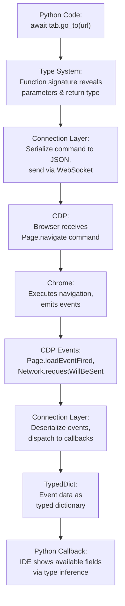

# Core Fundamentals

**Master the foundation, everything else becomes easier.**

This section covers the **bedrock technologies** that power Pydoll: the Chrome DevTools Protocol (CDP), WebSocket-based async communication, and Python's type system integration. These aren't just implementation details, they're the **fundamental design decisions** that make Pydoll fast, powerful, and type-safe.

## Why Fundamentals Matter

Most automation frameworks abstract away their communication layer, leaving you with a "black box" that works until it doesn't. When something breaks, debugging and optimization become difficult without understanding the underlying mechanisms.

**Pydoll takes a different approach**: we expose and explain the fundamentals, enabling you to work as both a **framework user** and a **protocol engineer**.

!!! quote "The Power of First Principles"
    **"If you know the way broadly, you will see it in all things."** - Miyamoto Musashi
    
    Understanding CDP, async communication, and type systems isn't just about Pydoll, it's about understanding **how modern browser automation works at its core**. This knowledge transfers to any CDP-based tool and any async Python project.

## The Three Pillars

### 1. Chrome DevTools Protocol (CDP)
**[→ Read CDP Deep Dive](./cdp.md)**

**The protocol that powers modern browser automation.**

CDP is Chrome's native debugging protocol, the same one Chrome DevTools (F12) uses. By communicating directly with CDP, Pydoll:

- **Eliminates WebDriver** (no Selenium overhead, no geckodriver/chromedriver intermediaries)
- **Gains deep control** (modify requests, intercept events, execute privileged operations)
- **Achieves native speed** (direct WebSocket communication, no HTTP polling)
- **Becomes undetectable** (no `navigator.webdriver`, no WebDriver fingerprints)

**What you'll learn:**

- How CDP organizes functionality into domains (Page, Network, DOM, Fetch, etc.)
- The command/event architecture that powers reactive automation
- Why CDP-based tools are **fundamentally more powerful** than Selenium
- How to read CDP documentation and extend Pydoll

**Why this matters**: CDP isn't just Pydoll's implementation detail, it's the foundation of modern browser automation. Puppeteer, Playwright, and similar tools all use CDP. Understanding it once provides knowledge applicable across multiple tools.

---

### 2. The Connection Layer
**[→ Read Connection Layer Architecture](./connection-layer.md)**

**Async communication done right.**

While CDP defines **what** you can do, the Connection Layer defines **how** Pydoll communicates with the browser. This is where protocol messages become Python objects, where async/await patterns enable concurrency, and where WebSockets provide real-time bidirectional communication.

**What you'll learn:**

- WebSocket architecture: persistent connections, message framing, keep-alive
- The async/await pattern: why `async def` and `await` enable concurrent automation
- Command/response correlation: how Pydoll matches responses to requests
- Event dispatching: how browser events trigger Python callbacks
- Error handling: timeout management, connection failures, graceful degradation

**Why this matters**: The connection layer is the communication backbone of Pydoll. Understanding it enables:
- **Effective debugging**: Inspect messages flowing between Python and Chrome
- **Performance optimization**: Identify latency sources and parallelize operations
- **Extension capabilities**: Add custom CDP commands or modify existing behavior

---

### 3. Python Type System Integration
**[→ Read Type System Deep Dive](./typing-system.md)**

**Types provide both safety and productivity.**

Python's type system (introduced in 3.5, enhanced in every version since) significantly improves development experience. Pydoll leverages `TypedDict`, `Literal`, `overload`, and generics to provide:

- **IDE autocomplete** for CDP response fields
- **Type checking** to catch bugs before runtime (`mypy`, `pyright`)
- **Self-documenting code** (function signatures reveal structure)
- **Refactoring safety** (rename a field, IDE updates all usages)

**What you'll learn:**

- How `TypedDict` models CDP event/response structures
- Why `overload` provides precise return types for `find()`/`query()`
- How generics (`TypeVar`, `Generic[T]`) enable flexible command construction
- Practical patterns: annotating callbacks, typing async functions, using `Literal`
- Tool integration: configuring mypy, leveraging IDE type inference

**Why this matters**: Type hints have become increasingly important in modern Python. Pydoll's comprehensive type coverage means:
- **Faster development**: Autocomplete reveals available fields and methods
- **Fewer bugs**: Type checker catches errors before they reach production
- **Better refactoring**: Change signatures confidently with IDE support

---

## How These Fundamentals Connect

Understanding how CDP, async communication, and type systems work **together** is key:

**The flow**:

1. You write Python code with **type annotations** (Type System)
2. Code serializes to JSON and sends via **WebSocket** (Connection Layer)
3. Browser receives and executes **CDP commands** (CDP)
4. Browser emits **CDP events** back (CDP)
5. Events deserialize into **TypedDict instances** (Type System)
6. Your callbacks receive **type-safe event objects** (Type System)

Each layer **amplifies** the others:

- Types make CDP responses discoverable
- CDP's event model enables async patterns
- Async communication makes types essential (what fields exist on this response?)

## Learning Path

We recommend this progression:

### Step 1: CDP
**[Start Here: Chrome DevTools Protocol](./cdp.md)**

Understand the protocol that powers everything. Learn domains, commands, events, and how to read CDP documentation.

**Outcome**: You'll know how to find and use any CDP feature, not just what Pydoll exposes.

### Step 2: Connection Layer
**[Continue: Connection Layer Architecture](./connection-layer.md)**

Deep dive into WebSocket communication, async patterns, and event dispatching.

**Outcome**: You'll understand exactly how messages flow between Python and Chrome, enabling debugging and optimization.

### Step 3: Type System
**[Finish: Python Type System](./typing-system.md)**

Learn how Pydoll uses modern Python typing for safety and productivity.

**Outcome**: You'll write type-safe automation with full IDE support, catching bugs before they run.

## Prerequisites

To get the most from this section:

- **Python fundamentals** - Functions, classes, decorators
- **Basic async/await** - Understand `async def` and `await` keywords
- **JSON familiarity** - Know how objects/arrays serialize
- **Browser DevTools** - Have used Chrome Inspector (F12)  

**If you're new to async Python**, read this first: [Real Python: Async IO in Python](https://realpython.com/async-io-python/)

## Beyond the Basics

Once you've mastered these fundamentals, you'll be ready for:

- **[Internal Architecture](../architecture/browser-domain.md)** - How Pydoll's components fit together
- **[Network & Security](../network/index.md)** - Protocol-level understanding for proxies
- **[Fingerprinting](../fingerprinting/index.md)** - Detection techniques requiring CDP knowledge

## Common Questions

### "Do I need to understand this to use Pydoll?"

**No**, but understanding these fundamentals will make you more effective. Basic usage works fine without this knowledge. However, when you need to:
- Debug why something isn't working
- Optimize slow automation
- Extend Pydoll with custom CDP commands
- Understand error messages
- Contribute to the project

These fundamentals become very helpful.

### "Isn't this too low-level?"

This level of detail is intentional. Most frameworks hide these fundamentals, but abstraction comes with tradeoffs:

- Understanding enables better debugging
- Visibility enables optimization
- Knowledge enables extension

By teaching fundamentals, we enable you to go beyond what Pydoll provides out-of-the-box.

### "How much of this do I need to memorize?"

**None of it.** The goal is building mental models, not memorization. After reading these sections, you'll develop intuition for:

- "This needs CDP, let me check the protocol docs"
- "This is slow because of sequential await, let me parallelize"
- "This type error means I'm using the wrong field name"

The specifics fade, but the understanding remains.

## Philosophy

These fundamentals represent long-lasting knowledge:

- **CDP** is Chrome's native protocol and continues to evolve
- **Async/await** is Python's standard for concurrency
- **Type systems** are increasingly important in Python (PEP 484 onwards)

Learning these concepts provides value across your development career.

---

## Ready to Build Your Foundation?

Start with **[Chrome DevTools Protocol](./cdp.md)** to understand the protocol that powers everything. Then progress through the Connection Layer and Type System to complete your fundamental understanding.

**This is where automation becomes engineering.**

---

!!! tip "After Completing Fundamentals"
    Once you've mastered these concepts, you'll see them **everywhere** in Pydoll's architecture:
    
    - Browser/Tab/WebElement all use the **Connection Layer**
    - Network events all follow **CDP's event model**
    - All responses use **TypedDict** for type safety
    
    The fundamentals aren't separate from Pydoll, they **are** Pydoll's foundation.
