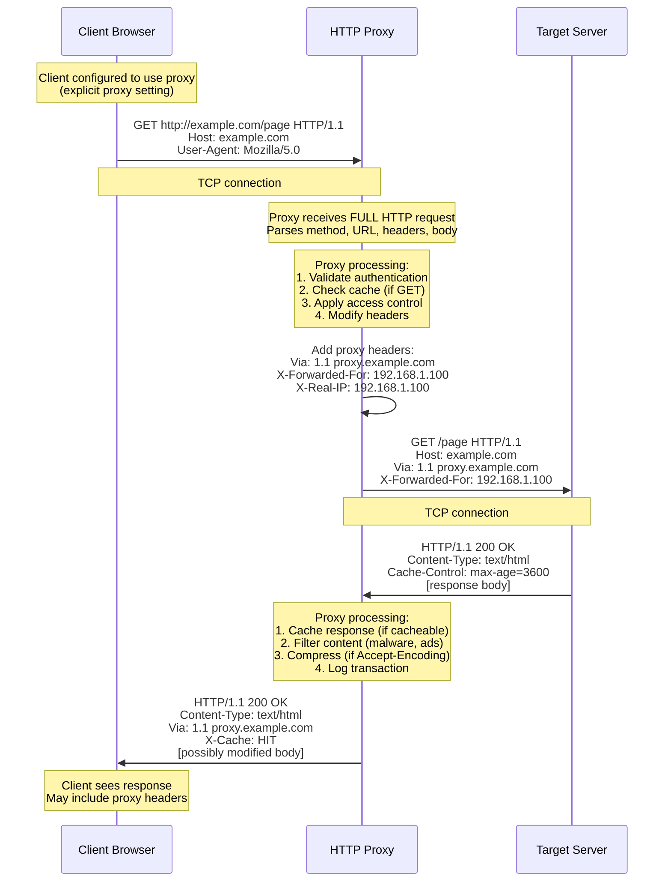
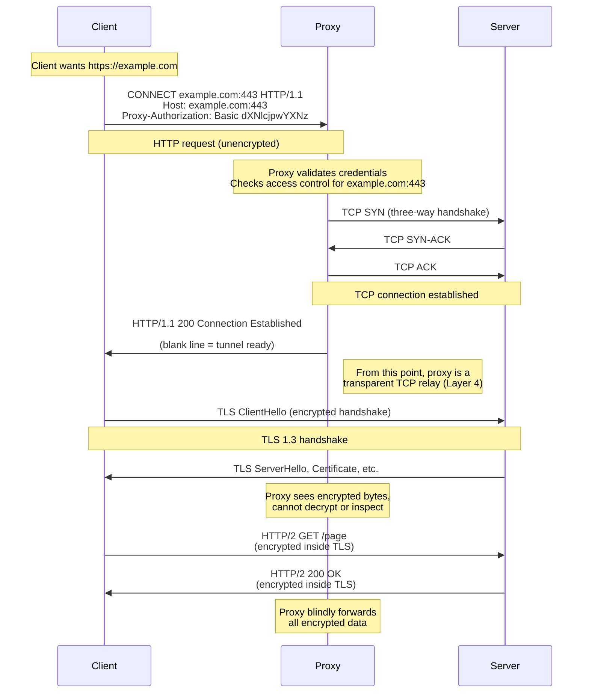
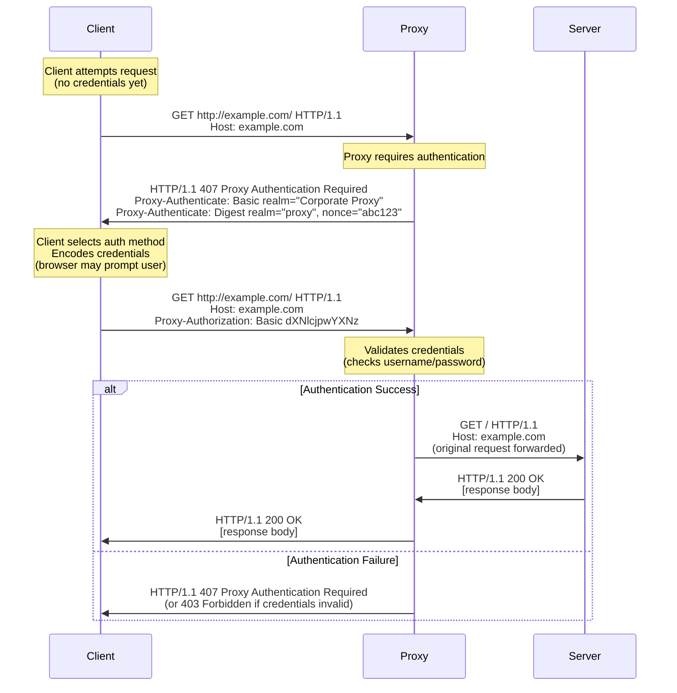
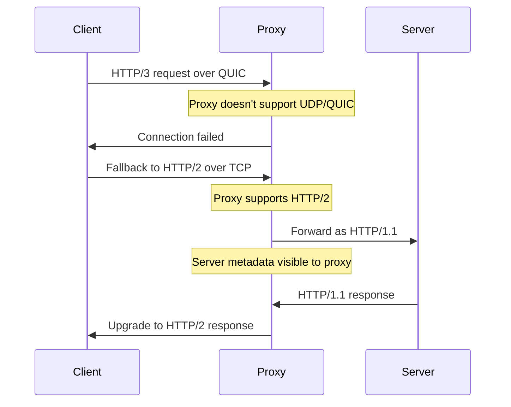

# HTTP/HTTPS Proxy Architecture

This document explores HTTP and HTTPS proxies in depth, the most common but also most **limited** proxy protocol. Despite their ubiquity (nearly every corporate network uses them), HTTP proxies have fundamental security and architectural limitations that make them unsuitable for many privacy-critical use cases.

Understanding how they work at the protocol level, their security implications, header manipulation, caching semantics, and modern protocol variations (HTTP/2, HTTP/3) is crucial for informed proxy selection and effective browser automation.

!!! info "Module Navigation"
    - **[← Network Fundamentals](./network-fundamentals.md)** - TCP/IP, UDP, OSI model
    - **[← Network & Security Overview](./index.md)** - Module introduction
    - **[→ SOCKS Proxies](./socks-proxies.md)** - More secure alternative
    - **[→ Proxy Detection](./proxy-detection.md)** - How to avoid detection
    
    For practical configuration, see **[Proxy Configuration](../../features/configuration/proxy.md)**.

!!! warning "Security Limitations"
    HTTP proxies operate at **Layer 7** (Application Layer in the OSI model). This positioning gives them:
    
    **Full visibility** into unencrypted HTTP traffic (URLs, headers, bodies)
    **Modification capabilities** (can alter requests/responses in-flight)
    **Intelligent caching** (understands HTTP semantics)
    
    But also means they:
    
    **Can read, log, and modify** all unencrypted HTTP traffic
    **Cannot proxy non-HTTP protocols** (FTP, SSH, SMTP, custom protocols)
    **Must terminate TLS** to inspect HTTPS (breaking end-to-end encryption)
    
    For true privacy, use **SOCKS5** or ensure end-to-end TLS encryption remains intact.

## Introduction: Layer 7 Proxying

HTTP proxies are **application-layer proxies**, operating at **Layer 7 of the OSI model**. Unlike SOCKS proxies (Layer 5) which blindly forward bytes, HTTP proxies **understand HTTP protocol semantics**. They parse requests, interpret headers, apply caching logic, and can modify traffic based on HTTP rules.

**Historical Context:**

HTTP proxies emerged in the mid-1990s as corporate networks grew and organizations needed:

1. **Content filtering** - Block inappropriate websites
2. **Bandwidth optimization** - Cache frequently accessed resources
3. **Access control** - Enforce usage policies
4. **Security** - Inspect traffic for malware

The HTTP/1.0 specification (RFC 1945, 1996) formalized proxy behavior, and HTTP/1.1 (RFC 2616, 1999, updated by RFC 7230-7237) refined it significantly. These RFCs define how proxies should handle caching, persistent connections, and forwarding semantics.

**Why Application-Layer Positioning Matters:**

Operating at Layer 7 means HTTP proxies:

- **See full HTTP requests** - Method, URL, headers, body (if unencrypted)
- **Can make intelligent decisions** - Cache based on `Cache-Control`, rewrite URLs, compress responses
- **Leave fingerprints** - Add headers like `Via`, `X-Forwarded-For` revealing proxy usage
- **Are protocol-specific** - Can only proxy HTTP/HTTPS, not other protocols

This deep integration with HTTP is both their **strength** (rich functionality) and **weakness** (limited scope, privacy concerns).

## HTTP Proxy Operation: Request Forwarding

An HTTP proxy intercepts HTTP requests from clients, processes them, and forwards them to target servers. The proxy acts as both a **server** (to the client) and a **client** (to the target server), maintaining two separate TCP connections.

### The HTTP Proxy Request Flow



**Detailed Breakdown:**

**1. Request Initiation (Client → Proxy)**

The client sends a **full HTTP request** to the proxy, including the **absolute URI** (not just path):

```http
GET http://example.com/page HTTP/1.1
Host: example.com
User-Agent: Mozilla/5.0 (Windows NT 10.0; Win64; x64)
Accept: text/html,application/xhtml+xml
Accept-Encoding: gzip, deflate
Connection: keep-alive
```

**Key difference from direct requests:** The `GET` line includes the **full URL** (`http://example.com/page`), not just the path (`/page`). This tells the proxy where to forward the request.

!!! tip "Absolute vs Relative URIs"
    **Direct to server**: `GET /page HTTP/1.1`  
    **Through proxy**: `GET http://example.com/page HTTP/1.1`
    
    This difference is how the proxy knows the destination. The `Host` header alone isn't sufficient because the proxy might be forwarding to multiple domains.

**2. Proxy Processing - Request Analysis**

The proxy **parses the entire HTTP request** and makes decisions:

```python
# Simplified proxy processing logic
def process_request(request):
    # 1. Authentication check
    if not authenticate_user(request.headers.get('Proxy-Authorization')):
        return HTTP_407_PROXY_AUTH_REQUIRED
    
    # 2. Access control
    if is_blocked(request.url):
        return HTTP_403_FORBIDDEN
    
    # 3. Cache check (for GET requests)
    if request.method == 'GET':
        cached = check_cache(request.url)
        if cached and not_expired(cached):
            return cached  # Cache hit - no server request needed
    
    # 4. Header modification
    request.headers['Via'] = '1.1 proxy.example.com'
    request.headers['X-Forwarded-For'] = client_ip
    request.headers['X-Real-IP'] = client_ip
    
    # 5. Forward to server
    return forward_to_server(request)
```

**3. Request Forwarding (Proxy → Server)**

The proxy establishes a **separate TCP connection** to the target server and forwards the request. The proxy may modify headers:

**Headers added by proxy:**

- `Via: 1.1 proxy.example.com` - Identifies proxy in the chain (RFC 7230)
- `X-Forwarded-For: 192.168.1.100` - Original client IP (de facto standard)
- `X-Real-IP: 192.168.1.100` - Original client IP (alternative header)
- `X-Forwarded-Proto: http` - Original protocol (http vs https)
- `X-Forwarded-Host: example.com` - Original `Host` header

!!! danger "Privacy Leakage via Proxy Headers"
    **These headers reveal you're using a proxy!** Detection systems look for:
    - `Via` header present → Proxy confirmed
    - `X-Forwarded-For` with multiple IPs → Proxy chain
    - `X-Real-IP` doesn't match connecting IP → Proxy confirmed
    
    Sophisticated proxies can **strip these headers**, but many don't by default.

**4. Server Response (Server → Proxy)**

The server responds to the proxy:

```http
HTTP/1.1 200 OK
Date: Mon, 01 Jan 2024 12:00:00 GMT
Server: nginx/1.18.0
Content-Type: text/html; charset=UTF-8
Content-Length: 1234
Cache-Control: public, max-age=3600
ETag: "abc123"

<!DOCTYPE html>
<html>...
```

**5. Proxy Processing - Response Handling**

The proxy can perform various operations on the response:

```python
def process_response(response, request):
    # 1. Caching decision
    if should_cache(response):
        cache_entry = {
            'url': request.url,
            'response': response,
            'expires': now() + parse_cache_control(response.headers['Cache-Control'])
        }
        save_to_cache(cache_entry)
    
    # 2. Content filtering
    if contains_malware(response.body):
        return HTTP_403_FORBIDDEN
    
    # 3. Compression (if client supports)
    if 'gzip' in request.headers.get('Accept-Encoding', ''):
        response.body = gzip_compress(response.body)
        response.headers['Content-Encoding'] = 'gzip'
    
    # 4. Header modification
    response.headers['Via'] = '1.1 proxy.example.com'
    response.headers['X-Cache'] = 'HIT' if from_cache else 'MISS'
    
    # 5. Logging
    log_transaction(request, response)
    
    return response
```

**6. Response Delivery (Proxy → Client)**

The proxy sends the (possibly modified) response back to the client:

```http
HTTP/1.1 200 OK
Date: Mon, 01 Jan 2024 12:00:00 GMT
Content-Type: text/html; charset=UTF-8
Content-Encoding: gzip
Via: 1.1 proxy.example.com
X-Cache: HIT
Age: 120

[compressed response body]
```

### Key Capabilities and Limitations

**What HTTP Proxies CAN Do:**

- **Read entire HTTP request/response** (if unencrypted)
- **Modify headers** (add `Via`, `X-Forwarded-For`, remove sensitive headers)
- **Cache responses** based on HTTP semantics (`Cache-Control`, `ETag`)
- **Compress/decompress** content (gzip, deflate, br)
- **Filter content** (block URLs, scan for malware, remove ads)
- **Authenticate users** (via `Proxy-Authorization` header)
- **Log all traffic** (URLs visited, data transferred, timing)
- **Rewrite URLs** (redirect, canonicalize)
- **Inject content** (ads, tracking scripts, warnings)

**What HTTP Proxies CANNOT Do:**

- **Proxy non-HTTP protocols** (FTP, SSH, SMTP, WebSocket upgrade, custom protocols)
- **Inspect HTTPS content** without TLS termination (breaking end-to-end encryption)
- **Hide that you're using a proxy** (unless headers are carefully stripped)
- **Proxy UDP traffic** (WebRTC, DNS, QUIC)
- **Preserve end-to-end TLS** while inspecting content (fundamental incompatibility)

!!! warning "The Fundamental HTTPS Dilemma"
    HTTP proxies face an impossible choice with HTTPS:
    
    **Option A: Blind tunnel (CONNECT method)**

    - Proxy cannot read/cache/filter HTTPS content
    - End-to-end encryption preserved
    - Proxy only sees destination IP:port, not URLs
    
    **Option B: TLS termination (MITM)**

    - Proxy decrypts HTTPS, inspects content, re-encrypts
    - Breaks end-to-end encryption
    - Requires installing proxy's CA certificate on client
    - Detectable by certificate pinning, CT logs
    
    Most corporate proxies choose Option B (TLS termination) for content filtering. Most privacy-focused proxies choose Option A (blind tunnel).

### The HTTP CONNECT Method: HTTPS Tunneling

The `CONNECT` method (defined in RFC 7231 Section 4.3.6) solves the HTTPS problem: how can an HTTP proxy forward encrypted traffic it cannot read? Answer: **become a blind TCP tunnel**.

When a client wants to access an HTTPS site through a proxy, it uses `CONNECT` to ask the proxy to establish a **raw TCP tunnel** to the destination. After the tunnel is established, the proxy simply forwards bytes in both directions without interpreting them. It becomes Layer 4 (transport) instead of Layer 7 (application).



#### CONNECT Request Format

```http
CONNECT example.com:443 HTTP/1.1
Host: example.com:443
Proxy-Authorization: Basic dXNlcjpwYXNz
User-Agent: Mozilla/5.0 (Windows NT 10.0; Win64; x64)
```

**Key characteristics:**

1. **Method**: `CONNECT` (not GET/POST)
2. **Request-URI**: `host:port` (not a path like `/page`)
3. **Port required**: Usually `443` for HTTPS, but any port is valid
4. **Authentication**: `Proxy-Authorization` if proxy requires it
5. **No request body**: CONNECT requests have no body

#### CONNECT Response Format

**Success (tunnel established):**

```http
HTTP/1.1 200 Connection Established
```

**That's it!** Just the status line and a blank line. After the blank line, the HTTP conversation ends and the proxy becomes a **transparent TCP tunnel**.

**Failure responses:**

```http
HTTP/1.1 407 Proxy Authentication Required
Proxy-Authenticate: Basic realm="proxy"

HTTP/1.1 403 Forbidden
Content-Type: text/plain

Access to example.com:443 is blocked by policy.

HTTP/1.1 502 Bad Gateway
Content-Type: text/plain

Cannot establish connection to example.com:443
```

#### What Happens After CONNECT Succeeds

Once the proxy sends `200 Connection Established`, it **stops being an HTTP proxy** and becomes a **Layer 4 TCP relay**. The client and server establish TLS directly, with the proxy blindly forwarding bytes:

```python
# Simplified proxy tunnel implementation
def handle_connect(client_socket, target_host, target_port):
    # 1. Establish TCP connection to target
    server_socket = socket.create_connection((target_host, target_port))
    
    # 2. Send 200 to client
    client_socket.send(b'HTTP/1.1 200 Connection Established\r\n\r\n')
    
    # 3. Become transparent relay (bidirectional forwarding)
    while True:
        # Wait for data from either side
        readable, _, _ = select.select([client_socket, server_socket], [], [])
        
        for sock in readable:
            data = sock.recv(8192)
            if not data:
                # Connection closed
                return
            
            # Forward data to other side
            if sock is client_socket:
                server_socket.send(data)  # Client → Server
            else:
                client_socket.send(data)  # Server → Client
```

**What the proxy can see:**

- **Destination hostname and port** - From CONNECT request  
- **Connection timing** - When established, how long open  
- **Data volume** - Total bytes transferred in each direction  
- **Connection close** - When either side terminates

**What the proxy CANNOT see:**

- **TLS handshake details** - Encrypted, but observable patterns exist  
- **HTTP method/URL** - Encrypted inside TLS  
- **Request/response headers** - Encrypted inside TLS  
- **Response content** - Encrypted inside TLS  
- **Cookies, session tokens** - Encrypted inside TLS

!!! tip "TLS Handshake Fingerprinting"
    While the proxy can't decrypt the TLS handshake, it can **observe its structure**. The first few packets after `CONNECT` reveal:
    - TLS version (1.2 vs 1.3)
    - ClientHello size and timing
    - Cipher suite order (via packet sizes)
    - Extensions used (via packet patterns)
    
    This enables **passive TLS fingerprinting** (JA3) even through CONNECT tunnels. See [Network Fingerprinting](../fingerprinting/network-fingerprinting.md) for details.

#### CONNECT vs Direct HTTP Proxying

| Aspect | HTTP (no CONNECT) | HTTPS (CONNECT tunnel) |
|--------|-------------------|------------------------|
| **Proxy visibility** | Full HTTP request/response | Only destination host:port |
| **Encryption** | No (unless TLS termination) | End-to-end TLS (client ⟷ server) |
| **Caching** | Yes, based on HTTP semantics | No (encrypted content) |
| **Content filtering** | Yes (can inspect/block content) | No (only hostname-based blocking) |
| **Header modification** | Yes (can add/remove headers) | No (encrypted headers) |
| **URL visibility** | Full URL visible | Only hostname visible |
| **Protocol** | HTTP-only | Any protocol over TCP (HTTPS, SSH, FTP-over-TLS) |

#### Security Implications of CONNECT

**For Privacy (Good):**

- **End-to-end TLS preserved** - Client verifies server certificate directly
- **No MITM possible** (unless client trusts proxy's CA)
- **Certificate pinning works** - Client sees real server certificate

**For Privacy (Bad):**

- **Hostname leaked** - Proxy knows you accessed `example.com:443`
- **Timing analysis possible** - Traffic patterns observable
- **TLS fingerprinting** - Passive analysis of ClientHello

**For Corporate Security (Bad):**

- **No content inspection** - Cannot scan for malware, data loss
- **Blind to threats** - Encrypted C2 traffic, exfiltration invisible
- **Policy bypass** - Users can tunnel arbitrary protocols

**This is why corporate proxies often use TLS termination (MITM) instead of CONNECT tunnels.**

#### CONNECT for Non-HTTPS Protocols

While `CONNECT` is primarily used for HTTPS, it can tunnel **any TCP-based protocol**:

```http
CONNECT mail.example.com:993 HTTP/1.1
Host: mail.example.com:993

[Tunnel established, IMAPS traffic flows]
```

```http
CONNECT ssh.example.com:22 HTTP/1.1
Host: ssh.example.com:22

[Tunnel established, SSH traffic flows]
```

This makes HTTP proxies with `CONNECT` support **surprisingly versatile**. They can proxy SSH, FTP-over-TLS, IMAPS, SMTPS, and other encrypted protocols, not just HTTPS.

!!! danger "CONNECT Abuse and Restrictions"
    Because `CONNECT` enables tunneling arbitrary TCP connections, many proxies:

    - **Restrict allowed ports** (often only 443 for HTTPS)
    - **Block suspicious hosts** (known malware C2, Tor nodes)
    - **Log all CONNECT attempts** (for security auditing)
    - **Require authentication** (to track users)
    
    If you try `CONNECT example.com:22` (SSH), many corporate proxies will return `403 Forbidden`.

### HTTP Proxy Authentication: Access Control

Unlike SOCKS proxies (which support authentication as part of the protocol handshake), HTTP proxies use **HTTP authentication headers** to control access. This means authentication happens **at the application layer** using standard HTTP status codes and headers.

The authentication flow follows **RFC 7235 (HTTP Authentication)**, using the `407 Proxy Authentication Required` status code (analogous to `401 Unauthorized` for servers) and the `Proxy-Authorization` request header (analogous to `Authorization`).

#### Authentication Flow



#### Authentication Schemes: Detailed Comparison

HTTP supports multiple authentication schemes, each with different security characteristics:

| Scheme | RFC | Security Level | Mechanism | Strengths | Weaknesses |
|--------|-----|----------------|-----------|-----------|------------|
| **Basic** | RFC 7617 | Low | Base64-encoded `username:password` | Simple, universal support | **Cleartext** (trivial to decode), no replay protection |
| **Digest** | RFC 7616 | Medium | Challenge-response with MD5/SHA-256 | Prevents cleartext transmission, replay protection | Vulnerable to rainbow tables, rarely implemented |
| **NTLM** | Proprietary (Microsoft) | Medium | Challenge-response (NT hash) | Windows integration, SSO | Proprietary, complex, known vulnerabilities |
| **Negotiate** | RFC 4559 | High | Kerberos/SPNEGO | Strong cryptography, SSO, mutual auth | Complex setup, Active Directory dependency |
| **Bearer** | RFC 6750 | High (if token secure) | OAuth 2.0 token | API-friendly, revocable tokens | Token theft = full access, requires token infrastructure |

#### Basic Authentication: The Simplest (and Weakest)

**Format:**
```http
Proxy-Authorization: Basic base64(username:password)
```

**Example:**
```python
# Username: "user", Password: "pass"
credentials = "user:pass"
encoded = base64.b64encode(credentials.encode()).decode()
# Result: "dXNlcjpwYXNz"

# In HTTP header:
Proxy-Authorization: Basic dXNlcjpwYXNz
```

**Security Issues:**

1. **Base64 is NOT encryption** - It's trivial to decode:
   ```python
   >>> import base64
   >>> base64.b64decode('dXNlcjpwYXNz').decode()
   'user:pass'  # Credentials exposed!
   ```

2. **Visible in logs** - Proxy logs often include headers, leaking credentials

3. **Replayable** - Anyone who intercepts the header can reuse it indefinitely

4. **No integrity protection** - Can be modified in transit

!!! danger "Basic Auth Over Unencrypted Connections"
    Sending `Proxy-Authorization: Basic` over HTTP (not HTTPS) is **catastrophically insecure**:

    - Credentials transmitted in cleartext (base64 is not encryption!)
    - Visible to any network observer (ISP, WiFi snoopers, MITM attackers)
    - Logged by intermediate proxies and servers
    
    **Always use Basic Auth over TLS/HTTPS**, or use a more secure scheme like Digest or Negotiate.

**When to use Basic:**

- Proxy connection is over TLS (HTTPS to proxy)
- Quick testing/development (never production!)
- Legacy systems with no alternative

#### Digest Authentication: Challenge-Response

**Format:**
```http
# Server challenge
Proxy-Authenticate: Digest realm="proxy",
                          qop="auth",
                          nonce="dcd98b7102dd2f0e8b11d0f600bfb0c093",
                          opaque="5ccc069c403ebaf9f0171e9517f40e41"

# Client response
Proxy-Authorization: Digest username="user",
                            realm="proxy",
                            nonce="dcd98b7102dd2f0e8b11d0f600bfb0c093",
                            uri="http://example.com/",
                            qop=auth,
                            nc=00000001,
                            cnonce="0a4f113b",
                            response="6629fae49393a05397450978507c4ef1",
                            opaque="5ccc069c403ebaf9f0171e9517f40e41"
```

**How it works:**

1. **Proxy sends challenge** with random `nonce` (number used once)
2. **Client computes hash**:
   ```python
   HA1 = MD5(username + ":" + realm + ":" + password)
   HA2 = MD5(method + ":" + uri)
   response = MD5(HA1 + ":" + nonce + ":" + nc + ":" + cnonce + ":" + qop + ":" + HA2)
   ```
3. **Proxy verifies** by computing same hash and comparing

**Security Improvements over Basic:**

- Password never transmitted (only hash)
- Replay protection (nonce changes each challenge)
- Integrity protection (hash includes method and URI)

**Remaining Issues:**

- MD5 is cryptographically weak (rainbow table attacks)
- No encryption (content still visible if not using TLS)
- Complex to implement correctly

!!! tip "Digest with SHA-256"
    RFC 7616 (2015) updated Digest to support SHA-256 instead of MD5, addressing the cryptographic weakness. However, support is still limited. Many proxies only implement MD5.

#### NTLM: Windows-Integrated Authentication

NTLM (NT LAN Manager) is Microsoft's proprietary challenge-response protocol, commonly used in Windows enterprise environments.

**Authentication Flow:**

1. **Type 1 (Negotiation)**: Client announces capabilities
2. **Type 2 (Challenge)**: Server sends 8-byte challenge
3. **Type 3 (Authentication)**: Client sends NT hash response

**Example (simplified):**
```http
# Step 1: Negotiation
Proxy-Authorization: NTLM TlRMTVNTUAABAAAAB4IIogAAAAAAAAAAAAAAAAAAAAAFASgKAAAADw==

# Step 2: Challenge
Proxy-Authenticate: NTLM TlRMTVNTUAACAAAADAAMADgAAAAFgooCBqqVKFrKPCMAAAAAAAAAAAAAAAAAAP8=

# Step 3: Authentication
Proxy-Authorization: NTLM TlRMTVNTUAADAAAAGAAYAEgAAAAYABgAYAAAAAwADAB4AAAACAAIAIQAAAAAAAAAAAAAABVCSUCAgICAgICAgICAgICAgICAgICAgICAgICAgICAgICAgICAgICAgICAgICAgA==
```

**Advantages:**

- Seamless Windows integration (SSO with Active Directory)
- No password transmitted
- Supports domain authentication

**Disadvantages:**

- Proprietary (reverse-engineered, not standardized)
- Known cryptographic weaknesses (NTLMv1 broken, NTLMv2 vulnerable)
- Complex protocol (multiple round-trips)
- Connection-bound (breaks with HTTP/2 multiplexing)

!!! warning "NTLM Security Concerns"
    NTLM has known vulnerabilities:
    - **Pass-the-hash attacks**: Stolen hash can authenticate without knowing password
    - **Relay attacks**: Attacker relays authentication to another server
    - **Weak cryptography**: NTLMv1 uses DES (broken), NTLMv2 uses MD5 (weak)
    
    Microsoft recommends **Kerberos** (via Negotiate) over NTLM for new deployments.

#### Negotiate (Kerberos): Enterprise SSO

**Negotiate** (RFC 4559) uses SPNEGO (Simple and Protected GSSAPI Negotiation) to select between Kerberos and NTLM, preferring Kerberos.

**Kerberos Flow:**

1. Client requests **ticket-granting ticket (TGT)** from Key Distribution Center (KDC)
2. Client requests **service ticket** for proxy service
3. Client presents service ticket to proxy
4. Proxy validates ticket with KDC

**Example:**
```http
Proxy-Authorization: Negotiate YIIFyQYGKwYBBQUCoIIFvTCCBbmgMDAuBgkqhkiC9xIBAgIGCSqGSIb3EgECAgYKKwYBBAGCNwICHgYKKwYBBAGCNwICCqKCBYMEggV/...
```

**Advantages:**

- **Strongest security**: AES encryption, mutual authentication
- **True SSO**: No password prompts for domain users
- **Ticket expiration**: Time-limited authentication
- **Auditing**: Centralized KDC logging

**Disadvantages:**

- **Complex setup**: Requires Active Directory infrastructure
- **Limited cross-platform**: Best on Windows, limited macOS/Linux support
- **Time synchronization**: Requires accurate clocks (Kerberos tickets time-sensitive)

!!! info "Kerberos in Browser Automation"
    Pydoll (and most headless browsers) have **limited Kerberos support** because:

    - Requires OS-level integration (ticket cache, keytab)
    - Needs domain-joined machine
    - Complex to configure programmatically
    
    For automated testing in Kerberos environments, consider using a **service account** with Basic/Digest auth instead.

#### Practical Pydoll Configuration

**Basic Authentication:**
```python
from pydoll.browser import Chrome
from pydoll.browser.options import ChromiumOptions

options = ChromiumOptions()
options.add_argument('--proxy-server=http://user:pass@ip:port')

async with Chrome(options=options) as browser:
    tab = await browser.start()
    await tab.go_to('http://example.com')
```

**Authentication via Fetch Domain (Advanced):**

Pydoll uses Chrome's **Fetch domain** to automatically handle proxy authentication for any scheme the browser supports (Basic, Digest, NTLM, Negotiate):

```python
# Internal Pydoll implementation (simplified)
async def handle_auth_required(self, event):
    # Browser detected 407 Proxy Authentication Required
    auth_challenge_id = event['requestId']
    
    # Respond with credentials
    await self._execute_command('Fetch.continueWithAuth', {
        'requestId': auth_challenge_id,
        'authChallengeResponse': {
            'response': 'ProvideCredentials',
            'username': self.proxy_username,
            'password': self.proxy_password
        }
    })
```

This approach works for **all authentication schemes** without Pydoll needing to implement protocol-specific logic. Chrome handles Digest/NTLM/Negotiate internally.

!!! tip "Authentication Best Practices"
    **Use TLS-encrypted proxy connections** (HTTPS proxy or SSH tunnel)  
    **Prefer Bearer tokens** for API proxies (revocable, time-limited)  
    **Use Digest** over Basic if TLS isn't available  
    **Rotate credentials** regularly  
    **Monitor auth failures** (may indicate credential theft)  
    
    **Never use Basic auth over HTTP** (unencrypted connection)  
    **Don't hardcode credentials** (use environment variables)  
    **Don't reuse credentials** across proxies  
    **Don't log Proxy-Authorization headers**

## Modern HTTP Protocols and Proxying

Traditional HTTP/1.1 proxies are well-understood, but modern protocols introduce new considerations.

### HTTP/2 Proxies

HTTP/2 introduced multiplexing, which fundamentally changes how proxies handle connections:

**Key differences:**

| Feature | HTTP/1.1 | HTTP/2 |
|---------|----------|--------|
| **Connections** | One request per connection (or sequential) | Multiple requests over single connection |
| **Multiplexing** | No (head-of-line blocking) | Yes (concurrent streams) |
| **Header Compression** | None | HPACK compression |
| **Server Push** | Not supported | Server can push resources |
| **Proxy Complexity** | Simple request/response forwarding | Must manage stream prioritization |

**Implications for proxying:**

```python
# HTTP/1.1 Proxy: Simple one-to-one mapping
client_conn_1 → proxy → server_conn_1  # Request A
client_conn_2 → proxy → server_conn_2  # Request B

# HTTP/2 Proxy: Complex stream management
client_conn (streams 1,3,5) → proxy → server_conn (streams 2,4,6)
#     ↓ Must maintain stream IDs and prioritization
```

**Performance impact:**

- **Positive**: Reduced connection overhead, better bandwidth utilization
- **Negative**: Proxy must parse binary framing, manage stream states
- **Leakage risk**: Stream IDs and priorities can fingerprint client behavior

!!! info "HTTP/2 Proxy Detection"
    HTTP/2 multiplexing makes it harder to correlate requests with clients when multiple users share a proxy, but stream metadata (window sizes, priority settings) can still fingerprint individual clients.

### HTTP/3 (QUIC) Proxies

HTTP/3 runs over QUIC (UDP-based) instead of TCP, introducing new challenges:

**QUIC characteristics:**

| Aspect | TCP + TLS | QUIC (UDP) |
|--------|-----------|------------|
| **Transport** | TCP (connection-oriented) | UDP (connectionless) |
| **Handshake** | Separate TCP + TLS (2 RTT) | Combined (0-1 RTT) |
| **Head-of-line blocking** | Yes (TCP level) | No (stream-level only) |
| **Connection migration** | Not supported | Supported (survives IP changes) |
| **Proxy compatibility** | Excellent | Limited (UDP support required) |

**Implications for proxying:**

1. **UDP requirement**: Traditional HTTP proxies (TCP-only) cannot handle HTTP/3
2. **Connection migration**: QUIC connections can survive IP changes, complicating proxy session management
3. **Encrypted transport**: QUIC encrypts almost everything, including connection metadata
4. **CONNECT-UDP**: New method required (RFC 9298) for proxying QUIC

```python
# Traditional proxy chain
Client --TCP--> HTTP Proxy --TCP--> Server

# HTTP/3 proxy chain (requires CONNECT-UDP)
Client --UDP/QUIC--> Proxy --UDP/QUIC--> Server
       (or)
Client --TCP/CONNECT-UDP--> Proxy --UDP/QUIC--> Server
```

!!! warning "HTTP/3 Proxy Support"
    Most traditional proxies (including many commercial services) don't support HTTP/3. Browsers typically fall back to HTTP/2 or HTTP/1.1 when proxies don't support QUIC.
    
    This fallback can be a **privacy issue**: If you expect HTTP/3's encrypted metadata but fall back to HTTP/1.1, more information may leak through the proxy.

### Protocol Negotiation and Downgrade Attacks



**Security considerations:**

- **Downgrade attacks**: Attacker forces fallback to less secure protocol
- **Metadata leakage**: HTTP/1.1 exposes headers that HTTP/3 would encrypt
- **Performance degradation**: Multiplexing benefits lost in downgrade

!!! tip "Modern Protocol Best Practices"
    - Test your proxy with HTTP/2 and HTTP/3 to understand fallback behavior
    - Monitor for unexpected protocol downgrades (may indicate MITM)
    - Consider QUIC-aware proxies if working with modern web apps
    - Be aware that HTTP/3 adoption varies by region and CDN

## Summary and Key Takeaways

HTTP and HTTPS proxies are the **most common** but also most **limited** proxy protocol. Understanding their architecture, capabilities, and fundamental security limitations is essential for making informed decisions in browser automation.

### Core Concepts Covered

**1. Layer 7 Operation:**

- HTTP proxies operate at the **Application Layer**, giving them full visibility into HTTP traffic
- Can read/modify URLs, headers, cookies, request bodies (for unencrypted HTTP)
- Protocol-specific: **only works with HTTP/HTTPS**, not FTP/SSH/SMTP/custom protocols

**2. The CONNECT Method:**

- **HTTPS tunneling** via CONNECT transforms the proxy into a **blind TCP relay**
- After `200 Connection Established`, proxy becomes Layer 4 (cannot inspect encrypted traffic)
- Preserves **end-to-end TLS** between client and server
- Leaks **hostname and port** to proxy, but not URLs or content

**3. Request/Response Proxying:**

- HTTP proxies use **absolute URIs** in requests (`GET http://example.com/page`)
- Maintain **two TCP connections**: client↔proxy and proxy↔server
- Can add headers (`Via`, `X-Forwarded-For`, `X-Real-IP`) revealing proxy usage
- Support **caching** based on HTTP semantics (`Cache-Control`, `ETag`)

**4. Authentication:**

- Uses HTTP status **407** and `Proxy-Authorization` header
- **Basic**: Simple but insecure (base64-encoded, not encrypted)
- **Digest**: Challenge-response with hashing (better, but MD5 weak)
- **NTLM**: Windows integration (complex, proprietary)
- **Negotiate/Kerberos**: Strongest (enterprise SSO, Active Directory)

**5. Modern Protocols:**

- **HTTP/2**: Multiplexing, binary framing, HPACK compression
- **HTTP/3/QUIC**: UDP-based, 0-RTT, connection migration
- Most proxies **don't support HTTP/3** (requires UDP relay support)
- Browsers **fall back** to HTTP/2 or HTTP/1.1 if proxy lacks QUIC support

### Security Implications

**Strengths:**

- **Mature protocol** with widespread support
- **Intelligent caching** reduces bandwidth and latency
- **Content filtering** enables malware scanning, ad blocking
- **CONNECT tunneling** preserves end-to-end TLS for HTTPS

**Weaknesses:**

- **Can read all unencrypted HTTP traffic** (URLs, headers, bodies)
- **Adds identifying headers** (`Via`, `X-Forwarded-For`) revealing proxy usage
- **Cannot proxy non-HTTP protocols** (FTP, SSH, custom)
- **No UDP support** (WebRTC leaks real IP)
- **TLS termination for inspection** breaks end-to-end encryption

### When to Use HTTP Proxies

**Good Use Cases:**

- **Corporate networks** requiring content filtering and monitoring
- **Caching proxies** for bandwidth optimization
- **Simple web scraping** where stealth isn't critical
- **Legacy systems** only supporting HTTP proxies
- **URL-based access control** (blocking specific domains)

**Bad Use Cases:**

- **Privacy-critical automation** (use SOCKS5 instead)
- **Non-HTTP protocols** (FTP, SSH, custom → use SOCKS5)
- **WebRTC applications** (UDP not supported → use SOCKS5 or VPN)
- **Certificate pinning** environments (CONNECT breaks MITM)
- **Stealth automation** (headers leak proxy usage)

### HTTP Proxy vs SOCKS5: Quick Decision Matrix

| Need | HTTP Proxy | SOCKS5 |
|------|------------|--------|
| **Content filtering** | **Yes** | **No** |
| **URL-based blocking** | **Yes** | **No** (only IP:port) |
| **Caching** | **Yes** | **No** |
| **UDP support** | **No** | **Yes** (SOCKS5) |
| **Protocol flexibility** | **HTTP only** | **Any TCP/UDP** |
| **Privacy** | **Low** (sees HTTP) | **High** (blind forwarding) |
| **Stealth** | **Low** (headers leak) | **High** (transparent) |
| **DNS privacy** | **Client resolves** | **Remote resolution** |
| **Complexity** | **Simple** | **Moderate** |

**General Recommendation:**
- **Corporate/Enterprise**: HTTP proxy (content control, caching)
- **Privacy/Automation**: SOCKS5 (stealth, protocol flexibility)
- **Maximum Security**: SOCKS5 over SSH tunnel or VPN

## Further Reading and Next Steps

### Related Documentation

**Within This Module:**

- **[SOCKS Proxies](./socks-proxies.md)** - Protocol-agnostic, more secure alternative to HTTP proxies
- **[Network Fundamentals](./network-fundamentals.md)** - TCP/IP, UDP, WebRTC understanding
- **[Proxy Detection](./proxy-detection.md)** - How proxies are detected and how to avoid it
- **[Building Proxy Servers](./build-proxy.md)** - Implement HTTP and SOCKS5 proxies from scratch

**Practical Usage:**

- **[Proxy Configuration (Features)](../../features/configuration/proxy.md)** - How to configure proxies in Pydoll
- **[Browser Options](../../features/configuration/browser-options.md)** - Relevant browser flags for proxy usage

**Deep Dives:**

- **[Network Fingerprinting](../fingerprinting/network-fingerprinting.md)** - How TCP/IP characteristics leak through proxies
- **[Browser Fingerprinting](../fingerprinting/browser-fingerprinting.md)** - Application-level detection despite proxies

### External References

**RFCs (Official Specifications):**

- **RFC 7230-7237** - HTTP/1.1 specification suite (2014)
  - RFC 7230: Message Syntax and Routing (defines proxy behavior)
  - RFC 7231: Semantics and Content (defines CONNECT method)
  - RFC 7235: Authentication (defines 407 and Proxy-Authorization)
- **RFC 7617** - Basic Authentication (2015)
- **RFC 7616** - Digest Authentication (2015)
- **RFC 4559** - Negotiate Authentication (2006)
- **RFC 7540** - HTTP/2 (2015)
- **RFC 9000** - QUIC Transport Protocol (2021)
- **RFC 9114** - HTTP/3 (2022)
- **RFC 9298** - Proxying UDP in HTTP (CONNECT-UDP, 2022)

**Standards Bodies:**

- **IETF (Internet Engineering Task Force)**: https://www.ietf.org/
- **W3C (World Wide Web Consortium)**: https://www.w3.org/

**Technical Resources:**

- **MDN Web Docs - Proxy servers and tunneling**: https://developer.mozilla.org/en-US/docs/Web/HTTP/Proxy_servers_and_tunneling
- **Chrome DevTools Protocol - Network domain**: https://chromedevtools.github.io/devtools-protocol/tot/Network/
- **Chrome DevTools Protocol - Fetch domain**: https://chromedevtools.github.io/devtools-protocol/tot/Fetch/

**Security Research:**

- **HTTP/2 Rapid Reset Attack (CVE-2023-44487)**: Example of HTTP/2 multiplexing vulnerability
- **NTLM Relay Attacks**: Microsoft security advisory on NTLM vulnerabilities
- **TLS Interception Research**: Studies on corporate proxy MITM practices

### Practical Testing Tools

**Proxy Testing:**

- **curl**: Command-line HTTP client with proxy support
  ```bash
  curl -x http://proxy:8080 -U user:pass http://example.com
  ```
- **Burp Suite**: Intercepting HTTP proxy for security testing
- **mitmproxy**: Interactive HTTP/HTTPS proxy for analysis

**Network Analysis:**

- **Wireshark**: Packet analyzer to observe HTTP proxy traffic
- **tcpdump**: Command-line packet capture
- **Chrome DevTools**: Network tab shows proxy headers (Via, X-Forwarded-For)

**Proxy Detection Testing:**

- **https://browserleaks.com/ip**: Shows your IP and proxy headers
- **https://whoer.net/**: Comprehensive proxy detection test
- **https://ipleak.net/**: Tests for DNS leaks, WebRTC leaks

### Advanced Topics (Beyond This Document)

**Proxy Chaining:**

- Using multiple proxies in sequence for additional anonymity
- Performance and latency implications
- Tor network as extreme example

**Transparent Proxies:**

- OS-level proxy configuration (no application awareness)
- WPAD (Web Proxy Auto-Discovery Protocol)
- PAC (Proxy Auto-Configuration) files

**Reverse Proxies:**

- Proxies acting on behalf of servers (not clients)
- Load balancing, CDNs, caching
- Nginx, HAProxy, Cloudflare as examples

**TLS Interception:**

- Corporate proxy MITM with custom CA certificates
- Certificate transparency logs detecting interception
- Certificate pinning as countermeasure

---

## Final Thoughts

HTTP proxies are a **double-edged sword**: powerful for content control and caching, but fundamentally **incompatible with strong privacy** due to their application-layer positioning.

For **browser automation** requiring stealth and flexibility, **SOCKS5 is almost always the better choice**. HTTP proxies should be used when:

- You control the proxy (corporate environment)
- You need HTTP-specific features (caching, URL filtering)
- SOCKS5 isn't available

Understanding HTTP proxy architecture (its capabilities, limitations, and security model) enables you to **make informed decisions** rather than blindly copying proxy configurations.

**Next steps:**

1. Read **[SOCKS Proxies](./socks-proxies.md)** to understand the superior alternative
2. Learn **[Proxy Detection](./proxy-detection.md)** techniques to avoid leaking proxy usage
3. Configure proxies in Pydoll using **[Proxy Configuration](../../features/configuration/proxy.md)**

---


