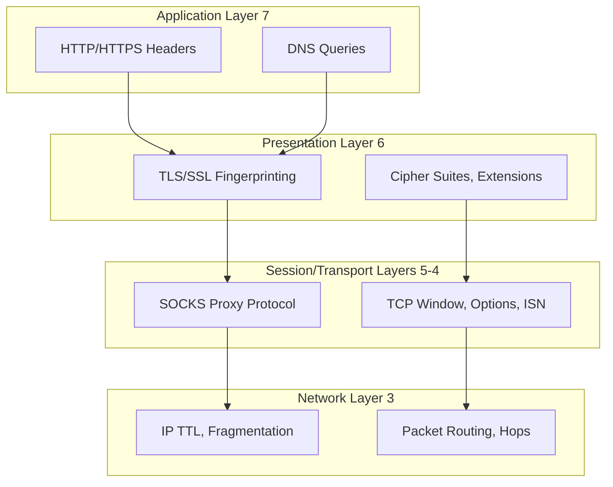

# Network & Security Deep Dive

**Welcome to the foundation of modern internet communication, the battleground of anonymity, detection, and evasion.**

Network protocols are the invisible infrastructure that powers every web request, browser connection, and automation script. Understanding them deeply transforms you from a **tool user** into a **protocol engineer** capable of navigating the most sophisticated anti-bot systems.

## Why Network Architecture Matters

When you run `tab.go_to('https://example.com')`, a complex symphony of protocols springs into action:

1. **DNS resolution** translates the domain to an IP address (potentially leaking your intent)
2. **TCP handshake** establishes connection (revealing your OS through packet characteristics)
3. **TLS negotiation** secures the channel (fingerprinting your browser via cipher suites)
4. **HTTP/2 request** fetches the page (exposing browser version through SETTINGS frames)
5. **WebRTC discovery** may probe your real IP (bypassing your VPN entirely)

**Every single step is an opportunity for detection or evasion.**

!!! danger "The Network Layer Cannot Lie"
    Unlike browser-level characteristics (which JavaScript can modify), network-level fingerprints are **burned into the OS kernel and TCP/IP stack**. A mismatch here like a Chrome browser sending Linux TCP options while claiming to be Windows is instantly fatal to stealth automation.

## The Architecture of Internet Privacy

This module explores the **technical foundations** that make privacy possible (and breakable) on the modern internet:

### The OSI Model Reality

**Each layer is both a shield and a vulnerability:**

- **Layer 7 (Application)**: Proxies can read and modify your HTTP traffic
- **Layer 6 (Presentation)**: TLS encryption protects content but leaks metadata
- **Layer 4 (Transport)**: TCP characteristics betray your operating system
- **Layer 3 (Network)**: IP addresses reveal your physical location

## What You'll Master

This module is structured as a **technical progression** from fundamentals to advanced exploitation:

### 1. Network Fundamentals
**[Network Fundamentals](./network-fundamentals.md)**

Build the foundation: understand the protocols that power the internet and how they reveal, or hide, your identity.

- **OSI Model layers** and their fingerprinting implications
- **TCP vs UDP**: Why your proxy might leak UDP traffic
- **WebRTC IP leakage**: The hidden threat in modern browsers
- **Network stack characteristics**: TTL, window size, option ordering

**Why start here**: Without this foundation, proxy configuration is **cargo cult programming**, copying commands without understanding why they work (or don't).

### 2. HTTP/HTTPS Proxies
**[HTTP/HTTPS Proxies](./http-proxies.md)**

Master the most common proxy protocol and understand its fundamental limitations.

- **HTTP proxy operation**: Request forwarding, caching, header injection
- **CONNECT tunneling**: How HTTPS "tunnels" through HTTP proxies
- **HTTP/2 complexities**: Multiplexing, stream priorities, SETTINGS fingerprinting
- **HTTP/3 and QUIC**: UDP-based proxying challenges
- **Authentication schemes**: Basic, Digest, NTLM, Bearer tokens

**Critical insight**: HTTP proxies operate at Layer 7, they can **read, modify, and log** your unencrypted traffic. For true privacy, you need encryption **before** the proxy sees your data.

### 3. SOCKS Proxies
**[SOCKS Proxies](./socks-proxies.md)**

Understand why SOCKS5 is the **gold standard** for privacy-conscious automation.

- **SOCKS4 vs SOCKS5**: Protocol evolution and capabilities
- **SOCKS5 handshake**: Binary protocol deep dive with packet structures
- **UDP support**: Gaming, VoIP, and WebRTC over SOCKS5
- **DNS resolution**: Why proxy-side DNS prevents leaks
- **Why SOCKS5 > HTTP proxies**: Protocol-level comparison

**Key advantage**: SOCKS operates at Layer 5 (Session), **below** the application layer. It can't read your HTTP traffic, only see destination IPs, vastly reducing the trust surface area.

### 4. Proxy Detection
**[Proxy Detection & Anonymity](./proxy-detection.md)**

Learn how websites **detect proxy usage** and how to evade detection.

- **Anonymity levels**: Transparent, anonymous, elite proxies
- **IP reputation databases**: How your datacenter IP betrays you
- **Header analysis**: X-Forwarded-For, Via, Forwarded headers
- **Consistency checks**: DNS reverse lookup, geolocation mismatches
- **Network fingerprinting integration**: Combining proxy detection with TCP/TLS analysis

**Harsh reality**: Most "anonymous" proxies are trivially detectable. True stealth requires **elite residential proxies** + **consistent browser fingerprinting** + **human-like behavior**.

### 5. Building Proxy Servers
**[Building Your Own Proxy](./build-proxy.md)**

Implement HTTP and SOCKS5 proxies from scratch in Python, the ultimate learning experience.

- **HTTP proxy server**: Complete async implementation with authentication
- **SOCKS5 proxy server**: Binary protocol handling, TCP tunneling
- **Proxy chaining**: Layered anonymity (and latency tradeoffs)
- **Rotating proxy pools**: Health checking, failover, load balancing
- **Advanced topics**: Transparent proxies, MITM SSL interception

**Why build your own**: Understanding implementation details reveals **attack vectors** and **optimization opportunities** invisible from the outside.

### 6. Legal & Ethical Considerations
**[Legal & Ethical Guidelines](./proxy-legal.md)**

Navigate the legal minefield of proxy usage and web automation.

- **Regulatory compliance**: GDPR, CFAA, international laws
- **Terms of Service**: What constitutes violation
- **Ethical guidelines**: robots.txt, rate limiting, transparency
- **Case studies**: Legal precedents (hiQ vs LinkedIn, QVC vs Resultly)
- **When to avoid proxies**: High-risk scenarios

**Disclaimer**: This is **educational information**, not legal advice. The law varies wildly by jurisdiction and use case. Consult qualified counsel.

## The Proxy Paradox

Here's the uncomfortable truth about proxies:

!!! warning "Proxies Don't Make You Anonymous. They Make You **Different**"
    A proxy changes your IP address, but it also:
    
    - Adds **latency** (detectible via timing analysis)
    - Resets **TTL** values (revealing proxy hops)
    - Introduces **TCP fingerprint** mismatches (proxy OS ≠ your OS)
    - May inject **headers** (X-Forwarded-For, Via)
    - Creates **geolocation** inconsistencies (browser timezone ≠ IP location)
    
    Proxies are a **tool**, not a solution. True stealth requires **holistic consistency**.

## Prerequisites

This is **advanced material**. You should be comfortable with:

Basic networking concepts (IP addresses, ports, protocols)  
TCP/IP fundamentals (three-way handshake, packets, routing)  
Asynchronous Python programming (asyncio, async/await)  
Pydoll basics (see [Core Concepts](../../features/core-concepts.md))  

**If you're new to networking**, we highly recommend:

1. Read a TCP/IP fundamentals guide first
2. Experiment with Wireshark to visualize network traffic
3. Try the code examples with packet captures running
4. Build the proxy servers and test them locally

## Integration with Other Modules

Network architecture doesn't exist in isolation. It integrates deeply with:

- **[Fingerprinting](../fingerprinting/network-fingerprinting.md)**: How TCP/IP and TLS characteristics identify you
- **[Browser Configuration](../../features/configuration/browser-preferences.md)**: Aligning browser behavior with proxy characteristics
- **[Connection Layer](../fundamentals/connection-layer.md)**: How Pydoll manages WebSocket connections over proxies

## The Learning Path

We recommend this progression:

**Phase 1: Foundation**

1. Read [Network Fundamentals](./network-fundamentals.md)
2. Understand OSI model and protocol layering
3. Learn about WebRTC leaks and UDP tunneling

**Phase 2: Protocol Deep Dive**

4. Study [HTTP/HTTPS Proxies](./http-proxies.md)
5. Master [SOCKS Proxies](./socks-proxies.md)
6. Compare protocols and understand tradeoffs

**Phase 3: Adversarial Thinking**

7. Explore [Proxy Detection](./proxy-detection.md)
8. Learn detection techniques from the defender's perspective
9. Apply evasion strategies

**Phase 4: Hands-On Implementation**

10. Build proxy servers from [Building Proxies](./build-proxy.md)
11. Capture and analyze traffic with Wireshark
12. Test proxy chains and rotation strategies

**Phase 5: Operational Security**

13. Review [Legal & Ethical](./proxy-legal.md) guidelines
14. Understand compliance requirements
15. Develop responsible automation policies

## The Philosophy

Network and security knowledge is **foundational power**. Unlike framework-specific skills (which become obsolete), protocol knowledge is **timeless**:

- TCP hasn't fundamentally changed since RFC 793 (1981)
- TLS builds on concepts from SSL (1995)
- HTTP/2 (2015) and HTTP/3 (2022) are evolutions, not revolutions

Master these fundamentals once, and you'll understand **every network-based system** you encounter for the rest of your career.

## Ethical Commitment

Before proceeding, acknowledge:

I understand proxies can be used for both legitimate and malicious purposes  
I will respect website terms of service and robots.txt  
I will implement rate limiting and respectful crawling  
I will not use this knowledge for fraud, abuse, or illegal activities  
I will consult legal counsel when uncertain about compliance  

**With great power comes great responsibility.** Use this knowledge wisely.

---

## Ready to Begin?

Start your journey with **[Network Fundamentals](./network-fundamentals.md)** to build the foundation, then progress through the modules in order. Each document builds on the previous, creating a comprehensive understanding of network architecture for automation.

---

!!! info "Documentation Status"
    This module synthesizes knowledge from RFCs, protocol specifications, security research, and real-world testing. Every code example is production-ready. If you find inaccuracies or have improvements, contributions are welcome.

## Quick Navigation

**Core Protocols:**

- [Network Fundamentals](./network-fundamentals.md) - TCP/IP, UDP, WebRTC
- [HTTP/HTTPS Proxies](./http-proxies.md) - Application-layer proxying
- [SOCKS Proxies](./socks-proxies.md) - Session-layer proxying

**Advanced Topics:**

- [Proxy Detection](./proxy-detection.md) - Anonymity and evasion
- [Building Proxies](./build-proxy.md) - Implementation from scratch
- [Legal & Ethical](./proxy-legal.md) - Compliance and responsibility

**Related Modules:**

- [Fingerprinting](../fingerprinting/index.md) - Detection techniques
- [Browser Configuration](../../features/configuration/browser-options.md) - Practical setup
