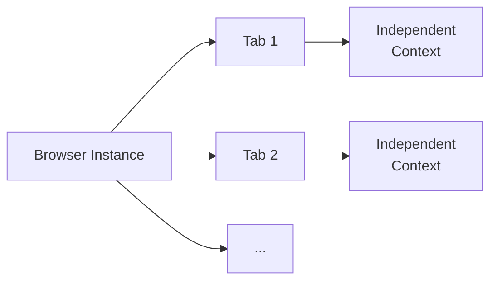

# Multi-Tab Management

Pydoll provides sophisticated multi-tab capabilities that enable complex automation workflows spanning multiple browser tabs simultaneously. Understanding how tabs work in Pydoll is essential for building robust, scalable automation.

## Understanding Tabs in Pydoll

In Pydoll, a `Tab` instance represents a single browser tab (or window) and provides the primary interface for all page automation operations. Each tab maintains its own:

- **Independent execution context**: JavaScript, DOM, and page state
- **Isolated event handlers**: Callbacks registered on one tab don't affect others
- **Separate network monitoring**: Each tab can track its own network activity
- **Unique CDP connection**: Direct WebSocket communication with the browser



| Tab Component | Description | Independence |
|---------------|-------------|--------------|
| **Execution Context** | JavaScript runtime, DOM, page state | ✓ Each tab has its own |
| **Event Handlers** | Registered callbacks for CDP events | ✓ Isolated per tab |
| **Network Monitoring** | HTTP requests, responses, timing | ✓ Track separately |
| **CDP Connection** | WebSocket communication channel | ✓ Direct connection |

### What is a Browser Tab?

A browser tab is technically a **CDP target** - an isolated browsing context with its own:

- Document Object Model (DOM)
- JavaScript execution environment
- Network connection pool
- Cookie storage (shared with other tabs in the same context)
- Event loop and rendering engine

Each tab has a unique `target_id` assigned by the browser, which Pydoll uses to route commands and events correctly.

## Tab Instance Management

Pydoll's `Browser` class maintains a registry of Tab instances based on each tab's `target_id`. This ensures that multiple references to the same browser tab always return the same Tab object. The Browser stores these instances in an internal `_tabs_opened` dictionary.

| Benefit | Description |
|---------|-------------|
| **Resource Efficiency** | One Tab instance per browser tab, no duplicates |
| **Consistent State** | All references share the same event handlers and state |
| **Memory Safety** | Prevents multiple WebSocket connections to the same target |
| **Predictable Behavior** | Changes in one reference affect all references |

```python
import asyncio
from pydoll.browser.chromium import Chrome

async def tab_registry_demonstration():
    async with Chrome() as browser:
        # Start the browser with initial tab
        tab1 = await browser.start()

        # Get the same tab through different methods
        # Note: get_opened_tabs() returns tabs in reversed order (newest first)
        # So the initial tab (oldest) is at the end
        opened_tabs = await browser.get_opened_tabs()
        tab2 = opened_tabs[-1]  # Initial tab is the oldest, so it's last

        # Both references point to the same object
        # because Browser returns the same instance from its registry
        print(f"Same instance? {tab1 is tab2}")  # True
        print(f"Same target ID? {tab1._target_id == tab2._target_id}")  # True

        # Registering event on one reference affects the other
        await tab1.enable_network_events()
        print(f"Network events on tab2? {tab2.network_events_enabled}")  # True

        # Browser maintains the registry internally
        print(f"Tab registered in browser? {tab1._target_id in browser._tabs_opened}")  # True

asyncio.run(tab_registry_demonstration())
```

!!! info "Browser-Managed Registry"
    The Browser class manages a `_tabs_opened` dictionary keyed by `target_id`. When you request a tab (via `new_tab()` or `get_opened_tabs()`), the Browser checks this registry first. If a Tab instance already exists for that `target_id`, it returns the existing instance; otherwise, it creates a new one and stores it in the registry. (IFrames no longer create Tab entries—interact with them as regular elements.)

## Creating and Managing Tabs

### Starting the Browser

When you start the browser, Pydoll automatically creates and returns a Tab instance for the initial browser tab:

```python
import asyncio
from pydoll.browser.chromium import Chrome

async def start_browser():
    async with Chrome() as browser:
        # Initial tab is created automatically
        tab = await browser.start()
        
        print(f"Tab created with target ID: {tab._target_id}")
        await tab.go_to('https://example.com')
        
        title = await tab.execute_script('return document.title')
        print(f"Page title: {title}")

asyncio.run(start_browser())
```

### Creating Additional Tabs Programmatically

Use `browser.new_tab()` to create additional tabs with full control:

```python
import asyncio
from pydoll.browser.chromium import Chrome

async def create_multiple_tabs():
    async with Chrome() as browser:
        # Start with initial tab
        main_tab = await browser.start()
        
        # Create additional tabs with specific URLs
        search_tab = await browser.new_tab('https://google.com')
        docs_tab = await browser.new_tab('https://docs.python.org')
        news_tab = await browser.new_tab('https://news.ycombinator.com')
        
        # Each tab can be controlled independently
        await search_tab.find(name='q')  # Google search box
        await docs_tab.find(id='search-field')  # Python docs search
        await news_tab.find(class_name='storylink', find_all=True)  # HN stories
        
        # Get all opened tabs
        all_tabs = await browser.get_opened_tabs()
        print(f"Total tabs: {len(all_tabs)}")  # 4 (initial + 3 new)
        
        # Close specific tabs when done
        await search_tab.close()
        await docs_tab.close()
        await news_tab.close()

asyncio.run(create_multiple_tabs())
```

!!! tip "URL Parameter Optional"
    You can create tabs without specifying a URL: `await browser.new_tab()`. The tab will open with a blank page (`about:blank`), ready for navigation.

### Handling User-Opened Tabs

When users click links with `target="_blank"` or use "Open in new tab", Pydoll can detect and manage these tabs:

```python
import asyncio
from pydoll.browser.chromium import Chrome

async def handle_user_tabs():
    async with Chrome() as browser:
        main_tab = await browser.start()
        await main_tab.go_to('https://example.com')
        
        # Record initial tab count
        initial_tabs = await browser.get_opened_tabs()
        print(f"Initial tabs: {len(initial_tabs)}")
        
        # Click a link that opens a new tab (target="_blank")
        external_link = await main_tab.find(text='Open in New Tab')
        await external_link.click()
        
        # Wait for new tab to open
        await asyncio.sleep(2)
        
        # Detect new tabs
        current_tabs = await browser.get_opened_tabs()
        print(f"Current tabs: {len(current_tabs)}")
        
        # Find the newly opened tab (last in the list)
        if len(current_tabs) > len(initial_tabs):
            new_tab = current_tabs[-1]
            
            # Work with the new tab
            url = await new_tab.current_url
            print(f"New tab URL: {url}")
            
            await new_tab.go_to('https://different-site.com')
            title = await new_tab.execute_script('return document.title')
            print(f"New tab title: {title}")
            
            # Close it when done
            await new_tab.close()

asyncio.run(handle_user_tabs())
```

### Listing All Open Tabs

Use `browser.get_opened_tabs()` to retrieve all currently open tabs:

```python
import asyncio
from pydoll.browser.chromium import Chrome

async def list_tabs():
    async with Chrome() as browser:
        # Use the initial tab returned by start()
        initial_tab = await browser.start()
        await initial_tab.go_to('https://example.com')
        
        # Open several more tabs
        await browser.new_tab('https://github.com')
        await browser.new_tab('https://stackoverflow.com')
        await browser.new_tab('https://reddit.com')
        
        # Get all tabs
        all_tabs = await browser.get_opened_tabs()
        
        # Inspect each tab
        for i, tab in enumerate(all_tabs, 1):
            url = await tab.current_url
            title = await tab.execute_script('return document.title')
            print(f"Tab {i}: {title} - {url}")

asyncio.run(list_tabs())
```

## Concurrent Tab Operations

Pydoll's async architecture enables powerful concurrent workflows across multiple tabs:

### Parallel Data Collection

Process multiple pages simultaneously for maximum efficiency:

```python
import asyncio
from pydoll.browser.chromium import Chrome

async def scrape_page(tab, url):
    """Scrape a single page within a given tab."""
    await tab.go_to(url)
    title = await tab.execute_script('return document.title')
    articles = await tab.find(class_name='article', find_all=True)
    content = [await article.text for article in articles[:5]]

    return {
        'url': url,
        'title': title,
        'articles_count': len(articles),
        'sample_content': content
    }

async def concurrent_scraping():
    urls = [
        'https://example.com/page1',
        'https://example.com/page2',
        'https://example.com/page3',
        'https://example.com/page4',
    ]

    async with Chrome() as browser:
        # Start browser and open the first tab
        initial_tab = await browser.start()
        # Create one tab per URL
        tabs = [initial_tab] + [await browser.new_tab() for _ in urls[1:]]

        # Run all scrapers concurrently
        results = await asyncio.gather(*[
            scrape_page(tab, url) for tab, url in zip(tabs, urls)
        ])

        # Display results
        for result in results:
            print(f"\n{result['title']}")
            print(f"  URL: {result['url']}")
            print(f"  Articles: {result['articles_count']}")
            if result['sample_content']:
                print(f"  Sample: {result['sample_content'][0][:100]}...")

asyncio.run(concurrent_scraping())
```

!!! tip "Performance Boost"
    Concurrent scraping can reduce total execution time by 5-10x compared to sequential processing, especially for I/O-bound tasks like page loading.

### Coordinated Multi-Tab Workflows

Orchestrate complex workflows that require multiple tabs to interact:

```python
import asyncio
from pydoll.browser.chromium import Chrome
from pydoll.protocol.network.events import NetworkEvent, RequestWillBeSentEvent

async def multi_tab_workflow():
    async with Chrome() as browser:
        # Use the initial tab for login
        login_tab = await browser.start()
        await login_tab.go_to('https://app.example.com/login')
        await asyncio.sleep(2)
        
        username = await login_tab.find(id='username')
        password = await login_tab.find(id='password')
        
        await username.type_text('admin@example.com')
        await password.type_text('secure_password')
        
        login_btn = await login_tab.find(id='login')
        await login_btn.click()
        await asyncio.sleep(3)
        
        # Tab 2: Navigate to data export page
        export_tab = await browser.new_tab('https://app.example.com/export')
        await asyncio.sleep(2)
        
        export_btn = await export_tab.find(text='Export Data')
        await export_btn.click()
        
        # Tab 3: Monitor API calls in a dashboard
        monitor_tab = await browser.new_tab('https://app.example.com/dashboard')
        await monitor_tab.enable_network_events()
        
        # Track API calls
        api_calls = []
        async def track_api(event: RequestWillBeSentEvent):
            url = event['params']['request']['url']
            if '/api/' in url:
                api_calls.append(url)
        
        await monitor_tab.on(NetworkEvent.REQUEST_WILL_BE_SENT, track_api)
        await asyncio.sleep(5)
        
        print(f"Tracked {len(api_calls)} API calls:")
        for call in api_calls[:10]:
            print(f"  - {call}")
        
        # Clean up
        await login_tab.close()
        await export_tab.close()
        await monitor_tab.close()

asyncio.run(multi_tab_workflow())
```

## Tab Lifecycle and Cleanup

### Explicit Tab Closure

Always close tabs when you're done to free browser resources:

```python
import asyncio
from pydoll.browser.chromium import Chrome

async def explicit_cleanup():
    async with Chrome() as browser:
        initial_tab = await browser.start()
        
        # Create tabs for different tasks
        tab1 = await browser.new_tab('https://example.com')
        tab2 = await browser.new_tab('https://example.org')
        
        # Do work with tabs
        await tab1.go_to('https://different-site.com')
        await tab2.take_screenshot('/tmp/screenshot.png')
        
        # Explicitly close tabs
        await tab1.close()
        await tab2.close()
        
        # Verify tabs are closed
        remaining = await browser.get_opened_tabs()
        print(f"Remaining tabs: {len(remaining)}")  # Should be 1 (initial)

asyncio.run(explicit_cleanup())
```

!!! warning "Memory Leaks"
    Failing to close tabs in long-running automation can lead to memory exhaustion. Each tab consumes browser resources (memory, file handles, network connections).

### Using Context Managers for Automatic Cleanup

While Pydoll doesn't provide a built-in tab context manager, you can create your own:

```python
import asyncio
from contextlib import asynccontextmanager
from pydoll.browser.chromium import Chrome

@asynccontextmanager
async def managed_tab(browser, url=None):
    """Context manager for automatic tab cleanup."""
    tab = await browser.new_tab(url)
    try:
        yield tab
    finally:
        await tab.close()

async def auto_cleanup_example():
    async with Chrome() as browser:
        initial_tab = await browser.start()
        
        # Tab automatically closes when exiting the context
        async with managed_tab(browser, 'https://example.com') as tab:
            title = await tab.execute_script('return document.title')
            print(f"Title: {title}")
            
            await tab.take_screenshot('/tmp/page.png')
        # Tab is automatically closed here
        
        tabs = await browser.get_opened_tabs()
        print(f"Tabs after context exit: {len(tabs)}")  # 1 (initial_tab only)

asyncio.run(auto_cleanup_example())
```

### Browser Cleanup

When the browser closes, all tabs are automatically closed:

```python
import asyncio
from pydoll.browser.chromium import Chrome

async def browser_cleanup():
    # Using context manager - automatic cleanup
    async with Chrome() as browser:
        initial_tab = await browser.start()
        
        # Create multiple tabs
        await browser.new_tab('https://example.com')
        await browser.new_tab('https://github.com')
        await browser.new_tab('https://stackoverflow.com')
        
        tabs = await browser.get_opened_tabs()
        print(f"Tabs open: {len(tabs)}")  # 4 (initial + 3 new)
    
    # All tabs automatically closed when browser exits
    print("Browser closed, all tabs cleaned up")

asyncio.run(browser_cleanup())
```

## Tab State Management

### Checking Tab State

Query various aspects of a tab's current state:

```python
import asyncio
from pydoll.browser.chromium import Chrome

async def check_tab_state():
    async with Chrome() as browser:
        tab = await browser.start()
        await tab.go_to('https://example.com')
        
        # Check current URL
        url = await tab.current_url
        print(f"Current URL: {url}")
        
        # Check page source
        source = await tab.page_source
        print(f"Page source length: {len(source)} characters")
        
        # Check enabled event domains
        print(f"Page events enabled: {tab.page_events_enabled}")
        print(f"Network events enabled: {tab.network_events_enabled}")
        print(f"DOM events enabled: {tab.dom_events_enabled}")
        
        # Enable events and check again
        await tab.enable_network_events()
        print(f"Network events enabled: {tab.network_events_enabled}")  # True

asyncio.run(check_tab_state())
```

### Tab Identification

Each tab has unique identifiers:

```python
import asyncio
from pydoll.browser.chromium import Chrome

async def tab_identification():
    async with Chrome() as browser:
        tab1 = await browser.start()
        tab2 = await browser.new_tab()
        
        # Target ID - unique identifier assigned by browser
        print(f"Tab 1 target ID: {tab1._target_id}")
        print(f"Tab 2 target ID: {tab2._target_id}")
        
        # Connection details
        print(f"Tab 1 connection port: {tab1._connection_port}")
        print(f"Tab 2 connection port: {tab2._connection_port}")
        
        # Browser context ID (usually None for default context)
        print(f"Tab 1 context ID: {tab1._browser_context_id}")
        print(f"Tab 2 context ID: {tab2._browser_context_id}")

asyncio.run(tab_identification())
```

## Advanced Tab Features

### Bringing Tabs to Front

Make a specific tab visible (bring to foreground):

```python
import asyncio
from pydoll.browser.chromium import Chrome

async def bring_to_front():
    async with Chrome() as browser:
        tab1 = await browser.start()
        tab2 = await browser.new_tab('https://github.com')
        tab3 = await browser.new_tab('https://stackoverflow.com')
        
        # tab3 is currently in front (last created)
        await asyncio.sleep(2)
        
        # Bring tab1 to front
        await tab1.bring_to_front()
        print("Tab 1 brought to front")
        
        await asyncio.sleep(2)
        
        # Bring tab2 to front
        await tab2.bring_to_front()
        print("Tab 2 brought to front")

asyncio.run(bring_to_front())
```

### Tab-Specific Network Monitoring

Each tab can independently monitor its own network activity:

```python
import asyncio
from pydoll.browser.chromium import Chrome

async def tab_network_monitoring():
    async with Chrome() as browser:
        # Use initial tab for monitored navigation
        tab1 = await browser.start()
        await tab1.go_to('https://example.com')
        
        # Create second tab without monitoring
        tab2 = await browser.new_tab('https://github.com')
        
        # Enable network monitoring only on tab1
        await tab1.enable_network_events()
        
        # Navigate both tabs
        await tab1.go_to('https://example.com/page1')
        await tab2.go_to('https://github.com/explore')
        
        await asyncio.sleep(3)
        
        # Get network logs only from tab1
        tab1_logs = await tab1.get_network_logs()
        print(f"Tab 1 network requests: {len(tab1_logs)}")
        
        # tab2 has no network monitoring
        print(f"Tab 2 network events enabled: {tab2.network_events_enabled}")  # False

asyncio.run(tab_network_monitoring())
```

### Tab-Specific Event Handlers

Register different event handlers on different tabs:

```python
import asyncio
from pydoll.browser.chromium import Chrome
from pydoll.protocol.page.events import PageEvent

async def tab_specific_events():
    async with Chrome() as browser:
        # Use initial tab as first tab
        tab1 = await browser.start()
        tab2 = await browser.new_tab()
        
        # Enable page events on both
        await tab1.enable_page_events()
        await tab2.enable_page_events()
        
        # Different handlers for each tab
        async def tab1_handler(event):
            print("Tab 1 loaded!")
        
        async def tab2_handler(event):
            print("Tab 2 loaded!")
        
        await tab1.on(PageEvent.LOAD_EVENT_FIRED, tab1_handler)
        await tab2.on(PageEvent.LOAD_EVENT_FIRED, tab2_handler)
        
        # Navigate both tabs
        await tab1.go_to('https://example.com')
        await tab2.go_to('https://github.com')
        
        await asyncio.sleep(2)

asyncio.run(tab_specific_events())
```

## Performance Considerations

| Scenario | Resource Impact | Recommendation |
|----------|----------------|----------------|
| **1-5 tabs** | Low | Direct management, no special handling |
| **5-20 tabs** | Moderate | Use semaphores to limit concurrency |
| **20-50 tabs** | High | Batch processing, close tabs aggressively |
| **50+ tabs** | Very High | Consider sequential processing or multiple browsers |

### Memory Usage

Each tab consumes approximately:

- **Base memory**: 50-100 MB
- **With network events**: +10-20 MB
- **With DOM events**: +20-50 MB
- **Complex page (SPA)**: +100-300 MB

For 20 tabs with network monitoring: ~1.5-3 GB of memory.

## Common Patterns

### Sequential Processing with Single Tab

```python
async def sequential_pattern():
    async with Chrome() as browser:
        tab = await browser.start()
        
        for url in urls:
            await tab.go_to(url)
            # Extract data
            await tab.clear_callbacks()  # Clean up events

asyncio.run(sequential_pattern())
```

### Parallel Processing with Multiple Tabs

```python
import asyncio
from pydoll.browser.chromium import Chrome

async def parallel_pattern():
    urls = [
        'https://example.com/page1',
        'https://example.com/page2',
        'https://example.com/page3',
        'https://example.com/page4',
    ]

    async with Chrome() as browser:
        # Start browser and get initial tab
        initial_tab = await browser.start()
        # Create one tab per URL (reusing initial tab for the first)
        tabs = [initial_tab] + [await browser.new_tab() for _ in urls[1:]]

        async def process_page(tab, url):
            """Process a single page within the given tab."""
            try:
                await tab.go_to(url)
                await asyncio.sleep(2)
                title = await tab.evaluate('document.title')
                print(f"[{url}] {title}")
            finally:
                if tab is not initial_tab:
                    await tab.close()

        # Run all tabs concurrently
        await asyncio.gather(*[
            process_page(tab, url) for tab, url in zip(tabs, urls)
        ])

asyncio.run(parallel_pattern())
```

### Worker Pool Pattern

```python
async def worker_pool_pattern():
    async with Chrome() as browser:
        # Use initial tab as first worker
        initial_tab = await browser.start()
        
        # Create additional worker tabs (5 workers total: 1 initial + 4 new)
        workers = [initial_tab] + [await browser.new_tab() for _ in range(4)]
        
        # Distribute work across all workers
        for url in urls:
            worker = workers[urls.index(url) % len(workers)]
            await worker.go_to(url)
            # Process...
        
        # Cleanup all workers (including initial tab)
        for worker in workers:
            await worker.close()

asyncio.run(worker_pool_pattern())
```

!!! tip "Reusing the Initial Tab"
    Always use the tab returned by `browser.start()` instead of letting it sit idle. This saves browser resources and improves performance. In the examples above, the initial tab is reused as the first worker or for the first URL in the batch.

## See Also

- **[Browser Contexts](contexts.md)** - Isolated browser sessions
- **[Cookies & Sessions](cookies-sessions.md)** - Managing cookies across tabs
- **[Event System](../advanced/event-system.md)** - Tab-specific event handling
- **[Concurrent Scraping](../../features.md#concurrent-scraping)** - Real-world examples

Multi-tab management in Pydoll provides the foundation for building scalable, efficient browser automation. By understanding the tab lifecycle, singleton pattern, and best practices, you can create robust automation workflows that handle complex multi-page scenarios with ease.
