# Core Concepts

Understanding what makes Pydoll different starts with its foundational design decisions. These aren't just technical choices, they directly impact how you write automation scripts, what problems you can solve, and how reliable your solutions will be.

## Zero WebDrivers

One of Pydoll's most significant advantages is the complete elimination of WebDriver dependencies. If you've ever fought with "chromedriver version doesn't match Chrome version" errors or dealt with mysterious driver crashes, you'll appreciate this approach.

### How It Works

Traditional browser automation tools like Selenium rely on WebDriver executables that act as intermediaries between your code and the browser. Pydoll takes a different path by connecting directly to browsers through the Chrome DevTools Protocol (CDP).

```mermaid
graph LR
    %% Pydoll Flow
    subgraph P["Pydoll Flow"]
        direction LR
        P1["💻 Your Code"] --> P2["🪄 Pydoll"]
        P2 --> P3["🌐 Browser (via CDP)"]
    end

    %% Traditional Selenium Flow
    subgraph S["Traditional Selenium Flow"]
        direction LR
        S1["💻 Your Code"] --> S2["🔌 WebDriver Client"]
        S2 --> S3["⚙️ WebDriver Executable"]
        S3 --> S4["🌐 Browser"]
    end

```



When you start a browser with Pydoll, here's what happens under the hood:

```python
import asyncio
from pydoll.browser.chromium import Chrome

async def main():
    # This creates a Browser instance
    browser = Chrome()
    
    # start() launches Chrome with --remote-debugging-port
    # and establishes a WebSocket connection to the CDP endpoint
    tab = await browser.start()
    
    # Now you can control the browser through CDP commands
    await tab.go_to('https://example.com')
    
    await browser.stop()

asyncio.run(main())
```

Behind the scenes, `browser.start()` does the following:

1. **Launches the browser process** with `--remote-debugging-port=<port>` flag
2. **Waits for the CDP server** to become available on that port
3. **Establishes a WebSocket connection** to `ws://localhost:<port>/devtools/...`
4. **Returns a Tab instance** ready for automation

!!! info "Want to Know More?"
    For technical details on how the browser process is managed internally, see the [Browser Domain](../../deep-dive/browser-domain.md#browser-process-manager) deep dive.

### Benefits You'll Notice

**No Version Management Headaches**
```python
# With Selenium, you might see:
# SessionNotCreatedException: This version of ChromeDriver only supports Chrome version 120

# With Pydoll, you just need Chrome installed:
async with Chrome() as browser:
    tab = await browser.start()  # Works with any Chrome version
```

**Simpler Setup**
```bash
# Selenium setup:
$ pip install selenium
$ brew install chromedriver  # or download, chmod +x, add to PATH...
$ chromedriver --version     # does it match your Chrome?

# Pydoll setup:
$ pip install pydoll-python  # That's it!
```

**More Reliable**

Without WebDriver as a middle layer, there are fewer points of failure. Your code communicates directly with the browser through a well-defined protocol that Chromium developers themselves use and maintain.

### CDP: The Protocol Behind the Magic

The Chrome DevTools Protocol isn't just for Pydoll; it's the same protocol that powers Chrome DevTools when you open the inspector. This means:

- **Battle-tested reliability**: Used by millions of developers daily
- **Rich capabilities**: Everything DevTools can do, Pydoll can do
- **Active development**: Google maintains and evolves CDP continuously

!!! tip "Deep Dive: Understanding CDP"
    For a comprehensive understanding of how CDP works and why it's superior to WebDriver, see our [Chrome DevTools Protocol](../../deep-dive/cdp.md) deep dive.

## Async-First Architecture

Pydoll isn't just async-compatible; it's designed from the ground up to leverage Python's `asyncio` framework. This isn't a checkbox feature; it's fundamental to how Pydoll achieves high performance.

!!! info "New to Async Programming?"
    If you're not familiar with Python's `async`/`await` syntax or asyncio concepts, we strongly recommend reading our [Understanding Async/Await](../../deep-dive/connection-layer.md#understanding-asyncawait) guide first. It explains the fundamentals with practical examples that will help you understand how Pydoll's async architecture works and why it's so powerful for browser automation.

### Why Async Matters for Browser Automation

Browser automation involves a lot of waiting: pages loading, elements appearing, network requests completing. Traditional synchronous tools waste CPU time during these waits. Async architecture lets you do useful work while waiting.

```python
import asyncio
from pydoll.browser.chromium import Chrome

async def scrape_page(browser, url):
    """Scrape a single page."""
    tab = await browser.new_tab()
    await tab.go_to(url)
    title = await tab.execute_script('return document.title')
    await tab.close()
    return title

async def main():
    urls = [
        'https://example.com/page1',
        'https://example.com/page2',
        'https://example.com/page3',
    ]
    
    async with Chrome() as browser:
        await browser.start()
        
        # Process all URLs concurrently!
        titles = await asyncio.gather(
            *(scrape_page(browser, url) for url in urls)
        )
        
        print(titles)

asyncio.run(main())
```

In this example, instead of scraping pages one after another (which might take 3 × 2 seconds = 6 seconds), all three pages are scraped concurrently, taking roughly 2 seconds total.

### True Concurrency vs Threading

Unlike threading-based approaches, Pydoll's async architecture provides true concurrent execution without the complexity of thread management:


### Modern Python Patterns

Pydoll embraces modern Python idioms throughout:

**Context Managers**
```python
# Automatic resource cleanup
async with Chrome() as browser:
    tab = await browser.start()
    # ... do work ...
# Browser is automatically stopped when exiting context
```

**Async Context Managers for Operations**
```python
# Wait for and handle downloads
async with tab.expect_download(keep_file_at='/downloads') as dl:
    await (await tab.find(text='Download PDF')).click()
    pdf_data = await dl.read_bytes()
```

!!! tip "Deep Dive"
    Want to understand how async operations work under the hood? Check out the [Connection Layer](../../deep-dive/connection-layer.md) deep dive for implementation details.

### Performance Implications

The async-first design delivers measurable performance improvements:

```python
import asyncio
import time
from pydoll.browser.chromium import Chrome

async def benchmark_concurrent():
    """Scrape 10 pages concurrently."""
    async with Chrome() as browser:
        await browser.start()
        
        start = time.time()
        tasks = [
            browser.new_tab(f'https://example.com/page{i}')
            for i in range(10)
        ]
        await asyncio.gather(*tasks)
        elapsed = time.time() - start
        
        print(f"10 pages loaded in {elapsed:.2f}s")
        # Typical result: ~2-3 seconds vs 20+ seconds sequentially

asyncio.run(benchmark_concurrent())
```

## Multi-Browser Support

Pydoll provides a unified API across all Chromium-based browsers. Write your automation once, run it anywhere.

### Supported Browsers

**Google Chrome**: Primary target with full feature support.
```python
from pydoll.browser.chromium import Chrome

async with Chrome() as browser:
    tab = await browser.start()
```

**Microsoft Edge**: Full support including Edge-specific features.
```python
from pydoll.browser.chromium import Edge

async with Edge() as browser:
    tab = await browser.start()
```

**Other Chromium Browsers**: Brave, Vivaldi, Opera, etc.
```python
from pydoll.browser.chromium import Chrome
from pydoll.browser.options import ChromiumOptions

options = ChromiumOptions()
options.binary_location = '/path/to/brave-browser'  # or any Chromium browser

async with Chrome(options=options) as browser:
    tab = await browser.start()
```

The key benefit: all Chromium-based browsers share the same API. Write your automation once, and it works across Chrome, Edge, Brave, or any other Chromium browser without code changes.

### Cross-Browser Testing

Test your automation across multiple browsers without changing code:

```python
import asyncio
from pydoll.browser.chromium import Chrome, Edge

async def test_login(browser_class, browser_name):
    """Test login flow in a specific browser."""
    async with browser_class() as browser:
        tab = await browser.start()
        await tab.go_to('https://app.example.com/login')
        
        await (await tab.find(id='username')).type_text('user@example.com')
        await (await tab.find(id='password')).type_text('password123')
        await (await tab.find(id='login-btn')).click()
        
        # Verify login success
        success = await tab.find(id='dashboard', raise_exc=False)
        print(f"{browser_name} login: {'✓' if success else '✗'}")

async def main():
    # Test in both Chrome and Edge
    await test_login(Chrome, "Chrome")
    await test_login(Edge, "Edge")

asyncio.run(main())
```

## Human-Like Behavior

Automated browsers are often detectable because they behave robotically. Pydoll includes built-in features to make interactions appear more human.

### Natural Typing

Real users don't type at perfectly consistent speeds. Pydoll's `type_text()` method includes randomized delays between keystrokes:

```python
# Type with human-like timing
username_field = await tab.find(id='username')
await username_field.type_text(
    'user@example.com',
    interval=0.1  # Average 100ms between keys, with randomization
)

# Faster typing (still human-like)
await username_field.type_text(
    'user@example.com',
    interval=0.05  # Faster but still varies
)

# Instant (robotic; use only when speed matters more than stealth)
await username_field.type_text(
    'user@example.com',
    interval=0
)
```

The `interval` parameter sets the average delay, but Pydoll adds random variance to make the timing more natural.

### Realistic Clicking

Clicks aren't just "fire and forget". Pydoll automatically dispatches all mouse events that a real user would trigger:

```python
button = await tab.find(id='submit-button')

# Default behavior: clicks center of element
# Automatically fires: mouseover, mouseenter, mousemove, mousedown, mouseup, click
await button.click()

# Click with offset (useful for avoiding detection on larger elements)
await button.click(offset_x=10, offset_y=5)
```

!!! info "Mouse Events"
    Pydoll dispatches the complete sequence of mouse events in the correct order, simulating how real browsers handle user clicks. This makes clicks more realistic compared to simple JavaScript `.click()` calls.

!!! warning "Detection Considerations"
    While human-like behavior helps avoid basic bot detection, sophisticated anti-automation systems use many signals. Combine these features with:
    
    - Realistic browser fingerprints (via browser preferences)
    - Proper proxy configuration
    - Reasonable delays between actions
    - Varied navigation patterns

## Event-Driven Design

Unlike traditional polling-based automation, Pydoll lets you react to browser events as they happen. This is more efficient and enables sophisticated interaction patterns.

### Real-Time Event Monitoring

Subscribe to browser events and execute callbacks when they fire:

```python
import asyncio
from functools import partial
from pydoll.browser.chromium import Chrome
from pydoll.protocol.page.events import PageEvent
from pydoll.protocol.network.events import NetworkEvent

async def main():
    async with Chrome() as browser:
        tab = await browser.start()
        
        # React to page load events
        async def on_page_load(event):
            print(f"Page loaded: {await tab.current_url}")
        
        await tab.enable_page_events()
        await tab.on(PageEvent.LOAD_EVENT_FIRED, on_page_load)
        
        # Monitor network requests
        async def on_request(tab, event):
            url = event['params']['request']['url']
            if '/api/' in url:
                print(f"API call: {url}")
        
        await tab.enable_network_events()
        await tab.on(NetworkEvent.REQUEST_WILL_BE_SENT, partial(on_request, tab))
        
        # Navigate and watch events fire
        await tab.go_to('https://example.com')
        await asyncio.sleep(3)  # Let events process

asyncio.run(main())
```

### Event Categories

Pydoll exposes several CDP event domains that you can subscribe to:

| Domain | Example Events |
|--------|----------------|
| **Page Events** | Load completed, navigation, JavaScript dialogs |
| **Network Events** | Request sent, response received, WebSocket activity |
| **DOM Events** | DOM changes, attribute modifications |
| **Fetch Events** | Request paused, authentication required |
| **Runtime Events** | Console messages, exceptions |

### Practical Event-Driven Patterns

**Capture API Responses**
```python
import json
from functools import partial
from pydoll.protocol.network.events import NetworkEvent

api_data = []

async def capture_api(tab, event):
    url = event['params']['response']['url']
    if '/api/data' in url:
        request_id = event['params']['requestId']
        body = await tab.get_network_response_body(request_id)
        api_data.append(json.loads(body))

await tab.enable_network_events()
await tab.on(NetworkEvent.RESPONSE_RECEIVED, partial(capture_api, tab))

# Navigate and automatically capture API responses
await tab.go_to('https://app.example.com')
await asyncio.sleep(2)

print(f"Captured {len(api_data)} API responses")
```

**Wait for Specific Conditions**
```python
import asyncio
from functools import partial
from pydoll.protocol.network.events import NetworkEvent

async def wait_for_api_call(tab, endpoint):
    """Wait for a specific API endpoint to be called."""
    event_occurred = asyncio.Event()
    
    async def check_endpoint(tab, event):
        url = event['params']['request']['url']
        if endpoint in url:
            event_occurred.set()
    
    await tab.enable_network_events()
    callback_id = await tab.on(
        NetworkEvent.REQUEST_WILL_BE_SENT,
        partial(check_endpoint, tab),
        temporary=True  # Auto-remove after first trigger
    )

    await event_occurred.wait()
    print(f"API endpoint {endpoint} was called!")

# Usage
await wait_for_api_call(tab, '/api/users')
```

!!! info "Deep Dive: Event System Details"
    For a comprehensive guide to event handling, callback patterns, and performance considerations, see the [Event System](../../deep-dive/event-system.md) deep dive.

### Event Performance

Events are powerful but come with overhead. Best practices:

```python
# ✓ Good: Enable only what you need
await tab.enable_network_events()

# ✗ Avoid: Enabling all events unnecessarily
await tab.enable_page_events()
await tab.enable_network_events()
await tab.enable_dom_events()
await tab.enable_fetch_events()
await tab.enable_runtime_events()

# ✓ Good: Filter early in callbacks
async def handle_request(event):
    url = event['params']['request']['url']
    if '/api/' not in url:
        return  # Skip non-API requests early
    # Process API request...

# ✓ Good: Disable when done
await tab.disable_network_events()
```

## Bringing It All Together

These core concepts work together to create a powerful automation framework:

```python
import asyncio
import json
from functools import partial
from pydoll.browser.chromium import Chrome
from pydoll.protocol.network.events import NetworkEvent
from pydoll.constants import Keys

async def advanced_scraping():
    """Demonstrates multiple core concepts working together."""
    async with Chrome() as browser:  # Async context manager
        tab = await browser.start()
        
        # Event-driven: Capture API data
        api_responses = []
        
        async def capture_data(tab, event):
            url = event['params']['response']['url']
            if '/api/products' in url:
                request_id = event['params']['requestId']
                body = await tab.get_network_response_body(request_id)
                api_responses.append(json.loads(body))
        
        await tab.enable_network_events()
        await tab.on(NetworkEvent.RESPONSE_RECEIVED, partial(capture_data, tab))
        
        # Navigate with zero-webdriver simplicity
        await tab.go_to('https://example.com/products')
        
        # Human-like interaction
        search = await tab.find(id='search')
        await search.type_text('laptop', interval=0.1)  # Natural typing
        await search.press_keyboard_key(Keys.ENTER)
        
        # Wait for API responses (async efficiency)
        await asyncio.sleep(2)
        
        print(f"Captured {len(api_responses)} products from API")
        return api_responses

# Multi-browser support: works with Chrome, Edge, etc.
asyncio.run(advanced_scraping())
```

These foundational concepts inform everything else in Pydoll. As you explore specific features, you'll see these principles in action, working together to create reliable, efficient, and maintainable browser automation.

---

## What's Next?

Now that you understand Pydoll's core design, you're ready to explore specific features:

- **[Element Finding](element-finding.md)** - Learn Pydoll's intuitive element location APIs
- **[Network Features](../network/monitoring.md)** - Leverage the event system for network analysis
- **[Browser Management](../browser-management/tabs.md)** - Use async patterns for concurrent operations

For deeper technical understanding, explore the [Deep Dive](../../deep-dive/index.md) section.
