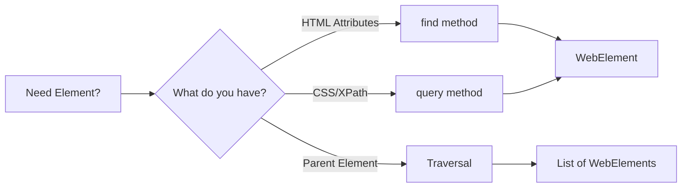
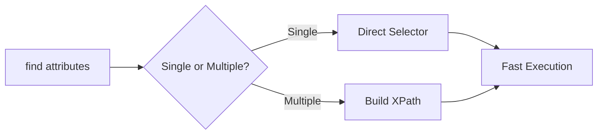
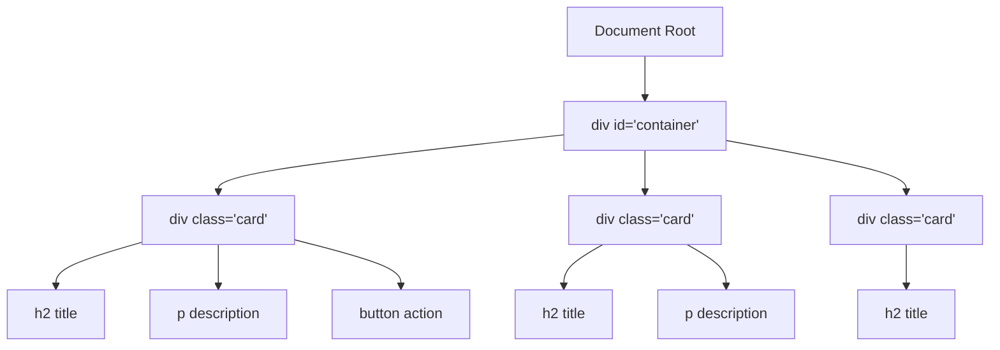
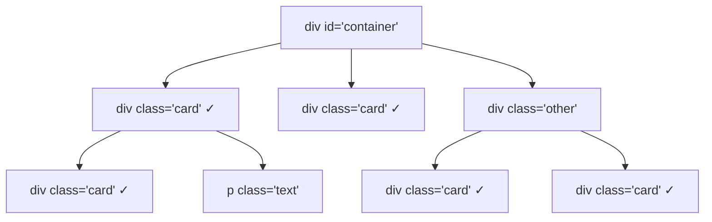
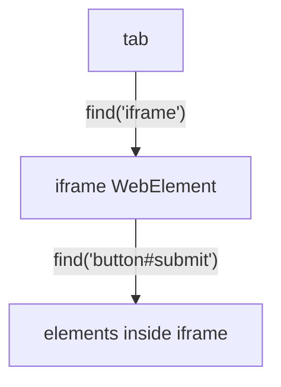
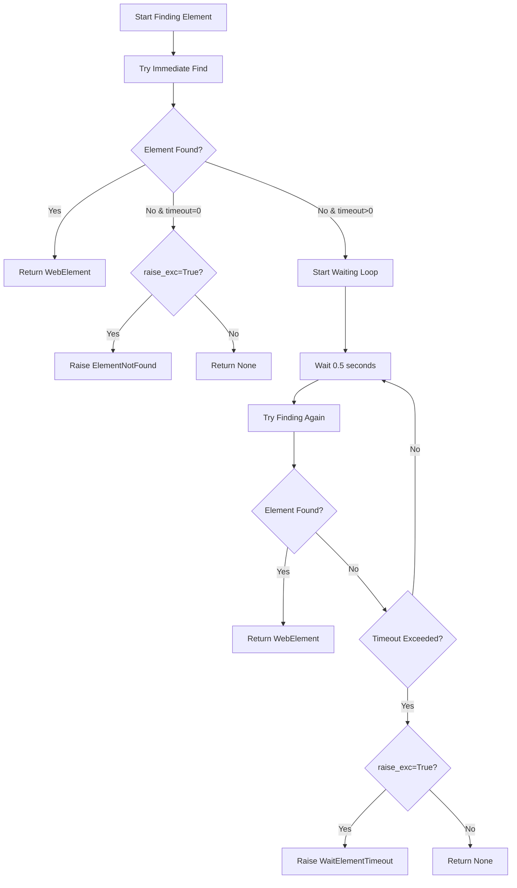

# Element Finding

Finding elements on a web page is the foundation of browser automation. Pydoll introduces a revolutionary, intuitive approach that makes element location both more powerful and easier to use than traditional selector-based methods.

## Why Pydoll's Approach is Different

Traditional browser automation tools force you to think in terms of CSS selectors and XPath expressions from the start. Pydoll inverts this: you describe what you're looking for using natural HTML attributes, and Pydoll figures out the optimal selector strategy.

```python
# Traditional approach (other tools)
element = driver.find_element(By.XPATH, "//input[@type='email' and @name='username']")

# Pydoll's approach
element = await tab.find(tag_name="input", type="email", name="username")
```

Both find the same element, but Pydoll's syntax is clearer, more maintainable, and less error-prone.

### Element Finding Methods Overview

Pydoll offers three main approaches to find elements:

| Method | Use When | Example |
|--------|----------|---------|
| **`find()`** | You know HTML attributes | `await tab.find(id="username")` |
| **`query()`** | You have CSS/XPath selector | `await tab.query("div.content")` |
| **Traversal** | You want to explore from a known element | `await element.get_children_elements()` |



!!! info "Deep Dive: How It Works"
    Curious about how Pydoll implements element finding under the hood? Check out the [FindElements Mixin](../deep-dive/find-elements-mixin.md) documentation to learn about the architecture, performance optimizations, and internal selector strategies.

## The find() Method: Natural Element Selection

The `find()` method is your primary tool for locating elements. It accepts common HTML attributes as parameters and automatically builds the most efficient selector.

### Basic Usage

```python
import asyncio
from pydoll.browser.chromium import Chrome

async def basic_finding():
    async with Chrome() as browser:
        tab = await browser.start()
        await tab.go_to('https://example.com')
        
        # Find by ID (most common and fastest)
        username = await tab.find(id="username")
        
        # Find by class name
        submit_button = await tab.find(class_name="btn-primary")
        
        # Find by tag name
        first_paragraph = await tab.find(tag_name="p")
        
        # Find by name attribute
        email_field = await tab.find(name="email")
        
        # Find by text content
        login_link = await tab.find(text="Login")

asyncio.run(basic_finding())
```

### Combining Attributes for Precision

The real power of `find()` comes from combining multiple attributes to create precise selectors:

```python
import asyncio
from pydoll.browser.chromium import Chrome

async def precise_finding():
    async with Chrome() as browser:
        tab = await browser.start()
        await tab.go_to('https://example.com/form')
        
        # Combine tag name with type
        password_input = await tab.find(tag_name="input", type="password")
        
        # Combine tag, class, and custom attributes
        submit_button = await tab.find(
            tag_name="button",
            class_name="btn",
            type="submit"
        )
        
        # Use data attributes
        product_card = await tab.find(
            tag_name="div",
            data_testid="product-card",
            data_category="electronics"
        )
        
        # Combine multiple conditions
        specific_link = await tab.find(
            tag_name="a",
            class_name="nav-link",
            href="/dashboard"
        )

asyncio.run(precise_finding())
```

!!! info "Combination Logic: AND"
    Combining attributes in `find()` works as an AND operation. The element must match **all** provided attributes.
    
    For more complex scenarios requiring OR logic—like finding an element that may have either an `id` or a different `name`—the correct approach is to chain multiple `find()` calls, as demonstrated in the "Complete Example" section.

!!! tip "Attribute Naming Convention"
    Use underscores for attribute names with hyphens. For example, `data-testid` becomes `data_testid`, and `aria-label` becomes `aria_label`. Pydoll automatically converts them to the correct format.

### How find() Selects the Optimal Strategy

Pydoll automatically chooses the most efficient selector based on the attributes you provide:

| Attributes Provided | Strategy Used | Performance |
|---------------------|---------------|-------------|
| Single: `id` | `By.ID` | ⚡ Fastest |
| Single: `class_name` | `By.CLASS_NAME` | ⚡ Fast |
| Single: `name` | `By.NAME` | ⚡ Fast |
| Single: `tag_name` | `By.TAG_NAME` | ⚡ Fast |
| Single: `text` | `By.XPATH` | ⚡ Fast |
| Multiple attributes | XPath Expression | ✓ Efficient |



### Finding Multiple Elements

Use `find_all=True` to get a list of all matching elements:

```python
import asyncio
from pydoll.browser.chromium import Chrome

async def find_multiple():
    async with Chrome() as browser:
        tab = await browser.start()
        await tab.go_to('https://example.com/products')
        
        # Find all product cards
        products = await tab.find(class_name="product-card", find_all=True)
        print(f"Found {len(products)} products")
        
        # Find all links in navigation
        nav_links = await tab.find(
            tag_name="a",
            class_name="nav-link",
            find_all=True
        )
        
        # Process each element
        for link in nav_links:
            text = await link.text
            href = await link.get_attribute("href")
            print(f"Link: {text} → {href}")

asyncio.run(find_multiple())
```

### Waiting for Dynamic Elements

Modern web applications load content dynamically. Use `timeout` to wait for elements to appear:

```python
import asyncio
from pydoll.browser.chromium import Chrome

async def wait_for_elements():
    async with Chrome() as browser:
        tab = await browser.start()
        await tab.go_to('https://example.com/dashboard')
        
        # Wait up to 10 seconds for element to appear
        dynamic_content = await tab.find(
            class_name="dynamic-content",
            timeout=10
        )
        
        # Wait for AJAX-loaded data
        user_profile = await tab.find(
            id="user-profile",
            timeout=15
        )
        
        # Handle elements that might not appear
        optional_banner = await tab.find(
            class_name="promo-banner",
            timeout=3,
            raise_exc=False  # Returns None if not found
        )
        
        if optional_banner:
            await optional_banner.click()
        else:
            print("No promotional banner present")

asyncio.run(wait_for_elements())
```

!!! warning "Timeout Best Practices"
    Use reasonable timeout values. Too short and you'll miss slow-loading elements; too long and you'll waste time waiting for elements that don't exist. Start with 5-10 seconds for most dynamic content.

## The query() Method: Direct Selector Access

For developers who prefer traditional selectors or need more complex selection logic, the `query()` method provides direct access to CSS selectors and XPath expressions.

### CSS Selectors

CSS selectors are fast, widely understood, and perfect for most use cases:

```python
import asyncio
from pydoll.browser.chromium import Chrome

async def css_selector_examples():
    async with Chrome() as browser:
        tab = await browser.start()
        await tab.go_to('https://example.com')
        
        # Simple selectors
        main_nav = await tab.query("nav.main-menu")
        first_article = await tab.query("article:first-child")
        
        # Attribute selectors
        submit_button = await tab.query("button[type='submit']")
        required_inputs = await tab.query("input[required]", find_all=True)
        
        # Complex selectors
        nested = await tab.query("div.container > .content .item:nth-child(2)")
        
        # Pseudo-classes
        first_enabled_button = await tab.query("button:not([disabled])")

asyncio.run(css_selector_examples())
```

### XPath Expressions

XPath excels at complex relationships and text matching:

```python
import asyncio
from pydoll.browser.chromium import Chrome

async def xpath_examples():
    async with Chrome() as browser:
        tab = await browser.start()
        await tab.go_to('https://example.com/table')
        
        # Text matching
        button = await tab.query("//button[contains(text(), 'Submit')]")
        
        # Navigate to parent
        input_parent = await tab.query("//input[@name='email']/parent::div")
        
        # Find sibling elements
        label_input = await tab.query(
            "//label[text()='Email:']/following-sibling::input"
        )
        
        # Complex table queries
        edit_button = await tab.query(
            "//tr[td[text()='John Doe']]//button[@class='btn-edit']"
        )

asyncio.run(xpath_examples())
```

!!! info "CSS vs XPath: Which to Use?"
    For a comprehensive guide on choosing between CSS selectors and XPath, including syntax references and real-world examples, see the [Selectors Guide](../deep-dive/selectors-guide.md).

## DOM Traversal: Children and Siblings

Sometimes you need to explore the DOM tree from a known starting point. Pydoll provides dedicated methods for traversing element relationships.

### DOM Tree Structure

Understanding the DOM tree structure helps you choose the right traversal method:



### Getting Child Elements

The `get_children_elements()` method retrieves descendants of an element:

```python
import asyncio
from pydoll.browser.chromium import Chrome

async def traverse_children():
    async with Chrome() as browser:
        tab = await browser.start()
        await tab.go_to('https://example.com/cards')
        
        # Get container
        container = await tab.find(id="cards-container")
        
        # Get direct children only (max_depth=1)
        direct_children = await container.get_children_elements(max_depth=1)
        print(f"Container has {len(direct_children)} direct children")
        
        # Include grandchildren (max_depth=2)
        descendants = await container.get_children_elements(max_depth=2)
        print(f"Found {len(descendants)} elements up to 2 levels deep")
        
        # Filter by tag name
        links = await container.get_children_elements(
            max_depth=3,
            tag_filter=["a"]
        )
        print(f"Found {len(links)} links in container")
        
        # Combine filters for specific elements
        nav_links = await container.get_children_elements(
            max_depth=2,
            tag_filter=["a", "button"]
        )

asyncio.run(traverse_children())
```

### Getting Sibling Elements

The `get_siblings_elements()` method finds elements at the same level:

```python
import asyncio
from pydoll.browser.chromium import Chrome

async def traverse_siblings():
    async with Chrome() as browser:
        tab = await browser.start()
        await tab.go_to('https://example.com/list')
        
        # Find active item
        active_item = await tab.find(class_name="item-active")
        
        # Get all siblings (excluding active_item itself)
        all_siblings = await active_item.get_siblings_elements()
        print(f"Active item has {len(all_siblings)} siblings")
        
        # Filter siblings by tag
        link_siblings = await active_item.get_siblings_elements(
            tag_filter=["a"]
        )
        
        # Process sibling elements
        for sibling in all_siblings:
            text = await sibling.text
            print(f"Sibling: {text}")

asyncio.run(traverse_siblings())
```

!!! tip "Performance Considerations"
    DOM traversal can be expensive for large trees. Prefer shallow `max_depth` values and specific `tag_filter` parameters to minimize the number of nodes processed. For deeply nested structures, consider multiple targeted `find()` calls instead of a single deep traversal.

## Finding Elements Within Elements

Once you have an element, you can search within its scope using the same `find()` and `query()` methods.

!!! warning "Important: Search Depth Behavior"
    When you call `element.find()` or `element.query()`, Pydoll searches through **ALL descendants** (children, grandchildren, great-grandchildren, etc.), not just direct children. This is the standard behavior of `querySelector()` and matches what most developers expect.

### Understanding Search Scope



```python
# This finds ALL 5 elements with class='card' in the tree
# (2 direct children + 3 nested descendants)
cards = await container.find(class_name="card", find_all=True)
print(len(cards))  # Output: 5
```

### Basic Scoped Search

```python
import asyncio
from pydoll.browser.chromium import Chrome

async def scoped_search():
    async with Chrome() as browser:
        tab = await browser.start()
        await tab.go_to('https://example.com/products')
        
        # Find a product container
        product_card = await tab.find(class_name="product-card")
        
        # Search within the product card (searches ALL descendants, returns only the first match)
        product_title = await product_card.find(class_name="title")
        product_price = await product_card.find(class_name="price")
        add_button = await product_card.find(tag_name="button", text="Add to Cart")
        
        # Query within scope
        product_image = await product_card.query("img.product-image")
        
        # Find all items within a container (ALL descendants)
        nav_menu = await tab.find(class_name="nav-menu")
        menu_items = await nav_menu.find(tag_name="li", find_all=True)
        
        print(f"Menu has {len(menu_items)} items")

asyncio.run(scoped_search())
```

### Finding Only Direct Children

If you need to find **only direct children** (depth 1), use CSS child combinator `>` or XPath:

```python
import asyncio
from pydoll.browser.chromium import Chrome

async def direct_children_only():
    async with Chrome() as browser:
        tab = await browser.start()
        await tab.go_to('https://example.com/cards')
        
        container = await tab.find(id="cards-container")
        
        # Method 1: CSS child combinator (>)
        # Finds ONLY direct children with class='card'
        direct_cards = await container.query("> .card", find_all=True)
        print(f"Direct children: {len(direct_cards)}")
        
        # Method 2: XPath direct child
        direct_divs = await container.query("./div[@class='card']", find_all=True)
        
        # Method 3: Use get_children_elements() with max_depth=1
        # (but this only filters by tag, not by other attributes)
        direct_children = await container.get_children_elements(
            max_depth=1,
            tag_filter=["div"]
        )
        
        # Then filter manually by class
        cards_only = [
            child for child in direct_children
            if 'card' in (await child.get_attribute('class') or '')
        ]

asyncio.run(direct_children_only())
```

### Comparison: find() vs get_children_elements()

| Feature | `find()` / `query()` | `get_children_elements()` |
|---------|---------------------|---------------------------|
| **Search Depth** | ALL descendants | Configurable with `max_depth` |
| **Filter By** | Any HTML attribute | Only tag name |
| **Use Case** | Find specific elements anywhere in subtree | Explore DOM structure, get direct children |
| **Performance** | Optimized for single attribute | Good for broad exploration |
| **Parameter** | `tag_name="a"` (string) | `tag_filter=["a"]` (list) |

```python
import asyncio
from pydoll.browser.chromium import Chrome

async def comparison_example():
    async with Chrome() as browser:
        tab = await browser.start()
        await tab.go_to('https://example.com')
        
        container = await tab.find(id="container")
        
        # Scenario 1: I want ALL links anywhere in container
        # Use find() - searches all descendants
        all_links = await container.find(tag_name="a", find_all=True)
        
        # Scenario 2: I want ONLY direct child links
        # Use CSS child combinator
        direct_links = await container.query("> a", find_all=True)
        
        # Scenario 3: I want direct children with specific class
        # Use CSS child combinator
        direct_cards = await container.query("> .card", find_all=True)
        
        # Scenario 4: I want to explore the DOM structure
        # Use get_children_elements()
        direct_children = await container.get_children_elements(max_depth=1)
        
        # Scenario 5: I want all descendants up to depth 2, filtered by tag
        # Use get_children_elements()
        shallow_links = await container.get_children_elements(
            max_depth=2,
            tag_filter=["a"]
        )

asyncio.run(comparison_example())
```

!!! tip "When to Use Each Method"
    - **Use `find()`**: When you know the attributes (class, id, etc.) and want to search the entire subtree
    - **Use `query("> .class")`**: When you need only direct children with specific attributes
    - **Use `get_children_elements()`**: When exploring DOM structure or filtering by tag only

### Common Use Cases

This scoped searching is incredibly useful for working with repeating patterns like:

- Product cards in e-commerce sites
- Table rows with multiple cells
- Form sections with multiple fields
- Navigation menus with nested items

```python
import asyncio
from pydoll.browser.chromium import Chrome

async def practical_example():
    async with Chrome() as browser:
        tab = await browser.start()
        await tab.go_to('https://example.com/products')
        
        # Find all product cards on the page
        product_cards = await tab.find(class_name="product-card", find_all=True)
        
        for card in product_cards:
            # Within each card, find ALL descendants with these classes
            title = await card.find(class_name="product-title")
            price = await card.find(class_name="product-price")
            
            # Get the button that's anywhere inside this card
            buy_button = await card.find(tag_name="button", text="Buy Now")
            
            title_text = await title.text
            price_text = await price.text
            
            print(f"Product: {title_text}, Price: {price_text}")
            
            # Click buy button
            await buy_button.click()

asyncio.run(practical_example())
```


## Working with iFrames

!!! info "Complete IFrame Guide Available"
    This section covers basic iframe interaction for element finding. For a comprehensive guide including nested iframes, CAPTCHA handling, technical deep dives, and troubleshooting, see **[Working with IFrames](automation/iframes.md)**.

iFrames present a special challenge in browser automation because they have separate DOM contexts. Pydoll makes iframe interaction seamless:


```python
import asyncio
from pydoll.browser.chromium import Chrome

async def iframe_interaction():
    async with Chrome() as browser:
        tab = await browser.start()
        await tab.go_to('https://example.com/page-with-iframe')

        iframe = await tab.query("iframe.embedded-content", timeout=10)

        # WebElement helpers run inside the iframe automatically
        iframe_button = await iframe.find(tag_name="button", class_name="submit")
        await iframe_button.click()

        iframe_input = await iframe.find(id="captcha-input")
        await iframe_input.type_text("verification-code")

        # Nested iframe? Keep chaining
        inner_iframe = await iframe.find(tag_name="iframe")
        download_link = await inner_iframe.find(text="Download PDF")
        await download_link.click()

asyncio.run(iframe_interaction())
```
!!! note "Screenshots in iframes"
    `tab.take_screenshot()` only works on the top-level target. Capture iframe content by targeting an element inside the frame and calling `element.take_screenshot()`.

## Error Handling Strategies

Robust automation requires handling cases where elements don't exist or take longer to appear than expected.

### Element Finding Flow with Error Handling



### Using raise_exc Parameter

Control whether to raise an exception when elements aren't found:

```python
import asyncio
from pydoll.browser.chromium import Chrome
from pydoll.exceptions import ElementNotFound

async def error_handling():
    async with Chrome() as browser:
        tab = await browser.start()
        await tab.go_to('https://example.com')
        
        # Raise exception if not found (default behavior)
        try:
            critical_element = await tab.find(id="must-exist")
        except ElementNotFound:
            print("Critical element missing! Cannot continue.")
            return
        
        # Return None if not found (optional elements)
        optional_banner = await tab.find(
            class_name="promo-banner",
            raise_exc=False
        )
        
        if optional_banner:
            print("Banner found, closing it")
            close_button = await optional_banner.find(class_name="close-btn")
            await close_button.click()
        else:
            print("No banner present, continuing")

asyncio.run(error_handling())
```

## Best Practices

### 1. Prefer Stable Selectors

Use attributes that are unlikely to change:

```python
# Good: Semantic attributes
await tab.find(id="user-profile")  # IDs are usually stable
await tab.find(data_testid="submit-button")  # Test IDs are designed for automation
await tab.find(name="username")  # Form names are stable

# Avoid: Structural dependencies
await tab.query("div > div > div:nth-child(3) > input")  # Brittle, breaks easily
```

### 2. Use the Simplest Selector That Works

Start simple and add complexity only when needed:

```python
# Good: Simple and clear
await tab.find(id="login-form")

# Unnecessary: Over-complicated
await tab.query("//div[@id='content']/descendant::form[@id='login-form']")
```

### 3. Choose the Right Method

- Use `find()` for simple attribute-based searches
- Use `query()` for complex CSS or XPath patterns
- Use traversal methods for exploring from known anchors

```python
# Use find() for straightforward cases
username = await tab.find(id="username")

# Use query() for complex patterns
active_nav_link = await tab.query("nav.menu a.active")

# Use traversal for relationship-based searches
container = await tab.find(id="cards")
child_links = await container.get_children_elements(tag_filter=["a"])
```

### 4. Add Meaningful Timeouts

Don't use zero timeouts for dynamic content, and don't wait forever for optional elements:

```python
# Good: Reasonable timeouts
critical_data = await tab.find(id="data", timeout=10)
optional_popup = await tab.find(class_name="popup", timeout=2, raise_exc=False)

# Bad: No timeout for dynamic content
dynamic_element = await tab.find(class_name="ajax-loaded")  # Will fail immediately

# Bad: Very long timeout for optional element
banner = await tab.find(class_name="ad-banner", timeout=60)  # Wastes time
```

### 5. Handle Errors Gracefully

Plan for elements that might not exist:

```python
# Critical elements: let exceptions bubble up
submit_button = await tab.find(id="submit-btn")

# Optional elements: handle explicitly
cookie_notice = await tab.find(class_name="cookie-notice", raise_exc=False)
if cookie_notice:
    accept_button = await cookie_notice.find(text="Accept")
    await accept_button.click()
```

## Complete Example: Form Automation

Here's a complete example combining multiple element finding techniques:

```python
import asyncio
from pydoll.browser.chromium import Chrome
from pydoll.exceptions import ElementNotFound

async def automate_registration_form():
    async with Chrome() as browser:
        tab = await browser.start()
        
        try:
            # Navigate to registration page
            await tab.go_to('https://example.com/register', timeout=10)
            
            # Handle optional cookie banner
            cookie_banner = await tab.find(
                class_name="cookie-banner",
                timeout=2,
                raise_exc=False
            )
            if cookie_banner:
                accept = await cookie_banner.find(text="Accept")
                await accept.click()
                await asyncio.sleep(1)
            
            # Fill out the registration form
            # Find form fields
            username_field = await tab.find(name="username", timeout=5)
            email_field = await tab.find(name="email")
            password_field = await tab.find(type="password", name="password")
            confirm_password = await tab.find(type="password", name="confirm_password")
            
            # Enter information
            await username_field.type_text("john_doe_2024", interval=0.1)
            await email_field.type_text("john@example.com", interval=0.1)
            await password_field.type_text("SecurePass123!", interval=0.1)
            await confirm_password.type_text("SecurePass123!", interval=0.1)
            
            # Find and check terms checkbox
            # Try multiple strategies
            terms_checkbox = await tab.find(id="terms", raise_exc=False)
            if not terms_checkbox:
                terms_checkbox = await tab.find(name="accept_terms", raise_exc=False)
            if not terms_checkbox:
                terms_checkbox = await tab.query("input[type='checkbox']")
            
            await terms_checkbox.click()
            
            # Find and click submit button
            submit_button = await tab.find(
                tag_name="button",
                type="submit",
                timeout=2
            )
            await submit_button.click()
            
            # Wait for success message with longer timeout (form processing)
            success_message = await tab.find(
                class_name="success-message",
                timeout=15
            )
            
            message_text = await success_message.text
            print(f"Registration successful: {message_text}")
            
            # Verify redirect to dashboard
            await asyncio.sleep(2)
            current_url = await tab.current_url
            
            if "dashboard" in current_url:
                print("Successfully redirected to dashboard")
                
                # Find welcome message
                welcome = await tab.find(class_name="welcome-message", timeout=5)
                welcome_text = await welcome.text
                print(f"Welcome message: {welcome_text}")
            else:
                print(f"Unexpected URL after registration: {current_url}")
                
        except ElementNotFound as e:
            print(f"Element not found: {e}")
            # Take screenshot for debugging
            await tab.take_screenshot("error_screenshot.png")
        except Exception as e:
            print(f"Unexpected error: {e}")
            await tab.take_screenshot("unexpected_error.png")

asyncio.run(automate_registration_form())
```

## Learn More

Want to dive deeper into element finding?

- **[FindElements Mixin Deep Dive](../deep-dive/find-elements-mixin.md)**: Learn about the architecture, internal selector strategies, and performance optimizations
- **[Selectors Guide](../deep-dive/selectors-guide.md)**: Comprehensive guide to CSS selectors and XPath with syntax references and real-world examples
- **[WebElement Domain](../deep-dive/webelement-domain.md)**: Understand what you can do with elements once you've found them

Element finding is the foundation of successful browser automation. Master these techniques, and you'll be able to reliably locate any element on any web page, no matter how complex the structure.
