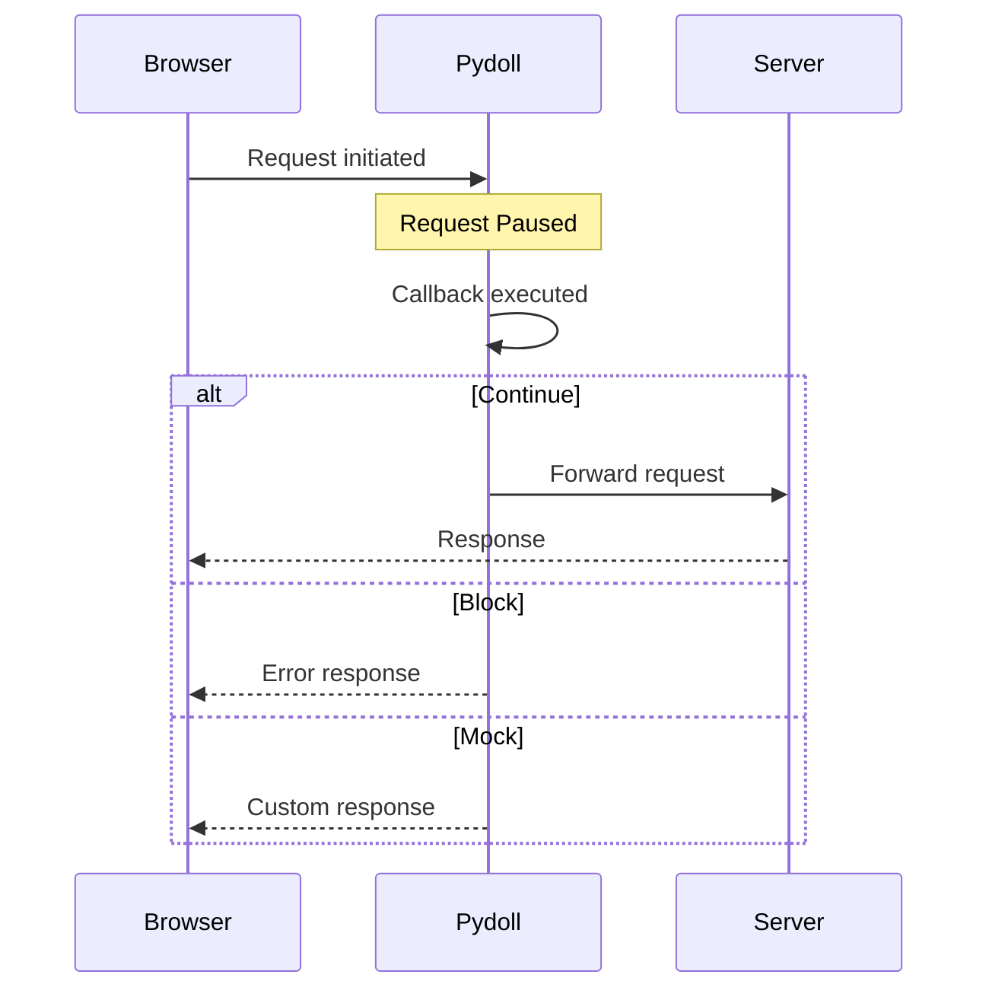

# Request Interception

Request interception allows you to intercept, modify, block, or mock HTTP requests and responses in real-time. This is essential for testing, performance optimization, content filtering, and simulating various network conditions.

!!! info "Network vs Fetch Domain"
    **Network domain** is for passive monitoring (observing traffic). **Fetch domain** is for active interception (modifying/blocking requests). This guide focuses on interception. For passive monitoring, see [Network Monitoring](monitoring.md).

## Understanding Request Interception

When you enable request interception, Pydoll pauses matching requests before they're sent to the server (or after receiving the response). You then have three options:

1. **Continue**: Let the request proceed (optionally with modifications)
2. **Block**: Fail the request with an error
3. **Mock**: Fulfill the request with a custom response



!!! warning "Performance Impact"
    Request interception adds latency to every matching request. Only intercept what you need and disable when done to avoid slowing down page loads.

## Enabling Request Interception

Before intercepting requests, you must enable the Fetch domain:

```python
import asyncio
from pydoll.browser.chromium import Chrome

async def main():
    async with Chrome() as browser:
        tab = await browser.start()
        
        # Enable fetch events (intercepts all requests by default)
        await tab.enable_fetch_events()
        
        await tab.go_to('https://example.com')
        
        # Disable when done
        await tab.disable_fetch_events()

asyncio.run(main())
```

### Selective Interception

You can filter which requests to intercept by resource type:

```python
import asyncio
from pydoll.browser.chromium import Chrome

async def selective_interception():
    async with Chrome() as browser:
        tab = await browser.start()
        
        # Only intercept images and stylesheets
        await tab.enable_fetch_events(
            resource_type='Image'  # Or 'Stylesheet', 'Script', etc.
        )
        
        await tab.go_to('https://example.com')
        await tab.disable_fetch_events()

asyncio.run(selective_interception())
```

!!! tip "Resource Types"
    See the [Resource Types Reference](#resource-types-reference) section for a complete list of interceptable resource types.

## Intercepting Requests

Use the `RequestPaused` event to intercept requests:

```python
import asyncio
from pydoll.browser.chromium import Chrome
from pydoll.protocol.fetch.events import FetchEvent, RequestPausedEvent

async def basic_interception():
    async with Chrome() as browser:
        tab = await browser.start()
        
        # Callback with type hint for IDE support
        async def handle_request(event: RequestPausedEvent):
            request_id = event['params']['requestId']
            url = event['params']['request']['url']
            
            print(f"Intercepted: {url}")
            
            # Continue the request without modifications
            await tab.continue_request(request_id)
        
        await tab.enable_fetch_events()
        await tab.on(FetchEvent.REQUEST_PAUSED, handle_request)
        
        await tab.go_to('https://example.com')
        await asyncio.sleep(3)
        
        await tab.disable_fetch_events()

asyncio.run(basic_interception())
```

!!! info "Type Hints for Better IDE Support"
    Use type hints like `RequestPausedEvent` to get autocomplete for event keys. All event types are in `pydoll.protocol.fetch.events`.

!!! note "Production-Ready Waiting"
    The examples in this guide use `asyncio.sleep()` for simplicity. In production code, consider using more explicit waiting strategies like waiting for specific elements or implementing network idle detection. See the [Network Monitoring](monitoring.md) guide for advanced techniques.

## Common Use Cases

### 1. Blocking Resources to Save Bandwidth

Block images, stylesheets, or other resources to speed up page loads:

```python
import asyncio
from pydoll.browser.chromium import Chrome
from pydoll.protocol.fetch.events import FetchEvent, RequestPausedEvent
from pydoll.protocol.network.types import ErrorReason

async def block_images():
    async with Chrome() as browser:
        tab = await browser.start()
        
        blocked_count = 0
        
        async def block_resource(event: RequestPausedEvent):
            nonlocal blocked_count
            request_id = event['params']['requestId']
            resource_type = event['params']['resourceType']
            url = event['params']['request']['url']
            
            # Block images and stylesheets
            if resource_type in ['Image', 'Stylesheet']:
                blocked_count += 1
                print(f"🚫 Blocked {resource_type}: {url[:60]}")
                await tab.fail_request(request_id, ErrorReason.BLOCKED_BY_CLIENT)
            else:
                # Continue other requests
                await tab.continue_request(request_id)
        
        await tab.enable_fetch_events()
        await tab.on(FetchEvent.REQUEST_PAUSED, block_resource)
        
        await tab.go_to('https://example.com')
        await asyncio.sleep(3)
        
        print(f"\n📊 Total blocked: {blocked_count} resources")
        
        await tab.disable_fetch_events()

asyncio.run(block_images())
```

### 2. Modifying Request Headers

Add, modify, or remove headers before requests are sent:

```python
import asyncio
from pydoll.browser.chromium import Chrome
from pydoll.protocol.fetch.events import FetchEvent, RequestPausedEvent
from pydoll.protocol.fetch.types import HeaderEntry

async def modify_headers():
    async with Chrome() as browser:
        tab = await browser.start()
        
        async def add_custom_headers(event: RequestPausedEvent):
            request_id = event['params']['requestId']
            url = event['params']['request']['url']
            
            # Only modify API requests
            if '/api/' in url:
                # Build custom headers (using HeaderEntry type hint for IDE support)
                headers: list[HeaderEntry] = [
                    {'name': 'X-Custom-Header', 'value': 'MyValue'},
                    {'name': 'Authorization', 'value': 'Bearer my-token-123'},
                ]
                
                print(f"✨ Modified headers for: {url}")
                await tab.continue_request(request_id, headers=headers)
            else:
                await tab.continue_request(request_id)
        
        await tab.enable_fetch_events()
        await tab.on(FetchEvent.REQUEST_PAUSED, add_custom_headers)
        
        await tab.go_to('https://your-app.com')
        await asyncio.sleep(3)
        
        await tab.disable_fetch_events()

asyncio.run(modify_headers())
```

!!! tip "Type Hints for Headers"
    `HeaderEntry` is a `TypedDict` from `pydoll.protocol.fetch.types`. Using it as a type hint gives you IDE autocomplete for `name` and `value` keys. You can also use plain dictionaries without the type hint.

!!! tip "Header Management"
    When you provide custom headers, they **replace** all existing headers. Make sure to include necessary headers like `User-Agent`, `Accept`, etc., if needed.

### 3. Mocking API Responses

Replace real API responses with custom mock data:

```python
import asyncio
import json
import base64
from pydoll.browser.chromium import Chrome
from pydoll.protocol.fetch.events import FetchEvent, RequestPausedEvent
from pydoll.protocol.fetch.types import HeaderEntry

async def mock_api_responses():
    async with Chrome() as browser:
        tab = await browser.start()
        
        async def mock_response(event: RequestPausedEvent):
            request_id = event['params']['requestId']
            url = event['params']['request']['url']
            
            # Mock specific API endpoint
            if '/api/users' in url:
                # Create mock response data
                mock_data = {
                    'users': [
                        {'id': 1, 'name': 'Mock User 1'},
                        {'id': 2, 'name': 'Mock User 2'},
                    ],
                    'total': 2
                }
                
                # Convert to JSON and base64-encode
                body_json = json.dumps(mock_data)
                body_base64 = base64.b64encode(body_json.encode()).decode()
                
                # Response headers
                headers: list[HeaderEntry] = [
                    {'name': 'Content-Type', 'value': 'application/json'},
                    {'name': 'Access-Control-Allow-Origin', 'value': '*'},
                ]
                
                print(f"🎭 Mocked response for: {url}")
                await tab.fulfill_request(
                    request_id=request_id,
                    response_code=200,
                    response_headers=headers,
                    body=body_base64,
                    response_phrase='OK'
                )
            else:
                # Continue other requests normally
                await tab.continue_request(request_id)
        
        await tab.enable_fetch_events()
        await tab.on(FetchEvent.REQUEST_PAUSED, mock_response)
        
        await tab.go_to('https://your-app.com')
        await asyncio.sleep(3)
        
        await tab.disable_fetch_events()

asyncio.run(mock_api_responses())
```

!!! warning "Base64 Encoding Required"
    The `body` parameter in `fulfill_request()` must be base64-encoded. Use Python's `base64` module to encode your response data.

### 4. Modifying Request URLs

Redirect requests to different URLs:

```python
import asyncio
from pydoll.browser.chromium import Chrome
from pydoll.protocol.fetch.events import FetchEvent, RequestPausedEvent

async def redirect_requests():
    async with Chrome() as browser:
        tab = await browser.start()
        
        async def redirect_url(event: RequestPausedEvent):
            request_id = event['params']['requestId']
            original_url = event['params']['request']['url']
            
            # Redirect CDN requests to local server
            if 'cdn.example.com' in original_url:
                new_url = original_url.replace(
                    'cdn.example.com',
                    'localhost:8080'
                )
                print(f"🔀 Redirected: {original_url} → {new_url}")
                await tab.continue_request(request_id, url=new_url)
            else:
                await tab.continue_request(request_id)
        
        await tab.enable_fetch_events()
        await tab.on(FetchEvent.REQUEST_PAUSED, redirect_url)
        
        await tab.go_to('https://example.com')
        await asyncio.sleep(3)
        
        await tab.disable_fetch_events()

asyncio.run(redirect_requests())
```

### 5. Modifying Request Body

Modify POST data before sending:

```python
import asyncio
import base64
from pydoll.browser.chromium import Chrome
from pydoll.protocol.fetch.events import FetchEvent, RequestPausedEvent

async def modify_post_data():
    async with Chrome() as browser:
        tab = await browser.start()
        
        async def modify_body(event: RequestPausedEvent):
            request_id = event['params']['requestId']
            method = event['params']['request']['method']
            url = event['params']['request']['url']
            
            # Modify POST requests
            if method == 'POST' and '/api/submit' in url:
                # Create new POST data
                new_data = '{"modified": true, "timestamp": 123456789}'
                post_data_base64 = base64.b64encode(new_data.encode()).decode()
                
                print(f"✏️  Modified POST data for: {url}")
                await tab.continue_request(
                    request_id,
                    post_data=post_data_base64
                )
            else:
                await tab.continue_request(request_id)
        
        await tab.enable_fetch_events()
        await tab.on(FetchEvent.REQUEST_PAUSED, modify_body)
        
        await tab.go_to('https://your-app.com/form')
        await asyncio.sleep(3)
        
        await tab.disable_fetch_events()

asyncio.run(modify_post_data())
```

### 6. Handling Authentication Challenges

Manually respond to HTTP authentication challenges (Basic Auth, Digest Auth, etc.):

```python
import asyncio
from pydoll.browser.chromium import Chrome
from pydoll.protocol.fetch.events import FetchEvent, AuthRequiredEvent
from pydoll.protocol.fetch.types import AuthChallengeResponseType

async def handle_auth():
    async with Chrome() as browser:
        tab = await browser.start()
        
        async def respond_to_auth(event: AuthRequiredEvent):
            request_id = event['params']['requestId']
            auth_challenge = event['params']['authChallenge']
            
            print(f"🔐 Auth challenge from: {auth_challenge['origin']}")
            print(f"   Scheme: {auth_challenge['scheme']}")
            print(f"   Realm: {auth_challenge.get('realm', 'N/A')}")
            
            # Provide credentials for the authentication challenge
            await tab.continue_with_auth(
                request_id=request_id,
                auth_challenge_response=AuthChallengeResponseType.PROVIDE_CREDENTIALS,
                proxy_username='myuser',
                proxy_password='mypassword'
            )
        
        # Enable with auth handling
        await tab.enable_fetch_events(handle_auth=True)
        await tab.on(FetchEvent.AUTH_REQUIRED, respond_to_auth)
        
        await tab.go_to('https://httpbin.org/basic-auth/myuser/mypassword')
        await asyncio.sleep(3)
        
        await tab.disable_fetch_events()

asyncio.run(handle_auth())
```

!!! note "Automatic Proxy Authentication"
    **Pydoll automatically handles proxy authentication** (407 Proxy Authentication Required) when you configure proxy credentials via browser options. This example demonstrates **manual handling** of authentication challenges, which is useful for:
    
    - HTTP Basic/Digest Authentication from servers (401 Unauthorized)
    - Custom authentication flows
    - Dynamic credential selection based on the challenge
    - Testing authentication failure scenarios
    
    For standard proxy usage, simply configure your proxy credentials in browser options - no manual handling needed!

### 7. Simulating Network Errors

Test how your application handles network failures:

```python
import asyncio
from pydoll.browser.chromium import Chrome
from pydoll.protocol.fetch.events import FetchEvent, RequestPausedEvent
from pydoll.protocol.network.types import ErrorReason

async def simulate_errors():
    async with Chrome() as browser:
        tab = await browser.start()
        
        request_count = 0
        
        async def fail_some_requests(event: RequestPausedEvent):
            nonlocal request_count
            request_id = event['params']['requestId']
            url = event['params']['request']['url']
            
            request_count += 1
            
            # Fail every 3rd request
            if request_count % 3 == 0:
                print(f"❌ Simulating timeout for: {url[:60]}")
                await tab.fail_request(request_id, ErrorReason.TIMED_OUT)
            else:
                await tab.continue_request(request_id)
        
        await tab.enable_fetch_events()
        await tab.on(FetchEvent.REQUEST_PAUSED, fail_some_requests)
        
        await tab.go_to('https://example.com')
        await asyncio.sleep(3)
        
        await tab.disable_fetch_events()

asyncio.run(simulate_errors())
```

## Request Stages

You can intercept requests at different stages:

```python
import asyncio
from pydoll.browser.chromium import Chrome
from pydoll.protocol.fetch.types import RequestStage

async def intercept_responses():
    async with Chrome() as browser:
        tab = await browser.start()
        
        # Intercept responses instead of requests
        await tab.enable_fetch_events(request_stage=RequestStage.RESPONSE)
        
        # Now you can modify responses before they reach the page
        await tab.go_to('https://example.com')
        await asyncio.sleep(3)
        
        await tab.disable_fetch_events()

asyncio.run(intercept_responses())
```

| Stage | When Intercepted | Use Cases |
|-------|------------------|-----------|
| `Request` (default) | Before request is sent | Modify headers, block requests, change URL |
| `Response` | After response received | Modify response body, change status codes |

!!! tip "Response Interception"
    When intercepting responses, you can use `intercept_response=True` in `continue_request()` to also intercept the response for that specific request.

## Resource Types Reference

| Resource Type | Description | Common File Extensions |
|---------------|-------------|------------------------|
| `Document` | HTML documents | `.html` |
| `Stylesheet` | CSS files | `.css` |
| `Image` | Image resources | `.jpg`, `.png`, `.gif`, `.webp`, `.svg` |
| `Media` | Audio/video | `.mp4`, `.webm`, `.mp3`, `.ogg` |
| `Font` | Web fonts | `.woff`, `.woff2`, `.ttf`, `.otf` |
| `Script` | JavaScript | `.js` |
| `TextTrack` | Subtitles | `.vtt`, `.srt` |
| `XHR` | XMLHttpRequest | AJAX requests |
| `Fetch` | Fetch API | Modern API calls |
| `EventSource` | Server-Sent Events | Real-time streams |
| `WebSocket` | WebSocket | Bidirectional communication |
| `Manifest` | Web app manifest | PWA configuration |
| `Other` | Other types | Miscellaneous |

## Error Reasons Reference

Use these with `fail_request()` to simulate different network failures:

| Error Reason | Description | Use Case |
|--------------|-------------|----------|
| `FAILED` | Generic failure | General error |
| `ABORTED` | Request aborted | User cancelled |
| `TIMED_OUT` | Request timeout | Network timeout |
| `ACCESS_DENIED` | Access denied | Permission error |
| `CONNECTION_CLOSED` | Connection closed | Server disconnect |
| `CONNECTION_RESET` | Connection reset | Network reset |
| `CONNECTION_REFUSED` | Connection refused | Server unreachable |
| `NAME_NOT_RESOLVED` | DNS failure | Invalid hostname |
| `INTERNET_DISCONNECTED` | No internet | Offline mode |
| `BLOCKED_BY_CLIENT` | Client blocked | Ad blocker simulation |
| `BLOCKED_BY_RESPONSE` | Response blocked | CORS/CSP violation |

## Best Practices

### 1. Always Continue or Fail Requests

```python
# Good: Every paused request is handled
async def handle_request(event: RequestPausedEvent):
    request_id = event['params']['requestId']
    try:
        # Your logic here
        await tab.continue_request(request_id)
    except Exception as e:
        # Fail on error to prevent hanging
        await tab.fail_request(request_id, ErrorReason.FAILED)

# Bad: Request might hang if callback raises exception
async def handle_request(event: RequestPausedEvent):
    request_id = event['params']['requestId']
    # If this raises, request hangs forever
    await tab.continue_request(request_id)
```

### 2. Use Selective Interception

```python
# Good: Only intercept what you need
await tab.enable_fetch_events(resource_type='Image')

# Bad: Intercepts everything, slows down all requests
await tab.enable_fetch_events()
```

### 3. Disable When Done

```python
# Good: Clean up after yourself
await tab.enable_fetch_events()
# ... do work ...
await tab.disable_fetch_events()

# Bad: Leaves interception enabled
await tab.enable_fetch_events()
# ... do work ...
# (never disabled)
```

### 4. Handle Errors Gracefully

```python
# Good: Wrap in try/except
async def safe_handler(event: RequestPausedEvent):
    request_id = event['params']['requestId']
    try:
        # Complex logic that might fail
        modified_url = transform_url(event['params']['request']['url'])
        await tab.continue_request(request_id, url=modified_url)
    except Exception as e:
        print(f"Error handling request: {e}")
        # Continue without modifications on error
        await tab.continue_request(request_id)
```

## Complete Example: Advanced Request Control

Here's a complete example combining multiple interception techniques:

```python
import asyncio
import base64
import json
from pydoll.browser.chromium import Chrome
from pydoll.protocol.fetch.events import FetchEvent, RequestPausedEvent
from pydoll.protocol.fetch.types import HeaderEntry
from pydoll.protocol.network.types import ErrorReason

async def advanced_interception():
    async with Chrome() as browser:
        tab = await browser.start()
        
        stats = {
            'blocked': 0,
            'mocked': 0,
            'modified': 0,
            'continued': 0
        }
        
        async def intelligent_handler(event: RequestPausedEvent):
            request_id = event['params']['requestId']
            url = event['params']['request']['url']
            resource_type = event['params']['resourceType']
            method = event['params']['request']['method']
            
            try:
                # Block ads and trackers
                if any(tracker in url for tracker in ['analytics', 'ads', 'tracking']):
                    stats['blocked'] += 1
                    print(f"🚫 Blocked tracker: {url[:50]}")
                    await tab.fail_request(request_id, ErrorReason.BLOCKED_BY_CLIENT)
                
                # Mock API responses
                elif '/api/config' in url:
                    stats['mocked'] += 1
                    mock_config = {'feature_x': True, 'debug_mode': False}
                    body = base64.b64encode(json.dumps(mock_config).encode()).decode()
                    headers: list[HeaderEntry] = [
                        {'name': 'Content-Type', 'value': 'application/json'},
                    ]
                    print(f"🎭 Mocked config API")
                    await tab.fulfill_request(
                        request_id, 200, headers, body, 'OK'
                    )
                
                # Add auth headers to API requests
                elif '/api/' in url and method == 'GET':
                    stats['modified'] += 1
                    headers: list[HeaderEntry] = [
                        {'name': 'Authorization', 'value': 'Bearer token-123'},
                    ]
                    print(f"✨ Added auth to: {url[:50]}")
                    await tab.continue_request(request_id, headers=headers)
                
                # Continue everything else normally
                else:
                    stats['continued'] += 1
                    await tab.continue_request(request_id)
                    
            except Exception as e:
                print(f"⚠️  Error handling request: {e}")
                # Always continue on error to prevent hanging
                await tab.continue_request(request_id)
        
        # Enable interception
        await tab.enable_fetch_events()
        await tab.on(FetchEvent.REQUEST_PAUSED, intelligent_handler)
        
        # Navigate
        await tab.go_to('https://example.com')
        await asyncio.sleep(5)
        
        # Print stats
        print(f"\n📊 Interception Statistics:")
        print(f"   Blocked: {stats['blocked']}")
        print(f"   Mocked: {stats['mocked']}")
        print(f"   Modified: {stats['modified']}")
        print(f"   Continued: {stats['continued']}")
        print(f"   Total: {sum(stats.values())}")
        
        # Cleanup
        await tab.disable_fetch_events()

asyncio.run(advanced_interception())
```

## See Also

- **[Network Monitoring](monitoring.md)** - Passive network traffic observation
- **[CDP Fetch Domain](../../deep-dive/network-capabilities.md#fetch-domain)** - Deep dive into the Fetch domain
- **[Event System](../advanced/event-system.md)** - Understanding Pydoll's event architecture

Request interception is a powerful tool for testing, optimization, and mocking. Master these techniques to build robust, efficient browser automation scripts.
