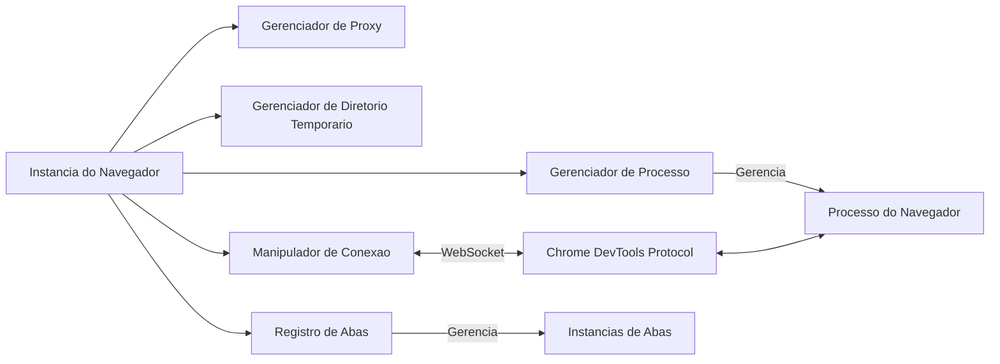
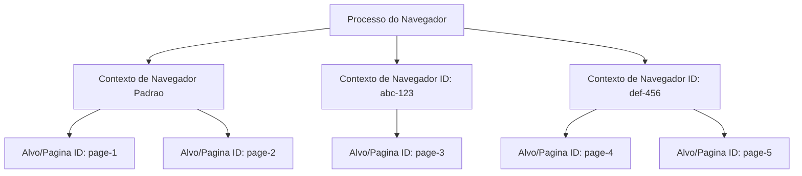

# Arquitetura do Domínio do Navegador

O domínio do Navegador (Browser) representa o nível mais alto da hierarquia de automação do Pydoll, gerenciando o ciclo de vida do processo do navegador, conexões CDP, isolamento de contexto e operações globais do navegador. Este documento explora a arquitetura interna, as decisões de design e a implementação técnica do controle em nível de navegador.

!!! info "Guia de Uso Prático"
    Para exemplos práticos e padrões de uso, consulte os guias [Gerenciamento do Navegador](../features/browser-management/tabs.md) e [Contextos do Navegador](../features/browser-management/contexts.md).

## Visão Geral da Arquitetura

O domínio do Navegador situa-se na interseção do gerenciamento de processos, comunicação de protocolo e coordenação de recursos. Ele orquestra múltiplos componentes especializados para fornecer uma interface unificada para a automação do navegador:



### Hierarquia e Abstração

O domínio do Navegador é implementado como uma **classe base abstrata** (abstract base class) que define o contrato para todas as implementações de navegador:

```python
class Browser(ABC):
    """Classe base abstrata para automação de navegador via CDP."""
    
    @abstractmethod
    def _get_default_binary_location(self) -> str:
        """Subclasses devem fornecer o caminho do executável específico do navegador."""
        pass
    
    async def start(self, headless: bool = False) -> Tab:
        """Implementação concreta compartilhada por todos os navegadores."""
        # 1. Resolver localização do binário
        # 2. Configurar diretório de dados do usuário
        # 3. Iniciar processo do navegador
        # 4. Verificar conexão CDP
        # 5. Configurar proxy (se necessário)
        # 6. Retornar aba inicial
```

Este design permite **polimorfismo** - Chrome, Edge e outros navegadores baseados em Chromium compartilham 99% de seu código, diferindo apenas nos caminhos dos executáveis e pequenas variações de flags.

## Arquitetura de Componentes

A classe Browser coordena vários gerenciadores especializados, cada um responsável por um aspecto específico da automação do navegador. Entender esses componentes é fundamental para entender o design do Pydoll.

### Manipulador de Conexão (Connection Handler)

O ConnectionHandler é a **ponte de comunicação** entre o Pydoll e o processo do navegador. Ele gerencia:

- **Ciclo de vida do WebSocket**: Estabelecimento da conexão, keep-alive, reconexão
- **Execução de comandos**: Envio de comandos CDP e aguardo de respostas
- **Despacho de eventos**: Roteamento de eventos CDP para callbacks registrados
- **Registro de callbacks**: Manutenção de ouvintes de eventos por conexão

```python
class Browser:
    def __init__(self, ...):
        # ConnectionHandler é inicializado com a porta ou endereço WebSocket
        self._connection_handler = ConnectionHandler(self._connection_port)
    
    async def _execute_command(self, command, timeout=10):
        """Todos os comandos CDP fluem através do manipulador de conexão."""
        return await self._connection_handler.execute_command(command, timeout)
```

!!! info "Análise Profunda da Camada de Conexão"
    Para informações detalhadas sobre comunicação WebSocket, fluxo de comando/resposta e padrões assíncronos, consulte [Arquitetura da Camada de Conexão](./connection-layer.md).

### Gerenciador de Processo (Process Manager)

O BrowserProcessManager lida com o **ciclo de vida do processo do sistema operacional**:

```python
class BrowserProcessManager:
    def start_browser_process(self, binary, port, arguments):
        """
        1. Constrói a linha de comando com caminho do binário + argumentos
        2. Inicia o subprocesso com manipulação adequada de stdio
        3. Monitora a inicialização do processo
        4. Armazena o handle do processo para terminação posterior
        """
        
    def stop_process(self):
        """
        1. Tenta terminação graciosa (SIGTERM)
        2. Aguarda a saída do processo
        3. Mata forçadamente se o tempo limite for excedido (SIGKILL)
        4. Limpa os recursos do processo
        """
```

**Por que separar o gerenciamento de processos?**

- **Testabilidade**: O gerenciador de processos pode ser mockado para testes unitários
- **Multiplataforma**: Encapsula o manuseio de processos específico do SO
- **Confiabilidade**: Lida com casos extremos como processos zumbis, filhos órfãos

### Registro de Abas (Tab Registry)

O Navegador mantém um **registro de instâncias de Abas** (Tab) para garantir o comportamento singleton por alvo (target):

```python
class Browser:
    def __init__(self, ...):
        self._tabs_opened: dict[str, Tab] = {}
    
    async def new_tab(self, url='', browser_context_id=None) -> Tab:
        # Criar alvo via CDP
        response = await self._execute_command(
            TargetCommands.create_target(browser_context_id=browser_context_id)
        )
        target_id = response['result']['targetId']
        
        # Verificar se a aba já existe no registro
        if target_id in self._tabs_opened:
            return self._tabs_opened[target_id]
        
        # Criar nova instância de Aba e registrá-la
        tab = Tab(self, target_id=target_id, ...)
        self._tabs_opened[target_id] = tab
        return tab
```

**Por que instâncias de Aba singleton?**

- **Consistência de estado**: Múltiplas referências à mesma aba compartilham estado (domínios habilitados, callbacks)
- **Eficiência de memória**: Evita instâncias duplicadas de Aba para o mesmo alvo
- **Roteamento de eventos**: Garante que os eventos sejam roteados para a instância de Aba correta

### Arquitetura de Autenticação de Proxy

O Pydoll implementa **autenticação automática de proxy** através do domínio Fetch para evitar a exposição de credenciais em comandos CDP. A implementação usa **dois mecanismos distintos** dependendo do escopo do proxy:

#### Mecanismo 1: Autenticação de Proxy em Nível de Navegador (Proxy Global)

Quando um proxy é configurado via `ChromiumOptions` (aplica-se a todas as abas no contexto padrão):

```python
# Em Browser.start() -> _configure_proxy()
async def _configure_proxy(self, private_proxy, proxy_credentials):
    # Habilitar Fetch EM NÍVEL DE NAVEGADOR
    await self.enable_fetch_events(handle_auth_requests=True)
    
    # Registrar callbacks EM NÍVEL DE NAVEGADOR (afeta TODAS as abas)
    await self.on(FetchEvent.REQUEST_PAUSED, self._continue_request_callback, temporary=True)
    await self.on(FetchEvent.AUTH_REQUIRED, 
                  partial(self._continue_request_with_auth_callback,
                          proxy_username=credentials[0],
                          proxy_password=credentials[1]),
                  temporary=True)
```

**Escopo:** Conexão WebSocket em nível de navegador → afeta **todas as abas no contexto padrão**

#### Mecanismo 2: Autenticação de Proxy em Nível de Aba (Proxy por Contexto)

Quando um proxy é configurado por contexto via `create_browser_context(proxy_server=...)`:

```python
# Armazenar credenciais por contexto
async def create_browser_context(self, proxy_server, ...):
    sanitized_proxy, extracted_auth = self._sanitize_proxy_and_extract_auth(proxy_server)
    
    response = await self._execute_command(
        TargetCommands.create_browser_context(proxy_server=sanitized_proxy)
    )
    context_id = response['result']['browserContextId']
    
    if extracted_auth:
        self._context_proxy_auth[context_id] = extracted_auth  # Armazena por contexto
    
    return context_id

# Configurar autenticação para CADA aba nesse contexto
async def _setup_context_proxy_auth_for_tab(self, tab, browser_context_id):
    creds = self._context_proxy_auth.get(browser_context_id)
    if not creds:
        return
    
    # Habilitar Fetch NA ABA (WebSocket em nível de aba)
    await tab.enable_fetch_events(handle_auth=True)
    
    # Registrar callbacks NA ABA (afeta apenas esta aba)
    await tab.on(FetchEvent.REQUEST_PAUSED, 
                 partial(self._tab_continue_request_callback, tab=tab), 
                 temporary=True)
    await tab.on(FetchEvent.AUTH_REQUIRED,
                 partial(self._tab_continue_request_with_auth_callback,
                         tab=tab,
                         proxy_username=creds[0],
                         proxy_password=creds[1]),
                 temporary=True)
```

**Escopo:** Conexão WebSocket em nível de aba → afeta **apenas aquela aba específica**

#### Por Que Dois Mecanismos?

| Aspecto | Nível do Navegador | Nível da Aba |
|--------|---------------|-----------|
| **Gatilho** | Proxy em `ChromiumOptions` | Proxy em `create_browser_context()` |
| **WebSocket** | Conexão em nível de navegador | Conexão em nível de aba |
| **Escopo** | Todas as abas no contexto padrão | Apenas abas naquele contexto |
| **Eficiência** | Um ouvinte para todas as abas | Um ouvinte por aba |
| **Isolamento** | Sem separação de contexto | Cada contexto tem credenciais diferentes |

**Justificativa de design para autenticação em nível de aba:**

- **Isolamento de contexto**: Cada contexto pode ter um **proxy diferente** com **credenciais diferentes**
- **Limitação do CDP**: O domínio Fetch não pode ser escopado para um contexto específico no nível do navegador
- **Tradeoff**: Ligeiramente menos eficiente (um ouvinte por aba), mas necessário para suporte a proxy por contexto

Esta arquitetura garante que **credenciais nunca apareçam nos logs do CDP** e a autenticação seja tratada de forma transparente.

!!! warning "Efeitos Colaterais do Domínio Fetch"
    - **Fetch em Nível de Navegador**: Pausa temporariamente **todas as requisições em todas as abas** no contexto padrão até que a autenticação seja concluída
    - **Fetch em Nível de Aba**: Pausa temporariamente **todas as requisições naquela aba específica** até que a autenticação seja concluída
    
    Esta é uma limitação do CDP - o Fetch habilita a interceptação de requisições. Após a conclusão da autenticação, o Fetch é desabilitado para minimizar a sobrecarga.

## Inicialização e Ciclo de Vida

### Design do Construtor

O construtor do Navegador inicializa todos os componentes internos, mas **não inicia o processo do navegador**. Essa separação permite a configuração antes do lançamento:

```python
class Browser(ABC):
    def __init__(
        self,
        options_manager: BrowserOptionsManager,
        connection_port: Optional[int] = None,
    ):
        # 1. Validar parâmetros
        self._validate_connection_port(connection_port)
        
        # 2. Inicializar opções via gerenciador
        self.options = options_manager.initialize_options()
        
        # 3. Determinar porta CDP (aleatória se não especificada)
        self._connection_port = connection_port or randint(9223, 9322)
        
        # 4. Inicializar gerenciadores especializados
        self._proxy_manager = ProxyManager(self.options)
        self._browser_process_manager = BrowserProcessManager()
        self._temp_directory_manager = TempDirectoryManager()
        self._connection_handler = ConnectionHandler(self._connection_port)
        
        # 5. Inicializar rastreamento de estado
        self._tabs_opened: dict[str, Tab] = {}
        self._context_proxy_auth: dict[str, tuple[str, str]] = {}
        self._ws_address: Optional[str] = None
```

**Principais decisões de design:**

- **Início tardio do processo**: Construtor é síncrono; `start()` é assíncrono
- **Flexibilidade de porta**: Porta aleatória previne colisões em automação paralela
- **Padrão de gerenciador de opções**: Padrão Strategy para configuração específica do navegador
- **Composição de componentes**: Gerenciadores especializados em vez de classe monolítica

### Sequência de Início (Start)

O método `start()` orquestra o lançamento e conexão do navegador:

```python
async def start(self, headless: bool = False) -> Tab:
    # 1. Resolver localização do binário
    binary_location = self.options.binary_location or self._get_default_binary_location()
    
    # 2. Configurar diretório de dados do usuário (temporário ou persistente)
    self._setup_user_dir()
    
    # 3. Extrair credenciais do proxy (se proxy privado)
    proxy_config = self._proxy_manager.get_proxy_credentials()
    
    # 4. Iniciar processo do navegador com argumentos
    self._browser_process_manager.start_browser_process(
        binary_location, self._connection_port, self.options.arguments
    )
    
    # 5. Verificar se o endpoint CDP está responsivo
    await self._verify_browser_running()
    
    # 6. Configurar autenticação de proxy (via domínio Fetch)
    await self._configure_proxy(proxy_config[0], proxy_config[1])
    
    # 7. Obter primeiro alvo válido e criar Aba
    valid_tab_id = await self._get_valid_tab_id(await self.get_targets())
    tab = Tab(self, target_id=valid_tab_id, connection_port=self._connection_port)
    self._tabs_opened[valid_tab_id] = tab
    
    return tab
```

!!! tip "Por que start() Retorna uma Aba"
    Este é um **compromisso de design** para ergonomia. Idealmente, `start()` apenas iniciaria o navegador, e os usuários chamariam `new_tab()` separadamente. No entanto, retornar a aba inicial reduz o código boilerplate para o caso de uso de 90% (automação de aba única). O tradeoff: a aba inicial não pode ser evitada mesmo em cenários de múltiplas abas.

### Protocolo de Gerenciador de Contexto

O Navegador implementa `__aenter__` e `__aexit__` para limpeza automática:

```python
async def __aexit__(self, exc_type, exc_val, exc_tb):
    # 1. Restaurar preferências de backup (se modificadas)
    if self._backup_preferences_dir:
        shutil.copy2(self._backup_preferences_dir, ...)
    
    # 2. Verificar se o navegador ainda está em execução
    if await self._is_browser_running(timeout=2):
        await self.stop()
    
    # 3. Fechar conexão WebSocket
    await self._connection_handler.close()
```

Isso garante uma limpeza adequada mesmo se ocorrerem exceções durante a automação.

## Arquitetura de Contexto do Navegador

Contextos de navegador são o mecanismo de isolamento mais sofisticado do Pydoll, fornecendo **separação completa do ambiente de navegação** dentro de um único processo de navegador. Entender sua arquitetura é essencial para automação avançada.

### Hierarquia CDP: Navegador, Contexto, Alvo

O CDP organiza a estrutura do navegador em três níveis:



**Conceitos-chave:**

1.  **Processo do Navegador**: Única instância do Chromium com um endpoint CDP
2.  **Contexto do Navegador (BrowserContext)**: Limite isolado de armazenamento/cache/permissão (semelhante ao modo anônimo)
3.  **Alvo (Target)**: Página individual, popup, worker ou alvo de background

### Limites de Isolamento de Contexto

Cada contexto de navegador mantém **isolamento estrito** para:

| Recurso | Nível de Isolamento | Implementação |
|----------|----------------|----------------|
| Cookies | Completo | Jarra de cookies separada por contexto |
| localStorage | Completo | Armazenamento separado por origem por contexto |
| IndexedDB | Completo | Banco de dados separado por origem por contexto |
| Cache | Completo | Cache HTTP independente por contexto |
| Permissões | Completo | Concessões de permissão específicas do contexto |
| Proxy de rede | Completo | Configuração de proxy por contexto |
| Autenticação | Completo | Estado de autenticação independente por contexto |

!!! info "Por Que Contextos São Leves"
    Ao contrário de iniciar múltiplos processos de navegador, os contextos compartilham o **mecanismo de renderização, processo de GPU e pilha de rede**. Apenas armazenamento e estado são isolados. Isso torna os contextos 10-100x mais rápidos de criar do que novas instâncias de navegador.

### Criação de Contexto e Vinculação de Alvo

Criar um contexto e um alvo envolve dois comandos CDP:

```python
# Passo 1: Criar contexto de navegação isolado
response = await self._execute_command(
    TargetCommands.create_browser_context(
        proxy_server='http://proxy.example.com:8080',
        proxy_bypass_list='localhost,127.0.0.1'
    )
)
context_id = response['result']['browserContextId']

# Passo 2: Criar alvo (página) dentro desse contexto
response = await self._execute_command(
    TargetCommands.create_target(
        browser_context_id=context_id  # Vincula o alvo ao contexto
    )
)
target_id = response['result']['targetId']
```

**Detalhe crítico:** O parâmetro `browser_context_id` **vincula o alvo ao limite de isolamento do contexto**. Sem ele, o alvo é criado no contexto padrão.

### Materialização de Janela no Modo Headed (com interface gráfica)

No **modo headed** (UI visível), os contextos do navegador têm uma restrição física importante:

-   Um contexto inicialmente existe apenas **em memória** (sem janela)
-   O **primeiro alvo** criado em um contexto **deve** abrir uma janela de nível superior
-   **Alvos subsequentes** podem abrir como abas dentro dessa janela

Esta é uma **limitação do CDP/Chromium**, não uma escolha de design do Pydoll:

```python
# Primeiro alvo no contexto: DEVE criar janela
tab1 = await browser.new_tab(browser_context_id=context_id)  # Abre nova janela

# Alvos subsequentes: PODEM abrir como abas na janela existente
tab2 = await browser.new_tab(browser_context_id=context_id)  # Abre como aba
```

**Por que isso importa?**

-   No **modo headless**: Completamente irrelevante (sem janelas renderizadas)
-   No **modo headed**: O primeiro alvo por contexto abrirá uma janela visível
-   Em **ambientes de teste**: Múltiplos contextos → múltiplas janelas (pode ser confuso)

!!! tip "Contextos Headless São Mais Limpos"
    Para CI/CD, scraping ou automação em lote, use o modo headless. O isolamento de contexto funciona identicamente, mas sem a sobrecarga de materialização de janela.

### Exclusão e Limpeza de Contexto

Excluir um contexto **fecha imediatamente todos os alvos** dentro dele:

```python
await browser.delete_browser_context(context_id)
# Todas as abas neste contexto agora estão fechadas
# Todo o armazenamento para este contexto é limpo
# O contexto não pode ser reutilizado (ID é inválido)
```

**Sequência de limpeza:**

1.  CDP envia o comando `Target.disposeBrowserContext`
2.  Navegador fecha todos os alvos naquele contexto
3.  Navegador limpa todo o armazenamento para aquele contexto
4.  Navegador invalida o ID do contexto
5.  Pydoll remove o contexto dos registros internos

## Sistema de Eventos em Nível de Navegador

O domínio do Navegador suporta **ouvintes de eventos em todo o navegador** que operam em todas as abas e contextos. Isso é distinto dos eventos em nível de aba.

### Escopo de Evento Navegador vs. Aba

```python
# Evento em nível de navegador: aplica-se a TODAS as abas
await browser.on('Target.targetCreated', handle_new_target)

# Evento em nível de aba: aplica-se a UMA aba
await tab.on('Page.loadEventFired', handle_page_load)
```

**Diferença arquitetural:**

-   **Eventos do navegador** usam a **conexão WebSocket em nível de navegador** (baseada em porta ou `ws://host/devtools/browser/...`)
-   **Eventos de aba** usam **conexões WebSocket em nível de aba** (`ws://host/devtools/page/<target_id>`)

### Domínio Fetch: Interceptação Global de Requisições

O domínio Fetch pode ser habilitado nos níveis de **navegador e aba**, com escopos diferentes:

```python
# Fetch em nível de navegador: intercepta requisições para TODAS as abas
await browser.enable_fetch_events(handle_auth_requests=True)
await browser.on('Fetch.requestPaused', handle_request)

# Fetch em nível de aba: intercepta requisições para UMA aba
await tab.enable_fetch_events(handle_auth_requests=True)
await tab.on('Fetch.requestPaused', handle_request)
```

**Quando usar cada um:**

| Caso de Uso | Nível | Razão |
|----------|-------|--------|
| Autenticação de proxy | Navegador | Aplica-se globalmente a todos os contextos |
| Bloqueio de anúncios | Navegador | Bloquear anúncios em todas as abas |
| Mocking de API | Aba | Mockar API específica para teste específico |
| Log de requisições | Aba | Registrar apenas requisições da aba relevante |

!!! warning "Impacto de Performance do Fetch"
    Habilitar o Fetch no nível do navegador **pausa todas as requisições** em todas as abas até que os callbacks sejam executados. Isso adiciona latência a cada requisição. Use o Fetch em nível de aba quando possível para minimizar o impacto.

### Roteamento de Comandos

Todos os comandos CDP fluem através do manipulador de conexão do Navegador:

```python
async def _execute_command(self, command, timeout=10):
    """
    Roteia o comando para a conexão apropriada:
    - Comandos em nível de navegador → WebSocket do navegador
    - Comandos em nível de aba → delegados para a instância da Aba
    """
    return await self._connection_handler.execute_command(command, timeout)
```

Este roteamento centralizado permite:

-   **Correlação requisição/resposta**: Corresponder respostas a requisições via ID
-   **Gerenciamento de timeout**: Cancelar comandos que excedem o tempo limite
-   **Tratamento de erros**: Converter erros CDP em exceções Python

## Gerenciamento de Recursos

### Operações de Cookies e Armazenamento

O domínio do Navegador expõe operações de armazenamento **em todo o navegador** e **específicas do contexto**:

```python
# Operações em nível de navegador (todos os contextos)
await browser.set_cookies(cookies)
await browser.get_cookies()
await browser.delete_all_cookies()

# Operações específicas do contexto
await browser.set_cookies(cookies, browser_context_id=context_id)
await browser.get_cookies(browser_context_id=context_id)
await browser.delete_all_cookies(browser_context_id=context_id)
```

Essas operações usam o **domínio Storage** internamente:

-   `Storage.getCookies`: Recupera cookies para o contexto ou todos os contextos
-   `Storage.setCookies`: Define cookies com domínio/caminho/validade
-   `Storage.clearCookies`: Limpa cookies para o contexto ou todos os contextos

!!! info "Escopo de Armazenamento Navegador vs. Aba"
    - **Nível do Navegador**: Opera no navegador inteiro ou contexto específico
    - **Nível da Aba**: Escopado para a origem atual da aba
    
    Use o nível do navegador para gerenciamento global de cookies (ex: definir cookies de sessão para todos os domínios). Use o nível da aba para operações específicas da origem (ex: limpar cookies após logout).

### Concessões de Permissão

O domínio do Navegador fornece **controle programático de permissões**, contornando os prompts do navegador:

```python
await browser.grant_permissions(
    [PermissionType.GEOLOCATION, PermissionType.NOTIFICATIONS],
    origin='https://example.com',
    browser_context_id=context_id
)
```

**Arquitetura:**

-   Permissões são concedidas via comando CDP `Browser.grantPermissions`
-   Permissões são **específicas do contexto** (isoladas por contexto)
-   Concessões sobrescrevem o comportamento padrão de prompt
-   `reset_permissions()` reverte para o comportamento padrão

### Gerenciamento de Download

O comportamento de download é configurado através do comando `Browser.setDownloadBehavior`:

```python
await browser.set_download_behavior(
    behavior=DownloadBehavior.ALLOW,
    download_path='/path/to/downloads',
    events_enabled=True,  # Emitir eventos de progresso de download
    browser_context_id=context_id
)
```

**Opções:**

-   `ALLOW`: Salvar no caminho especificado
-   `DENY`: Cancelar todos os downloads
-   `DEFAULT`: Mostrar UI de download padrão do navegador

### Gerenciamento de Janela

Operações de janela aplicam-se à **janela física do SO** de um alvo:

```python
window_id = await browser.get_window_id_for_target(target_id)
await browser.set_window_bounds({
    'left': 100, 'top': 100,
    'width': 1920, 'height': 1080,
    'windowState': 'normal'  # ou 'minimized', 'maximized', 'fullscreen'
})
```

**Detalhes da implementação:**

-   Usa `Browser.getWindowForTarget` para resolver o ID da janela a partir do ID do alvo
-   `Browser.setWindowBounds` modifica a geometria da janela
-   **Modo headless**: Operações de janela são no-ops (não existem janelas físicas)

## Insights Arquiteturais e Tradeoffs de Design

### Registro Singleton de Abas: Por quê?

O padrão de registro de abas (`_tabs_opened: dict[str, Tab]`) garante que:

1.  **Roteamento de eventos funcione corretamente**: Eventos CDP contêm um `targetId`, mas nenhuma referência de Aba. O registro mapeia `targetId` → `Tab` para o despacho correto do callback.
2.  **Consistência de estado**: Múltiplos caminhos de código que referenciam o mesmo alvo obtêm a **mesma instância de Aba**, prevenindo divergência de estado.
3.  **Eficiência de memória**: Sem o registro, `get_opened_tabs()` criaria instâncias duplicadas de Aba a cada chamada.

**Tradeoff:** O uso de memória cresce com a contagem de abas, mas isso é inevitável para instâncias de Aba com estado (stateful).

### Por que start() Retorna uma Aba

Esta decisão de design sacrifica a pureza pela **ergonomia**:

-   **Desvantagem**: A aba inicial não pode ser evitada, mesmo em automação de múltiplas abas
-   **Vantagem**: 90% dos usuários (scripts de aba única) não precisam de boilerplate:

```python
# Com start() retornando Aba
tab = await browser.start()

# Sem (design puro)
await browser.start()
tab = await browser.new_tab()
```

**Alternativa explorada:** Fechar automaticamente a aba inicial em `new_tab()`. Rejeitada porque é um comportamento surpreendente (efeitos colaterais implícitos).

### Autenticação de Proxy: Tradeoff da Arquitetura de Dois Níveis

A autenticação de proxy do Pydoll usa duas estratégias diferentes do domínio Fetch:

**Nível do Navegador (Proxy Global):**
-   **Benefício de segurança**: Credenciais nunca registradas em logs CDP
-   **Custo de performance**: Fetch pausa **todas as requisições em todas as abas** até que a autenticação seja concluída
-   **Eficiência**: Único ouvinte para todas as abas no contexto padrão
-   **Mitigação**: Fetch é desabilitado após a primeira autenticação, minimizando a sobrecarga

**Nível da Aba (Proxy por Contexto):**
-   **Benefício de segurança**: Credenciais nunca registradas em logs CDP
-   **Custo de performance**: Fetch pausa **todas as requisições naquela aba** até que a autenticação seja concluída
-   **Eficiência**: Ouvinte separado por aba (menos eficiente, mas necessário para isolamento)
-   **Benefício de isolamento**: Cada contexto pode ter credenciais de proxy diferentes
-   **Mitigação**: Fetch é desabilitado após a primeira autenticação por aba

**Por que não usar `Browser.setProxyAuth`?** Este comando CDP não existe. Fetch é o único mecanismo para autenticação programática.

**Por que em nível de aba para contextos?** O domínio Fetch do CDP não pode ser escopado para um BrowserContext específico. Como cada contexto pode ter um proxy diferente com credenciais diferentes, o Pydoll deve lidar com a autenticação no nível da aba para respeitar os limites do contexto.

### Estratégia de Randomização de Porta

Portas CDP aleatórias (9223-9322) previnem colisões ao executar instâncias paralelas de navegador:

```python
self._connection_port = connection_port or randint(9223, 9322)
```

**Por que não incrementar a partir de 9222?**

-   Condições de corrida em ambientes multiprocesso (ex: pytest-xdist)
-   Colisão com a seleção manual de porta do usuário

**Tradeoff:** Portas aleatórias são mais difíceis de depurar (não podem ser hardcoded). Solução: `browser._connection_port` expõe a porta escolhida.

### Separação de Componentes: Por que Gerenciadores?

A classe Browser delega para gerenciadores especializados (ProcessManager, ProxyManager, TempDirManager, ConnectionHandler) para:

1.  **Testabilidade**: Gerenciadores podem ser mockados independentemente
2.  **Reusabilidade**: Lógica do ProxyManager compartilhada entre implementações do Browser
3.  **Manutenibilidade**: Cada gerenciador tem responsabilidade única
4.  **Multiplataforma**: Lógica específica do SO isolada no ProcessManager

**Tradeoff:** Mais indireção, mas organização de código significativamente melhor em escala.

## Principais Tópicos

1.  **Navegador é um coordenador**, não um monolito. Ele orquestra gerenciadores e lida com a comunicação CDP.
2.  **Registro de abas garante instâncias singleton** por alvo, crítico para roteamento de eventos e consistência de estado.
3.  **Contextos de navegador são isolamento leve**, compartilhando o processo do navegador mas separando armazenamento/cache/autenticação.
4.  **Autenticação de proxy via Fetch** é um tradeoff de segurança - esconde credenciais mas adiciona latência.
5.  **Sistema de eventos tem dois níveis**: Em todo o navegador e específico da aba, com diferentes conexões WebSocket.
6.  **Separação de componentes** (gerenciadores) melhora a testabilidade e o suporte multiplataforma.

## Documentação Relacionada

Para um entendimento mais profundo dos componentes arquiteturais relacionados:

- **[Camada de Conexão](./connection-layer.md)**: Comunicação WebSocket, fluxo de comando/resposta, padrões assíncronos
- **[Arquitetura de Eventos](./event-architecture.md)**: Despacho de eventos, gerenciamento de callback, habilitação de domínio
- **[Domínio da Aba](./tab-domain.md)**: Operações em nível de aba, navegação de página, localização de elementos
- **[Análise Profunda do CDP](./cdp.md)**: Fundamentos do Chrome DevTools Protocol
- **[Arquitetura de Proxy](./proxy-architecture.md)**: Conceitos e implementação de proxy em nível de rede

Para padrões de uso prático:

- **[Gerenciamento de Abas](../features/browser-management/tabs.md)**: Padrões de automação de múltiplas abas
- **[Contextos do Navegador](../features/browser-management/contexts.md)**: Isolamento de contexto na prática
- **[Configuração de Proxy](../features/configuration/proxy.md)**: Configurando proxies e autenticação