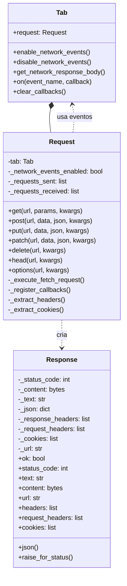
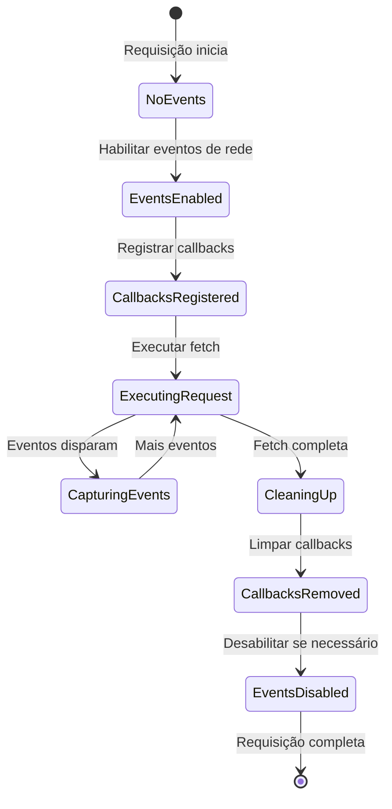
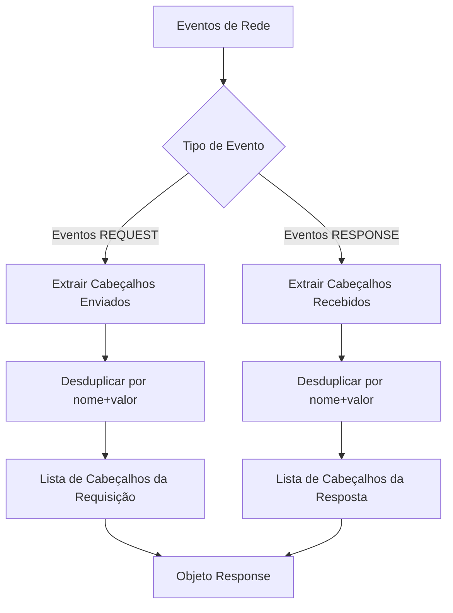
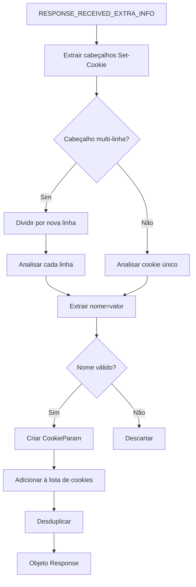

# Arquitetura de Requisições no Contexto do Navegador

Este documento explora o design arquitetural do sistema de requisições HTTP no contexto do navegador do Pydoll, que permite fazer requisições HTTP que herdam perfeitamente o estado de sessão, cookies e autenticação do navegador.

!!! info "Guia Prático Disponível"
    Esta é a análise profunda da arquitetura. Para exemplos práticos e casos de uso, consulte o [Guia de Requisições HTTP](../features/network/http-requests.md).

## Visão Geral da Arquitetura

Requisições no contexto do navegador resolvem um problema fundamental na automação híbrida: manter a continuidade da sessão entre interações de UI e chamadas de API. Abordagens tradicionais exigem a extração manual de cookies e cabeçalhos, criando um acoplamento frágil entre o navegador e o cliente HTTP.

A arquitetura do Pydoll elimina essa complexidade executando requisições HTTP **dentro** do contexto JavaScript do navegador, enquanto aproveita os eventos de rede do CDP para capturar metadados abrangentes que o JavaScript sozinho não pode fornecer.

### Por Que Essa Arquitetura?

| Abordagem Tradicional | Arquitetura Pydoll |
|---------------------|---------------------|
| Cliente HTTP separado (requests, aiohttp) | Execução unificada baseada no navegador |
| Extração e sincronização manual de cookies | Herança automática de cookies |
| Dois estados de sessão separados | Estado de sessão único |
| Manipulação limitada de CORS | Aplicação nativa de CORS do navegador |
| Fluxos de autenticação complexos | Preservação transparente da autenticação |


## Arquitetura de Componentes

O sistema de requisições no contexto do navegador consiste em duas classes principais que trabalham juntas com o sistema de eventos do Pydoll:



### Classe Request

A classe `Request` serve como a camada de interface, fornecendo uma API familiar semelhante à do `requests` enquanto orquestra a interação complexa entre a execução de JavaScript e o monitoramento de eventos de rede.

**Principais Responsabilidades:**

- Traduzir chamadas de método Python para JavaScript da API Fetch
- Gerenciar ouvintes (listeners) de eventos de rede temporários
- Acumular eventos de rede durante a execução da requisição
- Extrair metadados de eventos CDP
- Construir objetos Response com informações completas

### Classe Response

A classe `Response` fornece uma interface compatível com `requests.Response`, tornando a migração de clientes HTTP tradicionais contínua.

**Principais Características:**

- Múltiplos acessadores de conteúdo (texto, bytes, JSON)
- Análise (parsing) preguiçosa (lazy) de JSON com cache
- Informações abrangentes de cabeçalho (enviados e recebidos)
- Extração de cookies dos cabeçalhos Set-Cookie
- URL final após redirecionamentos

## Fluxo de Execução

A execução da requisição segue um pipeline de seis fases:

```mermaid
flowchart TD
    Start([tab.request.get#40;url#41;]) --> Phase1[<b>1. Preparação</b><br/>Construir URL + opções]
    
    Phase1 --> Phase2[<b>2. Registro de Eventos</b><br/>Habilitar eventos de rede<br/>Registrar callbacks]
    
    Phase2 --> Phase3[<b>3. Execução JavaScript</b><br/>Runtime.evaluate&#40;fetch&#41;]
    
    Phase3 --> Phase4{<b>4. Atividade de Rede</b>}
    Phase4 -->|Requisição enviada| Event1[REQUEST_WILL_BE_SENT]
    Phase4 -->|Resposta recebida| Event2[RESPONSE_RECEIVED]
    Phase4 -->|Informação extra| Event3[Eventos *_EXTRA_INFO]
    
    Event1 --> Collect[Coletar metadados]
    Event2 --> Collect
    Event3 --> Collect
    
    Collect --> Phase5[<b>5. Construção</b><br/>Extrair cabeçalhos/cookies<br/>Construir objeto Response]
    
    Phase5 --> Phase6[<b>6. Limpeza</b><br/>Limpar callbacks<br/>Desabilitar eventos]
    
    Phase6 --> End([Retornar Response])
```



### Detalhes das Fases

| Fase | Camada | Operações Principais | Assíncrono |
|-------|-------|----------------|--------------|
| **1. Preparação** | Request | Construção de URL, formatação de opções | Não |
| **2. Registro de Eventos** | Tab | Habilitar eventos, registrar callbacks | Sim |
| **3. Execução JavaScript** | CDP/Navegador | Executar fetch() no contexto do navegador | Sim |
| **4. Atividade de Rede** | Navegador/CDP | Requisição HTTP, emitir eventos CDP | Sim (paralelo) |
| **5. Construção** | Request | Analisar eventos, construir Response | Não |
| **6. Limpeza** | Tab | Remover callbacks, desabilitar eventos | Sim |

## Integração com o Sistema de Eventos

Requisições no contexto do navegador são fortemente integradas com a arquitetura do sistema de eventos do Pydoll. Entender essa relação é crucial.

### Ciclo de Vida de Eventos Temporários



### Por Que Usar Ambos, JavaScript e Eventos?

Uma pergunta comum: se o JavaScript pode executar a requisição, por que usar eventos de rede?

| Fonte da Informação | JavaScript (API Fetch) | Eventos de Rede (CDP) |
|-------------------|------------------------|----------------------|
| Status da resposta | Disponível | Disponível |
| Corpo da resposta | Disponível | Não disponível |
| Cabeçalhos da resposta | Parcial (restrito por CORS) | Completo |
| Cabeçalhos da requisição | Não acessível | Completo |
| Cabeçalhos Set-Cookie | Ocultos pelo navegador | Disponível |
| Informações de tempo (timing) | Limitadas | Abrangentes |
| Cadeia de redirecionamento | Apenas URL final | Cadeia completa |

**A Solução:** Combinar ambas as fontes para informações completas.

!!! tip "Tecnologias Complementares"
    O JavaScript fornece o corpo da resposta e dispara a requisição no contexto do navegador (com cookies, autenticação). Os eventos de rede fornecem os metadados que as políticas de segurança do JavaScript ocultam.

### Tipos de Eventos de Rede CDP

A arquitetura usa quatro tipos de eventos CDP para capturar metadados completos:

| Evento | Propósito | Informação Chave |
|-------|---------|----------------|
| `REQUEST_WILL_BE_SENT` | Requisição principal de saída | URL, método, cabeçalhos padrão |
| `REQUEST_WILL_BE_SENT_EXTRA_INFO` | Metadados adicionais da requisição | Cookies associados, cabeçalhos brutos |
| `RESPONSE_RECEIVED` | Resposta principal recebida | Status, cabeçalhos, tipo MIME, tempo |
| `RESPONSE_RECEIVED_EXTRA_INFO` | Metadados adicionais da resposta | Cabeçalhos Set-Cookie, informações de segurança |

!!! info "Multiplicidade de Eventos"
    Uma única requisição HTTP gera múltiplos eventos CDP. A classe Request acumula todos os eventos relacionados e extrai informações não duplicadas durante a fase de construção.

## Arquitetura de Cabeçalhos e Cookies

### Estratégia de Extração de Cabeçalhos

Cabeçalhos existem em múltiplos eventos CDP com potencial duplicação. A arquitetura usa uma estratégia de desduplicação:



**Lógica de Desduplicação:**

1. Eventos são processados em ordem
2. Cada cabeçalho é identificado pela tupla `(nome, valor)`
3. Apenas a primeira ocorrência de cada tupla é mantida
4. Resultado: lista de cabeçalhos única e não redundante

### Arquitetura de Análise de Cookies

Cookies exigem tratamento especial porque vêm dos cabeçalhos `Set-Cookie` nos eventos `RESPONSE_RECEIVED_EXTRA_INFO`:



**Princípios de Extração de Cookies:**

- Apenas eventos `EXTRA_INFO` contêm cabeçalhos `Set-Cookie`
- Atributos de cookie (Path, Domain, Secure, HttpOnly) são ignorados
- O navegador gerencia atributos de cookie internamente
- Apenas pares nome-valor são extraídos para fins informativos

!!! warning "Escopo dos Cookies"
    A propriedade `Response.cookies` contém apenas cookies **novos ou atualizados** desta resposta específica. Cookies existentes do navegador são gerenciados automaticamente e não expostos através desta interface.

## Contexto de Execução JavaScript

A execução da API Fetch acontece no contexto JavaScript do navegador, o que é fundamental para o poder da arquitetura:

### Integração com a API Fetch

A requisição é traduzida para JavaScript:

```javascript
// Representação simplificada
(async () => {
    const response = await fetch(url, {
        method: 'GET',
        headers: {'X-Custom': 'value'},
        // O navegador adiciona automaticamente:
        // - Cabeçalho Cookie
        // - Authorization se definido
        // - Cabeçalhos padrão (User-Agent, Accept, etc.)
    });
    
    return {
        status: response.status,
        url: response.url,  // URL final após redirecionamentos
        text: await response.text(),
        content: new Uint8Array(await response.arrayBuffer()),
        json: response.headers.get('Content-Type')?.includes('application/json')
            ? await response.clone().json()
            : null
    };
})()
```

### Benefícios do Contexto do Navegador

Executar no contexto do navegador fornece:

| Benefício | Descrição |
|---------|-------------|
| **Inclusão Automática de Cookies** | O navegador envia todos os cookies aplicáveis automaticamente |
| **Preservação do Estado de Autenticação** | Cabeçalhos de autenticação mantidos da sessão do navegador |
| **Aplicação de CORS** | O navegador aplica as mesmas políticas CORS das interações do usuário |
| **Manipulação de TLS/SSL** | A validação de certificado e políticas de segurança do navegador se aplicam |
| **Compressão** | Manipulação automática de gzip, br, deflate |
| **Redirecionamentos** | O navegador segue redirecionamentos transparentemente |
| **Mesmo Contexto de Segurança** | A requisição parece idêntica às requisições iniciadas pelo usuário |

!!! info "Detecção Anti-Bot"
    Requisições executadas no contexto do navegador são indistinguíveis de requisições iniciadas pelo usuário, tornando-as eficazes contra sistemas anti-bot que analisam padrões de requisição.

## Considerações de Performance

### Sobrecarga de Eventos

Eventos de rede adicionam sobrecarga à execução da requisição:

| Cenário | Sobrecarga | Recomendação |
|----------|----------|----------------|
| Requisição única | Baixa | Aceitável |
| Múltiplas requisições sequenciais | Moderada | Habilitar eventos uma vez |
| Requisições em massa (100+) | Alta | Considere habilitar eventos no nível da aba |
| Automação de longa duração | Preocupação com memória | Desabilitar quando terminar |

### Padrão de Otimização

```python
# Ineficiente - eventos habilitados/desabilitados repetidamente
for url in urls:
    response = await tab.request.get(url)

# Eficiente - eventos habilitados uma vez
await tab.enable_network_events()
for url in urls:
    response = await tab.request.get(url)
await tab.disable_network_events()
```

!!! tip "Otimização Automática"
    A classe Request verifica se os eventos de rede já estão habilitados e pula operações redundantes de habilitar/desabilitar automaticamente.

### Estratégia de Análise JSON

A análise JSON da resposta usa avaliação preguiçosa (lazy) com cache:

1. Primeira chamada a `response.json()`: Analisa e armazena em cache
2. Chamadas subsequentes: Retorna resultado do cache
3. Se o JSON foi pré-analisado durante a construção: Usa esse

Isso previne sobrecarga de análise redundante.

## Arquitetura de Segurança

### Aplicação da Política CORS

Requisições no contexto do navegador respeitam as políticas CORS:

```mermaid
flowchart TD
    A[tab.request.get&#40;url&#41;] --> B{Mesma Origem?}
    B -->|Sim| C[Requisição Permitida]
    B -->|Não| D{Cabeçalhos CORS Presentes?}
    D -->|Sim| E[Requisição Permitida]
    D -->|Não| F[Requisição Bloqueada]
    
    C --> G[Resposta Retornada]
    E --> G
    F --> H[Erro CORS]
```



**Comportamento do CORS:**

- Requisições para mesma origem: Sempre permitidas
- Requisições cross-origin: Exigem cabeçalhos CORS do servidor
- Respostas opacas: Podem ser bloqueadas pelo navegador

**Solução para problemas de CORS:**

Navegue para o domínio primeiro para estabelecer um contexto de mesma origem:

```python
await tab.go_to('https://different-domain.com')
response = await tab.request.get('https://different-domain.com/api')
```

### Segurança de Cookies

Cookies com flags de segurança (`HttpOnly`, `Secure`, `SameSite`) são manipulados pelo navegador:

- **Cookies HttpOnly**: Enviados automaticamente, mas não expostos ao JavaScript ou CDP
- **Cookies Secure**: Enviados apenas sobre HTTPS
- **Cookies SameSite**: O navegador aplica as políticas SameSite

A propriedade `Response.cookies` pode não mostrar todos os cookies devido a essas restrições de segurança.

### Validação TLS/SSL

O navegador valida certificados SSL. Certificados autoassinados ou inválidos fazem com que as requisições falhem, a menos que:

```python
options = ChromiumOptions()
options.add_argument('--ignore-certificate-errors')
browser = Chrome(options=options)
```

!!! warning "Compromisso de Segurança"
    Desabilitar a validação de certificados reduz a segurança. Use apenas em ambientes controlados.

## Limitações e Decisões de Design

### Tamanho do Corpo da Requisição

Corpos de requisição muito grandes (arquivos, grandes conjuntos de dados) têm restrições de memória do JavaScript. Para uploads de arquivos, use `WebElement.set_input_files()` ou o interceptador de seletor de arquivos.

### Manipulação de Resposta Binária

Respostas binárias são convertidas através do `ArrayBuffer` e `Uint8Array` do JavaScript, o que adiciona alguma sobrecarga para respostas muito grandes (>100MB).

### Transparência de Redirecionamento

A API Fetch segue redirecionamentos automaticamente. Apenas a URL final é capturada. Se você precisar da cadeia de redirecionamento, use o monitoramento de rede separadamente.

### Temporização de Eventos

Eventos devem ser registrados **antes** de executar o fetch. A arquitetura garante isso através da fase de registro, mas o manuseio manual de eventos requer uma temporização cuidadosa.

## Princípios Arquiteturais

A arquitetura de requisições no contexto do navegador adere a estes princípios:

1. **Continuidade da Sessão**: Nunca quebrar o estado de sessão do navegador
2. **Sincronização Manual Zero**: Nenhuma extração de cookie/cabeçalho necessária
3. **Informação Completa**: Combinar JavaScript + eventos para metadados completos
4. **Limpeza Automática**: Recursos liberados após cada requisição
5. **Interface Familiar**: API compatível com `requests` para fácil adoção
6. **Consciente de Performance**: Otimizar para casos de uso comuns
7. **Consciente de Segurança**: Respeitar as políticas de segurança do navegador

## Integração com Outros Sistemas

### Dependência do Sistema de Eventos

Requisições no contexto do navegador dependem da arquitetura do sistema de eventos:

- Utiliza `Tab.on()` para registro de callback
- Usa `Tab.clear_callbacks()` para limpeza
- Respeita a habilitação existente de eventos de rede
- Integra-se com o gerenciamento do ciclo de vida dos eventos

Veja [Arquitetura do Sistema de Eventos](event-architecture.md) para detalhes.

### Integração com o Sistema de Tipos

A arquitetura usa o sistema de tipos do Python extensivamente:

- `HeaderEntry` TypedDict para cabeçalhos
- `CookieParam` TypedDict para cookies
- Definições de tipo de evento de `pydoll.protocol.network.events`
- Fornece autocomplete na IDE e segurança de tipos

Veja [Sistema de Tipagem](typing-system.md) para detalhes.

## Leitura Adicional

- **[Guia de Requisições HTTP](../features/network/http-requests.md)** - Exemplos práticos e casos de uso
- **[Arquitetura do Sistema de Eventos](event-architecture.md)** - Design interno do sistema de eventos
- **[Monitoramento de Rede](../features/network/monitoring.md)** - Observação passiva de rede
- **[Interceptação de Requisições](../features/network/interception.md)** - Modificação ativa de requisições
- **[Sistema de Tipagem](typing-system.md)** - Integração do sistema de tipos

## Resumo

A arquitetura de requisições no contexto do navegador do Pydoll alcança comunicação HTTP contínua combinando a execução da API Fetch do JavaScript com o monitoramento de eventos de rede do CDP. Esta abordagem híbrida fornece:

- **Metadados completos** de ambos os eventos JavaScript e CDP
- **Continuidade automática da sessão** através da execução no contexto do navegador  
- **Interface familiar** compatível com a biblioteca requests
- **Otimização de performance** através da reutilização de eventos
- **Conformidade de segurança** com as políticas do navegador

A arquitetura demonstra como a combinação de tecnologias complementares (JavaScript + eventos CDP) pode resolver problemas complexos de forma elegante, fornecendo poder e conveniência sem comprometer a completude ou a segurança.