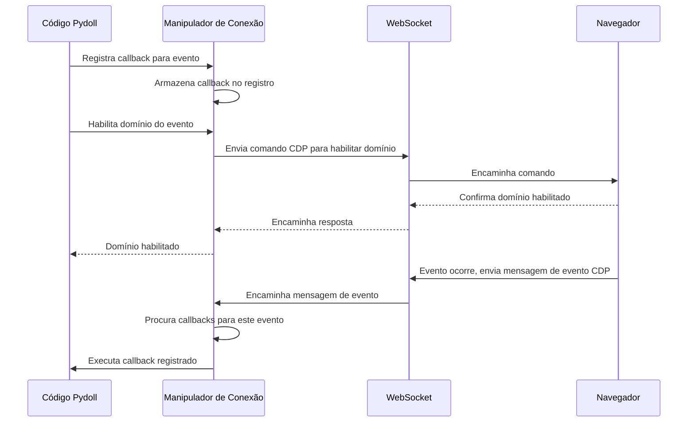
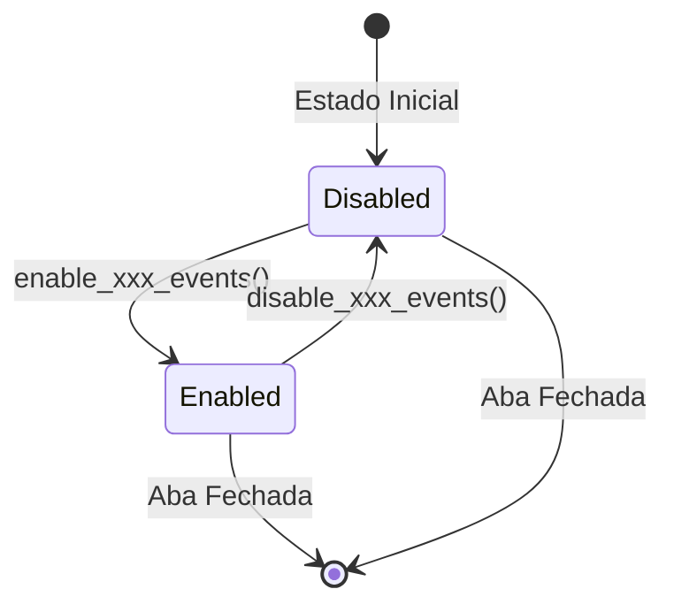
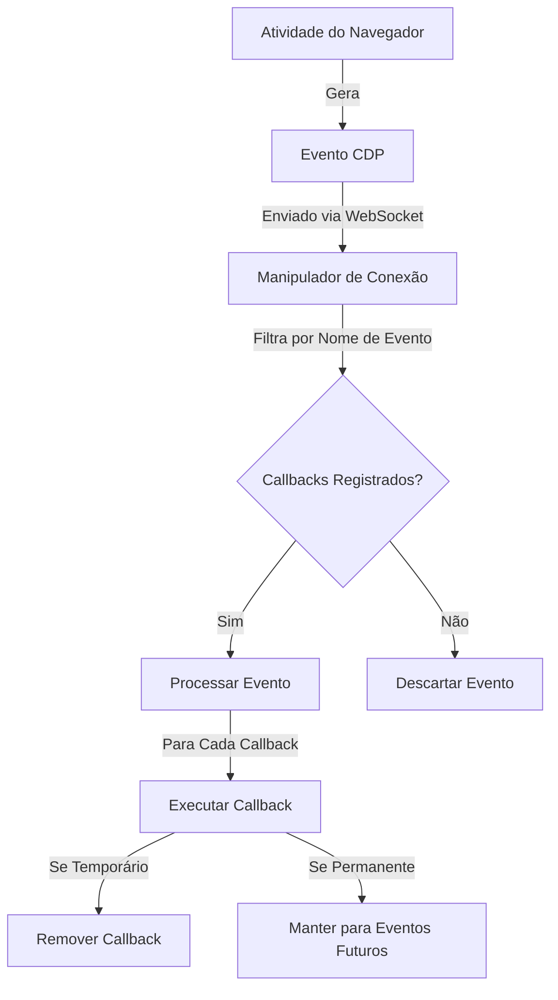
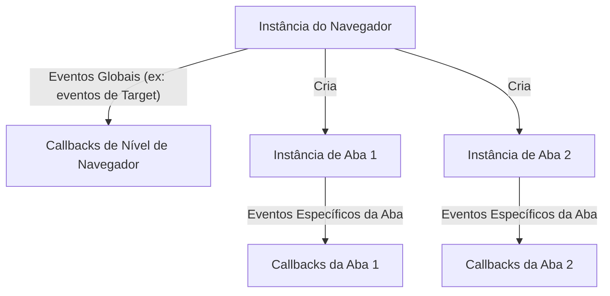

# Arquitetura do Sistema de Eventos

Este documento explora a arquitetura interna do sistema de eventos do Pydoll, cobrindo comunicação WebSocket, fluxo de eventos, gerenciamento de callbacks e considerações de performance.

!!! info "Guia de Uso Prático"
    Para exemplos práticos e padrões de uso, consulte o [Guia do Sistema de Eventos](../features/advanced/event-system.md).

## Comunicação WebSocket e CDP

No núcleo do sistema de eventos do Pydoll está o Chrome DevTools Protocol (CDP), que fornece uma maneira estruturada de interagir e monitorar atividades do navegador através de conexões WebSocket. Este canal de comunicação bidirecional permite que seu código tanto envie comandos para o navegador quanto receba eventos de volta.



### Modelo de Comunicação WebSocket

A conexão WebSocket entre o Pydoll e o navegador segue este padrão:

1.  **Estabelecimento da Conexão**: Quando o navegador inicia, um servidor WebSocket é criado, e o Pydoll estabelece uma conexão com ele
2.  **Mensagens Bidirecionais**: Tanto o Pydoll quanto o navegador podem enviar mensagens a qualquer momento
3.  **Tipos de Mensagem**:
    -   **Comandos**: Enviados do Pydoll para o navegador (ex: navegação, manipulação do DOM)
    -   **Respostas de Comandos**: Enviadas do navegador para o Pydoll em resposta a comandos
    -   **Eventos**: Enviados do navegador para o Pydoll quando algo acontece (ex: carregamento da página, atividade de rede)

### Estrutura do Chrome DevTools Protocol

O CDP organiza sua funcionalidade em domínios, cada um responsável por uma área específica da funcionalidade do navegador:

| Domínio | Responsabilidade | Eventos Típicos |
|--------|----------------|----------------|
| Page | Ciclo de vida da página | Eventos de carregamento, navegação, diálogos |
| Network | Atividade de rede | Monitoramento de requisição/resposta, WebSockets |
| DOM | Estrutura do documento | Mudanças no DOM, modificações de atributos |
| Fetch | Interceptação de requisição | Requisição pausada, autenticação necessária |
| Runtime | Execução JavaScript | Mensagens do console, exceções |
| Browser | Gerenciamento do navegador | Criação de janelas, abas, contextos |

Cada domínio must ser explicitamente habilitado antes de começar a emitir eventos, o que ajuda a gerenciar a performance processando apenas os eventos que são realmente necessários.

## Arquitetura de Domínio

### O Padrão Habilitar/Desabilitar (Enable/Disable)

O padrão explícito de habilitar/desabilitar atende a vários propósitos arquiteturais importantes:

1.  **Otimização de Performance**: Ao habilitar apenas os domínios nos quais você está interessado, você reduz a sobrecarga (overhead) do processamento de eventos
2.  **Gerenciamento de Recursos**: Alguns domínios de eventos (como monitoramento de Rede ou DOM) podem gerar grandes volumes de eventos que consomem memória
3.  **Conformidade com o Protocolo**: O CDP exige a habilitação explícita do domínio antes que os eventos sejam emitidos
4.  **Limpeza Controlada**: Desabilitar explicitamente os domínios garante uma limpeza adequada quando os eventos não são mais necessários



!!! warning "Prevenção de Vazamento de Eventos"
    A falha em desabilitar domínios de eventos quando eles não são mais necessários pode levar a vazamentos de memória e degradação de performance, especialmente em automações de longa duração. Sempre desabilite os domínios de eventos quando terminar de usá-los, particularmente para eventos de alto volume, como monitoramento de rede.

### Métodos de Habilitação Específicos do Domínio

Diferentes domínios são habilitados através de métodos específicos nos objetos apropriados:

| Domínio | Método de Habilitação | Método de Desabilitação | Disponível Em |
|--------|--------------|----------------|--------------|
| Page | `enable_page_events()` | `disable_page_events()` | Aba |
| Network | `enable_network_events()` | `disable_network_events()` | Aba |
| DOM | `enable_dom_events()` | `disable_dom_events()` | Aba |
| Fetch | `enable_fetch_events()` | `disable_fetch_events()` | Aba, Navegador |
| File Chooser | `enable_intercept_file_chooser_dialog()` | `disable_intercept_file_chooser_dialog()` | Aba |

!!! info "Propriedade do Domínio"
    Eventos pertencem a domínios específicos com base em sua funcionalidade. Alguns domínios estão disponíveis apenas em certos níveis - por exemplo, eventos de Página (Page) estão disponíveis na instância da Aba (Tab), mas não diretamente noível do Navegador (Browser).

## Sistema de Registro de Eventos

### O Método `on()`

O método central para se inscrever (subscribing) em eventos é o método `on()`, disponível tanto nas instâncias de Aba (Tab) quanto de Navegador (Browser):

```python
async def on(
    self, event_name: str, callback: callable, temporary: bool = False
) -> int:
    """
    Registra um ouvinte (listener) de evento.

    Args:
        event_name (str): O nome do evento a ser ouvido.
        callback (callable): A função de callback a ser executada quando o
            evento é disparado.
        temporary (bool): Se True, o callback será removido após ser
            disparado uma vez. O padrão é False.

    Returns:
        int: O ID do callback registrado.
    """
```

Este método retorna um ID de callback que pode ser usado para remover o callback posteriormente, se necessário.

### Registro de Callback

Internamente, o `ConnectionHandler` (Manipulador de Conexão) mantém um registro de callbacks:

```python
{
    'Page.loadEventFired': [
        (callback_id_1, callback_function_1, temporary=False),
        (callback_id_2, callback_function_2, temporary=True),
    ],
    'Network.requestWillBeSent': [
        (callback_id_3, callback_function_3, temporary=False),
    ]
}
```

Quando um evento chega via WebSocket:

1.  O nome do evento é extraído da mensagem
2.  O registro é consultado por callbacks correspondentes
3.  Cada callback é executado com os dados do evento
4.  Callbacks temporários são removidos após a execução

### Manipulação de Callback Assíncrono

Callbacks podem ser síncronos ou assíncronos. O sistema de eventos lida com ambos:

```python
async def _trigger_callbacks(self, event_name: str, event_data: dict):
    for cb_id, cb_data in self._event_callbacks.items():
        if cb_data['event'] == event_name:
            if asyncio.iscoroutinefunction(cb_data['callback']):
                await cb_data['callback'](event_data)
            else:
                cb_data['callback'](event_data)
```

Callbacks assíncronos são aguardados (awaited) sequencialmente. Isso significa que cada callback é concluído antes que o próximo seja executado, o que é importante para:

-   **Ordem de Execução Previsível**: Callbacks executam na ordem de registro
-   **Tratamento de Erros**: Exceções em um callback não impedem que outros sejam executados
-   **Consistência de Estado**: Callbacks podem confiar em mudanças de estado sequenciais

!!! info "Execução Sequencial vs. Concorrente"
    Callbacks são executados sequencialmente dentro do mesmo evento. No entanto, eventos diferentes podem ser processados concorrentemente, já que o loop de eventos lida com múltiplas conexões simultaneamente.

## Fluxo e Ciclo de Vida do Evento

O ciclo de vida do evento segue estes passos:



### Fluxo Detalhado

1.  **Atividade do Navegador**: Algo acontece no navegador (página carrega, requisição enviada, DOM muda)
2.  **Geração de Evento CDP**: O navegador gera uma mensagem de evento CDP
3.  **Transmissão WebSocket**: A mensagem é enviada pelo WebSocket para o Pydoll
4.  **Recepção do Evento**: O ConnectionHandler recebe o evento
5.  **Busca de Callback**: O ConnectionHandler verifica seu registro por callbacks que correspondem ao nome do evento
6.  **Execução do Callback**: Se callbacks existirem, cada um é executado com os dados do evento
7.  **Remoção Temporária**: Se um callback foi registrado como temporário, ele é removido após a execução

## Eventos em Nível de Navegador vs. Nível de Aba

O sistema de eventos do Pydoll opera tanto no nível do navegador quanto no nível da aba, com distinções importantes:



### Eventos em Nível de Navegador

Eventos em nível de navegador operam globalmente em todas as abas. Estes são limitados a domínios específicos como:

-   **Eventos de Alvo (Target)**: Criação, destruição, falha (crash) de abas
-   **Eventos do Navegador**: Gerenciamento de janelas, coordenação de downloads

```python
# Registro de evento em nível de navegador
await browser.on('Target.targetCreated', handle_new_target)
```

Os domínios de eventos em nível de navegador são limitados, e tentar usar eventos específicos de abas levantará uma exceção.

### Eventos em Nível de Aba

Eventos em nível de aba são específicos para uma aba individual:

```python
# Cada aba tem seu próprio contexto de evento
tab1 = await browser.start()
tab2 = await browser.new_tab()

await tab1.enable_page_events()
await tab1.on(PageEvent.LOAD_EVENT_FIRED, handle_tab1_load)

await tab2.enable_page_events()
await tab2.on(PageEvent.LOAD_EVENT_FIRED, handle_tab2_load)
```

Esta arquitetura permite:

-   **Manipulação Isolada de Eventos**: Eventos em uma aba não afetam outras
-   **Configuração por Aba**: Abas diferentes podem monitorar tipos de eventos diferentes
-   **Eficiência de Recursos**: Habilite eventos apenas nas abas que precisam deles

!!! info "Escopo Específico do Domínio"
    Nem todos os domínios de eventos estão disponíveis em ambos os níveis:
    
    -   **Eventos Fetch**: Disponíveis tanto no nível do navegador quanto da aba
    -   **Eventos de Página (Page)**: Disponíveis apenas no nível da aba
    -   **Eventos de Alvo (Target)**: Disponíveis apenas no nível do navegador

## Arquitetura de Performance

### Sobrecarga (Overhead) do Sistema de Eventos

O sistema de eventos adiciona sobrecarga (overhead) à automação do navegador, especialmente para eventos de alta frequência:

| Domínio do Evento | Volume Típico de Eventos | Impacto na Performance |
|--------------|---------------------|-------------------|
| Page | Baixo | Mínimo |
| Network | Alto | Moderado a Alto |
| DOM | Muito Alto | Alto |
| Fetch | Moderado | Moderado (maior se estiver interceptando) |

### Estratégias de Otimização de Performance

1.  **Habilitação Seletiva de Domínio**: Apenas habilite domínios de eventos que você está usando ativamente
2.  **Definição Estratégica de Escopo**: Use eventos em nível de navegador apenas para preocupações que sejam verdadeiramente globais
3.  **Desabilitação Oportuna**: Sempre desabilite os domínios de eventos quando terminar de usá-los
4.  **Filtragem Precoce**: Nos callbacks, filtre eventos irrelevantes o mais cedo possível
5.  **Callbacks Temporários**: Use a flag `temporary=True` para eventos de ocorrência única

### Gerenciamento de Memória

O sistema de eventos gerencia a memória através de vários mecanismos:

1.  **Limpeza do Registro de Callbacks**: Remover callbacks libera suas referências
2.  **Auto-Remoção Temporária**: Callbacks temporários são limpos automaticamente
3.  **Desabilitação de Domínio**: Desabilitar um domínio interrompe a geração de eventos
4.  **Fechamento da Aba**: Quando uma aba fecha, todos os seus callbacks são removidos automaticamente

!!! warning "Prevenção de Vazamento de Memória"
    Em automações de longa duração, sempre limpe os callbacks e desabilite os domínios quando terminar. Eventos de alta frequência (especialmente DOM) podem acumular memória significativa se deixados habilitados.

## Arquitetura do Manipulador de Conexão (Connection Handler)

O `ConnectionHandler` é o componente central que gerencia a comunicação WebSocket e o despacho de eventos.

### Principais Responsabilidades

1.  **Gerenciamento de WebSocket**: Estabelecer e manter a conexão WebSocket
2.  **Roteamento de Mensagens**: Distinguir entre respostas de comandos e eventos
3.  **Registro de Callbacks**: Manter o mapeamento de nomes de eventos para callbacks
4.  **Despacho de Eventos**: Executar callbacks registrados quando os eventos chegam
5.  **Limpeza**: Remover callbacks e fechar conexões

### Estrutura Interna

```python
class ConnectionHandler:
    def __init__(self, ...):
        self._events_handler = EventsManager()
        self._websocket = None
        # ... outros atributos
    
    async def register_callback(self, event_name, callback, temporary):
        return self._events_handler.register_callback(event_name, callback, temporary)

class EventsManager:
    def __init__(self):
        self._event_callbacks = {}  # ID do Callback -> dados do callback
        self._callback_id = 0
    
    def register_callback(self, event_name, callback, temporary):
        self._callback_id += 1
        self._event_callbacks[self._callback_id] = {
            'event': event_name,
            'callback': callback,
            'temporary': temporary
        }
        return self._callback_id
    
    async def _trigger_callbacks(self, event_name, event_data):
        callbacks_to_remove = []
        
        for cb_id, cb_data in self._event_callbacks.items():
            if cb_data['event'] == event_name:
                # Executa callback (await se assíncrono, chama diretamente se síncrono)
                if asyncio.iscoroutinefunction(cb_data['callback']):
                    await cb_data['callback'](event_data)
                else:
                    cb_data['callback'](event_data)
                
                # Marca callbacks temporários para remoção
                if cb_data['temporary']:
                    callbacks_to_remove.append(cb_id)
        
        # Remove callbacks temporários após todos os callbacks serem executados
        for cb_id in callbacks_to_remove:
            self.remove_callback(cb_id)
```

Esta arquitetura garante:

-   **Busca Eficiente**: Nomes de eventos mapeiam diretamente para listas de callbacks
-   **Sobrecarga Mínima**: Apenas eventos registrados são processados
-   **Limpeza Automática**: Callbacks temporários são removidos após a execução
-   **Segurança Assíncrona (Async-safe)**: Operações são seguras em ambientes assíncronos

## Formato da Mensagem de Evento

Eventos CDP seguem um formato de mensagem padronizado:

```json
{
    "method": "Network.requestWillBeSent",
    "params": {
        "requestId": "1234.56",
        "loaderId": "7890.12",
        "documentURL": "https://example.com",
        "request": {
            "url": "https://api.example.com/data",
            "method": "GET",
            "headers": {...}
        },
        "timestamp": 123456.789,
        "wallTime": 1234567890.123,
        "initiator": {...},
        "type": "XHR"
    }
}
```

Componentes principais:

-   **`method`**: O nome do evento no formato `Dominio.nomeDoEvento`
-   **`params`**: Dados específicos do evento, variam por tipo de evento
-   **Sem campo `id`**: Diferente dos comandos, eventos não têm IDs de requisição

O sistema de eventos extrai o campo `method` para rotear para os callbacks apropriados, passando a mensagem inteira para cada callback.

## Coordenação de Eventos Multi-Aba

A arquitetura do Pydoll suporta coordenação sofisticada de eventos multi-aba:

### Contextos de Aba Independentes

Cada aba mantém seus próprios:

-   Estado de habilitação de domínio de evento
-   Registro de callbacks
-   Canal de comunicação de evento
-   Logs de rede (se eventos de rede estiverem habilitados)

!!! info "Arquitetura de Comunicação"
    Cada aba tem seu próprio canal de comunicação de eventos para o navegador. Para detalhes técnicos sobre como conexões WebSocket e IDs de alvo (target) funcionam no nível do protocolo, consulte [Arquitetura do Domínio do Navegador](./browser-domain.md).

### Contexto de Navegador Compartilhado

Múltiplas abas podem compartilhar:

-   Ouvintes de eventos em nível de navegador
-   Armazenamento de cookies
-   Cache
-   Processo do navegador

Esta arquitetura permite:

1.  **Processamento Paralelo de Eventos**: Múltiplas abas podem processar eventos simultaneamente
2.  **Falhas Isoladas**: Problemas em uma aba não afetam outras
3.  **Compartilhamento de Recursos**: Recursos comuns do navegador são compartilhados eficientemente
4.  **Ações Coordenadas**: Eventos em nível de navegador podem coordenar atividades entre abas

## Conclusão

A arquitetura do sistema de eventos do Pydoll é projetada para:

-   **Performance**: Sobrecarga mínima através de habilitação seletiva de domínio e despacho eficiente de callbacks
-   **Flexibilidade**: Suporte para eventos tanto em nível de navegador quanto de aba
-   **Escalabilidade**: Lidar com múltiplas abas com contextos de eventos independentes
-   **Confiabilidade**: Limpeza automática e gerenciamento de memória

Entender esta arquitetura ajuda você a:

-   **Otimizar Performance**: Saber quais domínios têm alta sobrecarga
-   **Depurar Problemas**: Entender o fluxo de eventos quando as coisas não funcionam como esperado
-   **Projetar Automação Melhor**: Alavancar a arquitetura para fluxos de trabalho eficientes orientados a eventos
-   **Evitar Armadilhas**: Prevenir vazamentos de memória e degradação de performance

Para padrões de uso práticos e exemplos, consulte o [Guia do Sistema de Eventos](../features/advanced/event-system.md).