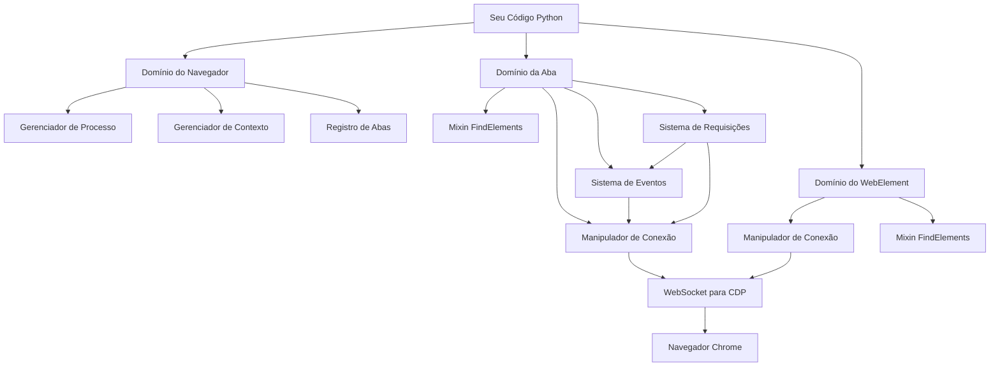

# Arquitetura Interna

**Entenda o design, depois quebre as regras intencionalmente.**

A maioria da documentação mostra **o que** um framework faz. Esta seção revela **como** e **por que** o Pydoll é arquitetado da maneira que é: os padrões de design, as decisões arquiteturais e os tradeoffs (compromissos) que moldam cada linha de código.

## Por que a Arquitetura Importa

Você pode usar o Pydoll eficazmente sem entender sua arquitetura interna. Mas quando você precisar:

- **Depurar** problemas complexos que abrangem múltiplos componentes
- **Otimizar** gargalos de performance em automação de grande escala
- **Estender** o Pydoll com funcionalidade personalizada
- **Contribuir** com melhorias para a base de código
- **Construir** ferramentas similares para diferentes casos de uso

...o conhecimento arquitetural se torna **indispensável**.

!!! quote "Arquitetura como Linguagem"
    **"Arquitetura é música congelada."** - Johann Wolfgang von Goethe
    
    Uma boa arquitetura não é apenas sobre fazer o código funcionar, é sobre tornar o código **compreensível**, **manutenível** e **extensível**. Entender a arquitetura do Pydoll ensina padrões que você aplicará em todos os projetos.

## Os Seis Domínios Arquiteturais

A arquitetura do Pydoll é organizada em **seis domínios coesos**, cada um com responsabilidades e interfaces claras:

### 1. Domínio do Navegador (Browser)
**[→ Explore a Arquitetura do Navegador](./browser-domain.md)**

**O orquestrador: gerenciando processos, contextos e estado global.**

O domínio do Navegador (Browser) fica no topo da hierarquia, coordenando:

- **Gerenciamento de processos**: Iniciar/terminar executáveis do navegador
- **Contextos do navegador**: Ambientes isolados (como janelas anônimas)
- **Registro de abas**: Padrão Singleton para instâncias de Abas (Tab)
- **Autenticação de proxy**: Autenticação automática via domínio Fetch
- **Operações globais**: Downloads, permissões, gerenciamento de janelas

**Principais padrões arquiteturais**:

- **Classe base abstrata** para Chrome/Edge/outros navegadores Chromium
- **Padrão Gerenciador (Manager)** (ProcessManager, ProxyManager, TempDirManager)
- **Registro Singleton** para instâncias de Aba (previne duplicatas)
- **Protocolo de gerenciador de contexto** para limpeza automática

**Insight crítico**: O Navegador não manipula páginas diretamente, ele **coordena** componentes de nível inferior. Essa separação de responsabilidades permite suporte a múltiplos navegadores e operações concorrentes em abas.

---

### 2. Domínio da Aba (Tab)
**[→ Explore a Arquitetura da Aba](./tab-domain.md)**

**O cavalo de batalha: executando comandos, gerenciando estado, coordenando automação.**

O domínio da Aba (Tab) é a interface primária do Pydoll, lidando com:

- **Navegação**: Carregamento de página com estados de espera configuráveis
- **Localização de elementos**: Delegado ao FindElementsMixin
- **Execução de JavaScript**: Contextos tanto de página quanto de elemento
- **Coordenação de eventos**: Ouvintes (listeners) de eventos específicos da aba
- **Monitoramento de rede**: Captura e análise de requisição/resposta
- **Manipulação de IFrame**: Gerenciamento de contexto aninhado

**Principais padrões arquiteturais**:

- **Padrão Façade (Fachada)**: Interface simplificada para operações complexas do CDP
- **Composição de Mixin**: FindElementsMixin para localização de elementos
- **WebSocket por aba**: Conexões independentes para paralelismo
- **Flags de estado**: Rastreia domínios habilitados (network_events_enabled, etc.)
- **Inicialização preguiçosa (Lazy)**: Objeto Request criado no primeiro acesso

**Insight crítico**: Cada Aba (Tab) possui seu **próprio ConnectionHandler**, permitindo operações paralelas verdadeiras entre abas sem contenção ou vazamento de estado.

---

### 3. Domínio do WebElement
**[→ Explore a Arquitetura do WebElement](./webelement-domain.md)**

**O interator: fazendo a ponte entre código Python e elementos DOM.**

O domínio WebElement representa **elementos DOM individuais**, fornecendo:

- **Métodos de interação**: Clique, digitação, rolagem, seleção
- **Acesso a propriedades**: Texto, HTML, limites (bounds), atributos
- **Consultas de estado**: Visibilidade, status de habilitado, valor
- **Capturas de tela (Screenshots)**: Captura de imagem específica do elemento
- **Localização de filhos**: Localização de elementos relativos (também via FindElementsMixin)

**Principais padrões arquiteturais**:

- **Padrão Proxy**: Objeto Python representando um elemento remoto do navegador
- **Abstração de Object ID**: O objectId do CDP oculto atrás da API Python
- **Propriedades híbridas**: Síncronas (atributos) vs. assíncronas (estado dinâmico)
- **Padrão Command**: Métodos de interação encapsulam comandos CDP
- **Estratégias de fallback**: Múltiplas abordagens para robustez

**Insight crítico**: O WebElement mantém **ambos os atributos em cache** (da criação) e **estado dinâmico** (buscado sob demanda), equilibrando performance com dados atualizados.

---

### 4. Mixin FindElements
**[→ Explore a Arquitetura do FindElements](./find-elements-mixin.md)**

**O localizador: traduzindo seletores em consultas DOM.**

O FindElementsMixin fornece capacidades de localização de elementos tanto para a Aba (Tab) quanto para o WebElement através de **composição**, não herança:

- **Localização baseada em atributos**: `find(id='submit', class_name='btn')`
- **Consulta baseada em expressão**: `query('div.container > p')`
- **Resolução de estratégia**: Seletor ideal para atributos únicos vs. múltiplos
- **Mecanismos de espera**: Polling (sondagem) com timeouts configuráveis
- **Detecção de contexto**: Buscas no documento vs. relativas ao elemento

**Principais padrões arquiteturais**:
- **Padrão Mixin**: Capacidade compartilhada sem hierarquia de herança
- **Padrão Strategy**: Diferentes estratégias de seletor baseadas na entrada
- **Padrão Template Method**: Fluxo comum, implementação específica da estratégia
- **Função de Fábrica (Factory)**: Importação tardia (late import) para evitar dependências circulares
- **Padrão Overload**: Tipos de retorno seguros (WebElement vs. lista)

**Insight crítico**: O mixin usa **duck typing** (`hasattr(self, '_object_id')`) para detectar Tab vs. WebElement, permitindo reuso de código sem acoplamento forte.

---

### 5. Arquitetura de Eventos
**[→ Explore a Arquitetura de Eventos](./event-architecture.md)**

**O despachante: roteando eventos do navegador para callbacks Python.**

A Arquitetura de Eventos permite automação reativa através de:

- **Registro de eventos**: Método `on()` para se inscrever (subscribe) em eventos CDP
- **Despacho de callbacks**: Execução assíncrona sem bloqueio
- **Gerenciamento de domínio**: Habilitação/desabilitação explícita para performance
- **Callbacks temporários**: Auto-remoção após a primeira invocação
- **Escopo multi-nível**: Eventos em todo o navegador vs. específicos da aba

**Principais padrões arquiteturais**:

- **Padrão Observer**: Inscrever/notificar para código orientado a eventos
- **Padrão Registry**: Mapeamento de nome do evento → lista de callbacks
- **Padrão Wrapper**: Encapsula callbacks síncronos para execução assíncrona
- **Protocolo de limpeza**: Remoção automática de callbacks no fechamento da aba
- **Isolamento de escopo**: Contextos de eventos independentes por aba

**Insight crítico**: Eventos são baseados em **push** (navegador notifica o Python), não em poll (sondagem), permitindo automação reativa de baixa latência sem espera ocupada (busy-waiting).

---

### 6. Arquitetura de Requisições do Navegador
**[→ Explore a Arquitetura de Requisições](./browser-requests-architecture.md)**

**O híbrido: requisições HTTP com o estado de sessão do navegador.**

O sistema de Requisições do Navegador (Browser Requests) faz a ponte entre HTTP e automação de navegador:

- **Continuidade de sessão**: Cookies e autenticação incluídos automaticamente
- **Fontes de dados duplas**: API Fetch do JavaScript + eventos de rede do CDP
- **Metadados completos**: Cabeçalhos, cookies, tempo (timing) (nem tudo disponível via JavaScript)
- **API semelhante à `requests`**: Interface familiar com o poder do navegador

**Principais padrões arquiteturais**:

- **Execução híbrida**: JavaScript para o corpo (body), CDP para metadados
- **Registro temporário de eventos**: Padrão Habilitar/capturar/desabilitar
- **Inicialização preguiçosa (lazy) de propriedade**: Objeto Request criado no primeiro uso
- **Padrão Adapter**: Interface compatível com `requests` para o fetch do navegador

**Insight crítico**: As requisições do navegador combinam **duas fontes de informação** (JavaScript e eventos CDP). O JavaScript fornece o corpo da resposta, o CDP fornece cabeçalhos e cookies que as políticas de segurança do JavaScript ocultam.

---

## Princípios Arquiteturais

Esses seis domínios seguem princípios consistentes:

### 1. Separação de Responsabilidades (Separation of Concerns)
Cada domínio tem uma **responsabilidade única e bem definida**:

- Navegador → Gerenciamento de processo/contexto
- Aba → Execução de comando e estado
- WebElement → Interação com elemento
- FindElements → Localização de elemento
- Eventos → Despacho reativo
- Requisições → HTTP no contexto do navegador

**Benefício**: Mudanças em um domínio raramente exigem mudanças em outros.

### 2. Composição Sobre Herança
Em vez de hierarquias de herança profundas, o Pydoll usa:

- **Mixins** (FindElementsMixin compartilhado por Tab e WebElement)
- **Gerenciadores (Managers)** (ProcessManager, ProxyManager, TempDirManager)
- **Injeção de dependência** (ConnectionHandler passado para os componentes)

**Benefício**: Reutilização flexível de componentes sem acoplamento forte.

### 3. Assíncrono por Padrão (Async by Default)
Todas as operações de E/S (I/O) são `async def` e devem ser `await`ed:

- Comunicação WebSocket
- Execução de comando CDP
- Despacho de callback de evento
- Requisições de rede

**Benefício**: Permite concorrência verdadeira com múltiplas abas, operações paralelas e E/S não bloqueante.

### 4. Segurança de Tipos (Type Safety)
Toda API pública tem anotações de tipo (type annotations):

- Parâmetros de função e tipos de retorno
- Respostas CDP como `TypedDict`
- Tipos de eventos para parâmetros de callback
- Sobrecargas (Overloads) para métodos polimórficos

**Benefício**: Autocomplete da IDE, verificação estática de tipos, código autodocumentado.

### 5. Gerenciamento de Recursos
Gerenciadores de contexto garantem a limpeza:

- `async with Browser()` → fecha o navegador ao sair
- `async with tab.expect_file_chooser()` → desabilita o interceptador
- `async with tab.expect_download()` → limpa arquivos temporários

**Benefício**: Limpeza automática de recursos, previne vazamentos mesmo em exceções.

## Interação de Componentes

Entender como os domínios interagem é fundamental:

**Principais interações**:

1. **Navegador cria Abas** → Abas armazenadas no registro
2. **Aba e WebElement usam FindElementsMixin** → Localização de elementos compartilhada
3. **Cada Aba possui um ConnectionHandler** → Conexões WebSocket independentes
4. **Sistema de requisições usa Sistema de eventos** → Eventos de rede capturam metadados
5. **Todos os componentes usam ConnectionHandler** → Comunicação CDP centralizada

## Pré-requisitos

Para se beneficiar totalmente desta seção:

- **[Fundamentos Essenciais](../fundamentals/cdp.md)** - Entender CDP, assincronismo e tipos
- **Padrões de design Python** - Familiaridade com padrões comuns
- **Conceitos de OOP** - Classes, herança, composição, interfaces
- **Python Assíncrono** - Confortável com `async def` e `await`  

**Se você não leu os Fundamentos**, comece por lá primeiro. A arquitetura se baseia nesses conceitos.

## Além da Arquitetura

Depois de dominar a arquitetura interna, você estará pronto para:

- **Contribuir com código**: Entender onde novos recursos se encaixam
- **Otimização de performance**: Identificar gargalos e ineficiências
- **Extensões personalizadas**: Construir sobre os padrões do Pydoll
- **Ferramentas similares**: Aplicar esses padrões a outros projetos

## Filosofia de Design

Uma boa arquitetura é **invisível**, ela não deve atrapalhar seu caminho. A arquitetura do Pydoll prioriza:

1. **Simplicidade**: Cada componente faz uma coisa bem feita
2. **Consistência**: Operações similares têm padrões similares
3. **Explicitude**: Sem mágica, sem comportamento oculto
4. **Segurança de tipos**: Capturar erros em tempo de design, não em tempo de execução
5. **Performance**: Assíncrono por padrão, paralelismo sem bloqueios (locks)

Estas não são escolhas arbitrárias, são **princípios testados em batalha** de décadas de engenharia de software.

---

## Pronto para Entender o Design?

Comece com o **[Domínio do Navegador](./browser-domain.md)** para entender como o gerenciamento de processos e o isolamento de contexto funcionam, depois progrida através dos domínios em ordem.

**É aqui que o uso se torna maestria.**

---

!!! success "Após Completar a Arquitetura"
    Depois de entender esses padrões, você os verá em toda parte na engenharia de software, não apenas no Pydoll. Estes são **padrões universais** aplicados à automação de navegadores:
    
    - Façade (Aba simplifica a complexidade do CDP)
    - Observer (Sistema de eventos para código reativo)
    - Mixin (FindElementsMixin para reuso de código)
    - Registry (Navegador rastreia instâncias de Aba)
    - Strategy (FindElements resolve seletores ideais)
    
    Boa arquitetura é **conhecimento atemporal**.