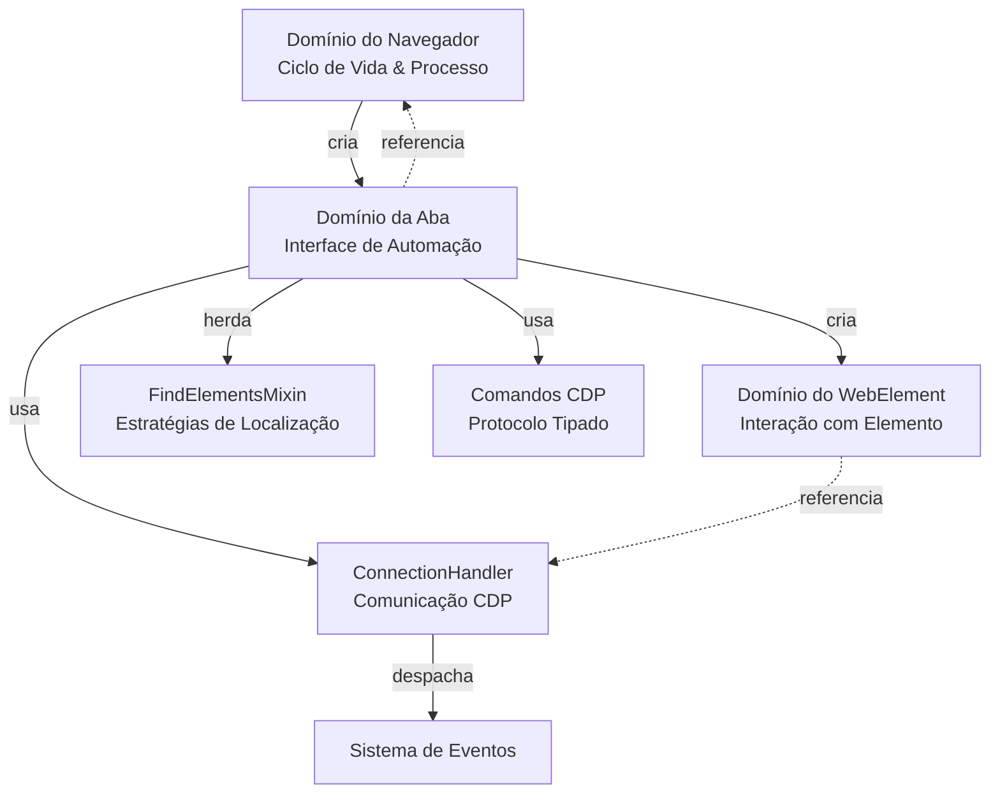

# Arquitetura do Domínio da Aba (Tab)

O domínio da Aba (Tab) é a interface principal do Pydoll para automação de navegador, atuando como uma camada de orquestração que integra múltiplos domínios CDP em uma API coesa. Este documento explora sua arquitetura interna, padrões de design e as decisões de engenharia que moldam seu comportamento.

!!! info "Uso Prático"
    Para exemplos de uso e padrões práticos, consulte o [Guia de Gerenciamento de Abas](../features/automation/tabs.md).

## Visão Geral da Arquitetura

A classe `Tab` serve como uma **façade (fachada)** sobre o Chrome DevTools Protocol, abstraindo a complexidade da coordenação de múltiplos domínios em uma interface unificada.

### Estrutura de Componentes

| Componente | Relacionamento | Propósito |
|-----------|-------------|---------|
| **Tab** | Classe principal | Interface de automação primária |
| ↳ **ConnectionHandler** | Composição (própria) | Comunicação WebSocket com CDP |
| ↳ **Browser** | Referência (pai) | Acesso ao estado e configuração em nível de navegador |
| ↳ **FindElementsMixin** | Herança | Capacidades de localização de elementos |
| ↳ **WebElement** | Fábrica (cria) | Representações individuais de elementos DOM |

### Integração de Domínio CDP

O `ConnectionHandler` roteia operações da Aba (Tab) para múltiplos domínios CDP:

```
Métodos da Aba            Domínio CDP          Propósito
━━━━━━━━━━━━━━━━━━━━━━━━━━━━━━━━━━━━━━━━━━━━━━━━━━━━━━━━━━━━━━━
go_to(), refresh()     →   Page            →  Navegação & ciclo de vida
execute_script()       →   Runtime         →  Execução JavaScript
find(), query()        →   Runtime/DOM     →  Localização de elementos
get_cookies()          →   Storage         →  Estado da sessão
enable_network_events()→   Network         →  Monitoramento de tráfego
enable_fetch_events()  →   Fetch           →  Interceptação de requisição
```

### Responsabilidades Principais

1. **Roteamento de Comandos CDP**: Traduz operações de alto nível em comandos CDP específicos do domínio
2. **Gerenciamento de Estado**: Rastreia domínios habilitados, callbacks ativos e estado da sessão
3. **Coordenação de Eventos**: Faz a ponte entre eventos CDP e callbacks definidos pelo usuário
4. **Fábrica de Elementos**: Cria instâncias de `WebElement` a partir de strings `objectId` do CDP
5. **Gerenciamento do Ciclo de Vida**: Lida com limpeza e desalocação de recursos

## Composição vs. Herança: O FindElementsMixin

Uma decisão arquitetural chave no domínio da Aba é **herdar de `FindElementsMixin`** em vez de usar composição:

```python
class Tab(FindElementsMixin):
    def __init__(self, ...):
        self._connection_handler = ConnectionHandler(...)
        # Métodos do Mixin agora estão disponíveis na Aba
```

**Por que herança aqui?**

| Abordagem | Prós | Contras | Escolha do Pydoll |
|----------|------|------|-----------------|
| **Herança** | API limpa (`tab.find()`), compatibilidade de tipo | Acoplamento forte | Usado |
| Composição | Baixo acoplamento, flexível | Verboso (`tab.finder.find()`), sobrecarga de wrapper | Não usado |

**Justificativa:** O padrão mixin se justifica porque:

- A localização de elementos é **central para a identidade da Aba** (toda aba pode encontrar elementos)
- O mixin é **sem estado (stateless)** - ele requer apenas `_connection_handler` (injeção de dependência via duck typing)
- A ergonomia da API importa - `tab.find()` é mais intuitivo do que `tab.elements.find()`

Veja a [Análise Profunda do FindElements Mixin](./find-elements-mixin.md) para detalhes arquiteturais.

## Arquitetura de Gerenciamento de Estado

A classe Tab gerencia **múltiplas camadas de estado**:

###  1. Flags de Habilitação de Domínio

```python
class Tab:
    def __init__(self, ...):
        self._page_events_enabled = False
        self._network_events_enabled = False
        self._fetch_events_enabled = False
        self._dom_events_enabled = False
        self._runtime_events_enabled = False
        self._intercept_file_chooser_dialog_enabled = False
```

**Por que flags explícitas?**

- **Idempotência**: Chamar `enable_page_events()` duas vezes não registra duplamente
- **Inspeção de estado**: Propriedades como `tab.page_events_enabled` expõem o estado atual
- **Rastreamento de limpeza**: Sabe quais domínios precisam ser desabilitados no fechamento da aba

**Alternativa (não usada):** Consultar o CDP sobre domínios habilitados a cada verificação → Muito lento, adiciona latência.

### 2. Identidade do Alvo (Target)

```python
self._target_id: str              # Identificador CDP único
self._browser_context_id: Optional[str]  # Contexto de isolamento
self._connection_port: int        # Porta WebSocket
```

**Decisão de design:** `target_id` é o **identificador primário**, não a instância da Aba em si. Isso permite:

- **Registro de Abas em nível de Navegador**: `Browser._tabs_opened[target_id] = tab`
- **Padrão Singleton**: O mesmo `target_id` sempre retorna a mesma instância de `Tab`
- **Reutilização de conexão**: Múltiplas operações na mesma aba compartilham o WebSocket

### 3. Estado Específico de Funcionalidades

```python
self._cloudflare_captcha_callback_id: Optional[int] = None  # Para limpeza
self._request: Optional[Request] = None  # Inicialização preguiçosa (lazy)
```

**Padrão de inicialização preguiçosa (lazy):** `Request` é criado apenas quando `tab.request` é acessado:

```python
@property
def request(self) -> Request:
    if self._request is None:
        self._request = Request(self)
    return self._request
```

**Por que preguiçosa (lazy)?** A maioria das automações não usa requisições HTTP no contexto do navegador. Economiza memória e tempo de inicialização.


## Execução JavaScript: Arquitetura de Contexto Duplo

O método `execute_script()` implementa **polimorfismo de contexto** - mesma interface, diferentes comandos CDP:

| Contexto | Método CDP | Caso de Uso |
|---------|-----------|----------|
| Global (sem elemento) | `Runtime.evaluate` | `document.title`, scripts globais |
| Vinculado ao elemento | `Runtime.callFunctionOn` | Operações específicas do elemento |

**Decisão arquitetural chave:** Autodetectar o modo de execução com base na presença do parâmetro `element`, eliminando APIs separadas (`evaluate()` vs. `call_function_on()`).

**Pipeline de transformação de script:**

1. Substitui `argument` → `this` (compatibilidade com Selenium)
2. Detecta se o script já está encapsulado em `function() { }`
3. Encapsula se necessário: `script` → `function() { script }`
4. Roteia para o comando CDP apropriado

**Por que a palavra-chave `argument`?** Caminho de migração para usuários do Selenium, familiaridade da API.

!!! info "Uso Prático"
    Veja [Interações Humanizadas](../features/automation/human-interactions.md) para padrões de execução de script do mundo real.

## Integração com o Sistema de Eventos

A Aba (Tab) atua como um **wrapper (invólucro) fino** sobre o sistema de eventos do ConnectionHandler, mas adiciona uma camada importante: **execução de callback não-bloqueante**.

```python
async def on(self, event_name: str, callback: Callable, temporary: bool = False) -> int:
    # Encapsula callbacks assíncronos para executar em background
    async def callback_wrapper(event):
        asyncio.create_task(callback(event))
    
    if asyncio.iscoroutinefunction(callback):
        function_to_register = callback_wrapper  # Wrapper não-bloqueante
    else:
        function_to_register = callback  # Callbacks síncronos executam diretamente
    
    # Delega o registro ao ConnectionHandler
    return await self._connection_handler.register_callback(
        event_name, function_to_register, temporary
    )
```

**Papel arquitetural:** A Aba fornece registro de eventos com escopo de aba e semântica de execução não-bloqueante, enquanto o ConnectionHandler lida com os mecanismos internos do WebSocket e a invocação sequencial de callbacks.

**Principais características:**

- **Execução em background** via `asyncio.create_task()` para callbacks assíncronos (disparar e esquecer)
- **Autodetecção de callback síncrono/assíncrono**
- **Callbacks temporários** para manipuladores de uso único
- **ID de Callback** para remoção explícita

**Modelo de execução:**

| Camada | Comportamento | Propósito |
|-------|----------|---------|
| **Callback do usuário** | Executa em tarefa de background | Nunca bloqueia outros callbacks ou comandos CDP |
| **Wrapper da Aba** | `create_task(callback())` | Inicia tarefa de background, retorna imediatamente |
| **EventsManager** | `await wrapper()` | Invoca wrappers sequencialmente para o mesmo evento |

**Por que o wrapper?** Sem ele, um callback assíncrono lento bloquearia outros callbacks para o mesmo evento. O wrapper `create_task` garante que todos os callbacks iniciem "simultaneamente" (em tarefas separadas), impedindo que um callback lento atrase os outros.

!!! info "Arquitetura Detalhada"
    Veja a [Análise Profunda da Arquitetura de Eventos](./event-architecture.md) para mecanismos internos de roteamento de eventos e o padrão de invocação sequencial do EventsManager.
    
    **Uso prático:** [Guia do Sistema de Eventos](../features/advanced/event-system.md)

## Estado da Sessão: Gerenciamento de Cookies

**Separação arquitetural:** Cookies são roteados para o **domínio Storage** (manipulação), não para o domínio Network (observação).

```python
async def set_cookies(self, cookies: list[CookieParam]):
    return await self._execute_command(
        StorageCommands.set_cookies(cookies, self._browser_context_id)
    )
```

**Design consciente de contexto:** O parâmetro `browser_context_id` garante o isolamento de cookies, permitindo automação multi-conta.

!!! info "Gerenciamento Prático de Cookies"
    Veja o [Guia de Cookies & Sessões](../features/browser-management/cookies-sessions.md) para padrões de uso e estratégias anti-detecção.

## Captura de Conteúdo: Restrições de Alvo (Target) CDP

**Limitação crítica:** `Page.captureScreenshot` só funciona em **alvos (targets) de nível superior**. Abas de Iframe falham silenciosamente (sem campo `data` na resposta).

```python
try:
    screenshot_data = response['result']['data']
except KeyError:
    raise TopLevelTargetRequired(...)  # Guia os usuários para WebElement.take_screenshot()
```

**Implicação de design:** Antes, o Pydoll criava instâncias de Tab dedicadas para iframes. Com o novo modelo, toda interação acontece no próprio `WebElement`, então capturas e outros utilitários devem ser executados nos elementos internos (por exemplo, `await iframe_element.find(...).take_screenshot()`).

**Geração de PDF:** `Page.printToPDF` retorna dados codificados em base64. O Pydoll abstrai a E/S (I/O) de arquivo, mas os dados subjacentes são sempre base64 (especificação CDP).

!!! info "Uso Prático"
    Veja o [Guia de Screenshots & PDFs](../features/automation/screenshots-and-pdfs.md) para parâmetros, formatos e exemplos do mundo real.

## Monitoramento de Rede: Design com Estado (Stateful)

**Princípio arquitetural:** Métodos de rede exigem **estado habilitado** - verificações em tempo de execução impedem o acesso a dados inexistentes.

**Separação de armazenamento:**

- **Logs**: Armazenados em buffer no `ConnectionHandler` (recebe todos os eventos CDP)
- **Aba (Tab)**: Consulta o manipulador, sem armazenamento duplicado
- **Corpos de resposta (Response bodies)**: Recuperados sob demanda via `Network.getResponseBody(requestId)`

**Restrição de tempo crítica:** Corpos de resposta devem ser buscados **dentro de ~30s** após a resposta (coleta de lixo do navegador).

!!! info "Monitoramento de Rede na Prática"
    Veja o [Guia de Monitoramento de Rede](../features/network/monitoring.md) para rastreamento abrangente de eventos e padrões de análise.
    
    **Interceptação de requisições:** [Guia de Interceptação de Requisições](../features/network/interception.md)

## Gerenciamento de Diálogos: Padrão de Captura de Evento

**Comportamento crítico do CDP:** Diálogos JavaScript **bloqueiam todos os comandos CDP** até serem tratados.

**Solução arquitetural:** O `ConnectionHandler` captura eventos `Page.javascriptDialogOpening` imediatamente, evitando que a automação trave.

```python
# O Manipulador (Handler) armazena o evento de diálogo antes que o código do usuário rode
self._connection_handler.dialog  # Capturado pelo manipulador
# A Aba (Tab) consulta o evento armazenado
async def has_dialog(self) -> bool:
    return bool(self._connection_handler.dialog)
```

**Por que esse design?** O evento dispara antes que os callbacks do usuário sejam executados. Sem captura imediata, a automação entraria em impasse (deadlock) aguardando respostas CDP bloqueadas.

## Arquitetura de IFrame: Padrão de Reutilização de Aba

**Insight chave:** IFrames são **alvos (targets) CDP de primeira classe** → Representados como instâncias de `Tab`.

**Algoritmo de resolução de alvo:**

1. Extrai o atributo `src` do elemento iframe
2. Consulta todos os alvos CDP via `Target.getTargets()`
3. Corresponde a URL do iframe ao `targetId` do alvo
4. Verifica o registro singleton (`Browser._tabs_opened`)
5. Retorna a instância existente ou cria + registra uma nova Aba (Tab)

**Tradeoff (compromisso) de design:** Abas de Iframe herdam todos os métodos da Aba (Tab), mas alguns falham (ex: `take_screenshot()`). A alternativa (classe `IFrame` dedicada) duplicaria 90% da API para um benefício mínimo.

!!! info "Trabalhando com IFrames"
    Veja o [Guia de Interação com IFrame](../features/automation/iframes.md) para padrões práticos, frames aninhados e armadilhas comuns.

## Gerenciadores de Contexto: Limpeza Automática de Recursos

**Padrão arquitetural:** Restauração de estado + aquisição otimista de recursos.

### Principais Gerenciadores de Contexto

| Gerenciador | Padrão | Característica Chave |
|---------|---------|-------------|
| `expect_file_chooser()` | Restauração de estado | Restaura a habilitação do domínio ao sair |
| `expect_download()` | Recursos temporários | Limpeza automática de diretórios temporários |

**Design do Seletor de Arquivo (File Chooser):**

- Habilita domínios necessários (`Page`, interceptação de seletor de arquivo)
- Registra **callback temporário** (auto-remove após o primeiro disparo)
- Restaura o estado original ao sair (se os domínios estavam desabilitados antes, desabilita novamente)

**Design do Manipulador de Download:**

- Cria diretório temporário (ou usa o caminho fornecido)
- Usa `asyncio.Future` para coordenação (`will_begin_future`, `done_future`)
- Configuração em nível de navegador (downloads são por contexto, não por aba)
- Limpeza garantida via bloco `finally`

!!! info "Operações Práticas de Arquivo"
    Veja o [Guia de Operações de Arquivo](../features/automation/file-operations.md) para padrões de upload, uso do seletor de arquivos e manipulação de downloads.

## Ciclo de Vida: Fechamento e Invalidação da Aba

**Cascata de fechamento da aba:**

1. CDP fecha a aba do navegador (`Page.close`)
2. A Aba (Tab) desregistra-se de `Browser._tabs_opened`
3. O WebSocket fecha automaticamente (alvo CDP destruído)
4. Callbacks de evento sofrem coleta de lixo (garbage-collected)

**Comportamento pós-fechamento:** A instância da Aba se torna **inválida** - operações futuras falharão (WebSocket fechado).

**Decisão de design:** Sem flag `_closed` explícita. Os usuários gerenciam o ciclo de vida. A alternativa (rastreamento de estado) adiciona sobrecarga (overhead) para um benefício marginal de segurança.

## Principais Decisões Arquiteturais

### Estratégia de WebSocket por Aba

**Design escolhido:** Cada Aba (Tab) cria seu próprio ConnectionHandler com uma conexão WebSocket dedicada para `ws://localhost:port/devtools/page/{targetId}`.

**Justificativa:**

O CDP suporta **dois modelos de conexão**:

1. **Nível de Navegador**: Conexão única para `ws://localhost:port/devtools/browser/...` (usada pela instância do Navegador)
2. **Nível de Aba**: Conexões por aba para `ws://localhost:port/devtools/page/{targetId}` (usadas pelas instâncias de Aba)

O Pydoll usa **ambos**:

- O **Navegador (Browser)** tem seu próprio ConnectionHandler para operações em todo o navegador (contextos, downloads, eventos em nível de navegador)
- **Cada Aba (Tab)** tem seu próprio ConnectionHandler para operações específicas da aba (navegação, localização de elementos, eventos de aba)

**Benefícios de WebSockets por aba:**

- **Paralelismo verdadeiro**: Múltiplas abas podem executar comandos CDP simultaneamente sem esperar
- **Fluxos de eventos independentes**: Cada aba recebe apenas seus próprios eventos (sem necessidade de filtragem)
- **Falhas isoladas**: Problemas de conexão em uma aba não afetam outras
- **Roteamento simplificado**: Sem necessidade de demultiplexar mensagens por targetId

**Tradeoff (Compromisso):** Mais conexões abertas (uma por aba), mas o CDP e os navegadores lidam com isso eficientemente. Para 10 abas, são 11 conexões no total (1 navegador + 10 abas), o que é insignificante comparado às conexões HTTP que as próprias abas criam.

!!! info "Comunicação Navegador vs. Aba"
    Veja a [Arquitetura do Domínio do Navegador](./browser-domain.md) para detalhes sobre o ConnectionHandler em nível de navegador e como funciona a coordenação Navegador/Aba.

### Necessidade da Referência ao Navegador

**Por que a Aba armazena a referência `_browser`:**
- Consultas de contexto (`browser_context_id` para cookies)
- Operações em nível de navegador (comportamento de download, registro de iframe)
- Acesso à configuração (`browser.options.page_load_state`)

### Escolhas de Design da API

| Escolha | Justificativa |
|--------|-----------|
| **Propriedades Assíncronas** (`current_url`, `page_source`) | Sinaliza dados ao vivo + custo CDP |
| **Métodos `enable`/`disable` separados** | Explícito sobre implícito, corresponde à nomenclatura CDP |
| **Sem flag `_closed`** | Usuários gerenciam ciclo de vida, reduz sobrecarga |
| **Palavra-chave `argument` em scripts** | Compatibilidade com Selenium, caminho de migração |

## Relacionamento com Outros Domínios

O domínio da Aba (Tab) fica no **centro** da arquitetura do Pydoll:



**Relacionamentos chave:**

1. **Navegador → Aba**: Pai-filho. O Navegador gerencia o ciclo de vida da Aba e o estado compartilhado.
2. **Aba → ConnectionHandler**: Composição. A Aba delega a comunicação CDP.
3. **Aba → WebElement**: Fábrica. A Aba cria elementos a partir de strings `objectId`.
4. **Aba ← FindElementsMixin**: Herança. A Aba ganha métodos de localização de elementos.
5. **Aba ↔ Navegador**: Referência bidirecional. A Aba consulta o navegador para informações de contexto.

## Resumo: Filosofia de Design

O domínio da Aba (Tab) prioriza a **ergonomia da API** e a **correção (correctness)** sobre micro-otimizações:

- **Padrão Façade** abstrai a complexidade do CDP
- **Gerenciamento de estado** via flags explícitas previne habilitação dupla
- **Gerenciamento de recursos** através de gerenciadores de contexto
- **Coordenação de eventos** com execução em background (não-bloqueante)

**Principais tradeoffs (compromissos):**

| Decisão | Benefício | Custo | Veredito |
|----------|---------|------|---------|
| WebSocket por aba | Paralelismo verdadeiro | Mais conexões | Justificado |
| Herdar FindElementsMixin | API limpa | Acoplamento forte | Justificado |
| Inicialização preguiçosa (lazy) de Request | Eficiência de memória | Sobrecarga (overhead) de propriedade | Justificado |

## Leitura Adicional

**Guias práticos:**

- [Gerenciamento de Abas](../features/automation/tabs.md) - Padrões multi-aba, ciclo de vida, concorrência
- [Localização de Elementos](../features/element-finding.md) - Seletores e travessia do DOM
- [Sistema de Eventos](../features/advanced/event-system.md) - Monitoramento de navegador em tempo real

**Análises profundas de arquitetura:**

- [Arquitetura de Eventos](./event-architecture.md) - Mecanismos internos de WebSocket e roteamento de eventos
- [FindElements Mixin](./find-elements-mixin.md) - Algoritmos de resolução de seletores
- [Domínio do Navegador](./browser-domain.md) - Gerenciamento de processos e contextos