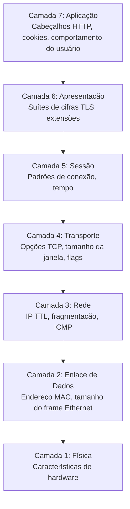
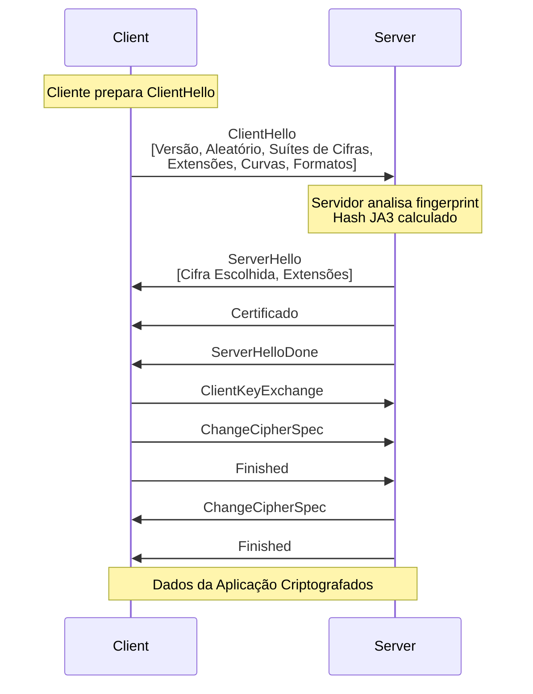

# Fingerprinting em Nível de Rede

Este documento explora o fingerprinting no nível do protocolo de rede, desde características TCP/IP até padrões de handshake TLS. Entender como os dispositivos são identificados **antes mesmo do navegador carregar** é crucial para evadir sistemas de detecção sofisticados.

!!! info "Navegação do Módulo"
    - **[← Visão Geral de Fingerprinting](./index.md)** - Introdução e filosofia do módulo
    - **[→ Browser Fingerprinting (Fingerprinting de Navegador)](./browser-fingerprinting.md)** - Fingerprinting na camada de aplicação
    - **[→ Técnicas de Evasão](./evasion-techniques.md)** - Contramedidas práticas
    
    Para fundamentos de rede, veja **[Fundamentos de Rede](../network/network-fundamentals.md)** e **[Arquitetura de Proxy](../network/http-proxies.md)**.

!!! warning "Características em Nível de SO"
    O fingerprinting de rede opera nas camadas 3-6 do modelo OSI. Diferente das características em nível de navegador (modificáveis com JavaScript), os fingerprints em nível de rede exigem mudanças em **nível de SO** ou **nível de kernel** para serem falsificados (spoofed) eficazmente.

## Fingerprinting em Nível de Rede

O fingerprinting de rede opera nas camadas 3-7 do modelo OSI, analisando características de pacotes de rede, protocolos e conexões para identificar o cliente.

### Por que o Fingerprinting de Rede Importa

Diferente do fingerprinting em nível de navegador (que pode ser modificado com JavaScript), as características em nível de rede são:

- **Mais difíceis de modificar**: Exigem mudanças em nível de SO ou kernel
- **Mais persistentes**: Não podem ser limpas como cookies ou localStorage
- **Transversais a aplicações**: Mesmo fingerprint em todas as aplicações no dispositivo
- **Resistentes a proxy**: Algumas características sobrevivem ao tunelamento de proxy/VPN

!!! info "Fingerprinting em Camadas"
    Sistemas de detecção sofisticados usam **múltiplas camadas** de fingerprinting. Mesmo que você falsifique características em nível de navegador, inconsistências em nível de rede podem revelar a automação.

### O Modelo OSI e as Camadas de Fingerprinting



**O fingerprinting ocorre em:**

- **Camada 3 (Rede)**: IP TTL, comportamento de fragmentação
- **Camada 4 (Transporte)**: Opções TCP/UDP, números de sequência iniciais, escalonamento de janela
- **Camada 6 (Apresentação)**: Handshake TLS, suítes de cifras, extensões
- **Camada 7 (Aplicação)**: Cabeçalhos HTTP, configurações HTTP/2, comportamento específico do protocolo

## Fingerprinting de TCP/IP (Camada 3-4)

O fingerprinting de TCP/IP analisa características de pacotes TCP e IP para identificar o sistema operacional e a implementação da pilha de rede.

### Estrutura do Pacote TCP

```python
# Campos do cabeçalho TCP usados para fingerprinting
{
    'ip_ttl': 64,                    # Valor TTL inicial (específico do SO)
    'window_size': 65535,            # Tamanho da janela TCP
    'window_scaling': 7,             # Fator de escala da janela
    'mss': 1460,                     # Tamanho Máximo do Segmento
    'timestamp': True,               # Opção de timestamp TCP
    'sack': True,                    # Acusação Seletiva (SACK)
    'options_order': ['MSS', 'SACK_PERM', 'TIMESTAMP', 'NOP', 'WSCALE']
}
```

### Características Chave de TCP/IP

#### 1. Time To Live (TTL)

Valores de TTL são específicos do SO e diminuem a cada salto na rede:

| Sistema Operacional | TTL Inicial | Após 10 Saltos |
|---|---|---|
| **Linux** | 64 | 54 |
| **Windows** | 128 | 118 |
| **macOS** | 64 | 54 |
| **Cisco/Roteadores** | 255 | 245 |

```python
# Fingerprinting de TTL
def detect_os_by_ttl(ttl: int) -> str:
    """
    Detecta SO com base no valor TTL.
    Nota: TTL diminui em 1 para cada salto de roteador.
    """
    if ttl <= 64:
        return 'Linux/macOS (inicial: 64)'
    elif ttl <= 128:
        return 'Windows (inicial: 128)'
    elif ttl <= 255:
        return 'Dispositivo de rede (inicial: 255)'
    else:
        return 'Desconhecido'

# Exemplo: TTL Recebido = 54
# → TTL Original provável 64 (Linux/macOS)
# → Pacote viajou por ~10 saltos
```

!!! warning "TTL e Proxies"
    Ao usar proxies, o valor TTL é resetado no servidor proxy. No entanto, inconsistências podem revelar o uso de proxy:
    
    - User-Agent diz "Windows" → TTL sugere Linux (SO do servidor proxy)
    - TTL muito baixo para a localização alegada (sugere roteamento VPN/proxy)

#### 2. Tamanho da Janela TCP (Window Size)

O tamanho inicial da janela TCP varia por SO e configuração:

```python
# Tamanhos de janela comuns por SO
OS_WINDOW_SIZES = {
    'Windows 10': 8192,          # Padrão
    'Windows 11': 65535,         # Mais agressivo
    'Linux (recente)': 29200,     # Kernels modernos
    'macOS': 65535,              # Otimista
    'Android': 65535,            # Otimizado para móvel
}
```

#### 3. Opções TCP e Sua Ordem

A presença e a **ordem** das opções TCP criam um fingerprint único:

```python
# Exemplo de opções TCP em pacote SYN
{
    # Ordem típica do Windows 10
    'windows': ['MSS', 'NOP', 'WSCALE', 'NOP', 'NOP', 'SACK_PERM'],
    
    # Ordem típica do Linux  
    'linux': ['MSS', 'SACK_PERM', 'TIMESTAMP', 'NOP', 'WSCALE'],
    
    # Ordem típica do macOS
    'macos': ['MSS', 'NOP', 'WSCALE', 'NOP', 'NOP', 'TIMESTAMP', 'SACK_PERM', 'EOL']
}
```

**Códigos de Opção TCP:**

| Código | Nome | Propósito |
|---|---|---|
| 0 | EOL | Fim da Lista de Opções |
| 1 | NOP | Nenhuma Operação (preenchimento) |
| 2 | MSS | Tamanho Máximo do Segmento |
| 3 | WSCALE | Fator de Escala da Janela |
| 4 | SACK_PERM | SACK Permitido |
| 8 | TIMESTAMP | Timestamp para cálculo de RTT |

### Fingerprinting Passivo de SO com p0f

[p0f](http://lcamtuf.coredump.cx/p0f3/) é uma poderosa ferramenta passiva de fingerprinting de SO criada por Michal Zalewski que analisa características de pacotes TCP/IP sem enviar qualquer tráfego para o alvo.

```bash
# Instalar p0f
sudo apt-get install p0f

# Fingerprinting passivo (lê da interface)
sudo p0f -i eth0

# Ler de arquivo pcap
p0f -r capture.pcap

# Exemplo de saída:
# 192.168.1.100:12345 → 93.184.216.34:443
#   OS: Linux 3.11 and newer
#   Signature: 4:64:0:*:mss*20,10:mss,sok,ts,nop,ws:df,id+:0
```

!!! info "Banco de Dados de Assinaturas do p0f"
    O p0f mantém um extenso banco de dados de assinaturas (`p0f.fp`) com milhares de fingerprints de SO. A ferramenta é particularmente eficaz porque realiza fingerprinting **passivo**, analisando tráfego sem gerar pacotes que possam alertar sistemas de detecção de intrusão.

**Formato da Assinatura p0f:**

```
version:ittl:olen:mss:wsize,scale:olayout:quirks:pclass
```

- `version`: Versão IP (4 ou 6)
- `ittl`: TTL Inicial
- `olen`: Comprimento das opções
- `mss`: Tamanho Máximo do Segmento
- `wsize,scale`: Tamanho da janela e escalonamento
- `olayout`: Layout das opções (ordem e tipos)
- `quirks`: Comportamentos incomuns (df=não fragmentar, id+=ID de IP não-zero)
- `pclass`: Classificação do payload

### Fingerprinting Ativo de SO com Nmap

[Nmap](https://nmap.org/) (Network Mapper) é o padrão de facto para fingerprinting ativo de SO, desenvolvido por Gordon Lyon (Fyodor). Ele envia pacotes especialmente criados e analisa as respostas para determinar características do SO.

```bash
# Detecção de SO
nmap -O 93.184.216.34

# Detecção detalhada de SO com varredura de versão
nmap -A 93.184.216.34

# Apenas fingerprinting TCP/IP
nmap -sV --script=banner 93.184.216.34

# Exemplo de saída:
# OS details: Linux 5.4 - 5.10
# Network Distance: 11 hops
# TCP Sequence Prediction: Difficulty=260 (Good luck!)
```

**Testes de Detecção de SO do Nmap:**

- **Amostragem de ISN TCP**: Analisa a geração do Número de Sequência Inicial
- **Opções TCP**: Testa tamanho da janela, MSS, SACK e ordem das opções
- **Respostas ICMP**: Envia requisições echo e analisa TTL, código e payloads
- **Respostas TCP de porta fechada**: Envia pacotes para portas fechadas e analisa respostas RST
- **Sequência de ID de IP**: Testa como o SO gera campos de identificação IP

!!! tip "Banco de Dados de Fingerprint do Nmap"
    O Nmap mantém um dos mais abrangentes bancos de dados de fingerprint de SO do mundo (`nmap-os-db`), atualizado regularmente pela comunidade. Você pode submeter novos fingerprints para melhorar a precisão da detecção.

### Implementação Python: Fingerprinting TCP

A implementação a seguir usa [Scapy](https://scapy.net/), uma poderosa biblioteca Python para manipulação de pacotes e análise de rede criada por Philippe Biondi.

```python
from scapy.all import IP, TCP, sr1, sniff
import logging

logging.basicConfig(level=logging.INFO)
logger = logging.getLogger(__name__)


class TCPFingerprinter:
    """
    Analisa características TCP/IP para aplicar fingerprinting no host remoto.
    """
    
    def __init__(self, target_ip: str, target_port: int = 80):
        self.target_ip = target_ip
        self.target_port = target_port
        self.fingerprint = {}
    
    def capture_syn_ack(self) -> dict:
        """
        Envia pacote SYN e captura resposta SYN-ACK.
        """
        # Cria pacote SYN
        ip = IP(dst=self.target_ip)
        syn = TCP(sport=40000, dport=self.target_port, flags='S', seq=1000)
        
        # Envia e recebe
        logger.info(f"Enviando SYN para {self.target_ip}:{self.target_port}")
        syn_ack = sr1(ip/syn, timeout=2, verbose=0)
        
        if not syn_ack or not syn_ack.haslayer(TCP):
            logger.error("Nenhum SYN-ACK recebido")
            return {}
        
        # Extrai características do fingerprint
        tcp_layer = syn_ack.getlayer(TCP)
        ip_layer = syn_ack.getlayer(IP)
        
        fingerprint = {
            'ip_ttl': ip_layer.ttl,
            'ip_id': ip_layer.id,
            'ip_flags': ip_layer.flags,
            'tcp_window': tcp_layer.window,
            'tcp_flags': tcp_layer.flags,
            'tcp_options': self._parse_tcp_options(tcp_layer.options),
            'tcp_options_order': [opt[0] for opt in tcp_layer.options if opt[0] != 'Padding'],
        }
        
        self.fingerprint = fingerprint
        return fingerprint
    
    def _parse_tcp_options(self, options: list) -> dict:
        """Analisa opções TCP para um formato legível."""
        parsed = {}
        
        for option in options:
            opt_name = option[0]
            
            if opt_name == 'MSS':
                parsed['mss'] = option[1]
            elif opt_name == 'WScale':
                parsed['window_scale'] = option[1]
            elif opt_name == 'Timestamp':
                parsed['timestamp'] = option[1]
            elif opt_name == 'SAckOK':
                parsed['sack_permitted'] = True
            elif opt_name == 'NOP':
                pass  # Preenchimento
            elif opt_name == 'EOL':
                break  # Fim das opções
        
        return parsed
    
    def generate_signature(self) -> str:
        """
        Gera string de assinatura similar ao p0f.
        """
        if not self.fingerprint:
            return ''
        
        fp = self.fingerprint
        
        # Formato: version:ttl:window:options_order
        version = 4  # IPv4
        ttl = fp.get('ip_ttl', 0)
        window = fp.get('tcp_window', 0)
        
        # Ordem das opções como string
        opts = ','.join(fp.get('tcp_options_order', []))
        
        signature = f"{version}:{ttl}:{window}:{opts}"
        return signature
    
    def detect_os(self) -> str:
        """
        Detecta SO com base no fingerprint coletado.
        """
        if not self.fingerprint:
            return 'Desconhecido (sem dados)'
        
        ttl = self.fingerprint.get('ip_ttl', 0)
        window = self.fingerprint.get('tcp_window', 0)
        opts_order = self.fingerprint.get('tcp_options_order', [])
        
        # Detecção simples baseada em heurística
        if ttl <= 64:
            if window == 29200:
                return 'Linux (kernel recente)'
            elif window == 65535:
                if 'Timestamp' in opts_order and 'SAckOK' in opts_order:
                    return 'Linux 3.x+'
                else:
                    return 'macOS'
            else:
                return 'Linux/Unix'
        
        elif ttl <= 128:
            if window == 8192:
                return 'Windows 10'
            elif window == 65535:
                return 'Windows 11 ou Windows Server'
            else:
                return 'Windows'
        
        elif ttl <= 255:
            return 'Dispositivo de rede (roteador/firewall)'
        
        return 'SO Desconhecido'
    
    def print_fingerprint(self):
        """Imprime o fingerprint de forma legível."""
        if not self.fingerprint:
            print("Nenhum dado de fingerprint disponível")
            return
        
        print("\n=== Fingerprint TCP/IP ===")
        print(f"Alvo: {self.target_ip}:{self.target_port}")
        print(f"\nCamada IP:")
        print(f"  TTL: {self.fingerprint.get('ip_ttl')}")
        print(f"  IP ID: {self.fingerprint.get('ip_id')}")
        print(f"  Flags: {self.fingerprint.get('ip_flags')}")
        
        print(f"\nCamada TCP:")
        print(f"  Tamanho da Janela: {self.fingerprint.get('tcp_window')}")
        print(f"  Flags: {self.fingerprint.get('tcp_flags')}")
        
        print(f"\nOpções TCP:")
        for opt, value in self.fingerprint.get('tcp_options', {}).items():
            print(f"  {opt}: {value}")
        
        print(f"\nOrdem das Opções: {' → '.join(self.fingerprint.get('tcp_options_order', []))}")
        print(f"\nAssinatura: {self.generate_signature()}")
        print(f"SO Detectado: {self.detect_os()}")
        print("=" * 30)


# Exemplo de uso
def fingerprint_target(ip: str, port: int = 80):
    """Aplica fingerprinting em um host alvo."""
    fingerprinter = TCPFingerprinter(ip, port)
    
    try:
        fingerprinter.capture_syn_ack()
        fingerprinter.print_fingerprint()
    except PermissionError:
        print("Erro: Acesso a raw socket requer privilégios de root/admin")
        print("Execute com: sudo python3 script.py")
    except Exception as e:
        print(f"Erro: {e}")


# Exemplo de uso (requer root):
# fingerprint_target('93.184.216.34', 80)  # example.com
```

**Exemplo de Saída:**

```
=== Fingerprint TCP/IP ===
Alvo: 93.184.216.34:80

Camada IP:
  TTL: 54
  IP ID: 0
  Flags: DF (Don't Fragment)

Camada TCP:
  Tamanho da Janela: 29200
  Flags: SA (SYN-ACK)

Opções TCP:
  mss: 1460
  window_scale: 7
  sack_permitted: True
  timestamp: (123456789, 0)

Ordem das Opções: MSS → SAckOK → Timestamp → NOP → WScale

Assinatura: 4:54:29200:MSS,SAckOK,Timestamp,NOP,WScale
SO Detectado: Linux (kernel recente)
==============================
```

### Análise do Número de Sequência Inicial (ISN) TCP

```python
def analyze_isn_randomness(target_ip: str, samples: int = 10) -> dict:
    """
    Analisa a geração do Número de Sequência Inicial TCP.
    SOs diferentes usam algoritmos diferentes de geração de ISN.
    """
    import statistics
    
    sequence_numbers = []
    
    for i in range(samples):
        syn = IP(dst=target_ip)/TCP(sport=40000+i, dport=80, flags='S')
        syn_ack = sr1(syn, timeout=2, verbose=0)
        
        if syn_ack and syn_ack.haslayer(TCP):
            isn = syn_ack[TCP].seq
            sequence_numbers.append(isn)
        
        # Pequeno atraso entre as sondagens
        time.sleep(0.1)
    
    if len(sequence_numbers) < 2:
        return {'error': 'Dados insuficientes'}
    
    # Calcular estatísticas
    deltas = [sequence_numbers[i+1] - sequence_numbers[i] 
              for i in range(len(sequence_numbers)-1)]
    
    return {
        'sample_count': len(sequence_numbers),
        'isn_values': sequence_numbers,
        'deltas': deltas,
        'avg_delta': statistics.mean(deltas),
        'stdev_delta': statistics.stdev(deltas) if len(deltas) > 1 else 0,
        'min_delta': min(deltas),
        'max_delta': max(deltas),
        'randomness': 'High' if statistics.stdev(deltas) > 100000 else 'Low'
    }
```

**Geração de ISN por SO:**

| SO | Algoritmo ISN | Previsibilidade |
|---|---|---|
| **Linux (moderno)** | [RFC 6528](https://tools.ietf.org/html/rfc6528) (baseado em hash) | Muito aleatório |
| **Windows** | RFC 6528 | Muito aleatório |
| **Linux Antigo** | Contador baseado em tempo | Um tanto previsível |
| **BSD** | [RFC 1948](https://tools.ietf.org/html/rfc1948) (baseado em MD5) | Aleatório |

!!! danger "Ataques de Previsão de ISN"
    Historicamente, ISNs previsíveis permitiram **ataques de sequestro de TCP** (veja [ataque de Mitnick, 1995](https://en.wikipedia.org/wiki/Kevin_Mitnick#Arrest,_conviction,_and_incarceration)). Sistemas modernos implementam a [RFC 6528](https://tools.ietf.org/html/rfc6528) "Defendendo contra Ataques de Número de Sequência" usando geradores de números aleatórios criptograficamente seguros para ISN, tornando a previsão computacionalmente inviável.

## Fingerprinting de TLS/SSL (Camada 6)

O fingerprinting de TLS é uma das técnicas mais poderosas para identificar clientes, já que o handshake TLS revela informações detalhadas sobre as capacidades criptográficas e a implementação do cliente.

### Visão Geral do Handshake TLS



### JA3: Fingerprinting de Cliente TLS

[JA3](https://github.com/salesforce/ja3) é um método desenvolvido por John Althouse, Jeff Atkinson e Josh Atkins na Salesforce para criar fingerprints de clientes TLS analisando o pacote ClientHello. A técnica se tornou um padrão da indústria para fingerprinting TLS.

**Componentes JA3:**

```python
# Componentes do fingerprint JA3 (em ordem)
ja3_components = {
    1: 'Versão TLS',          # ex: 771 = TLS 1.2, 772 = TLS 1.3
    2: 'Suítes de Cifras',    # ex: '49195,49199,52393'
    3: 'Extensões',           # ex: '0,10,11,13'  
    4: 'Curvas Elípticas',    # ex: '23,24,25'
    5: 'Formatos de Ponto EC', # ex: '0'
}

# Formato da string JA3 (separada por vírgulas)
ja3_string = f"{version},{ciphers},{extensions},{curves},{formats}"

# Hash JA3 (MD5 da string)
ja3_hash = hashlib.md5(ja3_string.encode()).hexdigest()
```

**Exemplo JA3:**

```
String: 771,49195-49199-52393-49196-49200-52392,0-10-11-13-65281,23-24-25,0
Hash:   579ccef312d18482fc42e2b822ca2430
```

### Gerando Fingerprints JA3 com Python

```python
import hashlib
import ssl
import socket
from typing import Optional, Dict, List


class JA3Generator:
    """
    Gera fingerprints JA3 de pacotes TLS ClientHello.
    """
    
    # Mapeamentos de Versão TLS
    TLS_VERSIONS = {
        0x0301: 'TLS 1.0',
        0x0302: 'TLS 1.1',
        0x0303: 'TLS 1.2',
        0x0304: 'TLS 1.3',
    }
    
    # Suítes de cifras comuns
    CIPHER_SUITES = {
        0x002f: 'TLS_RSA_WITH_AES_128_CBC_SHA',
        0x0035: 'TLS_RSA_WITH_AES_256_CBC_SHA',
        0xc013: 'TLS_ECDHE_RSA_WITH_AES_128_CBC_SHA',
        0xc014: 'TLS_ECDHE_RSA_WITH_AES_256_CBC_SHA',
        0xc02f: 'TLS_ECDHE_RSA_WITH_AES_128_GCM_SHA256',
        0xc02b: 'TLS_ECDHE_ECDSA_WITH_AES_128_GCM_SHA256',
        0x1301: 'TLS_AES_128_GCM_SHA256',          # TLS 1.3
        0x1302: 'TLS_AES_256_GCM_SHA384',          # TLS 1.3
        0x1303: 'TLS_CHACHA20_POLY1305_SHA256',    # TLS 1.3
    }
    
    # Extensões TLS
    EXTENSIONS = {
        0: 'server_name',
        1: 'max_fragment_length',
        5: 'status_request',
        10: 'supported_groups',
        11: 'ec_point_formats',
        13: 'signature_algorithms',
        16: 'application_layer_protocol_negotiation',
        18: 'signed_certificate_timestamp',
        23: 'extended_master_secret',
        27: 'compress_certificate',
        35: 'session_ticket',
        43: 'supported_versions',
        45: 'psk_key_exchange_modes',
        51: 'key_share',
        65281: 'renegotiation_info',
    }
    
    @staticmethod
    def parse_client_hello(client_hello_bytes: bytes) -> Dict:
        """
        Analisa o pacote ClientHello e extrai componentes JA3.
        """
        if len(client_hello_bytes) < 43:
            raise ValueError("Pacote ClientHello inválido (muito curto)")
        
        # Cabeçalho de Registro TLS (5 bytes)
        # Tipo de Conteúdo (1) | Versão (2) | Comprimento (2)
        content_type = client_hello_bytes[0]
        record_version = int.from_bytes(client_hello_bytes[1:3], 'big')
        
        # Cabeçalho do Handshake (4 bytes)
        # Tipo de Handshake (1) | Comprimento (3)
        handshake_type = client_hello_bytes[5]
        
        if handshake_type != 0x01:  # ClientHello
            raise ValueError("Não é um pacote ClientHello")
        
        # Versão do ClientHello (2 bytes no offset 9)
        client_version = int.from_bytes(client_hello_bytes[9:11], 'big')
        
        # Aleatório (32 bytes)
        offset = 11 + 32  # Pular versão + aleatório
        
        # ID da Sessão
        session_id_length = client_hello_bytes[offset]
        offset += 1 + session_id_length
        
        # Suítes de Cifras
        cipher_suites_length = int.from_bytes(client_hello_bytes[offset:offset+2], 'big')
        offset += 2
        
        cipher_suites = []
        for i in range(0, cipher_suites_length, 2):
            cipher = int.from_bytes(client_hello_bytes[offset+i:offset+i+2], 'big')
            cipher_suites.append(cipher)
        
        offset += cipher_suites_length
        
        # Métodos de Compressão
        compression_length = client_hello_bytes[offset]
        offset += 1 + compression_length
        
        # Extensões
        extensions = []
        elliptic_curves = []
        ec_point_formats = []
        
        if offset < len(client_hello_bytes) - 2:
            extensions_length = int.from_bytes(client_hello_bytes[offset:offset+2], 'big')
            offset += 2
            
            extensions_end = offset + extensions_length
            
            while offset < extensions_end:
                ext_type = int.from_bytes(client_hello_bytes[offset:offset+2], 'big')
                ext_length = int.from_bytes(client_hello_bytes[offset+2:offset+4], 'big')
                offset += 4
                
                extensions.append(ext_type)
                
                # Analisar extensões específicas
                if ext_type == 10:  # supported_groups
                    curves_length = int.from_bytes(client_hello_bytes[offset:offset+2], 'big')
                    for i in range(2, curves_length + 2, 2):
                        curve = int.from_bytes(client_hello_bytes[offset+i:offset+i+2], 'big')
                        elliptic_curves.append(curve)
                
                elif ext_type == 11:  # ec_point_formats
                    formats_length = client_hello_bytes[offset]
                    for i in range(1, formats_length + 1):
                        fmt = client_hello_bytes[offset + i]
                        ec_point_formats.append(fmt)
                
                offset += ext_length
        
        # Filtrar valores GREASE (randomizados por navegadores para prevenir ossificação)
        # GREASE (RFC 8701): Generate Random Extensions And Sustain Extensibility
        # Valores GREASE: 0x0a0a, 0x1a1a, 0x2a2a, 0x3a3a, etc.
        def is_grease(value: int) -> bool:
            return (value & 0x0f0f) == 0x0a0a
        
        cipher_suites = [c for c in cipher_suites if not is_grease(c)]
        extensions = [e for e in extensions if not is_grease(e)]
        elliptic_curves = [c for c in elliptic_curves if not is_grease(c)]
        
        return {
            'version': client_version,
            'cipher_suites': cipher_suites,
            'extensions': extensions,
            'elliptic_curves': elliptic_curves,
            'ec_point_formats': ec_point_formats,
        }
    
    @staticmethod
    def generate_ja3(parsed_hello: Dict) -> tuple[str, str]:
        """
        Gera string JA3 e hash do ClientHello analisado.
        
        Nota: Valores GREASE já devem estar filtrados de parsed_hello
        para garantir fingerprints consistentes entre conexões.
        """
        # Juntar componentes com '-'
        version = str(parsed_hello['version'])
        ciphers = '-'.join(str(c) for c in parsed_hello['cipher_suites'])
        extensions = '-'.join(str(e) for e in parsed_hello['extensions'])
        curves = '-'.join(str(c) for c in parsed_hello['elliptic_curves'])
        formats = '-'.join(str(f) for f in parsed_hello['ec_point_formats'])
        
        # String JA3 (componentes separados por vírgula)
        ja3_string = f"{version},{ciphers},{extensions},{curves},{formats}"
        
        # Hash JA3 (MD5)
        ja3_hash = hashlib.md5(ja3_string.encode()).hexdigest()
        
        return ja3_string, ja3_hash
    
    @staticmethod
    def capture_tls_handshake(hostname: str, port: int = 443) -> Optional[bytes]:
        """
        Captura o ClientHello de uma conexão TLS.
        Nota: Isso é simplificado. Para produção, use scapy ou mitmproxy.
        """
        try:
            # Cria socket mas não completa handshake
            sock = socket.socket(socket.AF_INET, socket.SOCK_STREAM)
            sock.settimeout(5)
            sock.connect((hostname, port))
            
            # Na prática, você precisaria interceptar os bytes reais enviados
            # Isso é apenas um placeholder - use ferramentas de captura de pacotes
            
            sock.close()
            return None  # Retornaria bytes do ClientHello capturado
            
        except Exception as e:
            print(f"Erro ao capturar handshake: {e}")
            return None


!!! info "Valores GREASE em TLS"
    [GREASE (RFC 8701)](https://tools.ietf.org/html/rfc8701) - "Generate Random Extensions And Sustain Extensibility" - é uma técnica usada por navegadores modernos para prevenir a ossificação do protocolo. Navegadores inserem aleatoriamente valores reservados (como 0x0a0a, 0x1a1a, 0x2a2a) em suítes de cifras, extensões e outros campos.
    
    **Por que GREASE importa para o fingerprinting:**
    
    - Esses valores mudam a cada conexão, tornando handshakes TLS brutos não determinísticos
    - Implementações JA3 devem **filtrar** valores GREASE para criar fingerprints consistentes
    - Servidores que rejeitam valores GREASE não estão em conformidade e se revelam
    - Ausência de GREASE na automação pode ser um sinal de detecção (navegadores reais sempre usam)


def analyze_ja3_from_pcap(pcap_file: str):
    """
    Analisa fingerprints JA3 de um arquivo pcap.
    Requer scapy e capacidades de parsing TLS.
    """
    from scapy.all import rdpcap, TCP
    from scapy.layers.tls.record import TLS
    from scapy.layers.tls.handshake import TLSClientHello
    
    packets = rdpcap(pcap_file)
    ja3_results = []
    
    for packet in packets:
        if packet.haslayer(TLS) and packet.haslayer(TLSClientHello):
            try:
                # Extrai camada ClientHello
                client_hello = packet[TLSClientHello]
                
                # Constrói componentes JA3
                version = client_hello.version
                ciphers = client_hello.ciphers
                extensions = [ext.type for ext in client_hello.ext] if hasattr(client_hello, 'ext') else []
                
                # Analisa extensões para curvas e formatos
                curves = []
                formats = []
                
                if hasattr(client_hello, 'ext'):
                    for ext in client_hello.ext:
                        if ext.type == 10:  # supported_groups
                            curves = ext.groups if hasattr(ext, 'groups') else []
                        elif ext.type == 11:  # ec_point_formats
                            formats = ext.formats if hasattr(ext, 'formats') else []
                
                # Gera JA3
                ja3_str = f"{version},{'-'.join(map(str, ciphers))},{'-'.join(map(str, extensions))},{'-'.join(map(str, curves))},{'-'.join(map(str, formats))}"
                ja3_hash = hashlib.md5(ja3_str.encode()).hexdigest()
                
                ja3_results.append({
                    'src_ip': packet[IP].src if packet.haslayer(IP) else 'unknown',
                    'dst_ip': packet[IP].dst if packet.haslayer(IP) else 'unknown',
                    'ja3_string': ja3_str,
                    'ja3_hash': ja3_hash,
                })
                
            except Exception as e:
                print(f"Erro ao analisar pacote: {e}")
                continue
    
    return ja3_results


# Exemplo: Hashes JA3 de navegadores conhecidos
KNOWN_JA3_FINGERPRINTS = {
    '579ccef312d18482fc42e2b822ca2430': 'Chrome 90+ no Windows',
    'cd08e31efaa7a0a82988099039d4a289': 'Firefox 88+ no Windows',
    'ac1a36f8b3f5e5d4a6e4f0c3e5a5e5e5': 'Safari 14+ no macOS',
    'b32309a26951912be7dba376398abc3b': 'Biblioteca Python requests',
    'e7d705a3286e19bd28ca826f69a8b2c9': 'curl 7.88+'

}


def identify_client(ja3_hash: str) -> str:
    """Identifica cliente com base no hash JA3."""
    return KNOWN_JA3_FINGERPRINTS.get(ja3_hash, 'Cliente desconhecido')
```

### Ferramentas para Fingerprinting TLS

#### 1. ja3 (Implementação Original)

A [implementação original JA3 da Salesforce](https://github.com/salesforce/ja3) fornece ferramentas para gerar fingerprints de arquivos pcap.

```bash
# Instalar ja3
git clone https://github.com/salesforce/ja3.git
cd ja3/python

# Gerar JA3 do pcap
python3 ja3.py -a capture.pcap

# Saída:
# [JA3] 192.168.1.100:12345 → 93.184.216.34:443
# JA3: 579ccef312d18482fc42e2b822ca2430
# JA3S: e35df3e00ca4ef31d42b34bebaa2f86e
```

#### 2. pmercury (Biblioteca Python)

[pmercury](https://pypi.org/project/pmercury/) é uma biblioteca Python da Cisco para fingerprinting de rede, incluindo análise TLS.

```bash
# Instalar
pip install pmercury

# Usar em Python
from pmercury.protocols.tls import TLS

tls = TLS()
protocol_type, fp_str, approx_str, server_name = tls.fingerprint(data)
```

#### 3. ts1-signatures (Fingerprinting TLS/HTTP2 Avançado)

[ts1-signatures](https://pypi.org/project/ts1-signatures/) fornece fingerprinting mais detalhado com formato de saída JSON.

```bash
# Instalar
pip install ts1-signatures

# Usar em Python
import ts1

with open("capture.pcap", "rb") as pcap:
    for tls_client in ts1.tls.process_pcap(pcap):
        signature = tls_client["signature"]
        print(f"TLS Fingerprint: {signature.hash().hexdigest()}")
```

#### 4. tlsfp (Servidor Educacional de Fingerprint TLS)

[tlsfp](https://github.com/elpy1/tlsfp) é um servidor HTTPS Python para fingerprinting TLS, útil para testes e educação.

```bash
# Instalar
git clone https://github.com/elpy1/tlsfp.git
cd tlsfp
python3 tlsfp.py

# Acesse https://localhost:8443 para ver o fingerprint do seu cliente
```

#### 5. curl-impersonate

[curl-impersonate](https://github.com/lwthiker/curl-impersonate) permite imitar fingerprints TLS de navegadores, útil para entender técnicas de evasão.

```bash
# Instalar (exemplo para Chrome)
wget https://github.com/lwthiker/curl-impersonate/releases/...
chmod +x curl-impersonate-chrome

# Fazer requisição imitando fingerprint TLS do Chrome
./curl-impersonate-chrome https://example.com
```

!!! tip "Wireshark com JA3"
    O Wireshark pode exibir hashes JA3 com o [plugin JA3](https://github.com/salesforce/ja3/tree/master/wireshark). Isso permite análise de fingerprint em tempo real durante a captura de pacotes.

### JA3S: Fingerprinting de Servidor TLS

JA3S é o equivalente do lado do servidor, aplicando fingerprinting em servidores com base no ServerHello:

```python
def generate_ja3s(server_hello_bytes: bytes) -> tuple[str, str]:
    """
    Gera fingerprint JA3S do ServerHello.
    Formato: Versão,Cifra,Extensões
    """
    # Analisa ServerHello (similar à análise do ClientHello)
    version = parse_version(server_hello_bytes)
    cipher = parse_selected_cipher(server_hello_bytes)
    extensions = parse_extensions(server_hello_bytes)
    
    # String JA3S (mais simples que JA3)
    ja3s_string = f"{version},{cipher},{'-'.join(map(str, extensions))}"
    ja3s_hash = hashlib.md5(ja3s_string.encode()).hexdigest()
    
    return ja3s_string, ja3s_hash
```

**Casos de Uso JA3S:**

- Identificar software de servidor (nginx, Apache, Cloudflare, etc.)
- Detectar balanceadores de carga e CDNs
- Mapear infraestrutura
- Identificar potenciais vulnerabilidades com base na pilha do servidor

## Leitura Adicional e Referências

### Documentos Técnicos e RFCs

- **[RFC 6528](https://tools.ietf.org/html/rfc6528)**: "Defendendo contra Ataques de Número de Sequência" - Geração moderna de ISN
- **[RFC 1948](https://tools.ietf.org/html/rfc1948)**: "Defendendo Contra Ataques de Número de Sequência" - ISN original baseado em MD5
- **[RFC 8701](https://tools.ietf.org/html/rfc8701)**: "Aplicando Generate Random Extensions And Sustain Extensibility (GREASE) ao TLS"
- **[RFC 5246](https://tools.ietf.org/html/rfc5246)**: "O Protocolo Transport Layer Security (TLS) Versão 1.2"
- **[RFC 8446](https://tools.ietf.org/html/rfc8446)**: "O Protocolo Transport Layer Security (TLS) Versão 1.3"

### Ferramentas e Bibliotecas

- **[JA3 por Salesforce](https://github.com/salesforce/ja3)**: Implementação original do fingerprinting TLS JA3
- **[p0f](http://lcamtuf.coredump.cx/p0f3/)**: Ferramenta passiva de fingerprinting de SO por Michal Zalewski
- **[Nmap](https://nmap.org/)**: Mapeador de rede e ferramenta de fingerprinting de SO por Gordon Lyon
- **[Scapy](https://scapy.net/)**: Biblioteca Python de manipulação de pacotes por Philippe Biondi
- **[pmercury](https://pypi.org/project/pmercury/)**: Biblioteca Python para fingerprinting de rede da Cisco
- **[ts1-signatures](https://pypi.org/project/ts1-signatures/)**: Biblioteca avançada de fingerprinting TLS/HTTP2
- **[tlsfp](https://github.com/elpy1/tlsfp)**: Servidor educacional de fingerprinting HTTPS TLS
- **[curl-impersonate](https://github.com/lwthiker/curl-impersonate)**: cURL com imitação de fingerprint TLS de navegador

### Artigos e Postagens de Blog

- **[TLS Fingerprinting: How it works, where it is used and how to control your signature](https://lwthiker.com/networks/2022/06/17/tls-fingerprinting.html)** por lwthiker - Guia abrangente sobre mecanismos de fingerprinting TLS
- **[TLS Fingerprinting: Advanced Guide for Security Engineers 2025](https://rebrowser.net/blog/tls-fingerprinting-advanced-guide-for-security-engineers)** por Rebrowser - Técnicas modernas de fingerprinting TLS
- **[Overcoming TLS Fingerprinting in Web Scraping](https://rayobyte.com/blog/tls-fingerprinting/)** por Rayobyte - Perspectiva prática sobre fingerprinting TLS em automação
- **[JA3: A Method for Profiling SSL/TLS Clients](https://engineering.salesforce.com/tls-fingerprinting-with-ja3-and-ja3s-247362855967)** por Salesforce Engineering - Anúncio original do JA3

### Artigos Acadêmicos e Pesquisa

- **"Remote OS Detection via TCP/IP Stack Fingerprinting"** - Pesquisa inicial sobre técnicas de fingerprinting de SO
- **"A TCP Initial Sequence Number Attack"** - Artigo histórico sobre vulnerabilidades de ISN
- **"TLS Fingerprinting: New Techniques for Identifying Applications"** - Pesquisa moderna sobre identificação baseada em TLS

### Recursos de Segurança

- **[Guia de Fingerprinting OWASP](https://owasp.org/)**: Técnicas de fingerprinting de aplicação web
- **[Parâmetros TLS IANA](https://www.iana.org/assignments/tls-parameters/tls-parameters.xhtml)**: Registros oficiais de suítes de cifras e extensões
- **[Filtros de Exibição Wireshark para TLS](https://wiki.wireshark.org/TLS)**: Guia para analisar tráfego TLS

### Referências Históricas

- **[Ataque de Sequestro TCP de Kevin Mitnick (1995)](https://en.wikipedia.org/wiki/Kevin_Mitnick#Arrest,_conviction,_and_incarceration)**: Exemplo famoso de exploração de previsão de ISN
- **[Evolução do Fingerprinting TCP/IP](https://lcamtuf.coredump.cx/p0f3/)**: Perspectiva histórica do criador do p0f

!!! tip "Mantenha-se Atualizado"
    Técnicas de fingerprinting evoluem constantemente à medida que novos protocolos emergem e sistemas se adaptam. Siga blogs de segurança, inscreva-se em RFCs relevantes e monitore repositórios de ferramentas para os últimos desenvolvimentos.

!!! info "Aplicação Prática"
    Para evasão prática de fingerprinting no Pydoll:
    
    - **[Opções do Navegador](../features/configuration/browser-options.md)**: Argumentos de linha de comando para modificar comportamento
    - **[Preferências do Navegador](../features/configuration/browser-preferences.md)**: Configurações internas para fingerprints realistas
    - **[Configuração de Proxy](../features/configuration/proxy.md)**: Anonimização em nível de rede
    - **[Arquitetura de Proxy](./proxy-architecture.md)**: Análise profunda dos fundamentos de rede

---