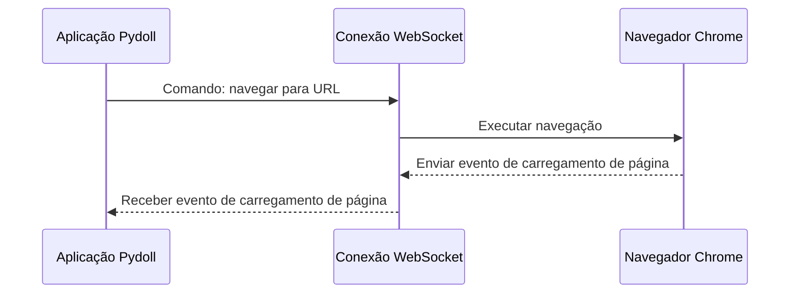
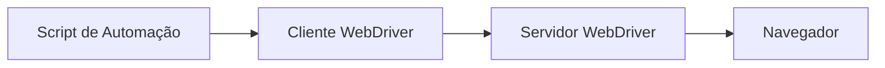
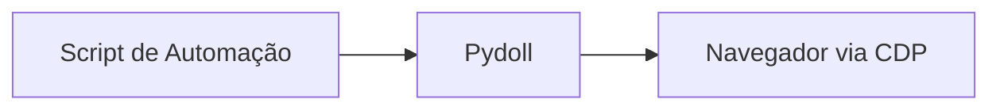
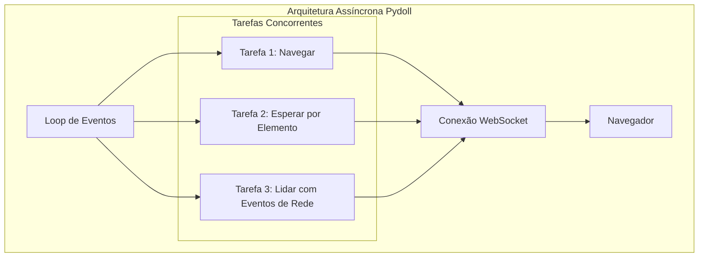

# Chrome DevTools Protocol (CDP)

O Chrome DevTools Protocol (CDP) é a fundação que permite ao Pydoll controlar navegadores sem os webdrivers tradicionais. Entender como o CDP funciona fornece insights valiosos sobre as capacidades e a arquitetura interna do Pydoll.


## O que é o CDP?

O Chrome DevTools Protocol é uma interface poderosa desenvolvida pela equipe do Chromium que permite a interação programática com navegadores baseados no Chromium. É o mesmo protocolo usado pelo Chrome DevTools quando você inspeciona uma página web, mas exposto como uma API programável que pode ser aproveitada por ferramentas de automação.

Em sua essência, o CDP fornece um conjunto abrangente de métodos e eventos para interagir com os componentes internos do navegador. Isso permite um controle refinado sobre todos os aspectos do navegador, desde navegar entre páginas até manipular o DOM, interceptar requisições de rede e monitorar métricas de desempenho.

!!! info "Evolução do CDP"
    O Chrome DevTools Protocol tem evoluído continuamente desde sua introdução. O Google mantém e atualiza o protocolo a cada lançamento do Chrome, adicionando regularmente novas funcionalidades e melhorando recursos existentes.
    
    Embora o protocolo tenha sido inicialmente projetado para o DevTools do Chrome, suas capacidades abrangentes o tornaram a fundação para ferramentas de automação de navegador de próxima geração como Puppeteer, Playwright e, claro, o Pydoll.

## Comunicação via WebSocket

Uma das principais decisões arquitetônicas no CDP é o uso de WebSockets para comunicação. Quando um navegador baseado no Chromium é iniciado com a flag de depuração remota habilitada, ele abre um servidor WebSocket em uma porta especificada:

```
chrome --remote-debugging-port=9222
```

O Pydoll se conecta a este endpoint WebSocket para estabelecer um canal de comunicação bidirecional com o navegador. Esta conexão:

1.  **Permanece persistente** durante toda a sessão de automação
2.  **Habilita eventos em tempo real** do navegador para serem enviados (push) ao cliente
3.  **Permite que comandos** sejam enviados ao navegador
4.  **Suporta dados binários** para transferência eficiente de capturas de tela, PDFs e outros ativos

O protocolo WebSocket é particularmente adequado para automação de navegador porque fornece:

- **Comunicação de baixa latência** - Necessária para automação responsiva
- **Mensagens bidirecionais** - Essencial para arquitetura orientada a eventos
- **Conexões persistentes** - Eliminando a sobrecarga de configuração de conexão para cada operação

Aqui está uma visão simplificada de como funciona a comunicação do Pydoll com o navegador:



!!! info "WebSocket vs HTTP"
    Protocolos de automação de navegador anteriores frequentemente dependiam de endpoints HTTP para comunicação. A mudança do CDP para WebSockets representa uma melhoria arquitetônica significativa que permite automação mais responsiva e monitoramento de eventos em tempo real.
    
    Protocolos baseados em HTTP exigem "polling" (consultas periódicas) contínuo para detectar mudanças, criando sobrecarga e atrasos. WebSockets permitem que o navegador envie notificações (push) para seu script de automação exatamente quando os eventos ocorrem, com latência mínima.

## Domínios Chave do CDP

O CDP é organizado em domínios lógicos, cada um responsável por um aspecto específico da funcionalidade do navegador. Alguns dos domínios mais importantes incluem:


| Domínio | Responsabilidade | Exemplos de Casos de Uso |
|---|---|---|
| **Browser** | Controle da própria aplicação do navegador | Gerenciamento de janelas, criação de contexto de navegador |
| **Page** | Interação com o ciclo de vida da página | Navegação, execução de JavaScript, gerenciamento de frames |
| **DOM** | Acesso à estrutura da página | Seletores de consulta, modificação de atributos, ouvintes de eventos |
| **Network** | Monitoramento e controle de tráfego de rede | Interceptação de requisições, exame de respostas, cache |
| **Runtime** | Ambiente de execução JavaScript | Avaliar expressões, chamar funções, lidar com exceções |
| **Input** | Simulação de interações do usuário | Movimentos do mouse, entrada de teclado, eventos de toque |
| **Target** | Gerenciamento de contextos e alvos do navegador | Criar abas, acessar iframes, lidar com popups |
| **Fetch** | Interceptação de rede de baixo nível | Modificar requisições, simular respostas, autenticação |

O Pydoll mapeia esses domínios CDP para uma estrutura de API mais intuitiva, preservando ao mesmo tempo todas as capacidades do protocolo subjacente.

## Arquitetura Orientada a Eventos

Uma das funcionalidades mais poderosas do CDP é seu sistema de eventos. O protocolo permite que clientes se inscrevam em vários eventos que o navegador emite durante a operação normal. Esses eventos cobrem virtualmente todos os aspectos do comportamento do navegador:

- **Eventos de ciclo de vida**: Carregamentos de página, navegação de frames, criação de alvos
- **Eventos DOM**: Mudanças de elementos, modificações de atributos
- **Eventos de rede**: Ciclos de requisição/resposta, mensagens WebSocket
- **Eventos de execução**: Exceções JavaScript, mensagens do console
- **Eventos de desempenho**: Métricas de renderização, script e mais


Quando você habilita o monitoramento de eventos no Pydoll (ex: com `page.enable_network_events()`), a biblioteca configura as inscrições necessárias com o navegador e fornece "ganchos" (hooks) para seu código reagir a esses eventos.

```python
from pydoll.events.network import NetworkEvents
from functools import partial

async def on_request(page, event):
    url = event['params']['request']['url']
    print(f"Requisição para: {url}")

# Inscrever-se em eventos de requisição de rede
await page.enable_network_events()
await page.on(NetworkEvents.REQUEST_WILL_BE_SENT, partial(on_request, page))
```

Essa abordagem orientada a eventos permite que scripts de automação reajam imediatamente a mudanças de estado do navegador, sem depender de polling ineficiente ou atrasos arbitrários.

## Vantagens de Desempenho da Integração Direta com CDP

Usar o CDP diretamente, como o Pydoll faz, oferece várias vantagens de desempenho em relação à automação tradicional baseada em webdriver:

### 1. Eliminação da Camada de Tradução de Protocolo

Ferramentas tradicionais baseadas em webdriver, como o Selenium, usam uma abordagem multicamada:



Cada camada adiciona sobrecarga, especialmente o servidor WebDriver, que atua como uma camada de tradução entre o protocolo WebDriver e as APIs nativas do navegador.

A abordagem do Pydoll simplifica isso para:



Essa comunicação direta elimina a sobrecarga computacional e de rede do servidor intermediário, resultando em operações mais rápidas.

### 2. Agrupamento Eficiente de Comandos (Batching)

O CDP permite o agrupamento de múltiplos comandos em uma única mensagem, reduzindo o número de viagens de ida e volta (round trips) necessárias para operações complexas. Isso é particularmente valioso para operações que exigem várias etapas, como encontrar um elemento e depois interagir com ele.

### 3. Operação Assíncrona

A arquitetura orientada a eventos e baseada em WebSocket do CDP alinha-se perfeitamente com o framework asyncio do Python, permitindo uma verdadeira operação assíncrona. Isso permite ao Pydoll:

- Executar múltiplas operações concorrentemente
- Processar eventos à medida que ocorrem
- Evitar o bloqueio da thread principal durante operações de I/O



!!! info "Ganhos de Desempenho Assíncrono"
    A combinação de asyncio e CDP cria um efeito multiplicador no desempenho. Em testes de benchmark, a abordagem assíncrona do Pydoll pode processar múltiplas páginas em paralelo com escalabilidade quase linear, enquanto ferramentas síncronas tradicionais veem retornos decrescentes à medida que a concorrência aumenta.
    
    Por exemplo, raspar 10 páginas que levam 2 segundos cada para carregar pode levar mais de 20 segundos com uma ferramenta síncrona, mas pouco mais de 2 segundos com a arquitetura assíncrona do Pydoll (mais uma sobrecarga mínima).

### 4. Controle Refinado (Fine-Grained)

O CDP fornece controle mais granular sobre o comportamento do navegador do que o protocolo WebDriver. Isso permite ao Pydoll implementar estratégias otimizadas para operações comuns:

- Condições de espera mais precisas (vs. timeouts arbitrários)
- Acesso direto a caches e armazenamento do navegador
- Execução direcionada de JavaScript em contextos específicos
- Controle detalhado da rede para otimização de requisições


## Conclusão

O Chrome DevTools Protocol forma a base da abordagem "zero-webdriver" do Pydoll para automação de navegador. Ao alavancar a comunicação WebSocket do CDP, a cobertura abrangente de domínios, a arquitetura orientada a eventos e a integração direta com o navegador, o Pydoll alcança desempenho e confiabilidade superiores em comparação com as ferramentas de automação tradicionais.

Nas seções seguintes, mergulharemos mais fundo em como o Pydoll implementa domínios CDP específicos e transforma o protocolo de baixo nível em uma API intuitiva e amigável ao desenvolvedor.
