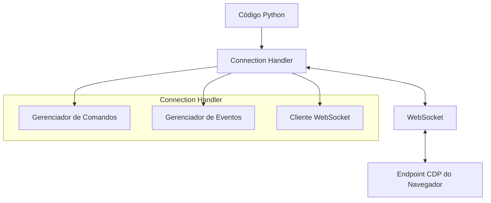
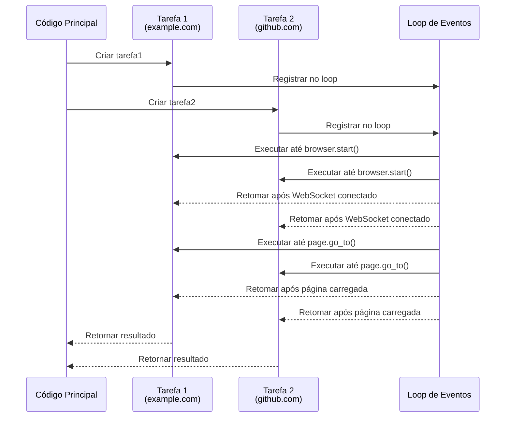
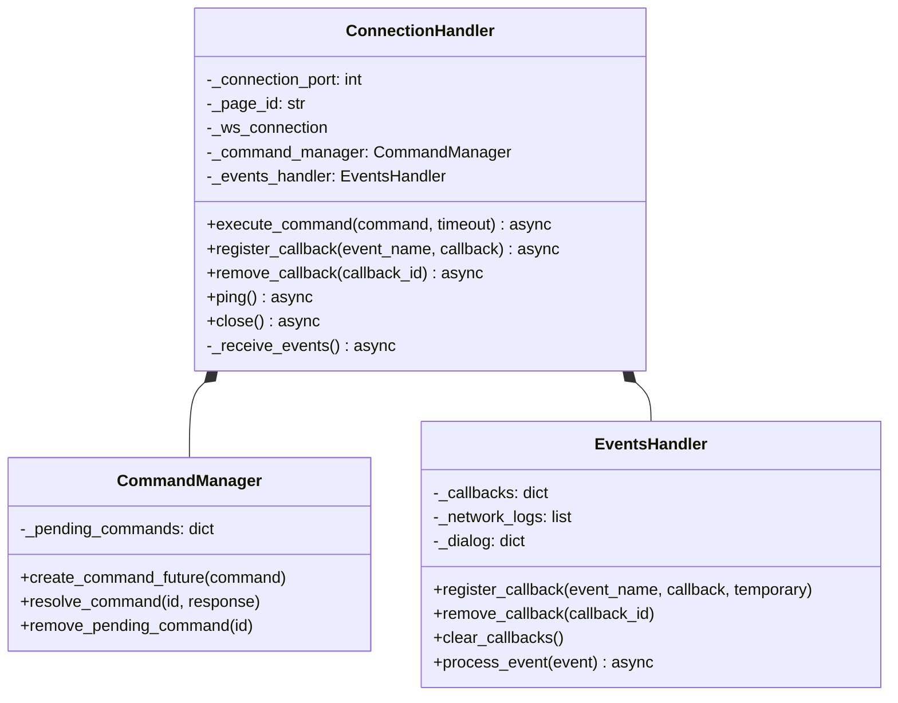
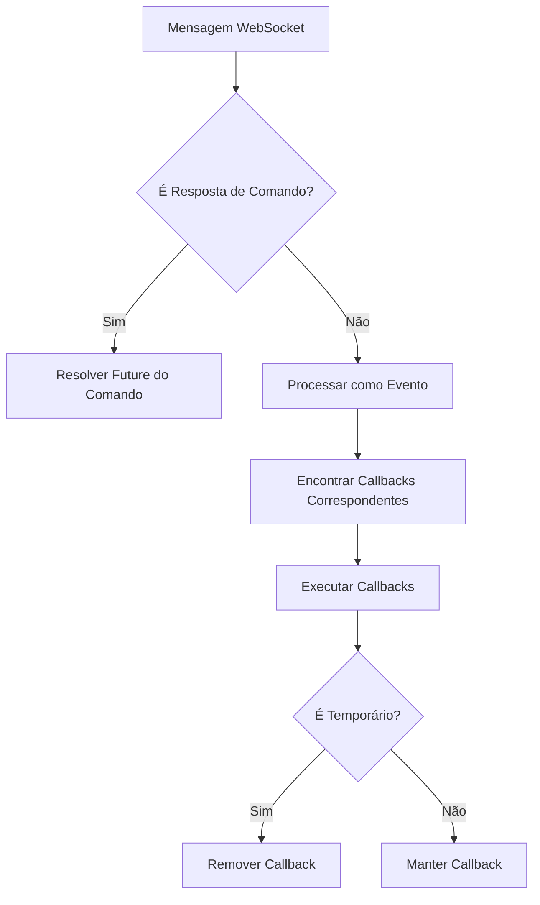
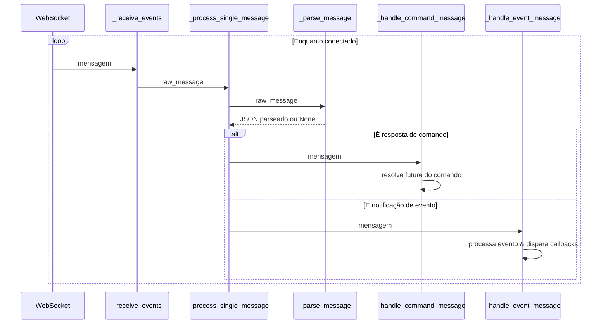

# Connection Handler (Gerenciador de Conexão)

O Connection Handler é a camada fundamental da arquitetura do Pydoll, servindo como a ponte entre seu código Python e o Chrome DevTools Protocol (CDP) do navegador. Este componente gerencia a conexão WebSocket com o navegador, lida com a execução de comandos e processa eventos de maneira assíncrona e não bloqueante.



## Modelo de Programação Assíncrona

O Pydoll é construído sobre o framework `asyncio` do Python, que permite operações de I/O (Entrada/Saída) não bloqueantes. Essa escolha de design é crítica para a automação de navegador de alto desempenho, pois permite que múltiplas operações ocorram concorrentemente sem esperar que cada uma seja concluída.

### Entendendo Async/Await


Para entender como async/await funciona na prática, vamos examinar um exemplo mais detalhado com duas operações concorrentes:

```python
import asyncio
from pydoll.browser.chrome import Chrome

async def fetch_page_data(url):
    print(f"Iniciando busca por {url}")
    browser = Chrome()
    await browser.start()
    page = await browser.get_page()
    
    # Navegação leva tempo - é aqui que cedemos o controle
    await page.go_to(url)
    
    # Obter título da página
    title = await page.execute_script("return document.title")
    
    # Extrair alguns dados
    description = await page.execute_script(
        "return document.querySelector('meta[name=\"description\"]')?.content || ''"
    )
    
    await browser.stop()
    print(f"Busca por {url} concluída")
    return {"url": url, "title": title, "description": description}

async def main():
    # Iniciar duas operações de página concorrentemente
    task1 = asyncio.create_task(fetch_page_data("https://example.com"))
    task2 = asyncio.create_task(fetch_page_data("https://github.com"))
    
    # Esperar que ambas terminem e obter resultados
    result1 = await task1
    result2 = await task2
    
    return [result1, result2]

# Rodar a função assíncrona
results = asyncio.run(main())
```

Este exemplo demonstra como podemos buscar dados de dois sites diferentes concorrentemente, potencialmente cortando o tempo total de execução quase pela metade em comparação com a execução sequencial.

#### Diagrama de Fluxo de Execução Assíncrona

Aqui está o que acontece no loop de eventos ao executar o código acima:



Este diagrama de sequência ilustra como o asyncio do Python gerencia as duas tarefas concorrentes em nosso código de exemplo:

1.  A função principal cria duas tarefas para buscar dados de sites diferentes
2.  Ambas as tarefas são registradas no loop de eventos
3.  O loop de eventos executa cada tarefa até encontrar uma declaração `await` (como `browser.start()`)
4.  Quando as operações assíncronas terminam (como uma conexão WebSocket sendo estabelecida), as tarefas retomam
5.  O loop continua a alternar entre as tarefas em cada ponto `await`
6.  Quando cada tarefa termina, ela retorna seu resultado para a função principal

No exemplo `fetch_page_data`, isso permite que ambas as instâncias do navegador trabalhem concorrentemente - enquanto uma está esperando uma página carregar, a outra pode estar progredindo. Isso é significativamente mais eficiente do que processar sequencialmente cada site, já que os tempos de espera de I/O não bloqueiam a execução de outras tarefas.

!!! info "Multitarefa Cooperativa"
    O Asyncio usa multitarefa cooperativa, onde as tarefas voluntariamente cedem o controle nos pontos `await`. Isso difere da multitarefa preemptiva (threads), onde as tarefas podem ser interrompidas a qualquer momento. A multitarefa cooperativa pode fornecer melhor desempenho para operações ligadas a I/O, mas requer codificação cuidadosa para evitar bloquear o loop de eventos.

## Implementação do Connection Handler

A classe `ConnectionHandler` é projetada para gerenciar tanto a execução de comandos quanto o processamento de eventos, fornecendo uma interface robusta para a conexão WebSocket do CDP.

### Inicialização da Classe

```python
def __init__(
    self,
    connection_port: int,
    page_id: str = 'browser',
    ws_address_resolver: Callable[[int], str] = get_browser_ws_address,
    ws_connector: Callable = websockets.connect,
):
    # Inicializar componentes...
```

O ConnectionHandler aceita vários parâmetros:

| Parâmetro | Tipo | Descrição |
|---|---|---|
| `connection_port` | `int` | Número da porta onde o endpoint CDP do navegador está escutando |
| `page_id` | `str` | Identificador para a página/alvo específico (use 'browser' para conexões em nível de navegador) |
| `ws_address_resolver` | `Callable` | Função para resolver a URL do WebSocket a partir do número da porta |
| `ws_connector` | `Callable` | Função para estabelecer a conexão WebSocket |

### Componentes Internos

O ConnectionHandler orquestra três componentes primários:

1.  **Conexão WebSocket**: Gerencia a comunicação WebSocket real com o navegador
2.  **Gerenciador de Comandos**: Lida com o envio de comandos e recebimento de respostas
3.  **Gerenciador de Eventos**: Processa eventos do navegador e dispara callbacks apropriados



## Fluxo de Execução de Comando

Ao executar um comando através do CDP, o ConnectionHandler segue um padrão específico:

1.  Garantir que uma conexão WebSocket ativa exista
2.  Criar um objeto Future para representar a resposta pendente
3.  Enviar o comando pelo WebSocket
4.  Aguardar (await) o Future ser resolvido com a resposta
5.  Retornar a resposta ao chamador

```python
async def execute_command(self, command: dict, timeout: int = 10) -> dict:
    # Validar comando
    if not isinstance(command, dict):
        logger.error('Comando deve ser um dicionário.')
        raise exceptions.InvalidCommand('Comando deve ser um dicionário')

    # Garantir que a conexão está ativa
    await self._ensure_active_connection()
    
    # Criar future para este comando
    future = self._command_manager.create_command_future(command)
    command_str = json.dumps(command)

    # Enviar comando e aguardar resposta
    try:
        await self._ws_connection.send(command_str)
        response: str = await asyncio.wait_for(future, timeout)
        return json.loads(response)
    except asyncio.TimeoutError as exc:
        self._command_manager.remove_pending_command(command['id'])
        raise exc
    except websockets.ConnectionClosed as exc:
        await self._handle_connection_loss()
        raise exc
```

!!! warning "Timeout de Comando"
    Comandos que não recebem uma resposta dentro do período de timeout especificado lançarão um `TimeoutError`. Isso impede que scripts de automação fiquem travados indefinidamente devido a respostas ausentes. O timeout padrão é de 10 segundos, mas pode ser ajustado com base nos tempos de resposta esperados para operações complexas.

## Sistema de Processamento de Eventos

O sistema de eventos é um componente arquitetônico chave que permite padrões de programação reativa no Pydoll. Ele permite que você registre callbacks para eventos específicos do navegador e os execute automaticamente quando esses eventos ocorrem.

### Fluxo de Eventos

O fluxo de processamento de eventos segue estas etapas:

1.  O método `_receive_events` roda como uma tarefa em segundo plano, recebendo continuamente mensagens do WebSocket
2.  Cada mensagem é analisada e classificada como uma resposta de comando ou um evento
3.  Eventos são passados para o EventsHandler para processamento
4.  O EventsHandler identifica callbacks registrados para o evento e os invoca



### Registro de Callback

O ConnectionHandler fornece métodos para registrar, remover e gerenciar callbacks de eventos:

```python
# Registrar um callback para um evento específico
callback_id = await connection.register_callback(
    'Page.loadEventFired', 
    handle_page_load
)

# Remover um callback específico
await connection.remove_callback(callback_id)

# Remover todos os callbacks
await connection.clear_callbacks()
```

!!! tip "Callbacks Temporários"
    Você pode registrar um callback como temporário, o que significa que ele será automaticamente removido após ser acionado uma vez. Isso é útil para eventos únicos, como o manuseio de diálogos:
    
    ```python
    await connection.register_callback(
        'Page.javascriptDialogOpening',
        handle_dialog,
        temporary=True
    )
    ```

### Execução Assíncrona de Callback

Callbacks podem ser funções síncronas ou corrotinas assíncronas. O EventsHandler (gerenciado pelo ConnectionHandler) lida com ambos os tipos adequadamente:

```python
# Callback síncrono
def synchronous_callback(event):
    print(f"Evento recebido: {event['method']}")

# Callback assíncrono
async def asynchronous_callback(event):
    await asyncio.sleep(0.1)  # Realizar alguma operação assíncrona
    print(f"Evento processado assincronamente: {event['method']}")

# Ambos podem ser registrados da mesma forma
await connection.register_callback('Network.requestWillBeSent', synchronous_callback)
await connection.register_callback('Network.responseReceived', asynchronous_callback)
```

**Modelo de Execução Sequencial:**

Callbacks assíncronos são **aguardados (awaited) sequencialmente** pelo EventsManager. Isso garante que, para um único evento, os callbacks sejam executados na ordem em que foram registrados, prevenindo condições de corrida (race conditions) quando múltiplos callbacks modificam estado compartilhado.

```python
# Dentro de EventsManager.process_event()
for callback_data in callbacks:
    if asyncio.iscoroutinefunction(callback_data['callback']):
        await callback_data['callback'](event_data)  # Await sequencial
    else:
        callback_data['callback'](event_data)  # Execução síncrona
```

A **execução não bloqueante** (para callbacks de UI que não devem bloquear outras operações) é alcançada em um **nível mais alto**, como no método `Tab.on()`, que envolve o callback do usuário em um `asyncio.create_task()` antes de registrá-lo aqui. Esta arquitetura fornece:

- **Camada inferior** (ConnectionHandler/EventsManager): Garante execução sequencial e ordem previsível
- **Camada superior** (Tab.on()): Fornece semântica não bloqueante quando necessário

!!! info "Detalhes da Arquitetura de Eventos"
    Veja [Análise Profunda da Arquitetura de Eventos](../architecture/event-architecture.md) para detalhes completos sobre o sistema de eventos multicamada e a lógica por trás da execução sequencial de callbacks.

## Gerenciamento de Conexão

O ConnectionHandler implementa várias estratégias para garantir conexões robustas:

### Estabelecimento Lento de Conexão (Lazy)

Conexões são estabelecidas apenas quando necessário, tipicamente quando o primeiro comando é executado ou quando explicitamente solicitado. Esta abordagem de inicialização lenta economiza recursos e permite um gerenciamento de conexão mais flexível.

### Reconexão Automática

Se a conexão WebSocket for perdida ou fechada inesperadamente, o ConnectionHandler tentará reestabelecê-la automaticamente quando o próximo comando for executado. Isso fornece resiliência contra problemas transitórios de rede.

```python
async def _ensure_active_connection(self):
    """
    Garante que uma conexão ativa exista antes de prosseguir.
    """
    if self._ws_connection is None or self._ws_connection.closed:
        await self._establish_new_connection()
```

### Limpeza de Recursos

O ConnectionHandler implementa tanto métodos de limpeza explícitos quanto o protocolo de gerenciador de contexto assíncrono do Python (`__aenter__` e `__aexit__`), garantindo que os recursos sejam devidamente liberados quando não mais necessários:

```python
async def close(self):
    """
    Fecha a conexão WebSocket e limpa todos os callbacks.
    """
    await self.clear_callbacks()
    if self._ws_connection is not None:
        try:
            await self._ws_connection.close()
        except websockets.ConnectionClosed as e:
            logger.info(f'Conexão WebSocket foi fechada: {e}')
        logger.info('Conexão WebSocket fechada.')
```

!!! info "Uso do Gerenciador de Contexto"
    Usar o ConnectionHandler como um gerenciador de contexto é o padrão recomendado para garantir a limpeza adequada dos recursos:
    
    ```python
    async with ConnectionHandler(9222, 'browser') as connection:
        # Trabalhar com a conexão...
        await connection.execute_command(...)
    # Conexão é automaticamente fechada ao sair do contexto
    ```

## Pipeline de Processamento de Mensagens

O ConnectionHandler implementa um pipeline sofisticado de processamento de mensagens que lida com o fluxo contínuo de mensagens da conexão WebSocket:



Este pipeline garante o processamento eficiente tanto de respostas de comandos quanto de eventos assíncronos, permitindo ao Pydoll manter uma operação responsiva mesmo sob alto volume de mensagens.

## Uso Avançado

O ConnectionHandler é geralmente usado indiretamente através das classes Browser e Page, mas também pode ser usado diretamente para cenários avançados:

### Monitoramento Direto de Eventos

Para casos de uso especializados, você pode querer contornar as APIs de nível superior e monitorar diretamente eventos CDP específicos:

```python
from pydoll.connection.connection import ConnectionHandler

async def monitor_network():
    connection = ConnectionHandler(9222)
    
    async def log_request(event):
        url = event['params']['request']['url']
        print(f"Requisição: {url}")
    
    await connection.register_callback(
        'Network.requestWillBeSent', 
        log_request
    )
    
    # Habilitar eventos de rede via comando CDP
    await connection.execute_command({
        "id": 1,
        "method": "Network.enable"
    })
    
    # Manter rodando até ser interrompido
    try:
        while True:
            await asyncio.sleep(1)
    finally:
        await connection.close()
```

### Execução de Comando Personalizado

Você pode executar comandos CDP arbitrários diretamente:

```python
async def custom_cdp_command(connection, method, params=None):
    command = {
        "id": random.randint(1, 10000),
        "method": method,
        "params": params or {}
    }
    return await connection.execute_command(command)

# Exemplo: Obter HTML do documento sem usar a classe Page
async def get_html(connection):
    result = await custom_cdp_command(
        connection,
        "Runtime.evaluate",
        {"expression": "document.documentElement.outerHTML"}
    )
    return result['result']['result']['value']
```

!!! warning "Interface Avançada"
    O uso direto do ConnectionHandler requer um entendimento profundo do Chrome DevTools Protocol. Para a maioria dos casos de uso, as APIs de nível superior Browser e Page fornecem uma interface mais intuitiva e segura.


## Padrões Avançados de Concorrência

O design assíncrono do ConnectionHandler permite padrões sofisticados de concorrência:

### Execução Paralela de Comandos

Execute múltiplos comandos concorrentemente e espere por todos os resultados:

```python
async def get_page_metrics(connection):
    commands = [
        {"id": 1, "method": "Performance.getMetrics"},
        {"id": 2, "method": "Network.getResponseBody", "params": {"requestId": "..."}},
        {"id": 3, "method": "DOM.getDocument"}
    ]
    
    results = await asyncio.gather(
        *(connection.execute_command(cmd) for cmd in commands)
    )
    
    return results
```

## Conclusão

O ConnectionHandler serve como a fundação da arquitetura do Pydoll, fornecendo uma interface robusta e eficiente para o Chrome DevTools Protocol. Ao alavancar o framework asyncio do Python e a comunicação WebSocket, ele permite automação de navegador de alto desempenho com padrões de programação elegantes e orientados a eventos.

Entender o design e a operação do ConnectionHandler fornece insights valiosos sobre o funcionamento interno do Pydoll e oferece oportunidades para personalização avançada e otimização em cenários especializados.

Para a maioria dos casos de uso, você interagirá com o ConnectionHandler indiretamente através das APIs de nível superior Browser e Page, que fornecem uma interface mais intuitiva enquanto aproveitam as poderosas capacidades do ConnectionHandler.