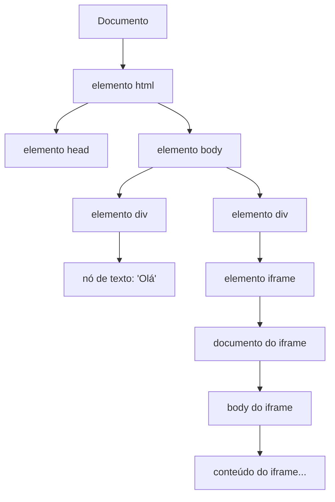
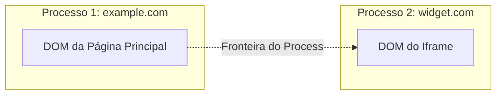
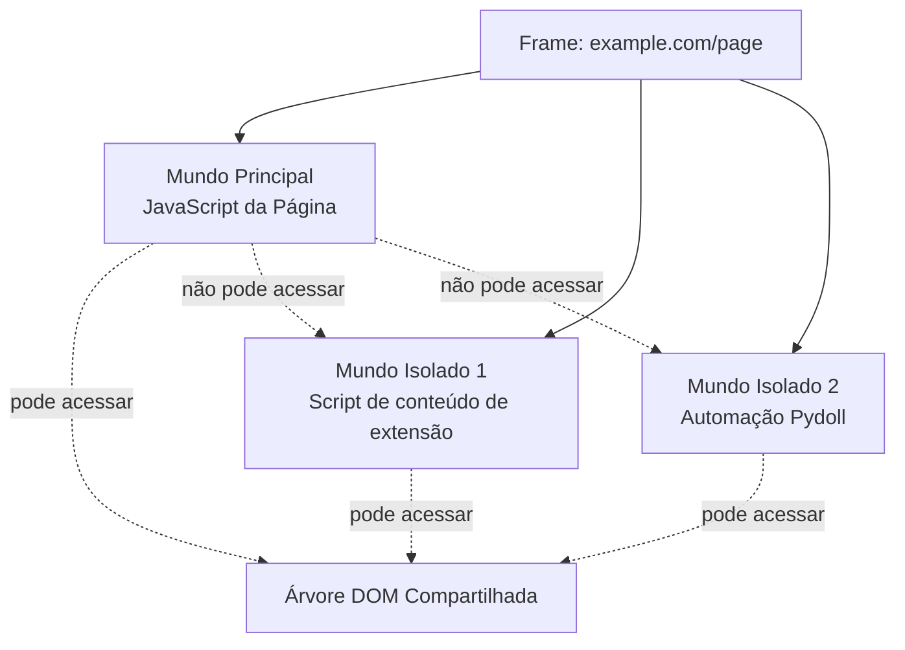
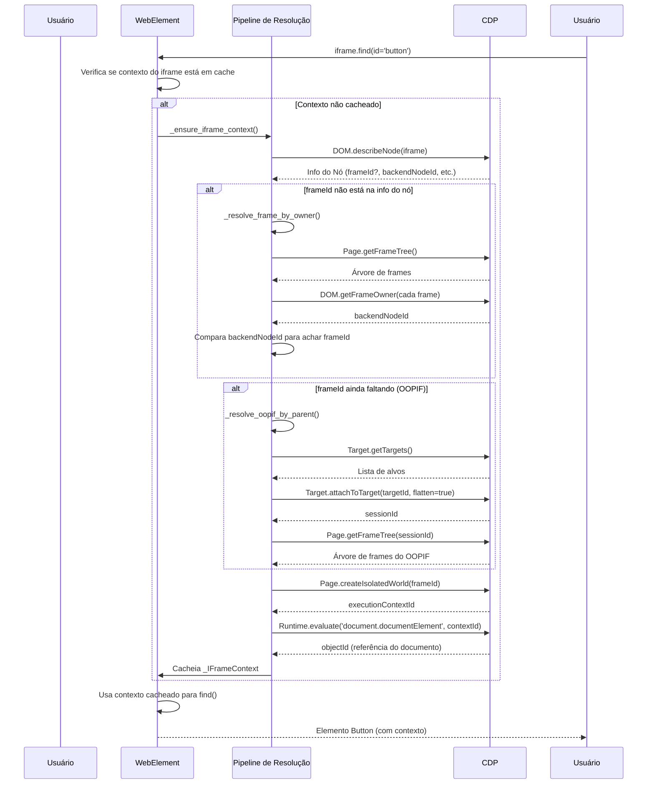
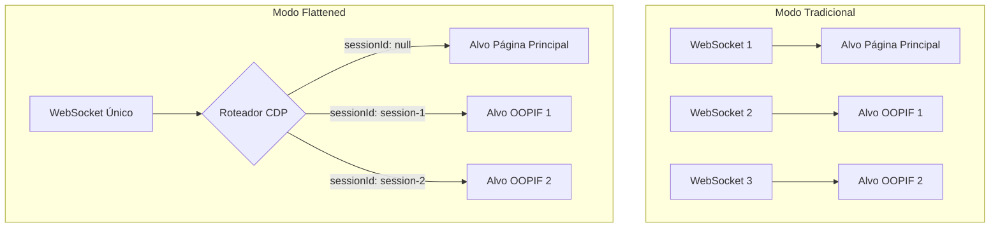

# Iframes, OOPIFs e Contextos de Execução (Análise Aprofundada)

Entender como a automação de navegador lida com iframes é crucial para construir ferramentas de automação robustas. Este guia abrangente explora os fundamentos técnicos do manuseio de iframes no Pydoll, cobrindo o Document Object Model (DOM), mecânicas do Chrome DevTools Protocol (CDP), contextos de execução, mundos isolados e o sofisticado pipeline de resolução que torna a interação com iframes fluida.

!!! info "Primeiro o uso prático"
    Se você só precisa usar iframes em seus scripts de automação, comece com o guia de funcionalidades: **Funcionalidades → Automação → IFrames**.
    Esta análise aprofundada explica as decisões de arquitetura, nuances do protocolo e detalhes de implementação interna.

---

## Tabela de Conteúdos

1. [Fundação: O Modelo de Objeto de Documento (DOM)](#fundação-o-modelo-de-objeto-de-documento-dom)
2. [O que são Iframes e Por que Eles Importam](#o-que-são-iframes-e-por-que-eles-importam)
3. [O Desafio: Iframes Fora de Processo (OOPIFs)](#o-desafio-iframes-fora-de-processo-oopifs)
4. [Protocolo Chrome DevTools e Gerenciamento de Frames](#protocolo-chrome-devtools-e-gerenciamento-de-frames)
5. [Contextos de Execução e Mundos Isolados](#contextos-de-execução-e-mundos-isolados)
6. [Referência de Identificadores CDP](#referência-de-identificadores-cdp)
7. [Pipeline de Resolução do Pydoll](#pipeline-de-resolução-do-pydoll)
8. [Roteamento de Sessão e Modo "Flattened"](#roteamento-de-sessão-e-modo-flattened)
9. [Análise Aprofundada da Implementação](#análise-aprofundada-da-implementação)
10. [Considerações de Performance](#considerações-de-performance)
11. [Modos de Falha e Depuração](#modos-de-falha-e-depuração)

---

## Fundação: O Modelo de Objeto de Documento (DOM)

Antes de mergulhar nos iframes, precisamos entender o DOM — a estrutura em árvore que representa um documento HTML na memória.

### O que é o DOM?

O **Modelo de Objeto de Documento** (Document Object Model) é uma interface de programação para documentos HTML e XML. Ele representa a estrutura da página como uma árvore de nós, onde cada nó corresponde a uma parte do documento:

- **Nós de elemento**: Tags HTML como `<div>`, `<iframe>`, `<button>`
- **Nós de texto**: O conteúdo de texto real
- **Nós de atributo**: Atributos de elemento como `id`, `class`, `src`
- **Nó do documento**: A raiz da árvore



### Propriedades da Árvore DOM

1. **Estrutura hierárquica**: Todo nó tem um pai (exceto o Documento) e pode ter filhos
2. **Identificação de nós**: Nós podem ser identificados por:
   - `nodeId`: Identificador interno dentro de um contexto de documento (domínio DOM)
   - `backendNodeId`: Identificador estável que pode referenciar nós através de diferentes documentos
3. **Representação viva**: Mudanças no DOM são refletidas imediatamente na árvore

### Por que Isso Importa para Iframes

Cada elemento `<iframe>` cria uma **árvore DOM nova e independente**. O próprio elemento iframe existe no DOM do pai, mas o conteúdo carregado no iframe tem seu próprio nó Documento completo e estrutura de árvore. Essa separação é a base de toda a complexidade dos iframes.

---

## O que são Iframes e Por que Eles Importam

### Definição

Um **iframe** (quadro em linha) é um elemento HTML (`<iframe>`) que incorpora outro documento HTML dentro da página atual. O documento incorporado mantém seu próprio contexto, incluindo:

- Estrutura HTML e árvore DOM independentes
- Ambiente de execução JavaScript separado
- Estilização CSS própria (a menos que explicitamente compartilhada)
- Histórico de navegação distinto

```html
<body>
  <h1>Página Pai</h1>
  <iframe src="https://example.com/embedded.html" id="content-frame"></iframe>
  <p>Mais conteúdo do pai</p>
</body>
```

### Casos de Uso Comuns

| Caso de Uso | Descrição | Exemplo |
|----------|-------------|---------|
| **Widgets de terceiros** | Incorpora conteúdo externo com segurança | Formulários de pagamento, feeds de mídia social, widgets de chat |
| **Isolamento de conteúdo** | Coloca conteúdo não confiável em sandbox | HTML gerado por usuário, anúncios |
| **Arquitetura modular** | Componentes reutilizáveis | Widgets de dashboard, sistemas de plugins |
| **Conteúdo de origem cruzada** | Carrega recursos de domínios diferentes | Mapas, players de vídeo, dashboards de analytics |

### Modelo de Segurança: Política de Mesma Origem (Same-Origin Policy)

O navegador impõe uma **Política de Mesma Origem** para iframes:

- **Iframes de mesma origem**: O pai pode acessar o DOM do iframe via JavaScript (`iframe.contentDocument`)
- **Iframes de origem cruzada**: O pai não pode acessar o DOM do iframe diretamente (restrição de segurança)

Essa barreira de segurança é o motivo pelo qual ferramentas de automação precisam de mecanismos especiais (como o CDP) para interagir com o conteúdo do iframe.

!!! warning "Importante para automação"
    Automação tradicional baseada em JavaScript (como as primeiras abordagens do Selenium) não pode acessar diretamente o conteúdo de iframes de origem cruzada devido à segurança do navegador. O CDP opera em um nível mais baixo, contornando essa limitação para fins de depuração.

---

## O Desafio: Iframes Fora de Processo (OOPIFs)

### O que são OOPIFs?

O Chromium moderno usa **isolamento de site** (site isolation) para segurança e estabilidade. Isso significa que origens diferentes podem ser renderizadas em processos separados do SO. Um iframe de uma origem diferente torna-se um **Iframe Fora de Processo (OOPIF)**.



### Por que OOPIFs Complicam a Automação

| Aspecto | Iframe no Mesmo Processo | Iframe Fora de Processo (OOPIF) |
|--------|-------------------|-------------------------------|
| **Acesso ao DOM** | Árvore de documento compartilhada na memória | Alvo (target) separado com seu próprio documento |
| **Roteamento de comandos** | Conexão única | Requer anexação ao alvo e roteamento de sessão |
| **Árvore de frames** | Todos os frames em uma árvore | Frame raiz + alvos separados para OOPIFs |
| **Contexto JavaScript** | Mesmo contexto de execution | Contexto de execução diferente por processo |
| **Comunicação CDP** | Comandos diretos | Comandos devem incluir `sessionId` |

### A Abordagem Tradicional (Troca Manual de Contexto)

Sem um manuseio sofisticado, automatizar OOPIFs requer:

```python
# Abordagem tradicional (manual) com outras ferramentas
main_page = browser.get_page()
iframe_element = main_page.find_element_by_id("iframe-id")

# Deve trocar manualmente o contexto
driver.switch_to.frame(iframe_element)

# Agora os comandos miram o iframe
button = driver.find_element_by_id("button-in-iframe")
button.click()

# Deve trocar manualmente de volta
driver.switch_to.default_content()
```

**Problemas com esta abordagem:**

1. **Carga para o desenvolvedor**: Todo iframe requer gerenciamento explícito de contexto
2. **Iframes aninhados**: Cada nível precisa de outra troca
3. **Detecção de OOPIF**: Difícil saber quando a anexação manual é necessária
4. **Propenso a erros**: Esquecer de trocar de volta → comandos subsequentes falham
5. **Não componentizável**: Funções auxiliares precisam saber seu contexto de iframe

### A Solução do Pydoll: Resolução Transparente de Contexto

O Pydoll elimina a troca manual de contexto resolvendo os contextos de iframe automaticamente:

```python
# Abordagem Pydoll (sem troca manual)
iframe = await tab.find(id="iframe-id")
button = await iframe.find(id="button-in-iframe")
await button.click()

# Iframes aninhados? Mesmo padrão
outer = await tab.find(id="outer-iframe")
inner = await outer.find(tag_name="iframe")
button = await inner.find(text="Submit")
await button.click()
```

A complexidade é tratada internamente. Vamos explorar como.

---

## Protocolo Chrome DevTools e Gerenciamento de Frames

Como discutido em [Análise Aprofundada → Fundamentos → Protocolo Chrome DevTools](./cdp.md), o CDP fornece controle abrangente do navegador via comunicação WebSocket. O gerenciamento de frames é distribuído por múltiplos domínios do CDP.

### Domínios CDP Relevantes

#### 1. **Domínio Page**

Gerencia o ciclo de vida da página, frames e navegação.

**Métodos principais:**

- `Page.getFrameTree()`: Retorna a estrutura hierárquica de todos os frames em uma página
  ```json
  {
    "frameTree": {
      "frame": {
        "id": "main-frame-id",
        "url": "https://example.com",
        "securityOrigin": "https://example.com",
        "mimeType": "text/html"
      },
      "childFrames": [
        {
          "frame": {
            "id": "child-frame-id",
            "parentId": "main-frame-id",
            "url": "https://widget.com/embed"
          }
        }
      ]
    }
  }
  ```

- `Page.createIsolatedWorld(frameId, worldName)`: Cria um novo contexto de execução JavaScript em um frame específico
  ```json
  {
    "executionContextId": 42
  }
  ```

**Uso no Pydoll:**

```python
# De pydoll/elements/web_element.py
@staticmethod
async def _get_frame_tree_for(
    handler: ConnectionHandler, session_id: Optional[str]
) -> FrameTree:
    """Pega a árvore de frames da Página para a conexão/alvo dados."""
    command = PageCommands.get_frame_tree()
    if session_id:
        command['sessionId'] = session_id
    response: GetFrameTreeResponse = await handler.execute_command(command)
    return response['result']['frameTree']
```

#### 2. **Domínio DOM**

Fornece acesso à estrutura do DOM.

**Métodos principais:**

- `DOM.describeNode(objectId)`: Retorna informação detalhada sobre um nó DOM
  ```json
  {
    "node": {
      "nodeId": 123,
      "backendNodeId": 456,
      "nodeName": "IFRAME",
      "frameId": "parent-frame-id",
      "contentDocument": {
        "frameId": "iframe-frame-id",
        "documentURL": "https://embedded.com/page.html"
      }
    }
  }
  ```

- `DOM.getFrameOwner(frameId)`: Retorna o `backendNodeId` do elemento `<iframe>` que possui um frame
  ```json
  {
    "backendNodeId": 456
  }
  ```

**Uso no Pydoll:**

```python
# De pydoll/elements/web_element.py
@staticmethod
async def _owner_backend_for(
    handler: ConnectionHandler, session_id: Optional[str], frame_id: str
) -> Optional[int]:
    """Pega o backendNodeId do elemento DOM que possui o frame dado."""
    command = DomCommands.get_frame_owner(frame_id=frame_id)
    if session_id:
        command['sessionId'] = session_id
    response: GetFrameOwnerResponse = await handler.execute_command(command)
    return response.get('result', {}).get('backendNodeId')
```

#### 3. **Domínio Target**

Gerencia alvos (targets) do navegador (páginas, iframes, workers, etc.).

**Métodos principais:**

- `Target.getTargets()`: Lista todos os alvos disponíveis
  ```json
  {
    "targetInfos": [
      {
        "targetId": "page-target-id",
        "type": "page",
        "title": "Main Page",
        "url": "https://example.com"
      },
      {
        "targetId": "iframe-target-id",
        "type": "iframe",
        "title": "",
        "url": "https://widget.com/embed",
        "parentFrameId": "main-frame-id"
      }
    ]
  }
  ```

- `Target.attachToTarget(targetId, flatten)`: Anexa a um alvo para depuração
  - Quando `flatten=true`: Retorna um `sessionId` para rotear comandos no modo "flattened"
  - Toda comunicação acontece sobre o mesmo WebSocket, diferenciada por `sessionId`

**Uso no Pydoll:**

```python
# De pydoll/elements/web_element.py (simplificado)
async def _resolve_oopif_by_parent(self, parent_frame_id: str, ...):
    """Resolve um OOPIF usando o ID do frame pai."""
    browser_handler = ConnectionHandler(...)
    targets_response: GetTargetsResponse = await browser_handler.execute_command(
        TargetCommands.get_targets()
    )
    target_infos = targets_response.get('result', {}).get('targetInfos', [])
    
    # Encontra alvos cujo parentFrameId bate
    direct_children = [
        target_info for target_info in target_infos
        if target_info.get('parentFrameId') == parent_frame_id
    ]
    
    if direct_children:
        attach_response: AttachToTargetResponse = await browser_handler.execute_command(
            TargetCommands.attach_to_target(
                target_id=direct_children[0]['targetId'], 
                flatten=True
            )
        )
        attached_session_id = attach_response.get('result', {}).get('sessionId')
        # ... usa session_id para comandos subsequentes
```

#### 4. **Domínio Runtime**

Executa JavaScript e gerencia contextos de execução.

**Métodos principais:**

- `Runtime.evaluate(expression, contextId)`: Avalia JavaScript em um contexto de execução específico
- `Runtime.callFunctionOn(functionDeclaration, objectId)`: Chama uma função com um objeto específico como `this`

**Uso no Pydoll para acesso ao documento do iframe:**

```python
# De pydoll/elements/web_element.py
async def _set_iframe_document_object_id(self, execution_context_id: int):
    """Avalia document.documentElement no contexto do iframe e cacheia seu object id."""
    evaluate_command = RuntimeCommands.evaluate(
        expression='document.documentElement',
        context_id=execution_context_id,
    )
    if self._iframe_context and self._iframe_context.session_id:
        evaluate_command['sessionId'] = self._iframe_context.session_id
    
    evaluate_response: EvaluateResponse = await (
        (self._iframe_context.session_handler if self._iframe_context else None)
        or self._connection_handler
    ).execute_command(evaluate_command)
    
    document_object_id = evaluate_response.get('result', {}).get('result', {}).get('objectId')
    if self._iframe_context:
        self._iframe_context.document_object_id = document_object_id
```

---

## Contextos de Execução e Mundos Isolados

### O que é um Contexto de Execução?

Um **contexto de execução** é um ambiente onde o código JavaScript é executado. Todo frame em um navegador tem pelo menos um contexto de execution. O contexto inclui:

- **Objeto global** (`window` em navegadores)
- **Cadeia de escopo**: Como variáveis são resolvidas
- **Vínculo 'this'**: A o que `this` se refere
- **Ambiente de variáveis**: Todas as variáveis e funções declaradas

### Múltiplos Contextos por Frame

Um único frame pode ter múltiplos contextos de execução:

1. **Mundo principal (contexto padrão)**: Onde o JavaScript da própria página roda
2. **Mundos isolados**: Contextos separados que share o mesmo DOM mas têm escopos globais JavaScript diferentes



### O que é um Mundo Isolado?

Um **mundo isolado** é um contexto de execução JavaScript separado que:

- **Compartilha o mesmo DOM**: Pode ler/modificar elementos DOM
- **Tem um objeto global separado**: Variáveis/funções não vazam entre mundos
- **Previne interferência**: Scripts da página não podem detectar ou interferir com scripts do mundo isolado

**Origem**: Mundos isolados foram criados para extensões de navegador. Scripts de conteúdo (content scripts) rodam em mundos isolados para que possam interagir com o DOM da página sem:

- Scripts da página sobrescrevendo suas variáveis
- Serem detectados por código anti-tamper (anti-adulteração)
- Conflitar com o JavaScript da página

### Por que o Pydoll Usa Mundos Isolados para Iframes

Quando o Pydoll interage com o conteúdo de um iframe, ele cria um mundo isolado no contexto desse iframe. Isso fornece:

1. **Ambiente JavaScript limpo**: Sem conflitos com os scripts do próprio iframe
2. **Comportamento consistente**: Scripts de automação funcionam independentemente de qual JavaScript o iframe roda
3. **Anti-detecção**: O JavaScript do iframe não pode detectar facilmente a presença do Pydoll
4. **Avaliação segura**: Código de automação não pode acidentalmente disparar lógica da página

**Implementação:**

```python
# De pydoll/elements/web_element.py
@staticmethod
async def _create_isolated_world_for_frame(
    frame_id: str,
    handler: ConnectionHandler,
    session_id: Optional[str],
) -> int:
    """Cria um mundo isolado (Page.createIsolatedWorld) para o frame dado."""
    create_command = PageCommands.create_isolated_world(
        frame_id=frame_id,
        world_name=f'pydoll::iframe::{frame_id}',
        grant_universal_access=True,
    )
    if session_id:
        create_command['sessionId'] = session_id
    
    create_response: CreateIsolatedWorldResponse = await handler.execute_command(
        create_command
    )
    execution_context_id = create_response.get('result', {}).get('executionContextId')
    if not execution_context_id:
        raise InvalidIFrame('Incapaz de criar mundo isolado para o iframe')
    return execution_context_id
```

O parâmetro `grant_universal_access=True` permite ao mundo isolado:

- Acessar frames de origem cruzada (normalmente bloqueado pela política de mesma origem)
- Realizar operações privilegiadas necessárias para automação

!!! tip "Mundos isolados na prática"
    Toda vez que você usa `await iframe.find(...)`, o Pydoll avalia a consulta do seletor em um mundo isolado criado especificamente para aquele iframe. Isso garante que sua lógica de automação nunca conflite com o JavaScript do próprio iframe, e o iframe não possa detectar ou bloquear sua automação.

---

## Referência de Identificadores CDP

Entender os identificadores do CDP é crucial para o manuseio de iframes. Aqui está uma referência abrangente:

| Identificador | Domínio | Escopo | Propósito | Exemplo de Uso no Pydoll |
|------------|--------|-------|---------|----------------------|
| **`nodeId`** | DOM | Local do Documento | Identifica um nó DOM dentro de um contexto de documento específico | Operações internas do CDP; não é estável entre navegações |
| **`backendNodeId`** | DOM | Estável entre documentos | Identificador estável para um nó DOM; pode mapear frames para elementos donos | Usado para parear elementos iframe com IDs de frame via `DOM.getFrameOwner` |
| **`frameId`** | Page | Frame | Identifica um frame na árvore de frames da página | Usado para especificar qual frame para `Page.createIsolatedWorld` e travessia da árvore de frames |
| **`targetId`** | Target | Global | Identifica um alvo (target) de depuração (página, iframe, worker, etc.) | Usado para `Target.attachToTarget` para conectar a OOPIFs |
| **`sessionId`** | Target | Específico do Alvo | Roteia comandos para um alvo específico no modo "flattened" | Injetado em comandos para roteá-los ao OOPIF correto |
| **`executionContextId`** | Runtime | Frame + Mundo | Identifica um contexto de execução JavaScript (incluindo mundos isolados) | Retornado por `Page.createIsolatedWorld`; usado em `Runtime.evaluate` |
| **`objectId`** | Runtime | Contexto de Execução | Referência de objeto remoto (ex: elemento DOM, função, objeto) | Referência ao `document.documentElement` do iframe para consultas relativas |

### Relacionamentos dos Identificadores

Veja como os identificadores se relacionam durante a resolução do iframe:

```
┌─────────────────────────────────────────────────────────────────────────┐
│                         Fluxo de Resolução                              │
└─────────────────────────────────────────────────────────────────────────┘

1. Início: Elemento <iframe>
   └─ backendNodeId: 789
   
2. Encontrar Frame ─────────[DOM.getFrameOwner]──────────────┐
   └─ frameId: abc-123                                       │
                                                             │
3. OOPIF? Checar Origem ────[Origem diferente detectada]─────┤
   └─ targetId: xyz-456                                      │
                                                             │
4. Anexar ao Alvo ──────────[Target.attachToTarget]──────────┤
   └─ sessionId: session-789                                 │
                                                             │
5. Criar Mundo Isolado ─────[Page.createIsolatedWorld]───────┤
   └─ executionContextId: 42                                 │
                                                             │
6. Obter Documento ─────────[Runtime.evaluate]───────────────┘
   └─ objectId: obj-999
```

**Pontos chave de transformação:**

| De | Método | Para | Propósito |
|------|--------|-----|---------|
| `backendNodeId` | `DOM.getFrameOwner` | `frameId` | Encontrar qual frame é dono do elemento iframe |
| `targetId` | `Target.attachToTarget(flatten=true)` | `sessionId` | Conectar ao OOPIF para roteamento de comandos |
| `frameId` | `Page.createIsolatedWorld` | `executionContextId` | Criar ambiente JavaScript seguro |
| `executionContextId` | `Runtime.evaluate('document.documentElement')` | `objectId` | Obter referência ao documento do iframe |

### Representação no Código do Pydoll

```python
# De pydoll/elements/web_element.py
@dataclass
class _IFrameContext:
    """Encapsula todos os identificadores e informação de roteamento para um iframe."""
    frame_id: str                                   # frameId: identifica o frame
    document_url: Optional[str] = None              # URL carregada do frame
    execution_context_id: Optional[int] = None      # executionContextId: mundo isolado
    document_object_id: Optional[str] = None        # objectId: document.documentElement
    session_handler: Optional[ConnectionHandler] = None  # para alvos OOPIF
    session_id: Optional[str] = None                # sessionId: roteia comandos para OOPIF
```

Este dataclass é cacheado em cada `WebElement` representando um iframe, permitindo o roteamento automático de todas as operações subsequentes.

---

## Pipeline de Resolução do Pydoll

Quando você acessa um iframe no Pydoll (ex: `await iframe.find(...)`), um elaborado pipeline de resolução é executado nos bastidores. Esta seção detalha cada passo.

### Fluxo de Alto Nível



### Análise Aprofundada Passo a Passo

#### **Passo 1: Descrever o Elemento Iframe**

**Objetivo**: Extrair metadados do elemento DOM `<iframe>`.

**Método**: `DOM.describeNode(objectId=iframe_object_id)`

**O que obtemos**:

- `backendNodeId`: Identificador estável para o elemento iframe
- `frameId` (de `contentDocument`): Se o conteúdo do iframe já está carregado e no mesmo processo
- `documentURL`: A URL carregada no iframe
- `parentFrameId` (do campo `frameId` no nó): O frame contendo este elemento iframe

**Código**:

```python
# De pydoll/elements/web_element.py
async def _ensure_iframe_context(self) -> None:
    """Inicializa e cacheia informação de contexto para elementos iframe."""
    node_info = await self._describe_node(object_id=self._object_id)
    base_handler, base_session_id = self._get_base_session()
    frame_id, document_url, parent_frame_id, backend_node_id = self._extract_frame_metadata(
        node_info
    )
    # ... continua resolução
```

**Auxiliar**:

```python
@staticmethod
def _extract_frame_metadata(
    node_info: Node,
) -> tuple[Optional[str], Optional[str], Optional[str], Optional[int]]:
    """Extrai metadados relacionados a iframe de um Nó DOM.describeNode."""
    content_document = node_info.get('contentDocument') or {}
    parent_frame_id = node_info.get('frameId')
    backend_node_id = node_info.get('backendNodeId')
    frame_id = content_document.get('frameId')
    document_url = (
        content_document.get('documentURL')
        or content_document.get('baseURL')
        or node_info.get('documentURL')
        or node_info.get('baseURL')
    )
    return frame_id, document_url, parent_frame_id, backend_node_id
```

**Resultado**:

- **Se `frame_id` está presente**: Ótimo! O iframe está no mesmo processo; prossiga para o Passo 4.
- **Se `frame_id` está faltando**: O iframe pode ser um OOPIF ou não totalmente carregado; prossiga para o Passo 2.

---

#### **Passo 2: Resolver Frame pelo Dono (comparação de backendNodeId)**

**Objetivo**: Encontrar o `frameId` comparando o `backendNodeId` do elemento iframe com os donos de frames na árvore de frames.

**Estratégia**:

1. Buscar a árvore de frames da página (`Page.getFrameTree`)
2. Para cada frame na árvore, chamar `DOM.getFrameOwner(frameId)` para obter o `backendNodeId` do elemento iframe dono
3. Comparar com o `backendNodeId` do nosso iframe
4. Quando eles baterem, encontramos o `frameId` correto

**Código**:

```python
# De pydoll/elements/web_element.py
async def _resolve_frame_by_owner(
    self,
    base_handler: ConnectionHandler,
    base_session_id: Optional[str],
    backend_node_id: int,
    current_document_url: Optional[str],
) -> tuple[Optional[str], Optional[str]]:
    """Resolve um ID de frame e URL comparando o backend_node_id do dono."""
    owner_frame_id, owner_url = await self._find_frame_by_owner(
        base_handler, base_session_id, backend_node_id
    )
    if not owner_frame_id:
        return None, current_document_url
    return owner_frame_id, owner_url or current_document_url

async def _find_frame_by_owner(
    self, handler: ConnectionHandler, session_id: Optional[str], backend_node_id: int
) -> tuple[Optional[str], Optional[str]]:
    """Encontra um frame comparando o backend_node_id do dono do elemento <iframe>."""
    frame_tree = await self._get_frame_tree_for(handler, session_id)
    for frame_node in WebElement._walk_frames(frame_tree):
        candidate_frame_id = frame_node.get('id', '')
        if not candidate_frame_id:
            continue
        owner_backend_id = await self._owner_backend_for(
            handler, session_id, candidate_frame_id
        )
        if owner_backend_id == backend_node_id:
            return candidate_frame_id, frame_node.get('url')
    return None, None
```

**Por que isso é necessário**:

- `DOM.describeNode` às vezes não inclui o `contentDocument.frameId` para iframes de origem cruzada ou carregados tardiamente
- A árvore de frames sempre contém todos os frames (mesmo OOPIFs), então podemos achá-lo indiretamente

**Resultado**:

- **Se `frameId` encontrado**: Prossiga para o Passo 4.
- **Se ainda não encontrado**: O iframe é provavelmente um OOPIF em um alvo separado; prossiga para o Passo 3.

---

#### **Passo 3: Resolver OOPIF pelo Frame Pai**

**Objetivo**: Para Iframes Fora de Processo, encontrar o alvo correto, anexar a ele e obter o `frameId` da árvore de frames do alvo (e o `sessionId` de roteamento quando necessário).

**Quando esse passo roda**:

- Iframes de **mesma origem** / in-process que já têm um `frameId` e **não** têm `backendNodeId` pulam esse passo (são tratados diretamente).
- Iframes **cross-origin / OOPIF** (com `backendNodeId`) ou iframes cujo `frameId` não pôde ser resolvido no Passo 2 usam esse passo.

**Estratégia**:

**3a. Busca por alvo filho direto (caminho rápido)**:

1. Chamar `Target.getTargets()` para listar todos os alvos de depuração.
2. Filtrar alvos onde `type` é `"iframe"` ou `"page"` e `parentFrameId` bate com nosso frame pai.
3. Se houver **apenas um** filho direto **e não houver `backendNodeId`**, anexar diretamente a esse alvo com `Target.attachToTarget(targetId, flatten=true)`.
4. Buscar `Page.getFrameTree(sessionId)` para aquele alvo; o frame raiz dessa árvore é o frame do nosso iframe.

Quando existem **múltiplos** filhos diretos ou temos um `backendNodeId` (caso típico de OOPIF), o Pydoll itera sobre cada alvo filho:

1. Anexa com `Target.attachToTarget(flatten=true)`.
2. Busca `Page.getFrameTree(sessionId)` e lê o `frame.id` raiz.
3. Chama `DOM.getFrameOwner(frameId=root_id)` na conexão principal.
4. Compara o `backendNodeId` retornado com o `backendNodeId` do elemento `<iframe>` original.
5. O filho cujo dono raiz coincide é selecionado como o alvo OOPIF correto.

**3b. Fallback: Escanear todos os alvos (dono raiz + busca por filho)**:

Se nenhum filho direto adequado for encontrado (ou se `parentFrameId` estiver incompleto), o Pydoll recorre a escanear **todos** os alvos iframe/page:

1. Iterar todos os alvos iframe/page.
2. Anexar a cada um e buscar sua árvore de frames.
3. Primeiro, tentar casar o **dono do frame raiz** via `DOM.getFrameOwner(root_frame_id)` com o `backendNodeId` do iframe.
4. Se isso não bater, procurar um **frame filho** cujo `parentId` seja o `parent_frame_id` (isso cobre casos em que o OOPIF está aninhado sob um frame intermediário).

**Código**:

```python
# De pydoll/elements/web_element.py
async def _resolve_oopif_by_parent(
    self,
    parent_frame_id: str,
    backend_node_id: Optional[int],
) -> tuple[Optional[ConnectionHandler], Optional[str], Optional[str], Optional[str]]:
    """Resolve um OOPIF usando o ID do frame pai."""
    browser_handler = ConnectionHandler(
        connection_port=self._connection_handler._connection_port
    )
    targets_response: GetTargetsResponse = await browser_handler.execute_command(
        TargetCommands.get_targets()
    )
    target_infos = targets_response.get('result', {}).get('targetInfos', [])

    # Estratégia 3a: Filhos diretos (caminho rápido)
    direct_children = [
        target_info
        for target_info in target_infos
        if target_info.get('type') in {'iframe', 'page'}
        and target_info.get('parentFrameId') == parent_frame_id
    ]

    is_single_child = len(direct_children) == 1
    for child_target in direct_children:
        attach_response: AttachToTargetResponse = await browser_handler.execute_command(
            TargetCommands.attach_to_target(
                target_id=child_target['targetId'], flatten=True
            )
        )
        attached_session_id = attach_response.get('result', {}).get('sessionId')
        if not attached_session_id:
            continue

        frame_tree = await self._get_frame_tree_for(browser_handler, attached_session_id)
        root_frame = (frame_tree or {}).get('frame', {})
        root_frame_id = root_frame.get('id', '')

        # Caso simples / mesma origem: filho único e sem backend_node_id
        if is_single_child and root_frame_id and backend_node_id is None:
            return (
                browser_handler,
                attached_session_id,
                root_frame_id,
                root_frame.get('url'),
            )

        # Caso OOPIF: confirmar propriedade via DOM.getFrameOwner
        if root_frame_id and backend_node_id is not None:
            owner_backend_id = await self._owner_backend_for(
                self._connection_handler, None, root_frame_id
            )
            if owner_backend_id == backend_node_id:
                return (
                    browser_handler,
                    attached_session_id,
                    root_frame_id,
                    root_frame.get('url'),
                )

    # Estratégia 3b: Escanear todos os alvos (dono raiz + busca por filho)
    for target_info in target_infos:
        if target_info.get('type') not in {'iframe', 'page'}:
            continue
        attach_response = await browser_handler.execute_command(
            TargetCommands.attach_to_target(
                target_id=target_info.get('targetId', ''), flatten=True
            )
        )
        attached_session_id = attach_response.get('result', {}).get('sessionId')
        if not attached_session_id:
            continue

        frame_tree = await self._get_frame_tree_for(browser_handler, attached_session_id)
        root_frame = (frame_tree or {}).get('frame', {})
        root_frame_id = root_frame.get('id', '')

        # Primeiro tenta casar o dono do frame raiz via backend_node_id
        if root_frame_id and backend_node_id is not None:
            owner_backend_id = await self._owner_backend_for(
                self._connection_handler, None, root_frame_id
            )
            if owner_backend_id == backend_node_id:
                return (
                    browser_handler,
                    attached_session_id,
                    root_frame_id,
                    root_frame.get('url'),
                )

        # Fallback: procurar frame filho cujo parentId seja parent_frame_id
        child_frame_id = WebElement._find_child_by_parent(frame_tree, parent_frame_id)
        if child_frame_id:
            return browser_handler, attached_session_id, child_frame_id, None

    return None, None, None, None
```

**Resultado**:

- **Se OOPIF resolvido**: Agora temos `sessionId`, `session_handler`, e `frameId`; prossiga para o Passo 4.
- **Se resolução falhar**: Lança exceção `InvalidIFrame` (tratada em `_ensure_iframe_context`).

---

#### **Passo 4: Criar Mundo Isolado**

**Objetivo**: Criar um contexto de execução JavaScript separado no frame resolvido.

**Método**: `Page.createIsolatedWorld(frameId, worldName='pydoll::iframe::<frameId>', grantUniversalAccess=true)`

**Parâmetros**:
- `frameId`: O frame onde o mundo isolado é criado
- `worldName`: Identificador para o mundo (útil para depuração)
- `grantUniversalAccess`: Permite acesso de origem cruzada (necessário para automação)

**Resposta**: `{ executionContextId: 42 }`

**Código**:

```python
# De pydoll/elements/web_element.py
@staticmethod
async def _create_isolated_world_for_frame(
    frame_id: str,
    handler: ConnectionHandler,
    session_id: Optional[str],
) -> int:
    """Cria um mundo isolado para o frame dado."""
    create_command = PageCommands.create_isolated_world(
        frame_id=frame_id,
        world_name=f'pydoll::iframe::{frame_id}',
        grant_universal_access=True,
    )
    if session_id:
        create_command['sessionId'] = session_id
    create_response: CreateIsolatedWorldResponse = await handler.execute_command(create_command)
    execution_context_id = create_response.get('result', {}).get('executionContextId')
    if not execution_context_id:
        raise InvalidIFrame('Incapaz de criar mundo isolado para o iframe')
    return execution_context_id
```

**Por que mundo isolado**:

- **Isolamento**: Nosso JavaScript de automação não interfere com o JavaScript do iframe
- **Anti-detecção**: O iframe não pode detectar nossa presença facilmente
- **Consistência**: Comportamento é previsível independentemente do ambiente de script do iframe

**Resultado**: Temos um `executionContextId` para rodar JavaScript no iframe.

---

#### **Passo 5: Fixar o Documento do Iframe como um Objeto Runtime**

**Objetivo**: Obter uma referência `objectId` ao `document.documentElement` do iframe (o elemento `<html>` do iframe).

**Método**: `Runtime.evaluate(expression='document.documentElement', contextId=executionContextId)`

**Por que precisamos disso**:

- Para executar **consultas relativas** (como `element.querySelector()`) dentro do iframe
- O `objectId` permite usar `Runtime.callFunctionOn(objectId, ...)` com `this` vinculado ao documento do iframe

**Código**:

```python
# De pydoll/elements/web_element.py
async def _set_iframe_document_object_id(self, execution_context_id: int) -> None:
    """Avalia document.documentElement no contexto do iframe e cacheia seu object id."""
    evaluate_command = RuntimeCommands.evaluate(
        expression='document.documentElement',
        context_id=execution_context_id,
    )
    if self._iframe_context and self._iframe_context.session_id:
        evaluate_command['sessionId'] = self._iframe_context.session_id
    evaluate_response: EvaluateResponse = await (
        (self._iframe_context.session_handler if self._iframe_context else None)
        or self._connection_handler
    ).execute_command(evaluate_command)
    result_object = evaluate_response.get('result', {}).get('result', {})
    document_object_id = result_object.get('objectId')
    if not document_object_id:
        raise InvalidIFrame('Incapaz de obter referência do documento para o iframe')
    if self._iframe_context:
        self._iframe_context.document_object_id = document_object_id
```

**Resultado**: O `_IFrameContext` está agora totalmente populado e cacheado no `WebElement`.

---

#### **Passo 6: Cachear e Propagar Contexto**

**Objetivo**: Armazenar o contexto resolvido no elemento iframe e propagá-lo para todos os elementos filhos encontrados dentro do iframe.

**Cacheando**:

```python
# De pydoll/elements/web_element.py
def _init_iframe_context(
    self,
    frame_id: str,
    document_url: Optional[str],
    session_handler: Optional[ConnectionHandler],
    session_id: Optional[str],
) -> None:
    """Inicializa e cacheia contexto de iframe neste elemento."""
    self._iframe_context = _IFrameContext(frame_id=frame_id, document_url=document_url)
    # Limpa atributos de roteamento (estes eram para iframes aninhados)
    if hasattr(self, '_routing_session_handler'):
        delattr(self, '_routing_session_handler')
    if hasattr(self, '_routing_session_id'):
        delattr(self, '_routing_session_id')
    # Armazena roteamento OOPIF se necessário
    if session_handler and session_id:
        self._iframe_context.session_handler = session_handler
        self._iframe_context.session_id = session_id
```

**Propagação** (ao encontrar elementos dentro do iframe):

```python
# De pydoll/elements/mixins/find_elements_mixin.py
def _apply_iframe_context_to_element(
    self, element: WebElement, iframe_context: _IFrameContext | None
) -> None:
    """Propaga contexto de iframe para o elemento recém-criado."""
    if not iframe_context:
        return
    
    # Se o elemento filho também é um iframe, configura roteamento
    if getattr(element, 'is_iframe', False):
        element._routing_session_handler = (
            iframe_context.session_handler or self._connection_handler
        )
        element._routing_session_id = iframe_context.session_id
        element._routing_parent_frame_id = iframe_context.frame_id
        return
    
    # Caso contrário, injeta o contexto do iframe pai
    element._iframe_context = iframe_context
```

**Por que propagação importa**:

- Elementos encontrados dentro de um iframe herdam o contexto do iframe
- Isso garante que operações subsequentes (clicar, digitar, encontrar elementos aninhados) automaticamente usem o roteamento correto
- Iframes aninhados recebem informação de roteamento para que possam resolver seu próprio contexto relativo ao iframe pai

---

## Roteamento de Sessão e Modo "Flattened"

### O Modelo de Sessão "Flattened"

Como discutido em [Análise Aprofundada → Fundamentos → CDP](./cdp.md), o CDP tradicional usa conexões WebSocket separadas para cada alvo. O **Modo "Flattened"** (unificado) é uma otimização onde todos os alvos compartilham uma única conexão WebSocket, com comandos roteados usando um `sessionId`.



### Como Funciona o Roteamento de Sessão

**Ao anexar a um OOPIF**:

```python
response = await handler.execute_command(
    TargetCommands.attach_to_target(targetId="iframe-target-id", flatten=True)
)
session_id = response['result']['sessionId']  # ex: "8E6C...-1234"
```

**Ao enviar um comando para aquele OOPIF**:

```python
command = PageCommands.get_frame_tree()
command['sessionId'] = 'session-1'  # Roteia para o OOPIF
response = await handler.execute_command(command)
```

A implementação CDP do navegador roteia o comando para o alvo correto baseado no `sessionId`.

### Roteamento de Comandos do Pydoll

Todo comando enviado por elementos Pydoll é automaticamente roteado para o alvo correto:

```python
# De pydoll/elements/mixins/find_elements_mixin.py
def _resolve_routing(self) -> tuple[ConnectionHandler, Optional[str]]:
    """Resolve handler e sessionId para o contexto atual."""
    # Verifica se elemento tem um contexto iframe com roteamento OOPIF
    iframe_context = getattr(self, '_iframe_context', None)
    if iframe_context and getattr(iframe_context, 'session_handler', None):
        return iframe_context.session_handler, getattr(iframe_context, 'session_id', None)
    
    # Verifica se elemento herdou roteamento de um iframe pai
    routing_handler = getattr(self, '_routing_session_handler', None)
    if routing_handler is not None:
        return routing_handler, getattr(self, '_routing_session_id', None)
    
    # Padrão: usa a conexão principal da aba
    return self._connection_handler, None

async def _execute_command(
    self, command: Command[T_CommandParams, T_CommandResponse]
) -> T_CommandResponse:
    """Executa comando CDP via handler resolvido (timeout 60s)."""
    handler, session_id = self._resolve_routing()
    if session_id:
        command['sessionId'] = session_id
    return await handler.execute_command(command, timeout=60)
```

**Lógica de roteamento**:

1. **Elemento dentro de iframe OOPIF**: Usa `iframe_context.session_id` e `iframe_context.session_handler`
2. **Iframe aninhado (filho de OOPIF)**: Usa `_routing_session_id` e `_routing_session_handler` herdados
3. **Elemento regular ou iframe no mesmo processo**: Usa conexão principal (`_connection_handler`), sem `sessionId`

### Tipagem de Comando Estendida

Para tornar `sessionId` seguro em termos de tipo (type-safe), o Pydoll estendeu o `Command` TypedDict:

```python
# De pydoll/protocol/base.py
class Command(TypedDict, Generic[T_CommandParams, T_CommandResponse]):
    """Estrutura base para todos os comandos."""
    id: NotRequired[int]
    method: str
    params: NotRequired[T_CommandParams]
    sessionId: NotRequired[str]  # Adicionado para roteamento de sessão flattened
```

Isso permite que checadores de tipo (type-checkers) reconheçam `command['sessionId'] = '...'` como válido sem suprimir avisos de tipo.

---

## Considerações de Performance

### Estratégia de Cache

**O primeiro acesso é caro**:

- `DOM.describeNode`: 1 ida e volta (round-trip)
- Recuperação da árvore de frames: 1+ idas e voltas (principal + alvos OOPIF)
- `DOM.getFrameOwner` por frame: N idas e voltas (no pior caso)
- `Target.getTargets` + anexações: 1 + M idas e voltas (M = número de alvos OOPIF)
- `Page.createIsolatedWorld`: 1 ida e volta
- `Runtime.evaluate` (documento): 1 ida e volta

**Total**: Potencialmente 5-20+ idas e voltas dependendo da estrutura da página.

**Acessos subsequentes são O(1)**:

- `iframe_context` é cacheado na instância `WebElement`
- Acessar `await iframe.iframe_context` múltiplas vezes retorna o valor cacheado imediatamente
- Todos os elementos encontrados dentro do iframe herdam o contexto (sem re-resolução)

### Otimização: Busca de Alvo "Filho Direto"

Em `_resolve_oopif_by_parent`, o Pydoll primeiro checa por filhos diretos por `parentFrameId`:

```python
direct_children = [
    target_info
    for target_info in target_infos
    if target_info.get('type') in {'iframe', 'page'}
    and target_info.get('parentFrameId') == parent_frame_id
]
if direct_children:
    # Anexa hatchery, pula o escaneamento de todos os alvos
```

**Por que isso ajuda**:

- A maioria dos OOPIFs tem `parentFrameId` definido corretamente
- Evita anexar a cada alvo especulativamente
- Reduz idas e voltas de O(alvos) para O(1) no caso comum

### Resolução Paralela Assíncrona (Melhoria Futura)

Atualmente, a correspondência de dono de frame é sequencial (checa cada frame um por um). Uma otimização futura poderia paralelizar:

```python
# Atual (sequencial)
for frame_node in frames:
    owner = await self._owner_backend_for(...)
    if owner == backend_node_id:
        return frame_node['id']

# Potencial (paralelo)
results = await asyncio.gather(*(
    self._owner_backend_for(..., frame['id'])
    for frame in frames
))
for i, owner in enumerate(results):
    if owner == backend_node_id:
        return frames[i]['id']
```

Isso reduziria a latência de `N * RTT` para `RTT` (onde RTT = tempo de ida e volta).

---

## Modos de Falha e Depuração

### Cenários Comuns de Falha

#### 1. **InvalidIFrame: Incapaz de resolver frameId**

**Causa**:

- O iframe é criado dinamicamente e não inicializou completamente
- O iframe está em sandbox com políticas restritivas
- Problemas de rede atrasaram o carregamento do iframe

**Soluções**:

- **Esperar pelo iframe**: Use `await tab.find(id='iframe', timeout=10)` com um timeout
- **Verificar atributo sandbox**: Sandbox restritivo (`<iframe sandbox>`) pode bloquear algumas operações CDP
- **Estratégia de retentativa**: Implementar lógica de retentativa com backoff exponencial

**Depuração**:

```python
try:
    iframe = await tab.find(id='problem-iframe')
    context = await iframe.iframe_context
except InvalidIFrame as e:
    # Inspeciona o que temos
    node_info = await iframe._describe_node(object_id=iframe._object_id)
    print(f"Info do nó: {node_info}")
    
    # Checa árvore de frames manualmente
    frame_tree = await WebElement._get_frame_tree_for(tab._connection_handler, None)
    print(f"Árvore de frames: {frame_tree}")
```

#### 2. **InvalidIFrame: Incapaz de criar mundo isolado**

**Causa**:

- Frame foi destruído/navegou para longe entre os passos de resolução
- Bug do Chrome (raro)

**Soluções**:

- **Re-resolver contexto**: Limpar contexto cacheado e re-acessar
- **Verificar navegação**: Garantir que o iframe não esteja navegando durante a resolução

**Depuração**:

```python
# Limpa cache e retenta
iframe._iframe_context = None
context = await iframe.iframe_context
```

#### 3. **InvalidIFrame: Incapaz de obter referência do documento**

**Causa**:

- O mundo isolado foi criado mas o documento não está pronto
- O frame está prestes a navegar

**Soluções**:

- Esperar pelo carregamento do frame: Usar eventos Page para detectar `Page.frameNavigated` ou `Page.loadEventFired`
- Retentar com um pequeno atraso

#### 4. **Falhas de roteamento de sessão (comando expira ou retorna erro)**

**Causa**:

- Alvo OOPIF foi destacado (página navegou, iframe removido)
- `sessionId` está obsoleto

**Soluções**:

- **Re-anexar ao alvo**: Criar um novo `ConnectionHandler` e re-resolver OOPIF
- **Validar alvo**: Chamar `Target.getTargets()` para checar se o alvo ainda existe

**Depuração**:

```python
# Checa se sessão ainda é válida
targets = await handler.execute_command(TargetCommands.get_targets())
active_sessions = [t['targetId'] for t in targets['result']['targetInfos']]
print(f"Alvos ativos: {active_sessions}")

if iframe._iframe_context and iframe._iframe_context.session_id:
    print(f"Nossa sessão: {iframe._iframe_context.session_id}")
```

### Ferramentas de Diagnóstico

#### Habilitar logs do CDP

```python
import logging
logging.basicConfig(level=logging.DEBUG)
logger = logging.getLogger('pydoll')
logger.setLevel(logging.DEBUG)
```

Isso registra todos os comandos e respostas CDP, útil para rastrear os passos de resolução do iframe.

#### Inspecionar contexto do iframe

```python
iframe = await tab.find(id='my-iframe')
ctx = await iframe.iframe_context

print(f"Frame ID: {ctx.frame_id}")
print(f"Document URL: {ctx.document_url}")
print(f"Execution Context ID: {ctx.execution_context_id}")
print(f"Document Object ID: {ctx.document_object_id}")
print(f"Session ID (OOPIF): {ctx.session_id}")
print(f"Session Handler: {ctx.session_handler}")
```

---

## Conclusão

O manuseio de iframes do Pydoll representa uma implementação sofisticada das capacidades de gerenciamento de frames do CDP. Ao entender:

- **O DOM**: Estrutura em árvore e identificação de nós
- **Iframes**: Contextos de documento independentes e barreiras de segurança
- **OOPIFs**: Isolamento de site e arquitetura baseada em alvos
- **Domínios CDP**: Coordenação de Page, DOM, Target, Runtime
- **Contextos de Execução**: Mundos isolados para automação limpa
- **Identificadores**: Relacionamentos entre backendNodeId, frameId, targetId, sessionId, executionContextId, objectId
- **Pipeline de resolução**: Estratégia de fallback em múltiplos estágios para encontrar frames
- **Roteamento de sessão**: Modo "flattened" e roteamento automático de comandos

você pode apreciar por que a troca manual de contexto é eliminada. A complexidade é real, mas o Pydoll a abstrai por trás de uma API simples e intuitiva:

```python
iframe = await tab.find(id='login-frame')
username = await iframe.find(name='username')
await username.type_text('user@example.com')
```

Três linhas. Sem troca de contexto. Sem anexar alvos. Sem gerenciamento de sessão. Apenas funciona.

---

## Leitura Adicional

- **Especificação do CDP**: [Chrome DevTools Protocol - Domínio Page](https://chromedevtools.github.io/devtools-protocol/tot/Page/)
- **Especificação do CDP**: [Chrome DevTools Protocol - Domínio DOM](https://chromedevtools.github.io/devtools-protocol/tot/DOM/)
- **Especificação do CDP**: [Chrome DevTools Protocol - Domínio Target](https://chromedevtools.github.io/devtools-protocol/tot/Target/)
- **Especificação do CDP**: [Chrome DevTools Protocol - Domínio Runtime](https://chromedevtools.github.io/devtools-protocol/tot/Runtime/)
- **Isolamento de Site do Chromium**: [Site Isolation - The Chromium Projects](https://www.chromium.org/Home/chromium-security/site-isolation/)
- **Scripts de Conteúdo e Mundos Isolados**: [Chrome Extensions - Content Scripts](https://developer.chrome.com/docs/extensions/mv3/content_scripts/)
- **Documentação do Pydoll**: [Análise Aprofundada → Fundamentos → Protocolo Chrome DevTools](./cdp.md)
- **Documentação do Pydoll**: [Funcionalidades → Automação → IFrames](../../features/automation/iframes.md)

---

!!! tip "Filosofia de Design"
    O objetivo do manuseio de iframes do Pydoll é a **automação ergonômica**: escreva código como se iframes não existissem, e deixe a biblioteca lidar com a complexidade. Esta análise aprofundada mostrou o que acontece nos bastidores—mas você nunca precisa pensar sobre isso em seus scripts de automação.