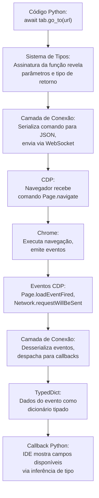

# Análise Profunda: Fundamentos Essenciais

**Domine a base, e todo o resto se torna mais fácil.**

Esta seção cobre as **tecnologias fundamentais** que impulsionam o Pydoll: o Chrome DevTools Protocol (CDP), a comunicação assíncrona baseada em WebSocket e a integração do sistema de tipos do Python. Estes não são apenas detalhes de implementação, são as **decisões de design fundamentais** que tornam o Pydoll rápido, poderoso e seguro em tipos (type-safe).

## Por que os Fundamentos Importam

A maioria dos frameworks de automação abstrai sua camada de comunicação, deixando você com uma "caixa preta" que funciona até deixar de funcionar. Quando algo quebra, a depuração e a otimização tornam-se difíceis sem entender os mecanismos subjacentes.

**O Pydoll adota uma abordagem diferente**: expomos e explicamos os fundamentos, permitindo que você trabalhe tanto como um **usuário do framework** quanto como um **engenheiro de protocolo**.

!!! quote "O Poder dos Primeiros Princípios"
    **"Se você conhece o caminho amplamente, você o verá em todas as coisas."** - Miyamoto Musashi
    
    Entender o CDP, a comunicação assíncrona e os sistemas de tipos não é apenas sobre o Pydoll, é sobre entender **como a automação de navegador moderna funciona em sua essência**. Esse conhecimento se transfere para qualquer ferramenta baseada em CDP e qualquer projeto Python assíncrono.

## Os Três Pilares

### 1. Chrome DevTools Protocol (CDP)
**[→ Leia a Análise Profunda do CDP](./cdp.md)**

**O protocolo que impulsiona a automação de navegador moderna.**

O CDP é o protocolo de depuração nativo do Chrome, o mesmo que o Chrome DevTools (F12) usa. Ao se comunicar diretamente com o CDP, o Pydoll:

- **Elimina o WebDriver** (sem sobrecarga do Selenium, sem intermediários geckodriver/chromedriver)
- **Ganha controle profundo** (modifica requisições, intercepta eventos, executa operações privilegiadas)
- **Alcança velocidade nativa** (comunicação direta via WebSocket, sem polling HTTP)
- **Torna-se indetectável** (sem `navigator.webdriver`, sem fingerprints de WebDriver)

**O que você aprenderá:**

- Como o CDP organiza a funcionalidade em domínios (Page, Network, DOM, Fetch, etc.)
- A arquitetura de comando/evento que impulsiona a automação reativa
- Por que ferramentas baseadas em CDP são **fundamentalmente mais poderosas** que o Selenium
- Como ler a documentação do CDP e estender o Pydoll

**Por que isso importa**: O CDP não é apenas um detalhe de implementação do Pydoll, é a fundação da automação de navegador moderna. Puppeteer, Playwright e ferramentas similares, todas usam CDP. Entendê-lo uma vez fornece conhecimento aplicável a múltiplas ferramentas.

---

### 2. A Camada de Conexão
**[→ Leia a Arquitetura da Camada de Conexão](./connection-layer.md)**

**Comunicação assíncrona feita da maneira certa.**

Enquanto o CDP define **o que** você pode fazer, a Camada de Conexão define **como** o Pydoll se comunica com o navegador. É aqui que as mensagens de protocolo se tornam objetos Python, onde os padrões async/await permitem concorrência, e onde os WebSockets fornecem comunicação bidirecional em tempo real.

**O que você aprenderá:**

- Arquitetura WebSocket: conexões persistentes, enquadramento de mensagens, keep-alive
- O padrão async/await: por que `async def` e `await` permitem automação concorrente
- Correlação comando/resposta: como o Pydoll associa respostas a requisições
- Despacho de eventos: como eventos do navegador disparam callbacks Python
- Tratamento de erros: gerenciamento de timeout, falhas de conexão, degradação graciosa

**Por que isso importa**: A camada de conexão é a espinha dorsal da comunicação do Pydoll. Entendê-la permite:
- **Depuração eficaz**: Inspecionar mensagens fluindo entre Python e Chrome
- **Otimização de desempenho**: Identificar fontes de latência e paralelizar operações
- **Capacidades de extensão**: Adicionar comandos CDP personalizados ou modificar comportamento existente

---

### 3. Integração com Sistema de Tipos do Python
**[→ Leia a Análise Profunda do Sistema de Tipos](./typing-system.md)**

**Tipos fornecem tanto segurança quanto produtividade.**

O sistema de tipos do Python (introduzido no 3.5, melhorado em cada versão desde então) melhora significativamente a experiência de desenvolvimento. O Pydoll utiliza `TypedDict`, `Literal`, `overload` e genéricos para fornecer:

- **Autocompletar da IDE** para campos de resposta do CDP
- **Verificação de tipos (Type checking)** para pegar bugs antes do tempo de execução (`mypy`, `pyright`)
- **Código autodocumentado** (assinaturas de função revelam a estrutura)
- **Segurança na refatoração** (renomeie um campo, a IDE atualiza todos os usos)

**O que você aprenderá:**

- Como `TypedDict` modela estruturas de eventos/respostas do CDP
- Por que `overload` fornece tipos de retorno precisos para `find()`/`query()`
- Como genéricos (`TypeVar`, `Generic[T]`) permitem construção flexível de comandos
- Padrões práticos: anotar callbacks, tipar funções assíncronas, usar `Literal`
- Integração de ferramentas: configurar mypy, aproveitar a inferência de tipos da IDE

**Por que isso importa**: Dicas de tipo (type hints) tornaram-se cada vez mais importantes no Python moderno. A cobertura abrangente de tipos do Pydoll significa:
- **Desenvolvimento mais rápido**: Autocompletar revela campos e métodos disponíveis
- **Menos bugs**: Verificador de tipos pega erros antes que cheguem à produção
- **Melhor refatoração**: Mude assinaturas com confiança com suporte da IDE

---

## Como Esses Fundamentos se Conectam

Entender como CDP, comunicação assíncrona e sistemas de tipos funcionam **juntos** é a chave:

**O fluxo**:

1.  Você escreve código Python com **anotações de tipo** (Sistema de Tipos)
2.  O código serializa para JSON e envia via **WebSocket** (Camada de Conexão)
3.  O navegador recebe e executa **comandos CDP** (CDP)
4.  O navegador emite **eventos CDP** de volta (CDP)
5.  Eventos desserializam em **instâncias de TypedDict** (Sistema de Tipos)
6.  Seus callbacks recebem **objetos de evento com tipos seguros** (Sistema de Tipos)

Cada camada **amplifica** as outras:

- Tipos tornam as respostas do CDP descobríveis
- O modelo de eventos do CDP permite padrões assíncronos
- A comunicação assíncrona torna os tipos essenciais (quais campos existem nesta resposta?)

## Trilha de Aprendizagem

Recomendamos esta progressão:

### Passo 1: CDP
**[Comece Aqui: Chrome DevTools Protocol](./cdp.md)**

Entenda o protocolo que impulsiona tudo. Aprenda domínios, comandos, eventos e como ler a documentação do CDP.

**Resultado**: Você saberá como encontrar e usar qualquer recurso do CDP, não apenas o que o Pydoll expõe.

### Passo 2: Camada de Conexão
**[Continue: Arquitetura da Camada de Conexão](./connection-layer.md)**

Análise profunda da comunicação WebSocket, padrões assíncronos e despacho de eventos.

**Resultado**: Você entenderá exatamente como as mensagens fluem entre Python e Chrome, permitindo depuração e otimização.

### Passo 3: Sistema de Tipos
**[Termine: Sistema de Tipos do Python](./typing-system.md)**

Aprenda como o Pydoll usa a tipagem moderna do Python para segurança e produtividade.

**Resultado**: Você escreverá automação com segurança de tipos e suporte total da IDE, pegando bugs antes que eles rodem.

## Pré-requisitos

Para tirar o máximo proveito desta seção:

- **Fundamentos de Python** - Funções, classes, decoradores
- **Básico de async/await** - Entender as palavras-chave `async def` e `await`
- **Familiaridade com JSON** - Saber como objetos/arrays serializam
- **Browser DevTools** - Ter usado o Inspetor do Chrome (F12)

**Se você é novo em Python assíncrono**, leia isto primeiro: [Real Python: Async IO in Python](https://realpython.com/async-io-python/)

## Além do Básico

Uma vez que você dominar esses fundamentos, estará pronto para:

- **[Arquitetura Interna](../architecture/browser-domain.md)** - Como os componentes do Pydoll se encaixam
- **[Rede e Segurança](../network/index.md)** - Entendimento em nível de protocolo para proxies
- **[Fingerprinting](../fingerprinting/index.md)** - Técnicas de detecção que exigem conhecimento de CDP

## Perguntas Comuns

### "Preciso entender isso para usar o Pydoll?"

**Não**, mas entender esses fundamentos o tornará mais eficaz. O uso básico funciona bem sem esse conhecimento. No entanto, quando você precisar:
- Depurar por que algo não está funcionando
- Otimizar automação lenta
- Estender o Pydoll com comandos CDP personalizados
- Entender mensagens de erro
- Contribuir para o projeto

Esses fundamentos se tornam muito úteis.

### "Isso não é muito baixo nível?"

Este nível de detalhe é intencional. A maioria dos frameworks esconde esses fundamentos, mas a abstração vem com trocas:

- Entendimento permite melhor depuração
- Visibilidade permite otimização
- Conhecimento permite extensão

Ao ensinar os fundamentos, permitimos que você vá além do que o Pydoll oferece de fábrica.

### "Quanto disso eu preciso memorizar?"

**Nada.** O objetivo é construir modelos mentais, não memorização. Após ler estas seções, você desenvolverá intuição para:

- "Isso precisa de CDP, deixe-me checar a documentação do protocolo"
- "Isso está lento por causa de awaits sequenciais, deixe-me paralelizar"
- "Este erro de tipo significa que estou usando o nome de campo errado"

Os detalhes específicos desaparecem, mas o entendimento permanece.

## Filosofia

Esses fundamentos representam conhecimento duradouro:

- **CDP** é o protocolo nativo do Chrome e continua a evoluir
- **Async/await** é o padrão do Python para concorrência
- **Sistemas de tipos** são cada vez mais importantes no Python (PEP 484 em diante)

Aprender esses conceitos agrega valor ao longo de sua carreira de desenvolvimento.

---

## Pronto para Construir Sua Base?

Comece com **[Chrome DevTools Protocol](./cdp.md)** para entender o protocolo que impulsiona tudo. Em seguida, progrida pela Camada de Conexão e Sistema de Tipos para completar seu entendimento fundamental.

**É aqui que a automação se torna engenharia.**

---

!!! tip "Após Completar os Fundamentos"
    Uma vez que você dominar esses conceitos, você os verá em **toda parte** na arquitetura do Pydoll:
    
    - Browser/Tab/WebElement todos usam a **Camada de Conexão**
    - Eventos de rede todos seguem o **modelo de eventos do CDP**
    - Todas as respostas usam **TypedDict** para segurança de tipos
    
    Os fundamentos não estão separados do Pydoll, eles **são** a fundação do Pydoll.