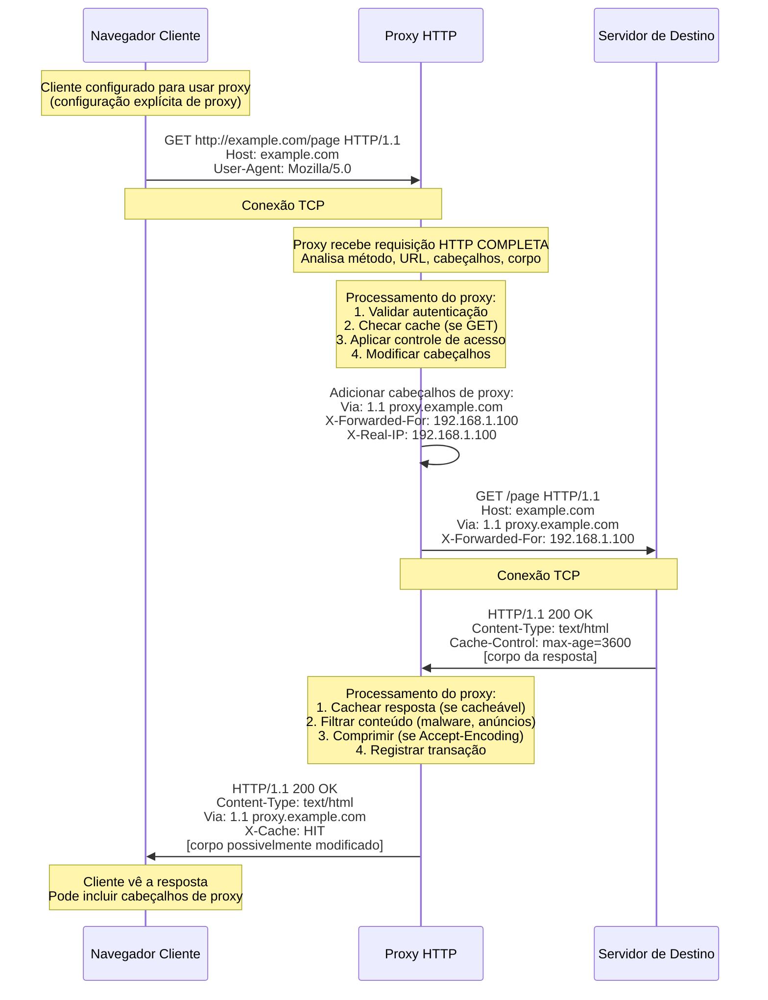
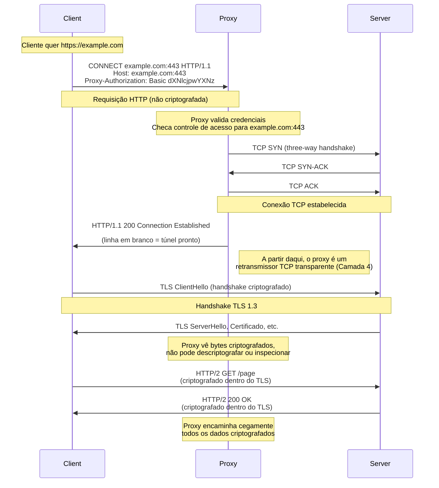
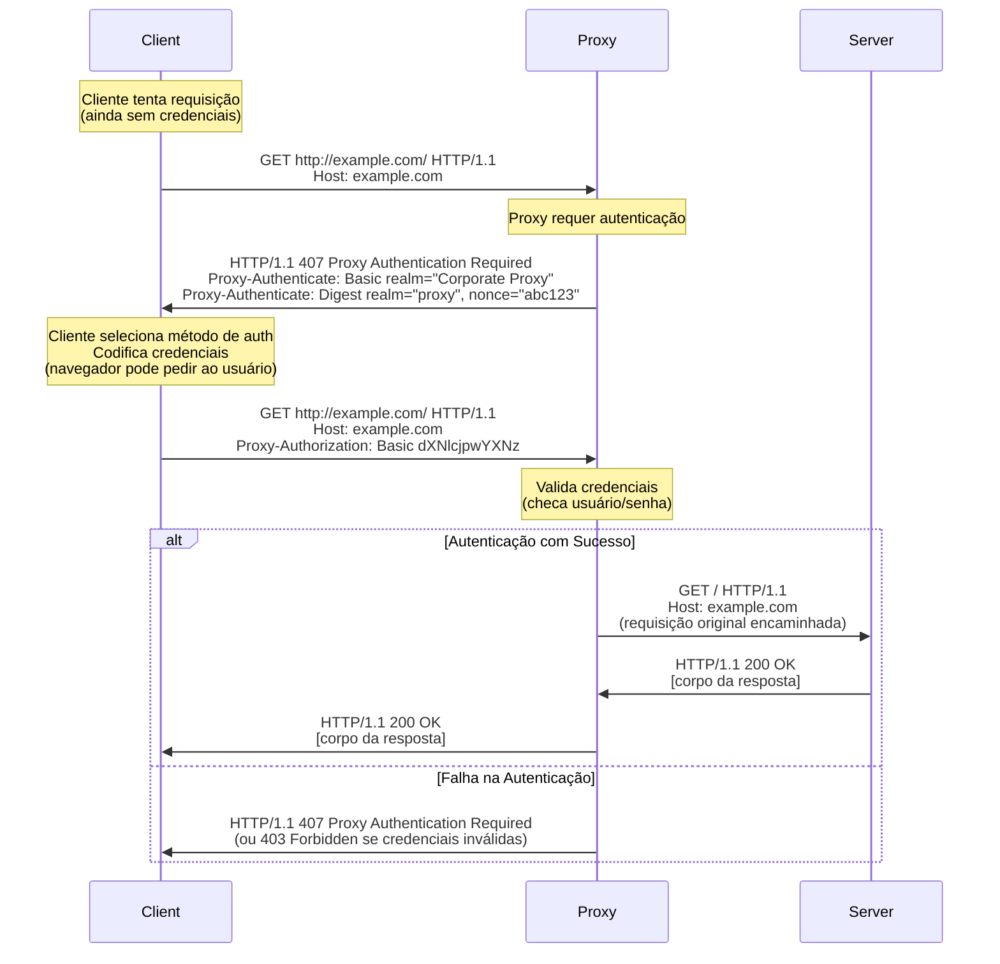
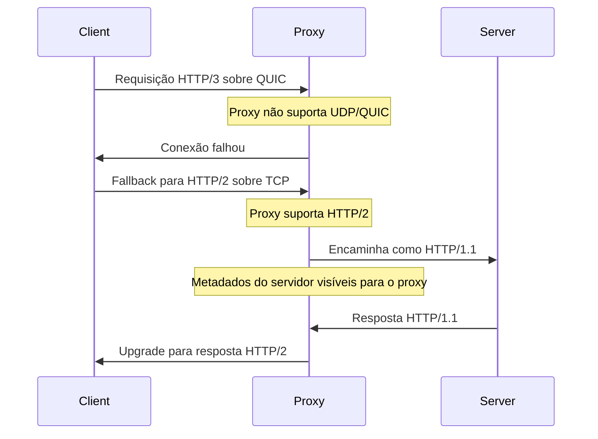

# Arquitetura de Proxy HTTP/HTTPS

Este documento explora em profundidade os proxies HTTP e HTTPS, o protocolo de proxy mais comum, mas também o mais **limitado**. Apesar de sua onipresença (quase toda rede corporativa os utiliza), os proxies HTTP têm limitações fundamentais de segurança e arquitetura que os tornam inadequados para muitos casos de uso críticos de privacidade.

Entender como eles funcionam no nível do protocolo, suas implicações de segurança, manipulação de cabeçalhos, semântica de cache e variações modernas do protocolo (HTTP/2, HTTP/3) é crucial para a seleção informada de proxy e automação de navegador eficaz.

!!! info "Navegação do Módulo"
    - **[← Fundamentos de Rede](./network-fundamentals.md)** - TCP/IP, UDP, modelo OSI
    - **[← Visão Geral de Rede e Segurança](./index.md)** - Introdução do módulo
    - **[→ Proxies SOCKS](./socks-proxies.md)** - Alternativa mais segura
    - **[→ Detecção de Proxy](./proxy-detection.md)** - Como evitar detecção
    
    Para configuração prática, veja **[Configuração de Proxy](../../features/configuration/proxy.md)**.

!!! warning "Limitações de Segurança"
    Proxies HTTP operam na **Camada 7** (Camada de Aplicação no modelo OSI). Este posicionamento lhes dá:
    
    **Visibilidade total** do tráfego HTTP não criptografado (URLs, cabeçalhos, corpos)
    **Capacidades de modificação** (podem alterar requisições/respostas em trânsito)
    **Cache inteligente** (entende a semântica HTTP)
    
    Mas também significa que eles:
    
    **Podem ler, registrar e modificar** todo o tráfego HTTP não criptografado
    **Não podem proxyar protocolos não-HTTP** (FTP, SSH, SMTP, protocolos customizados)
    **Devem terminar o TLS** para inspecionar HTTPS (quebrando a criptografia de ponta a ponta)
    
    Para privacidade verdadeira, use **SOCKS5** ou garanta que a criptografia TLS de ponta a ponta permaneça intacta.

## Introdução: Proxy de Camada 7

Proxies HTTP são **proxies da camada de aplicação**, operando na **Camada 7 do modelo OSI**. Diferente dos proxies SOCKS (Camada 5) que cegamente encaminham bytes, os proxies HTTP **entendem a semântica do protocolo HTTP**. Eles analisam requisições, interpretam cabeçalhos, aplicam lógica de cache e podem modificar o tráfego com base em regras HTTP.

**Contexto Histórico:**

Proxies HTTP surgiram em meados dos anos 1990 conforme as redes corporativas cresciam e as organizações precisavam de:

1.  **Filtragem de conteúdo** - Bloquear sites inapropriados
2.  **Otimização de banda** - Cachear recursos frequentemente acessados
3.  **Controle de acesso** - Aplicar políticas de uso
4.  **Segurança** - Inspecionar tráfego em busca de malware

A especificação HTTP/1.0 (RFC 1945, 1996) formalizou o comportamento do proxy, e o HTTP/1.1 (RFC 2616, 1999, atualizado por RFC 7230-7237) o refinou significativamente. Estes RFCs definem como proxies devem lidar com cache, conexões persistentes e semântica de encaminhamento.

**Por que o Posicionamento na Camada de Aplicação Importa:**

Operar na Camada 7 significa que os proxies HTTP:

- **Veem requisições HTTP completas** - Método, URL, cabeçalhos, corpo (se não criptografado)
- **Podem tomar decisões inteligentes** - Cachear baseado em `Cache-Control`, reescrever URLs, comprimir respostas
- **Deixam fingerprints (impressões digitais)** - Adicionam cabeçalhos como `Via`, `X-Forwarded-For` revelando o uso de proxy
- **São específicos do protocolo** - Podem proxyar apenas HTTP/HTTPS, não outros protocolos

Essa integração profunda com o HTTP é tanto sua **força** (rica funcionalidade) quanto sua **fraqueza** (escopo limitado, preocupações com privacidade).

## Operação do Proxy HTTP: Encaminhamento de Requisição

Um proxy HTTP intercepta requisições HTTP de clientes, processa-as e as encaminha para os servidores de destino. O proxy atua tanto como um **servidor** (para o cliente) quanto como um **cliente** (para o servidor de destino), mantendo duas conexões TCP separadas.

### O Fluxo de Requisição do Proxy HTTP



**Detalhamento:**

**1. Iniciação da Requisição (Cliente → Proxy)**

O cliente envia uma **requisição HTTP completa** para o proxy, incluindo a **URI absoluta** (não apenas o caminho):

```http
GET http://example.com/page HTTP/1.1
Host: example.com
User-Agent: Mozilla/5.0 (Windows NT 10.0; Win64; x64)
Accept: text/html,application/xhtml+xml
Accept-Encoding: gzip, deflate
Connection: keep-alive
```

**Diferença chave de requisições diretas:** A linha `GET` inclui a **URL completa** (`http://example.com/page`), não apenas o caminho (`/page`). Isso diz ao proxy para onde encaminhar a requisição.

!!! tip "URIs Absolutas vs Relativas"
    **Direto ao servidor**: `GET /page HTTP/1.1`
    **Através de proxy**: `GET http://example.com/page HTTP/1.1`
    
    Essa diferença é como o proxy sabe o destino. O cabeçalho `Host` sozinho não é suficiente porque o proxy pode estar encaminhando para múltiplos domínios.

**2. Processamento do Proxy - Análise da Requisição**

O proxy **analisa toda a requisição HTTP** e toma decisões:

```python
# Lógica simplificada de processamento do proxy
def process_request(request):
    # 1. Checagem de autenticação
    if not authenticate_user(request.headers.get('Proxy-Authorization')):
        return HTTP_407_PROXY_AUTH_REQUIRED
    
    # 2. Controle de acesso
    if is_blocked(request.url):
        return HTTP_403_FORBIDDEN
    
    # 3. Checagem de cache (para requisições GET)
    if request.method == 'GET':
        cached = check_cache(request.url)
        if cached and not_expired(cached):
            return cached  # Cache hit - não precisa de requisição ao servidor
    
    # 4. Modificação de cabeçalho
    request.headers['Via'] = '1.1 proxy.example.com'
    request.headers['X-Forwarded-For'] = client_ip
    request.headers['X-Real-IP'] = client_ip
    
    # 5. Encaminhar ao servidor
    return forward_to_server(request)
```

**3. Encaminhamento da Requisição (Proxy → Servidor)**

O proxy estabelece uma **conexão TCP separada** com o servidor de destino e encaminha a requisição. O proxy pode modificar cabeçalhos:

**Cabeçalhos adicionados pelo proxy:**

- `Via: 1.1 proxy.example.com` - Identifica o proxy na cadeia (RFC 7230)
- `X-Forwarded-For: 192.168.1.100` - IP original do cliente (padrão de facto)
- `X-Real-IP: 192.168.1.100` - IP original do cliente (cabeçalho alternativo)
- `X-Forwarded-Proto: http` - Protocolo original (http vs https)
- `X-Forwarded-Host: example.com` - Cabeçalho `Host` original

!!! danger "Vazamento de Privacidade via Cabeçalhos de Proxy"
    **Esses cabeçalhos revelam que você está usando um proxy!** Sistemas de detecção procuram por:
    - Cabeçalho `Via` presente → Proxy confirmado
    - `X-Forwarded-For` com múltiplos IPs → Cadeia de proxies
    - `X-Real-IP` não bate com o IP da conexão → Proxy confirmado
    
    Proxies sofisticados podem **remover esses cabeçalhos**, mas muitos não o fazem por padrão.

**4. Resposta do Servidor (Servidor → Proxy)**

O servidor responde ao proxy:

```http
HTTP/1.1 200 OK
Date: Mon, 01 Jan 2024 12:00:00 GMT
Server: nginx/1.18.0
Content-Type: text/html; charset=UTF-8
Content-Length: 1234
Cache-Control: public, max-age=3600
ETag: "abc123"

<!DOCTYPE html>
<html>...
```

**5. Processamento do Proxy - Manipulação da Resposta**

O proxy pode realizar várias operações na resposta:

```python
def process_response(response, request):
    # 1. Decisão de cache
    if should_cache(response):
        cache_entry = {
            'url': request.url,
            'response': response,
            'expires': now() + parse_cache_control(response.headers['Cache-Control'])
        }
        save_to_cache(cache_entry)
    
    # 2. Filtragem de conteúdo
    if contains_malware(response.body):
        return HTTP_403_FORBIDDEN
    
    # 3. Compressão (se o cliente suportar)
    if 'gzip' in request.headers.get('Accept-Encoding', ''):
        response.body = gzip_compress(response.body)
        response.headers['Content-Encoding'] = 'gzip'
    
    # 4. Modificação de cabeçalho
    response.headers['Via'] = '1.1 proxy.example.com'
    response.headers['X-Cache'] = 'HIT' if from_cache else 'MISS'
    
    # 5. Logging
    log_transaction(request, response)
    
    return response
```

**6. Entrega da Resposta (Proxy → Cliente)**

O proxy envia a resposta (possivelmente modificada) de volta ao cliente:

```http
HTTP/1.1 200 OK
Date: Mon, 01 Jan 2024 12:00:00 GMT
Content-Type: text/html; charset=UTF-8
Content-Encoding: gzip
Via: 1.1 proxy.example.com
X-Cache: HIT
Age: 120

[corpo da resposta comprimido]
```

### Capacidades e Limitações Chave

**O que Proxies HTTP PODEM Fazer:**

- **Ler requisições/respostas HTTP inteiras** (se não criptografadas)
- **Modificar cabeçalhos** (adicionar `Via`, `X-Forwarded-For`, remover cabeçalhos sensíveis)
- **Cachear respostas** com base na semântica HTTP (`Cache-Control`, `ETag`)
- **Comprimir/descomprimir** conteúdo (gzip, deflate, br)
- **Filtrar conteúdo** (bloquear URLs, escanear malware, remover anúncios)
- **Autenticar usuários** (via cabeçalho `Proxy-Authorization`)
- **Registrar todo o tráfego** (URLs visitadas, dados transferidos, tempos)
- **Reescrever URLs** (redirecionar, canonizar)
- **Injetar conteúdo** (anúncios, scripts de rastreamento, avisos)

**O que Proxies HTTP NÃO PODEM Fazer:**

- **Proxyar protocolos não-HTTP** (FTP, SSH, SMTP, upgrade WebSocket, protocolos customizados)
- **Inspecionar conteúdo HTTPS** sem terminação TLS (quebrando criptografia ponta-a-ponta)
- **Esconder que você está usando um proxy** (a menos que cabeçalhos sejam cuidadosamente removidos)
- **Proxyar tráfego UDP** (WebRTC, DNS, QUIC)
- **Preservar TLS ponta-a-ponta** enquanto inspeciona conteúdo (incompatibilidade fundamental)

!!! warning "O Dilema Fundamental do HTTPS"
    Proxies HTTP enfrentam uma escolha impossível com HTTPS:
    
    **Opção A: Túnel cego (método CONNECT)**

    - Proxy não pode ler/cachear/filtrar conteúdo HTTPS
    - Criptografia ponta-a-ponta preservada
    - Proxy vê apenas IP:porta de destino, não URLs
    
    **Opção B: Terminação TLS (MITM - Man-in-the-Middle)**

    - Proxy descriptografa HTTPS, inspeciona conteúdo, recriptografa
    - Quebra a criptografia ponta-a-ponta
    - Requer instalação do certificado CA do proxy no cliente
    - Detectável por certificate pinning, logs de CT
    
    A maioria dos proxies corporativos escolhe a Opção B (terminação TLS) para filtragem de conteúdo. A maioria dos proxies focados em privacidade escolhe a Opção A (túnel cego).

### O Método HTTP CONNECT: Tunelamento HTTPS

O método `CONNECT` (definido na RFC 7231 Seção 4.3.6) resolve o problema do HTTPS: como um proxy HTTP pode encaminhar tráfego criptografado que não pode ler? Resposta: **tornando-se um túnel TCP cego**.

Quando um cliente quer acessar um site HTTPS através de um proxy, ele usa `CONNECT` para pedir ao proxy que estabeleça um **túnel TCP bruto** para o destino. Após o túnel ser estabelecido, o proxy simplesmente encaminha bytes em ambas as direções sem interpretá-los. Ele se torna Camada 4 (transporte) em vez de Camada 7 (aplicação).



#### Formato da Requisição CONNECT

```http
CONNECT example.com:443 HTTP/1.1
Host: example.com:443
Proxy-Authorization: Basic dXNlcjpwYXNz
User-Agent: Mozilla/5.0 (Windows NT 10.0; Win64; x64)
```

**Características chave:**

1.  **Método**: `CONNECT` (não GET/POST)
2.  **Request-URI**: `host:port` (não um caminho como `/page`)
3.  **Porta obrigatória**: Geralmente `443` para HTTPS, mas qualquer porta é válida
4.  **Autenticação**: `Proxy-Authorization` se o proxy exigir
5.  **Sem corpo de requisição**: Requisições CONNECT não têm corpo

#### Formato da Resposta CONNECT

**Sucesso (túnel estabelecido):**

```http
HTTP/1.1 200 Connection Established
```

**É isso!** Apenas a linha de status e uma linha em branco. Após a linha em branco, a conversa HTTP termina e o proxy se torna um **túnel TCP transparente**.

**Respostas de falha:**

```http
HTTP/1.1 407 Proxy Authentication Required
Proxy-Authenticate: Basic realm="proxy"

HTTP/1.1 403 Forbidden
Content-Type: text/plain

Access to example.com:443 is blocked by policy.

HTTP/1.1 502 Bad Gateway
Content-Type: text/plain

Cannot establish connection to example.com:443
```

#### O que Acontece Após o CONNECT ser Bem-sucedido

Uma vez que o proxy envia `200 Connection Established`, ele **deixa de ser um proxy HTTP** e se torna um **retransmissor TCP de Camada 4**. O cliente e o servidor estabelecem TLS diretamente, com o proxy encaminhando bytes cegamente:

```python
# Implementação simplificada de túnel de proxy
def handle_connect(client_socket, target_host, target_port):
    # 1. Estabelecer conexão TCP com o alvo
    server_socket = socket.create_connection((target_host, target_port))
    
    # 2. Enviar 200 para o cliente
    client_socket.send(b'HTTP/1.1 200 Connection Established\r\n\r\n')
    
    # 3. Tornar-se retransmissor transparente (encaminhamento bidirecional)
    while True:
        # Esperar por dados de qualquer lado
        readable, _, _ = select.select([client_socket, server_socket], [], [])
        
        for sock in readable:
            data = sock.recv(8192)
            if not data:
                # Conexão fechada
                return
            
            # Encaminhar dados para o outro lado
            if sock is client_socket:
                server_socket.send(data)  # Cliente → Servidor
            else:
                client_socket.send(data)  # Servidor → Cliente
```

**O que o proxy pode ver:**

- **Hostname e porta de destino** - Da requisição CONNECT
- **Tempo de conexão** - Quando estabelecida, quanto tempo aberta
- **Volume de dados** - Total de bytes transferidos em cada direção
- **Fechamento da conexão** - Quando qualquer lado termina

**O que o proxy NÃO PODE ver:**

- **Detalhes do handshake TLS** - Criptografados, mas padrões observáveis existem
- **Método/URL HTTP** - Criptografados dentro do TLS
- **Cabeçalhos de requisição/resposta** - Criptografados dentro do TLS
- **Conteúdo da resposta** - Criptografado dentro do TLS
- **Cookies, tokens de sessão** - Criptografados dentro do TLS

!!! tip "Fingerprinting de Handshake TLS"
    Embora o proxy não possa descriptografar o handshake TLS, ele pode **observar sua estrutura**. Os primeiros pacotes após o `CONNECT` revelam:
    - Versão do TLS (1.2 vs 1.3)
    - Tamanho e tempo do ClientHello
    - Ordem das suítes de cifras (via tamanhos de pacote)
    - Extensões usadas (via padrões de pacote)
    
    Isso habilita **fingerprinting passivo de TLS** (JA3) mesmo através de túneis CONNECT. Veja [Network Fingerprinting](../fingerprinting/network-fingerprinting.md) para detalhes.

#### CONNECT vs Proxy HTTP Direto

| Aspecto | HTTP (sem CONNECT) | HTTPS (túnel CONNECT) |
|---|---|---|
| **Visibilidade do proxy** | Requisição/resposta HTTP completa | Apenas host:porta de destino |
| **Criptografia** | Não (a menos que haja terminação TLS) | TLS ponta-a-ponta (cliente ⟷ servidor) |
| **Cache** | Sim, baseado na semântica HTTP | Não (conteúdo criptografado) |
| **Filtragem de conteúdo** | Sim (pode inspecionar/bloquear) | Não (apenas bloqueio baseado em hostname) |
| **Modificação de cabeçalho** | Sim (pode adicionar/remover) | Não (cabeçalhos criptografados) |
| **Visibilidade da URL** | URL completa visível | Apenas hostname visível |
| **Protocolo** | Apenas HTTP | Qualquer protocolo sobre TCP (HTTPS, SSH, FTP-over-TLS) |

#### Implicações de Segurança do CONNECT

**Para Privacidade (Bom):**

- **TLS ponta-a-ponta preservado** - Cliente verifica o certificado do servidor diretamente
- **Nenhum MITM possível** (a menos que o cliente confie na CA do proxy)
- **Certificate pinning funciona** - Cliente vê o certificado real do servidor

**Para Privacidade (Ruim):**

- **Hostname vazado** - Proxy sabe que você acessou `example.com:443`
- **Análise de tempo possível** - Padrões de tráfego observáveis
- **Fingerprinting TLS** - Análise passiva do ClientHello

**Para Segurança Corporativa (Ruim):**

- **Sem inspeção de conteúdo** - Não pode escanear malware, perda de dados
- **Cego para ameaças** - Tráfego C2 criptografado, exfiltração invisível
- **Bypass de política** - Usuários podem tunelar protocolos arbitrários

**É por isso que proxies corporativos frequentemente usam terminação TLS (MITM) em vez de túneis CONNECT.**

#### CONNECT para Protocolos Não-HTTPS

Embora `CONNECT` seja primariamente usado para HTTPS, ele pode tunelar **qualquer protocolo baseado em TCP**:

```http
CONNECT mail.example.com:993 HTTP/1.1
Host: mail.example.com:993

[Túnel estabelecido, tráfego IMAPS flui]
```

```http
CONNECT ssh.example.com:22 HTTP/1.1
Host: ssh.example.com:22

[Túnel estabelecido, tráfego SSH flui]
```

Isso torna proxies HTTP com suporte a `CONNECT` **surpreendentemente versáteis**. Eles podem proxyar SSH, FTP-over-TLS, IMAPS, SMTPS e outros protocolos criptografados, não apenas HTTPS.

!!! danger "Abuso e Restrições do CONNECT"
    Como `CONNECT` habilita o tunelamento de conexões TCP arbitrárias, muitos proxies:

    - **Restringem portas permitidas** (frequentemente apenas 443 para HTTPS)
    - **Bloqueiam hosts suspeitos** (C2 de malware conhecidos, nós Tor)
    - **Registram todas as tentativas de CONNECT** (para auditoria de segurança)
    - **Exigem autenticação** (para rastrear usuários)
    
    Se você tentar `CONNECT example.com:22` (SSH), muitos proxies corporativos retornarão `403 Forbidden`.

### Autenticação de Proxy HTTP: Controle de Acesso

Diferente dos proxies SOCKS (que suportam autenticação como parte do handshake do protocolo), proxies HTTP usam **cabeçalhos de autenticação HTTP** para controlar o acesso. Isso significa que a autenticação acontece **na camada de aplicação** usando códigos de status e cabeçalhos HTTP padrão.

O fluxo de autenticação segue a **RFC 7235 (Autenticação HTTP)**, usando o código de status `407 Proxy Authentication Required` (análogo ao `401 Unauthorized` para servidores) e o cabeçalho de requisição `Proxy-Authorization` (análogo ao `Authorization`).

#### Fluxo de Autenticação



#### Esquemas de Autenticação: Comparação Detalhada

HTTP suporta múltiplos esquemas de autenticação, cada um com diferentes características de segurança:

| Esquema | RFC | Nível de Segurança | Mecanismo | Pontos Fortes | Pontos Fracos |
|---|---|---|---|---|---|
| **Basic** | RFC 7617 | Baixo | `username:password` codificado em Base64 | Simples, suporte universal | **Texto puro** (trivial de decodificar), sem proteção contra replay |
| **Digest** | RFC 7616 | Médio | Desafio-resposta com MD5/SHA-256 | Evita transmissão em texto puro, proteção contra replay | Vulnerável a rainbow tables, raramente implementado |
| **NTLM** | Proprietário (Microsoft) | Médio | Desafio-resposta (hash NT) | Integração Windows, SSO | Proprietário, complexo, vulnerabilidades conhecidas |
| **Negotiate** | RFC 4559 | Alto | Kerberos/SPNEGO | Criptografia forte, SSO, auth mútua | Configuração complexa, dependência do Active Directory |
| **Bearer** | RFC 6750 | Alto (se token seguro) | Token OAuth 2.0 | Amigável para APIs, tokens revogáveis | Roubo de token = acesso total, requer infra de token |

#### Autenticação Basic: A Mais Simples (e Mais Fraca)

**Formato:**
```http
Proxy-Authorization: Basic base64(username:password)
```

**Exemplo:**
```python
# Usuário: "user", Senha: "pass"
credentials = "user:pass"
encoded = base64.b64encode(credentials.encode()).decode()
# Resultado: "dXNlcjpwYXNz"

# No cabeçalho HTTP:
Proxy-Authorization: Basic dXNlcjpwYXNz
```

**Problemas de Segurança:**

1.  **Base64 NÃO é criptografia** - É trivial decodificar:
    ```python
    >>> import base64
    >>> base64.b64decode('dXNlcjpwYXNz').decode()
    'user:pass'  # Credenciais expostas!
    ```

2.  **Visível em logs** - Logs de proxy frequentemente incluem cabeçalhos, vazando credenciais

3.  **Replicável (Replayable)** - Qualquer um que interceptar o cabeçalho pode reusá-lo indefinidamente

4.  **Sem proteção de integridade** - Pode ser modificado em trânsito

!!! danger "Basic Auth Sobre Conexões Não Criptografadas"
    Enviar `Proxy-Authorization: Basic` sobre HTTP (não HTTPS) é **catastroficamente inseguro**:

    - Credenciais transmitidas em texto puro (base64 não é criptografia!)
    - Visível para qualquer observador da rede (ISP, bisbilhoteiros de WiFi, atacantes MITM)
    - Registrado por proxies intermediários e servidores
    
    **Sempre use Basic Auth sobre TLS/HTTPS**, ou use um esquema mais seguro como Digest ou Negotiate.

**Quando usar Basic:**

- Conexão do proxy é sobre TLS (HTTPS para o proxy)
- Testes rápidos/desenvolvimento (nunca produção!)
- Sistemas legados sem alternativa

#### Autenticação Digest: Desafio-Resposta

**Formato:**
```http
# Desafio do servidor
Proxy-Authenticate: Digest realm="proxy",
                          qop="auth",
                          nonce="dcd98b7102dd2f0e8b11d0f600bfb0c093",
                          opaque="5ccc069c403ebaf9f0171e9517f40e41"

# Resposta do cliente
Proxy-Authorization: Digest username="user",
                            realm="proxy",
                            nonce="dcd98b7102dd2f0e8b11d0f600bfb0c093",
                            uri="http://example.com/",
                            qop=auth,
                            nc=00000001,
                            cnonce="0a4f113b",
                            response="6629fae49393a05397450978507c4ef1",
                            opaque="5ccc069c403ebaf9f0171e9517f40e41"
```

**Como funciona:**

1.  **Proxy envia desafio** com `nonce` aleatório (número usado uma vez)
2.  **Cliente computa hash**:
    ```python
    HA1 = MD5(username + ":" + realm + ":" + password)
    HA2 = MD5(method + ":" + uri)
    response = MD5(HA1 + ":" + nonce + ":" + nc + ":" + cnonce + ":" + qop + ":" + HA2)
    ```
3.  **Proxy verifica** computando o mesmo hash e comparando

**Melhorias de Segurança sobre o Basic:**

- Senha nunca é transmitida (apenas hash)
- Proteção contra replay (nonce muda a cada desafio)
- Proteção de integridade (hash inclui método e URI)

**Problemas Restantes:**

- MD5 é criptograficamente fraco (ataques de rainbow table)
- Sem criptografia (conteúdo ainda visível se não usar TLS)
- Complexo de implementar corretamente

!!! tip "Digest com SHA-256"
    A RFC 7616 (2015) atualizou o Digest para suportar SHA-256 em vez de MD5, abordando a fraqueza criptográfica. No entanto, o suporte ainda é limitado. Muitos proxies implementam apenas MD5.

#### NTLM: Autenticação Integrada do Windows

NTLM (NT LAN Manager) é o protocolo proprietário de desafio-resposta da Microsoft, comumente usado em ambientes corporativos Windows.

**Fluxo de Autenticação:**

1.  **Tipo 1 (Negociação)**: Cliente anuncia capacidades
2.  **Tipo 2 (Desafio)**: Servidor envia desafio de 8 bytes
3.  **Tipo 3 (Autenticação)**: Cliente envia resposta de hash NT

**Exemplo (simplificado):**
```http
# Passo 1: Negociação
Proxy-Authorization: NTLM TlRMTVNTUAABAAAAB4IIogAAAAAAAAAAAAAAAAAAAAAFASgKAAAADw==

# Passo 2: Desafio
Proxy-Authenticate: NTLM TlRMTVNTUAACAAAADAAMADgAAAAFgooCBqqVKFrKPCMAAAAAAAAAAAAAAAAAAP8=

# Passo 3: Autenticação
Proxy-Authorization: NTLM TlRMTVNTUAADAAAAGAAYAEgAAAAYABgAYAAAAAwADAB4AAAACAAIAIQAAAAAAAAAAAAAABVCSUCAgICAgICAgICAgICAgICAgICAgICAgICAgICAgICAgICAgICAgICAgICAgA==
```

**Vantagens:**

- Integração transparente com Windows (SSO com Active Directory)
- Senha não é transmitida
- Suporta autenticação de domínio

**Desvantagens:**

- Proprietário (engenharia reversa, não padronizado)
- Fraquezas criptográficas conhecidas (NTLMv1 quebrado, NTLMv2 vulnerável)
- Protocolo complexo (múltiplas idas e vindas)
- Ligado à conexão (quebra com multiplexação HTTP/2)

!!! warning "Preocupações de Segurança NTLM"
    NTLM tem vulnerabilidades conhecidas:
    - **Ataques Pass-the-hash**: Hash roubado pode autenticar sem saber a senha
    - **Ataques de relay (retransmissão)**: Atacante retransmite autenticação para outro servidor
    - **Criptografia fraca**: NTLMv1 usa DES (quebrado), NTLMv2 usa MD5 (fraco)
    
    A Microsoft recomenda **Kerberos** (via Negotiate) em vez de NTLM para novas implantações.

#### Negotiate (Kerberos): SSO Corporativo

**Negotiate** (RFC 4559) usa SPNEGO (Simple and Protected GSSAPI Negotiation) para selecionar entre Kerberos e NTLM, preferindo Kerberos.

**Fluxo Kerberos:**

1.  Cliente solicita **ticket-granting ticket (TGT)** do Key Distribution Center (KDC)
2.  Cliente solicita **service ticket** para o serviço de proxy
3.  Cliente apresenta service ticket ao proxy
4.  Proxy valida ticket com o KDC

**Exemplo:**
```http
Proxy-Authorization: Negotiate YIIFyQYGKwYBBQUCoIIFvTCCBbmgMDAuBgkqhkiC9xIBAgIGCSqGSIb3EgECAgYKKwYBBAGCNwICHgYKKwYBBAGCNwICCqKCBYMEggV/...
```

**Vantagens:**
- **Segurança mais forte**: Criptografia AES, autenticação mútua
- **SSO Verdadeiro**: Sem prompts de senha para usuários do domínio
- **Expiração de ticket**: Autenticação limitada por tempo
- **Auditoria**: Log centralizado no KDC

**Desvantagens:**
- **Configuração complexa**: Requer infraestrutura Active Directory
- **Multiplataforma limitado**: Melhor no Windows, suporte limitado em macOS/Linux
- **Sincronização de tempo**: Requer relógios precisos (tickets Kerberos são sensíveis ao tempo)

!!! info "Kerberos na Automação de Navegador"
    O Pydoll (e a maioria dos navegadores headless) têm **suporte limitado a Kerberos** porque:

    - Requer integração em nível de SO (cache de ticket, keytab)
    - Precisa de máquina ingressada no domínio
    - Complexo de configurar programaticamente
    
    Para testes automatizados em ambientes Kerberos, considere usar uma **conta de serviço** com autenticação Basic/Digest.

#### Configuração Prática no Pydoll

**Autenticação Básica:**
```python
from pydoll.browser import Chrome
from pydoll.browser.options import ChromiumOptions

options = ChromiumOptions()
options.add_argument('--proxy-server=http://user:pass@ip:port')

async with Chrome(options=options) as browser:
    tab = await browser.start()
    await tab.go_to('http://example.com')
```

**Autenticação via Domínio Fetch (Avançado):**

O Pydoll usa o **domínio Fetch** do Chrome para lidar automaticamente com a autenticação de proxy para qualquer esquema que o navegador suporte (Basic, Digest, NTLM, Negotiate):

```python
# Implementação interna do Pydoll (simplificada)
async def handle_auth_required(self, event):
    # Navegador detectou 407 Proxy Authentication Required
    auth_challenge_id = event['requestId']
    
    # Responder com credenciais
    await self._execute_command('Fetch.continueWithAuth', {
        'requestId': auth_challenge_id,
        'authChallengeResponse': {
            'response': 'ProvideCredentials',
            'username': self.proxy_username,
            'password': self.proxy_password
        }
    })
```

Esta abordagem funciona para **todos os esquemas de autenticação** sem que o Pydoll precise implementar lógica específica do protocolo. O Chrome lida com Digest/NTLM/Negotiate internamente.

!!! tip "Melhores Práticas de Autenticação"
    - **Use conexões de proxy criptografadas com TLS** (proxy HTTPS ou túnel SSH)
    - **Prefira tokens Bearer** para proxies de API (revogáveis, limitados por tempo)
    - **Use Digest** em vez de Basic se o TLS não estiver disponível
    - **Rotacione credenciais** regularmente
    - **Monitore falhas de autenticação** (podem indicar roubo de credenciais)
    
    - **Nunca use Basic auth sobre HTTP** (conexão não criptografada)
    - **Não codifique credenciais no código** (use variáveis de ambiente)
    - **Não reutilize credenciais** entre proxies
    - **Não registre cabeçalhos Proxy-Authorization** em logs

## Protocolos HTTP Modernos e Proxying

Proxies HTTP/1.1 tradicionais são bem compreendidos, mas protocolos modernos introduzem novas considerações.

### Proxies HTTP/2

HTTP/2 introduziu a multiplexação, que muda fundamentalmente como proxies lidam com conexões:

**Diferenças chave:**

| Característica | HTTP/1.1 | HTTP/2 |
|---|---|---|
| **Conexões** | Uma requisição por conexão (ou sequencial) | Múltiplas requisições sobre conexão única |
| **Multiplexação** | Não (bloqueio head-of-line) | Sim (streams concorrentes) |
| **Compressão de Cabeçalho** | Nenhuma | Compressão HPACK |
| **Server Push** | Não suportado | Servidor pode enviar recursos |
| **Complexidade do Proxy** | Encaminhamento simples de req/resp | Deve gerenciar priorização de stream |

**Implicações para proxying:**

```python
# Proxy HTTP/1.1: Mapeamento simples um-para-um
client_conn_1 → proxy → server_conn_1  # Requisição A
client_conn_2 → proxy → server_conn_2  # Requisição B

# Proxy HTTP/2: Gerenciamento complexo de stream
client_conn (streams 1,3,5) → proxy → server_conn (streams 2,4,6)
#     ↓ Deve manter IDs de stream e priorização
```

**Impacto no desempenho:**

- **Positivo**: Sobrecarga de conexão reduzida, melhor utilização de banda
- **Negativo**: Proxy deve analisar enquadramento binário, gerenciar estados de stream
- **Risco de vazamento**: IDs de stream e prioridades podem dar fingerprint do comportamento do cliente

!!! info "Detecção de Proxy HTTP/2"
    A multiplexação HTTP/2 torna mais difícil correlacionar requisições com clientes quando múltiplos usuários compartilham um proxy, mas metadados de stream (tamanhos de janela, configurações de prioridade) ainda podem aplicar fingerprinting em clientes individuais.

### Proxies HTTP/3 (QUIC)

HTTP/3 roda sobre QUIC (baseado em UDP) em vez de TCP, introduzindo novos desafios:

**Características do QUIC:**

| Aspecto | TCP + TLS | QUIC (UDP) |
|---|---|---|
| **Transporte** | TCP (orientado à conexão) | UDP (sem conexão) |
| **Handshake** | TCP + TLS separados (2 RTTs) | Combinados (0-1 RTT) |
| **Bloqueio head-of-line** | Sim (nível TCP) | Não (apenas nível de stream) |
| **Migração de conexão** | Não suportado | Suportado (sobrevive a mudanças de IP) |
| **Compatibilidade de proxy** | Excelente | Limitada (requer suporte UDP) |

**Implicações para proxying:**

1.  **Requisito UDP**: Proxies HTTP tradicionais (apenas TCP) não podem lidar com HTTP/3
2.  **Migração de conexão**: Conexões QUIC podem sobreviver a mudanças de IP, complicando o gerenciamento de sessão do proxy
3.  **Transporte criptografado**: QUIC criptografa quase tudo, incluindo metadados de conexão
4.  **CONNECT-UDP**: Novo método necessário (RFC 9298) para proxyar QUIC

```python
# Cadeia de proxy tradicional
Cliente --TCP--> Proxy HTTP --TCP--> Servidor

# Cadeia de proxy HTTP/3 (requer CONNECT-UDP)
Cliente --UDP/QUIC--> Proxy --UDP/QUIC--> Servidor
       (ou)
Cliente --TCP/CONNECT-UDP--> Proxy --UDP/QUIC--> Servidor
```

!!! warning "Suporte a Proxy HTTP/3"
    A maioria dos proxies tradicionais (incluindo muitos serviços comerciais) não suporta HTTP/3. Navegadores tipicamente recorrem ao HTTP/2 ou HTTP/1.1 quando proxies não suportam QUIC.
    
    Esse fallback pode ser um **problema de privacidade**: Se você espera os metadados criptografados do HTTP/3 mas recorre ao HTTP/1.1, mais informação pode vazar através do proxy.

### Negociação de Protocolo e Ataques de Downgrade



**Considerações de segurança:**

- **Ataques de downgrade**: Atacante força fallback para protocolo menos seguro
- **Vazamento de metadados**: HTTP/1.1 expõe cabeçalhos que HTTP/3 criptografaria
- **Degradação de desempenho**: Benefícios da multiplexação perdidos no downgrade

!!! tip "Melhores Práticas de Protocolos Modernos"
    - Teste seu proxy com HTTP/2 e HTTP/3 para entender comportamento de fallback
    - Monitore downgrades inesperados de protocolo (podem indicar MITM)
    - Considere proxies cientes de QUIC se trabalhar com web apps modernas
    - Esteja ciente de que a adoção do HTTP/3 varia por região e CDN

## Resumo e Pontos Chave

Proxies HTTP e HTTPS são o protocolo de proxy **mais comum**, mas também o mais **limitado**. Entender sua arquitetura, capacidades e limitações fundamentais de segurança é essencial para tomar decisões informadas na automação de navegadores.

### Conceitos Centrais Cobertos

**1. Operação na Camada 7:**

- Proxies HTTP operam na **Camada de Aplicação**, dando-lhes visibilidade total do tráfego HTTP
- Podem ler/modificar URLs, cabeçalhos, cookies, corpos de requisição (para HTTP não criptografado)
- Específicos do protocolo: **funcionam apenas com HTTP/HTTPS**, não com FTP/SSH/SMTP/protocolos customizados

**2. O Método CONNECT:**

- **Tunelamento HTTPS** via CONNECT transforma o proxy em um **retransmissor TCP cego**
- Após `200 Connection Established`, o proxy se torna Camada 4 (não pode inspecionar tráfego criptografado)
- Preserva **TLS ponta-a-ponta** entre cliente e servidor
- Vaza **hostname e porta** para o proxy, mas não URLs ou conteúdo

**3. Proxying de Requisição/Resposta:**

- Proxies HTTP usam **URIs absolutas** em requisições (`GET http://example.com/page`)
- Mantêm **duas conexões TCP**: cliente↔proxy e proxy↔servidor
- Podem adicionar cabeçalhos (`Via`, `X-Forwarded-For`, `X-Real-IP`) revelando uso de proxy
- Suportam **cache** baseado em semântica HTTP (`Cache-Control`, `ETag`)

**4. Autenticação:**

- Usa status HTTP **407** e cabeçalho `Proxy-Authorization`
- **Basic**: Simples mas inseguro (codificado em base64, não criptografado)
- **Digest**: Desafio-resposta com hashing (melhor, mas MD5 é fraco)
- **NTLM**: Integração Windows (complexo, proprietário)
- **Negotiate/Kerberos**: Mais forte (SSO corporativo, Active Directory)

**5. Protocolos Modernos:**

- **HTTP/2**: Multiplexação, enquadramento binário, compressão HPACK
- **HTTP/3/QUIC**: Baseado em UDP, 0-RTT, migração de conexão
- A maioria dos proxies **não suporta HTTP/3** (requer suporte a relay UDP)
- Navegadores **fazem fallback** para HTTP/2 ou HTTP/1.1 se o proxy não tiver suporte a QUIC

### Implicações de Segurança

**Pontos Fortes:**

- **Protocolo maduro** com amplo suporte
- **Cache inteligente** reduz banda e latência
- **Filtragem de conteúdo** habilita escaneamento de malware, bloqueio de anúncios
- **Tunelamento CONNECT** preserva TLS ponta-a-ponta para HTTPS

**Pontos Fracos:**

- **Pode ler todo tráfego HTTP não criptografado** (URLs, cabeçalhos, corpos)
- **Adiciona cabeçalhos identificadores** (`Via`, `X-Forwarded-For`) revelando uso de proxy
- **Não pode proxyar protocolos não-HTTP** (FTP, SSH, customizados)
- **Sem suporte UDP** (WebRTC vaza IP real)
- **Terminação TLS para inspeção** quebra criptografia ponta-a-ponta

### Quando Usar Proxies HTTP

**Bons Casos de Uso:**

- **Redes corporativas** exigindo filtragem e monitoramento de conteúdo
- **Proxies de cache** para otimização de banda
- **Web scraping simples** onde furtividade não é crítica
- **Sistemas legados** que suportam apenas proxies HTTP
- **Controle de acesso baseado em URL** (bloqueando domínios específicos)

**Casos de Uso Ruins:**

- **Automação crítica de privacidade** (use SOCKS5 em vez disso)
- **Protocolos não-HTTP** (FTP, SSH, customizados → use SOCKS5)
- **Aplicações WebRTC** (UDP não suportado → use SOCKS5 ou VPN)
- **Ambientes com Certificate pinning** (CONNECT quebra MITM)
- **Automação furtiva** (cabeçalhos vazam uso de proxy)

### Proxy HTTP vs SOCKS5: Matriz de Decisão Rápida

| Necessidade | Proxy HTTP | SOCKS5 |
|---|---|---|
| **Filtragem de conteúdo** | **Sim** | **Não** |
| **Bloqueio baseado em URL** | **Sim** | **Não** (apenas IP:porta) |
| **Cache** | **Sim** | **Não** |
| **Suporte UDP** | **Não** | **Sim** (SOCKS5) |
| **Flexibilidade de protocolo** | **Apenas HTTP** | **Qualquer TCP/UDP** |
| **Privacidade** | **Baixa** (vê HTTP) | **Alta** (encaminhamento cego) |
| **Furtividade** | **Baixa** (vazamento de cabeçalhos) | **Alta** (transparente) |
| **Privacidade de DNS** | **Cliente resolve** | **Resolução remota** |
| **Complexidade** | **Simples** | **Moderada** |

**Recomendação Geral:**
- **Corporativo/Empresarial**: Proxy HTTP (controle de conteúdo, cache)
- **Privacidade/Automação**: SOCKS5 (furtividade, flexibilidade de protocolo)
- **Segurança Máxima**: SOCKS5 sobre túnel SSH ou VPN

## Leitura Adicional e Próximos Passos

### Documentação Relacionada

**Dentro Deste Módulo:**

- **[Proxies SOCKS](./socks-proxies.md)** - Alternativa agnóstica a protocolo e mais segura aos proxies HTTP
- **[Fundamentos de Rede](./network-fundamentals.md)** - Entendimento de TCP/IP, UDP, WebRTC
- **[Detecção de Proxy](./proxy-detection.md)** - Como proxies são detectados e como evitar
- **[Construindo Servidores Proxy](./build-proxy.md)** - Implementar proxies HTTP e SOCKS5 do zero

**Uso Prático:**

- **[Configuração de Proxy (Recursos)](../../features/configuration/proxy.md)** - Como configurar proxies no Pydoll
- **[Opções do Navegador](../../features/configuration/browser-options.md)** - Flags de navegador relevantes para uso de proxy

**Análises Profundas:**

- **[Network Fingerprinting](../fingerprinting/network-fingerprinting.md)** - Como características TCP/IP vazam através de proxies
- **[Browser Fingerprinting](../fingerprinting/browser-fingerprinting.md)** - Detecção em nível de aplicação apesar dos proxies

### Referências Externas

**RFCs (Especificações Oficiais):**

- **RFC 7230-7237** - Suíte de especificações HTTP/1.1 (2014)
  - RFC 7230: Sintaxe de Mensagem e Roteamento (define comportamento de proxy)
  - RFC 7231: Semântica e Conteúdo (define método CONNECT)
  - RFC 7235: Autenticação (define 407 e Proxy-Authorization)
- **RFC 7617** - Autenticação Basic (2015)
- **RFC 7616** - Autenticação Digest (2015)
- **RFC 4559** - Autenticação Negotiate (2006)
- **RFC 7540** - HTTP/2 (2015)
- **RFC 9000** - Protocolo de Transporte QUIC (2021)
- **RFC 9114** - HTTP/3 (2022)
- **RFC 9298** - Proxying UDP in HTTP (CONNECT-UDP, 2022)

**Órgãos de Padronização:**

- **IETF (Internet Engineering Task Force)**: https://www.ietf.org/
- **W3C (World Wide Web Consortium)**: https://www.w3.org/

**Recursos Técnicos:**

- **MDN Web Docs - Servidores proxy e tunelamento**: https://developer.mozilla.org/en-US/docs/Web/HTTP/Proxy_servers_and_tunneling
- **Chrome DevTools Protocol - Domínio Network**: https://chromedevtools.github.io/devtools-protocol/tot/Network/
- **Chrome DevTools Protocol - Domínio Fetch**: https://chromedevtools.github.io/devtools-protocol/tot/Fetch/

**Pesquisa em Segurança:**

- **Ataque HTTP/2 Rapid Reset (CVE-2023-44487)**: Exemplo de vulnerabilidade de multiplexação HTTP/2
- **Ataques NTLM Relay**: Alerta de segurança da Microsoft sobre vulnerabilidades NTLM
- **Pesquisa em Interceptação TLS**: Estudos sobre práticas MITM de proxies corporativos

### Ferramentas de Teste Prático

**Testes de Proxy:**

- **curl**: Cliente HTTP de linha de comando com suporte a proxy
  ```bash
  curl -x http://proxy:8080 -U user:pass http://example.com
  ```
- **Burp Suite**: Proxy HTTP interceptador para testes de segurança
- **mitmproxy**: Proxy HTTP/HTTPS interativo para análise

**Análise de Rede:**

- **Wireshark**: Analisador de pacotes para observar tráfego de proxy HTTP
- **tcpdump**: Captura de pacotes via linha de comando
- **Chrome DevTools**: Aba Network mostra cabeçalhos de proxy (Via, X-Forwarded-For)

**Testes de Detecção de Proxy:**

- **https://browserleaks.com/ip**: Mostra seu IP e cabeçalhos de proxy
- **https://whoer.net/**: Teste compreensivo de detecção de proxy
- **https://ipleak.net/**: Testa vazamentos de DNS, WebRTC

### Tópicos Avançados (Além Deste Documento)

**Encadeamento de Proxy:**

- Usar múltiplos proxies em sequência para anonimato adicional
- Implicações de desempenho e latência
- Rede Tor como exemplo extremo

**Proxies Transparentes:**

- Configuração de proxy em nível de SO (sem consciência da aplicação)
- WPAD (Web Proxy Auto-Discovery Protocol)
- Arquivos PAC (Proxy Auto-Configuration)

**Proxies Reversos:**

- Proxies atuando em nome de servidores (não clientes)
- Balanceamento de carga, CDNs, cache
- Nginx, HAProxy, Cloudflare como exemplos

**Interceptação TLS:**

- MITM de proxy corporativo com certificados CA customizados
- Logs de Certificate Transparency detectando interceptação
- Certificate pinning como contramedida

---

## Pensamentos Finais

Proxies HTTP são uma **faca de dois gumes**: poderosos para controle de conteúdo e cache, mas fundamentalmente **incompatíveis com privacidade forte** devido ao seu posicionamento na camada de aplicação.

Para **automação de navegador** que requer furtividade e flexibilidade, **SOCKS5 é quase sempre a escolha melhor**. Proxies HTTP devem ser usados quando:

- Você controla o proxy (ambiente corporativo)
- Você precisa de recursos específicos do HTTP (cache, filtragem de URL)
- SOCKS5 não está disponível

Entender a arquitetura de proxy HTTP (suas capacidades, limitações e modelo de segurança) permite que você **tome decisões informadas** em vez de copiar cegamente configurações de proxy.

**Próximos passos:**

1. Leia **[Proxies SOCKS](./socks-proxies.md)** para entender a alternativa superior
2. Aprenda técnicas de **[Detecção de Proxy](./proxy-detection.md)** para evitar vazar o uso de proxy
3. Configure proxies no Pydoll usando **[Configuração de Proxy](../../features/configuration/proxy.md)**