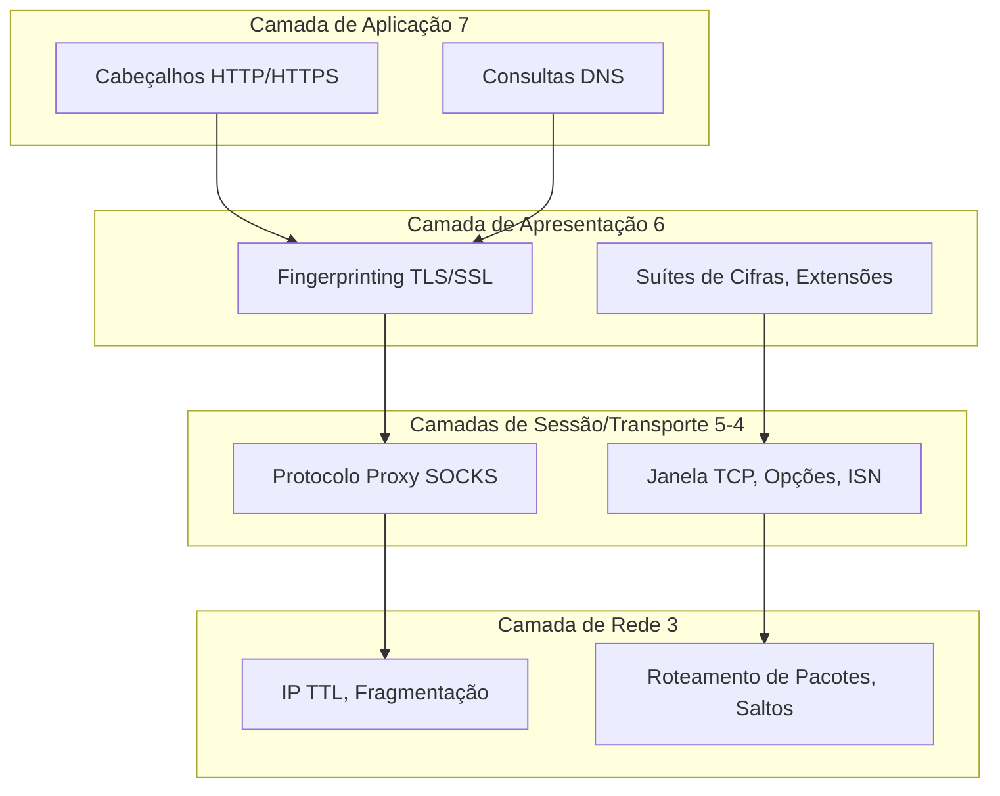

# Análise Profunda de Rede e Segurança

**Bem-vindo ao fundamento da comunicação moderna da internet, o campo de batalha do anonimato, detecção e evasão.**

Protocolos de rede são a infraestrutura invisível que alimenta cada requisição web, conexão de navegador e script de automação. Entendê-los profundamente transforma você de um **usuário de ferramenta** em um **engenheiro de protocolo** capaz de navegar pelos mais sofisticados sistemas anti-bot.

## Por que a Arquitetura de Rede Importa

Quando você executa `tab.go_to('https://example.com')`, uma complexa sinfonia de protocolos entra em ação:

1.  **Resolução DNS** traduz o domínio para um endereço IP (potencialmente vazando sua intenção)
2.  **Handshake TCP** estabelece a conexão (revelando seu SO através de características de pacote)
3.  **Negociação TLS** protege o canal (aplicando fingerprinting no seu navegador via suítes de cifras)
4.  **Requisição HTTP/2** busca a página (expondo a versão do navegador através de frames SETTINGS)
5.  **Descoberta WebRTC** pode sondar seu IP real (contornando completamente sua VPN)

**Cada passo é uma oportunidade para detecção ou evasão.**

!!! danger "A Camada de Rede Não Pode Mentir"
    Diferente das características em nível de navegador (que o JavaScript pode modificar), os fingerprints de nível de rede estão **gravados no kernel do SO e na pilha TCP/IP**. Um desencontro aqui, como um navegador Chrome enviando opções TCP de Linux enquanto alega ser Windows, é instantaneamente fatal para a automação furtiva.

## A Arquitetura da Privacidade na Internet

Este módulo explora os **fundamentos técnicos** que tornam a privacidade possível (e quebrável) na internet moderna:

### A Realidade do Modelo OSI

**Cada camada é tanto um escudo quanto uma vulnerabilidade:**

- **Camada 7 (Aplicação)**: Proxies podem ler e modificar seu tráfego HTTP
- **Camada 6 (Apresentação)**: Criptografia TLS protege o conteúdo, mas vaza metadados
- **Camada 4 (Transporte)**: Características TCP traem seu sistema operacional
- **Camada 3 (Rede)**: Endereços IP revelam sua localização física

## O que Você Vai Dominar

Este módulo está estruturado como uma **progressão técnica** de fundamentos até a exploração avançada:

### 1. Fundamentos de Rede
**[Fundamentos de Rede](./network-fundamentals.md)**

Construa a base: entenda os protocolos que movem a internet e como eles revelam, ou escondem, sua identidade.

- **Camadas do Modelo OSI** e suas implicações para fingerprinting
- **TCP vs UDP**: Por que seu proxy pode vazar tráfego UDP
- **Vazamento de IP via WebRTC**: A ameaça oculta nos navegadores modernos
- **Características da pilha de rede**: TTL, tamanho da janela, ordem das opções

**Por que começar aqui**: Sem esta base, a configuração de proxy é **"programação de culto à carga"** (cargo cult programming), copiando comandos sem entender por que funcionam (ou não).

### 2. Proxies HTTP/HTTPS
**[Proxies HTTP/HTTPS](./http-proxies.md)**

Domine o protocolo de proxy mais comum e entenda suas limitações fundamentais.

- **Operação de proxy HTTP**: Encaminhamento de requisições, cache, injeção de cabeçalho
- **Tunelamento CONNECT**: Como o HTTPS "passa por um túnel" através de proxies HTTP
- **Complexidades do HTTP/2**: Multiplexação, prioridades de stream, fingerprinting de SETTINGS
- **HTTP/3 e QUIC**: Desafios de proxying baseado em UDP
- **Esquemas de autenticação**: Basic, Digest, NTLM, tokens Bearer

**Visão crítica**: Proxies HTTP operam na Camada 7, eles podem **ler, modificar e registrar** seu tráfego não criptografado. Para privacidade verdadeira, você precisa de criptografia **antes** que o proxy veja seus dados.

### 3. Proxies SOCKS
**[Proxies SOCKS](./socks-proxies.md)**

Entenda por que o SOCKS5 é o **padrão ouro** para automação consciente da privacidade.

- **SOCKS4 vs SOCKS5**: Evolução do protocolo e capacidades
- **Handshake SOCKS5**: Análise profunda do protocolo binário com estruturas de pacotes
- **Suporte UDP**: Jogos, VoIP e WebRTC sobre SOCKS5
- **Resolução DNS**: Por que o DNS no lado do proxy previne vazamentos
- **Por que SOCKS5 > proxies HTTP**: Comparação em nível de protocolo

**Vantagem chave**: SOCKS opera na Camada 5 (Sessão), **abaixo** da camada de aplicação. Ele não pode ler seu tráfego HTTP, apenas ver IPs de destino, reduzindo vastamente a superfície de confiança.

### 4. Detecção de Proxy
**[Detecção de Proxy e Anonimato](./proxy-detection.md)**

Aprenda como sites **detectam o uso de proxy** e como evadir a detecção.

- **Níveis de anonimato**: Proxies transparentes, anônimos, elite
- **Bancos de dados de reputação de IP**: Como seu IP de datacenter te trai
- **Análise de cabeçalhos**: Cabeçalhos X-Forwarded-For, Via, Forwarded
- **Checagens de consistência**: DNS reverso, desencontros de geolocalização
- **Integração de fingerprinting de rede**: Combinando detecção de proxy com análise TCP/TLS

**Dura realidade**: A maioria dos proxies "anônimos" é trivialmente detectável. Furtividade verdadeira requer **proxies residenciais de elite** + **fingerprinting de navegador consistente** + **comportamento semelhante ao humano**.

### 5. Construindo Servidores Proxy
**[Construindo Seu Próprio Proxy](./build-proxy.md)**

Implemente proxies HTTP e SOCKS5 do zero em Python, a experiência de aprendizado definitiva.

- **Servidor proxy HTTP**: Implementação assíncrona completa com autenticação
- **Servidor proxy SOCKS5**: Manipulação de protocolo binário, tunelamento TCP
- **Encadeamento de proxy (Proxy chaining)**: Anonimato em camadas (e trocas de latência)
- **Pools de proxy rotativos**: Verificação de saúde, failover, balanceamento de carga
- **Tópicos avançados**: Proxies transparentes, interceptação SSL MITM

**Por que construir o seu**: Entender detalhes de implementação revela **vetores de ataque** e **oportunidades de otimização** invisíveis do exterior.

### 6. Considerações Legais e Éticas
**[Diretrizes Legais e Éticas](./proxy-legal.md)**

Navegue pelo campo minado legal do uso de proxy e automação web.

- **Conformidade regulatória**: GDPR, CFAA, leis internacionais
- **Termos de Serviço**: O que constitui violação
- **Diretrizes éticas**: robots.txt, limitação de taxa, transparência
- **Estudos de caso**: Precedentes legais (hiQ vs LinkedIn, QVC vs Resultly)
- **Quando evitar proxies**: Cenários de alto risco

**Aviso**: Esta é **informação educacional**, não aconselhamento jurídico. A lei varia muito por jurisdição e caso de uso. Consulte um advogado qualificado.

## O Paradoxo do Proxy

Aqui está a verdade desconfortável sobre proxies:

!!! warning "Proxies Não Te Tornam Anônimo. Eles Te Tornam **Diferente**"
    Um proxy muda seu endereço IP, mas ele também:
    
    - Adiciona **latência** (detectável via análise de tempo)
    - Reseta valores de **TTL** (revelando saltos do proxy)
    - Introduz desencontros de **fingerprint TCP** (SO do proxy ≠ seu SO)
    - Pode injetar **cabeçalhos** (X-Forwarded-For, Via)
    - Cria **inconsistências de geolocalização** (fuso horário do navegador ≠ localização do IP)
    
    Proxies são uma **ferramenta**, não uma solução. Furtividade verdadeira requer **consistência holística**.

## Pré-requisitos

Este é um **material avançado**. Você deve estar confortável com:

Conceitos básicos de redes (endereços IP, portas, protocolos)
Fundamentos de TCP/IP (three-way handshake, pacotes, roteamento)
Programação Python assíncrona (asyncio, async/await)
Básico do Pydoll (veja [Conceitos Principais](../../features/core-concepts.md))

**Se você é novo em redes**, recomendamos fortemente:

1.  Ler um guia de fundamentos de TCP/IP primeiro
2.  Experimentar com o Wireshark para visualizar o tráfego de rede
3.  Tentar os exemplos de código com capturas de pacotes rodando
4.  Construir os servidores proxy e testá-los localmente

## Integração com Outros Módulos

Arquitetura de rede não existe isoladamente. Ela se integra profundamente com:

- **[Fingerprinting](../fingerprinting/network-fingerprinting.md)**: Como características TCP/IP e TLS te identificam
- **[Configuração do Navegador](../../features/configuration/browser-preferences.md)**: Alinhando comportamento do navegador com características do proxy
- **[Camada de Conexão](../fundamentals/connection-layer.md)**: Como o Pydoll gerencia conexões WebSocket sobre proxies

## A Trilha de Aprendizagem

Recomendamos esta progressão:

**Fase 1: Fundação**

1.  Leia [Fundamentos de Rede](./network-fundamentals.md)
2.  Entenda o modelo OSI e as camadas de protocolo
3.  Aprenda sobre vazamentos WebRTC e tunelamento UDP

**Fase 2: Análise Profunda de Protocolo**

4.  Estude [Proxies HTTP/HTTPS](./http-proxies.md)
5.  Domine [Proxies SOCKS](./socks-proxies.md)
6.  Compare protocolos e entenda as trocas

**Fase 3: Pensamento Adversário**

7.  Explore [Detecção de Proxy](./proxy-detection.md)
8.  Aprenda técnicas de detecção da perspectiva do defensor
9.  Aplique estratégias de evasão

**Fase 4: Implementação Prática**

10. Construa servidores proxy de [Construindo Proxies](./build-proxy.md)
11. Capture e analise tráfego com Wireshark
12. Teste cadeias de proxy e estratégias de rotação

**Fase 5: Segurança Operacional**

13. Revise as diretrizes [Legais e Éticas](./proxy-legal.md)
14. Entenda os requisitos de conformidade
15. Desenvolva políticas de automação responsáveis

## A Filosofia

Conhecimento de rede e segurança é **poder fundamental**. Diferente de habilidades específicas de frameworks (que se tornam obsoletas), o conhecimento de protocolos é **atemporal**:

- TCP não mudou fundamentalmente desde a RFC 793 (1981)
- TLS constrói sobre conceitos do SSL (1995)
- HTTP/2 (2015) e HTTP/3 (2022) são evoluções, não revoluções

Domine esses fundamentos uma vez, e você entenderá **todo sistema baseado em rede** que encontrar pelo resto de sua carreira.

## Compromisso Ético

Antes de prosseguir, reconheça:

Eu entendo que proxies podem ser usados tanto para fins legítimos quanto maliciosos
Eu respeitarei os termos de serviço dos sites e o robots.txt
Eu implementarei limitação de taxa e rastreamento respeitoso
Eu não usarei este conhecimento para fraude, abuso ou atividades ilegais
Eu consultarei aconselhamento jurídico quando incerto sobre conformidade

**Com grandes poderes vêm grandes responsabilidades.** Use este conhecimento com sabedoria.

---

## Pronto para Começar?

Comece sua jornada com **[Fundamentos de Rede](./network-fundamentals.md)** para construir a base, então progrida através dos módulos em ordem. Cada documento constrói sobre o anterior, criando um entendimento abrangente de arquitetura de rede para automação.

**É aqui que "script kiddies" se tornam engenheiros. Vamos começar.**

---

!!! info "Status da Documentação"
    Este módulo sintetiza conhecimento de RFCs, especificações de protocolo, pesquisa em segurança e testes do mundo real. Todo exemplo de código está pronto para produção. Se encontrar imprecisões ou tiver melhorias, contribuições são bem-vindas.

## Navegação Rápida

**Protocolos Principais:**

- [Fundamentos de Rede](./network-fundamentals.md) - TCP/IP, UDP, WebRTC
- [Proxies HTTP/HTTPS](./http-proxies.md) - Proxying de camada de aplicação
- [Proxies SOCKS](./socks-proxies.md) - Proxying de camada de sessão

**Tópicos Avançados:**

- [Detecção de Proxy](./proxy-detection.md) - Anonimato e evasão
- [Construindo Proxies](./build-proxy.md) - Implementação do zero
- [Legal e Ético](./proxy-legal.md) - Conformidade e responsabilidade

**Módulos Relacionados:**

- [Fingerprinting](../fingerprinting/index.md) - Técnicas de detecção
- [Configuração do Navegador](../../features/configuration/browser-options.md) - Configuração prática