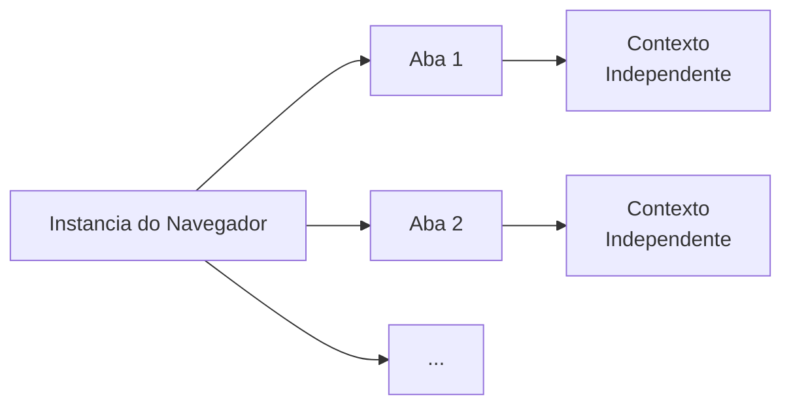

# Gerenciamento de Múltiplas Abas

O Pydoll oferece capacidades sofisticadas de múltiplas abas que permitem fluxos de trabalho de automação complexos, abrangendo várias abas do navegador simultaneamente. Entender como as abas funcionam no Pydoll é essencial para construir uma automação robusta e escalável.

## Entendendo as Abas no Pydoll

No Pydoll, uma instância de `Tab` representa uma única aba (ou janela) do navegador e fornece a interface principal para todas as operações de automação de página. Cada aba mantém seus próprios:

- **Contexto de execução independente**: JavaScript, DOM e estado da página
- **Manipuladores de eventos isolados**: Callbacks registrados em uma aba não afetam outras
- **Monitoramento de rede separado**: Cada aba pode rastrear sua própria atividade de rede
- **Conexão CDP única**: Comunicação WebSocket direta com o navegador



| Componente da Aba | Descrição | Independência |
|---|---|---|
| **Contexto de Execução** | Runtime JavaScript, DOM, estado da página | ✓ Cada aba tem o seu |
| **Manipuladores de Eventos** | Callbacks registrados para eventos CDP | ✓ Isolados por aba |
| **Monitoramento de Rede** | Requisições HTTP, respostas, tempos | ✓ Rastreia separadamente |
| **Conexão CDP** | Canal de comunicação WebSocket | ✓ Conexão direta |

### O que é uma Aba de Navegador?

Uma aba de navegador é tecnicamente um **alvo (target) CDP** - um contexto de navegação isolado com seu próprio:

- Document Object Model (DOM)
- Ambiente de execução JavaScript
- Pool de conexões de rede
- Armazenamento de cookies (compartilhado com outras abas no mesmo contexto)
- Loop de eventos e motor de renderização

Cada aba tem um `target_id` único atribuído pelo navegador, que o Pydoll usa para rotear comandos e eventos corretamente.

## Gerenciamento de Instâncias de Aba

A classe `Browser` do Pydoll mantém um registro de instâncias de `Tab` com base no `target_id` de cada aba. Isso garante que múltiplas referências à mesma aba do navegador sempre retornem o mesmo objeto Tab. O Browser armazena essas instâncias em um dicionário interno `_tabs_opened`.

| Benefício | Descrição |
|---|---|
| **Eficiência de Recursos** | Uma instância de Tab por aba do navegador, sem duplicatas |
| **Estado Consistente** | Todas as referências compartilham os mesmos manipuladores de eventos e estado |
| **Segurança de Memória** | Evita múltiplas conexões WebSocket para o mesmo alvo |
| **Comportamento Previsível** | Mudanças em uma referência afetam todas as referências |

```python
import asyncio
from pydoll.browser.chromium import Chrome

async def tab_registry_demonstration():
    async with Chrome() as browser:
        # Inicia o navegador com a aba inicial
        tab1 = await browser.start()

        # Obtém a mesma aba através de métodos diferentes
        # Nota: get_opened_tabs() retorna as abas em ordem inversa (mais nova primeiro)
        # Então a aba inicial (mais antiga) está no final
        opened_tabs = await browser.get_opened_tabs()
        tab2 = opened_tabs[-1]  # A aba inicial é a mais antiga, então é a última

        # Ambas as referências apontam para o mesmo objeto
        # porque o Browser retorna a mesma instância de seu registro
        print(f"Mesma instância? {tab1 is tab2}")  # True
        print(f"Mesmo target ID? {tab1._target_id == tab2._target_id}")  # True

        # Registrar evento em uma referência afeta a outra
        await tab1.enable_network_events()
        print(f"Eventos de rede na aba 2? {tab2.network_events_enabled}")  # True

        # O Browser mantém o registro internamente
        print(f"Aba registrada no navegador? {tab1._target_id in browser._tabs_opened}")  # True

asyncio.run(tab_registry_demonstration())
```

!!! info "Registro controlado pelo Browser"
    A classe Browser gerencia um dicionário `_tabs_opened` indexado por `target_id`. Quando você solicita uma aba (via `new_tab()` ou `get_opened_tabs()`), o Browser verifica este registro primeiro. Se uma instância de Tab já existe para aquele `target_id`, ele retorna a instância existente; caso contrário, cria uma nova e a armazena no registro. (Iframes não geram mais abas separadas — interaja com eles como elementos normais.)

## Criando e Gerenciando Abas

### Iniciando o Navegador

Quando você inicia o navegador, o Pydoll automaticamente cria e retorna uma instância de Tab para a aba inicial do navegador:

```python
import asyncio
from pydoll.browser.chromium import Chrome

async def start_browser():
    async with Chrome() as browser:
        # Aba inicial é criada automaticamente
        tab = await browser.start()
        
        print(f"Aba criada com target ID: {tab._target_id}")
        await tab.go_to('https://example.com')
        
        title = await tab.execute_script('return document.title')
        print(f"Título da página: {title}")

asyncio.run(start_browser())
```

### Criando Abas Adicionais Programaticamente

Use `browser.new_tab()` para criar abas adicionais com controle total:

```python
import asyncio
from pydoll.browser.chromium import Chrome

async def create_multiple_tabs():
    async with Chrome() as browser:
        # Começar com a aba inicial
        main_tab = await browser.start()
        
        # Criar abas adicionais com URLs específicas
        search_tab = await browser.new_tab('https://google.com')
        docs_tab = await browser.new_tab('https://docs.python.org')
        news_tab = await browser.new_tab('https://news.ycombinator.com')
        
        # Cada aba pode ser controlada independentemente
        await search_tab.find(name='q')  # Caixa de busca do Google
        await docs_tab.find(id='search-field')  # Busca da doc do Python
        await news_tab.find(class_name='storylink', find_all=True)  # Matérias do HN
        
        # Obter todas as abas abertas
        all_tabs = await browser.get_opened_tabs()
        print(f"Total de abas: {len(all_tabs)}")  # 4 (inicial + 3 novas)
        
        # Fechar abas específicas quando terminar
        await search_tab.close()
        await docs_tab.close()
        await news_tab.close()

asyncio.run(create_multiple_tabs())
```

!!! tip "Parâmetro de URL Opcional"
    Você pode criar abas sem especificar uma URL: `await browser.new_tab()`. A aba abrirá com uma página em branco (`about:blank`), pronta para navegação.

### Lidando com Abas Abertas pelo Usuário

Quando usuários clicam em links com `target="_blank"` ou usam "Abrir em nova aba", o Pydoll pode detectar e gerenciar essas abas:

```python
import asyncio
from pydoll.browser.chromium import Chrome

async def handle_user_tabs():
    async with Chrome() as browser:
        main_tab = await browser.start()
        await main_tab.go_to('https://example.com')
        
        # Registrar contagem inicial de abas
        initial_tabs = await browser.get_opened_tabs()
        print(f"Abas iniciais: {len(initial_tabs)}")
        
        # Clicar em um link que abre uma nova aba (target="_blank")
        external_link = await main_tab.find(text='Open in New Tab')
        await external_link.click()
        
        # Esperar a nova aba abrir
        await asyncio.sleep(2)
        
        # Detectar novas abas
        current_tabs = await browser.get_opened_tabs()
        print(f"Abas atuais: {len(current_tabs)}")
        
        # Encontrar a aba recém-aberta (última da lista)
        if len(current_tabs) > len(initial_tabs):
            new_tab = current_tabs[-1]
            
            # Trabalhar com a nova aba
            url = await new_tab.current_url
            print(f"URL da nova aba: {url}")
            
            await new_tab.go_to('https://different-site.com')
            title = await new_tab.execute_script('return document.title')
            print(f"Título da nova aba: {title}")
            
            # Fechá-la quando terminar
            await new_tab.close()

asyncio.run(handle_user_tabs())
```

### Listando Todas as Abas Abertas

Use `browser.get_opened_tabs()` para recuperar todas as abas atualmente abertas:

```python
import asyncio
from pydoll.browser.chromium import Chrome

async def list_tabs():
    async with Chrome() as browser:
        # Usar a aba inicial retornada pelo start()
        initial_tab = await browser.start()
        await initial_tab.go_to('https://example.com')
        
        # Abrir várias outras abas
        await browser.new_tab('https://github.com')
        await browser.new_tab('https://stackoverflow.com')
        await browser.new_tab('https://reddit.com')
        
        # Obter todas as abas
        all_tabs = await browser.get_opened_tabs()
        
        # Inspecionar cada aba
        for i, tab in enumerate(all_tabs, 1):
            url = await tab.current_url
            title = await tab.execute_script('return document.title')
            print(f"Aba {i}: {title} - {url}")

asyncio.run(list_tabs())
```

## Operações Concorrentes de Abas

A arquitetura assíncrona do Pydoll permite fluxos de trabalho concorrentes poderosos em múltiplas abas:

### Coleta de Dados Paralela

Processe múltiplas páginas simultaneamente para máxima eficiência:

```python
import asyncio
from pydoll.browser.chromium import Chrome

async def scrape_page(tab, url):
    """Raspar uma única página dentro de uma aba específica."""
    await tab.go_to(url)
    title = await tab.execute_script('return document.title')
    articles = await tab.find(class_name='article', find_all=True)
    content = [await article.text for article in articles[:5]]

    return {
        'url': url,
        'title': title,
        'articles_count': len(articles),
        'sample_content': content
    }

async def concurrent_scraping():
    urls = [
        'https://example.com/page1',
        'https://example.com/page2',
        'https://example.com/page3',
        'https://example.com/page4',
    ]

    async with Chrome() as browser:
        # Iniciar o navegador e abrir a primeira aba
        initial_tab = await browser.start()
        # Criar uma aba por URL
        tabs = [initial_tab] + [await browser.new_tab() for _ in urls[1:]]

        # Executar todos os scrapers concorrentemente
        results = await asyncio.gather(*[
            scrape_page(tab, url) for tab, url in zip(tabs, urls)
        ])

        # Exibir resultados
        for result in results:
            print(f"\n{result['title']}")
            print(f"  URL: {result['url']}")
            print(f"  Artigos: {result['articles_count']}")
            if result['sample_content']:
                print(f"  Amostra: {result['sample_content'][0][:100]}...")

asyncio.run(concurrent_scraping())
```

!!! tip "Ganho de Desempenho"
    A raspagem concorrente pode reduzir o tempo total de execução em 5 a 10 vezes em comparação com o processamento sequencial, especialmente para tarefas limitadas por I/O (entrada/saída) como carregamento de página.

### Fluxos de Trabalho Coordenados de Múltiplas Abas

Orquestre fluxos de trabalho complexos que exigem a interação de múltiplas abas:

```python
import asyncio
from pydoll.browser.chromium import Chrome
from pydoll.protocol.network.events import NetworkEvent, RequestWillBeSentEvent

async def multi_tab_workflow():
    async with Chrome() as browser:
        # Usar a aba inicial para login
        login_tab = await browser.start()
        await login_tab.go_to('https://app.example.com/login')
        await asyncio.sleep(2)
        
        username = await login_tab.find(id='username')
        password = await login_tab.find(id='password')
        
        await username.type_text('admin@example.com')
        await password.type_text('secure_password')
        
        login_btn = await login_tab.find(id='login')
        await login_btn.click()
        await asyncio.sleep(3)
        
        # Aba 2: Navegar para a página de exportação de dados
        export_tab = await browser.new_tab('https://app.example.com/export')
        await asyncio.sleep(2)
        
        export_btn = await export_tab.find(text='Export Data')
        await export_btn.click()
        
        # Aba 3: Monitorar chamadas de API em um dashboard
        monitor_tab = await browser.new_tab('https://app.example.com/dashboard')
        await monitor_tab.enable_network_events()
        
        # Rastrear chamadas de API
        api_calls = []
        async def track_api(event: RequestWillBeSentEvent):
            url = event['params']['request']['url']
            if '/api/' in url:
                api_calls.append(url)
        
        await monitor_tab.on(NetworkEvent.REQUEST_WILL_BE_SENT, track_api)
        await asyncio.sleep(5)
        
        print(f"Rastreadas {len(api_calls)} chamadas de API:")
        for call in api_calls[:10]:
            print(f"  - {call}")
        
        # Limpeza
        await login_tab.close()
        await export_tab.close()
        await monitor_tab.close()

asyncio.run(multi_tab_workflow())
```

## Ciclo de Vida e Limpeza da Aba

### Fechamento Explícito de Aba

Sempre feche as abas quando terminar de usá-las para liberar recursos do navegador:

```python
import asyncio
from pydoll.browser.chromium import Chrome

async def explicit_cleanup():
    async with Chrome() as browser:
        initial_tab = await browser.start()
        
        # Criar abas para diferentes tarefas
        tab1 = await browser.new_tab('https://example.com')
        tab2 = await browser.new_tab('https://example.org')
        
        # Trabalhar com as abas
        await tab1.go_to('https://different-site.com')
        await tab2.take_screenshot('/tmp/screenshot.png')
        
        # Fechar abas explicitamente
        await tab1.close()
        await tab2.close()
        
        # Verificar se as abas estão fechadas
        remaining = await browser.get_opened_tabs()
        print(f"Abas restantes: {len(remaining)}")  # Deve ser 1 (inicial)

asyncio.run(explicit_cleanup())
```

!!! warning "Vazamentos de Memória"
    Deixar de fechar abas em automações de longa duração pode levar ao esgotamento da memória. Cada aba consome recursos do navegador (memória, handles de arquivo, conexões de rede).

### Usando Gerenciadores de Contexto para Limpeza Automática

Embora o Pydoll não forneça um gerenciador de contexto de aba nativo, você pode criar o seu:

```python
import asyncio
from contextlib import asynccontextmanager
from pydoll.browser.chromium import Chrome

@asynccontextmanager
async def managed_tab(browser, url=None):
    """Gerenciador de contexto para limpeza automática de abas."""
    tab = await browser.new_tab(url)
    try:
        yield tab
    finally:
        await tab.close()

async def auto_cleanup_example():
    async with Chrome() as browser:
        initial_tab = await browser.start()
        
        # Aba fecha automaticamente ao sair do contexto
        async with managed_tab(browser, 'https://example.com') as tab:
            title = await tab.execute_script('return document.title')
            print(f"Título: {title}")
            
            await tab.take_screenshot('/tmp/page.png')
        # Aba é fechada automaticamente aqui
        
        tabs = await browser.get_opened_tabs()
        print(f"Abas após sair do contexto: {len(tabs)}")  # 1 (apenas initial_tab)

asyncio.run(auto_cleanup_example())
```

### Limpeza do Navegador

Quando o navegador fecha, todas as abas são fechadas automaticamente:

```python
import asyncio
from pydoll.browser.chromium import Chrome

async def browser_cleanup():
    # Usando gerenciador de contexto - limpeza automática
    async with Chrome() as browser:
        initial_tab = await browser.start()
        
        # Criar múltiplas abas
        await browser.new_tab('https://example.com')
        await browser.new_tab('https://github.com')
        await browser.new_tab('https://stackoverflow.com')
        
        tabs = await browser.get_opened_tabs()
        print(f"Abas abertas: {len(tabs)}")  # 4 (inicial + 3 novas)
    
    # Todas as abas são fechadas automaticamente quando o navegador sai
    print("Navegador fechado, todas as abas limpas")

asyncio.run(browser_cleanup())
```

## Gerenciamento de Estado da Aba

### Verificando o Estado da Aba

Consulte vários aspectos do estado atual de uma aba:

```python
import asyncio
from pydoll.browser.chromium import Chrome

async def check_tab_state():
    async with Chrome() as browser:
        tab = await browser.start()
        await tab.go_to('https://example.com')
        
        # Verificar URL atual
        url = await tab.current_url
        print(f"URL Atual: {url}")
        
        # Verificar código-fonte da página
        source = await tab.page_source
        print(f"Tamanho do código-fonte: {len(source)} caracteres")
        
        # Verificar domínios de eventos habilitados
        print(f"Eventos de página habilitados: {tab.page_events_enabled}")
        print(f"Eventos de rede habilitados: {tab.network_events_enabled}")
        print(f"Eventos DOM habilitados: {tab.dom_events_enabled}")
        
        # Habilitar eventos e verificar novamente
        await tab.enable_network_events()
        print(f"Eventos de rede habilitados: {tab.network_events_enabled}")  # True

asyncio.run(check_tab_state())
```

### Identificação da Aba

Cada aba possui identificadores únicos:

```python
import asyncio
from pydoll.browser.chromium import Chrome

async def tab_identification():
    async with Chrome() as browser:
        tab1 = await browser.start()
        tab2 = await browser.new_tab()
        
        # Target ID - identificador único atribuído pelo navegador
        print(f"Target ID da Aba 1: {tab1._target_id}")
        print(f"Target ID da Aba 2: {tab2._target_id}")
        
        # Detalhes da conexão
        print(f"Porta de conexão da Aba 1: {tab1._connection_port}")
        print(f"Porta de conexão da Aba 2: {tab2._connection_port}")
        
        # ID do contexto do navegador (geralmente None para o contexto padrão)
        print(f"ID do contexto da Aba 1: {tab1._browser_context_id}")
        print(f"ID do contexto da Aba 2: {tab2._browser_context_id}")

asyncio.run(tab_identification())
```

## Funcionalidades Avançadas de Aba

### Trazendo Abas para a Frente

Torne uma aba específica visível (trazer para o primeiro plano):

```python
import asyncio
from pydoll.browser.chromium import Chrome

async def bring_to_front():
    async with Chrome() as browser:
        tab1 = await browser.start()
        tab2 = await browser.new_tab('https://github.com')
        tab3 = await browser.new_tab('https://stackoverflow.com')
        
        # tab3 está atualmente na frente (última criada)
        await asyncio.sleep(2)
        
        # Trazer tab1 para a frente
        await tab1.bring_to_front()
        print("Aba 1 trazida para a frente")
        
        await asyncio.sleep(2)
        
        # Trazer tab2 para a frente
        await tab2.bring_to_front()
        print("Aba 2 trazida para a frente")

asyncio.run(bring_to_front())
```

### Monitoramento de Rede Específico da Aba

Cada aba pode monitorar independentemente sua própria atividade de rede:

```python
import asyncio
from pydoll.browser.chromium import Chrome

async def tab_network_monitoring():
    async with Chrome() as browser:
        # Usar aba inicial para navegação monitorada
        tab1 = await browser.start()
        await tab1.go_to('https://example.com')
        
        # Criar segunda aba sem monitoramento
        tab2 = await browser.new_tab('https://github.com')
        
        # Habilitar monitoramento de rede apenas na aba 1
        await tab1.enable_network_events()
        
        # Navegar em ambas as abas
        await tab1.go_to('https://example.com/page1')
        await tab2.go_to('https://github.com/explore')
        
        await asyncio.sleep(3)
        
        # Obter logs de rede apenas da aba 1
        tab1_logs = await tab1.get_network_logs()
        print(f"Requisições de rede da Aba 1: {len(tab1_logs)}")
        
        # tab2 não tem monitoramento de rede
        print(f"Eventos de rede da Aba 2 habilitados: {tab2.network_events_enabled}")  # False

asyncio.run(tab_network_monitoring())
```

### Manipuladores de Eventos Específicos da Aba

Registre diferentes manipuladores de eventos em diferentes abas:

```python
import asyncio
from pydoll.browser.chromium import Chrome
from pydoll.protocol.page.events import PageEvent

async def tab_specific_events():
    async with Chrome() as browser:
        # Usar aba inicial como primeira aba
        tab1 = await browser.start()
        tab2 = await browser.new_tab()
        
        # Habilitar eventos de página em ambas
        await tab1.enable_page_events()
        await tab2.enable_page_events()
        
        # Manipuladores diferentes para cada aba
        async def tab1_handler(event):
            print("Aba 1 carregada!")
        
        async def tab2_handler(event):
            print("Aba 2 carregada!")
        
        await tab1.on(PageEvent.LOAD_EVENT_FIRED, tab1_handler)
        await tab2.on(PageEvent.LOAD_EVENT_FIRED, tab2_handler)
        
        # Navegar em ambas as abas
        await tab1.go_to('https://example.com')
        await tab2.go_to('https://github.com')
        
        await asyncio.sleep(2)

asyncio.run(tab_specific_events())
```

## Considerações de Desempenho

| Cenário | Impacto nos Recursos | Recomendação |
|---|---|---|
| **1-5 abas** | Baixo | Gerenciamento direto, sem tratamento especial |
| **5-20 abas** | Moderado | Usar semáforos para limitar concorrência |
| **20-50 abas** | Alto | Processamento em lote, fechar abas agressivamente |
| **50+ abas** | Muito Alto | Considerar processamento sequencial ou múltiplos navegadores |

### Uso de Memória

Cada aba consome aproximadamente:

- **Memória base**: 50-100 MB
- **Com eventos de rede**: +10-20 MB
- **Com eventos DOM**: +20-50 MB
- **Página complexa (SPA)**: +100-300 MB

Para 20 abas com monitoramento de rede: ~1.5-3 GB de memória.

## Padrões Comuns

### Processamento Sequencial com Aba Única

```python
async def sequential_pattern():
    async with Chrome() as browser:
        tab = await browser.start()
        
        for url in urls:
            await tab.go_to(url)
            # Extrair dados
            await tab.clear_callbacks()  # Limpar eventos

asyncio.run(sequential_pattern())
```

### Processamento Paralelo com Múltiplas Abas

```python
import asyncio
from pydoll.browser.chromium import Chrome

async def parallel_pattern():
    urls = [
        'https://example.com/page1',
        'https://example.com/page2',
        'https://example.com/page3',
        'https://example.com/page4',
    ]

    async with Chrome() as browser:
        # Iniciar navegador e obter aba inicial
        initial_tab = await browser.start()
        # Criar uma aba por URL (reutilizando a inicial para a primeira)
        tabs = [initial_tab] + [await browser.new_tab() for _ in urls[1:]]

        async def process_page(tab, url):
            """Processar uma única página dentro da aba fornecida."""
            try:
                await tab.go_to(url)
                await asyncio.sleep(2)
                title = await tab.evaluate('document.title')
                print(f"[{url}] {title}")
            finally:
                if tab is not initial_tab:
                    await tab.close()

        # Executar todas as abas concorrentemente
        await asyncio.gather(*[
            process_page(tab, url) for tab, url in zip(tabs, urls)
        ])

asyncio.run(parallel_pattern())
```

### Padrão de Pool de Workers

```python
async def worker_pool_pattern():
    async with Chrome() as browser:
        # Usar aba inicial como primeiro worker
        initial_tab = await browser.start()
        
        # Criar abas worker adicionais (5 workers no total: 1 inicial + 4 novas)
        workers = [initial_tab] + [await browser.new_tab() for _ in range(4)]
        
        # Distribuir trabalho entre todos os workers
        for url in urls:
            worker = workers[urls.index(url) % len(workers)]
            await worker.go_to(url)
            # Processar...
        
        # Limpar todos os workers (incluindo aba inicial)
        for worker in workers:
            await worker.close()

asyncio.run(worker_pool_pattern())
```

!!! tip "Reutilizando a Aba Inicial"
    Sempre use a aba retornada por `browser.start()` em vez de deixá-la ociosa. Isso economiza recursos do navegador e melhora o desempenho. Nos exemplos acima, a aba inicial é reutilizada como o primeiro worker ou para a primeira URL do lote.

## Veja Também

- **[Contextos de Navegador](contexts.md)** - Sessões de navegador isoladas
- **[Cookies e Sessões](cookies-sessions.md)** - Gerenciando cookies entre abas
- **[Sistema de Eventos](../advanced/event-system.md)** - Manipulação de eventos específica da aba
- **[Raspagem Concorrente](../../features.md#concurrent-scraping)** - Exemplos do mundo real

O gerenciamento de múltiplas abas no Pydoll fornece a base para construir automação de navegador escalável e eficiente. Ao entender o ciclo de vida da aba, o padrão singleton e as melhores práticas, você pode criar fluxos de trabalho de automação robustos que lidam com cenários complexos de múltiplas páginas com facilidade.