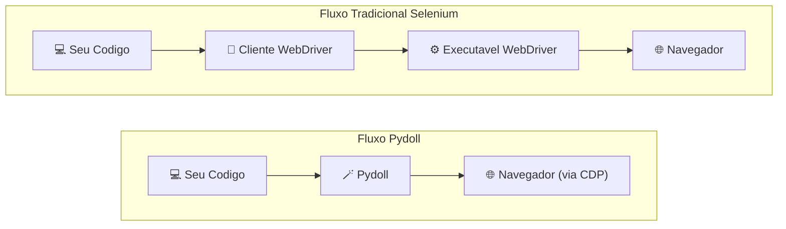
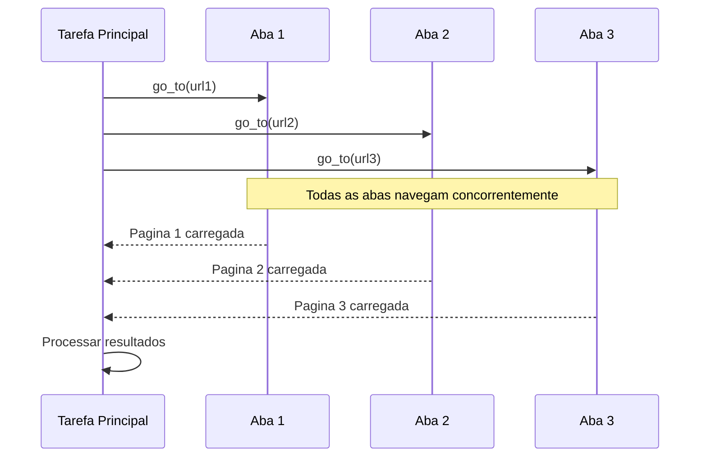

# Conceitos Principais

Entender o que torna o Pydoll diferente começa com suas decisões fundamentais de design. Estas não são apenas escolhas técnicas; elas impactam diretamente como você escreve scripts de automação, quais problemas você pode resolver e quão confiáveis serão suas soluções.

## Zero WebDrivers

Uma das vantagens mais significativas do Pydoll é a eliminação completa das dependências do WebDriver. Se você já lutou com erros do tipo "a versão do chromedriver não corresponde à versão do Chrome" ou lidou com falhas misteriosas do driver, você apreciará esta abordagem.

### Como Funciona

Ferramentas tradicionais de automação de navegador, como o Selenium, dependem de executáveis WebDriver que atuam como intermediários entre seu código e o navegador. O Pydoll segue um caminho diferente, conectando-se diretamente aos navegadores através do Chrome DevTools Protocol (CDP).



Quando você inicia um navegador com o Pydoll, é isto que acontece nos bastidores:

```python
import asyncio
from pydoll.browser.chromium import Chrome

async def main():
    # Isso cria uma instância do Navegador
    browser = Chrome()
    
    # start() inicia o Chrome com --remote-debugging-port
    # e estabelece uma conexão WebSocket com o endpoint CDP
    tab = await browser.start()
    
    # Agora você pode controlar o navegador através de comandos CDP
    await tab.go_to('https://example.com')
    
    await browser.stop()

asyncio.run(main())
```

Nos bastidores, `browser.start()` faz o seguinte:

1.  **Inicia o processo do navegador** com a flag `--remote-debugging-port=<porta>`
2.  **Aguarda o servidor CDP** ficar disponível nessa porta
3.  **Estabelece uma conexão WebSocket** com `ws://localhost:<porta>/devtools/...`
4.  **Retorna uma instância de Tab** pronta para automação

!!! info "Quer Saber Mais?"
    Para detalhes técnicos sobre como o processo do navegador é gerenciado internamente, veja a [Análise Profunda do Domínio do Navegador](../../deep-dive/browser-domain.md#browser-process-manager).

### Benefícios que Você Notará

**Sem Dores de Cabeça com Gerenciamento de Versão**
```python
# Com Selenium, você pode ver:
# SessionNotCreatedException: Esta versão do ChromeDriver suporta apenas a versão 120 do Chrome

# Com Pydoll, você só precisa ter o Chrome instalado:
async with Chrome() as browser:
    tab = await browser.start()  # Funciona com qualquer versão do Chrome
```

**Configuração Mais Simples**
```bash
# Configuração Selenium:
$ pip install selenium
$ brew install chromedriver  # ou baixe, chmod +x, adicione ao PATH...
$ chromedriver --version     # corresponde ao seu Chrome?

# Configuração Pydoll:
$ pip install pydoll-python  # É isso!
```

**Mais Confiável**

Sem o WebDriver como camada intermediária, há menos pontos de falha. Seu código se comunica diretamente com o navegador através de um protocolo bem definido que os próprios desenvolvedores do Chromium usam e mantêm.

### CDP: O Protocolo Por Trás da Mágica

O Chrome DevTools Protocol não é apenas para o Pydoll; é o mesmo protocolo que alimenta o Chrome DevTools quando você abre o inspetor. Isso significa:

- **Confiabilidade testada em batalha**: Usado por milhões de desenvolvedores diariamente
- **Capacidades ricas**: Tudo o que o DevTools pode fazer, o Pydoll pode fazer
- **Desenvolvimento ativo**: O Google mantém e evolui o CDP continuamente

!!! tip "Análise Profunda: Entendendo o CDP"
    Para uma compreensão abrangente de como o CDP funciona e por que ele é superior ao WebDriver, veja nossa [Análise Profunda do Chrome DevTools Protocol](../../deep-dive/cdp.md).

## Arquitetura Async-First (Prioritariamente Assíncrona)

O Pydoll não é apenas compatível com async; ele foi projetado desde o início para alavancar o framework `asyncio` do Python. Isso não é uma funcionalidade superficial; é fundamental para como o Pydoll alcança alto desempenho.

!!! info "Novo na Programação Assíncrona?"
    Se você não está familiarizado com a sintaxe `async`/`await` do Python ou conceitos do asyncio, recomendamos fortemente ler nosso guia [Entendendo Async/Await](../../deep-dive/connection-layer.md#understanding-asyncawait) primeiro. Ele explica os fundamentos com exemplos práticos que o ajudarão a entender como a arquitetura assíncrona do Pydoll funciona e por que ela é tão poderosa para automação de navegador.

### Por que Async é Importante para Automação de Navegador

A automação de navegador envolve muita espera: páginas carregando, elementos aparecendo, requisições de rede completando. Ferramentas síncronas tradicionais desperdiçam tempo de CPU durante essas esperas. A arquitetura assíncrona permite que você faça trabalho útil enquanto espera.

```python
import asyncio
from pydoll.browser.chromium import Chrome

async def scrape_page(browser, url):
    """Raspar uma única página."""
    tab = await browser.new_tab()
    await tab.go_to(url)
    title = await tab.execute_script('return document.title')
    await tab.close()
    return title

async def main():
    urls = [
        'https://example.com/page1',
        'https://example.com/page2',
        'https://example.com/page3',
    ]
    
    async with Chrome() as browser:
        await browser.start()
        
        # Processar todas as URLs concorrentemente!
        titles = await asyncio.gather(
            *(scrape_page(browser, url) for url in urls)
        )
        
        print(titles)

asyncio.run(main())
```

Neste exemplo, em vez de raspar as páginas uma após a outra (o que poderia levar 3 × 2 segundos = 6 segundos), todas as três páginas são raspadas concorrentemente, levando aproximadamente 2 segundos no total.

### Concorrência Verdadeira vs Threading

Diferente de abordagens baseadas em threading, a arquitetura assíncrona do Pydoll fornece execução concorrente verdadeira sem a complexidade do gerenciamento de threads:



### Padrões Modernos do Python

O Pydoll abraça idiomas modernos do Python em toda a sua estrutura:

**Gerenciadores de Contexto**
```python
# Limpeza automática de recursos
async with Chrome() as browser:
    tab = await browser.start()
    # ... fazer trabalho ...
# O navegador é automaticamente parado ao sair do contexto
```

**Iteradores Assíncronos**
```python
# Receber eventos de rede à medida que ocorrem
await tab.enable_network_events()

async for event in tab.network_event_stream():
    if 'api' in event['params']['request']['url']:
        print(f"Chamada de API detectada: {event['params']['request']['url']}")
```

**Gerenciadores de Contexto Assíncronos para Operações**
```python
# Esperar e lidar com downloads
async with tab.expect_download(keep_file_at='/downloads') as dl:
    await (await tab.find(text='Download PDF')).click()
    pdf_data = await dl.read_bytes()
```

!!! tip "Análise Profunda"
    Quer entender como as operações assíncronas funcionam internamente? Confira a [Análise Profunda da Camada de Conexão](../../deep-dive/connection-layer.md) para detalhes de implementação.

### Implicações de Desempenho

O design "async-first" oferece melhorias mensuráveis de desempenho:

```python
import asyncio
import time
from pydoll.browser.chromium import Chrome

async def benchmark_concurrent():
    """Raspar 10 páginas concorrentemente."""
    async with Chrome() as browser:
        await browser.start()
        
        start = time.time()
        tasks = [
            browser.new_tab(f'https://example.com/page{i}')
            for i in range(10)
        ]
        await asyncio.gather(*tasks)
        elapsed = time.time() - start
        
        print(f"10 páginas carregadas em {elapsed:.2f}s")
        # Resultado típico: ~2-3 segundos vs 20+ segundos sequencialmente

asyncio.run(benchmark_concurrent())
```

## Suporte a Múltiplos Navegadores

O Pydoll fornece uma API unificada em todos os navegadores baseados em Chromium. Escreva sua automação uma vez, execute-a em qualquer lugar.

### Navegadores Suportados

**Google Chrome**: Alvo principal com suporte completo a funcionalidades.
```python
from pydoll.browser.chromium import Chrome

async with Chrome() as browser:
    tab = await browser.start()
```

**Microsoft Edge**: Suporte completo, incluindo funcionalidades específicas do Edge.
```python
from pydoll.browser.chromium import Edge

async with Edge() as browser:
    tab = await browser.start()
```

**Outros Navegadores Chromium**: Brave, Vivaldi, Opera, etc.
```python
from pydoll.browser.chromium import Chrome
from pydoll.browser.options import ChromiumOptions

options = ChromiumOptions()
options.binary_location = '/path/to/brave-browser'  # ou qualquer navegador Chromium

async with Chrome(options=options) as browser:
    tab = await browser.start()
```

O principal benefício: todos os navegadores baseados em Chromium compartilham a mesma API. Escreva sua automação uma vez, e ela funciona no Chrome, Edge, Brave ou qualquer outro navegador Chromium sem alterações de código.

### Testes Cross-Browser

Teste sua automação em múltiplos navegadores sem alterar o código:

```python
import asyncio
from pydoll.browser.chromium import Chrome, Edge

async def test_login(browser_class, browser_name):
    """Testar fluxo de login em um navegador específico."""
    async with browser_class() as browser:
        tab = await browser.start()
        await tab.go_to('https://app.example.com/login')
        
        await (await tab.find(id='username')).type_text('user@example.com')
        await (await tab.find(id='password')).type_text('password123')
        await (await tab.find(id='login-btn')).click()
        
        # Verificar sucesso do login
        success = await tab.find(id='dashboard', raise_exc=False)
        print(f"{browser_name} login: {'✓' if success else '✗'}")

async def main():
    # Testar tanto no Chrome quanto no Edge
    await test_login(Chrome, "Chrome")
    await test_login(Edge, "Edge")

asyncio.run(main())
```

## Comportamento Semelhante ao Humano

Navegadores automatizados são frequentemente detectáveis porque se comportam de forma robótica. O Pydoll inclui funcionalidades nativas para fazer as interações parecerem mais humanas.

### Digitação Natural

Usuários reais não digitam em velocidades perfeitamente consistentes. O método `type_text()` do Pydoll inclui atrasos aleatórios entre as teclas:

```python
# Digitar com tempo semelhante ao humano
username_field = await tab.find(id='username')
await username_field.type_text(
    'user@example.com',
    interval=0.1  # Média de 100ms entre teclas, com aleatoriedade
)

# Digitação mais rápida (ainda semelhante à humana)
await username_field.type_text(
    'user@example.com',
    interval=0.05  # Mais rápido, mas ainda varia
)

# Instantâneo (robótico; use apenas quando a velocidade importa mais que a furtividade)
await username_field.type_text(
    'user@example.com',
    interval=0
)
```

O parâmetro `interval` define o atraso médio, mas o Pydoll adiciona variação aleatória para tornar o tempo mais natural.

### Cliques Realistas

Cliques não são apenas "disparar e esquecer". O Pydoll automaticamente dispara todos os eventos de mouse que um usuário real dispararia:

```python
button = await tab.find(id='submit-button')

# Comportamento padrão: clica no centro do elemento
# Dispara automaticamente: mouseover, mouseenter, mousemove, mousedown, mouseup, click
await button.click()

# Clique com deslocamento (útil para evitar detecção em elementos maiores)
await button.click(offset_x=10, offset_y=5)
```

!!! info "Eventos do Mouse"
    O Pydoll dispara a sequência completa de eventos do mouse na ordem correta, simulando como navegadores reais lidam com cliques de usuários. Isso torna os cliques mais realistas em comparação com simples chamadas JavaScript `.click()`.

!!! warning "Considerações sobre Detecção"
    Embora o comportamento semelhante ao humano ajude a evitar a detecção básica de bots, sistemas anti-automação sofisticados usam muitos sinais. Combine essas funcionalidades com:
    
    - Fingerprints de navegador realistas (via preferências do navegador)
    - Configuração adequada de proxy
    - Atrasos razoáveis entre ações
    - Padrões de navegação variados

## Design Orientado a Eventos

Diferente da automação tradicional baseada em polling (verificação periódica), o Pydoll permite que você reaja a eventos do navegador assim que eles acontecem. Isso é mais eficiente e possibilita padrões de interação sofisticados.

### Monitoramento de Eventos em Tempo Real

Inscreva-se em eventos do navegador e execute callbacks quando eles dispararem:

```python
import asyncio
from functools import partial
from pydoll.browser.chromium import Chrome
from pydoll.protocol.page.events import PageEvent
from pydoll.protocol.network.events import NetworkEvent

async def main():
    async with Chrome() as browser:
        tab = await browser.start()
        
        # Reagir a eventos de carregamento de página
        async def on_page_load(event):
            print(f"Página carregada: {await tab.current_url}")
        
        await tab.enable_page_events()
        await tab.on(PageEvent.LOAD_EVENT_FIRED, on_page_load)
        
        # Monitorar requisições de rede
        async def on_request(tab, event):
            url = event['params']['request']['url']
            if '/api/' in url:
                print(f"Chamada de API: {url}")
        
        await tab.enable_network_events()
        await tab.on(NetworkEvent.REQUEST_WILL_BE_SENT, partial(on_request, tab))
        
        # Navegar e observar os eventos dispararem
        await tab.go_to('https://example.com')
        await asyncio.sleep(3)  # Deixar os eventos processarem

asyncio.run(main())
```

### Categorias de Eventos

O Pydoll expõe vários domínios de eventos CDP nos quais você pode se inscrever:

| Domínio | Eventos de Exemplo |
|---|---|
| **Eventos de Página** | Carregamento concluído, navegação, diálogos JavaScript |
| **Eventos de Rede** | Requisição enviada, resposta recebida, atividade WebSocket |
| **Eventos DOM** | Mudanças no DOM, modificações de atributos |
| **Eventos Fetch** | Requisição pausada, autenticação necessária |
| **Eventos de Runtime** | Mensagens do console, exceções |

### Padrões Práticos Orientados a Eventos

**Capturar Respostas de API**
```python
import json
from functools import partial
from pydoll.protocol.network.events import NetworkEvent

api_data = []

async def capture_api(tab, event):
    url = event['params']['response']['url']
    if '/api/data' in url:
        request_id = event['params']['requestId']
        body = await tab.get_network_response_body(request_id)
        api_data.append(json.loads(body))

await tab.enable_network_events()
await tab.on(NetworkEvent.RESPONSE_RECEIVED, partial(capture_api, tab))

# Navegar e capturar automaticamente as respostas da API
await tab.go_to('https://app.example.com')
await asyncio.sleep(2)

print(f"Capturadas {len(api_data)} respostas de API")
```

**Esperar por Condições Específicas**
```python
import asyncio
from functools import partial
from pydoll.protocol.network.events import NetworkEvent

async def wait_for_api_call(tab, endpoint):
    """Esperar por uma chamada de endpoint de API específica."""
    event_occurred = asyncio.Event()
    
    async def check_endpoint(tab, event):
        url = event['params']['request']['url']
        if endpoint in url:
            event_occurred.set()
    
    await tab.enable_network_events()
    callback_id = await tab.on(
        NetworkEvent.REQUEST_WILL_BE_SENT,
        partial(check_endpoint, tab),
        temporary=True  # Remover automaticamente após o primeiro disparo
    )

    await event_occurred.wait()
    print(f"Endpoint de API {endpoint} foi chamado!")

# Uso
await wait_for_api_call(tab, '/api/users')
```

!!! info "Análise Profunda: Detalhes do Sistema de Eventos"
    Para um guia completo sobre manejo de eventos, padrões de callback e considerações de desempenho, veja a [Análise Profunda do Sistema de Eventos](../../deep-dive/event-system.md).

### Desempenho de Eventos

Eventos são poderosos, mas vêm com uma sobrecarga. Melhores práticas:

```python
# ✓ Bom: Habilitar apenas o que você precisa
await tab.enable_network_events()

# ✗ Evite: Habilitar todos os eventos desnecessariamente
await tab.enable_page_events()
await tab.enable_network_events()
await tab.enable_dom_events()
await tab.enable_fetch_events()
await tab.enable_runtime_events()

# ✓ Bom: Filtrar cedo nos callbacks
async def handle_request(event):
    url = event['params']['request']['url']
    if '/api/' not in url:
        return  # Pular requisições não-API cedo
    # Processar requisição de API...

# ✓ Bom: Desabilitar quando terminar
await tab.disable_network_events()
```

## Juntando Tudo

Esses conceitos principais trabalham juntos para criar um framework de automação poderoso:

```python
import asyncio
import json
from functools import partial
from pydoll.browser.chromium import Chrome
from pydoll.protocol.network.events import NetworkEvent
from pydoll.constants import Keys

async def advanced_scraping():
    """Demonstra múltiplos conceitos principais trabalhando juntos."""
    async with Chrome() as browser:  # Gerenciador de contexto assíncrono
        tab = await browser.start()
        
        # Orientado a eventos: Capturar dados de API
        api_responses = []
        
        async def capture_data(tab, event):
            url = event['params']['response']['url']
            if '/api/products' in url:
                request_id = event['params']['requestId']
                body = await tab.get_network_response_body(request_id)
                api_responses.append(json.loads(body))
        
        await tab.enable_network_events()
        await tab.on(NetworkEvent.RESPONSE_RECEIVED, partial(capture_data, tab))
        
        # Navegar com simplicidade zero-webdriver
        await tab.go_to('https://example.com/products')
        
        # Interação semelhante à humana
        search = await tab.find(id='search')
        await search.type_text('laptop', interval=0.1)  # Digitação natural
        await search.press_keyboard_key(Keys.ENTER)
        
        # Esperar por respostas da API (eficiência assíncrona)
        await asyncio.sleep(2)
        
        print(f"Capturados {len(api_responses)} produtos da API")
        return api_responses

# Suporte a múltiplos navegadores: funciona com Chrome, Edge, etc.
asyncio.run(advanced_scraping())
```

Esses conceitos fundamentais informam todo o resto no Pydoll. À medida que você explora funcionalidades específicas, verá esses princípios em ação, trabalhando juntos para criar automação de navegador confiável, eficiente e sustentável.

---

## O Que Vem a Seguir?

Agora que você entende o design principal do Pydoll, está pronto para explorar funcionalidades específicas:

- **[Localização de Elementos](element-finding.md)** - Aprenda as APIs intuitivas de localização de elementos do Pydoll
- **[Funcionalidades de Rede](../network/monitoring.md)** - Aproveite o sistema de eventos para análise de rede
- **[Gerenciamento do Navegador](../browser-management/tabs.md)** - Use padrões assíncronos para operações concorrentes

Para um entendimento técnico mais profundo, explore a seção [Análise Profunda](../../deep-dive/index.md).