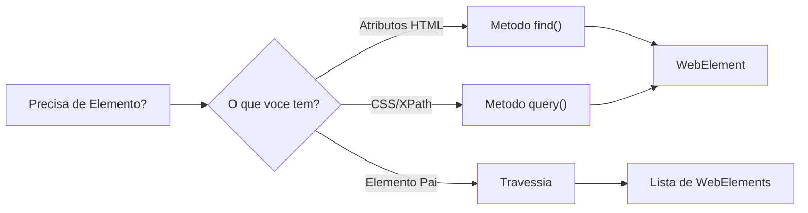
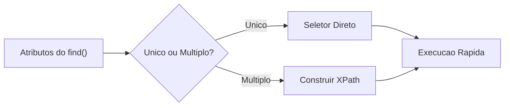
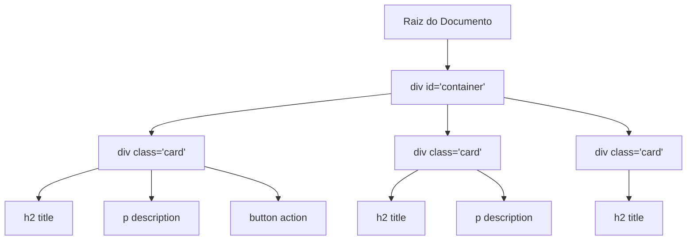
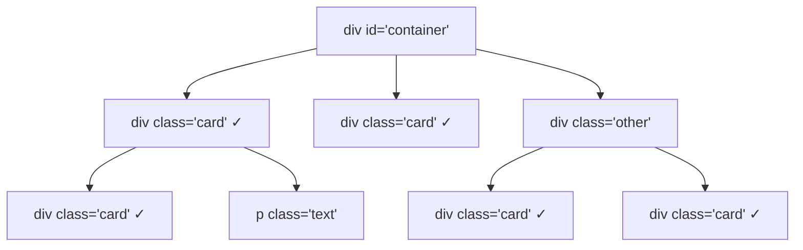
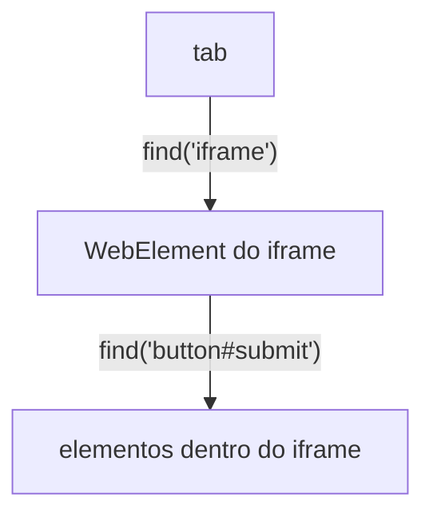
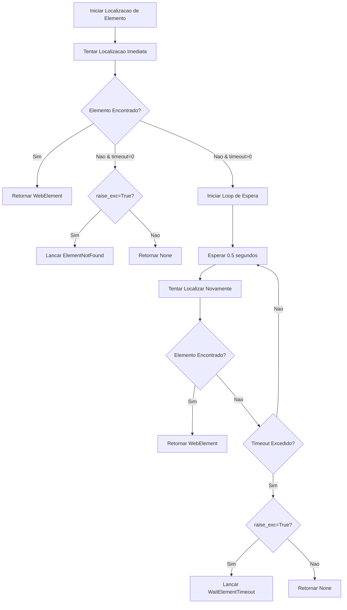

# Localização de Elementos

Encontrar elementos em uma página web é a base da automação de navegadores. O Pydoll introduz uma abordagem revolucionária e intuitiva que torna a localização de elementos mais poderosa e fácil de usar do que os métodos tradicionais baseados em seletores.

## Por que a Abordagem do Pydoll é Diferente

Ferramentas tradicionais de automação de navegador forçam você a pensar em termos de seletores CSS e expressões XPath desde o início. O Pydoll inverte isso: você descreve o que está procurando usando atributos HTML naturais, e o Pydoll descobre a estratégia de seletor ideal.

```python
# Abordagem tradicional (outras ferramentas)
element = driver.find_element(By.XPATH, "//input[@type='email' and @name='username']")

# Abordagem do Pydoll
element = await tab.find(tag_name="input", type="email", name="username")
```

Ambos encontram o mesmo elemento, mas a sintaxe do Pydoll é mais clara, mais fácil de manter e menos propensa a erros.

### Visão Geral dos Métodos de Localização de Elementos

O Pydoll oferece três abordagens principais para encontrar elementos:

| Método | Usar Quando | Exemplo |
|---|---|---|
| **`find()`** | Você sabe os atributos HTML | `await tab.find(id="username")` |
| **`query()`** | Você tem um seletor CSS/XPath | `await tab.query("div.content")` |
| **Travessia** | Você quer explorar a partir de um elemento conhecido | `await element.get_children_elements()` |



!!! info "Análise profunda: Como Funciona"
    Curioso sobre como o Pydoll implementa a localização de elementos internamente? Confira a documentação [FindElements Mixin](../deep-dive/find-elements-mixin.md) para aprender sobre a arquitetura, otimizações de desempenho e estratégias internas de seletores.

## O Método find(): Seleção Natural de Elementos

O método `find()` é sua principal ferramenta para localizar elementos. Ele aceita atributos HTML comuns como parâmetros e constrói automaticamente o seletor mais eficiente.

### Uso Básico

```python
import asyncio
from pydoll.browser.chromium import Chrome

async def basic_finding():
    async with Chrome() as browser:
        tab = await browser.start()
        await tab.go_to('https://example.com')
        
        # Encontrar por ID (mais comum e mais rápido)
        username = await tab.find(id="username")
        
        # Encontrar por nome de classe
        submit_button = await tab.find(class_name="btn-primary")
        
        # Encontrar por nome de tag
        first_paragraph = await tab.find(tag_name="p")
        
        # Encontrar por atributo name
        email_field = await tab.find(name="email")
        
        # Encontrar por conteúdo de texto
        login_link = await tab.find(text="Login")

asyncio.run(basic_finding())
```

### Combinando Atributos para Precisão

O verdadeiro poder do `find()` vem da combinação de múltiplos atributos para criar seletores precisos:

```python
import asyncio
from pydoll.browser.chromium import Chrome

async def precise_finding():
    async with Chrome() as browser:
        tab = await browser.start()
        await tab.go_to('https://example.com/form')
        
        # Combinar nome de tag com tipo
        password_input = await tab.find(tag_name="input", type="password")
        
        # Combinar tag, classe e atributos personalizados
        submit_button = await tab.find(
            tag_name="button",
            class_name="btn",
            type="submit"
        )
        
        # Usar atributos data
        product_card = await tab.find(
            tag_name="div",
            data_testid="product-card",
            data_category="electronics"
        )
        
        # Combinar múltiplas condições
        specific_link = await tab.find(
            tag_name="a",
            class_name="nav-link",
            href="/dashboard"
        )

asyncio.run(precise_finding())
```

!!! info "Lógica de Combinação: E (AND)"
    Combinar atributos no `find()` funciona como uma operação E (AND). O elemento deve corresponder a **todos** os atributos fornecidos.
    
    Para cenários mais complexos que exigem lógica OU (OR) — como encontrar um elemento que pode ter um `id` ou um `name` diferente — a abordagem correta é encadear múltiplas chamadas `find()`, como demonstrado na seção "Exemplo Completo".

!!! tip "Convenção de Nomenclatura de Atributos"
    Use underscores para nomes de atributos com hífens. Por exemplo, `data-testid` se torna `data_testid`, e `aria-label` se torna `aria_label`. O Pydoll os converte automaticamente para o formato correto.

### Como o find() Seleciona a Estratégia Ideal

O Pydoll escolhe automaticamente o seletor mais eficiente com base nos atributos que você fornece:

| Atributos Fornecidos | Estratégia Usada | Desempenho |
|---|---|---|
| Único: `id` | `By.ID` | ⚡ Mais Rápido |
| Único: `class_name` | `By.CLASS_NAME` | ⚡ Rápido |
| Único: `name` | `By.NAME` | ⚡ Rápido |
| Único: `tag_name` | `By.TAG_NAME` | ⚡ Rápido |
| Único: `text` | `By.XPATH` | ⚡ Rápido |
| Múltiplos atributos | Expressão XPath | ✓ Eficiente |



### Encontrando Múltiplos Elementos

Use `find_all=True` para obter uma lista de todos os elementos correspondentes:

```python
import asyncio
from pydoll.browser.chromium import Chrome

async def find_multiple():
    async with Chrome() as browser:
        tab = await browser.start()
        await tab.go_to('https://example.com/products')
        
        # Encontrar todos os cards de produto
        products = await tab.find(class_name="product-card", find_all=True)
        print(f"Encontrados {len(products)} produtos")
        
        # Encontrar todos os links na navegação
        nav_links = await tab.find(
            tag_name="a",
            class_name="nav-link",
            find_all=True
        )
        
        # Processar cada elemento
        for link in nav_links:
            text = await link.text
            href = await link.get_attribute("href")
            print(f"Link: {text} → {href}")

asyncio.run(find_multiple())
```

### Esperando por Elementos Dinâmicos

Aplicações web modernas carregam conteúdo dinamicamente. Use `timeout` para esperar que os elementos apareçam:

```python
import asyncio
from pydoll.browser.chromium import Chrome

async def wait_for_elements():
    async with Chrome() as browser:
        tab = await browser.start()
        await tab.go_to('https://example.com/dashboard')
        
        # Esperar até 10 segundos pelo elemento aparecer
        dynamic_content = await tab.find(
            class_name="dynamic-content",
            timeout=10
        )
        
        # Esperar por dados carregados via AJAX
        user_profile = await tab.find(
            id="user-profile",
            timeout=15
        )
        
        # Lidar com elementos que podem não aparecer
        optional_banner = await tab.find(
            class_name="promo-banner",
            timeout=3,
            raise_exc=False  # Retorna None se não encontrado
        )
        
        if optional_banner:
            await optional_banner.click()
        else:
            print("Nenhum banner promocional presente")

asyncio.run(wait_for_elements())
```

!!! warning "Melhores Práticas de Timeout"
    Use valores de timeout razoáveis. Muito curtos e você perderá elementos de carregamento lento; muito longos e você desperdiçará tempo esperando por elementos que não existem. Comece com 5-10 segundos para a maioria dos conteúdos dinâmicos.

## O Método query(): Acesso Direto a Seletores

Para desenvolvedores que preferem seletores tradicionais ou precisam de lógicas de seleção mais complexas, o método `query()` fornece acesso direto a seletores CSS e expressões XPath.

### Seletores CSS

Seletores CSS são rápidos, amplamente compreendidos e perfeitos para a maioria dos casos de uso:

```python
import asyncio
from pydoll.browser.chromium import Chrome

async def css_selector_examples():
    async with Chrome() as browser:
        tab = await browser.start()
        await tab.go_to('https://example.com')
        
        # Seletores simples
        main_nav = await tab.query("nav.main-menu")
        first_article = await tab.query("article:first-child")
        
        # Seletores de atributo
        submit_button = await tab.query("button[type='submit']")
        required_inputs = await tab.query("input[required]", find_all=True)
        
        # Seletores complexos
        nested = await tab.query("div.container > .content .item:nth-child(2)")
        
        # Pseudo-classes
        first_enabled_button = await tab.query("button:not([disabled])")

asyncio.run(css_selector_examples())
```

### Expressões XPath

XPath se destaca em relações complexas e correspondência de texto:

```python
import asyncio
from pydoll.browser.chromium import Chrome

async def xpath_examples():
    async with Chrome() as browser:
        tab = await browser.start()
        await tab.go_to('https://example.com/table')
        
        # Correspondência de texto
        button = await tab.query("//button[contains(text(), 'Submit')]")
        
        # Navegar para o pai
        input_parent = await tab.query("//input[@name='email']/parent::div")
        
        # Encontrar elementos irmãos
        label_input = await tab.query(
            "//label[text()='Email:']/following-sibling::input"
        )
        
        # Consultas complexas de tabela
        edit_button = await tab.query(
            "//tr[td[text()='John Doe']]//button[@class='btn-edit']"
        )

asyncio.run(xpath_examples())
```

!!! info "CSS vs XPath: Qual Usar?"
    Para um guia completo sobre como escolher entre seletores CSS e XPath, incluindo referências de sintaxe e exemplos do mundo real, veja o [Guia de Seletores](../deep-dive/selectors-guide.md).

## Travessia do DOM: Filhos e Irmãos

Às vezes, você precisa explorar a árvore DOM a partir de um ponto de partida conhecido. O Pydoll fornece métodos dedicados para atravessar relações entre elementos.

### Estrutura da Árvore DOM

Entender a estrutura da árvore DOM ajuda a escolher o método de travessia correto:



### Obtendo Elementos Filhos

O método `get_children_elements()` recupera descendentes de um elemento:

```python
import asyncio
from pydoll.browser.chromium import Chrome

async def traverse_children():
    async with Chrome() as browser:
        tab = await browser.start()
        await tab.go_to('https://example.com/cards')
        
        # Obter contêiner
        container = await tab.find(id="cards-container")
        
        # Obter apenas filhos diretos (max_depth=1)
        direct_children = await container.get_children_elements(max_depth=1)
        print(f"Contêiner tem {len(direct_children)} filhos diretos")
        
        # Incluir netos (max_depth=2)
        descendants = await container.get_children_elements(max_depth=2)
        print(f"Encontrados {len(descendants)} elementos até 2 níveis de profundidade")
        
        # Filtrar por nome de tag
        links = await container.get_children_elements(
            max_depth=3,
            tag_filter=["a"]
        )
        print(f"Encontrados {len(links)} links no contêiner")
        
        # Combinar filtros para elementos específicos
        nav_links = await container.get_children_elements(
            max_depth=2,
            tag_filter=["a", "button"]
        )

asyncio.run(traverse_children())
```

### Obtendo Elementos Irmãos

O método `get_siblings_elements()` encontra elementos no mesmo nível:

```python
import asyncio
from pydoll.browser.chromium import Chrome

async def traverse_siblings():
    async with Chrome() as browser:
        tab = await browser.start()
        await tab.go_to('https://example.com/list')
        
        # Encontrar item ativo
        active_item = await tab.find(class_name="item-active")
        
        # Obter todos os irmãos (excluindo o próprio active_item)
        all_siblings = await active_item.get_siblings_elements()
        print(f"Item ativo tem {len(all_siblings)} irmãos")
        
        # Filtrar irmãos por tag
        link_siblings = await active_item.get_siblings_elements(
            tag_filter=["a"]
        )
        
        # Processar elementos irmãos
        for sibling in all_siblings:
            text = await sibling.text
            print(f"Irmão: {text}")

asyncio.run(traverse_siblings())
```

!!! tip "Considerações de Desempenho"
    A travessia do DOM pode ser cara para árvores grandes. Prefira valores `max_depth` rasos e parâmetros `tag_filter` específicos para minimizar o número de nós processados. Para estruturas profundamente aninhadas, considere múltiplas chamadas `find()` direcionadas em vez de uma única travessia profunda.

## Encontrando Elementos Dentro de Elementos

Uma vez que você tem um elemento, pode pesquisar dentro de seu escopo usando os mesmos métodos `find()` e `query()`.

!!! warning "Importante: Comportamento de Profundidade de Busca"
    Quando você chama `element.find()` ou `element.query()`, o Pydoll busca em **TODOS os descendentes** (filhos, netos, bisnetos, etc.), não apenas nos filhos diretos. Este é o comportamento padrão do `querySelector()` e corresponde ao que a maioria dos desenvolvedores espera.

### Entendendo o Escopo de Busca



```python
# Isso encontra TODOS os 5 elementos com class='card' na árvore
# (2 filhos diretos + 3 descendentes aninhados)
cards = await container.find(class_name="card", find_all=True)
print(len(cards))  # Saída: 5
```

### Busca Básica com Escopo

```python
import asyncio
from pydoll.browser.chromium import Chrome

async def scoped_search():
    async with Chrome() as browser:
        tab = await browser.start()
        await tab.go_to('https://example.com/products')
        
        # Encontrar um contêiner de produto
        product_card = await tab.find(class_name="product-card")
        
        # Pesquisar dentro do card de produto (busca em TODOS os descendentes, retorna apenas a primeira correspondência)
        product_title = await product_card.find(class_name="title")
        product_price = await product_card.find(class_name="price")
        add_button = await product_card.find(tag_name="button", text="Add to Cart")
        
        # Fazer query dentro do escopo
        product_image = await product_card.query("img.product-image")
        
        # Encontrar todos os itens dentro de um contêiner (TODOS os descendentes)
        nav_menu = await tab.find(class_name="nav-menu")
        menu_items = await nav_menu.find(tag_name="li", find_all=True)
        
        print(f"Menu tem {len(menu_items)} itens")

asyncio.run(scoped_search())
```

### Encontrando Apenas Filhos Diretos

Se você precisa encontrar **apenas filhos diretos** (profundidade 1), use o combinador filho `>` do CSS ou XPath:

```python
import asyncio
from pydoll.browser.chromium import Chrome

async def direct_children_only():
    async with Chrome() as browser:
        tab = await browser.start()
        await tab.go_to('https://example.com/cards')
        
        container = await tab.find(id="cards-container")
        
        # Método 1: Combinador filho CSS (>)
        # Encontra APENAS filhos diretos com class='card'
        direct_cards = await container.query("> .card", find_all=True)
        print(f"Filhos diretos: {len(direct_cards)}")
        
        # Método 2: XPath filho direto
        direct_divs = await container.query("./div[@class='card']", find_all=True)
        
        # Método 3: Usar get_children_elements() com max_depth=1
        # (mas isso filtra apenas por tag, não por outros atributos)
        direct_children = await container.get_children_elements(
            max_depth=1,
            tag_filter=["div"]
        )
        
        # Então filtre manualmente por classe
        cards_only = [
            child for child in direct_children
            if 'card' in (await child.get_attribute('class') or '')
        ]

asyncio.run(direct_children_only())
```

### Comparação: find() vs get_children_elements()

| Funcionalidade | `find()` / `query()` | `get_children_elements()` |
|---|---|---|
| **Profundidade de Busca** | TODOS os descendentes | Configurável com `max_depth` |
| **Filtrar Por** | Qualquer atributo HTML | Apenas nome da tag |
| **Caso de Uso** | Encontrar elementos específicos em qualquer lugar na subárvore | Explorar estrutura DOM, obter filhos diretos |
| **Desempenho** | Otimizado para atributo único | Bom para exploração ampla |
| **Parâmetro** | `tag_name="a"` (string) | `tag_filter=["a"]` (lista) |

```python
import asyncio
from pydoll.browser.chromium import Chrome

async def comparison_example():
    async with Chrome() as browser:
        tab = await browser.start()
        await tab.go_to('https://example.com')
        
        container = await tab.find(id="container")
        
        # Cenário 1: Eu quero TODOS os links em qualquer lugar no contêiner
        # Use find() - busca em todos os descendentes
        all_links = await container.find(tag_name="a", find_all=True)
        
        # Cenário 2: Eu quero APENAS links filhos diretos
        # Use combinador filho CSS
        direct_links = await container.query("> a", find_all=True)
        
        # Cenário 3: Eu quero filhos diretos com classe específica
        # Use combinador filho CSS
        direct_cards = await container.query("> .card", find_all=True)
        
        # Cenário 4: Eu quero explorar a estrutura DOM
        # Use get_children_elements()
        direct_children = await container.get_children_elements(max_depth=1)
        
        # Cenário 5: Eu quero todos os descendentes até a profundidade 2, filtrados por tag
        # Use get_children_elements()
        shallow_links = await container.get_children_elements(
            max_depth=2,
            tag_filter=["a"]
        )

asyncio.run(comparison_example())
```

!!! tip "Quando Usar Cada Método"
    - **Use `find()`**: Quando você sabe os atributos (classe, id, etc.) e quer pesquisar toda a subárvore
    - **Use `query("> .class")`**: Quando você precisa apenas de filhos diretos com atributos específicos
    - **Use `get_children_elements()`**: Ao explorar a estrutura DOM ou filtrar apenas por tag

### Casos de Uso Comuns

Essa busca com escopo é incrivelmente útil para trabalhar com padrões repetitivos como:

- Cards de produtos em sites de e-commerce
- Linhas de tabela com múltiplas células
- Seções de formulário com múltiplos campos
- Menus de navegação com itens aninhados

```python
import asyncio
from pydoll.browser.chromium import Chrome

async def practical_example():
    async with Chrome() as browser:
        tab = await browser.start()
        await tab.go_to('https://example.com/products')
        
        # Encontrar todos os cards de produto na página
        product_cards = await tab.find(class_name="product-card", find_all=True)
        
        for card in product_cards:
            # Dentro de cada card, encontrar TODOS os descendentes com essas classes
            title = await card.find(class_name="product-title")
            price = await card.find(class_name="product-price")
            
            # Obter o botão que está em qualquer lugar dentro deste card
            buy_button = await card.find(tag_name="button", text="Buy Now")
            
            title_text = await title.text
            price_text = await price.text
            
            print(f"Produto: {title_text}, Preço: {price_text}")
            
            # Clicar no botão de compra
            await buy_button.click()

asyncio.run(practical_example())
```


## Trabalhando com iFrames

!!! info "Guia Completo de IFrame Disponível"
    Esta seção cobre a interação básica com iframe para localização de elementos. Para um guia completo incluindo iframes aninhados, manejo de CAPTCHA, análise técnica profunda e solução de problemas, veja **[Trabalhando com IFrames](automation/iframes.md)**.

iFrames apresentam um desafio especial na automação de navegador porque eles têm contextos DOM separados. O Pydoll torna a interação com iframe transparente:


```python
import asyncio
from pydoll.browser.chromium import Chrome

async def iframe_interacao():
    async with Chrome() as browser:
        tab = await browser.start()
        await tab.go_to('https://example.com/pagina-com-iframe')

        iframe = await tab.query("iframe.conteudo", timeout=10)

        # Os utilitários de WebElement já executam dentro do iframe
        iframe_button = await iframe.find(tag_name="button", class_name="submit")
        await iframe_button.click()

        iframe_input = await iframe.find(id="captcha-input")
        await iframe_input.type_text("codigo-de-verificacao")

        # Iframe aninhado? Continue encadeando
        inner_iframe = await iframe.find(tag_name="iframe")
        download_link = await inner_iframe.find(text="Baixar PDF")
        await download_link.click()

asyncio.run(iframe_interacao())
```
!!! note "Screenshots em iframes"
    `tab.take_screenshot()` funciona apenas no alvo principal. Para capturar o conteúdo de um iframe, selecione um elemento dentro dele e chame `element.take_screenshot()`.

## Estratégias de Tratamento de Erros

Automação robusta requer o tratamento de casos onde elementos não existem ou demoram mais para aparecer do que o esperado.

### Fluxo de Localização de Elemento com Tratamento de Erros



### Usando o Parâmetro raise_exc

Controle se uma exceção deve ser lançada quando elementos não são encontrados:

```python
import asyncio
from pydoll.browser.chromium import Chrome
from pydoll.exceptions import ElementNotFound

async def error_handling():
    async with Chrome() as browser:
        tab = await browser.start()
        await tab.go_to('https://example.com')
        
        # Lançar exceção se não encontrado (comportamento padrão)
        try:
            critical_element = await tab.find(id="must-exist")
        except ElementNotFound:
            print("Elemento crítico ausente! Não é possível continuar.")
            return
        
        # Retornar None se não encontrado (elementos opcionais)
        optional_banner = await tab.find(
            class_name="promo-banner",
            raise_exc=False
        )
        
        if optional_banner:
            print("Banner encontrado, fechando-o")
            close_button = await optional_banner.find(class_name="close-btn")
            await close_button.click()
        else:
            print("Nenhum banner presente, continuando")

asyncio.run(error_handling())
```

## Melhores Práticas

### 1. Prefira Seletores Estáveis

Use atributos que têm baixa probabilidade de mudar:

```python
# Bom: Atributos semânticos
await tab.find(id="user-profile")  # IDs geralmente são estáveis
await tab.find(data_testid="submit-button")  # IDs de teste são feitos para automação
await tab.find(name="username")  # Nomes de formulário são estáveis

# Evite: Dependências estruturais
await tab.query("div > div > div:nth-child(3) > input")  # Frágil, quebra facilmente
await tab.query("body > div:nth-child(2) > form > div:first-child")
```

### 2. Use o Seletor Mais Simples que Funciona

Comece simples e adicione complexidade apenas quando necessário:

```python
# Bom: Simples e claro
await tab.find(id="login-form")

# Desnecessário: Complicado demais
await tab.query("//div[@id='content']/descendant::form[@id='login-form']")
```

### 3. Escolha o Método Certo

- Use `find()` para buscas simples baseadas em atributos
- Use `query()` para padrões CSS ou XPath complexos
- Use métodos de travessia para explorar a partir de âncoras conhecidas

```python
# Use find() para casos diretos
username = await tab.find(id="username")

# Use query() para padrões complexos
active_nav_link = await tab.query("nav.menu a.active")

# Use travessia para buscas baseadas em relacionamento
container = await tab.find(id="cards")
child_links = await container.get_children_elements(tag_filter=["a"])
```

### 4. Adicione Timeouts Significativos

Não use timeouts zero para conteúdo dinâmico, e não espere para sempre por elementos opcionais:

```python
# Bom: Timeouts razoáveis
critical_data = await tab.find(id="data", timeout=10)
optional_popup = await tab.find(class_name="popup", timeout=2, raise_exc=False)

# Ruim: Sem timeout para conteúdo dinâmico
dynamic_element = await tab.find(class_name="ajax-loaded")  # Falhará imediatamente

# Ruim: Timeout muito longo para elemento opcional
banner = await tab.find(class_name="ad-banner", timeout=60)  # Desperdício de tempo
```

### 5. Trate Erros Graciosamente

Planeje para elementos que podem não existir:

```python
# Elementos críticos: deixe as exceções subirem
submit_button = await tab.find(id="submit-btn")

# Elementos opcionais: trate explicitamente
cookie_notice = await tab.find(class_name="cookie-notice", raise_exc=False)
if cookie_notice:
    accept_button = await cookie_notice.find(text="Accept")
    await accept_button.click()
```

## Exemplo Completo: Automação de Formulário

Aqui está um exemplo completo combinando múltiplas técnicas de localização de elementos:

```python
import asyncio
from pydoll.browser.chromium import Chrome
from pydoll.exceptions import ElementNotFound

async def automate_registration_form():
    async with Chrome() as browser:
        tab = await browser.start()
        
        try:
            # Navegar para a página de registro
            await tab.go_to('https://example.com/register', timeout=10)
            
            # Lidar com banner de cookie opcional
            cookie_banner = await tab.find(
                class_name="cookie-banner",
                timeout=2,
                raise_exc=False
            )
            if cookie_banner:
                accept = await cookie_banner.find(text="Accept")
                await accept.click()
                await asyncio.sleep(1)
            
            # Preencher o formulário de registro
            # Encontrar campos do formulário
            username_field = await tab.find(name="username", timeout=5)
            email_field = await tab.find(name="email")
            password_field = await tab.find(type="password", name="password")
            confirm_password = await tab.find(type="password", name="confirm_password")
            
            # Inserir informações
            await username_field.type_text("john_doe_2024", interval=0.1)
            await email_field.type_text("john@example.com", interval=0.1)
            await password_field.type_text("SecurePass123!", interval=0.1)
            await confirm_password.type_text("SecurePass123!", interval=0.1)
            
            # Encontrar e marcar checkbox de termos
            # Tentar múltiplas estratégias
            terms_checkbox = await tab.find(id="terms", raise_exc=False)
            if not terms_checkbox:
                terms_checkbox = await tab.find(name="accept_terms", raise_exc=False)
            if not terms_checkbox:
                terms_checkbox = await tab.query("input[type='checkbox']")
            
            await terms_checkbox.click()
            
            # Encontrar e clicar no botão de envio
            submit_button = await tab.find(
                tag_name="button",
                type="submit",
                timeout=2
            )
            await submit_button.click()
            
            # Esperar por mensagem de sucesso com timeout maior (processamento do formulário)
            success_message = await tab.find(
                class_name="success-message",
                timeout=15
            )
            
            message_text = await success_message.text
            print(f"Registro bem-sucedido: {message_text}")
            
            # Verificar redirecionamento para o dashboard
            await asyncio.sleep(2)
            current_url = await tab.current_url
            
            if "dashboard" in current_url:
                print("Redirecionado com sucesso para o dashboard")
                
                # Encontrar mensagem de boas-vindas
                welcome = await tab.find(class_name="welcome-message", timeout=5)
                welcome_text = await welcome.text
                print(f"Mensagem de boas-vindas: {welcome_text}")
            else:
                print(f"URL inesperada após registro: {current_url}")
                
        except ElementNotFound as e:
            print(f"Elemento não encontrado: {e}")
            # Tirar screenshot para depuração
            await tab.take_screenshot("error_screenshot.png")
        except Exception as e:
            print(f"Erro inesperado: {e}")
            await tab.take_screenshot("unexpected_error.png")

asyncio.run(automate_registration_form())
```

## Aprenda Mais

Quer mergulhar mais fundo na localização de elementos?

- **[Análise aprofundada em FindElements Mixin](../deep-dive/find-elements-mixin.md)**: Aprenda sobre a arquitetura, estratégias internas de seletores e otimizações de desempenho
- **[Guia de Seletores](../deep-dive/selectors-guide.md)**: Guia completo de seletores CSS e XPath com referências de sintaxe e exemplos do mundo real
- **[Domínio WebElement](../deep-dive/webelement-domain.md)**: Entenda o que você pode fazer com os elementos depois de encontrá-los

A localização de elementos é a base para uma automação de navegador bem-sucedida. Domine essas técnicas, e você será capaz de localizar confiavelmente qualquer elemento em qualquer página web, não importa quão complexa seja a estrutura.