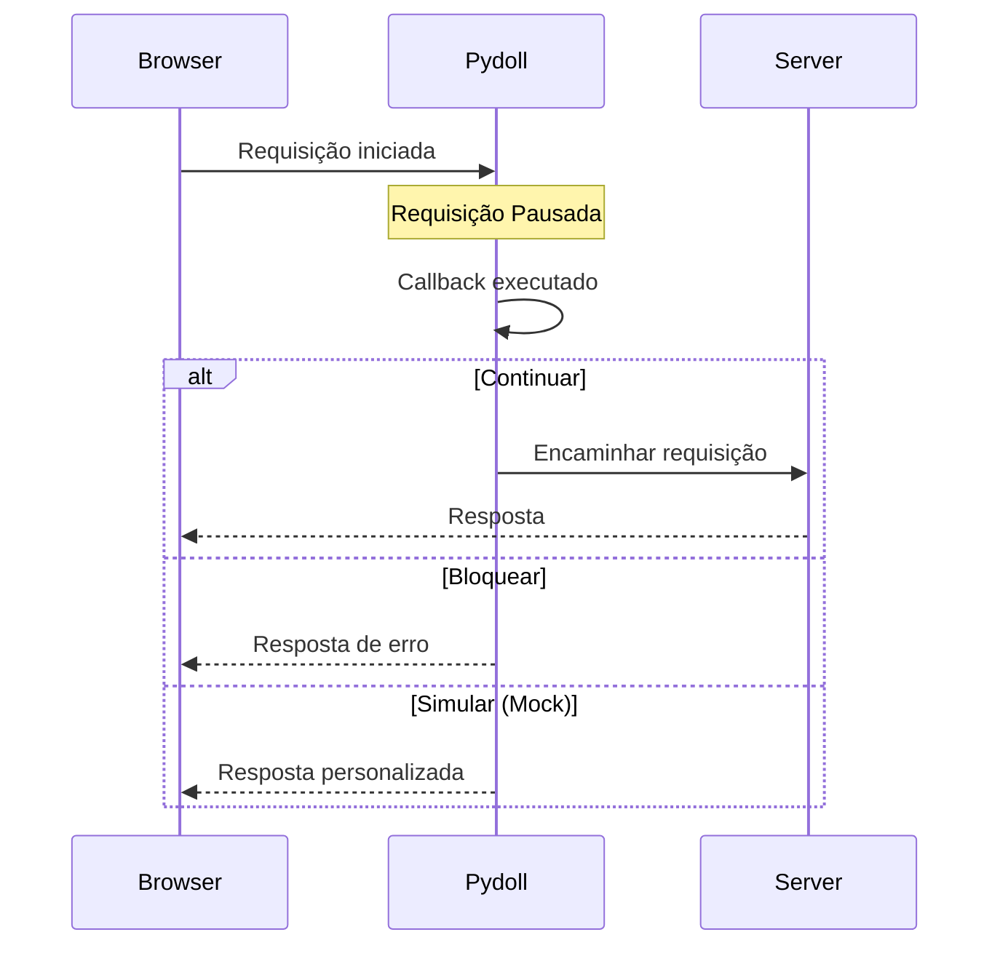

# Interceptação de Requisições

A interceptação de requisições permite que você intercepte, modifique, bloqueie ou simule (mock) requisições e respostas HTTP em tempo real. Isso é essencial para testes, otimização de desempenho, filtragem de conteúdo e simulação de várias condições de rede.

!!! info "Domínio Network vs Fetch"
    O **domínio Network** é para monitoramento passivo (observar o tráfego). O **domínio Fetch** é para interceptação ativa (modificar/bloquear requisições). Este guia foca na interceptação. Para monitoramento passivo, veja [Monitoramento de Rede](monitoring.md).

## Entendendo a Interceptação de Requisições

Quando você habilita a interceptação de requisições, o Pydoll pausa as requisições correspondentes antes que elas sejam enviadas ao servidor (ou após receber a resposta). Você então tem três opções:

1.  **Continuar**: Deixar a requisição prosseguir (opcionalmente com modificações)
2.  **Bloquear**: Falhar a requisição com um erro
3.  **Simular (Mock)**: Atender à requisição com uma resposta personalizada



!!! warning "Impacto no Desempenho"
    A interceptação de requisições adiciona latência a cada requisição correspondente. Intercepte apenas o que você precisa e desabilite quando terminar para evitar lentidão no carregamento das páginas.

## Habilitando a Interceptação de Requisições

Antes de interceptar requisições, você deve habilitar o domínio Fetch:

```python
import asyncio
from pydoll.browser.chromium import Chrome

async def main():
    async with Chrome() as browser:
        tab = await browser.start()
        
        # Habilitar eventos fetch (intercepta todas as requisições por padrão)
        await tab.enable_fetch_events()
        
        await tab.go_to('https://example.com')
        
        # Desabilitar quando terminar
        await tab.disable_fetch_events()

asyncio.run(main())
```

### Interceptação Seletiva

Você pode filtrar quais requisições interceptar por tipo de recurso:

```python
import asyncio
from pydoll.browser.chromium import Chrome

async def selective_interception():
    async with Chrome() as browser:
        tab = await browser.start()
        
        # Interceptar apenas imagens e folhas de estilo
        await tab.enable_fetch_events(
            resource_type='Image'  # Ou 'Stylesheet', 'Script', etc.
        )
        
        await tab.go_to('https://example.com')
        await tab.disable_fetch_events()

asyncio.run(selective_interception())
```

!!! tip "Tipos de Recurso"
    Veja a seção [Referência de Tipos de Recurso](#referência-de-tipos-de-recurso) para uma lista completa de tipos de recursos interceptáveis.

## Interceptando Requisições

Use o evento `RequestPaused` para interceptar requisições:

```python
import asyncio
from pydoll.browser.chromium import Chrome
from pydoll.protocol.fetch.events import FetchEvent, RequestPausedEvent

async def basic_interception():
    async with Chrome() as browser:
        tab = await browser.start()
        
        # Callback com dica de tipo para suporte da IDE
        async def handle_request(event: RequestPausedEvent):
            request_id = event['params']['requestId']
            url = event['params']['request']['url']
            
            print(f"Interceptado: {url}")
            
            # Continuar a requisição sem modificações
            await tab.continue_request(request_id)
        
        await tab.enable_fetch_events()
        await tab.on(FetchEvent.REQUEST_PAUSED, handle_request)
        
        await tab.go_to('https://example.com')
        await asyncio.sleep(3)
        
        await tab.disable_fetch_events()

asyncio.run(basic_interception())
```

!!! info "Dicas de Tipo para Melhor Suporte da IDE"
    Use dicas de tipo como `RequestPausedEvent` para obter autocompletar para as chaves do evento. Todos os tipos de evento estão em `pydoll.protocol.fetch.events`.

!!! note "Espera Pronta para Produção"
    Os exemplos neste guia usam `asyncio.sleep()` por simplicidade. Em código de produção, considere usar estratégias de espera mais explícitas, como esperar por elementos específicos ou implementar detecção de ociosidade da rede. Veja o guia [Monitoramento de Rede](monitoring.md) para técnicas avançadas.

## Casos de Uso Comuns

### 1. Bloqueando Recursos para Economizar Banda

Bloqueie imagens, folhas de estilo ou outros recursos para acelerar o carregamento da página:

```python
import asyncio
from pydoll.browser.chromium import Chrome
from pydoll.protocol.fetch.events import FetchEvent, RequestPausedEvent
from pydoll.protocol.network.types import ErrorReason

async def block_images():
    async with Chrome() as browser:
        tab = await browser.start()
        
        blocked_count = 0
        
        async def block_resource(event: RequestPausedEvent):
            nonlocal blocked_count
            request_id = event['params']['requestId']
            resource_type = event['params']['resourceType']
            url = event['params']['request']['url']
            
            # Bloquear imagens e folhas de estilo
            if resource_type in ['Image', 'Stylesheet']:
                blocked_count += 1
                print(f"🚫 Bloqueado {resource_type}: {url[:60]}")
                await tab.fail_request(request_id, ErrorReason.BLOCKED_BY_CLIENT)
            else:
                # Continuar outras requisições
                await tab.continue_request(request_id)
        
        await tab.enable_fetch_events()
        await tab.on(FetchEvent.REQUEST_PAUSED, block_resource)
        
        await tab.go_to('https://example.com')
        await asyncio.sleep(3)
        
        print(f"\n📊 Total bloqueado: {blocked_count} recursos")
        
        await tab.disable_fetch_events()

asyncio.run(block_images())
```

### 2. Modificando Cabeçalhos de Requisição

Adicione, modifique ou remova cabeçalhos antes que as requisições sejam enviadas:

```python
import asyncio
from pydoll.browser.chromium import Chrome
from pydoll.protocol.fetch.events import FetchEvent, RequestPausedEvent
from pydoll.protocol.fetch.types import HeaderEntry

async def modify_headers():
    async with Chrome() as browser:
        tab = await browser.start()
        
        async def add_custom_headers(event: RequestPausedEvent):
            request_id = event['params']['requestId']
            url = event['params']['request']['url']
            
            # Modificar apenas requisições de API
            if '/api/' in url:
                # Construir cabeçalhos personalizados (usando dica de tipo HeaderEntry para suporte da IDE)
                headers: list[HeaderEntry] = [
                    {'name': 'X-Custom-Header', 'value': 'MyValue'},
                    {'name': 'Authorization', 'value': 'Bearer my-token-123'},
                ]
                
                print(f"✨ Cabeçalhos modificados para: {url}")
                await tab.continue_request(request_id, headers=headers)
            else:
                await tab.continue_request(request_id)
        
        await tab.enable_fetch_events()
        await tab.on(FetchEvent.REQUEST_PAUSED, add_custom_headers)
        
        await tab.go_to('https://your-app.com')
        await asyncio.sleep(3)
        
        await tab.disable_fetch_events()

asyncio.run(modify_headers())
```

!!! tip "Dicas de Tipo para Cabeçalhos"
    `HeaderEntry` é um `TypedDict` de `pydoll.protocol.fetch.types`. Usá-lo como uma dica de tipo oferece autocompletar da IDE para as chaves `name` e `value`. Você também pode usar dicionários simples sem a dica de tipo.

!!! tip "Gerenciamento de Cabeçalhos"
    Quando você fornece cabeçalhos personalizados, eles **substituem** todos os cabeçalhos existentes. Certifique-se de incluir os cabeçalhos necessários, como `User-Agent`, `Accept`, etc., se necessário.

### 3. Simulando (Mocking) Respostas de API

Substitua respostas reais de API por dados simulados personalizados:

```python
import asyncio
import json
import base64
from pydoll.browser.chromium import Chrome
from pydoll.protocol.fetch.events import FetchEvent, RequestPausedEvent
from pydoll.protocol.fetch.types import HeaderEntry

async def mock_api_responses():
    async with Chrome() as browser:
        tab = await browser.start()
        
        async def mock_response(event: RequestPausedEvent):
            request_id = event['params']['requestId']
            url = event['params']['request']['url']
            
            # Simular endpoint de API específico
            if '/api/users' in url:
                # Criar dados de resposta simulada
                mock_data = {
                    'users': [
                        {'id': 1, 'name': 'Mock User 1'},
                        {'id': 2, 'name': 'Mock User 2'},
                    ],
                    'total': 2
                }
                
                # Converter para JSON e codificar em base64
                body_json = json.dumps(mock_data)
                body_base64 = base64.b64encode(body_json.encode()).decode()
                
                # Cabeçalhos da resposta
                headers: list[HeaderEntry] = [
                    {'name': 'Content-Type', 'value': 'application/json'},
                    {'name': 'Access-Control-Allow-Origin', 'value': '*'},
                ]
                
                print(f"🎭 Resposta simulada para: {url}")
                await tab.fulfill_request(
                    request_id=request_id,
                    response_code=200,
                    response_headers=headers,
                    body=body_base64,
                    response_phrase='OK'
                )
            else:
                # Continuar outras requisições normalmente
                await tab.continue_request(request_id)
        
        await tab.enable_fetch_events()
        await tab.on(FetchEvent.REQUEST_PAUSED, mock_response)
        
        await tab.go_to('https://your-app.com')
        await asyncio.sleep(3)
        
        await tab.disable_fetch_events()

asyncio.run(mock_api_responses())
```

!!! warning "Codificação Base64 Obrigatória"
    O parâmetro `body` em `fulfill_request()` deve ser codificado em base64. Use o módulo `base64` do Python para codificar seus dados de resposta.

### 4. Modificando URLs de Requisição

Redirecione requisições para URLs diferentes:

```python
import asyncio
from pydoll.browser.chromium import Chrome
from pydoll.protocol.fetch.events import FetchEvent, RequestPausedEvent

async def redirect_requests():
    async with Chrome() as browser:
        tab = await browser.start()
        
        async def redirect_url(event: RequestPausedEvent):
            request_id = event['params']['requestId']
            original_url = event['params']['request']['url']
            
            # Redirecionar requisições de CDN para servidor local
            if 'cdn.example.com' in original_url:
                new_url = original_url.replace(
                    'cdn.example.com',
                    'localhost:8080'
                )
                print(f"🔀 Redirecionado: {original_url} → {new_url}")
                await tab.continue_request(request_id, url=new_url)
            else:
                await tab.continue_request(request_id)
        
        await tab.enable_fetch_events()
        await tab.on(FetchEvent.REQUEST_PAUSED, redirect_url)
        
        await tab.go_to('https://example.com')
        await asyncio.sleep(3)
        
        await tab.disable_fetch_events()

asyncio.run(redirect_requests())
```

### 5. Modificando Corpo da Requisição

Modifique dados POST antes de enviar:

```python
import asyncio
import base64
from pydoll.browser.chromium import Chrome
from pydoll.protocol.fetch.events import FetchEvent, RequestPausedEvent

async def modify_post_data():
    async with Chrome() as browser:
        tab = await browser.start()
        
        async def modify_body(event: RequestPausedEvent):
            request_id = event['params']['requestId']
            method = event['params']['request']['method']
            url = event['params']['request']['url']
            
            # Modificar requisições POST
            if method == 'POST' and '/api/submit' in url:
                # Criar novos dados POST
                new_data = '{"modified": true, "timestamp": 123456789}'
                post_data_base64 = base64.b64encode(new_data.encode()).decode()
                
                print(f"✏️  Dados POST modificados para: {url}")
                await tab.continue_request(
                    request_id,
                    post_data=post_data_base64
                )
            else:
                await tab.continue_request(request_id)
        
        await tab.enable_fetch_events()
        await tab.on(FetchEvent.REQUEST_PAUSED, modify_body)
        
        await tab.go_to('https://your-app.com/form')
        await asyncio.sleep(3)
        
        await tab.disable_fetch_events()

asyncio.run(modify_post_data())
```

### 6. Lidando com Desafios de Autenticação

Responda manualmente a desafios de autenticação HTTP (Basic Auth, Digest Auth, etc.):

```python
import asyncio
from pydoll.browser.chromium import Chrome
from pydoll.protocol.fetch.events import FetchEvent, AuthRequiredEvent
from pydoll.protocol.fetch.types import AuthChallengeResponseType

async def handle_auth():
    async with Chrome() as browser:
        tab = await browser.start()
        
        async def respond_to_auth(event: AuthRequiredEvent):
            request_id = event['params']['requestId']
            auth_challenge = event['params']['authChallenge']
            
            print(f"🔐 Desafio de autenticação de: {auth_challenge['origin']}")
            print(f"   Esquema: {auth_challenge['scheme']}")
            print(f"   Realm: {auth_challenge.get('realm', 'N/A')}")
            
            # Fornecer credenciais para o desafio de autenticação
            await tab.continue_with_auth(
                request_id=request_id,
                auth_challenge_response=AuthChallengeResponseType.PROVIDE_CREDENTIALS,
                proxy_username='myuser',
                proxy_password='mypassword'
            )
        
        # Habilitar com tratamento de autenticação
        await tab.enable_fetch_events(handle_auth=True)
        await tab.on(FetchEvent.AUTH_REQUIRED, respond_to_auth)
        
        await tab.go_to('https://httpbin.org/basic-auth/myuser/mypassword')
        await asyncio.sleep(3)
        
        await tab.disable_fetch_events()

asyncio.run(handle_auth())
```

!!! note "Autenticação Automática de Proxy"
    **O Pydoll lida automaticamente com a autenticação de proxy** (407 Proxy Authentication Required) quando você configura credenciais de proxy através das opções do navegador. Este exemplo demonstra o **tratamento manual** de desafios de autenticação, que é útil para:
    
    - Autenticação HTTP Basic/Digest de servidores (401 Unauthorized)
    - Fluxos de autenticação personalizados
    - Seleção dinâmica de credenciais com base no desafio
    - Testar cenários de falha de autenticação
    
    Para uso padrão de proxy, simplesmente configure suas credenciais de proxy nas opções do navegador - não é necessário tratamento manual!

### 7. Simulando Erros de Rede

Teste como sua aplicação lida com falhas de rede:

```python
import asyncio
from pydoll.browser.chromium import Chrome
from pydoll.protocol.fetch.events import FetchEvent, RequestPausedEvent
from pydoll.protocol.network.types import ErrorReason

async def simulate_errors():
    async with Chrome() as browser:
        tab = await browser.start()
        
        request_count = 0
        
        async def fail_some_requests(event: RequestPausedEvent):
            nonlocal request_count
            request_id = event['params']['requestId']
            url = event['params']['request']['url']
            
            request_count += 1
            
            # Falhar a cada 3ª requisição
            if request_count % 3 == 0:
                print(f"❌ Simulando timeout para: {url[:60]}")
                await tab.fail_request(request_id, ErrorReason.TIMED_OUT)
            else:
                await tab.continue_request(request_id)
        
        await tab.enable_fetch_events()
        await tab.on(FetchEvent.REQUEST_PAUSED, fail_some_requests)
        
        await tab.go_to('https://example.com')
        await asyncio.sleep(3)
        
        await tab.disable_fetch_events()

asyncio.run(simulate_errors())
```

## Estágios da Requisição

Você pode interceptar requisições em diferentes estágios:

```python
import asyncio
from pydoll.browser.chromium import Chrome
from pydoll.protocol.fetch.types import RequestStage

async def intercept_responses():
    async with Chrome() as browser:
        tab = await browser.start()
        
        # Interceptar respostas em vez de requisições
        await tab.enable_fetch_events(request_stage=RequestStage.RESPONSE)
        
        # Agora você pode modificar respostas antes que elas cheguem à página
        await tab.go_to('https://example.com')
        await asyncio.sleep(3)
        
        await tab.disable_fetch_events()

asyncio.run(intercept_responses())
```

| Estágio | Quando Interceptado | Casos de Uso |
|---|---|---|
| `Request` (padrão) | Antes da requisição ser enviada | Modificar cabeçalhos, bloquear requisições, mudar URL |
| `Response` | Após a resposta ser recebida | Modificar corpo da resposta, mudar códigos de status |

!!! tip "Interceptação de Resposta"
    Ao interceptar respostas, você pode usar `intercept_response=True` em `continue_request()` para também interceptar a resposta para aquela requisição específica.

## Referência de Tipos de Recurso

| Tipo de Recurso | Descrição | Extensões de Arquivo Comuns |
|---|---|---|
| `Document` | Documentos HTML | `.html` |
| `Stylesheet` | Arquivos CSS | `.css` |
| `Image` | Recursos de imagem | `.jpg`, `.png`, `.gif`, `.webp`, `.svg` |
| `Media` | Áudio/vídeo | `.mp4`, `.webm`, `.mp3`, `.ogg` |
| `Font` | Fontes web | `.woff`, `.woff2`, `.ttf`, `.otf` |
| `Script` | JavaScript | `.js` |
| `TextTrack` | Legendas | `.vtt`, `.srt` |
| `XHR` | XMLHttpRequest | Requisições AJAX |
| `Fetch` | API Fetch | Chamadas de API modernas |
| `EventSource` | Server-Sent Events | Streams em tempo real |
| `WebSocket` | WebSocket | Comunicação bidirecional |
| `Manifest` | Manifesto de aplicativo web | Configuração de PWA |
| `Other` | Outros tipos | Diversos |

## Referência de Razões de Erro

Use estes com `fail_request()` para simular diferentes falhas de rede:

| Razão do Erro | Descrição | Caso de Uso |
|---|---|---|
| `FAILED` | Falha genérica | Erro geral |
| `ABORTED` | Requisição abortada | Usuário cancelou |
| `TIMED_OUT` | Timeout da requisição | Timeout de rede |
| `ACCESS_DENIED` | Acesso negado | Erro de permissão |
| `CONNECTION_CLOSED` | Conexão fechada | Servidor desconectou |
| `CONNECTION_RESET` | Conexão resetada | Reset de rede |
| `CONNECTION_REFUSED` | Conexão recusada | Servidor inacessível |
| `NAME_NOT_RESOLVED` | Falha no DNS | Hostname inválido |
| `INTERNET_DISCONNECTED` | Sem internet | Modo offline |
| `BLOCKED_BY_CLIENT` | Bloqueado pelo cliente | Simulação de ad blocker |
| `BLOCKED_BY_RESPONSE` | Resposta bloqueada | Violação de CORS/CSP |

## Melhores Práticas

### 1. Sempre Continue ou Falhe as Requisições

```python
# Bom: Toda requisição pausada é tratada
async def handle_request(event: RequestPausedEvent):
    request_id = event['params']['requestId']
    try:
        # Sua lógica aqui
        await tab.continue_request(request_id)
    except Exception as e:
        # Falhar em caso de erro para evitar travamento
        await tab.fail_request(request_id, ErrorReason.FAILED)

# Ruim: Requisição pode travar se o callback lançar exceção
async def handle_request(event: RequestPausedEvent):
    request_id = event['params']['requestId']
    # Se isso lançar exceção, a requisição trava para sempre
    await tab.continue_request(request_id)
```

### 2. Use Interceptação Seletiva

```python
# Bom: Intercepte apenas o que você precisa
await tab.enable_fetch_events(resource_type='Image')

# Ruim: Intercepta tudo, torna todas as requisições mais lentas
await tab.enable_fetch_events()
```

### 3. Desabilite Quando Terminar

```python
# Bom: Limpe depois de usar
await tab.enable_fetch_events()
# ... faça o trabalho ...
await tab.disable_fetch_events()

# Ruim: Deixa a interceptação habilitada
await tab.enable_fetch_events()
# ... faça o trabalho ...
# (nunca desabilitado)
```

### 4. Trate Erros Graciosamente

```python
# Bom: Envolva em try/except
async def safe_handler(event: RequestPausedEvent):
    request_id = event['params']['requestId']
    try:
        # Lógica complexa que pode falhar
        modified_url = transform_url(event['params']['request']['url'])
        await tab.continue_request(request_id, url=modified_url)
    except Exception as e:
        print(f"Erro ao tratar requisição: {e}")
        # Continue sem modificações em caso de erro
        await tab.continue_request(request_id)
```

## Exemplo Completo: Controle Avançado de Requisições

Aqui está um exemplo completo combinando múltiplas técnicas de interceptação:

```python
import asyncio
import base64
import json
from pydoll.browser.chromium import Chrome
from pydoll.protocol.fetch.events import FetchEvent, RequestPausedEvent
from pydoll.protocol.fetch.types import HeaderEntry
from pydoll.protocol.network.types import ErrorReason

async def advanced_interception():
    async with Chrome() as browser:
        tab = await browser.start()
        
        stats = {
            'blocked': 0,
            'mocked': 0,
            'modified': 0,
            'continued': 0
        }
        
        async def intelligent_handler(event: RequestPausedEvent):
            request_id = event['params']['requestId']
            url = event['params']['request']['url']
            resource_type = event['params']['resourceType']
            method = event['params']['request']['method']
            
            try:
                # Bloquear anúncios e rastreadores
                if any(tracker in url for tracker in ['analytics', 'ads', 'tracking']):
                    stats['blocked'] += 1
                    print(f"🚫 Bloqueado rastreador: {url[:50]}")
                    await tab.fail_request(request_id, ErrorReason.BLOCKED_BY_CLIENT)
                
                # Simular (mock) respostas de API
                elif '/api/config' in url:
                    stats['mocked'] += 1
                    mock_config = {'feature_x': True, 'debug_mode': False}
                    body = base64.b64encode(json.dumps(mock_config).encode()).decode()
                    headers: list[HeaderEntry] = [
                        {'name': 'Content-Type', 'value': 'application/json'},
                    ]
                    print(f"🎭 API de configuração simulada")
                    await tab.fulfill_request(
                        request_id, 200, headers, body, 'OK'
                    )
                
                # Adicionar cabeçalhos de autenticação a requisições de API
                elif '/api/' in url and method == 'GET':
                    stats['modified'] += 1
                    headers: list[HeaderEntry] = [
                        {'name': 'Authorization', 'value': 'Bearer token-123'},
                    ]
                    print(f"✨ Adicionado auth para: {url[:50]}")
                    await tab.continue_request(request_id, headers=headers)
                
                # Continuar todo o resto normalmente
                else:
                    stats['continued'] += 1
                    await tab.continue_request(request_id)
                    
            except Exception as e:
                print(f"⚠️  Erro ao tratar requisição: {e}")
                # Sempre continuar em caso de erro para evitar travamento
                await tab.continue_request(request_id)
        
        # Habilitar interceptação
        await tab.enable_fetch_events()
        await tab.on(FetchEvent.REQUEST_PAUSED, intelligent_handler)
        
        # Navegar
        await tab.go_to('https://example.com')
        await asyncio.sleep(5)
        
        # Imprimir estatísticas
        print(f"\n📊 Estatísticas de Interceptação:")
        print(f"   Bloqueados: {stats['blocked']}")
        print(f"   Simulados: {stats['mocked']}")
        print(f"   Modificados: {stats['modified']}")
        print(f"   Continuados: {stats['continued']}")
        print(f"   Total: {sum(stats.values())}")
        
        # Limpeza
        await tab.disable_fetch_events()

asyncio.run(advanced_interception())
```

## Veja Também

- **[Monitoramento de Rede](monitoring.md)** - Observação passiva de tráfego de rede
- **[Domínio Fetch do CDP](../../deep-dive/network-capabilities.md#fetch-domain)** - Análise profunda sobre o domínio Fetch
- **[Sistema de Eventos](../advanced/event-system.md)** - Entendendo a arquitetura de eventos do Pydoll

A interceptação de requisições é uma ferramenta poderosa para testes, otimização e simulação (mocking). Domine essas técnicas para construir scripts de automação de navegador robustos e eficientes.