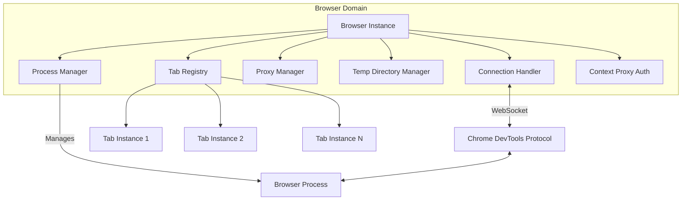
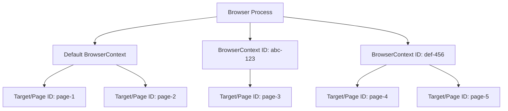

# 浏览器域架构

浏览器域代表 Pydoll 自动化层次结构的最高级别，管理浏览器进程生命周期、CDP 连接、上下文隔离和全局浏览器操作。本文档探讨了浏览器级控制的内部架构、设计决策和技术实现。

!!! info "实用指南"
    有关实际示例和使用模式，请参阅[浏览器管理](../features/browser-management/tabs.md)和[浏览器上下文](../features/browser-management/contexts.md)指南。

## 架构概述

浏览器域位于进程管理、协议通信和资源协调的交叉点。它协调多个专门的组件，为浏览器自动化提供统一的接口：



### 层次结构与抽象

浏览器域被实现为一个**抽象基类**，定义了所有浏览器实现的契约：

```python
class Browser(ABC):
    """Abstract base class for browser automation via CDP."""
    
    @abstractmethod
    def _get_default_binary_location(self) -> str:
        """子类必须提供特定于浏览器的可执行文件路径。"""
        pass
    
    async def start(self, headless: bool = False) -> Tab:
        """所有浏览器共享的具体实现。"""
        # 1. 解析二进制位置
        # 2. 设置用户数据目录
        # 3. 启动浏览器进程
        # 4. 验证 CDP 连接
        # 5. 配置代理（如果需要）
        # 6. 返回初始标签页
```

这种设计实现了**多态性** - Chrome、Edge 和其他基于 Chromium 的浏览器共享 99% 的代码，仅在可执行文件路径和次要标志变化上有所不同。

## 组件架构

Browser 类协调多个专门的管理器，每个管理器负责浏览器自动化的特定方面。理解这些组件是理解 Pydoll 设计的关键。

### 连接处理器

ConnectionHandler 是 Pydoll 和浏览器进程之间的**通信桥梁**。它管理：

- **WebSocket 生命周期**：连接建立、保持活动、重新连接
- **命令执行**：发送 CDP 命令并等待响应
- **事件分发**：将 CDP 事件路由到已注册的回调
- **回调注册表**：维护每个连接的事件监听器

```python
class Browser:
    def __init__(self, ...):
        # ConnectionHandler 使用端口或 WebSocket 地址初始化
        self._connection_handler = ConnectionHandler(self._connection_port)
    
    async def _execute_command(self, command, timeout=10):
        """所有 CDP 命令都通过连接处理器流动。"""
        return await self._connection_handler.execute_command(command, timeout)
```

!!! info "连接层深入探讨"
    有关 WebSocket 通信、命令/响应流程和异步模式的详细信息，请参阅[连接层架构](./connection-layer.md)。

### 进程管理器

BrowserProcessManager 处理**操作系统进程生命周期**：

```python
class BrowserProcessManager:
    def start_browser_process(self, binary, port, arguments):
        """
        1. 使用二进制路径 + 参数构造命令行
        2. 使用适当的 stdio 处理生成子进程
        3. 监控进程启动
        4. 存储进程句柄以供后续终止
        """
        
    def stop_process(self):
        """
        1. 尝试优雅终止（SIGTERM）
        2. 等待进程退出
        3. 如果超时则强制终止（SIGKILL）
        4. 清理进程资源
        """
```

**为什么要分离进程管理？**

- **可测试性**：进程管理器可以在单元测试中被模拟
- **跨平台**：封装特定于操作系统的进程处理
- **可靠性**：处理僵尸进程、孤立子进程等边缘情况

### 标签页注册表

Browser 维护一个 **Tab 实例注册表**以确保每个目标的单例行为：

```python
class Browser:
    def __init__(self, ...):
        self._tabs_opened: dict[str, Tab] = {}
    
    async def new_tab(self, url='', browser_context_id=None) -> Tab:
        # 通过 CDP 创建目标
        response = await self._execute_command(
            TargetCommands.create_target(browser_context_id=browser_context_id)
        )
        target_id = response['result']['targetId']
        
        # 检查标签页是否已存在于注册表中
        if target_id in self._tabs_opened:
            return self._tabs_opened[target_id]
        
        # 创建新的 Tab 实例并注册它
        tab = Tab(self, target_id=target_id, ...)
        self._tabs_opened[target_id] = tab
        return tab
```

**为什么使用单例 Tab 实例？**

- **状态一致性**：对同一标签页的多个引用共享状态（已启用的域、回调）
- **内存效率**：防止同一目标的重复 Tab 实例
- **事件路由**：确保事件路由到正确的 Tab 实例

### 代理身份验证架构

Pydoll 通过 Fetch 域实现**自动代理身份验证**，以避免在 CDP 命令中暴露凭据。根据代理范围，实现使用**两种不同的机制**：

#### 机制 1：浏览器级代理身份验证（全局代理）

当通过 `ChromiumOptions` 配置代理时（适用于默认上下文中的所有标签页）：

```python
# 在 Browser.start() -> _configure_proxy() 中
async def _configure_proxy(self, private_proxy, proxy_credentials):
    # 在浏览器级别启用 Fetch
    await self.enable_fetch_events(handle_auth_requests=True)
    
    # 在浏览器级别注册回调（影响所有标签页）
    await self.on(FetchEvent.REQUEST_PAUSED, self._continue_request_callback, temporary=True)
    await self.on(FetchEvent.AUTH_REQUIRED, 
                  partial(self._continue_request_with_auth_callback,
                          proxy_username=credentials[0],
                          proxy_password=credentials[1]),
                  temporary=True)
```

**作用域：**浏览器级 WebSocket 连接 → 影响**默认上下文中的所有标签页**

#### 机制 2：标签页级代理身份验证（按上下文代理）

当通过 `create_browser_context(proxy_server=...)` 为每个上下文配置代理时：

```python
# 按上下文存储凭据
async def create_browser_context(self, proxy_server, ...):
    sanitized_proxy, extracted_auth = self._sanitize_proxy_and_extract_auth(proxy_server)
    
    response = await self._execute_command(
        TargetCommands.create_browser_context(proxy_server=sanitized_proxy)
    )
    context_id = response['result']['browserContextId']
    
    if extracted_auth:
        self._context_proxy_auth[context_id] = extracted_auth  # 按上下文存储
    
    return context_id

# 为该上下文中的每个标签页设置身份验证
async def _setup_context_proxy_auth_for_tab(self, tab, browser_context_id):
    creds = self._context_proxy_auth.get(browser_context_id)
    if not creds:
        return
    
    # 在标签页上启用 Fetch（标签页级 WebSocket）
    await tab.enable_fetch_events(handle_auth=True)
    
    # 在标签页上注册回调（仅影响此标签页）
    await tab.on(FetchEvent.REQUEST_PAUSED, 
                 partial(self._tab_continue_request_callback, tab=tab), 
                 temporary=True)
    await tab.on(FetchEvent.AUTH_REQUIRED,
                 partial(self._tab_continue_request_with_auth_callback,
                         tab=tab,
                         proxy_username=creds[0],
                         proxy_password=creds[1]),
                 temporary=True)
```

**作用域：**标签页级 WebSocket 连接 → 仅影响**该特定标签页**

#### 为什么使用两种机制？

| 方面 | 浏览器级 | 标签页级 |
|--------|---------------|-----------|
| **触发器** | `ChromiumOptions` 中的代理 | `create_browser_context()` 中的代理 |
| **WebSocket** | 浏览器级连接 | 标签页级连接 |
| **作用域** | 默认上下文中的所有标签页 | 仅该上下文中的标签页 |
| **效率** | 所有标签页一个监听器 | 每个标签页一个监听器 |
| **隔离** | 无上下文分离 | 每个上下文具有不同的凭据 |

**标签页级身份验证的设计理由：**

- **上下文隔离**：每个上下文可以有**不同的代理**和**不同的凭据**
- **CDP 限制**：Fetch 域不能在浏览器级别限定到特定上下文
- **权衡**：效率稍低（每个标签页一个监听器），但对于按上下文代理支持是必需的

这种架构确保**凭据永远不会出现在 CDP 日志中**，身份验证以透明方式处理。

!!! warning "Fetch 域副作用"
    - **浏览器级 Fetch**：暂时暂停默认上下文中**所有标签页的所有请求**，直到身份验证完成
    - **标签页级 Fetch**：暂时暂停**该特定标签页的所有请求**，直到身份验证完成
    
    这是 CDP 限制 - Fetch 启用请求拦截。身份验证完成后，Fetch 被禁用以最小化开销。

## 初始化和生命周期

### 构造函数设计

Browser 构造函数初始化所有内部组件，但**不启动浏览器进程**。这种分离允许在启动之前进行配置：

```python
class Browser(ABC):
    def __init__(
        self,
        options_manager: BrowserOptionsManager,
        connection_port: Optional[int] = None,
    ):
        # 1. 验证参数
        self._validate_connection_port(connection_port)
        
        # 2. 通过管理器初始化选项
        self.options = options_manager.initialize_options()
        
        # 3. 确定 CDP 端口（如果未指定则随机）
        self._connection_port = connection_port or randint(9223, 9322)
        
        # 4. 初始化专门的管理器
        self._proxy_manager = ProxyManager(self.options)
        self._browser_process_manager = BrowserProcessManager()
        self._temp_directory_manager = TempDirectoryManager()
        self._connection_handler = ConnectionHandler(self._connection_port)
        
        # 5. 初始化状态跟踪
        self._tabs_opened: dict[str, Tab] = {}
        self._context_proxy_auth: dict[str, tuple[str, str]] = {}
        self._ws_address: Optional[str] = None
```

**关键设计决策：**

- **延迟进程启动**：构造函数是同步的；`start()` 是异步的
- **端口灵活性**：随机端口防止并行自动化中的冲突
- **选项管理器模式**：用于浏览器特定配置的策略模式
- **组件组合**：专门的管理器而不是单体类

### 启动序列

`start()` 方法协调浏览器启动和连接：

```python
async def start(self, headless: bool = False) -> Tab:
    # 1. 解析二进制位置
    binary_location = self.options.binary_location or self._get_default_binary_location()
    
    # 2. 设置用户数据目录（临时或持久）
    self._setup_user_dir()
    
    # 3. 提取代理凭据（如果是私有代理）
    proxy_config = self._proxy_manager.get_proxy_credentials()
    
    # 4. 使用参数启动浏览器进程
    self._browser_process_manager.start_browser_process(
        binary_location, self._connection_port, self.options.arguments
    )
    
    # 5. 验证 CDP 端点是否响应
    await self._verify_browser_running()
    
    # 6. 配置代理身份验证（通过 Fetch 域）
    await self._configure_proxy(proxy_config[0], proxy_config[1])
    
    # 7. 获取第一个有效目标并创建 Tab
    valid_tab_id = await self._get_valid_tab_id(await self.get_targets())
    tab = Tab(self, target_id=valid_tab_id, connection_port=self._connection_port)
    self._tabs_opened[valid_tab_id] = tab
    
    return tab
```

!!! tip "为什么 start() 返回一个 Tab"
    这是为了人体工程学的**设计妥协**。理想情况下，`start()` 只会启动浏览器，用户会单独调用 `new_tab()`。但是，返回初始标签页减少了 90% 用例（单标签页自动化）的样板代码。权衡：即使在多标签页场景中也无法避免初始标签页。

### 上下文管理器协议

Browser 实现了 `__aenter__` 和 `__aexit__` 以自动清理：

```python
async def __aexit__(self, exc_type, exc_val, exc_tb):
    # 1. 恢复备份首选项（如果已修改）
    if self._backup_preferences_dir:
        shutil.copy2(self._backup_preferences_dir, ...)
    
    # 2. 检查浏览器是否仍在运行
    if await self._is_browser_running(timeout=2):
        await self.stop()
    
    # 3. 关闭 WebSocket 连接
    await self._connection_handler.close()
```

这确保即使在自动化期间发生异常也能正确清理。

## 浏览器上下文架构

浏览器上下文是 Pydoll 最复杂的隔离机制，在单个浏览器进程内提供**完整的浏览环境分离**。理解它们的架构对于高级自动化至关重要。

### CDP 层次结构：浏览器、上下文、目标

CDP 将浏览器结构组织为三个级别：



**关键概念：**

1. **浏览器进程**：具有一个 CDP 端点的单个 Chromium 实例
2. **BrowserContext**：隔离的存储/缓存/权限边界（类似于无痕模式）
3. **目标**：单个页面、弹出窗口、worker 或后台目标

### 上下文隔离边界

每个浏览器上下文维护以下内容的**严格隔离**：

| 资源 | 隔离级别 | 实现 |
|----------|----------------|----------------|
| Cookies | 完全 | 每个上下文单独的 cookie jar |
| localStorage | 完全 | 每个上下文每个源单独的存储 |
| IndexedDB | 完全 | 每个上下文每个源单独的数据库 |
| 缓存 | 完全 | 每个上下文独立的 HTTP 缓存 |
| 权限 | 完全 | 上下文特定的权限授予 |
| 网络代理 | 完全 | 按上下文的代理配置 |
| 身份验证 | 完全 | 每个上下文独立的身份验证状态 |

!!! info "为什么上下文是轻量级的"
    与启动多个浏览器进程不同，上下文共享**渲染引擎、GPU 进程和网络栈**。只有存储和状态被隔离。这使得创建上下文比新浏览器实例快 10-100 倍。

### 上下文创建和目标绑定

创建上下文和目标涉及两个 CDP 命令：

```python
# 步骤 1：创建隔离的浏览上下文
response = await self._execute_command(
    TargetCommands.create_browser_context(
        proxy_server='http://proxy.example.com:8080',
        proxy_bypass_list='localhost,127.0.0.1'
    )
)
context_id = response['result']['browserContextId']

# 步骤 2：在该上下文中创建目标（页面）
response = await self._execute_command(
    TargetCommands.create_target(
        browser_context_id=context_id  # 将目标绑定到上下文
    )
)
target_id = response['result']['targetId']
```

**关键细节：**`browser_context_id` 参数**将目标绑定到上下文的隔离边界**。没有它，目标将在默认上下文中创建。

### 有头模式下的窗口实体化

在**有头模式**（可见 UI）中，浏览器上下文有一个重要的物理约束：

- 上下文最初仅存在于**内存中**（无窗口）
- 在上下文中创建的**第一个目标****必须**打开一个顶级窗口
- **后续目标**可以作为该窗口内的标签页打开

这是一个 **CDP/Chromium 限制**，而不是 Pydoll 的设计选择：

```python
# 上下文中的第一个目标：必须创建窗口
tab1 = await browser.new_tab(browser_context_id=context_id)  # 打开新窗口

# 后续目标：可以作为现有窗口中的标签页打开
tab2 = await browser.new_tab(browser_context_id=context_id)  # 作为标签页打开
```

**为什么这很重要？**

- 在**无头模式**中：完全无关（不渲染窗口）
- 在**有头模式**中：每个上下文的第一个目标将打开一个可见窗口
- 在**测试环境**中：多个上下文 → 多个窗口（可能会令人困惑）

!!! tip "无头上下文更干净"
    对于 CI/CD、抓取或批量自动化，请使用无头模式。上下文隔离的工作方式相同，但没有窗口实体化开销。

### 上下文删除和清理

删除上下文会**立即关闭其中的所有目标**：

```python
await browser.delete_browser_context(context_id)
# 此上下文中的所有标签页现已关闭
# 此上下文的所有存储已清除
# 上下文不能重用（ID 无效）
```

**清理序列：**

1. CDP 发送 `Target.disposeBrowserContext` 命令
2. 浏览器关闭该上下文中的所有目标
3. 浏览器清除该上下文的所有存储
4. 浏览器使上下文 ID 无效
5. Pydoll 从内部注册表中删除上下文

## 浏览器级别的事件系统

浏览器域支持跨所有标签页和上下文操作的**浏览器级事件监听器**。这与标签页级事件不同。

### 浏览器与标签页事件作用域

```python
# 浏览器级事件：适用于所有标签页
await browser.on('Target.targetCreated', handle_new_target)

# 标签页级事件：适用于一个标签页
await tab.on('Page.loadEventFired', handle_page_load)
```

**架构差异：**

- **浏览器事件**使用**浏览器级 WebSocket 连接**（基于端口或 `ws://host/devtools/browser/...`）
- **标签页事件**使用**标签页级 WebSocket 连接**（`ws://host/devtools/page/<target_id>`）

### Fetch 域：全局请求拦截

Fetch 域可以在**浏览器和标签页**两个级别启用，具有不同的作用域：

```python
# 浏览器级 Fetch：拦截所有标签页的请求
await browser.enable_fetch_events(handle_auth_requests=True)
await browser.on('Fetch.requestPaused', handle_request)

# 标签页级 Fetch：拦截一个标签页的请求
await tab.enable_fetch_events(handle_auth_requests=True)
await tab.on('Fetch.requestPaused', handle_request)
```

**何时使用每种方式：**

| 用例 | 级别 | 原因 |
|----------|-------|--------|
| 代理身份验证 | 浏览器 | 全局应用于所有上下文 |
| 广告拦截 | 浏览器 | 在所有标签页中拦截广告 |
| API 模拟 | 标签页 | 为特定测试模拟特定 API |
| 请求日志 | 标签页 | 仅记录相关标签页的请求 |

!!! warning "Fetch 性能影响"
    在浏览器级别启用 Fetch 会**暂停所有标签页的所有请求**，直到回调执行。这会为每个请求增加延迟。尽可能使用标签页级 Fetch 以最小化影响。

### 命令路由

所有 CDP 命令都通过浏览器的连接处理器流动：

```python
async def _execute_command(self, command, timeout=10):
    """
    将命令路由到适当的连接：
    - 浏览器级命令 → 浏览器 WebSocket
    - 标签页级命令 → 委托给 Tab 实例
    """
    return await self._connection_handler.execute_command(command, timeout)
```

这种集中式路由实现：

- **请求/响应关联**：通过 ID 匹配响应与请求
- **超时管理**：取消超过超时的命令
- **错误处理**：将 CDP 错误转换为 Python 异常

## 资源管理

### Cookie 和存储操作

浏览器域公开**浏览器级**和**上下文特定**的存储操作：

```python
# 浏览器级操作（所有上下文）
await browser.set_cookies(cookies)
await browser.get_cookies()
await browser.delete_all_cookies()

# 上下文特定操作
await browser.set_cookies(cookies, browser_context_id=context_id)
await browser.get_cookies(browser_context_id=context_id)
await browser.delete_all_cookies(browser_context_id=context_id)
```

这些操作在底层使用 **Storage 域**：

- `Storage.getCookies`：检索上下文或所有上下文的 cookie
- `Storage.setCookies`：使用域/路径/过期时间设置 cookie
- `Storage.clearCookies`：清除上下文或所有上下文的 cookie

!!! info "浏览器与标签页存储作用域"
    - **浏览器级**：对整个浏览器或特定上下文操作
    - **标签页级**：限定于标签页的当前源
    
    使用浏览器级进行全局 cookie 管理（例如，为所有域设置会话 cookie）。使用标签页级进行特定于源的操作（例如，注销后清除 cookie）。

### 权限授予

浏览器域提供**编程式权限控制**，绕过浏览器提示：

```python
await browser.grant_permissions(
    [PermissionType.GEOLOCATION, PermissionType.NOTIFICATIONS],
    origin='https://example.com',
    browser_context_id=context_id
)
```

**架构：**

- 通过 `Browser.grantPermissions` CDP 命令授予权限
- 权限是**上下文特定的**（每个上下文隔离）
- 授予会覆盖默认提示行为
- `reset_permissions()` 恢复到默认行为

### 下载管理

下载行为通过 `Browser.setDownloadBehavior` 命令配置：

```python
await browser.set_download_behavior(
    behavior=DownloadBehavior.ALLOW,
    download_path='/path/to/downloads',
    events_enabled=True,  # 发出下载进度事件
    browser_context_id=context_id
)
```

**选项：**

- `ALLOW`：保存到指定路径
- `DENY`：取消所有下载
- `DEFAULT`：显示浏览器的默认下载 UI

### 窗口管理

窗口操作应用于目标的**物理操作系统窗口**：

```python
window_id = await browser.get_window_id_for_target(target_id)
await browser.set_window_bounds({
    'left': 100, 'top': 100,
    'width': 1920, 'height': 1080,
    'windowState': 'normal'  # 或 'minimized'、'maximized'、'fullscreen'
})
```

**实现细节：**

- 使用 `Browser.getWindowForTarget` 从目标 ID 解析窗口 ID
- `Browser.setWindowBounds` 修改窗口几何形状
- **无头模式**：窗口操作是无操作的（不存在物理窗口）

## 架构洞察和设计权衡

### 单例标签页注册表：为什么？

标签页注册表模式（`_tabs_opened: dict[str, Tab]`）确保：

1. **事件路由正确工作**：CDP 事件包含 `targetId` 但没有 Tab 引用。注册表映射 `targetId` → `Tab` 以实现正确的回调分发。
2. **状态一致性**：引用同一目标的多个代码路径获得**相同的 Tab 实例**，防止状态分歧。
3. **内存效率**：没有注册表，`get_opened_tabs()` 会在每次调用时创建重复的 Tab 实例。

**权衡：**内存使用随标签页数量增长，但对于有状态的 Tab 实例这是不可避免的。

### 为什么 start() 返回一个 Tab

这个设计决策牺牲纯粹性以获得**人体工程学**：

- **缺点**：即使在多标签页自动化中也无法避免初始标签页
- **优点**：90% 的用户（单标签页脚本）不需要样板代码：

```python
# start() 返回 Tab
tab = await browser.start()

# 不返回（纯粹设计）
await browser.start()
tab = await browser.new_tab()
```

**探索的替代方案：**在 `new_tab()` 中自动关闭初始标签页。因为这是令人惊讶的行为（隐式副作用）而被拒绝。

### 代理身份验证：两级架构权衡

Pydoll 的代理身份验证使用两种不同的 Fetch 域策略：

**浏览器级（全局代理）：**
- **安全优势**：凭据永远不会记录在 CDP 跟踪中
- **性能成本**：Fetch 暂停**所有标签页的所有请求**，直到身份验证完成
- **效率**：默认上下文中所有标签页的单个监听器
- **缓解**：第一次身份验证后禁用 Fetch，最小化开销

**标签页级（按上下文代理）：**
- **安全优势**：凭据永远不会记录在 CDP 跟踪中
- **性能成本**：Fetch 暂停**该标签页的所有请求**，直到身份验证完成
- **效率**：每个标签页单独的监听器（效率较低，但对于隔离是必需的）
- **隔离优势**：每个上下文可以有不同的代理凭据
- **缓解**：每个标签页在第一次身份验证后禁用 Fetch

**为什么不使用 Browser.setProxyAuth？**这个 CDP 命令不存在。Fetch 是编程式身份验证的唯一机制。

**为什么对上下文使用标签页级？**CDP 的 Fetch 域不能限定到特定的 BrowserContext。由于每个上下文可以有不同的代理和不同的凭据，Pydoll 必须在标签页级别处理身份验证以尊重上下文边界。

### 端口随机化策略

随机 CDP 端口（9223-9322）防止并行运行浏览器实例时的冲突：

```python
self._connection_port = connection_port or randint(9223, 9322)
```

**为什么不从 9222 递增？**

- 多进程环境中的竞态条件（例如 pytest-xdist）
- 与用户的手动端口选择冲突

**权衡：**随机端口更难调试（无法硬编码）。解决方案：`browser._connection_port` 暴露所选端口。

### 组件分离：为什么使用管理器？

Browser 类委托给专门的管理器（ProcessManager、ProxyManager、TempDirManager、ConnectionHandler）以实现：

1. **可测试性**：管理器可以独立模拟
2. **可重用性**：ProxyManager 逻辑在 Browser 实现之间共享
3. **可维护性**：每个管理器都有单一职责
4. **跨平台**：特定于操作系统的逻辑在 ProcessManager 中隔离

**权衡：**更多的间接层次，但在规模上代码组织显著更好。

## 关键要点

1. **Browser 是一个协调器**，而不是单体。它协调管理器并处理 CDP 通信。
2. **标签页注册表确保单例实例**每个目标，对于事件路由和状态一致性至关重要。
3. **浏览器上下文是轻量级隔离**，共享浏览器进程但分离存储/缓存/身份验证。
4. **通过 Fetch 的代理身份验证**是一种安全权衡 - 隐藏凭据但增加延迟。
5. **事件系统有两个级别**：浏览器级和标签页特定，具有不同的 WebSocket 连接。
6. **组件分离**（管理器）改善了可测试性和跨平台支持。

## 相关文档

要深入了解相关架构组件：

- **[连接层](./connection-layer.md)**：WebSocket 通信、命令/响应流程、异步模式
- **[事件架构](./event-architecture.md)**：事件分发、回调管理、域启用
- **[标签页域](./tab-domain.md)**：标签页级操作、页面导航、元素查找
- **[CDP 深入探讨](./cdp.md)**：Chrome DevTools Protocol 基础
- **[代理架构](./proxy-architecture.md)**：网络级代理概念和实现

实际使用模式：

- **[标签页管理](../features/browser-management/tabs.md)**：多标签页自动化模式
- **[浏览器上下文](../features/browser-management/contexts.md)**：上下文隔离实践
- **[代理配置](../features/configuration/proxy.md)**：设置代理和身份验证
