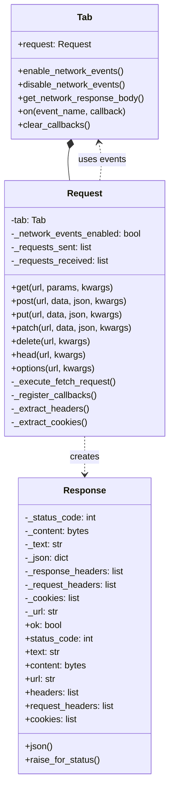
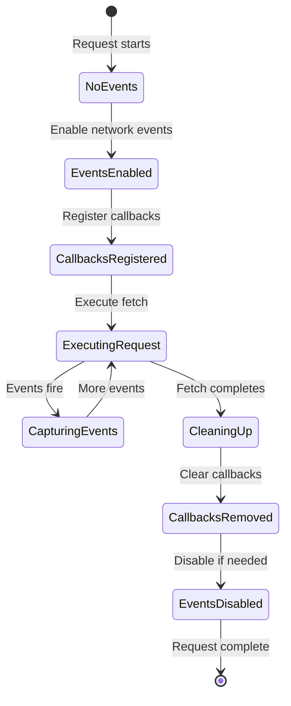
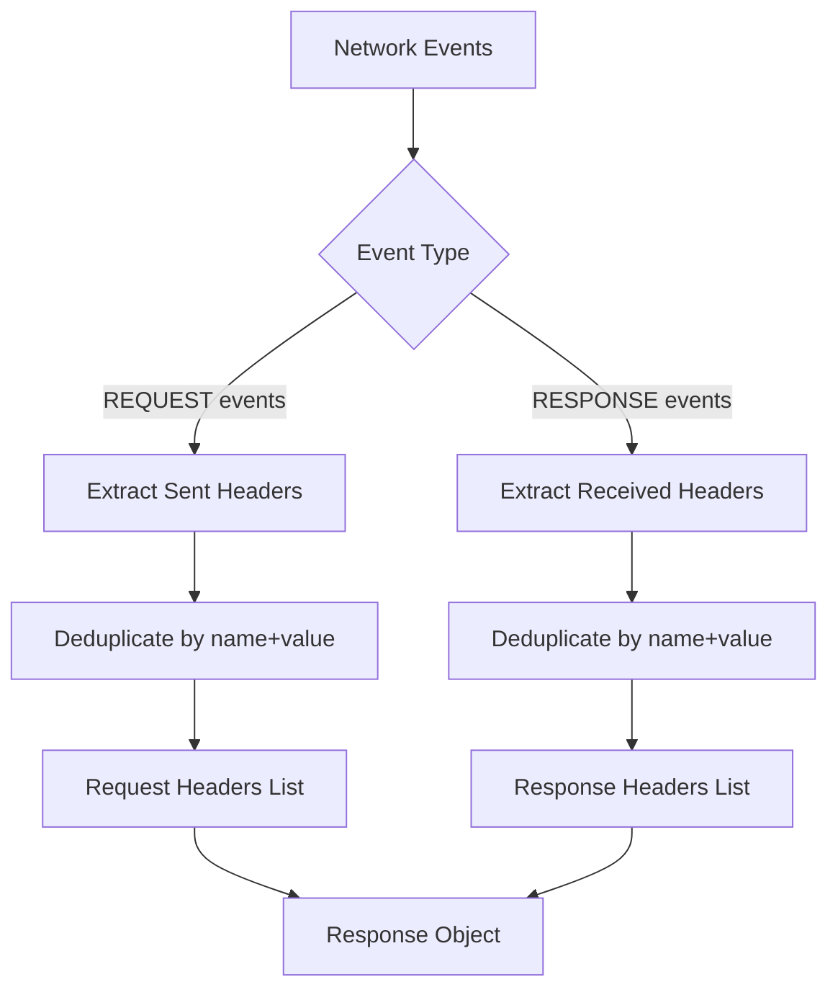
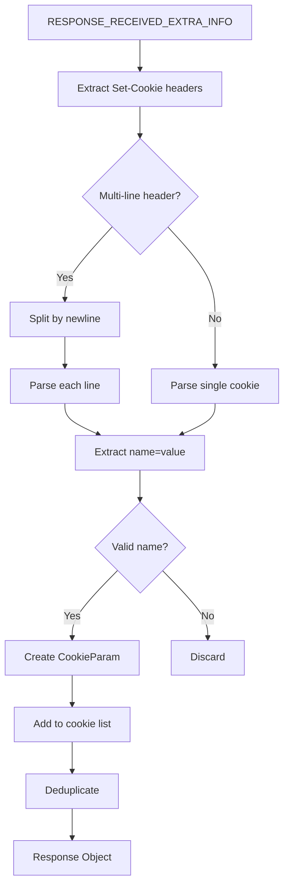

# 浏览器上下文请求架构

本文档探讨了 Pydoll 浏览器上下文 HTTP 请求系统的架构设计，该系统能够发起无缝继承浏览器会话状态、cookie 和身份验证的 HTTP 请求。

!!! info "提供实用指南"
    这是架构深入探讨。有关实际示例和用例，请参阅 [HTTP 请求指南](../features/network/http-requests.md)。

## 架构概述

浏览器上下文请求解决了混合自动化中的一个基本问题：在 UI 交互和 API 调用之间保持会话连续性。传统方法需要手动提取 cookie 和标头，在浏览器和 HTTP 客户端之间创建脆弱的耦合。

Pydoll 的架构通过在浏览器的 JavaScript 上下文**内部**执行 HTTP 请求来消除这种复杂性，同时利用 CDP 网络事件捕获 JavaScript 单独无法提供的全面元数据。

### 为什么选择这种架构？

| 传统方法 | Pydoll 架构 |
|---------------------|---------------------|
| 独立的 HTTP 客户端（requests、aiohttp） | 统一的基于浏览器的执行 |
| 手动 cookie 提取和同步 | 自动 cookie 继承 |
| 两个独立的会话状态 | 单一会话状态 |
| 有限的 CORS 处理 | 浏览器原生 CORS 强制执行 |
| 复杂的身份验证流程 | 透明的身份验证保留 |


## 组件架构

浏览器上下文请求系统由两个主要类组成，它们与 Pydoll 的事件系统协同工作：



### Request 类

`Request` 类作为接口层，提供类似 `requests` 的熟悉 API，同时协调 JavaScript 执行和网络事件监控之间的复杂交互。

**主要职责：**

- 将 Python 方法调用转换为 Fetch API JavaScript
- 管理临时网络事件监听器
- 在请求执行期间累积网络事件
- 从 CDP 事件中提取元数据
- 使用完整信息构造 Response 对象

### Response 类

`Response` 类提供与 `requests.Response` 兼容的接口，使从传统 HTTP 客户端迁移变得无缝。

**主要特性：**

- 多种内容访问器（文本、字节、JSON）
- 带缓存的延迟 JSON 解析
- 全面的标头信息（已发送和已接收）
- 从 Set-Cookie 标头提取 cookie
- 重定向后的最终 URL

## 执行流程

请求执行遵循六阶段管道：

```mermaid
flowchart TD
    Start([tab.request.get#40;url#41;]) --> Phase1[<b>1. 准备</b><br/>构建 URL + 选项]
    
    Phase1 --> Phase2[<b>2. 事件注册</b><br/>启用网络事件<br/>注册回调]
    
    Phase2 --> Phase3[<b>3. JavaScript 执行</b><br/>Runtime.evaluate&#40;fetch&#41;]
    
    Phase3 --> Phase4{<b>4. 网络活动</b>}
    Phase4 -->|请求已发送| Event1[REQUEST_WILL_BE_SENT]
    Phase4 -->|响应已接收| Event2[RESPONSE_RECEIVED]
    Phase4 -->|额外信息| Event3[*_EXTRA_INFO events]
    
    Event1 --> Collect[收集元数据]
    Event2 --> Collect
    Event3 --> Collect
    
    Collect --> Phase5[<b>5. 构造</b><br/>提取标头/cookie<br/>构建 Response 对象]
    
    Phase5 --> Phase6[<b>6. 清理</b><br/>清除回调<br/>禁用事件]
    
    Phase6 --> End([返回 Response])
```



### 阶段详情

| 阶段 | 层 | 关键操作 | 异步 |
|-------|-------|----------------|--------------|
| **1. 准备** | Request | URL 构建、选项格式化 | 否 |
| **2. 事件注册** | Tab | 启用事件、注册回调 | 是 |
| **3. JavaScript 执行** | CDP/Browser | 在浏览器上下文中执行 fetch() | 是 |
| **4. 网络活动** | Browser/CDP | HTTP 请求、发出 CDP 事件 | 是（并行） |
| **5. 构造** | Request | 解析事件、构建 Response | 否 |
| **6. 清理** | Tab | 删除回调、禁用事件 | 是 |

## 事件系统集成

浏览器上下文请求与 Pydoll 的事件系统架构紧密集成。理解这种关系至关重要。

### 临时事件生命周期



### 为什么同时使用 JavaScript 和事件？

一个常见问题：如果 JavaScript 可以执行请求，为什么要使用网络事件？

| 信息来源 | JavaScript（Fetch API） | 网络事件（CDP） |
|-------------------|------------------------|----------------------|
| 响应状态 | 可用 | 可用 |
| 响应正文 | 可用 | 不可用 |
| 响应标头 | 部分（CORS 受限） | 完整 |
| 请求标头 | 不可访问 | 完整 |
| Set-Cookie 标头 | 浏览器隐藏 | 可用 |
| 时序信息 | 有限 | 全面 |
| 重定向链 | 仅最终 URL | 完整链 |

**解决方案：** 结合两个来源以获取完整信息。

!!! tip "互补技术"
    JavaScript 提供响应正文并在浏览器上下文中触发请求（带有 cookie、身份验证）。网络事件提供 JavaScript 安全策略隐藏的元数据。

### CDP 网络事件类型

该架构使用四种 CDP 事件类型来捕获完整的元数据：

| 事件 | 目的 | 关键信息 |
|-------|---------|----------------|
| `REQUEST_WILL_BE_SENT` | 主要传出请求 | URL、方法、标准标头 |
| `REQUEST_WILL_BE_SENT_EXTRA_INFO` | 额外请求元数据 | 关联的 cookie、原始标头 |
| `RESPONSE_RECEIVED` | 主要响应已接收 | 状态、标头、MIME 类型、时序 |
| `RESPONSE_RECEIVED_EXTRA_INFO` | 额外响应元数据 | Set-Cookie 标头、安全信息 |

!!! info "事件多重性"
    单个 HTTP 请求生成多个 CDP 事件。Request 类累积所有相关事件，并在构造阶段提取非重复信息。

## 标头和 Cookie 架构

### 标头提取策略

标头存在于多个 CDP 事件中，可能存在重复。该架构使用去重策略：



**去重逻辑：**

1. 按顺序处理事件
2. 每个标头由 `(name, value)` 元组标识
3. 仅保留每个元组的第一次出现
4. 结果：唯一、非冗余的标头列表

### Cookie 解析架构

Cookie 需要特殊处理，因为它们来自 `RESPONSE_RECEIVED_EXTRA_INFO` 事件中的 `Set-Cookie` 标头：



**Cookie 提取原则：**

- 只有 `EXTRA_INFO` 事件包含 `Set-Cookie` 标头
- 忽略 Cookie 属性（Path、Domain、Secure、HttpOnly）
- 浏览器在内部管理 cookie 属性
- 仅提取名称-值对以供参考

!!! warning "Cookie 范围"
    `Response.cookies` 属性仅包含来自此特定响应的**新的或更新的** cookie。现有浏览器 cookie 会自动管理，不会通过此接口公开。

## JavaScript 执行上下文

Fetch API 执行发生在浏览器的 JavaScript 上下文中，这是该架构强大功能的关键：

### Fetch API 集成

请求被转换为 JavaScript：

```javascript
// 简化表示
(async () => {
    const response = await fetch(url, {
        method: 'GET',
        headers: {'X-Custom': 'value'},
        // 浏览器自动添加：
        // - Cookie 标头
        // - 如果设置了 Authorization
        // - 标准标头（User-Agent、Accept 等）
    });
    
    return {
        status: response.status,
        url: response.url,  // 重定向后的最终 URL
        text: await response.text(),
        content: new Uint8Array(await response.arrayBuffer()),
        json: response.headers.get('Content-Type')?.includes('application/json')
            ? await response.clone().json()
            : null
    };
})()
```

### 浏览器上下文优势

在浏览器上下文中执行提供：

| 优势 | 描述 |
|---------|-------------|
| **自动 Cookie 包含** | 浏览器自动发送所有适用的 cookie |
| **身份验证状态保留** | 从浏览器会话维护身份验证标头 |
| **CORS 强制执行** | 浏览器应用与用户交互相同的 CORS 策略 |
| **TLS/SSL 处理** | 应用浏览器的证书验证和安全策略 |
| **压缩** | 自动处理 gzip、br、deflate |
| **重定向** | 浏览器透明地跟随重定向 |
| **相同安全上下文** | 请求与用户发起的请求完全相同 |

!!! info "反机器人检测"
    在浏览器上下文中执行的请求与用户发起的请求无法区分，使其对分析请求模式的反机器人系统有效。

## 性能考虑

### 事件开销

网络事件为请求执行增加了开销：

| 场景 | 开销 | 建议 |
|----------|----------|----------------|
| 单个请求 | 低 | 可接受 |
| 多个顺序请求 | 中等 | 启用一次事件 |
| 批量请求（100+） | 高 | 考虑在标签页级别启用事件 |
| 长时间运行的自动化 | 内存问题 | 完成后禁用 |

### 优化模式

```python
# 低效 - 事件反复启用/禁用
for url in urls:
    response = await tab.request.get(url)

# 高效 - 事件启用一次
await tab.enable_network_events()
for url in urls:
    response = await tab.request.get(url)
await tab.disable_network_events()
```

!!! tip "自动优化"
    Request 类检查网络事件是否已启用，并自动跳过冗余的启用/禁用操作。

### JSON 解析策略

Response JSON 解析使用带缓存的延迟评估：

1. 首次调用 `response.json()`：解析并缓存
2. 后续调用：返回缓存结果
3. 如果在构造期间预解析了 JSON：使用它

这可以防止冗余的解析开销。

## 安全架构

### CORS 策略强制执行

浏览器上下文请求遵守 CORS 策略：

```mermaid
flowchart TD
    A[tab.request.get&#40;url&#41;] --> B{Same Origin?}
    B -->|Yes| C[Request Allowed]
    B -->|No| D{CORS Headers Present?}
    D -->|Yes| E[Request Allowed]
    D -->|No| F[Request Blocked]
    
    C --> G[Response Returned]
    E --> G
    F --> H[CORS Error]
```



**CORS 行为：**

- 对同源的请求：始终允许
- 跨源请求：需要服务器的 CORS 标头
- 不透明响应：可能被浏览器阻止

**CORS 问题的解决方法：**

首先导航到域以建立同源上下文：

```python
await tab.go_to('https://different-domain.com')
response = await tab.request.get('https://different-domain.com/api')
```

### Cookie 安全

浏览器处理带有安全标志（`HttpOnly`、`Secure`、`SameSite`）的 Cookie：

- **HttpOnly cookie**：自动发送但不暴露给 JavaScript 或 CDP
- **Secure cookie**：仅通过 HTTPS 发送
- **SameSite cookie**：浏览器强制执行 SameSite 策略

由于这些安全限制，`Response.cookies` 属性可能不会显示所有 cookie。

### TLS/SSL 验证

浏览器验证 SSL 证书。自签名或无效证书会导致请求失败，除非：

```python
options = ChromiumOptions()
options.add_argument('--ignore-certificate-errors')
browser = Chrome(options=options)
```

!!! warning "安全权衡"
    禁用证书验证会降低安全性。仅在受控环境中使用。

## 限制和设计决策

### 请求正文大小

非常大的请求正文（文件、大型数据集）具有 JavaScript 内存约束。对于文件上传，请改用 `WebElement.set_input_files()` 或文件选择器拦截器。

### 二进制响应处理

二进制响应通过 JavaScript 的 `ArrayBuffer` 和 `Uint8Array` 转换，这会为非常大的响应（>100MB）增加一些开销。

### 重定向透明度

Fetch API 自动跟随重定向。仅捕获最终 URL。如果您需要重定向链，请单独使用网络监控。

### 事件时序

事件必须在执行 fetch **之前**注册。架构通过注册阶段确保这一点，但手动事件处理需要仔细的时序。

## 架构原则

浏览器上下文请求架构遵循以下原则：

1. **会话连续性**：永远不要破坏浏览器的会话状态
2. **零手动同步**：不需要 cookie/标头提取
3. **完整信息**：结合 JavaScript + 事件以获取完整元数据
4. **自动清理**：每个请求后释放资源
5. **熟悉的接口**：与 `requests` 兼容的 API，易于采用
6. **性能意识**：针对常见用例进行优化
7. **安全意识**：遵守浏览器安全策略

## 与其他系统的集成

### 事件系统依赖

浏览器上下文请求依赖于事件系统架构：

- 利用 `Tab.on()` 进行回调注册
- 使用 `Tab.clear_callbacks()` 进行清理
- 尊重现有的网络事件启用
- 与事件生命周期管理集成

详见[事件系统架构](event-architecture.md)。

### 类型系统集成

该架构广泛使用 Python 的类型系统：

- `HeaderEntry` TypedDict 用于标头
- `CookieParam` TypedDict 用于 cookie
- 来自 `pydoll.protocol.network.events` 的事件类型定义
- 提供 IDE 自动完成和类型安全

详见[类型系统](typing-system.md)。

## 进一步阅读

- **[HTTP 请求指南](../features/network/http-requests.md)** - 实际示例和用例
- **[事件系统架构](event-architecture.md)** - 事件系统内部设计
- **[网络监控](../features/network/monitoring.md)** - 被动网络观察
- **[请求拦截](../features/network/interception.md)** - 主动请求修改
- **[类型系统](typing-system.md)** - 类型系统集成

## 总结

Pydoll 的浏览器上下文请求架构通过结合 JavaScript Fetch API 执行和 CDP 网络事件监控来实现无缝 HTTP 通信。这种混合方法提供：

- 来自 JavaScript 和 CDP 事件的**完整元数据**
- 通过浏览器上下文执行实现**自动会话连续性**
- 与 requests 库兼容的**熟悉接口**
- 通过事件重用实现**性能优化**
- 符合浏览器策略的**安全合规性**

该架构展示了结合互补技术（JavaScript + CDP 事件）如何优雅地解决复杂问题，在不影响完整性或安全性的情况下提供强大功能和便利性。
