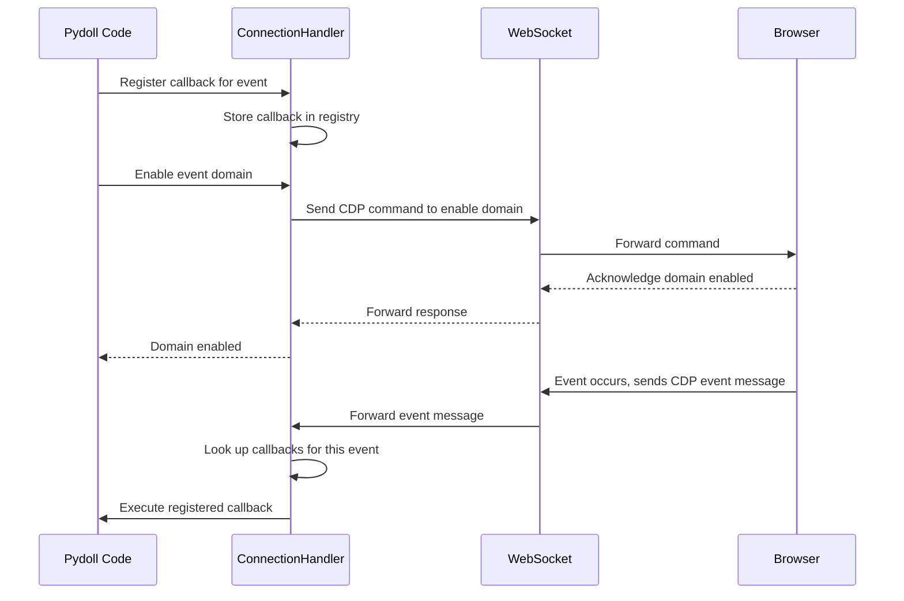
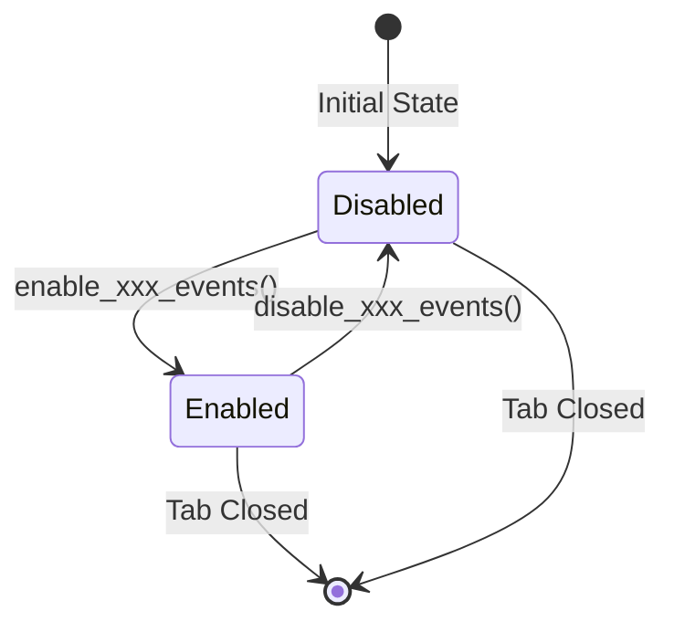
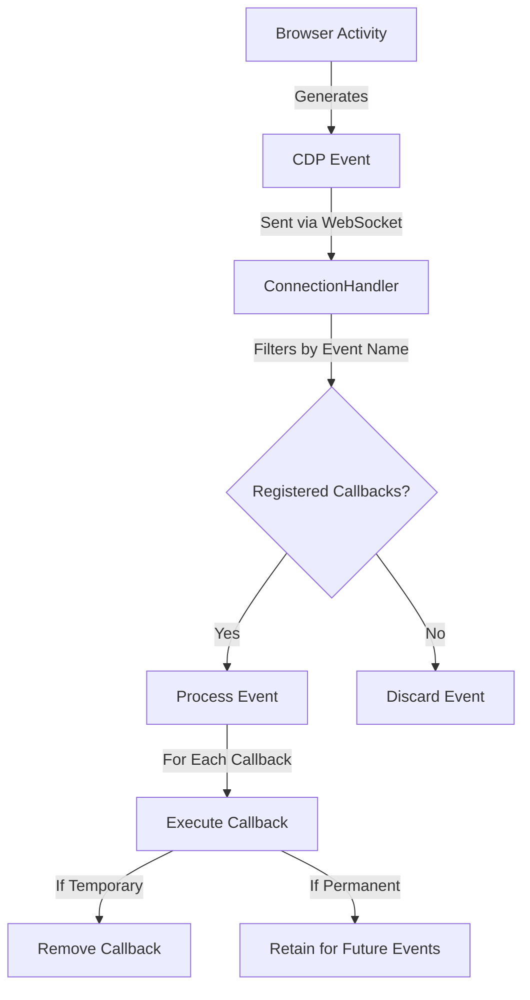
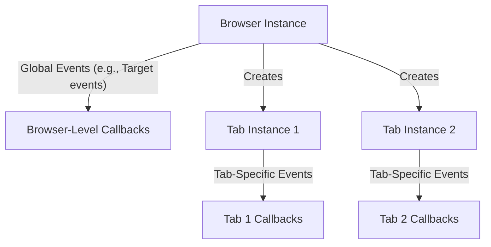

# 事件系统架构

本文档探讨 Pydoll 事件系统的内部架构，涵盖 WebSocket 通信、事件流、回调管理和性能考虑。

!!! info "实用指南"
    有关实际示例和使用模式，请参阅 [事件系统指南](../features/advanced/event-system.md)。

## WebSocket 通信和 CDP

Pydoll 事件系统的核心是 Chrome DevTools Protocol（CDP），它提供了一种结构化的方式来通过 WebSocket 连接与浏览器活动进行交互和监控。这个双向通信通道允许你的代码向浏览器发送命令并接收事件。



### WebSocket 通信模型

Pydoll 和浏览器之间的 WebSocket 连接遵循以下模式：

1. **连接建立**：浏览器启动时，会创建一个 WebSocket 服务器，Pydoll 建立与其的连接
2. **双向消息传递**：Pydoll 和浏览器都可以随时发送消息
3. **消息类型**：
   - **命令**：从 Pydoll 发送到浏览器（例如导航、DOM 操作）
   - **命令响应**：浏览器响应命令发送给 Pydoll
   - **事件**：当浏览器发生某些事情时发送给 Pydoll（例如页面加载、网络活动）

### Chrome DevTools Protocol 结构

CDP 将其功能组织成域，每个域负责浏览器功能的特定区域：

| 域 | 职责 | 典型事件 |
|----|------|---------|
| Page | 页面生命周期 | 加载事件、导航、对话框 |
| Network | 网络活动 | 请求/响应监控、WebSockets |
| DOM | 文档结构 | DOM 变更、属性修改 |
| Fetch | 请求拦截 | 请求暂停、需要身份验证 |
| Runtime | JavaScript 执行 | 控制台消息、异常 |
| Browser | 浏览器管理 | 窗口创建、标签页、上下文 |

每个域必须在发出事件之前显式启用，这有助于通过仅处理实际需要的事件来管理性能。

## 域架构

### 启用/禁用模式

显式启用/禁用模式服务于几个重要的架构目的：

1. **性能优化**：通过仅启用你感兴趣的域，减少事件处理的开销
2. **资源管理**：某些事件域（如 Network 或 DOM 监控）可能产生大量消耗内存的事件
3. **协议合规**：CDP 要求在发出事件之前显式启用域
4. **受控清理**：显式禁用域确保在不再需要事件时进行适当的清理



!!! warning "事件泄漏防护"
    如果不再需要时未禁用事件域，可能导致内存泄漏和性能下降，特别是在长时间运行的自动化中。完成后始终禁用事件域，尤其是对于高容量事件（如网络监控）。

### 域特定的启用方法

不同的域通过适当对象上的特定方法启用：

| 域 | 启用方法 | 禁用方法 | 可用对象 |
|----|---------|---------|---------|
| Page | `enable_page_events()` | `disable_page_events()` | Tab |
| Network | `enable_network_events()` | `disable_network_events()` | Tab |
| DOM | `enable_dom_events()` | `disable_dom_events()` | Tab |
| Fetch | `enable_fetch_events()` | `disable_fetch_events()` | Tab, Browser |
| File Chooser | `enable_intercept_file_chooser_dialog()` | `disable_intercept_file_chooser_dialog()` | Tab |

!!! info "域所有权"
    事件根据其功能属于特定域。某些域仅在某些级别可用 - 例如，Page 事件在 Tab 实例上可用，但在 Browser 级别不直接可用。

## 事件注册系统

### `on()` 方法

订阅事件的核心方法是 `on()` 方法，在 Tab 和 Browser 实例上都可用：

```python
async def on(
    self, event_name: str, callback: callable, temporary: bool = False
) -> int:
    """
    注册事件监听器。

    Args:
        event_name (str): 要监听的事件名称。
        callback (callable): 事件触发时要执行的回调函数。
        temporary (bool): 如果为 True，回调将在触发一次后被删除。
            默认为 False。

    Returns:
        int: 已注册回调的 ID。
    """
```

此方法返回一个回调 ID，如果需要，可以稍后用于删除回调。

### 回调注册表

在内部，`ConnectionHandler` 维护一个回调注册表：

```python
{
    'Page.loadEventFired': [
        (callback_id_1, callback_function_1, temporary=False),
        (callback_id_2, callback_function_2, temporary=True),
    ],
    'Network.requestWillBeSent': [
        (callback_id_3, callback_function_3, temporary=False),
    ]
}
```

当事件通过 WebSocket 到达时：

1. 从消息中提取事件名称
2. 查询注册表以获取匹配的回调
3. 使用事件数据执行每个回调
4. 执行后删除临时回调

### 异步回调处理

回调可以是同步的或异步的。事件系统处理两者：

```python
async def _trigger_callbacks(self, event_name: str, event_data: dict):
    for cb_id, cb_data in self._event_callbacks.items():
        if cb_data['event'] == event_name:
            if asyncio.iscoroutinefunction(cb_data['callback']):
                await cb_data['callback'](event_data)
            else:
                cb_data['callback'](event_data)
```

异步回调按顺序等待。这意味着每个回调在下一个执行之前完成，这对以下方面很重要：

- **可预测的执行顺序**：回调按注册顺序执行
- **错误处理**：一个回调中的异常不会阻止其他回调执行
- **状态一致性**：回调可以依赖于顺序的状态更改

!!! info "顺序执行 vs 并发执行"
    回调在同一事件内顺序执行。但是，不同的事件可以并发处理，因为事件循环同时处理多个连接。

## 事件流和生命周期

事件生命周期遵循以下步骤：



### 详细流程

1. **浏览器活动**：浏览器中发生某些事情（页面加载、发送请求、DOM 变更）
2. **CDP 事件生成**：浏览器生成 CDP 事件消息
3. **WebSocket 传输**：消息通过 WebSocket 发送到 Pydoll
4. **事件接收**：ConnectionHandler 接收事件
5. **回调查找**：ConnectionHandler 在其注册表中检查与事件名称匹配的回调
6. **回调执行**：如果存在回调，则使用事件数据执行每个回调
7. **临时删除**：如果回调注册为临时回调，则在执行后将其删除

## 浏览器级别 vs 标签页级别事件

Pydoll 的事件系统在浏览器和标签页级别运行，具有重要的区别：



### 浏览器级别事件

浏览器级别事件在所有标签页中全局操作。这些事件仅限于特定域，如：

- **Target 事件**：标签页创建、销毁、崩溃
- **Browser 事件**：窗口管理、下载协调

```python
# 浏览器级别事件注册
await browser.on('Target.targetCreated', handle_new_target)
```

浏览器级别的事件域是有限的，尝试使用标签页特定的事件将引发异常。

### 标签页级别事件

标签页级别事件特定于单个标签页：

```python
# 每个标签页都有自己的事件上下文
tab1 = await browser.start()
tab2 = await browser.new_tab()

await tab1.enable_page_events()
await tab1.on(PageEvent.LOAD_EVENT_FIRED, handle_tab1_load)

await tab2.enable_page_events()
await tab2.on(PageEvent.LOAD_EVENT_FIRED, handle_tab2_load)
```

此架构允许：

- **隔离的事件处理**：一个标签页中的事件不会影响其他标签页
- **每个标签页的配置**：不同的标签页可以监控不同的事件类型
- **资源效率**：仅在需要的标签页上启用事件

!!! info "域特定范围"
    并非所有事件域在两个级别都可用：
    
    - **Fetch 事件**：在浏览器和标签页级别都可用
    - **Page 事件**：仅在标签页级别可用
    - **Target 事件**：仅在浏览器级别可用

## 性能架构

### 事件系统开销

事件系统为浏览器自动化增加了开销，特别是对于高频事件：

| 事件域 | 典型事件量 | 性能影响 |
|--------|----------|---------|
| Page | 低 | 最小 |
| Network | 高 | 中等到高 |
| DOM | 非常高 | 高 |
| Fetch | 中等 | 中等（拦截时更高） |

### 性能优化策略

1. **选择性域启用**：仅启用你正在积极使用的事件域
2. **战略范围**：仅对真正的浏览器范围的问题使用浏览器级别事件
3. **及时禁用**：完成后始终禁用事件域
4. **早期过滤**：在回调中，尽早过滤掉无关的事件
5. **临时回调**：对一次性事件使用 `temporary=True` 标志

### 内存管理

事件系统通过几种机制管理内存：

1. **回调注册表清理**：删除回调释放其引用
2. **临时自动删除**：临时回调会自动清理
3. **域禁用**：禁用域会停止事件生成
4. **标签页关闭**：标签页关闭时，其所有回调会自动删除

!!! warning "内存泄漏防护"
    在长时间运行的自动化中，完成后始终清理回调并禁用域。高频事件（尤其是 DOM）如果保持启用状态，可能会累积大量内存。

## Connection Handler 架构

`ConnectionHandler` 是管理 WebSocket 通信和事件分发的核心组件。

### 关键职责

1. **WebSocket 管理**：建立和维护 WebSocket 连接
2. **消息路由**：区分命令响应和事件
3. **回调注册表**：维护事件名称到回调的映射
4. **事件分发**：事件到达时执行注册的回调
5. **清理**：删除回调并关闭连接

### 内部结构

```python
class ConnectionHandler:
    def __init__(self, ...):
        self._events_handler = EventsManager()
        self._websocket = None
        # ... other attributes
    
    async def register_callback(self, event_name, callback, temporary):
        return self._events_handler.register_callback(event_name, callback, temporary)

class EventsManager:
    def __init__(self):
        self._event_callbacks = {}  # Callback ID -> callback data
        self._callback_id = 0
    
    def register_callback(self, event_name, callback, temporary):
        self._callback_id += 1
        self._event_callbacks[self._callback_id] = {
            'event': event_name,
            'callback': callback,
            'temporary': temporary
        }
        return self._callback_id
    
    async def _trigger_callbacks(self, event_name, event_data):
        callbacks_to_remove = []
        
        for cb_id, cb_data in self._event_callbacks.items():
            if cb_data['event'] == event_name:
                # Execute callback (await if async, call directly if sync)
                if asyncio.iscoroutinefunction(cb_data['callback']):
                    await cb_data['callback'](event_data)
                else:
                    cb_data['callback'](event_data)
                
                # Mark temporary callbacks for removal
                if cb_data['temporary']:
                    callbacks_to_remove.append(cb_id)
        
        # Remove temporary callbacks after all callbacks executed
        for cb_id in callbacks_to_remove:
            self.remove_callback(cb_id)
```

此架构确保：

- **高效查找**：事件名称直接映射到回调列表
- **最小开销**：仅处理已注册的事件
- **自动清理**：临时回调在执行后被删除
- **线程安全**：操作是异步安全的

## 事件消息格式

CDP 事件遵循标准化的消息格式：

```json
{
    "method": "Network.requestWillBeSent",
    "params": {
        "requestId": "1234.56",
        "loaderId": "7890.12",
        "documentURL": "https://example.com",
        "request": {
            "url": "https://api.example.com/data",
            "method": "GET",
            "headers": {...}
        },
        "timestamp": 123456.789,
        "wallTime": 1234567890.123,
        "initiator": {...},
        "type": "XHR"
    }
}
```

关键组件：

- **`method`**：`Domain.eventName` 格式的事件名称
- **`params`**：事件特定数据，因事件类型而异
- **无 `id` 字段**：与命令不同，事件没有请求 ID

事件系统提取 `method` 字段以路由到适当的回调，将整个消息传递给每个回调。

## 多标签页事件协调

Pydoll 的架构支持复杂的多标签页事件协调：

### 独立标签页上下文

每个标签页维护自己的：

- 事件域启用状态
- 回调注册表
- 事件通信通道
- 网络日志（如果启用了网络事件）

!!! info "通信架构"
    每个标签页都有自己与浏览器的事件通信通道。有关 WebSocket 连接和目标 ID 在协议级别如何工作的技术细节，请参阅 [浏览器域架构](./browser-domain.md)。

### 共享浏览器上下文

多个标签页可以共享：

- 浏览器级别事件监听器
- Cookie 存储
- 缓存
- 浏览器进程

此架构允许：

1. **并行事件处理**：多个标签页可以同时处理事件
2. **隔离的故障**：一个标签页中的问题不会影响其他标签页
3. **资源共享**：高效共享常见的浏览器功能
4. **协调操作**：浏览器级别事件可以协调跨标签页活动

## 结论

Pydoll 的事件系统架构旨在：

- **性能**：通过选择性域启用和高效回调分发实现最小开销
- **灵活性**：支持浏览器级别和标签页级别事件
- **可扩展性**：使用独立的事件上下文处理多个标签页
- **可靠性**：自动清理和内存管理

理解此架构可以帮助你：

- **优化性能**：了解哪些域具有高开销
- **调试问题**：当事情不按预期工作时理解事件流
- **设计更好的自动化**：利用架构实现高效的事件驱动工作流
- **避免陷阱**：防止内存泄漏和性能下降

有关实际使用模式和示例，请参阅 [事件系统指南](../features/advanced/event-system.md)。

