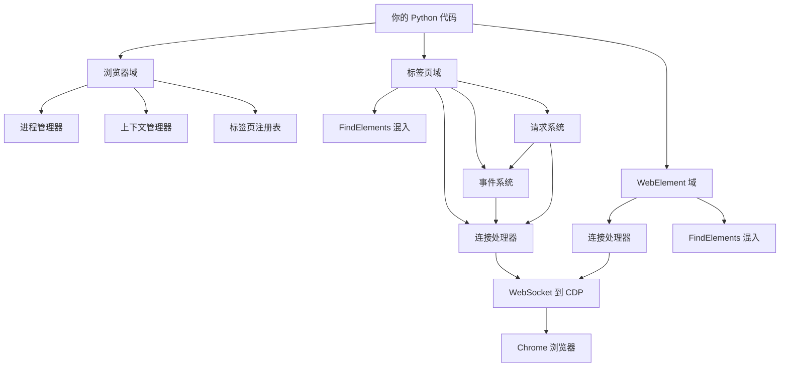

# 内部架构

**理解设计，然后有意识地打破规则。**

大多数文档向你展示框架**做什么**。本节揭示 Pydoll **如何**以及**为什么**以这种方式构建：塑造每一行代码的设计模式、架构决策和权衡。

## 为什么架构很重要

你可以在不理解其内部架构的情况下有效地使用 Pydoll。但当你需要：

- **调试**跨多个组件的复杂问题
- **优化**大规模自动化中的性能瓶颈
- **扩展** Pydoll 的自定义功能
- **贡献**对代码库的改进
- **构建**针对不同用例的类似工具

...架构知识变得**不可或缺**。

!!! quote "架构即语言"
    **"建筑是凝固的音乐。"** - 约翰·沃尔夫冈·冯·歌德
    
    良好的架构不仅仅是让代码工作，更是让代码**可理解**、**可维护**和**可扩展**。理解 Pydoll 的架构将教会你适用于每个项目的模式。

## 六大架构域

Pydoll 的架构组织为**六个内聚域**，每个域都有明确的职责和接口：

### 1. 浏览器域
**[→ 探索浏览器架构](./browser-domain.md)**

**协调者：管理进程、上下文和全局状态。**

浏览器域位于层次结构的顶部，协调：

- **进程管理**：启动/终止浏览器可执行文件
- **浏览器上下文**：隔离环境（如隐私窗口）
- **标签页注册表**：Tab 实例的单例模式
- **代理认证**：通过 Fetch 域自动认证
- **全局操作**：下载、权限、窗口管理

**关键架构模式**：

- **抽象基类**，适用于 Chrome/Edge/其他 Chromium 浏览器
- **管理器模式**（ProcessManager、ProxyManager、TempDirManager）
- **单例注册表**用于 Tab 实例（防止重复）
- **上下文管理器协议**用于自动清理

**关键洞察**：浏览器不直接操作页面，它**协调**低级组件。这种关注点分离使多浏览器支持和并发标签操作成为可能。

---

### 2. 标签页域
**[→ 探索标签页架构](./tab-domain.md)**

**主力军：执行命令、管理状态、协调自动化。**

标签页域是 Pydoll 的主要接口，处理：

- **导航**：具有可配置等待状态的页面加载
- **元素查找**：委托给 FindElementsMixin
- **JavaScript 执行**：页面和元素上下文
- **事件协调**：特定于标签页的事件监听器
- **网络监控**：请求/响应捕获和分析
- **IFrame 处理**：嵌套上下文管理

**关键架构模式**：

- **外观模式**：简化的 CDP 复杂操作接口
- **混入组合**：FindElementsMixin 用于元素定位
- **每标签页 WebSocket**：并行的独立连接
- **状态标志**：跟踪启用的域（network_events_enabled 等）
- **延迟初始化**：首次访问时创建请求对象

**关键洞察**：每个 Tab 拥有自己的 **ConnectionHandler**，实现跨标签的真正并行操作，无需竞争或状态泄漏。

---

### 3. WebElement 域
**[→ 探索 WebElement 架构](./webelement-domain.md)**

**交互器：连接 Python 代码和 DOM 元素。**

WebElement 域表示**单个 DOM 元素**，提供：

- **交互方法**：点击、输入、滚动、选择
- **属性访问**：文本、HTML、边界、属性
- **状态查询**：可见性、启用状态、值
- **截图**：特定于元素的图像捕获
- **子元素查找**：相对元素定位（也通过 FindElementsMixin）

**关键架构模式**：

- **代理模式**：表示远程浏览器元素的 Python 对象
- **对象 ID 抽象**：CDP 的 objectId 隐藏在 Python API 后面
- **混合属性**：同步（属性）vs 异步（动态状态）
- **命令模式**：交互方法包装 CDP 命令
- **回退策略**：多种方法提高鲁棒性

**关键洞察**：WebElement 维护**缓存的属性**（从创建时）和**动态状态**（按需获取），平衡性能与新鲜度。

---

### 4. FindElements 混入
**[→ 探索 FindElements 架构](./find-elements-mixin.md)**

**定位器：将选择器转换为 DOM 查询。**

FindElementsMixin 通过**组合**而非继承为 Tab 和 WebElement 提供元素查找功能：

- **基于属性的查找**：`find(id='submit', class_name='btn')`
- **基于表达式的查询**：`query('div.container > p')`
- **策略解析**：针对单个或多个属性的最优选择器
- **等待机制**：具有可配置超时的轮询
- **上下文检测**：文档 vs 元素相对搜索

**关键架构模式**：
- **混入模式**：无需继承层次结构的共享功能
- **策略模式**：基于输入的不同选择器策略
- **模板方法**：通用流程，特定于策略的实现
- **工厂函数**：延迟导入以避免循环依赖
- **重载模式**：类型安全的返回类型（WebElement vs list）

**关键洞察**：混入使用**鸭子类型**（`hasattr(self, '_object_id')`）来检测 Tab vs WebElement，实现代码重用而不紧密耦合。

---

### 5. 事件架构
**[→ 探索事件架构](./event-architecture.md)**

**调度器：将浏览器事件路由到 Python 回调。**

事件架构通过以下方式实现响应式自动化：

- **事件注册**：`on()` 方法订阅 CDP 事件
- **回调调度**：异步执行不阻塞
- **域管理**：显式启用/禁用以提高性能
- **临时回调**：首次调用后自动删除
- **多级作用域**：浏览器范围 vs 标签页特定事件

**关键架构模式**：

- **观察者模式**：订阅/通知事件驱动代码
- **注册表模式**：事件名称 → 回调列表映射
- **包装器模式**：自动包装同步回调以进行异步执行
- **清理协议**：标签页关闭时自动删除回调
- **作用域隔离**：每个标签页独立的事件上下文

**关键洞察**：事件是**推送式**的（浏览器通知 Python），而非轮询式，实现低延迟响应式自动化，无需忙等待。

---

### 6. 浏览器请求架构
**[→ 探索请求架构](./browser-requests-architecture.md)**

**混合体：具有浏览器会话状态的 HTTP 请求。**

浏览器请求系统连接 HTTP 和浏览器自动化：

- **会话连续性**：自动包含 Cookie 和认证
- **双重数据源**：JavaScript Fetch API + CDP 网络事件
- **完整元数据**：标头、Cookie、时间（并非所有通过 JavaScript 可用）
- **类 `requests` API**：具有浏览器能力的熟悉接口

**关键架构模式**：

- **混合执行**：JavaScript 获取主体，CDP 获取元数据
- **临时事件注册**：启用/捕获/禁用模式
- **延迟属性初始化**：首次使用时创建请求对象
- **适配器模式**：与浏览器 fetch 兼容的 Requests 接口

**关键洞察**：浏览器请求结合**两个信息源**（JavaScript 和 CDP 事件）。JavaScript 提供响应主体，CDP 提供 JavaScript 安全策略隐藏的标头和 Cookie。

---

## 架构原则

这六个域遵循一致的原则：

### 1. 关注点分离
每个域都有一个**单一、明确定义的职责**：

- Browser → 进程/上下文管理
- Tab → 命令执行和状态
- WebElement → 元素交互
- FindElements → 元素定位
- Events → 响应式调度
- Requests → 浏览器上下文中的 HTTP

**优势**：一个域的更改很少需要更改其他域。

### 2. 组合优于继承
Pydoll 使用以下方式而非深层继承层次结构：

- **混入**（Tab 和 WebElement 共享 FindElementsMixin）
- **管理器**（ProcessManager、ProxyManager、TempDirManager）
- **依赖注入**（ConnectionHandler 传递给组件）

**优势**：灵活的组件重用而不紧密耦合。

### 3. 默认异步
所有 I/O 操作都是 `async def` 并且必须 `await`：

- WebSocket 通信
- CDP 命令执行
- 事件回调调度
- 网络请求

**优势**：实现多个标签页的真正并发、并行操作和非阻塞 I/O。

### 4. 类型安全
每个公共 API 都有类型注解：

- 函数参数和返回类型
- 作为 `TypedDict` 的 CDP 响应
- 回调参数的事件类型
- 多态方法的重载

**优势**：IDE 自动完成、静态类型检查、自文档化代码。

### 5. 资源管理
上下文管理器确保清理：

- `async with Browser()` → 退出时关闭浏览器
- `async with tab.expect_file_chooser()` → 禁用拦截器
- `async with tab.expect_download()` → 清理临时文件

**优势**：自动资源清理，即使在异常情况下也能防止泄漏。

## 组件交互

理解域如何交互是关键：

**关键交互**：

1. **Browser 创建 Tabs** → Tabs 存储在注册表中
2. **Tab 和 WebElement 都使用 FindElementsMixin** → 共享元素定位
3. **每个 Tab 拥有一个 ConnectionHandler** → 独立的 WebSocket 连接
4. **请求系统使用事件系统** → 网络事件捕获元数据
5. **所有组件都使用 ConnectionHandler** → 集中式 CDP 通信

## 先决条件

要充分受益于本节：

- **[核心基础](../fundamentals/cdp.md)** - 理解 CDP、异步和类型
- **Python 设计模式** - 熟悉常见模式
- **OOP 概念** - 类、继承、组合、接口
- **异步 Python** - 熟悉 `async def` 和 `await`  

**如果你还没有阅读基础知识**，请先从那里开始。架构建立在这些概念之上。

## 超越架构

掌握内部架构后，你将准备好：

- **贡献代码**：了解新功能的适配位置
- **性能优化**：识别瓶颈和低效率
- **自定义扩展**：基于 Pydoll 的模式构建
- **类似工具**：将这些模式应用于其他项目

## 设计哲学

良好的架构是**不可见的**，它不应该妨碍你。Pydoll 的架构优先考虑：

1. **简单性**：每个组件做好一件事
2. **一致性**：类似的操作有类似的模式
3. **明确性**：没有魔法，没有隐藏行为
4. **类型安全**：在设计时而非运行时捕获错误
5. **性能**：默认异步，无锁并行

这些不是任意选择，它们是几十年软件工程**经过实战检验的原则**。

---

## 准备好理解设计了吗？

从**[浏览器域](./browser-domain.md)**开始，了解进程管理和上下文隔离如何工作，然后按顺序浏览各个域。

**这是从使用到精通的转变。**

---

!!! success "完成架构学习后"
    一旦你理解了这些模式，你会在软件工程的各个地方看到它们，而不仅仅是 Pydoll。这些是应用于浏览器自动化的**通用模式**：
    
    - 外观模式（Tab 简化 CDP 复杂性）
    - 观察者模式（用于响应式代码的事件系统）
    - 混入模式（FindElementsMixin 用于代码重用）
    - 注册表模式（Browser 跟踪 Tab 实例）
    - 策略模式（FindElements 解析最优选择器）
    
    良好的架构是**永恒的知识**。
