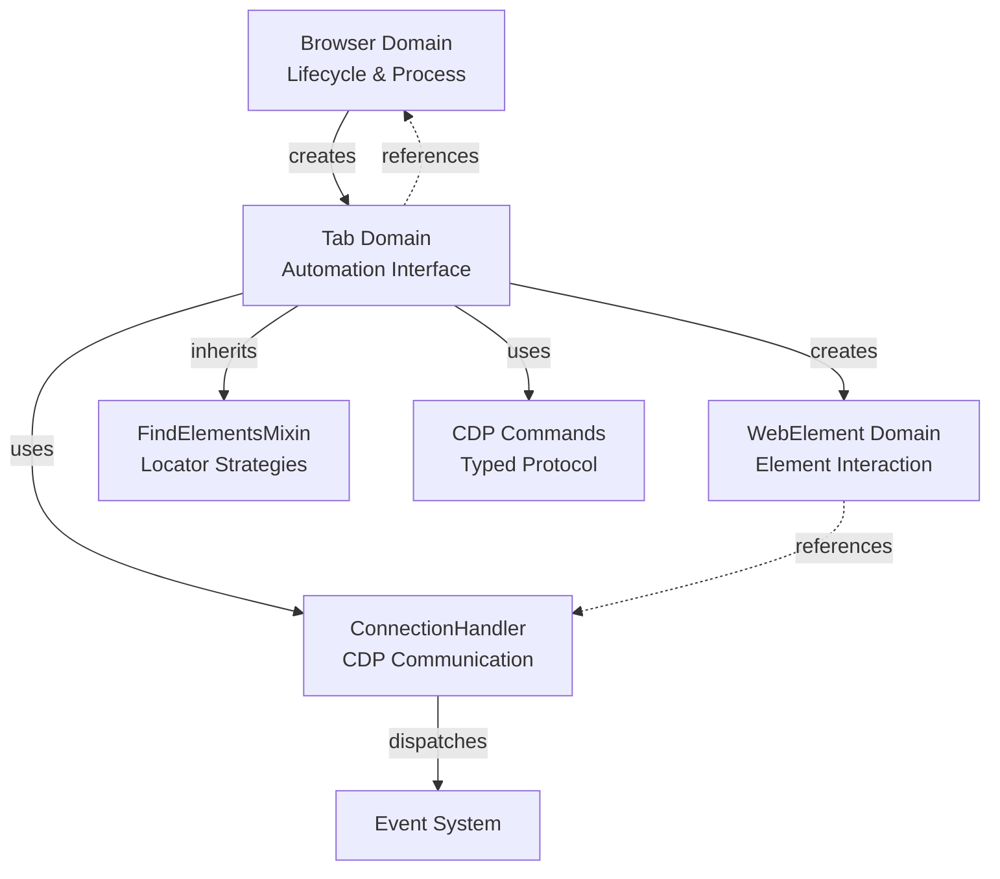

# Tab 域架构

Tab 域是 Pydoll 浏览器自动化的主要接口，充当编排层，将多个 CDP 域集成到一个内聚的 API 中。本文档探讨其内部架构、设计模式以及塑造其行为的工程决策。

!!! info "实际用法"
    有关使用示例和实际模式，请参阅 [Tab 管理指南](../features/automation/tabs.md)。

## 架构概述

`Tab` 类充当 Chrome DevTools Protocol 的**外观**，将多域协调的复杂性抽象为统一的接口。

### 组件结构

| 组件 | 关系 | 目的 |
|-----------|-------------|---------|
| **Tab** | 核心类 | 主要自动化接口 |
| ↳ **ConnectionHandler** | 组合（拥有） | 与 CDP 的 WebSocket 通信 |
| ↳ **Browser** | 引用（父级） | 访问浏览器级别的状态和配置 |
| ↳ **FindElementsMixin** | 继承 | 元素定位能力 |
| ↳ **WebElement** | 工厂（创建） | 单个 DOM 元素表示 |

### CDP 域集成

`ConnectionHandler` 将 Tab 操作路由到多个 CDP 域：

```
Tab 方法                CDP 域            目的
━━━━━━━━━━━━━━━━━━━━━━━━━━━━━━━━━━━━━━━━━━━━━━━━━━━━━━━━━━━━━━━
go_to(), refresh()     →   Page            →  导航和生命周期
execute_script()       →   Runtime         →  JavaScript 执行
find(), query()        →   Runtime/DOM     →  元素定位
get_cookies()          →   Storage         →  会话状态
enable_network_events()→   Network         →  流量监控
enable_fetch_events()  →   Fetch           →  请求拦截
```

### 核心职责

1. **CDP 命令路由**：将高级操作转换为特定域的 CDP 命令
2. **状态管理**：跟踪启用的域、活动回调和会话状态
3. **事件协调**：将 CDP 事件桥接到用户定义的回调
4. **元素工厂**：从 CDP `objectId` 字符串创建 `WebElement` 实例
5. **生命周期管理**：处理清理和资源释放

## 组合与继承：FindElementsMixin

Tab 域中的一个关键架构决策是**从 `FindElementsMixin` 继承**而不是使用组合：

```python
class Tab(FindElementsMixin):
    def __init__(self, ...):
        self._connection_handler = ConnectionHandler(...)
        # Mixin 方法现在在 Tab 上可用
```

**为什么这里使用继承？**

| 方法 | 优点 | 缺点 | Pydoll 的选择 |
|----------|------|------|-----------------|
| **继承** | 简洁的 API（`tab.find()`）、类型兼容性 | 紧密耦合 | 使用 |
| 组合 | 松散耦合、灵活 | 冗长（`tab.finder.find()`）、包装器开销 | 未使用 |

**理由：** mixin 模式是合理的，因为：

- 元素查找是 **Tab 身份的核心**（每个标签页都可以查找元素）
- mixin 是**无状态的** - 它只需要 `_connection_handler`（通过鸭子类型的依赖注入）
- API 人体工程学很重要 - `tab.find()` 比 `tab.elements.find()` 更直观

详见 [FindElements Mixin 深入探讨](./find-elements-mixin.md) 的架构细节。

## 状态管理架构

Tab 类管理**多层状态**：

###  1. 域启用标志

```python
class Tab:
    def __init__(self, ...):
        self._page_events_enabled = False
        self._network_events_enabled = False
        self._fetch_events_enabled = False
        self._dom_events_enabled = False
        self._runtime_events_enabled = False
        self._intercept_file_chooser_dialog_enabled = False
```

**为什么使用显式标志？**

- **幂等性**：两次调用 `enable_page_events()` 不会重复注册
- **状态检查**：`tab.page_events_enabled` 等属性公开当前状态
- **清理跟踪**：知道在标签页关闭时需要禁用哪些域

**替代方案（未使用）：** 每次检查时查询 CDP 以获取启用的域 → 太慢，增加延迟。

### 2. 目标标识

```python
self._target_id: str              # 唯一的 CDP 标识符
self._browser_context_id: Optional[str]  # 隔离上下文
self._connection_port: int        # WebSocket 端口
```

**设计决策：** `target_id` 是**主要标识符**，而不是 Tab 实例本身。这使得：

- **浏览器级别的 Tab 注册表**：`Browser._tabs_opened[target_id] = tab`
- **单例模式**：相同的 `target_id` 始终返回相同的 `Tab` 实例
- **连接重用**：同一标签页上的多个操作共享 WebSocket

### 3. 特定功能状态

```python
self._cloudflare_captcha_callback_id: Optional[int] = None  # 用于清理
self._request: Optional[Request] = None  # 延迟初始化
```

**延迟初始化模式：** `Request` 仅在访问 `tab.request` 时创建：

```python
@property
def request(self) -> Request:
    if self._request is None:
        self._request = Request(self)
    return self._request
```

**为什么延迟？** 大多数自动化不使用浏览器上下文 HTTP 请求。节省内存和初始化时间。


## JavaScript 执行：双上下文架构

`execute_script()` 方法实现**上下文多态性** - 相同的接口，不同的 CDP 命令：

| 上下文 | CDP 方法 | 用例 |
|---------|-----------|----------|
| 全局（无元素） | `Runtime.evaluate` | `document.title`、全局脚本 |
| 元素绑定 | `Runtime.callFunctionOn` | 元素特定操作 |

**关键架构决策：** 基于 `element` 参数的存在自动检测执行模式，消除了单独的 API（`evaluate()` 与 `call_function_on()`）。

**脚本转换管道：**

1. 替换 `argument` → `this`（Selenium 兼容性）
2. 检测脚本是否已包装在 `function() { }` 中
3. 如果需要则包装：`script` → `function() { script }`
4. 路由到适当的 CDP 命令

**为什么使用 `argument` 关键字？** 为 Selenium 用户提供迁移路径，API 熟悉度。

!!! info "实际用法"
    有关真实世界的脚本执行模式，请参阅[类人交互](../features/automation/human-interactions.md)。

## 事件系统集成

Tab 充当 ConnectionHandler 事件系统的**薄包装器**，但添加了重要的一层：**非阻塞回调执行**。

```python
async def on(self, event_name: str, callback: Callable, temporary: bool = False) -> int:
    # 包装异步回调以在后台执行
    async def callback_wrapper(event):
        asyncio.create_task(callback(event))
    
    if asyncio.iscoroutinefunction(callback):
        function_to_register = callback_wrapper  # 非阻塞包装器
    else:
        function_to_register = callback  # 同步回调直接执行
    
    # 将注册委托给 ConnectionHandler
    return await self._connection_handler.register_callback(
        event_name, function_to_register, temporary
    )
```

**架构角色：** Tab 提供具有非阻塞执行语义的标签页作用域事件注册，而 ConnectionHandler 处理 WebSocket 管道和顺序回调调用。

**关键特性：**

- 通过 `asyncio.create_task()` 为异步回调提供**后台执行**（即发即忘）
- **同步/异步回调自动检测**
- **临时回调**用于一次性处理程序
- **回调 ID** 用于显式删除

**执行模型：**

| 层 | 行为 | 目的 |
|-------|----------|---------|
| **用户回调** | 在后台任务中运行 | 永远不会阻塞其他回调或 CDP 命令 |
| **Tab 包装器** | `create_task(callback())` | 启动后台任务，立即返回 |
| **EventsManager** | `await wrapper()` | 按顺序调用同一事件的包装器 |

**为什么需要包装器？** 没有它，一个慢速异步回调会阻塞同一事件的其他回调。`create_task` 包装器确保所有回调"同时"启动（在单独的任务中），防止一个慢速回调延迟其他回调。

!!! info "详细架构"
    有关内部事件路由机制和 EventsManager 的顺序调用模式，请参阅[事件架构深入探讨](./event-architecture.md)。
    
    **实际用法：** [事件系统指南](../features/advanced/event-system.md)

## 会话状态：Cookie 管理

**架构分离：** Cookie 路由到 **Storage 域**（操作），而不是 Network 域（观察）。

```python
async def set_cookies(self, cookies: list[CookieParam]):
    return await self._execute_command(
        StorageCommands.set_cookies(cookies, self._browser_context_id)
    )
```

**上下文感知设计：** `browser_context_id` 参数确保 cookie 隔离，实现多账户自动化。

!!! info "实际 Cookie 管理"
    有关使用模式和反检测策略，请参阅 [Cookie 与会话指南](../features/browser-management/cookies-sessions.md)。

## 内容捕获：CDP 目标限制

**关键限制：** `Page.captureScreenshot` 仅适用于**顶级目标**。Iframe 标签页静默失败（响应中没有 `data` 字段）。

```python
try:
    screenshot_data = response['result']['data']
except KeyError:
    raise TopLevelTargetRequired(...)  # 引导用户使用 WebElement.take_screenshot()
```

**设计影响：** 旧版本会为 iframe 创建独立的 Tab。现在 iframe 直接作为 `WebElement` 处理，因此需要在框内元素上执行操作，例如 `await iframe_element.find(...).take_screenshot()`。

**PDF 生成：** `Page.printToPDF` 返回 base64 编码的数据。Pydoll 抽象文件 I/O，但底层数据始终是 base64（CDP 规范）。

!!! info "实际用法"
    有关参数、格式和真实世界示例，请参阅[屏幕截图和 PDF 指南](../features/automation/screenshots-and-pdfs.md)。

## 网络监控：有状态设计

**架构原则：** 网络方法需要**启用状态** - 运行时检查防止访问不存在的数据。

**存储分离：**

- **日志**：在 `ConnectionHandler` 中缓冲（接收所有 CDP 事件）
- **Tab**：查询处理程序，无重复存储
- **响应正文**：通过 `Network.getResponseBody(requestId)` 按需检索

**关键时序约束：** 响应正文必须在响应后**约 30 秒内**获取（浏览器垃圾回收）。

!!! info "实际网络监控"
    有关全面的事件跟踪和分析模式，请参阅[网络监控指南](../features/network/monitoring.md)。
    
    **请求拦截：** [请求拦截指南](../features/network/interception.md)

## 对话框管理：事件捕获模式

**关键 CDP 行为：** JavaScript 对话框**阻塞所有 CDP 命令**直到处理。

**架构解决方案：** `ConnectionHandler` 立即捕获 `Page.javascriptDialogOpening` 事件，防止自动化挂起。

```python
# 处理程序在用户代码运行之前存储对话框事件
self._connection_handler.dialog  # 由处理程序捕获
# Tab 查询存储的事件
async def has_dialog(self) -> bool:
    return bool(self._connection_handler.dialog)
```

**为什么选择这种设计？** 事件在用户回调执行之前触发。没有立即捕获，自动化将死锁等待被阻塞的 CDP 响应。

## IFrame 架构：Tab 重用模式

**关键洞察：** IFrame 是 **CDP 的一等目标** → 表示为 `Tab` 实例。

**目标解析算法：**

1. 从 iframe 元素提取 `src` 属性
2. 通过 `Target.getTargets()` 查询所有 CDP 目标
3. 将 iframe URL 匹配到目标 `targetId`
4. 检查单例注册表（`Browser._tabs_opened`）
5. 返回现有实例或创建 + 注册新 Tab

**设计权衡：** IFrame 标签页继承所有 Tab 方法，但有些会失败（例如 `take_screenshot()`）。替代方案（专用的 `IFrame` 类）将为最小的好处复制 90% 的 API。

!!! info "使用 IFrame"
    有关实际模式、嵌套框架和常见陷阱，请参阅 [IFrame 交互指南](../features/automation/iframes.md)。

## 上下文管理器：自动资源清理

**架构模式：** 状态恢复 + 乐观资源获取。

### 关键上下文管理器

| 管理器 | 模式 | 关键特性 |
|---------|---------|-------------|
| `expect_file_chooser()` | 状态恢复 | 退出后恢复域启用 |
| `expect_download()` | 临时资源 | 自动清理临时目录 |

**文件选择器设计：**

- 启用所需的域（`Page`、文件选择器拦截）
- 注册**临时回调**（首次触发后自动删除）
- 退出时恢复原始状态（如果之前禁用了域，则再次禁用）

**下载处理设计：**

- 创建临时目录（或使用提供的路径）
- 使用 `asyncio.Future` 进行协调（`will_begin_future`、`done_future`）
- 浏览器级别配置（下载是每个上下文的，而不是每个标签页的）
- 通过 `finally` 块保证清理

!!! info "实际文件操作"
    有关上传模式、文件选择器使用和下载处理，请参阅[文件操作指南](../features/automation/file-operations.md)。

## 生命周期：Tab 关闭和失效

**Tab 关闭级联：**

1. CDP 关闭浏览器标签页（`Page.close`）
2. Tab 从 `Browser._tabs_opened` 注销
3. WebSocket 自动关闭（CDP 目标已销毁）
4. 事件回调被垃圾回收

**关闭后行为：** Tab 实例变为**无效** - 进一步的操作失败（WebSocket 已关闭）。

**设计决策：** 没有显式的 `_closed` 标志。用户管理生命周期。替代方案（状态跟踪）为边际安全好处增加了开销。

## 关键架构决策

### 每个 Tab 的 WebSocket 策略

**选择的设计：** 每个 Tab 创建自己的 ConnectionHandler，具有到 `ws://localhost:port/devtools/page/{targetId}` 的专用 WebSocket 连接。

**理由：**

CDP 支持**两种连接模型**：

1. **浏览器级别**：到 `ws://localhost:port/devtools/browser/...` 的单个连接（由 Browser 实例使用）
2. **Tab 级别**：到 `ws://localhost:port/devtools/page/{targetId}` 的每个标签页连接（由 Tab 实例使用）

Pydoll 使用**两者**：

- **Browser** 有自己的 ConnectionHandler，用于浏览器范围的操作（上下文、下载、浏览器级别事件）
- **每个 Tab** 有自己的 ConnectionHandler，用于标签页特定的操作（导航、元素查找、标签页事件）

**每个标签页 WebSocket 的好处：**

- **真正的并行性**：多个标签页可以同时执行 CDP 命令而无需等待
- **独立的事件流**：每个标签页仅接收自己的事件（无需过滤）
- **隔离的故障**：一个标签页中的连接问题不会影响其他标签页
- **简化路由**：无需按 targetId 解复用消息

**权衡：** 更多打开的连接（每个标签页一个），但 CDP 和浏览器可以有效地处理这一点。对于 10 个标签页，这总共是 11 个连接（1 个浏览器 + 10 个标签页），与标签页本身创建的 HTTP 连接相比可以忽略不计。

!!! info "浏览器与 Tab 通信"
    有关浏览器级别 ConnectionHandler 以及 Browser/Tab 协调如何工作的详细信息，请参阅 [Browser 域架构](./browser-domain.md)。

### 浏览器引用的必要性

**为什么 Tab 存储 `_browser` 引用：**
- 上下文查询（cookie 的 `browser_context_id`）
- 浏览器级别操作（下载行为、iframe 注册表）
- 配置访问（`browser.options.page_load_state`）

### API 设计选择

| 选择 | 理由 |
|--------|-----------|
| **异步属性**（`current_url`、`page_source`） | 信号实时数据 + CDP 成本 |
| **单独的 `enable`/`disable` 方法** | 显式优于隐式，匹配 CDP 命名 |
| **无 `_closed` 标志** | 用户管理生命周期，减少开销 |
| **脚本中的 `argument` 关键字** | Selenium 兼容性，迁移路径 |

## 与其他域的关系

Tab 域位于 Pydoll 架构的**中心**：



**关键关系：**

1. **Browser → Tab**：父子关系。Browser 管理 Tab 生命周期和共享状态。
2. **Tab → ConnectionHandler**：组合。Tab 委托 CDP 通信。
3. **Tab → WebElement**：工厂。Tab 从 `objectId` 字符串创建元素。
4. **Tab ← FindElementsMixin**：继承。Tab 获得元素定位方法。
5. **Tab ↔ Browser**：双向引用。Tab 查询浏览器以获取上下文信息。

## 总结：设计理念

Tab 域优先考虑 **API 人体工程学**和**正确性**而不是微优化：

- **外观模式**抽象 CDP 复杂性
- 通过显式标志进行**状态管理**，防止双重启用
- 通过上下文管理器进行**资源管理**
- 具有后台执行（非阻塞）的**事件协调**

**核心权衡：**

| 决策 | 好处 | 成本 | 判定 |
|----------|---------|------|---------|
| 每个标签页的 WebSocket | 真正的并行性 | 更多连接 | 合理 |
| 继承 FindElementsMixin | 简洁的 API | 紧密耦合 | 合理 |
| 延迟 Request 初始化 | 内存效率 | 属性开销 | 合理 |

## 进一步阅读

**实用指南：**

- [Tab 管理](../features/automation/tabs.md) - 多标签页模式、生命周期、并发
- [元素查找](../features/element-finding.md) - 选择器和 DOM 遍历
- [事件系统](../features/advanced/event-system.md) - 实时浏览器监控

**架构深入探讨：**

- [事件架构](./event-architecture.md) - WebSocket 管道和事件路由
- [FindElements Mixin](./find-elements-mixin.md) - 选择器解析算法
- [Browser 域](./browser-domain.md) - 进程管理和上下文
