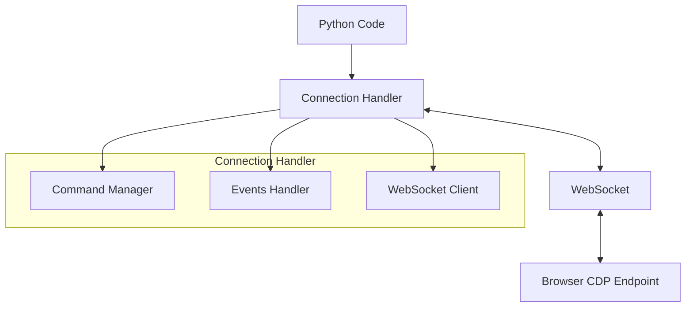
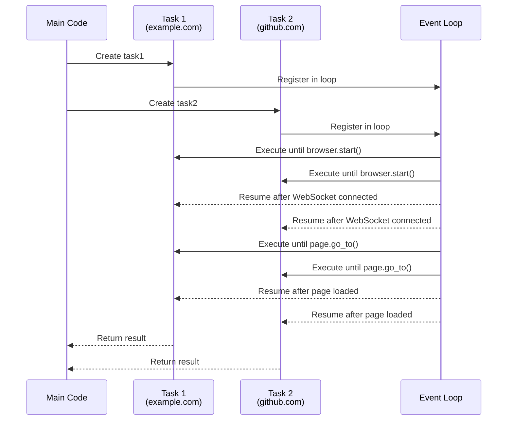
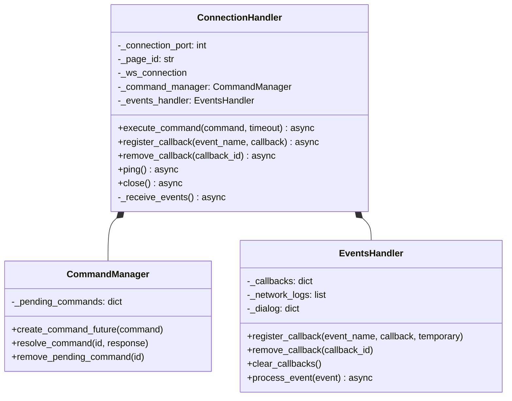
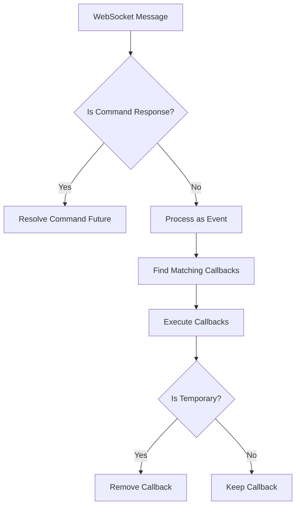
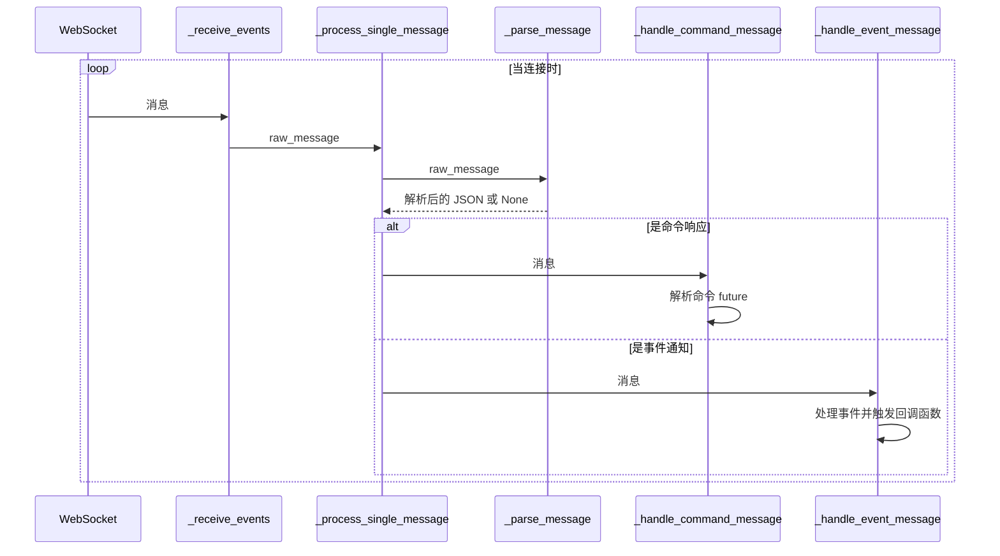

# 连接处理器

连接处理器是Pydoll架构的基础层，充当着您的Python代码与浏览器Chrome DevTools协议(CDP)之间的桥梁。该组件负责管理到浏览器的WebSocket连接，以非阻塞的异步方式处理命令执行和事件响应。



## 异步编程模型

Pydoll基于Python的`asyncio`框架构建，该框架支持非阻塞I/O操作。这一设计选择对实现高性能浏览器自动化至关重要，因为它允许多个操作并发执行，而无需等待每个操作完成。

### 理解异步/等待机制

要理解async/await在实际中的应用，让我们通过一个包含两个并发操作的详细示例来说明：

```python
import asyncio
from pydoll.browser.chrome import Chrome

async def fetch_page_data(url):
    print(f"Starting fetch for {url}")
    browser = Chrome()
    await browser.start()
    page = await browser.get_page()
    
    # Navigation takes time - this is where we yield control
    await page.go_to(url)
    
    # Get page title
    title = await page.execute_script("return document.title")
    
    # Extract some data
    description = await page.execute_script(
        "return document.querySelector('meta[name=\"description\"]')?.content || ''"
    )
    
    await browser.stop()
    print(f"Completed fetch for {url}")
    return {"url": url, "title": title, "description": description}

async def main():
    # Start two page operations concurrently
    task1 = asyncio.create_task(fetch_page_data("https://example.com"))
    task2 = asyncio.create_task(fetch_page_data("https://github.com"))
    
    # Wait for both to complete and get results
    result1 = await task1
    result2 = await task2
    
    return [result1, result2]

# Run the async function
results = asyncio.run(main())
```

此示例展示了如何并发地从两个不同网站获取数据，与顺序执行相比，可能将总执行时间几乎缩短一半。

#### 异步执行流程图

执行上述代码时，事件循环中会发生以下过程：



此序列图展示了Python的asyncio如何管理示例代码中的两个并发任务：

1. 主函数创建两个从不同网站获取数据的任务
2. 这两个任务被注册到事件循环中
3. 事件循环执行每个任务，直到遇到`await`语句(如`browser.start()`)
4. 当异步操作完成(如WebSocket连接建立)时，任务恢复执行
5. 循环在每个`await`点继续在任务间切换
6. 每个任务完成后，将结果返回给主函数

在`fetch_page_data`示例中，这允许两个浏览器实例并发工作——当一个实例等待页面加载时，另一个实例可以继续执行。这比顺序处理每个网站要高效得多，因为I/O等待时间不会阻塞其他任务的执行。

!!! info "协作式多任务"
    Asyncio使用协作式多任务处理，任务在`await`点自愿让出控制权。这与抢占式多任务处理(线程)不同，后者可以在任何时候中断任务。协作式多任务处理能为I/O密集型操作提供更好的性能，但需要谨慎编码以避免阻塞事件循环。

## 连接处理器实现

`ConnectionHandler`类旨在同时管理命令执行和事件处理，为CDP WebSocket连接提供稳健的接口。

### 类初始化

```python
def __init__(
    self,
    connection_port: int,
    page_id: str = 'browser',
    ws_address_resolver: Callable[[int], str] = get_browser_ws_address,
    ws_connector: Callable = websockets.connect,
):
    # Initialize components...
```

连接处理器接受以下参数：

| 参数 | 类型 | 描述 |
|-----------|------|-------------|
| `connection_port` | `int` | 浏览器CDP端点监听的端口号 |
| `page_id` | `str` | 特定页面/目标的标识符(使用'browser'表示浏览器级别连接) |
| `ws_address_resolver` | `Callable` | 从端口号解析WebSocket URL的函数 |
| `ws_connector` | `Callable` | 建立WebSocket连接的函数 |

### 内部组件

连接处理器协调三个主要组件：

1. **WebSocket连接**：管理与浏览器的实际WebSocket通信
2. **命令管理器**：处理命令发送和响应接收
3. **事件处理器**：处理来自浏览器的事件并触发相应的回调函数




## 命令执行流程

通过CDP执行命令时，ConnectionHandler遵循特定的处理模式：

1. 确保存在活跃的WebSocket连接
2. 创建Future对象来表示待处理的响应
3. 通过WebSocket发送命令
4. 等待Future对象被解析为响应结果
5. 将响应返回给调用方


```python
async def execute_command(self, command: dict, timeout: int = 10) -> dict:
    # Validate command
    if not isinstance(command, dict):
        logger.error('Command must be a dictionary.')
        raise exceptions.InvalidCommand('Command must be a dictionary')

    # Ensure connection is active
    await self._ensure_active_connection()
    
    # Create future for this command
    future = self._command_manager.create_command_future(command)
    command_str = json.dumps(command)

    # Send command and await response
    try:
        await self._ws_connection.send(command_str)
        response: str = await asyncio.wait_for(future, timeout)
        return json.loads(response)
    except asyncio.TimeoutError as exc:
        self._command_manager.remove_pending_command(command['id'])
        raise exc
    except websockets.ConnectionClosed as exc:
        await self._handle_connection_loss()
        raise exc
```

!!! warning "命令超时"
    如果命令在指定超时时间内未收到响应，将会抛出`TimeoutError`异常。这可以防止自动化脚本因未收到响应而无限挂起。默认超时时间为10秒，但可以根据复杂操作的预期响应时间进行调整。

## 事件处理系统

事件系统是Pydoll架构中的关键组件，支持响应式编程模式。该系统允许为特定浏览器事件注册回调函数，当事件发生时自动执行这些回调。

### 事件处理流程

事件处理流程遵循以下步骤：

1. `_receive_events`方法作为后台任务持续运行，不断从WebSocket接收消息
2. 每条消息会被解析并分类为命令响应或事件
3. 事件会被传递给EventsHandler进行处理
4. EventsHandler识别该事件已注册的回调函数并执行它们



### 回调函数注册

ConnectionHandler提供了一系列方法用于注册、移除和管理事件回调函数：

```python
# Register a callback for a specific event
callback_id = await connection.register_callback(
    'Page.loadEventFired', 
    handle_page_load
)

# Remove a specific callback
await connection.remove_callback(callback_id)

# Remove all callbacks
await connection.clear_callbacks()
```

!!! 提示 "临时回调函数"  
    您可以将回调函数注册为临时的，这意味着它将在被触发一次后自动移除。这对于一次性事件（如对话框处理）非常有用：

    ```python
    await connection.register_callback(
        'Page.javascriptDialogOpening',
        handle_dialog,
        temporary=True
    )
    ```

### 异步回调函数执行

回调函数既可以是同步函数，也可以是异步协程。ConnectionHandler 能够正确处理这两种类型。

```python
# 同步回调函数
def synchronous_callback(event):
    print(f"接收到事件: {event['method']}")

# 异步回调函数
async def asynchronous_callback(event):
    await asyncio.sleep(0.1)  # 执行一些异步操作
    print(f"异步处理事件: {event['method']}")

# 两者可以以相同方式注册
await connection.register_callback('Network.requestWillBeSent', synchronous_callback)
await connection.register_callback('Network.responseReceived', asynchronous_callback)
```

对于异步回调函数，ConnectionHandler 会将其包装在一个后台任务中运行，从而允许事件处理循环继续执行，而无需等待回调函数完成。

## 连接管理

ConnectionHandler 实现了多种策略以确保连接的健壮性：

### 延迟连接建立

连接仅在需要时建立，通常是在执行第一个命令或显式请求时。这种延迟初始化方式节省资源，并允许更灵活的连接管理。

### 自动重连

如果 WebSocket 连接意外断开或关闭，ConnectionHandler 会在执行下一个命令时尝试自动重新建立连接。这提供了对瞬态网络问题的弹性支持。

```python
async def _ensure_active_connection(self):
    """
    确保在继续之前存在一个活动连接。
    """
    if self._ws_connection is None or self._ws_connection.closed:
        await self._establish_new_connection()
```

### 资源清理

ConnectionHandler 实现了显式的清理方法以及 Python 的异步上下文管理器协议（`__aenter__` 和 `__aexit__`），确保在不再需要时正确释放资源：

```python
async def close(self):
    """
    关闭 WebSocket 连接并清除所有回调函数。
    """
    await self.clear_callbacks()
    if self._ws_connection is not None:
        try:
            await self._ws_connection.close()
        except websockets.ConnectionClosed as e:
            logger.info(f'WebSocket 连接已关闭: {e}')
        logger.info('WebSocket 连接已关闭。')
```

!!! 提示 "上下文管理器用法"  
    将 ConnectionHandler 用作上下文管理器是确保正确资源清理的推荐模式：

    ```python
    async with ConnectionHandler(9222, 'browser') as connection:
        # 使用连接...
        await connection.execute_command(...)
    # 退出上下文时连接自动关闭
    ```

## 消息处理管道

ConnectionHandler 实现了一个复杂的消息处理管道，用于处理来自 WebSocket 连接的持续消息流：



此管道确保高效处理命令响应和异步事件，使 Pydoll 即使在高消息量下也能保持响应性。

## 高级用法

ConnectionHandler 通常通过 Browser 和 Page 类间接使用，但在高级场景中也可以直接使用：

### 直接事件监控

对于特殊用例，您可能希望绕过高层 API，直接监控特定的 CDP 事件：

```python
from pydoll.connection.connection import ConnectionHandler

async def monitor_network():
    connection = ConnectionHandler(9222)
    
    async def log_request(event):
        url = event['params']['request']['url']
        print(f"请求: {url}")
    
    await connection.register_callback(
        'Network.requestWillBeSent', 
        log_request
    )
    
    # 通过 CDP 命令启用网络事件
    await connection.execute_command({
        "id": 1,
        "method": "Network.enable"
    })
    
    # 保持运行直到被中断
    try:
        while True:
            await asyncio.sleep(1)
    finally:
        await connection.close()
```

### 自定义命令执行

您可以直接执行任意 CDP 命令：

```python
async def custom_cdp_command(connection, method, params=None):
    command = {
        "id": random.randint(1, 10000),
        "method": method,
        "params": params or {}
    }
    return await connection.execute_command(command)

# 示例：不使用 Page 类获取文档 HTML
async def get_html(connection):
    result = await custom_cdp_command(
        connection,
        "Runtime.evaluate",
        {"expression": "document.documentElement.outerHTML"}
    )
    return result['result']['result']['value']
```

!!! 警告 "高级接口"  
    直接使用 ConnectionHandler 需要对 Chrome DevTools Protocol 有深入理解。对于大多数用例，更高层的 Browser 和 Page API 提供了更直观且更安全的接口。

## 高级并发模式

ConnectionHandler 的异步设计支持复杂的并发模式：

### 并行命令执行

并行执行多个命令并等待所有结果：

```python
async def get_page_metrics(connection):
    commands = [
        {"id": 1, "method": "Performance.getMetrics"},
        {"id": 2, "method": "Network.getResponseBody", "params": {"requestId": "..."}},
        {"id": 3, "method": "DOM.getDocument"}
    ]
    
    results = await asyncio.gather(
        *(connection.execute_command(cmd) for cmd in commands)
    )
    
    return results
```

## 结论

ConnectionHandler 是 Pydoll 架构的基础，提供了与 Chrome DevTools Protocol 之间健壮且高效的接口。通过利用 Python 的 asyncio 框架和 WebSocket 通信，它实现了高性能的浏览器自动化，并采用了优雅的事件驱动编程模式。

理解 ConnectionHandler 的设计与操作，可以深入洞察 Pydoll 的内部工作机制，并为特殊场景下的高级定制与优化提供机会。

对于大多数用例，您将通过更上层的 Browser 和 Page API 间接与 ConnectionHandler 交互，这些 API 提供了更直观的接口，同时充分利用了 ConnectionHandler 的强大功能。