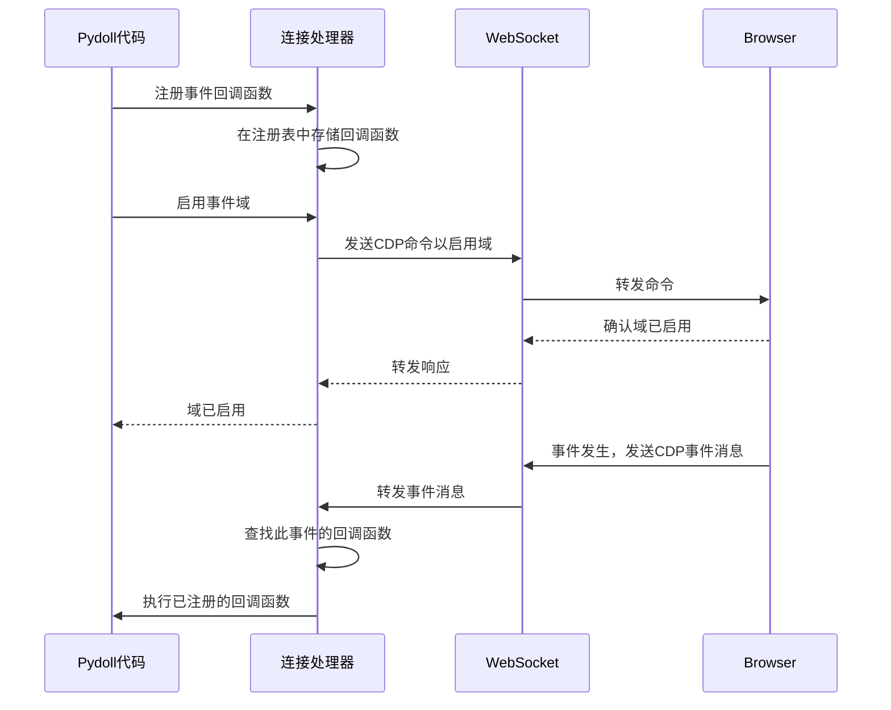
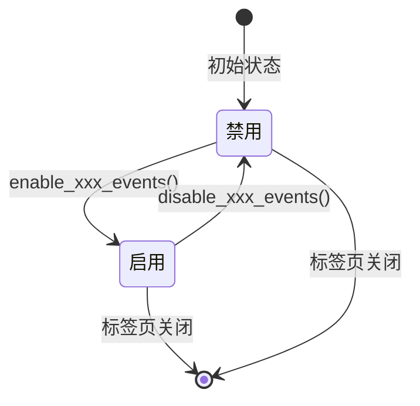
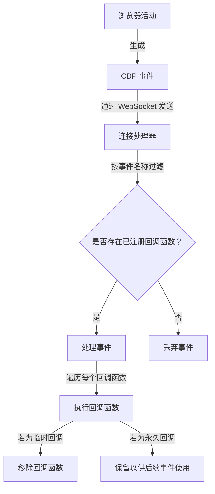
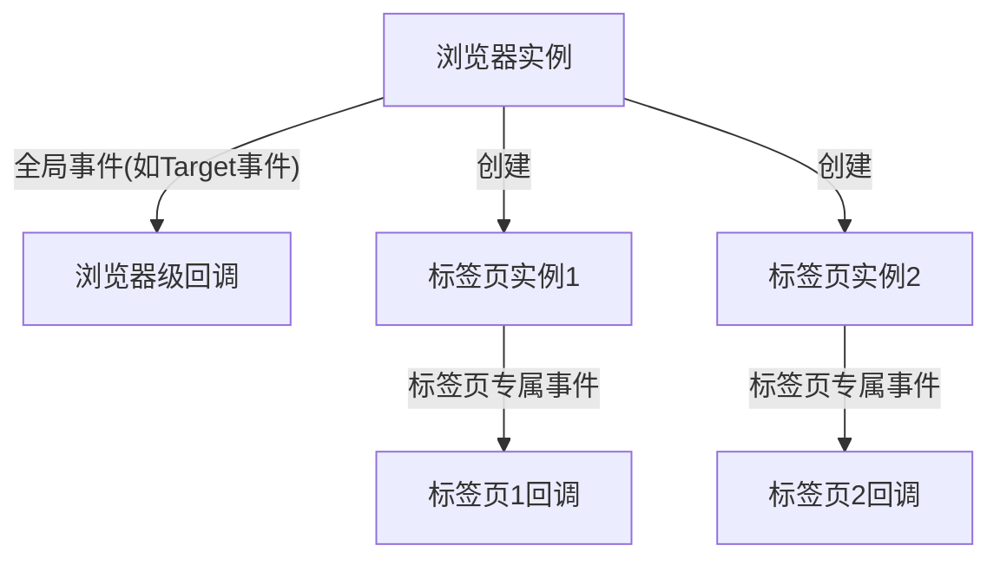

# 事件系统

事件系统是Pydoll架构的基础组件，提供实时响应浏览器活动的强大机制。这种异步通知系统使您的自动化代码能够在各种浏览器事件发生时做出反应，从而创建动态且响应灵敏的交互。

## WebSocket通信与CDP

Pydoll事件系统的核心是Chrome DevTools协议(CDP)，它通过WebSocket连接提供了一种结构化方式来与浏览器活动交互和监控。这种双向通信通道使您的代码能够向浏览器发送命令并接收返回的事件。



### WebSocket通信模型

Pydoll与浏览器之间的WebSocket连接遵循以下模式：

1. **连接建立**：当浏览器启动时，创建WebSocket服务器，Pydoll建立与之的连接
2. **双向消息传递**：Pydoll和浏览器可以随时发送消息
3. **消息类型**：
   - **命令**：从Pydoll发送到浏览器(例如导航、DOM操作)
   - **命令响应**：从浏览器发送到Pydoll以响应命令
   - **事件**：当发生某些事情时从浏览器发送到Pydoll(例如页面加载、网络活动)

### Chrome DevTools协议结构

CDP将其功能组织到各个域中，每个域负责浏览器功能的特定领域：

| 域 | 职责 | 典型事件 |
|----|------|----------|
| Page | 页面生命周期 | 加载事件、导航、对话框 |
| Network | 网络活动 | 请求/响应监控、WebSockets |
| DOM | 文档结构 | DOM变化、属性修改 |
| Fetch | 请求拦截 | 请求暂停、需要认证 |
| Runtime | JavaScript执行 | 控制台消息、异常 |
| Browser | 浏览器管理 | 窗口创建、标签页、上下文 |

每个域必须显式启用后才会发出事件，这有助于通过仅处理实际需要的事件来管理性能。

## 事件域与启用

Pydoll将事件组织到与CDP域相对应的逻辑域中。每个域必须显式启用后才会发出事件，这是通过特定的启用方法处理的。

```python
# 启用页面事件以监控页面加载、导航、对话框等
await tab.enable_page_events()

# 启用网络事件以监控请求、响应等
await tab.enable_network_events()

# 启用DOM事件以监控DOM变化
await tab.enable_dom_events()

# 启用Fetch事件以拦截和修改请求
await tab.enable_fetch_events()
```

!!! info "域所有权"
    事件根据其功能属于特定域。例如，页面加载事件属于Page域，而网络请求事件属于Network域。某些域仅在特定级别可用 - 例如，Page事件在Tab实例上可用，但不会直接在Browser级别上提供。

### 为何需要启用/禁用机制

显式的启用/禁用模式具有以下几个重要目的：

1. **性能优化**：仅启用您感兴趣的域，可减少事件处理的开销
2. **资源管理**：某些事件域(如网络或DOM监控)可能产生大量消耗内存的事件
3. **意图清晰**：显式启用使自动化代码的意图明确且自文档化
4. **受控清理**：显式禁用域可确保在不再需要事件时进行正确的清理



!!! 警告 "防止事件泄漏"
    当不再需要事件域时若未禁用它们，可能导致内存泄漏和性能下降，尤其是在长时间运行的自动化场景中。当您完成对事件域的使用后，特别是对于网络监控等高容量事件，务必禁用这些事件域。

### 域特定的启用方法

不同的域通过相应对象上的特定方法启用：

| 域 | 启用方法 | 禁用方法 | 可用对象 |
|----|----------|------------|----------|
| Page | `enable_page_events()` | `disable_page_events()` | Tab |
| Network | `enable_network_events()` | `disable_network_events()` | Tab |
| DOM | `enable_dom_events()` | `disable_dom_events()` | Tab |
| Fetch | `enable_fetch_events()` | `disable_fetch_events()` | Tab, Browser |
| 文件选择器 | `enable_intercept_file_chooser_dialog()` | `disable_intercept_file_chooser_dialog()` | Tab |

## 注册事件回调函数

订阅事件的核心方法是`on()`方法，该方法在Tab和Browser实例上均可用：

```python
async def on(
    self, event_name: str, callback: callable, temporary: bool = False
) -> int:
    """
    为标签页注册事件监听器。

    参数:
        event_name (str): 要监听的事件名称。
        callback (callable): 当事件触发时要执行的回调函数。
        temporary (bool): 如果为True，回调函数将在触发一次后被移除。默认为False。

    返回:
        int: 已注册回调函数的ID。
    """
```

此方法返回一个回调函数ID，可在需要时用于移除回调函数。

### 回调函数类型与参数

回调函数可以是同步函数或异步协程：

```python
# 同步回调函数示例
def handle_page_load(event):
    print(f"页面加载于: {time.time()}")

# 异步回调函数示例
async def handle_network_request(event):
    request_url = event['params']['request']['url']
    print(f"请求发送至: {request_url}")
    # 可在此执行异步操作
    await save_request_details(request_url)

# 注册回调函数
await tab.on('Page.loadEventFired', handle_page_load)
await tab.on('Network.requestWillBeSent', handle_network_request)
```

!!! 提示 "异步回调函数"
    使用异步回调函数提供更大的灵活性，允许您在回调函数内执行其他异步操作，例如发出额外的CDP命令或等待条件。

### 在回调函数中使用Partial传递标签页访问权限

一种强大的技术是使用`functools.partial`将标签页实例传递给您的回调函数，使回调函数能够与标签页交互：

```python
from functools import partial

# 定义需要访问标签页的回调函数
async def handle_navigation(tab, event):
    # 回调函数现在可以使用标签页对象
    print(f"导航发生至: {await tab.current_url}")
    
    # 直接访问标签页方法
    elements = await tab.find(tag_name="a")
    print(f"在新页面上找到 {len(elements)} 个链接")

# 使用partial注册以绑定标签页参数
await tab.enable_page_events()
await tab.on(PageEvent.FRAME_NAVIGATED, partial(handle_navigation, tab))
```

当出现以下情况时，此技术至关重要：
1. 您的回调函数需要与标签页交互(查找元素、执行脚本)
2. 您希望在事件之间保持状态
3. 您需要协调不同事件类型之间的操作

!!! 信息 "为何使用Partial?"
    事件系统仅将事件数据传递给回调函数。使用`partial`可让您预先配置带有额外参数(如标签页对象)的回调函数，而无需修改事件系统期望的回调函数签名。

### 临时回调函数  

若只需处理事件一次，可使用 `temporary` 标志：  

```python
# 此回调函数将在首次触发后自动移除  
await tab.on('Page.loadEventFired', handle_first_load, temporary=True)  
```  

此功能特别适用于：  
- 一次性初始化操作  
- 等待特定事件后再继续执行  
- 对事件的首次触发进行差异化处理  

## 事件流与生命周期  

理解事件流对高效事件处理至关重要：  



事件生命周期遵循以下步骤：  

1. 浏览器中发生某事件（页面加载、请求发送、DOM 变更等）  
2. 浏览器生成 CDP 事件消息  
3. 消息通过 WebSocket 发送到 Pydoll  
4. ConnectionHandler 接收事件  
5. ConnectionHandler 检查其注册表中是否存在匹配该事件名称的回调函数  
6. 若存在回调函数，则逐个使用事件数据执行  
7. 若回调函数被注册为临时回调，则在执行后将其移除

## 预定义事件常量  

Pydoll 在 `protocol` 包中提供了一整套预定义的事件常量，无需记忆具体的 CDP 事件字符串即可更方便地引用常见事件。

```python
from pydoll.protocol.page.events import PageEvent
from pydoll.protocol.network.events import NetworkEvent
from pydoll.protocol.dom.events import DomEvent
from pydoll.protocol.fetch.events import FetchEvent

# Using predefined events
await tab.on(PageEvent.LOAD_EVENT_FIRED, handle_page_load)
await tab.on(NetworkEvent.REQUEST_WILL_BE_SENT, handle_request)
await tab.on(DomEvent.DOCUMENT_UPDATED, handle_dom_update)
await tab.on(FetchEvent.REQUEST_PAUSED, handle_fetch_intercept)
```
!!! info "自定义 CDP 事件"  
    虽然 Pydoll 为常见事件提供了常量，但您也可以直接使用任何有效的 CDP 事件字符串。这对于没有预定义常量的不常见事件非常有用：  

    ```python
    # 直接使用 CDP 事件字符串  
    await tab.on('Security.certificateError', handle_cert_error)  
    ```  

### 常见事件类型  

以下是自动化和爬取任务中最常用的一些事件：  

#### 页面事件  

| 常量 | CDP 事件 | 描述 |  
|------|----------|------|  
| `PageEvent.LOAD_EVENT_FIRED` | `Page.loadEventFired` | 页面加载事件触发时触发 |  
| `PageEvent.DOM_CONTENT_EVENT_FIRED` | `Page.domContentEventFired` | DOM 内容加载完成时触发 |  
| `PageEvent.FILE_CHOOSER_OPENED` | `Page.fileChooserOpened` | 文件选择对话框显示时触发 |  
| `PageEvent.JAVASCRIPT_DIALOG_OPENING` | `Page.javascriptDialogOpening` | JavaScript 对话框显示时触发 |  
| `PageEvent.FRAME_NAVIGATED` | `Page.frameNavigated` | 框架导航到新 URL 时触发 |  

#### 网络事件  

| 常量 | CDP 事件 | 描述 |  
|------|----------|------|  
| `NetworkEvent.REQUEST_WILL_BE_SENT` | `Network.requestWillBeSent` | 请求即将发送时触发 |  
| `NetworkEvent.RESPONSE_RECEIVED` | `Network.responseReceived` | 收到 HTTP 响应时触发 |  
| `NetworkEvent.LOADING_FAILED` | `Network.loadingFailed` | 请求加载失败时触发 |  
| `NetworkEvent.LOADING_FINISHED` | `Network.loadingFinished` | 请求加载完成时触发 |  
| `NetworkEvent.WEB_SOCKET_FRAME_SENT` | `Network.webSocketFrameSent` | WebSocket 帧发送时触发 |  

#### DOM 事件  

| 常量 | CDP 事件 | 描述 |  
|------|----------|------|  
| `DomEvent.DOCUMENT_UPDATED` | `DOM.documentUpdated` | 文档更新时触发 |  
| `DomEvent.SET_CHILD_NODES` | `DOM.setChildNodes` | 子节点设置时触发 |  
| `DomEvent.ATTRIBUTE_MODIFIED` | `DOM.attributeModified` | 元素属性修改时触发 |  
| `DomEvent.ATTRIBUTE_REMOVED` | `DOM.attributeRemoved` | 元素属性移除时触发 |  

## 高级事件模式  

### 事件驱动爬取  

事件机制允许您创建能够实时响应页面变化的反应式爬虫：

```python
import asyncio
from functools import partial
from pydoll.browser.chromium import Chrome
from pydoll.constants import By
from pydoll.protocol.network.events import NetworkEvent
from pydoll.protocol.page.events import PageEvent

async def scrape_dynamic_content():
    async with Chrome() as browser:
        tab = await browser.start()
        
        # Create a data storage container
        scraped_data = []
        data_complete = asyncio.Event()
        
        # Set up a callback to extract data when AJAX responses are received
        async def extract_data_from_response(tab, event):
            if 'api/products' in event['params']['response']['url']:
                # Extract the response body
                request_id = event['params']['requestId']
                body = await tab.get_network_response_body(request_id)
                
                # Process the data
                products = json.loads(body)
                for product in products:
                    scraped_data.append({
                        'id': product['id'],
                        'name': product['name'],
                        'price': product['price']
                    })
                
                print(f"Extracted {len(products)} products")
                
                # If we've collected enough data, signal completion
                if len(scraped_data) >= 100:
                    data_complete.set()
        
        # Set up navigation monitoring
        async def handle_page_load(tab, event):
            print(f"Page loaded: {await tab.current_url}")
            
            # Now that the page is loaded, trigger the infinite scroll
            await tab.execute_script("""
                function scrollDown() {
                    window.scrollTo(0, document.body.scrollHeight);
                    setTimeout(scrollDown, 1000);
                }
                scrollDown();
            """)
        
        # Enable events and register callbacks
        await tab.enable_network_events()
        await tab.enable_page_events()
        await tab.on(NetworkEvent.RESPONSE_RECEIVED, partial(extract_data_from_response, tab))
        await tab.on(PageEvent.LOAD_EVENT_FIRED, partial(handle_page_load, tab))
        
        # Navigate to the page with dynamic content
        await tab.go_to("https://example.com/products")
        
        # Wait for data collection to complete or timeout after 60 seconds
        try:
            await asyncio.wait_for(data_complete.wait(), timeout=60)
        except asyncio.TimeoutError:
            print("Timeout reached, continuing with data collected so far")
        
        # Process the collected data
        print(f"Total products collected: {len(scraped_data)}")
        
        return scraped_data
```
### 基于事件的并行爬取  

事件与并发执行结合使用时能发挥最大效能。Pydoll 在同时管理多个标签页方面表现卓越，这是其实现高性能自动化的核心优势之一。  

#### 单浏览器多标签页方案  

更高效的实现方式是在单个浏览器实例中同时使用多个标签页：

```python
import asyncio
from functools import partial
import json
from pydoll.browser.chromium import Chrome
from pydoll.constants import By
from pydoll.protocol.network.events import NetworkEvent

async def multi_tab_scraping():
    # Create a single browser instance for all tabs
    async with Chrome() as browser:
        tab = await browser.start()
        
        # Categories to scrape
        categories = ['electronics', 'clothing', 'books', 'home']
        base_url = 'https://example.com/products'
        
        # Track results for each category
        results = {category: [] for category in categories}
        completion_events = {category: asyncio.Event() for category in categories}
        
        # Create a callback for processing category data
        async def process_category_data(tab, category, event):
            if f'api/{category}' in event['params'].get('response', {}).get('url', ''):
                request_id = event['params']['requestId']
                body, _ = await tab.get_network_response_body(request_id)
                data = json.loads(body)
                
                # Add results to the appropriate category
                results[category].extend(data['items'])
                print(f"Added {len(data['items'])} items to {category}, total: {len(results[category])}")
                
                # Signal completion if we have enough data
                if len(results[category]) >= 20 or data.get('isLastPage', False):
                    completion_events[category].set()
        
        # Prepare tabs, one for each category
        tabs = {}
        for category in categories:
            # Create a new tab
            new_tab = await browser.new_tab()
            tabs[category] = new_tab
            
            # Setup event monitoring for this tab
            await new_tab.enable_network_events()
            await new_tab.on(
                NetworkEvent.RESPONSE_RECEIVED,
                partial(process_category_data, new_tab, category)
            )
            
            # Start navigation (don't await here to allow parallel loading)
            asyncio.create_task(new_tab.go_to(f"{base_url}/{category}"))
        
        # Wait for all categories to complete or timeout
        try:
            await asyncio.wait_for(
                asyncio.gather(*(event.wait() for event in completion_events.values())),
                timeout=45
            )
        except asyncio.TimeoutError:
            print("Some categories timed out, proceeding with collected data")
        
        # Display results
        total_items = 0
        for category, items in results.items():
            count = len(items)
            total_items += count
            print(f"{category}: collected {count} items")
            
            # Show sample items
            for item in items[:2]:
                print(f"  - {item['name']}: ${item['price']}")
        
        print(f"Total items across all categories: {total_items}")
        
        return results

# Run the multi-tab scraper
asyncio.run(multi_tab_scraping())
```
#### 基于事件的动态标签页创建  

您甚至可以根据事件动态创建新标签页：

```python
import asyncio
from functools import partial
from pydoll.browser.chromium import Chrome
from pydoll.constants import By
from pydoll.protocol.page.events import PageEvent
from pydoll.protocol.network.events import NetworkEvent

async def dynamic_tab_creation():
    async with Chrome() as browser:
        main_tab = await browser.start()
        
        # Store results from all product pages
        all_results = []
        # Count active tabs to know when we're done
        active_tabs = 1  # Start with 1 (main tab)
        # Event that signals all work is complete
        all_done = asyncio.Event()
        
        # This callback processes category links and creates a new tab for each
        async def process_category_links(main_tab, event):
            # Check if this is the categories response
            if 'api/categories' not in event['params'].get('response', {}).get('url', ''):
                return
                
            # Extract categories from the response
            request_id = event['params']['requestId']
            body = await main_tab.get_network_response_body(request_id)
            categories = json.loads(body)
            
            print(f"Found {len(categories)} categories to process")
            nonlocal active_tabs
            active_tabs += len(categories)  # Update tab counter
            
            # Create a new tab for each category
            for category in categories:
                # Create a new tab
                new_tab = await browser.new_tab()
                
                # Setup a callback for this tab
                async def process_product_data(tab, category_name, event):
                    if 'api/products' not in event['params'].get('response', {}).get('url', ''):
                        return
                        
                    # Process the product data
                    request_id = event['params']['requestId']
                    body = await tab.get_network_response_body(request_id)
                    products = json.loads(body)
                    
                    # Add to results
                    nonlocal all_results
                    all_results.extend(products)
                    print(f"Added {len(products)} products from {category_name}")
                    
                    # Close this tab when done
                    nonlocal active_tabs
                    await tab.close()
                    active_tabs -= 1
                    
                    # If this was the last tab, signal completion
                    if active_tabs == 0:
                        all_done.set()
                
                # Enable network events on the new tab
                await new_tab.enable_network_events()
                await new_tab.on(
                    NetworkEvent.RESPONSE_RECEIVED,
                    partial(process_product_data, new_tab, category['name'])
                )
                
                # Navigate to the category page
                asyncio.create_task(new_tab.go_to(f"https://example.com/products/{category['id']}"))
        
        # Set up the main tab to find categories
        await main_tab.enable_network_events()
        await main_tab.on(
            NetworkEvent.RESPONSE_RECEIVED,
            partial(process_category_links, main_tab)
        )
        
        # Navigate to the main categories page
        await main_tab.go_to("https://example.com/categories")
        
        # Wait for all tabs to complete their work
        try:
            await asyncio.wait_for(all_done.wait(), timeout=60)
        except asyncio.TimeoutError:
            print("Timeout reached, continuing with data collected so far")
        
        # Process results
        print(f"Total products collected: {len(all_results)}")
        
        return all_results
```
### 多标签页自动化的核心优势  

在单个浏览器实例中使用多个标签页具有以下显著优势：  

1. **资源高效**：单个浏览器实例比多个独立浏览器消耗更少的系统资源  
2. **会话共享**：所有标签页共享相同的会话、Cookie 和缓存  
3. **启动时间短**：新建标签页比启动新浏览器实例快得多  
4. **动态工作流**：可根据其他标签页的发现结果动态创建新标签页  
5. **内存优化**：相比多浏览器实例具有更好的内存利用率  

!!! tip "标签页管理最佳实践"  
    - 记录所有标签页引用，避免出现"孤儿标签页"  
    - 大规模操作建议实现标签页池模式  
    - 及时关闭不再需要的标签页以释放资源  
    - 使用标签页ID进行标识和管理  
    - 建议添加超时机制防止标签页挂起  

这种多标签页方案特别适用于以下场景：  
- 基于分类的爬取（每个分类需要独立上下文）  
- 处理搜索结果（需要对每个结果进行详细探索）  
- 同时跟踪多个用户行为路径  
- 跨标签页负载均衡请求以避免速率限制  
- 在不同标签页维护不同用户会话  

### 与事件驱动操作的协同  

可通过事件机制协调响应浏览器行为的操作：

```python
async def wait_for_network_idle():
    network_idle = asyncio.Event()
    in_flight_requests = 0
    
    async def track_request(event):
        nonlocal in_flight_requests
        in_flight_requests += 1
    
    async def track_response(event):
        nonlocal in_flight_requests
        in_flight_requests -= 1
        if in_flight_requests == 0:
            network_idle.set()
    
    await tab.enable_network_events()
    await tab.on(NetworkEvent.REQUEST_WILL_BE_SENT, track_request)
    await tab.on(NetworkEvent.LOADING_FINISHED, track_response)
    await tab.on(NetworkEvent.LOADING_FAILED, track_response)
    
    await network_idle.wait()
    
    # Clean up
    await tab.disable_network_events()
```

### Using Async Context Managers

Pydoll implements context managers for some common event patterns, like file uploads:

```python
async with tab.expect_file_chooser(files="path/to/file.pdf"):
    # Trigger the file chooser dialog
    upload_button = await tab.find(id="upload-button")
    await upload_button.click()
    # Context manager handles waiting for and responding to the file chooser event
```

!!! tip "Creating Custom Context Managers"
    You can create custom context managers for common event patterns in your own code:
    
    ```python
    @asynccontextmanager
    async def wait_for_navigation():
        navigation_complete = asyncio.Event()
        
        async def on_navigation(event):
            navigation_complete.set()
        
        # Enable events if not already enabled
        was_enabled = tab.page_events_enabled
        if not was_enabled:
            await tab.enable_page_events()
            
        # Register temporary callback
        await tab.on(PageEvent.FRAME_NAVIGATED, on_navigation, temporary=True)
        
        try:
            yield
            # Wait for navigation to complete
            await navigation_complete.wait()
        finally:
            # Clean up if we enabled events
            if not was_enabled:
                await tab.disable_page_events()
    ```

## 领域特定事件特性  

### 页面领域事件  

Page 领域提供了用于页面生命周期和 JavaScript 对话框的事件：  

```python
from functools import partial

# Enable page events
await tab.enable_page_events()

# Handle page load
async def handle_page_load(tab, event):
    print(f"Page loaded: {await tab.current_url}")
    # Perform actions after page load
    await tab.find(id="search").type_text("pydoll")

await tab.on(PageEvent.LOAD_EVENT_FIRED, partial(handle_page_load, tab))

# Handle JavaScript dialogs
async def handle_dialog(tab, event):
    if await tab.has_dialog():
        message = await tab.get_dialog_message()
        print(f"Dialog message: {message}")
        await tab.handle_dialog(accept=True)

await tab.on(PageEvent.JAVASCRIPT_DIALOG_OPENING, partial(handle_dialog, tab))
```

### 网络领域事件与日志记录  

Network 领域提供全面的请求监控与日志记录功能：

```python
from functools import partial

# Enable network events
await tab.enable_network_events()

# Monitor request activity
async def log_request(tab, event):
    url = event['params']['request']['url']
    method = event['params']['request']['method']
    print(f"{method} request to: {url}")
    
    # You can trigger actions based on specific requests
    if 'api/login' in url and method == 'POST':
        print("Login request detected, waiting for response...")

await tab.on(NetworkEvent.REQUEST_WILL_BE_SENT, partial(log_request, tab))

# After performing actions, retrieve logs
api_logs = await tab.get_network_logs(filter="api")

# Get response bodies for specific requests by filtering logs first
api_logs = await tab.get_network_logs(filter="api/data")
for log in api_logs:
    request_id = log['params']['requestId']
    body = await tab.get_network_response_body(request_id)
```
### DOM 结构变更监控事件  

DOM 领域提供了用于监控文档结构变化的相关事件：

```python
from functools import partial

# 启用DOM事件监听
await tab.enable_dom_events()

# 追踪属性变更
async def track_attribute_change(tab, event):
    node_id = event['params']['nodeId']
    name = event['params']['name']
    value = event['params']['value']
    print(f"节点 {node_id} 的属性变更: {name}={value}")
    
    # 可针对特定属性变更做出响应
    if name == 'data-status' and value == 'loaded':
        element = await tab.find(css_selector=f"[data-id='{node_id}']")
        await element.click()

await tab.on(DomEvent.ATTRIBUTE_MODIFIED, partial(track_attribute_change, tab))
```

## 浏览器级事件与标签页级事件  

Pydoll 的事件系统同时支持浏览器级别和标签页级别的事件监听，二者存在重要区别：



### 浏览器级事件  

浏览器级事件在整个浏览器范围内全局生效：

```python
# 注册浏览器级事件
await browser.on('Target.targetCreated', handle_new_target)
```

浏览器级事件支持的领域有限，尝试使用标签页专属事件将引发异常：

```python
# 这将引发EventNotSupported异常
await browser.on(PageEvent.LOAD_EVENT_FIRED, handle_page_load)  # 错误!
```

### 标签页级事件  

标签页级事件仅针对特定标签页生效：

```python
# 获取指定标签页
tab = await browser.start()

# 注册标签页级事件
await tab.enable_page_events()
await tab.on(PageEvent.LOAD_EVENT_FIRED, handle_page_load)

# 每个标签页拥有独立的事件上下文
tab2 = await browser.new_tab()
await tab2.enable_page_events()
await tab2.on(PageEvent.LOAD_EVENT_FIRED, handle_different_page_load)
```

!!! info "领域作用域说明"  
    并非所有事件领域都同时支持浏览器级和标签页级监听，具体包括：  
    
    - **Fetch 事件**：浏览器级和标签页级均可用  
    - **Page 事件**：仅限标签页级  
    - **Target 事件**：仅限浏览器级  

## 性能考量  

### 事件系统开销  

事件系统会增加浏览器自动化的运行开销，尤其对于高频事件：

| 事件领域 | 典型事件量 | 性能影响 |
|----------|------------|----------|
| Page | 低 | 极小 |
| Network | 高 | 中到高 |
| DOM | 极高 | 高 |
| Fetch | 中等 | 中等(拦截时更高) |

最小化性能影响的建议：

1. **按需启用**：仅开启实际需要的事件领域
2. **合理分级**：浏览器级事件仅用于真正的浏览器全局事件
3. **及时关闭**：使用完毕后务必禁用事件领域
4. **尽早过滤**：在回调中尽早过滤无关事件
5. **使用临时回调**：一次性事件使用`temporary=True`标志

### 高效回调模式  

编写高效回调以降低开销：

```python
# 较低效：处理所有请求
async def log_all_requests(event):
    print(f"请求: {event['params']['request']['url']}")

# 更高效：早期过滤
async def log_api_requests(event):
    url = event['params']['request']['url']
    if '/api/' not in url:
        return  # 非API请求直接返回
    print(f"API请求: {url}")
```

## 总结  

Pydoll 的事件系统为构建动态响应式浏览器自动化提供了强大机制。通过理解事件流、领域组织结构和回调模式，您可以开发出能智能响应浏览器状态变化的复杂自动化方案。

该事件系统特别适用于：
- 构建能即时捕获数据的响应式爬虫
- 创建最大化效率的并行自动化任务
- 协调依赖浏览器状态变化的复杂交互
- 实现健壮的错误处理和重试机制

结合使用`partial`绑定标签页实例到回调函数，以及通过`asyncio.gather`组合事件实现并发操作等技术，您可以构建出高效且可扩展的自动化解决方案。