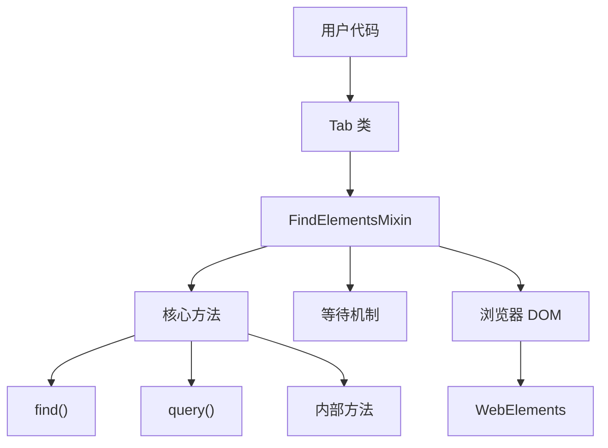
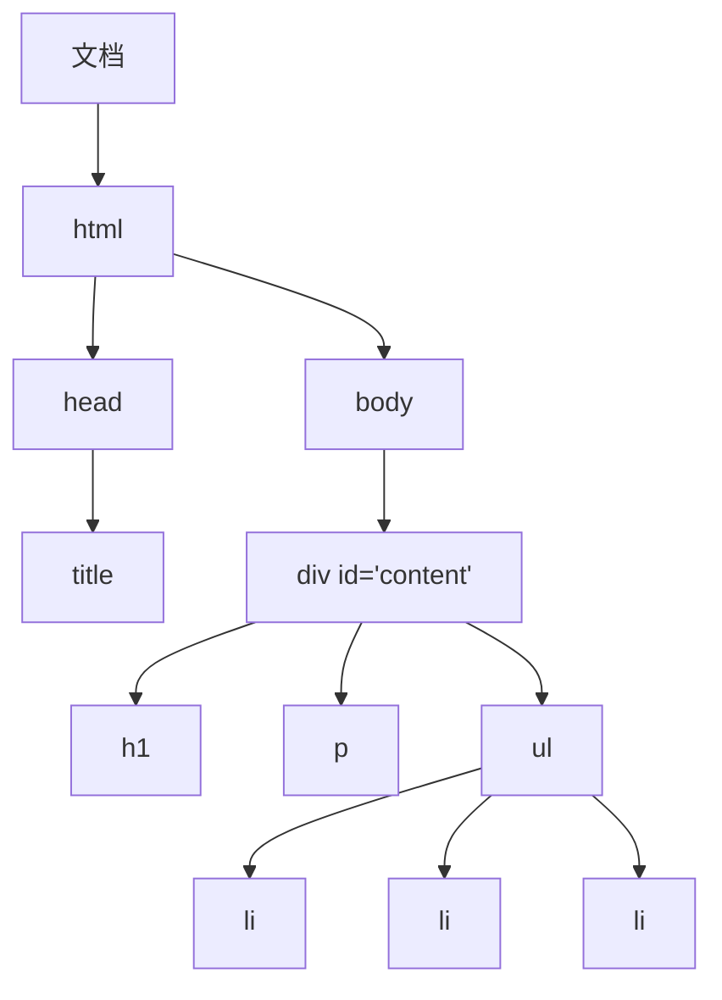
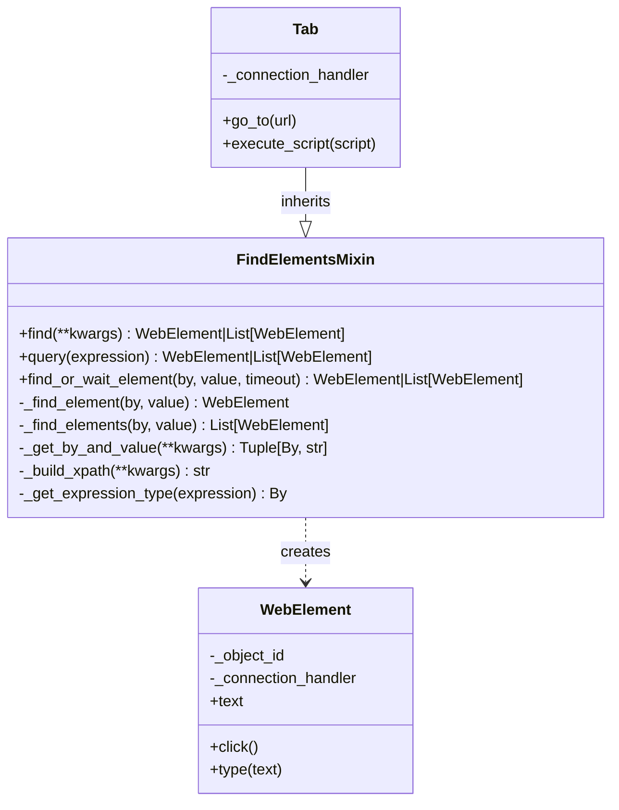

# FindElements Mixin

FindElementsMixin 是 Pydoll 架构中的基础组件，它通过多种选择器类型实现了元素定位策略。该Mixin提供了在 DOM 中查找和操作元素的核心能力，这是自动化代码与浏览器渲染引擎之间的桥梁。  



## 理解 Python 中的 Mixin

在面向对象编程中，Mixin 是一种向其他类提供方法但不作为基类的类。与传统的继承（子类从父类继承，表示“是一个”关系）不同，Mixin 实现的是“具有”能力关系。

```python
# Example of a mixin in Python
class LoggerMixin:
    def log(self, message):
        print(f"LOG: {message}")
        
    def log_error(self, error):
        print(f"ERROR: {error}")

class DataProcessor(LoggerMixin):
    def process_data(self, data):
        self.log("Processing data...")
        # Process the data
        self.log("Data processing complete")
```

Mixin 在复杂软件架构中具有以下优势：

1. **代码复用**：同一功能可被多个无关联的类使用  
2. **关注点分离**：每个 mixin 负责特定功能模块  
3. **组合优于继承**：避免深层继承层级  
4. **模块化**：功能可独立添加或移除  

!!! info "Mixin 与多重继承"  
    虽然 Python 支持多重继承，但 mixin 是该特性下的一种特定设计模式。Mixin 本身不应被直接实例化，通常不维护状态，其提供的方法可供其他类使用而不建立"是一个"关系。  

## 文档对象模型 (DOM)  

在深入元素选择策略前，需理解 DOM——它将 HTML 文档结构表示为对象树。  



DOM 具有以下特性：  

1. **层级性**：元素嵌套形成父子关系  
2. **可操作性**：JavaScript 可修改结构、内容及样式  
3. **可查询性**：支持多种元素定位策略  
4. **事件驱动**：可响应用户交互及其他事件  

### Chrome DevTools 协议与 DOM 访问  

Pydoll 通过 Chrome DevTools 协议 (CDP) 操作 DOM，该协议提供文档查询与修改方法：  

| CDP 域 | 用途 | 示例命令 |  
|--------|------|----------|  
| DOM | 文档结构访问 | `querySelector`, `getDocument` |  
| Runtime | 页面上下文 JavaScript 执行 | `evaluate`, `callFunctionOn` |  
| Page | 页面级操作 | `navigate`, `captureScreenshot` |  

CDP 支持通过 DOM 域直接操作文档，同时通过 Runtime 域实现基于 JavaScript 的交互。FindElementsMixin 结合两种方式实现稳健的元素选择。  

## 核心 API 方法  

Pydoll 引入两种主要元素查找方法，提供更直观灵活的操作方式：  

### find() 方法  

`find()` 方法通过常见 HTML 属性实现直观的元素定位：

```python
# Find by ID
element = await tab.find(id="username")

# Find by class name
element = await tab.find(class_name="submit-button")

# Find by tag name
element = await tab.find(tag_name="button")

# Find by text content
element = await tab.find(text="Click here")

# Find by name attribute
element = await tab.find(name="email")

# Combine multiple attributes
element = await tab.find(tag_name="input", name="password", type="password")

# Find all matching elements
elements = await tab.find(class_name="item", find_all=True)

# Find with timeout
element = await tab.find(id="dynamic-content", timeout=10)
```

#### 方法签名

```python
async def find(
    self,
    id: Optional[str] = None,
    class_name: Optional[str] = None,
    name: Optional[str] = None,
    tag_name: Optional[str] = None,
    text: Optional[str] = None,
    timeout: int = 0,
    find_all: bool = False,
    raise_exc: bool = True,
    **attributes,
) -> Union[WebElement, list[WebElement], None]:
```

#### 参数

| 参数 | 类型 | 描述 |
|------|------|------|
| `id` | `Optional[str]` | 元素 ID 属性值 |
| `class_name` | `Optional[str]` | 待匹配的 CSS 类名 |
| `name` | `Optional[str]` | 元素 name 属性值 |
| `tag_name` | `Optional[str]` | HTML 标签名（如 "div"、"input"） |
| `text` | `Optional[str]` | 元素内待匹配的文本内容 |
| `timeout` | `int` | 等待元素出现的最大秒数 |
| `find_all` | `bool` | 若为 True，返回所有匹配项；若为 False，仅返回首个匹配项 |
| `raise_exc` | `bool` | 未找到元素时是否抛出异常 |
| `**attributes` | `dict` | 待匹配的其他 HTML 属性 |

### query() 方法

`query()` 方法通过 CSS 选择器或 XPath 表达式提供直接访问：

```python
# CSS selectors
element = await tab.query("div.content > p.intro")
element = await tab.query("#login-form input[type='password']")

# XPath expressions
element = await tab.query("//div[@id='content']/p[contains(text(), 'Welcome')]")
element = await tab.query("//button[text()='Submit']")

# ID shorthand (automatically detected)
element = await tab.query("#username")

# Class shorthand (automatically detected)
element = await tab.query(".submit-button")

# Find all matching elements
elements = await tab.query("div.item", find_all=True)

# Query with timeout
element = await tab.query("#dynamic-content", timeout=10)
```

#### 方法签名

```python
async def query(
    self, 
    expression: str, 
    timeout: int = 0, 
    find_all: bool = False, 
    raise_exc: bool = True
) -> Union[WebElement, list[WebElement], None]:
```

#### 参数

| 参数 | 类型 | 描述 |
|------|------|------|
| `expression` | `str` | 选择器表达式（CSS、XPath、带#的ID、带.的类） |
| `timeout` | `int` | 等待元素出现的最大秒数 |
| `find_all` | `bool` | 若为 True，返回所有匹配项；若为 False，仅返回首个匹配项 |
| `raise_exc` | `bool` | 未找到元素时是否抛出异常 |

## 实际使用示例

### 基础元素定位

```python
import asyncio
from pydoll.browser.chromium import Chrome

async def basic_element_finding():
    browser = Chrome()
    tab = await browser.start()
    
    try:
        await tab.go_to("https://example.com/login")
        
        # Find login form elements
        username_field = await tab.find(id="username")
        password_field = await tab.find(name="password")
        submit_button = await tab.find(tag_name="button", type="submit")
        
        # Interact with elements
        await username_field.type_text("user@example.com")
        await password_field.type_text("password123")
        await submit_button.click()
        
    finally:
        await browser.stop()

asyncio.run(basic_element_finding())
```

### 高级选择器组合

```python
async def advanced_selectors():
    browser = Chrome()
    tab = await browser.start()
    
    try:
        await tab.go_to("https://example.com/products")
        
        # Find specific product by combining attributes
        product = await tab.find(
            tag_name="div",
            class_name="product",
            data_category="electronics",
            data_price_range="500-1000"
        )
        
        # Find all products in a category
        electronics = await tab.find(
            class_name="product",
            data_category="electronics",
            find_all=True
        )
        
        # Find element by text content
        add_to_cart = await tab.find(text="Add to Cart")
        
        print(f"Found {len(electronics)} electronics products")
        
    finally:
        await browser.stop()
```

### 使用 CSS Selectors 和 XPath 定位

```python
async def css_and_xpath_examples():
    browser = Chrome()
    tab = await browser.start()
    
    try:
        await tab.go_to("https://example.com/table")
        
        # CSS selectors
        header_cells = await tab.query("table thead th", find_all=True)
        first_row = await tab.query("table tbody tr:first-child")
        
        # XPath for complex selections
        # Find table cell containing specific text
        price_cell = await tab.query("//td[contains(text(), '$')]")
        
        # Find button in the same row as specific text
        edit_button = await tab.query(
            "//tr[td[contains(text(), 'John Doe')]]//button[text()='Edit']"
        )
        
        # Find all rows with price > $100 (using XPath functions)
        expensive_items = await tab.query(
            "//tr[number(translate(td[3], '$,', '')) > 100]",
            find_all=True
        )
        
        print(f"Found {len(expensive_items)} expensive items")
        
    finally:
        await browser.stop()
```
## 等待机制

FindElementsMixin 实现了复杂的等待机制以处理动态内容：

### 基于超时的等待

```python
async def waiting_examples():
    browser = Chrome()
    tab = await browser.start()
    
    try:
        await tab.go_to("https://example.com/dynamic")
        
        # Wait up to 10 seconds for element to appear
        dynamic_content = await tab.find(id="dynamic-content", timeout=10)
        
        # Wait for multiple elements
        items = await tab.find(class_name="item", timeout=5, find_all=True)
        
        # Handle cases where element might not appear
        optional_element = await tab.find(
            id="optional-banner", 
            timeout=3, 
            raise_exc=False
        )
        
        if optional_element:
            await optional_element.click()
        else:
            print("Optional banner not found, continuing...")
            
    finally:
        await browser.stop()
```

### 错误处理策略

```python
async def robust_element_finding():
    browser = Chrome()
    tab = await browser.start()
    
    try:
        await tab.go_to("https://example.com")
        
        # Strategy 1: Try multiple selectors
        submit_button = None
        selectors = [
            {"id": "submit"},
            {"class_name": "submit-btn"},
            {"tag_name": "button", "type": "submit"},
            {"text": "Submit"}
        ]
        
        for selector in selectors:
            try:
                submit_button = await tab.find(**selector, timeout=2)
                break
            except ElementNotFound:
                continue
        
        if not submit_button:
            raise Exception("Submit button not found with any selector")
        
        # Strategy 2: Graceful degradation
        try:
            premium_feature = await tab.find(class_name="premium-only", timeout=1)
            await premium_feature.click()
        except ElementNotFound:
            # Fall back to basic feature
            basic_feature = await tab.find(class_name="basic-feature")
            await basic_feature.click()
            
    finally:
        await browser.stop()
```

## Selector策略选择

FindElementsMixin 会根据提供的参数自动选择最合适的选择器策略：

### 单属性选择

当仅提供一个属性时，mixin 会使用最高效的选择器：

```python
# These use optimized single-attribute selectors
await tab.find(id="username")           # Uses By.ID
await tab.find(class_name="button")     # Uses By.CLASS_NAME  
await tab.find(tag_name="input")        # Uses By.TAG_NAME
await tab.find(name="email")            # Uses By.NAME
```

### 多属性选择

当提供多个属性时，mixin 会构建 XPath 表达式：

```python
# This builds XPath: //input[@type='password' and @name='password']
await tab.find(tag_name="input", type="password", name="password")

# This builds XPath: //div[@class='product' and @data-id='123']
await tab.find(tag_name="div", class_name="product", data_id="123")
```

### 表达式类型检测

`query()` 方法会自动检测表达式类型：

```python
# Detected as XPath (starts with //)
await tab.query("//div[@id='content']")

# Detected as ID (starts with #)
await tab.query("#username")

# Detected as class (starts with . but not ./)
await tab.query(".submit-button")

# Detected as CSS selector (default)
await tab.query("div.content > p")
```

## 内部架构

FindElementsMixin 通过复杂的内部架构实现元素定位：


### 核心内部方法

#### find_or_wait_element()

处理立即查找和等待的核心方法：

```python
async def find_or_wait_element(
    self,
    by: By,
    value: str,
    timeout: int = 0,
    find_all: bool = False,
    raise_exc: bool = True,
) -> Union[WebElement, list[WebElement], None]:
    """
    Core element finding method with optional waiting capability.
    
    Searches for elements with flexible waiting. If timeout specified,
    repeatedly attempts to find elements with 0.5s delays until success or timeout.
    """
```

方法功能：
1. 确定适当的查找方法（`_find_element` 或 `_find_elements`）
2. 以0.5秒为间隔实现轮询逻辑
3. 处理超时和异常抛出逻辑
4. 根据`find_all`参数返回适当结果

#### _get_by_and_value()

将高级参数转换为CDP兼容的选择器策略：

```python
def _get_by_and_value(
    self,
    by_map: dict[str, By],
    id: Optional[str] = None,
    class_name: Optional[str] = None,
    name: Optional[str] = None,
    tag_name: Optional[str] = None,
    text: Optional[str] = None,
    **attributes,
) -> tuple[By, str]:
```

方法功能：
1. 识别提供了哪些属性
2. 对于单一属性，返回对应的`By`枚举和值
3. 对于多个属性，通过`_build_xpath()`构建XPath表达式

#### _build_xpath()

根据多重条件构建复杂XPath表达式：

```python
@staticmethod
def _build_xpath(
    id: Optional[str] = None,
    class_name: Optional[str] = None,
    name: Optional[str] = None,
    tag_name: Optional[str] = None,
    text: Optional[str] = None,
    **attributes,
) -> str:
```

方法功能:
1. 构建基础XPath（`//tag` 或 `//*`）
2. 为每个提供的属性添加条件
3. 处理类名和文本内容等特殊情况
4. 使用`and`运算符组合条件

### CDP命令生成

mixin根据选择器类型生成相应的CDP命令：

#### CSS选择器

```python
def _get_find_element_command(self, by: By, value: str, object_id: str = ''):
    # Converts to CSS selector format
    if by == By.CLASS_NAME:
        selector = f'.{escaped_value}'
    elif by == By.ID:
        selector = f'#{escaped_value}'
    
    # Uses DOM.querySelector or Runtime.evaluate
```

#### XPath表达式

```python
def _get_find_element_by_xpath_command(self, xpath: str, object_id: str):
    # Uses Runtime.evaluate with document.evaluate()
    script = Scripts.FIND_XPATH_ELEMENT.replace('{escaped_value}', escaped_value)
    command = RuntimeCommands.evaluate(expression=script)
```

## 性能对比

### 选择器效率

不同类型选择器具有不同的性能特征：

| 选择器类型 | 性能表现 | 适用场景 |
|------------|----------|----------|
| ID | 最快 | 具有ID属性的唯一元素 |
| CSS类 | 快 | 具有特定样式的元素 |
| 标签名 | 快 | 需要获取某类型所有元素时 |
| CSS选择器 | 良好 | 复杂但常见的模式 |
| XPath | 较慢 | 复杂关系和文本匹配 |

### 优化策略
```python
# Good: Use ID when available
element = await tab.find(id="unique-element")

# Good: Use simple CSS selectors
element = await tab.query("#form .submit-button")

# Avoid: Complex XPath when CSS would work
# element = await tab.query("//div[@id='form']//button[@class='submit-button']")

# Good: Combine attributes efficiently
element = await tab.find(tag_name="input", type="email", required=True)

# Good: Use find_all=False when you only need the first match
first_item = await tab.find(class_name="item", find_all=False)
```

### 元素等待最佳实践

```python
# Good: Use appropriate timeouts
quick_element = await tab.find(id="static-content", timeout=2)
slow_element = await tab.find(id="ajax-content", timeout=10)

# Good: Handle optional elements gracefully
optional = await tab.find(class_name="optional", timeout=1, raise_exc=False)

# Good: Use specific selectors to reduce false positives
specific_button = await tab.find(
    tag_name="button", 
    class_name="submit", 
    type="submit",
    timeout=5
)
```

## 错误处理

FindElementsMixin 提供全面的错误处理机制：

### 异常类型

```python
from pydoll.exceptions import ElementNotFound, WaitElementTimeout

try:
    element = await tab.find(id="missing-element")
except ElementNotFound:
    print("Element not found immediately")

try:
    element = await tab.find(id="slow-element", timeout=10)
except WaitElementTimeout:
    print("Element did not appear within timeout")
```

### 优雅处理

```python
# Option 1: Use raise_exc=False
element = await tab.find(id="optional-element", raise_exc=False)
if element:
    await element.click()

# Option 2: Try-except with fallback
try:
    primary_button = await tab.find(id="primary-action")
    await primary_button.click()
except ElementNotFound:
    # Fallback to alternative selector
    fallback_button = await tab.find(class_name="action-button")
    await fallback_button.click()
```

## 与 WebElement 的集成

找到的元素会以 WebElement 实例形式返回，这些实例提供丰富的交互能力：

```python
# Find and interact with form elements
username = await tab.find(name="username")
await username.type_text("user@example.com")

password = await tab.find(type="password")
await password.type_text("secretpassword")

submit = await tab.find(tag_name="button", type="submit")
await submit.click()

# Get element properties
text_content = await username.text
is_visible = await username.is_visible()
attribute_value = await username.get_attribute("placeholder")
```

## 结论

FindElementsMixin 是 Pydoll 中元素交互的基础，为定位 DOM 元素提供了强大且直观的 API。`find()` 和 `query()` 方法的结合既支持简单场景也满足复杂元素选择需求。

FindElementsMixin 设计的核心优势：

1. **直观的 API**：`find()` 方法采用自然的 HTML 属性命名
2. **灵活的选择方式**：支持 CSS 选择器、XPath 及属性组合
3. **健壮的等待机制**：内置超时和轮询功能
4. **性能优化**：自动选择最高效的选择器策略
5. **错误处理**：提供全面的异常处理机制和优雅降级方案

理解 FindElementsMixin 的功能和模式，能够帮助您构建能够处理现代 Web 应用复杂性的健壮且可维护的浏览器自动化方案。