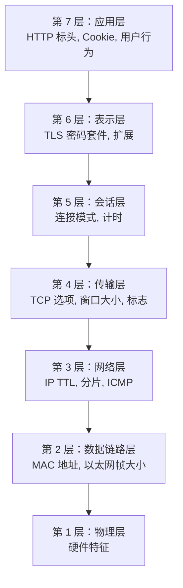
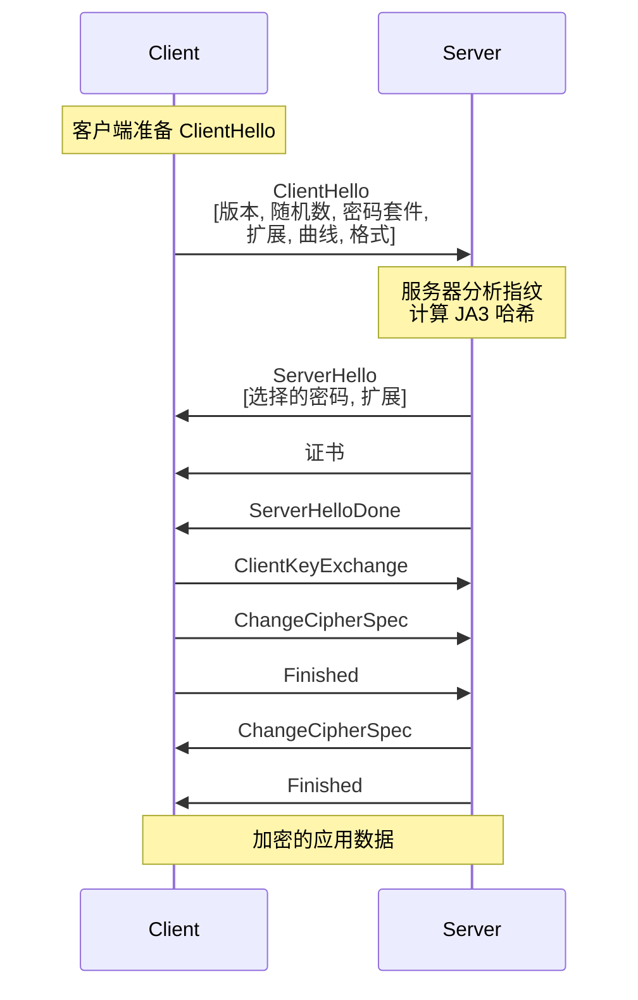

# 网络级指纹

本文档探讨了网络协议级别的指纹技术，从 TCP/IP 特征到 TLS 握手模式。了解设备如何 **在浏览器加载之前** 就被识别，对于规避复杂的检测系统至关重要。

!!! info "模块导航"
    - **[← 指纹概述](./index.md)** - 模块介绍与理念
    - **[→ 浏览器指纹](./browser-fingerprinting.md)** - 应用层指纹
    - **[→ 规避技术](./evasion-techniques.md)** - 实用对策
    
    有关网络基础知识，请参阅 **[网络基础](../network/network-fundamentals.md)** 和 **[代理架构](../network/http-proxies.md)**。

!!! warning "操作系统级特征"
    网络指纹在 OSI 模型的第 3-6 层运行。与浏览器级特征（可用 JavaScript 修改）不同，网络级指纹需要 **操作系统级** 或 **内核级** 的更改才能有效伪造。

## 网络级指纹

网络指纹在 OSI 模型的第 3-7 层运行，通过分析网络数据包、协议和连接的特征来识别客户端。

### 为什么网络指纹很重要

与浏览器级指纹（可以被 JavaScript 修改）不同，网络级特征：

- **更难修改**：需要操作系统级或内核级的更改
- **更持久**：不能像 Cookie 或 localStorage 那样被清除
- **跨应用**：设备上所有应用程序共享相同的指纹
- **抗代理**：某些特征在通过代理/VPN 隧道时仍然存在

!!! info "分层指纹"
    复杂的检测系统使用 **多层** 指纹技术。即使您伪造了浏览器级的特征，网络级的不一致也会暴露自动化。

### OSI 模型和指纹层



**指纹发生在：**

- **第 3 层 (网络层)**：IP TTL、分片行为
- **第 4 层 (传输层)**：TCP/UDP 选项、初始序列号、窗口缩放
- **第 6 层 (表示层)**：TLS 握手、密码套件、扩展
- **第 7 层 (应用层)**：HTTP 标头、HTTP/2 设置、特定协议行为

## TCP/IP 指纹 (第 3-4 层)

TCP/IP 指纹通过分析 TCP 和 IP 数据包的特征来识别操作系统和网络堆栈实现。

### TCP 数据包结构

```python
# 用于指纹识别的 TCP 标头字段
{
    'ip_ttl': 64,                    # 初始 TTL 值 (特定于操作系统)
    'window_size': 65535,            # TCP 窗口大小
    'window_scaling': 7,             # 窗口缩放因子
    'mss': 1460,                     # 最大分段大小
    'timestamp': True,               # TCP 时间戳选项
    'sack': True,                    # 选择性确认
    'options_order': ['MSS', 'SACK_PERM', 'TIMESTAMP', 'NOP', 'WSCALE']
}
```

### 关键 TCP/IP 特征

#### 1. 生存时间 (TTL)

TTL 值特定于操作系统，并且每经过一个网络跳点就会递减：

| 操作系统 | 初始 TTL | 经过 10 跳后 |
|---|---|---|
| **Linux** | 64 | 54 |
| **Windows** | 128 | 118 |
| **macOS** | 64 | 54 |
| **Cisco/路由器** | 255 | 245 |

```python
# TTL 指纹
def detect_os_by_ttl(ttl: int) -> str:
    """
    根据 TTL 值检测操作系统。
    注意：TTL 每经过一个路由器跳点减 1。
    """
    if ttl <= 64:
        return 'Linux/macOS (初始: 64)'
    elif ttl <= 128:
        return 'Windows (初始: 128)'
    elif ttl <= 255:
        return '网络设备 (初始: 255)'
    else:
        return '未知'

# 示例：接收到的 TTL = 54
# → 原始 TTL 可能是 64 (Linux/macOS)
# → 数据包经过了约 10 个跳点
```

!!! warning "TTL 和代理"
    使用代理时，TTL 值会在代理服务器处重置。然而，不一致性可能会暴露代理的使用：
    
    - User-Agent 显示 "Windows" → TTL 暗示是 Linux (代理服务器的操作系统)
    - TTL 对于声称的位置来说太低 (暗示 VPN/代理路由)

#### 2. TCP 窗口大小

初始 TCP 窗口大小因操作系统和配置而异：

```python
# 按操作系统划分的常见窗口大小
OS_WINDOW_SIZES = {
    'Windows 10': 8192,          # 默认
    'Windows 11': 65535,         # 更激进
    'Linux (近期)': 29200,     # 现代内核
    'macOS': 65535,              # 乐观
    'Android': 65535,            # 移动优化
}
```

#### 3. TCP 选项及其顺序

TCP 选项的存在与 **顺序** 创造了一个独特的指纹：

```python
# SYN 数据包中的示例 TCP 选项
{
    # Windows 10 典型顺序
    'windows': ['MSS', 'NOP', 'WSCALE', 'NOP', 'NOP', 'SACK_PERM'],
    
    # Linux 典型顺序  
    'linux': ['MSS', 'SACK_PERM', 'TIMESTAMP', 'NOP', 'WSCALE'],
    
    # macOS 典型顺序
    'macos': ['MSS', 'NOP', 'WSCALE', 'NOP', 'NOP', 'TIMESTAMP', 'SACK_PERM', 'EOL']
}
```

**TCP 选项代码：**

| 代码 | 名称 | 目的 |
|---|---|---|
| 0 | EOL | 选项列表结束 |
| 1 | NOP | 无操作 (填充) |
| 2 | MSS | 最大分段大小 |
| 3 | WSCALE | 窗口缩放因子 |
| 4 | SACK_PERM | 允许 SACK |
| 8 | TIMESTAMP | 用于 RTT 计算的时间戳 |

### 使用 p0f 进行被动操作系统指纹识别

[p0f](http://lcamtuf.coredump.cx/p0f3/) 是一个功能强大的被动操作系统指纹工具，由 Michal Zalewski 创建，它通过分析 TCP/IP 数据包特征来识别操作系统，而无需向目标发送任何流量。

```bash
# 安装 p0f
sudo apt-get install p0f

# 被动指纹 (从接口读取)
sudo p0f -i eth0

# 从 pcap 文件读取
p0f -r capture.pcap

# 输出示例：
# 192.168.1.100:12345 → 93.184.216.34:443
#   OS: Linux 3.11 and newer
#   Signature: 4:64:0:*:mss*20,10:mss,sok,ts,nop,ws:df,id+:0
```

!!! info "p0f 签名数据库"
    p0f 维护着一个包含数千个操作系统指纹的广泛签名数据库 (`p0f.fp`)。该工具特别有效，因为它执行 **被动** 指纹识别，分析流量而不产生任何可能警报入侵检测系统的数据包。

**p0f 签名格式：**

```
version:ittl:olen:mss:wsize,scale:olayout:quirks:pclass
```

- `version`：IP 版本 (4 或 6)
- `ittl`：初始 TTL
- `olen`：选项长度
- `mss`：最大分段大小
- `wsize,scale`：窗口大小和缩放
- `olayout`：选项布局 (顺序和类型)
- `quirks`：异常行为 (df=不分片, id+=非零 IP ID)
- `pclass`：负载分类

### 使用 Nmap 进行主动操作系统指纹识别

[Nmap](https://nmap.org/) (Network Mapper) 是由 Gordon Lyon (Fyodor) 开发的主动操作系统指纹识别的事实标准。它发送特制的数据包并分析响应，以确定操作系统特征。

```bash
# 操作系统检测
nmap -O 93.184.216.34

# 详细的操作系统检测与版本扫描
nmap -A 93.184.216.34

# 仅 TCP/IP 指纹
nmap -sV --script=banner 93.184.216.34

# 输出示例：
# OS details: Linux 5.4 - 5.10
# Network Distance: 11 hops
# TCP Sequence Prediction: Difficulty=260 (Good luck!)
```

**Nmap 的操作系统检测测试：**

- **TCP ISN 采样**：分析初始序列号 (ISN) 的生成
- **TCP 选项**：测试窗口大小、MSS、SACK 和选项顺序
- **ICMP 响应**：发送回显请求并分析 TTL、代码和负载
- **关闭端口的 TCP 响应**：向关闭的端口发送数据包并分析 RST 响应
- **IP ID 序列**：测试操作系统如何生成 IP 识别字段

!!! tip "Nmap 指纹数据库"
    Nmap 维护着世界上最全面的操作系统指纹数据库之一 (`nmap-os-db`)，由社区定期更新。您可以提交新的指纹以提高检测准确性。

### Python 实现：TCP 指纹

以下实现使用 [Scapy](https://scapy.net/)，这是一个由 Philippe Biondi 创建的、用于数据包操作和网络分析的强大 Python 库。

```python
from scapy.all import IP, TCP, sr1, sniff
import logging

logging.basicConfig(level=logging.INFO)
logger = logging.getLogger(__name__)


class TCPFingerprinter:
    """
    分析 TCP/IP 特征以对远程主机进行指纹识别。
    """
    
    def __init__(self, target_ip: str, target_port: int = 80):
        self.target_ip = target_ip
        self.target_port = target_port
        self.fingerprint = {}
    
    def capture_syn_ack(self) -> dict:
        """
        发送 SYN 包并捕获 SYN-ACK 响应。
        """
        # 构造 SYN 包
        ip = IP(dst=self.target_ip)
        syn = TCP(sport=40000, dport=self.target_port, flags='S', seq=1000)
        
        # 发送和接收
        logger.info(f"Sending SYN to {self.target_ip}:{self.target_port}")
        syn_ack = sr1(ip/syn, timeout=2, verbose=0)
        
        if not syn_ack or not syn_ack.haslayer(TCP):
            logger.error("No SYN-ACK received")
            return {}
        
        # 提取指纹特征
        tcp_layer = syn_ack.getlayer(TCP)
        ip_layer = syn_ack.getlayer(IP)
        
        fingerprint = {
            'ip_ttl': ip_layer.ttl,
            'ip_id': ip_layer.id,
            'ip_flags': ip_layer.flags,
            'tcp_window': tcp_layer.window,
            'tcp_flags': tcp_layer.flags,
            'tcp_options': self._parse_tcp_options(tcp_layer.options),
            'tcp_options_order': [opt[0] for opt in tcp_layer.options if opt[0] != 'Padding'],
        }
        
        self.fingerprint = fingerprint
        return fingerprint
    
    def _parse_tcp_options(self, options: list) -> dict:
        """将 TCP 选项解析为可读格式。"""
        parsed = {}
        
        for option in options:
            opt_name = option[0]
            
            if opt_name == 'MSS':
                parsed['mss'] = option[1]
            elif opt_name == 'WScale':
                parsed['window_scale'] = option[1]
            elif opt_name == 'Timestamp':
                parsed['timestamp'] = option[1]
            elif opt_name == 'SAckOK':
                parsed['sack_permitted'] = True
            elif opt_name == 'NOP':
                pass  # 填充
            elif opt_name == 'EOL':
                break  # 选项结束
        
        return parsed
    
    def generate_signature(self) -> str:
        """
        生成类似 p0f 的签名字符串。
        """
        if not self.fingerprint:
            return ''
        
        fp = self.fingerprint
        
        # 格式：version:ttl:window:options_order
        version = 4  # IPv4
        ttl = fp.get('ip_ttl', 0)
        window = fp.get('tcp_window', 0)
        
        # 选项顺序（字符串形式）
        opts = ','.join(fp.get('tcp_options_order', []))
        
        signature = f"{version}:{ttl}:{window}:{opts}"
        return signature
    
    def detect_os(self) -> str:
        """
        根据收集到的指纹检测操作系统。
        """
        if not self.fingerprint:
            return 'Unknown (no data)'
        
        ttl = self.fingerprint.get('ip_ttl', 0)
        window = self.fingerprint.get('tcp_window', 0)
        opts_order = self.fingerprint.get('tcp_options_order', [])
        
        # 基于启发式的简单检测
        if ttl <= 64:
            if window == 29200:
                return 'Linux (recent kernel)'
            elif window == 65535:
                if 'Timestamp' in opts_order and 'SAckOK' in opts_order:
                    return 'Linux 3.x+'
                else:
                    return 'macOS'
            else:
                return 'Linux/Unix'
        
        elif ttl <= 128:
            if window == 8192:
                return 'Windows 10'
            elif window == 65535:
                return 'Windows 11 or Windows Server'
            else:
                return 'Windows'
        
        elif ttl <= 255:
            return 'Network device (router/firewall)'
        
        return 'Unknown OS'
    
    def print_fingerprint(self):
        """漂亮地打印指纹。"""
        if not self.fingerprint:
            print("No fingerprint data available")
            return
        
        print("\n=== TCP/IP Fingerprint ===")
        print(f"Target: {self.target_ip}:{self.target_port}")
        print(f"\nIP Layer:")
        print(f"  TTL: {self.fingerprint.get('ip_ttl')}")
        print(f"  IP ID: {self.fingerprint.get('ip_id')}")
        print(f"  Flags: {self.fingerprint.get('ip_flags')}")
        
        print(f"\nTCP Layer:")
        print(f"  Window Size: {self.fingerprint.get('tcp_window')}")
        print(f"  Flags: {self.fingerprint.get('tcp_flags')}")
        
        print(f"\nTCP Options:")
        for opt, value in self.fingerprint.get('tcp_options', {}).items():
            print(f"  {opt}: {value}")
        
        print(f"\nOptions Order: {' → '.join(self.fingerprint.get('tcp_options_order', []))}")
        print(f"\nSignature: {self.generate_signature()}")
        print(f"Detected OS: {self.detect_os()}")
        print("=" * 30)


# 用法示例
def fingerprint_target(ip: str, port: int = 80):
    """对目标主机进行指纹识别。"""
    fingerprinter = TCPFingerprinter(ip, port)
    
    try:
        fingerprinter.capture_syn_ack()
        fingerprinter.print_fingerprint()
    except PermissionError:
        print("Error: Raw socket access requires root/admin privileges")
        print("Run with: sudo python3 script.py")
    except Exception as e:
        print(f"Error: {e}")


# 示例用法 (需要 root 权限)：
# fingerprint_target('93.184.216.34', 80)  # example.com
```

**示例输出：**

```
=== TCP/IP Fingerprint ===
Target: 93.184.216.34:80

IP Layer:
  TTL: 54
  IP ID: 0
  Flags: DF (Don't Fragment)

TCP Layer:
  Window Size: 29200
  Flags: SA (SYN-ACK)

TCP Options:
  mss: 1460
  window_scale: 7
  sack_permitted: True
  timestamp: (123456789, 0)

Options Order: MSS → SAckOK → Timestamp → NOP → WScale

Signature: 4:54:29200:MSS,SAckOK,Timestamp,NOP,WScale
Detected OS: Linux (recent kernel)
==============================
```

### TCP 初始序列号 (ISN) 分析

```python
def analyze_isn_randomness(target_ip: str, samples: int = 10) -> dict:
    """
    分析 TCP 初始序列号的生成。
    不同的操作系统使用不同的 ISN 生成算法。
    """
    import statistics
    
    sequence_numbers = []
    
    for i in range(samples):
        syn = IP(dst=target_ip)/TCP(sport=40000+i, dport=80, flags='S')
        syn_ack = sr1(syn, timeout=2, verbose=0)
        
        if syn_ack and syn_ack.haslayer(TCP):
            isn = syn_ack[TCP].seq
            sequence_numbers.append(isn)
        
        # 探针之间稍作延迟
        time.sleep(0.1)
    
    if len(sequence_numbers) < 2:
        return {'error': 'Insufficient data'}
    
    # 计算统计数据
    deltas = [sequence_numbers[i+1] - sequence_numbers[i] 
              for i in range(len(sequence_numbers)-1)]
    
    return {
        'sample_count': len(sequence_numbers),
        'isn_values': sequence_numbers,
        'deltas': deltas,
        'avg_delta': statistics.mean(deltas),
        'stdev_delta': statistics.stdev(deltas) if len(deltas) > 1 else 0,
        'min_delta': min(deltas),
        'max_delta': max(deltas),
        'randomness': 'High' if statistics.stdev(deltas) > 100000 else 'Low'
    }
```

**按操作系统划分的 ISN 生成：**

| 操作系统 | ISN 算法 | 可预测性 |
|---|---|---|
| **Linux (现代)** | [RFC 6528](https://tools.ietf.org/html/rfc6528) (基于哈希) | 非常随机 |
| **Windows** | RFC 6528 | 非常随机 |
| **旧版 Linux** | 基于时间的计数器 | 有点可预测 |
| **BSD** | [RFC 1948](https://tools.ietf.org/html/rfc1948) (基于 MD5) | 随机 |

!!! danger "ISN 预测攻击"
    历史上，可预测的 ISN 导致了 **TCP 劫持攻击** (参见 [Mitnick 攻击, 1995](https://en.wikipedia.org/wiki/Kevin_Mitnick#Arrest,_conviction,_and_incarceration))。现代系统实现了 [RFC 6528](https://tools.ietf.org/html/rfc6528) "防御序列号攻击"，使用加密安全的随机数生成器来生成 ISN，使得预测在计算上不可行。

## TLS/SSL 指纹 (第 6 层)

TLS 指纹是识别客户端最强大的技术之一，因为 TLS 握手揭示了有关客户端加密能力和实现的详细信息。

### TLS 握手概述



### JA3：TLS 客户端指纹

[JA3](https://github.com/salesforce/ja3) 是由 Salesforce 的 John Althouse、Jeff Atkinson 和 Josh Atkins 开发的一种方法，通过分析 ClientHello 数据包来创建 TLS 客户端的指纹。该技术已成为 TLS 指纹识别的行业标准。

**JA3 组件：**

```python
# JA3 指纹组件 (按顺序)
ja3_components = {
    1: 'TLS 版本',          # 例如, 771 = TLS 1.2, 772 = TLS 1.3
    2: '密码套件',        # 例如, '49195,49199,52393'
    3: '扩展',           # 例如, '0,10,11,13'  
    4: '椭圆曲线',      # 例如, '23,24,25'
    5: 'EC 点格式',     # 例如, '0'
}

# JA3 字符串格式 (逗号分隔)
ja3_string = f"{version},{ciphers},{extensions},{curves},{formats}"

# JA3 哈希 (字符串的 MD5)
ja3_hash = hashlib.md5(ja3_string.encode()).hexdigest()
```

**JA3 示例：**

```
String: 771,49195-49199-52393-49196-49200-52392,0-10-11-13-65281,23-24-25,0
Hash:   579ccef312d18482fc42e2b822ca2430
```

### 使用 Python 生成 JA3 指纹

```python
import hashlib
import ssl
import socket
from typing import Optional, Dict, List


class JA3Generator:
    """
    从 TLS ClientHello 数据包生成 JA3 指纹。
    """
    
    # TLS 版本映射
    TLS_VERSIONS = {
        0x0301: 'TLS 1.0',
        0x0302: 'TLS 1.1',
        0x0303: 'TLS 1.2',
        0x0304: 'TLS 1.3',
    }
    
    # 常见密码套件
    CIPHER_SUITES = {
        0x002f: 'TLS_RSA_WITH_AES_128_CBC_SHA',
        0x0035: 'TLS_RSA_WITH_AES_256_CBC_SHA',
        0xc013: 'TLS_ECDHE_RSA_WITH_AES_128_CBC_SHA',
        0xc014: 'TLS_ECDHE_RSA_WITH_AES_256_CBC_SHA',
        0xc02f: 'TLS_ECDHE_RSA_WITH_AES_128_GCM_SHA256',
        0xc02b: 'TLS_ECDHE_ECDSA_WITH_AES_128_GCM_SHA256',
        0x1301: 'TLS_AES_128_GCM_SHA256',          # TLS 1.3
        0x1302: 'TLS_AES_256_GCM_SHA384',          # TLS 1.3
        0x1303: 'TLS_CHACHA20_POLY1305_SHA256',    # TLS 1.3
    }
    
    # TLS 扩展
    EXTENSIONS = {
        0: 'server_name',
        1: 'max_fragment_length',
        5: 'status_request',
        10: 'supported_groups',
        11: 'ec_point_formats',
        13: 'signature_algorithms',
        16: 'application_layer_protocol_negotiation',
        18: 'signed_certificate_timestamp',
        23: 'extended_master_secret',
        27: 'compress_certificate',
        35: 'session_ticket',
        43: 'supported_versions',
        45: 'psk_key_exchange_modes',
        51: 'key_share',
        65281: 'renegotiation_info',
    }
    
    @staticmethod
    def parse_client_hello(client_hello_bytes: bytes) -> Dict:
        """
        解析 ClientHello 数据包并提取 JA3 组件。
        """
        if len(client_hello_bytes) < 43:
            raise ValueError("Invalid ClientHello packet (too short)")
        
        # TLS 记录头 (5 字节)
        # 内容类型 (1) | 版本 (2) | 长度 (2)
        content_type = client_hello_bytes[0]
        record_version = int.from_bytes(client_hello_bytes[1:3], 'big')
        
        # 握手头 (4 字节)
        # 握手类型 (1) | 长度 (3)
        handshake_type = client_hello_bytes[5]
        
        if handshake_type != 0x01:  # ClientHello
            raise ValueError("Not a ClientHello packet")
        
        # ClientHello 版本 (偏移 9 处的 2 字节)
        client_version = int.from_bytes(client_hello_bytes[9:11], 'big')
        
        # 随机数 (32 字节)
        offset = 11 + 32  # 跳过版本 + 随机数
        
        # 会话 ID
        session_id_length = client_hello_bytes[offset]
        offset += 1 + session_id_length
        
        # 密码套件
        cipher_suites_length = int.from_bytes(client_hello_bytes[offset:offset+2], 'big')
        offset += 2
        
        cipher_suites = []
        for i in range(0, cipher_suites_length, 2):
            cipher = int.from_bytes(client_hello_bytes[offset+i:offset+i+2], 'big')
            cipher_suites.append(cipher)
        
        offset += cipher_suites_length
        
        # 压缩方法
        compression_length = client_hello_bytes[offset]
        offset += 1 + compression_length
        
        # 扩展
        extensions = []
        elliptic_curves = []
        ec_point_formats = []
        
        if offset < len(client_hello_bytes) - 2:
            extensions_length = int.from_bytes(client_hello_bytes[offset:offset+2], 'big')
            offset += 2
            
            extensions_end = offset + extensions_length
            
            while offset < extensions_end:
                ext_type = int.from_bytes(client_hello_bytes[offset:offset+2], 'big')
                ext_length = int.from_bytes(client_hello_bytes[offset+2:offset+4], 'big')
                offset += 4
                
                extensions.append(ext_type)
                
                # 解析特定扩展
                if ext_type == 10:  # supported_groups
                    curves_length = int.from_bytes(client_hello_bytes[offset:offset+2], 'big')
                    for i in range(2, curves_length + 2, 2):
                        curve = int.from_bytes(client_hello_bytes[offset+i:offset+i+2], 'big')
                        elliptic_curves.append(curve)
                
                elif ext_type == 11:  # ec_point_formats
                    formats_length = client_hello_bytes[offset]
                    for i in range(1, formats_length + 1):
                        fmt = client_hello_bytes[offset + i]
                        ec_point_formats.append(fmt)
                
                offset += ext_length
        
        # 过滤 GREASE 值 (由浏览器随机化以防止僵化)
        # GREASE (RFC 8701): 生成随机扩展并维持可扩展性
        # GREASE 值: 0x0a0a, 0x1a1a, 0x2a2a, 0x3a3a, 等.
        def is_grease(value: int) -> bool:
            return (value & 0x0f0f) == 0x0a0a
        
        cipher_suites = [c for c in cipher_suites if not is_grease(c)]
        extensions = [e for e in extensions if not is_grease(e)]
        elliptic_curves = [c for c in elliptic_curves if not is_grease(c)]
        
        return {
            'version': client_version,
            'cipher_suites': cipher_suites,
            'extensions': extensions,
            'elliptic_curves': elliptic_curves,
            'ec_point_formats': ec_point_formats,
        }
    
    @staticmethod
    def generate_ja3(parsed_hello: Dict) -> tuple[str, str]:
        """
        从解析的 ClientHello 生成 JA3 字符串和哈希。
        
        注意：GREASE 值应已从 parsed_hello 中过滤掉
        以确保跨连接的指纹一致性。
        """
        # 用 '-' 连接组件
        version = str(parsed_hello['version'])
        ciphers = '-'.join(str(c) for c in parsed_hello['cipher_suites'])
        extensions = '-'.join(str(e) for e in parsed_hello['extensions'])
        curves = '-'.join(str(c) for c in parsed_hello['elliptic_curves'])
        formats = '-'.join(str(f) for f in parsed_hello['ec_point_formats'])
        
        # JA3 字符串 (逗号分隔的组件)
        ja3_string = f"{version},{ciphers},{extensions},{curves},{formats}"
        
        # JA3 哈希 (MD5)
        ja3_hash = hashlib.md5(ja3_string.encode()).hexdigest()
        
        return ja3_string, ja3_hash
    
    @staticmethod
    def capture_tls_handshake(hostname: str, port: int = 443) -> Optional[bytes]:
        """
        从 TLS 连接中捕获 ClientHello。
        注意：这是简化的。对于生产环境，请使用 scapy 或 mitmproxy。
        """
        try:
            # 创建套接字但不完成握手
            sock = socket.socket(socket.AF_INET, socket.SOCK_STREAM)
            sock.settimeout(5)
            sock.connect((hostname, port))
            
            # 实际上，您需要拦截发送的实际字节
            # 这只是一个占位符 - 请改用数据包捕获工具
            
            sock.close()
            return None  # 本应返回捕获的 ClientHello 字节
            
        except Exception as e:
            print(f"Error capturing handshake: {e}")
            return None


!!! info "TLS 中的 GREASE 值"
    [GREASE (RFC 8701)](https://tools.ietf.org/html/rfc8701) - "生成随机扩展并维持可扩展性" - 是现代浏览器用来防止协议僵化的一种技术。浏览器会随机将保留值（如 0x0a0a, 0x1a1a, 0x2a2a）插入到密码套件、扩展和其他字段中。
    
    **为什么 GREASE 对指纹识别很重要：**
    
    - 这些值在每次连接时都会改变，使得原始 TLS 握手不具有确定性
    - JA3 实现必须 **过滤掉** GREASE 值以创建一致的指纹
    - 拒绝 GREASE 值的服务器是不合规的，并且会暴露自己
    - 自动化中缺少 GREASE 可能是一个检测信号 (真实浏览器总会使用它)


def analyze_ja3_from_pcap(pcap_file: str):
    """
    从 pcap 文件分析 JA3 指纹。
    需要 scapy 和 tls 解析能力。
    """
    from scapy.all import rdpcap, TCP
    from scapy.layers.tls.record import TLS
    from scapy.layers.tls.handshake import TLSClientHello
    
    packets = rdpcap(pcap_file)
    ja3_results = []
    
    for packet in packets:
        if packet.haslayer(TLS) and packet.haslayer(TLSClientHello):
            try:
                # 提取 ClientHello 层
                client_hello = packet[TLSClientHello]
                
                # 构建 JA3 组件
                version = client_hello.version
                ciphers = client_hello.ciphers
                extensions = [ext.type for ext in client_hello.ext] if hasattr(client_hello, 'ext') else []
                
                # 解析扩展以获取曲线和格式
                curves = []
                formats = []
                
                if hasattr(client_hello, 'ext'):
                    for ext in client_hello.ext:
                        if ext.type == 10:  # supported_groups
                            curves = ext.groups if hasattr(ext, 'groups') else []
                        elif ext.type == 11:  # ec_point_formats
                            formats = ext.formats if hasattr(ext, 'formats') else []
                
                # 生成 JA3
                ja3_str = f"{version},{'-'.join(map(str, ciphers))},{'-'.join(map(str, extensions))},{'-'.join(map(str, curves))},{'-'.join(map(str, formats))}"
                ja3_hash = hashlib.md5(ja3_str.encode()).hexdigest()
                
                ja3_results.append({
                    'src_ip': packet[IP].src if packet.haslayer(IP) else 'unknown',
                    'dst_ip': packet[IP].dst if packet.haslayer(IP) else 'unknown',
                    'ja3_string': ja3_str,
                    'ja3_hash': ja3_hash,
                })
                
            except Exception as e:
                print(f"Error parsing packet: {e}")
                continue
    
    return ja3_results


# 示例：已知的浏览器 JA3 哈希
KNOWN_JA3_FINGERPRINTS = {
    '579ccef312d18482fc42e2b822ca2430': 'Chrome 90+ on Windows',
    'cd08e31efaa7a0a82988099039d4a289': 'Firefox 88+ on Windows',
    'ac1a36f8b3f5e5d4a6e4f0c3e5a5e5e5': 'Safari 14+ on macOS',
    'b32309a26951912be7dba376398abc3b': 'Python requests library',
    'e7d705a3286e19bd28ca826f69a8b2c9': 'curl 7.88+'

}


def identify_client(ja3_hash: str) -> str:
    """根据 JA3 哈希识别客户端。"""
    return KNOWN_JA3_FINGERPRINTS.get(ja3_hash, 'Unknown client')
```

### TLS 指纹工具

#### 1. ja3 (原始实现)

Salesforce 的原始 [JA3 实现](https://github.com/salesforce/ja3) 提供了从 pcap 文件生成指纹的工具。

```bash
# 安装 ja3
git clone https://github.com/salesforce/ja3.git
cd ja3/python

# 从 pcap 生成 JA3
python3 ja3.py -a capture.pcap

# 输出：
# [JA3] 192.168.1.100:12345 → 93.184.216.34:443
# JA3: 579ccef312d18482fc42e2b822ca2430
# JA3S: e35df3e00ca4ef31d42b34bebaa2f86e
```

#### 2. pmercury (Python 库)

[pmercury](https://pypi.org/project/pmercury/) 是一个来自 Cisco 的用于网络指纹的 Python 库，包括 TLS 分析。

```bash
# 安装
pip install pmercury

# 在 Python 中使用
from pmercury.protocols.tls import TLS

tls = TLS()
protocol_type, fp_str, approx_str, server_name = tls.fingerprint(data)
```

#### 3. ts1-signatures (高级 TLS/HTTP2 指纹)

[ts1-signatures](https://pypi.org/project/ts1-signatures/) 提供了更详细的指纹识别，并以 JSON 格式输出。

```bash
# 安装
pip install ts1-signatures

# 在 Python 中使用
import ts1

with open("capture.pcap", "rb") as pcap:
    for tls_client in ts1.tls.process_pcap(pcap):
        signature = tls_client["signature"]
        print(f"TLS Fingerprint: {signature.hash().hexdigest()}")
```

#### 4. tlsfp (教育性 TLS 指纹服务器)

[tlsfp](https://github.com/elpy1/tlsfp) 是一个用于 TLS 指纹的 Python HTTPS 服务器，可用于测试和教育。

```bash
# 安装
git clone https://github.com/elpy1/tlsfp.git
cd tlsfp
python3 tlsfp.py

# 访问 https://localhost:8443 查看您客户端的指纹
```

#### 5. curl-impersonate

[curl-impersonate](https://github.com/lwthiker/curl-impersonate) 允许您模仿浏览器的 TLS 指纹，有助于理解规避技术。

```bash
# 安装 (以 Chrome 为例)
wget https://github.com/lwthiker/curl-impersonate/releases/...
chmod +x curl-impersonate-chrome

# 发出模仿 Chrome TLS 指纹的请求
./curl-impersonate-chrome https://example.com
```

!!! tip "Wireshark 与 JA3"
    Wireshark 可以通过 [JA3 插件](https://github.com/salesforce/ja3/tree/master/wireshark) 显示 JA3 哈希值。这允许在数据包捕获期间进行实时指纹分析。

### JA3S：TLS 服务器指纹

JA3S 是服务器端的对应物，根据 ServerHello 对服务器进行指纹识别：

```python
def generate_ja3s(server_hello_bytes: bytes) -> tuple[str, str]:
    """
    从 ServerHello 生成 JA3S 指纹。
    格式：Version,Cipher,Extensions
    """
    # 解析 ServerHello (类似于 ClientHello 解析)
    version = parse_version(server_hello_bytes)
    cipher = parse_selected_cipher(server_hello_bytes)
    extensions = parse_extensions(server_hello_bytes)
    
    # JA3S 字符串 (比 JA3 简单)
    ja3s_string = f"{version},{cipher},{'-'.join(map(str, extensions))}"
    ja3s_hash = hashlib.md5(ja3s_string.encode()).hexdigest()
    
    return ja3s_string, ja3s_hash
```

**JA3S 用例：**

- 识别服务器软件 (nginx, Apache, Cloudflare 等)
- 检测负载均衡器和 CDN
- 绘制基础设施地图
- 根据服务器堆栈识别潜在漏洞

## 进一步阅读和参考

### 技术文档和 RFC

- **[RFC 6528](https://tools.ietf.org/html/rfc6528)**: "防御序列号攻击" - 现代 ISN 生成
- **[RFC 1948](https://tools.ietf.org/html/rfc1948)**: "防御序列号攻击" - 原始基于 MD5 的 ISN
- **[RFC 8701](https://tools.ietf.org/html/rfc8701)**: "将生成随机扩展并维持可扩展性 (GREASE) 应用于 TLS"
- **[RFC 5246](https://tools.ietf.org/html/rfc5246)**: "传输层安全 (TLS) 协议版本 1.2"
- **[RFC 8446](https://tools.ietf.org/html/rfc8446)**: "传输层安全 (TLS) 协议版本 1.3"

### 工具和库

- **[JA3 by Salesforce](https://github.com/salesforce/ja3)**: 原始 JA3 TLS 指纹实现
- **[p0f](http://lcamtuf.coredump.cx/p0f3/)**: Michal Zalewski 开发的被动操作系统指纹工具
- **[Nmap](https://nmap.org/)**: Gordon Lyon 开发的网络映射器和操作系统指纹工具
- **[Scapy](https://scapy.net/)**: Philippe Biondi 开发的 Python 数据包操作库
- **[pmercury](https://pypi.org/project/pmercury/)**: 来自 Cisco 的用于网络指纹的 Python 库
- **[ts1-signatures](https://pypi.org/project/ts1-signatures/)**: 高级 TLS/HTTP2 指纹库
- **[tlsfp](https://github.com/elpy1/tlsfp)**: 教育性 HTTPS TLS 指纹服务器
- **[curl-impersonate](https://github.com/lwthiker/curl-impersonate)**: 模仿浏览器 TLS 指纹的 cURL

### 文章和博客文章

- **[TLS Fingerprinting: How it works, where it is used and how to control your signature](https://lwthiker.com/networks/2022/06/17/tls-fingerprinting.html)** by lwthiker - 关于 TLS 指纹机制的综合指南
- **[TLS Fingerprinting: Advanced Guide for Security Engineers 2025](https://rebrowser.net/blog/tls-fingerprinting-advanced-guide-for-security-engineers)** by Rebrowser - 现代 TLS 指纹技术
- **[Overcoming TLS Fingerprinting in Web Scraping](https://rayobyte.com/blog/tls-fingerprinting/)** by Rayobyte - 自动化中 TLS 指纹的实用视角
- **[JA3: A Method for Profiling SSL/TLS Clients](https://engineering.salesforce.com/tls-fingerprinting-with-ja3-and-ja3s-247362855967)** by Salesforce Engineering - 原始 JA3 公告

### 学术论文和研究

- **"Remote OS Detection via TCP/IP Stack Fingerprinting"** - 关于操作系统指纹技术的早期研究
- **"A TCP Initial Sequence Number Attack"** - 关于 ISN 漏洞的历史论文
- **"TLS Fingerprinting: New Techniques for Identifying Applications"** - 关于基于 TLS 识别的现代研究

### 安全资源

- **[OWASP Fingerprinting Guide](https://owasp.org/)**: Web 应用程序指纹技术
- **[IANA TLS Parameters](https://www.iana.org/assignments/tls-parameters/tls-parameters.xhtml)**: 官方密码套件和扩展注册表
- **[Wireshark Display Filters for TLS](https://wiki.wireshark.org/TLS)**: 分析 TLS 流量指南

### 历史参考

- **[Kevin Mitnick TCP Hijacking Attack (1995)](https://en.wikipedia.org/wiki/Kevin_Mitnick#Arrest,_conviction,_and_incarceration)**: ISN 预测利用的著名案例
- **[Evolution of TCP/IP Fingerprinting](https://lcamtuf.coredump.cx/p0f3/)**: 来自 p0f 创建者的历史视角

!!! tip "保持更新"
    随着新协议的出现和系统的适应，指纹技术不断发展。关注安全博客，订阅相关 RFC，并监控工具库以获取最新动态。

!!! info "实际应用"
    有关 Pydoll 中的实际指纹规避：
    
    - **[浏览器选项](../features/configuration/browser-options.md)**: 用于修改行为的命令行参数
    - **[浏览器偏好设置](../features/configuration/browser-preferences.md)**: 用于实现真实指纹的内部设置
    - **[代理配置](../features/configuration/proxy.md)**: 网络级匿名化
    - **[代理架构](./proxy-architecture.md)**: 深入了解网络基础知识

---