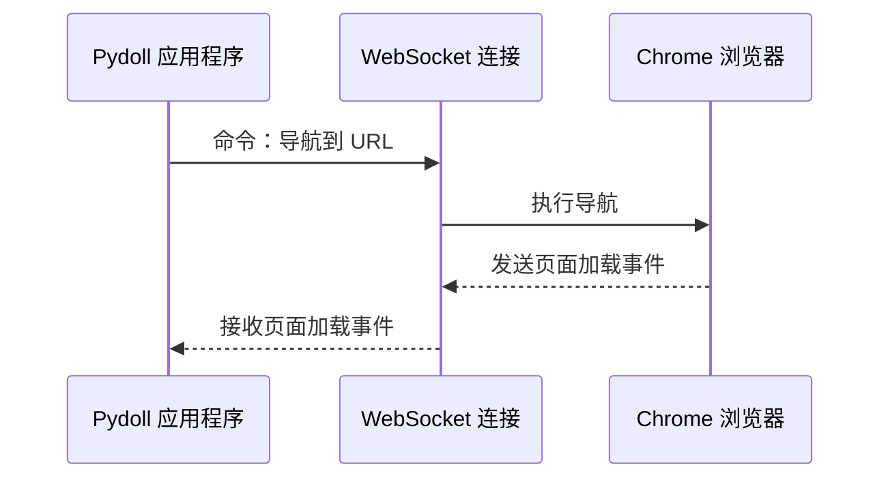
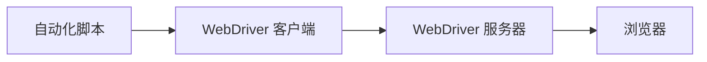
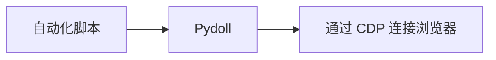
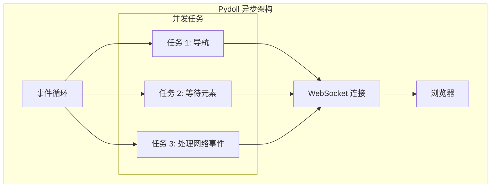

# Chrome 开发者工具协议 (CDP)

Chrome 开发者工具协议 (CDP) 是 Pydoll 能够在没有传统 webdriver 的情况下控制浏览器的基础。理解 CDP 的工作原理有助于深入了解 Pydoll 的功能和内部架构。


## 什么是 CDP？

Chrome 开发者工具协议是 Chromium 团队开发的一个强大接口，允许通过编程方式与基于 Chromium 的浏览器进行交互。它与您检查网页时 Chrome 开发者工具所使用的协议相同，但它作为可编程 API 暴露出来，可供自动化工具利用。

CDP 的核心是提供了一套全面的方法和事件，用于与浏览器内部进行交互。这使得我们可以精细控制浏览器的各个方面，从页面导航到操作 DOM、拦截网络请求和监控性能指标。

!!! info "CDP 的演进"
    自推出以来，Chrome 开发者工具协议一直在不断发展。Google 随着每个 Chrome 版本的发布都会维护和更新该协议，定期添加新功能并改进现有特性。
    
    虽然该协议最初是为 Chrome 的开发者工具设计的，但其全面的功能已使其成为下一代浏览器自动化工具（如 Puppeteer、Playwright，当然还有 Pydoll）的基础。

## WebSocket 通信

CDP 在架构上的一个关键决策是使用 WebSocket 进行通信。当基于 Chromium 的浏览器以启用远程调试标志启动时，它会在指定端口上打开一个 WebSocket 服务器：

```
chrome --remote-debugging-port=9222
```

Pydoll 连接到此 WebSocket 端点，以与浏览器建立双向通信通道。该连接：

1.  在整个自动化会话期间 **保持持久性**
2.  使浏览器能够将 **实时事件** 推送给客户端
3.  允许向浏览器 **发送命令**
4.  **支持二进制数据**，以高效传输屏幕截图、PDF 和其他资产

WebSocket 协议特别适用于浏览器自动化，因为它提供：

- **低延迟通信** - 响应式自动化所必需
- **双向消息传递** - 事件驱动架构的基础
- **持久连接** - 消除了每个操作的连接设置开销

以下是 Pydoll 与浏览器通信方式的简化视图：



!!! info "WebSocket vs HTTP"
    早期的浏览器自动化协议通常依赖 HTTP 端点进行通信。CDP 转向 WebSocket 代表了一项重大的架构改进，可实现响应更灵敏的自动化和实时事件监控。
    
    基于 HTTP 的协议需要持续轮询以检测变化，这会产生开销和延迟。WebSocket 允许浏览器在事件发生时立即将通知推送给您的自动化脚本，延迟极小。

## 关键 CDP 域

CDP 被组织成逻辑域，每个域负责浏览器功能的特定方面。一些最重要的域包括：


| 域 (Domain) | 职责 | 示例用例 |
|---|---|---|
| **Browser** | 控制浏览器应用程序本身 | 窗口管理、浏览器上下文创建 |
| **Page** | 与页面生命周期交互 | 导航、JavaScript 执行、框架管理 |
| **DOM** | 访问页面结构 | 查询选择器、属性修改、事件监听器 |
| **Network** | 网络流量监控和控制 | 请求拦截、响应检查、缓存 |
| **Runtime** | JavaScript 执行环境 | 评估表达式、调用函数、处理异常 |
| **Input** | 模拟用户交互 | 鼠标移动、键盘输入、触摸事件 |
| **Target** | 管理浏览器上下文和目标 | 创建标签页、访问 iframe、处理弹出窗口 |
| **Fetch** | 底层网络拦截 | 修改请求、模拟响应、身份验证 |

Pydoll 将这些 CDP 域映射到更直观的 API 结构中，同时保留了底层协议的全部功能。

## 事件驱动架构

CDP 最强大的功能之一是其事件系统。该协议允许客户端订阅浏览器在正常操作期间发出的各种事件。这些事件几乎涵盖了浏览器行为的各个方面：

- **生命周期事件**：页面加载、框架导航、目标创建
- **DOM 事件**：元素变化、属性修改
- **网络事件**：请求/响应周期、WebSocket 消息
- **执行事件**：JavaScript 异常、控制台消息
- **性能事件**：渲染、脚本和更多指标


当您在 Pydoll 中启用事件监控时（例如，使用 `page.enable_network_events()`），库会与浏览器设置必要的订阅，并为您的代码提供钩子以对这些事件做出反应。

```python
from pydoll.events.network import NetworkEvents
from functools import partial

async def on_request(page, event):
    url = event['params']['request']['url']
    print(f"Request to: {url}")

# 订阅网络请求事件
await page.enable_network_events()
await page.on(NetworkEvents.REQUEST_WILL_BE_SENT, partial(on_request, page))
```

这种事件驱动的方法允许自动化脚本立即对浏览器状态变化做出反应，而无需依赖低效的轮询或任意延迟。

## 直接 CDP 集成的性能优势

像 Pydoll 那样直接使用 CDP，与传统的基于 webdriver 的自动化相比，具有多种性能优势：

### 1. 消除协议转换层

传统的基于 webdriver 的工具（如 Selenium）使用多层方法：



每一层都会增加开销，尤其是 WebDriver 服务器，它充当 WebDriver 协议和浏览器本机 API 之间的转换层。

Pydoll 的方法将其简化为：



这种直接通信消除了中间服务器的计算和网络开销，从而加快了操作速度。

### 2. 高效的命令批处理

CDP 允许在单个消息中批处理多个命令，减少了复杂操作所需的往返次数。这对于需要多个步骤的操作（例如查找元素然后与其交互）特别有价值。

### 3. 异步操作

CDP 基于 WebSocket、事件驱动的架构与 Python 的 asyncio 框架完美契合，可实现真正的异步操作。这使得 Pydoll 能够：

- 并发执行多个操作
- 在事件发生时处理它们
- 在 I/O 操作期间避免阻塞主线程



!!! info "异步性能提升"
    asyncio 和 CDP 的结合对性能产生了倍增效应。在基准测试中，Pydoll 的异步方法可以以接近线性的扩展性并行处理多个页面，而传统的同步工具在并发性增加时收益递减。
    
    例如，使用同步工具抓取 10 个各需 2 秒加载的页面可能需要超过 20 秒，但使用 Pydoll 的异步架构（加上一些最小的开销）仅需 2 秒多一点。

### 4. 精细的控制

CDP 提供了比 WebDriver 协议更精细的浏览器行为控制。这使得 Pydoll 能够为常见操作实施优化策略：

- 更精确的等待条件（而非任意超时）
- 直接访问浏览器缓存和存储
- 在特定上下文中定向执行 JavaScript
- 详细的网络控制以优化请求


## 结论

Chrome 开发者工具协议构成了 Pydoll 零 webdriver 浏览器自动化方法的基础。通过利用 CDP 的 WebSocket 通信、全面的域覆盖、事件驱动架构和直接的浏览器集成，Pydoll 实现了优于传统自动化工具的性能和可靠性。

在接下来的部分中，我们将更深入地探讨 Pydoll 如何实现特定的 CDP 域，并将低级协议转换为直观、对开发人员友好的 API。
