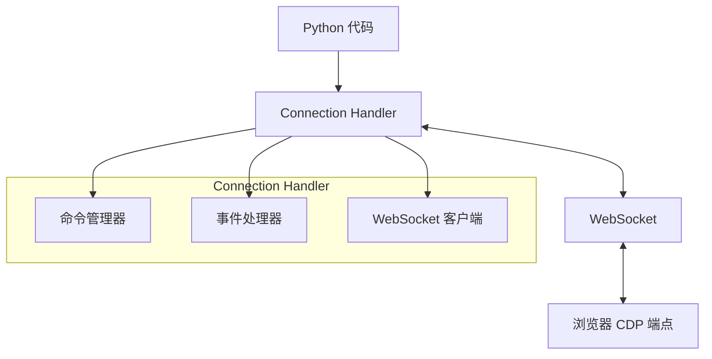
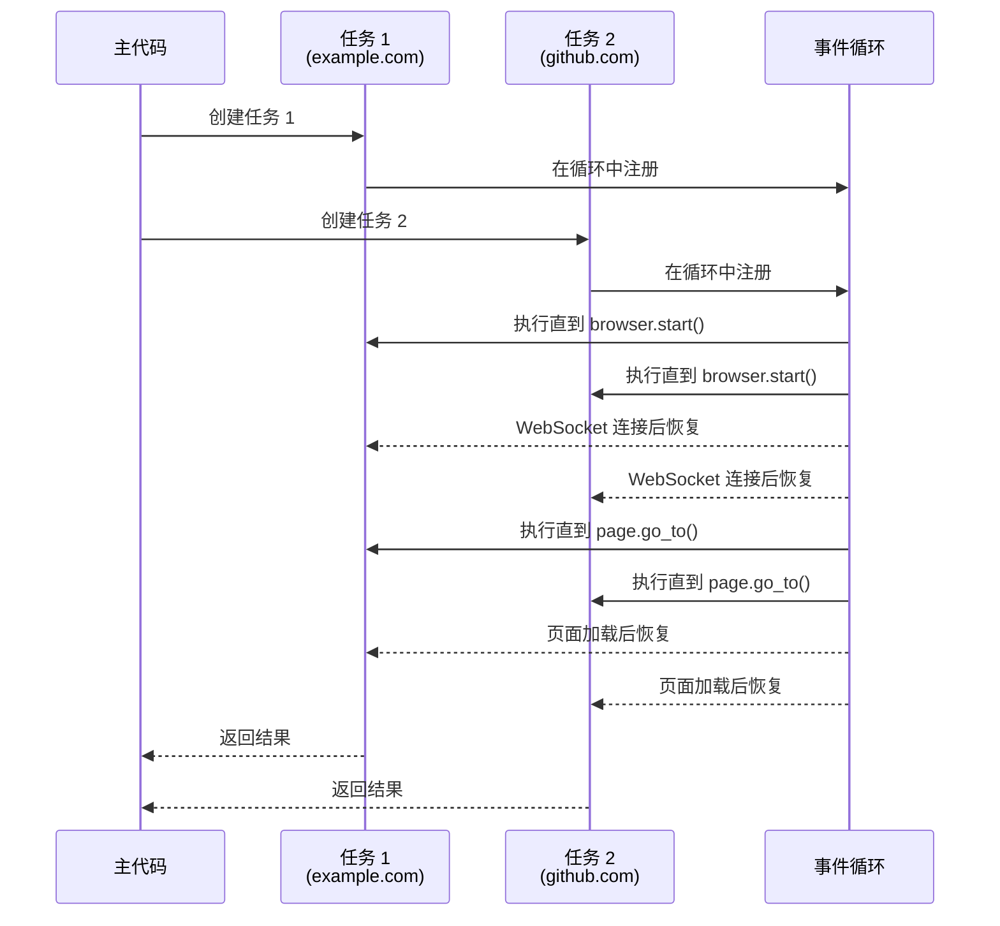
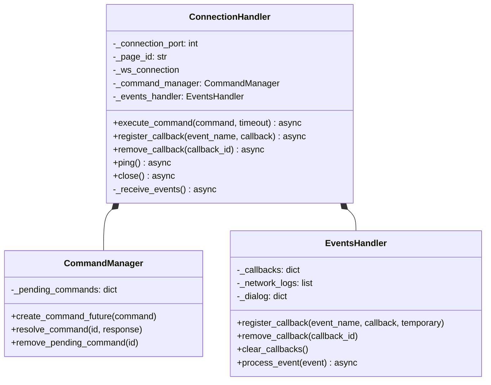
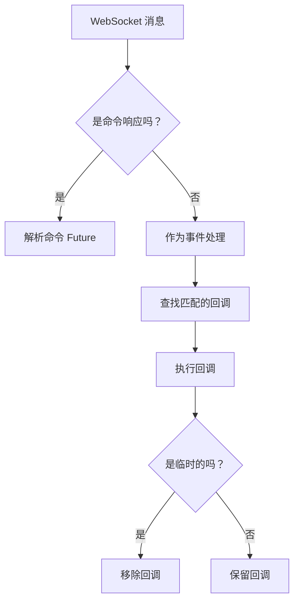
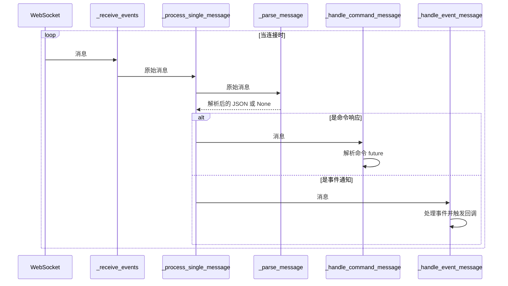

# Connection Handler (连接处理器)

Connection Handler 是 Pydoll 架构的基础层，充当 Python 代码与浏览器 Chrome DevTools Protocol (CDP) 之间的桥梁。该组件管理与浏览器的 WebSocket 连接，处理命令执行，并以非阻塞、异步的方式处理事件。



## 异步编程模型

Pydoll 构建于 Python 的 `asyncio` 框架之上，该框架支持非阻塞 I/O 操作。这种设计选择对于高性能的浏览器自动化至关重要，因为它允许多个操作并发执行，而无需等待每个操作完成。

### 理解 Async/Await


为了理解 async/await 在实践中如何工作，让我们看一个包含两个并发操作的更详细的示例：

```python
import asyncio
from pydoll.browser.chrome import Chrome

async def fetch_page_data(url):
    print(f"开始抓取 {url}")
    browser = Chrome()
    await browser.start()
    page = await browser.get_page()
    
    # 导航需要时间 - 这是我们让出控制权的地方
    await page.go_to(url)
    
    # 获取页面标题
    title = await page.execute_script("return document.title")
    
    # 提取一些数据
    description = await page.execute_script(
        "return document.querySelector('meta[name=\"description\"]')?.content || ''"
    )
    
    await browser.stop()
    print(f"完成抓取 {url}")
    return {"url": url, "title": title, "description": description}

async def main():
    # 并发启动两个页面操作
    task1 = asyncio.create_task(fetch_page_data("https://example.com"))
    task2 = asyncio.create_task(fetch_page_data("https://github.com"))
    
    # 等待两者完成并获取结果
    result1 = await task1
    result2 = await task2
    
    return [result1, result2]

# 运行异步函数
results = asyncio.run(main())
```

此示例演示了我们如何并发地从两个不同的网站获取数据，与顺序执行相比，这可能将总执行时间缩短近一半。

#### 异步执行流程图

以下是执行上述代码时事件循环中发生的情况：



此序列图说明了 Python 的 asyncio 如何管理我们示例代码中的两个并发任务：

1.  主函数创建两个任务，用于从不同网站获取数据
2.  两个任务都在事件循环中注册
3.  事件循环执行每个任务，直到遇到 `await` 语句（如 `browser.start()`）
4.  当异步操作完成时（如 WebSocket 连接建立），任务恢复执行
5.  循环在每个 `await` 点继续在任务之间切换
6.  当每个任务完成时，它将其结果返回给主函数

在 `fetch_page_data` 示例中，这允许两个浏览器实例并发工作 - 当一个实例等待页面加载时，另一个实例可以取得进展。这比顺序处理每个网站要高效得多，因为 I/O 等待时间不会阻塞其他任务的执行。

!!! info "协作式多任务"
    Asyncio 使用协作式多任务，其中任务在 `await` 点自愿让出控制权。这不同于抢占式多任务（线程），后者中任务可能在任何时候被中断。协作式多任务可以为 I/O 密集型操作提供更好的性能，但需要仔细编码以避免阻塞事件循环。

## Connection Handler 实现

`ConnectionHandler` 类旨在管理命令执行和事件处理，为 CDP WebSocket 连接提供了一个健壮的接口。

### 类初始化

```python
def __init__(
    self,
    connection_port: int,
    page_id: str = 'browser',
    ws_address_resolver: Callable[[int], str] = get_browser_ws_address,
    ws_connector: Callable = websockets.connect,
):
    # 初始化组件...
```

ConnectionHandler 接受几个参数：

| 参数 | 类型 | 描述 |
|---|---|---|
| `connection_port` | `int` | 浏览器 CDP 端点正在监听的端口号 |
| `page_id` | `str` | 特定页面/目标的标识符（用于浏览器级别的连接时使用 'browser'） |
| `ws_address_resolver` | `Callable` | 从端口号解析 WebSocket URL 的函数 |
| `ws_connector` | `Callable` | 建立 WebSocket 连接的函数 |

### 内部组件

ConnectionHandler 协调三个主要组件：

1.  **WebSocket 连接**：管理与浏览器的实际 WebSocket 通信
2.  **命令管理器**：处理发送命令和接收响应
3.  **事件处理器**：处理来自浏览器的事件并触发适当的回调



## 命令执行流程

通过 CDP 执行命令时，ConnectionHandler 遵循特定模式：

1.  确保存在活动的 WebSocket 连接
2.  创建一个 Future 对象来表示挂起的响应
3.  通过 WebSocket 发送命令
4.  等待 Future 被响应解析
5.  将响应返回给调用者

```python
async def execute_command(self, command: dict, timeout: int = 10) -> dict:
    # 验证命令
    if not isinstance(command, dict):
        logger.error('Command must be a dictionary.')
        raise exceptions.InvalidCommand('Command must be a dictionary')

    # 确保连接处于活动状态
    await self._ensure_active_connection()
    
    # 为此命令创建 future
    future = self._command_manager.create_command_future(command)
    command_str = json.dumps(command)

    # 发送命令并等待响应
    try:
        await self._ws_connection.send(command_str)
        response: str = await asyncio.wait_for(future, timeout)
        return json.loads(response)
    except asyncio.TimeoutError as exc:
        self._command_manager.remove_pending_command(command['id'])
        raise exc
    except websockets.ConnectionClosed as exc:
        await self._handle_connection_loss()
        raise exc
```

!!! warning "命令超时"
    未在指定超时期限内收到响应的命令将引发 `TimeoutError`。这可以防止自动化脚本因缺少响应而无限期挂起。默认超时为 10 秒，但可以根据复杂操作的预期响应时间进行调整。

## 事件处理系统

事件系统是启用 Pydoll 中反应式编程模式的关键架构组件。它允许您为特定浏览器事件注册回调，并在这些事件发生时自动执行它们。

### 事件流

事件处理流程遵循以下步骤：

1.  `_receive_events` 方法作为后台任务运行，持续从 WebSocket 接收消息
2.  每条消息被解析并分类为命令响应或事件
3.  事件被传递给 EventsHandler 进行处理
4.  EventsHandler 识别该事件已注册的回调并调用它们



### 回调注册

ConnectionHandler 提供了注册、移除和管理事件回调的方法：

```python
# 为特定事件注册回调
callback_id = await connection.register_callback(
    'Page.loadEventFired', 
    handle_page_load
)

# 移除特定回调
await connection.remove_callback(callback_id)

# 移除所有回调
await connection.clear_callbacks()
```

!!! tip "临时回调"
    您可以将回调注册为临时的，这意味着它在触发一次后将自动移除。这对于一次性事件（如处理对话框）很有用：
    
    ```python
    await connection.register_callback(
        'Page.javascriptDialogOpening',
        handle_dialog,
        temporary=True
    )
    ```

### 异步回调执行

回调可以是同步函数或异步协程。EventsHandler（由 ConnectionHandler 管理）可以正确处理这两种类型：

```python
# 同步回调
def synchronous_callback(event):
    print(f"Event received: {event['method']}")

# 异步回调
async def asynchronous_callback(event):
    await asyncio.sleep(0.1)  # 执行一些异步操作
    print(f"Event processed asynchronously: {event['method']}")

# 两者都可以用相同的方式注册
await connection.register_callback('Network.requestWillBeSent', synchronous_callback)
await connection.register_callback('Network.responseReceived', asynchronous_callback)
```

**顺序执行模型：**

异步回调由 EventsManager **顺序等待 (await)**。这确保了对于单个事件，回调按照它们注册的顺序执行，防止了多个回调修改共享状态时出现竞争条件。

```python
# 在 EventsManager.process_event() 内部
for callback_data in callbacks:
    if asyncio.iscoroutinefunction(callback_data['callback']):
        await callback_data['callback'](event_data)  # 顺序 await
    else:
        callback_data['callback'](event_data)  # 同步执行
```

**非阻塞执行**（用于不应阻塞其他操作的 UI 回调）是在 **更高层** 实现的，例如在 `Tab.on()` 方法中，它在注册用户回调之前将其包装在 `asyncio.create_task()` 中。这种架构提供了：

- **底层** (ConnectionHandler/EventsManager)：保证顺序执行和可预测的顺序
- **高层** (Tab.on())：在需要时提供非阻塞语义

!!! info "事件架构详情"
    有关多层事件系统和顺序回调执行原理的完整详细信息，请参阅 [事件架构深入探讨](../architecture/event-architecture.md)。

## 连接管理

ConnectionHandler 实现了多种策略以确保连接的健壮性：

### 延迟连接建立

仅在需要时才建立连接，通常是在执行第一个命令时或明确请求时。这种延迟初始化方法可以节省资源，并允许更灵活的连接管理。

### 自动重新连接

如果 WebSocket 连接意外丢失或关闭，ConnectionHandler 将在执行下一个命令时尝试自动重新建立连接。这提供了对瞬态网络问题的弹性。

```python
async def _ensure_active_connection(self):
    """
    保证在继续之前存在活动连接。
    """
    if self._ws_connection is None or self._ws_connection.closed:
        await self._establish_new_connection()
```

### 资源清理

ConnectionHandler 实现了显式清理方法和 Python 的异步上下文管理器协议（`__aenter__` 和 `__aexit__`），确保在不再需要资源时正确释放它们：

```python
async def close(self):
    """
    关闭 WebSocket 连接并清除所有回调。
    """
    await self.clear_callbacks()
    if self._ws_connection is not None:
        try:
            await self._ws_connection.close()
        except websockets.ConnectionClosed as e:
            logger.info(f'WebSocket connection has closed: {e}')
        logger.info('WebSocket connection closed.')
```

!!! info "上下文管理器用法"
    将 ConnectionHandler 用作上下文管理器是确保正确清理资源的的推荐模式：
    
    ```python
    async with ConnectionHandler(9222, 'browser') as connection:
        # 使用连接...
        await connection.execute_command(...)
    # 退出上下文时自动关闭连接
    ```

## 消息处理管道

ConnectionHandler 实现了一个复杂的消息处理管道，用于处理来自 WebSocket 连接的连续消息流：



该管道确保了命令响应和异步事件的高效处理，使 Pydoll 即使在大量消息的情况下也能保持响应灵敏的操作。

## 高级用法

ConnectionHandler 通常通过 Browser 和 Page 类间接使用，但也可以直接用于高级场景：

### 直接事件监控

对于特殊用例，您可能希望绕过更高级别的 API，直接监控特定的 CDP 事件：

```python
from pydoll.connection.connection import ConnectionHandler

async def monitor_network():
    connection = ConnectionHandler(9222)
    
    async def log_request(event):
        url = event['params']['request']['url']
        print(f"Request: {url}")
    
    await connection.register_callback(
        'Network.requestWillBeSent', 
        log_request
    )
    
    # 通过 CDP 命令启用网络事件
    await connection.execute_command({
        "id": 1,
        "method": "Network.enable"
    })
    
    # 持续运行直到被中断
    try:
        while True:
            await asyncio.sleep(1)
    finally:
        await connection.close()
```

### 自定义命令执行

您可以直接执行任意 CDP 命令：

```python
async def custom_cdp_command(connection, method, params=None):
    command = {
        "id": random.randint(1, 10000),
        "method": method,
        "params": params or {}
    }
    return await connection.execute_command(command)

# 示例：不使用 Page 类获取文档 HTML
async def get_html(connection):
    result = await custom_cdp_command(
        connection,
        "Runtime.evaluate",
        {"expression": "document.documentElement.outerHTML"}
    )
    return result['result']['result']['value']
```

!!! warning "高级接口"
    直接使用 ConnectionHandler 需要深入了解 Chrome DevTools 协议。对于大多数用例，更高级别的 Browser 和 Page API 提供了更直观、更安全的接口。


## 高级并发模式

ConnectionHandler 的异步设计支持复杂的并发模式：

### 并行命令执行

并发执行多个命令并等待所有结果：

```python
async def get_page_metrics(connection):
    commands = [
        {"id": 1, "method": "Performance.getMetrics"},
        {"id": 2, "method": "Network.getResponseBody", "params": {"requestId": "..."}},
        {"id": 3, "method": "DOM.getDocument"}
    ]
    
    results = await asyncio.gather(
        *(connection.execute_command(cmd) for cmd in commands)
    )
    
    return results
```

## 结论

ConnectionHandler 是 Pydoll 架构的基础，为 Chrome DevTools 协议提供了健壮、高效的接口。通过利用 Python 的 asyncio 框架和 WebSocket 通信，它支持高性能的浏览器自动化，并具有优雅的、事件驱动的编程模式。

理解 ConnectionHandler 的设计和操作，有助于深入了解 Pydoll 的内部工作原理，并为在特殊场景下进行高级定制和优化提供了机会。

对于大多数用例，您将通过更高级别的 Browser 和 Page API 间接与 ConnectionHandler 交互，这些 API 提供了更直观的接口，同时利用了 ConnectionHandler 的强大功能。