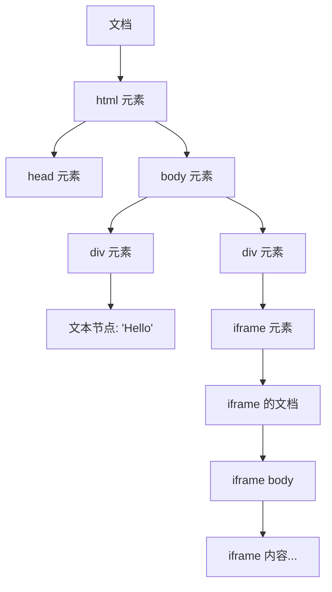
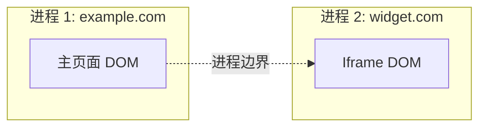
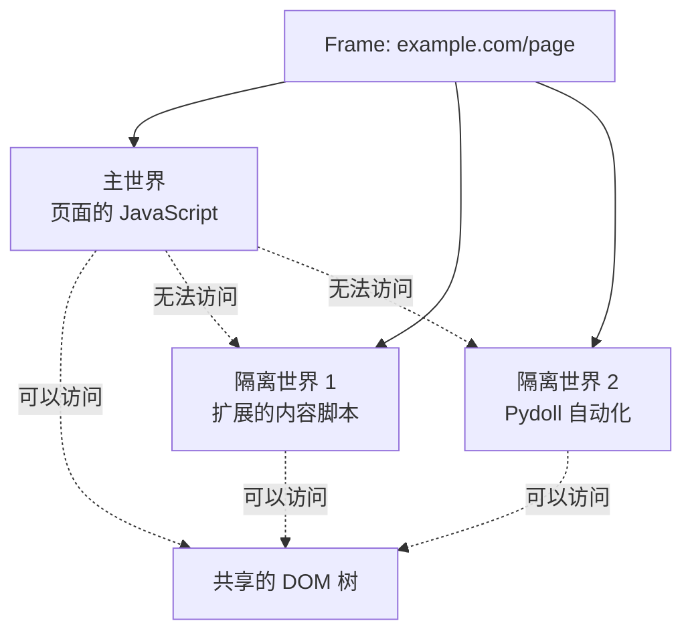
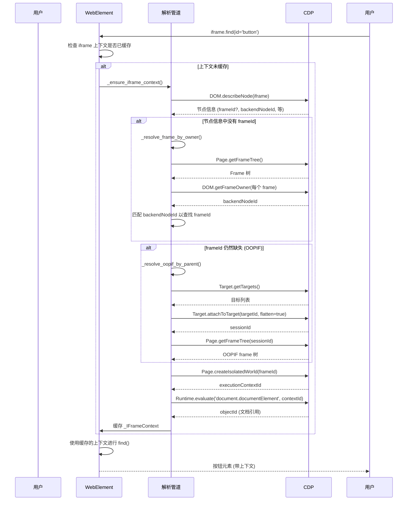
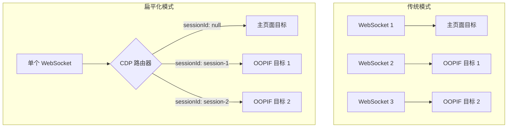

# Iframes、OOPIF 和执行上下文（深度解析）

理解浏览器自动化如何处理 iframe 对于构建健壮的自动化工具至关重要。本综合指南探讨了 Pydoll 中 iframe 处理的技术基础，涵盖了文档对象模型 (DOM)、Chrome DevTools 协议 (CDP) 机制、执行上下文、隔离世界 (isolated worlds) 以及使 iframe 交互变得无缝的复杂解析管道。

!!! info "实用用法优先"
    如果您只需要在自动化脚本中使用 iframe，请从功能指南开始：**功能 → 自动化 → IFrames**。
    本深度解析解释了架构决策、协议的细微差别以及内部实现细节。

---

## 目录

1. [基础：文档对象模型 (DOM)](#基础文档对象模型-dom)
2. [什么是 Iframes 及其重要性](#什么是-iframes-及其重要性)
3. [挑战：跨进程 Iframes (OOPIFs)](#挑战跨进程-iframes-oopifs)
4. [Chrome DevTools 协议和 Frame 管理](#chrome-devtools-协议和-frame-管理)
5. [执行上下文和隔离世界](#执行上下文和隔离世界)
6. [CDP 标识符参考](#cdp-标识符参考)
7. [Pydoll 的解析管道](#pydoll-的解析管道)
8. [会话路由和扁平化模式](#会话路由和扁平化模式)
9. [实现深度解析](#实现深度解析)
10. [性能考量](#性能考量)
11. [失败模式和调试](#失败模式和调试)

---

## 基础：文档对象模型 (DOM)

在深入研究 iframe 之前，我们必须了解 DOM——在内存中表示 HTML 文档的树形结构。

### 什么是 DOM？

**文档对象模型** (Document Object Model) 是 HTML 和 XML 文档的编程接口。它将页面结构表示为一个节点树，其中每个节点对应文档的一部分：

- **元素节点**：HTML 标签，如 `<div>`、`<iframe>`、`<button>`
- **文本节点**：实际的文本内容
- **属性节点**：元素属性，如 `id`、`class`、`src`
- **文档节点**：树的根节点



### DOM 树属性

1. **层级结构**：每个节点都有一个父节点（Document 除外），并且可以有子节点
2. **节点标识**：节点可以通过以下方式标识：
   - `nodeId`：文档上下文（DOM 域）内的内部标识符
   - `backendNodeId`：可以跨不同文档引用节点的稳定标识符
3. **实时表示**：对 DOM 的更改会立即反映在树中

### 为什么这对 Iframes 很重要

每个 `<iframe>` 元素都会创建一个**新的、独立的 DOM 树**。 iframe 元素本身存在于父级的 DOM 中，但加载到 iframe 中的内容拥有自己完整的 Document 节点和树结构。这种分离是所有 iframe 复杂性的基础。

---

## 什么是 Iframes 及其重要性

### 定义

**iframe**（内联框架）是一个 HTML 元素（`<iframe>`），它在当前页面中嵌入另一个 HTML 文档。被嵌入的文档保持其自己的上下文，包括：

- 独立的 HTML 结构和 DOM 树
- 独立的 JavaScript 执行环境
- 自己的 CSS 样式（除非明确共享）
- 不同的导航历史

```html
<body>
  <h1>父页面</h1>
  <iframe src="https://example.com/embedded.html" id="content-frame"></iframe>
  <p>更多父页面内容</p>
</body>
```

### 常见用例

| 用例 | 描述 | 示例 |
|----------|-------------|---------|
| **第三方小部件** | 安全地嵌入外部内容 | 支付表单、社交媒体 feeds、聊天窗口 |
| **内容隔离** | 沙盒化不受信任的内容 | 用户生成的 HTML、广告 |
| **模块化架构** | 可重用组件 | 仪表盘小部件、插件系统 |
| **跨域内容** | 从不同域加载资源 | 地图、视频播放器、分析仪表盘 |

### 安全模型：同源策略 (Same-Origin Policy)

浏览器对 iframes 强制执行**同源策略**：

- **同源 iframes**：父级可以通过 JavaScript 访问 iframe 的 DOM (`iframe.contentDocument`)
- **跨域 iframes**：父级不能直接访问 iframe 的 DOM（安全限制）

这个安全边界就是为什么自动化工具需要特殊机制（如 CDP）来与 iframe 内容交互。

!!! warning "对自动化很重要"
    由于浏览器安全限制，传统的基于 JavaScript 的自动化（如 Selenium 的早期方法）无法直接访问跨域 iframe 的内容。CDP 在更底层运行，出于调试目的绕过了这个限制。

---

## 挑战：跨进程 Iframes (OOPIFs)

### 什么是 OOPIFs？

现代 Chromium 使用**站点隔离 (site isolation)** 来提高安全性和稳定性。这意味着不同的源 (origin) 可能会在单独的操作系统进程中渲染。来自不同源的 iframe 会成为**跨进程 Iframe (OOPIF)**。



### 为什么 OOPIFs 使自动化复杂化

| 方面 | 进程内 Iframe | 跨进程 Iframe (OOPIF) |
|--------|-------------------|-------------------------------|
| **DOM 访问** | 内存中共享的文档树 | 拥有自己文档的独立目标 (target) |
| **命令路由** | 单个连接 | 需要目标附加 (target attachment) 和会话路由 (session routing) |
| **Frame 树** | 所有 frames 在一棵树中 | 根 frame + OOPIFs 的独立目标 |
| **JavaScript 上下文** | 相同的执行上下文 | 每个进程有不同的执行上下文 |
| **CDP 通信** | 直接命令 | 命令必须包含 `sessionId` |

### 传统方法（手动切换上下文）

没有复杂的处理，自动化 OOPIFs 需要：

```python
# 其他工具的传统（手动）方法
main_page = browser.get_page()
iframe_element = main_page.find_element_by_id("iframe-id")

# 必须手动切换上下文
driver.switch_to.frame(iframe_element)

# 现在命令指向 iframe
button = driver.find_element_by_id("button-in-iframe")
button.click()

# 必须手动切换回来
driver.switch_to.default_content()
```

**这种方法的问题：**

1. **开发者负担**：每个 iframe 都需要显式的上下文管理
2. **嵌套 iframes**：每一层都需要再次切换
3. **OOPIF 检测**：很难知道何时需要手动附加
4. **容易出错**：忘记切换回来 → 后续命令失败
5. **不可组合**：辅助函数必须知道它们所处的 iframe 上下文

### Pydoll 的解决方案：透明的上下文解析

Pydoll 通过自动解析 iframe 上下文来消除手动上下文切换：

```python
# Pydoll 方法（无手动切换）
iframe = await tab.find(id="iframe-id")
button = await iframe.find(id="button-in-iframe")
await button.click()

# 嵌套 iframes？同样的模式
outer = await tab.find(id="outer-iframe")
inner = await outer.find(tag_name="iframe")
button = await inner.find(text="Submit")
await button.click()
```

复杂性在内部处理。让我们来探究一下是如何做到的。

---

## Chrome DevTools 协议和 Frame 管理

正如在 [深度解析 → 基础 → Chrome DevTools 协议](./cdp.md) 中讨论的，CDP 通过 WebSocket 通信提供全面的浏览器控制。Frame 管理分散在多个 CDP 域中。

### 相关的 CDP 域

#### 1. **Page 域**

管理页面生命周期、frames 和导航。

**关键方法：**

- `Page.getFrameTree()`：返回页面中所有 frames 的层级结构
  ```json
  {
    "frameTree": {
      "frame": {
        "id": "main-frame-id",
        "url": "https://example.com",
        "securityOrigin": "https://example.com",
        "mimeType": "text/html"
      },
      "childFrames": [
        {
          "frame": {
            "id": "child-frame-id",
            "parentId": "main-frame-id",
            "url": "https://widget.com/embed"
          }
        }
      ]
    }
  }
  ```

- `Page.createIsolatedWorld(frameId, worldName)`：在特定 frame 中创建一个新的 JavaScript 执行上下文
  ```json
  {
    "executionContextId": 42
  }
  ```

**Pydoll 用法：**

```python
# 源自 pydoll/elements/web_element.py
@staticmethod
async def _get_frame_tree_for(
    handler: ConnectionHandler, session_id: Optional[str]
) -> FrameTree:
    """获取给定连接/目标的 Page frame 树。"""
    command = PageCommands.get_frame_tree()
    if session_id:
        command['sessionId'] = session_id
    response: GetFrameTreeResponse = await handler.execute_command(command)
    return response['result']['frameTree']
```

#### 2. **DOM 域**

提供对 DOM 结构的访问。

**关键方法：**

- `DOM.describeNode(objectId)`：返回有关 DOM 节点的详细信息
  ```json
  {
    "node": {
      "nodeId": 123,
      "backendNodeId": 456,
      "nodeName": "IFRAME",
      "frameId": "parent-frame-id",
      "contentDocument": {
        "frameId": "iframe-frame-id",
        "documentURL": "https://embedded.com/page.html"
      }
    }
  }
  ```

- `DOM.getFrameOwner(frameId)`：返回拥有某个 frame 的 `<iframe>` 元素的 `backendNodeId`
  ```json
  {
    "backendNodeId": 456
  }
  ```

**Pydoll 用法：**

```python
# 源自 pydoll/elements/web_element.py
@staticmethod
async def _owner_backend_for(
    handler: ConnectionHandler, session_id: Optional[str], frame_id: str
) -> Optional[int]:
    """获取拥有给定 frame 的 DOM 元素的 backendNodeId。"""
    command = DomCommands.get_frame_owner(frame_id=frame_id)
    if session_id:
        command['sessionId'] = session_id
    response: GetFrameOwnerResponse = await handler.execute_command(command)
    return response.get('result', {}).get('backendNodeId')
```

#### 3. **Target 域**

管理浏览器目标（页面、iframes、workers 等）。

**关键方法：**

- `Target.getTargets()`：列出所有可用的目标
  ```json
  {
    "targetInfos": [
      {
        "targetId": "page-target-id",
        "type": "page",
        "title": "Main Page",
        "url": "https://example.com"
      },
      {
        "targetId": "iframe-target-id",
        "type": "iframe",
        "title": "",
        "url": "https://widget.com/embed",
        "parentFrameId": "main-frame-id"
      }
    ]
  }
  ```

- `Target.attachToTarget(targetId, flatten)`：附加到一个目标以进行调试
  - 当 `flatten=true` 时：返回一个 `sessionId` 用于在扁平化模式下路由命令
  - 所有通信都通过同一个 WebSocket 进行，通过 `sessionId` 区分

**Pydoll 用法：**

```python
# 源自 pydoll/elements/web_element.py (简化版)
async def _resolve_oopif_by_parent(self, parent_frame_id: str, ...):
    """使用父 frame id 解析 OOPIF。"""
    browser_handler = ConnectionHandler(...)
    targets_response: GetTargetsResponse = await browser_handler.execute_command(
        TargetCommands.get_targets()
    )
    target_infos = targets_response.get('result', {}).get('targetInfos', [])
    
    # 查找 parentFrameId 匹配的目标
    direct_children = [
        target_info for target_info in target_infos
        if target_info.get('parentFrameId') == parent_frame_id
    ]
    
    if direct_children:
        attach_response: AttachToTargetResponse = await browser_handler.execute_command(
            TargetCommands.attach_to_target(
                target_id=direct_children[0]['targetId'], 
                flatten=True
            )
        )
        attached_session_id = attach_response.get('result', {}).get('sessionId')
        # ... 对后续命令使用 session_id
```

#### 4. **Runtime 域**

执行 JavaScript 并管理执行上下文。

**关键方法：**

- `Runtime.evaluate(expression, contextId)`：在特定的执行上下文中评估 JavaScript
- `Runtime.callFunctionOn(functionDeclaration, objectId)`：在一个特定对象上调用函数（作为 `this`）

**Pydoll 用于 iframe 文档访问的用法：**

```python
# 源自 pydoll/elements/web_element.py
async def _set_iframe_document_object_id(self, execution_context_id: int):
    """在 iframe 上下文中评估 document.documentElement 并缓存其 object id。"""
    evaluate_command = RuntimeCommands.evaluate(
        expression='document.documentElement',
        context_id=execution_context_id,
    )
    if self._iframe_context and self._iframe_context.session_id:
        evaluate_command['sessionId'] = self._iframe_context.session_id
    
    evaluate_response: EvaluateResponse = await (
        (self._iframe_context.session_handler if self._iframe_context else None)
        or self._connection_handler
    ).execute_command(evaluate_command)
    
    document_object_id = evaluate_response.get('result', {}).get('result', {}).get('objectId')
    if self._iframe_context:
        self._iframe_context.document_object_id = document_object_id
```

---

## 执行上下文和隔离世界

### 什么是执行上下文？

**执行上下文** (execution context) 是执行 JavaScript 代码的环境。浏览器中的每个 frame 至少有一个执行上下文。该上下文包括：

- **全局对象**（在浏览器中是 `window`）
- **作用域链**：如何解析变量
- **This 绑定**：`this` 指向什么
- **变量环境**：所有声明的变量和函数

### 每个 Frame 的多个上下文

单个 frame 可以有多个执行上下文：

1. **主世界 (main world)（默认上下文）**：页面自己的 JavaScript 运行的地方
2. **隔离世界 (isolated worlds)**：共享相同 DOM 但具有不同 JavaScript 全局作用域的独立上下文



### 什么是隔离世界？

**隔离世界** (isolated world) 是一个独立的 JavaScript 执行上下文，它：

- **共享相同的 DOM**：可以读取/修改 DOM 元素
- **拥有独立的全局对象**：变量/函数不会在世界之间泄漏
- **防止干扰**：页面脚本无法检测或干扰隔离世界中的脚本

**起源**：隔离世界是为浏览器扩展创建的。内容脚本 (Content scripts) 运行在隔离世界中，因此它们可以与页面 DOM 交互，而不会：

- 被页面脚本覆盖其变量
- 被防篡改代码检测到
- 与页面的 JavaScript 冲突

### 为什么 Pydoll 对 Iframes 使用隔离世界

当 Pydoll 与 iframe 内容交互时，它会在该 iframe 的上下文中创建一个隔离世界。这提供了：

1. **干净的 JavaScript 环境**：与 iframe 自己的脚本没有冲突
2. **一致的行为**：无论 iframe 运行什么 JavaScript，自动化脚本都能工作
3. **反检测**：iframe 的 JavaScript 无法轻易检测到 Pydoll 的存在
4. **安全的评估**：自动化代码不会意外触发页面逻辑

**实现：**

```python
# 源自 pydoll/elements/web_element.py
@staticmethod
async def _create_isolated_world_for_frame(
    frame_id: str,
    handler: ConnectionHandler,
    session_id: Optional[str],
) -> int:
    """为给定的 frame 创建一个隔离世界 (Page.createIsolatedWorld)。"""
    create_command = PageCommands.create_isolated_world(
        frame_id=frame_id,
        world_name=f'pydoll::iframe::{frame_id}',
        grant_universal_access=True,
    )
    if session_id:
        create_command['sessionId'] = session_id
    
    create_response: CreateIsolatedWorldResponse = await handler.execute_command(
        create_command
    )
    execution_context_id = create_response.get('result', {}).get('executionContextId')
    if not execution_context_id:
        raise InvalidIFrame('无法为 iframe 创建隔离世界')
    return execution_context_id
```

`grant_universal_access=True` 参数允许隔离世界：

- 访问跨域 frames（通常被同源策略阻止）
- 执行自动化所需的特权操作

!!! tip "实践中的隔离世界"
    每当您使用 `await iframe.find(...)` 时，Pydoll 都会在专门为该 iframe 创建的隔离世界中评估选择器查询。这确保您的自动化逻辑永远不会与 iframe 自己的 JavaScript 冲突，并且 iframe 无法检测或阻止您的自动化。

---

## CDP 标识符参考

理解 CDP 标识符对于处理 iframe 至关重要。这是一个全面的参考：

| 标识符 | 域 | 范围 | 目的 | 在 Pydoll 中的用例 |
|------------|--------|-------|---------|----------------------|
| **`nodeId`** | DOM | 文档局部 | 在特定文档上下文中标识一个 DOM 节点 | 内部 CDP 操作；在导航中不稳定 |
| **`backendNodeId`** | DOM | 跨文档稳定 | DOM 节点的稳定标识符；可以将 frames 映射到所有者元素 | 用于通过 `DOM.getFrameOwner` 将 iframe 元素与 frame IDs 匹配 |
| **`frameId`** | Page | Frame | 标识页面 frame 树中的一个 frame | 用于为 `Page.createIsolatedWorld` 和 frame 树遍历指定哪个 frame |
| **`targetId`** | Target | 全局 | 标识一个调试目标（页面、iframe、worker 等） | 用于 `Target.attachToTarget` 以连接到 OOPIFs |
| **`sessionId`** | Target | 目标特定 | 在扁平化模式下将命令路由到特定目标 | 注入到命令中，将它们路由到正确的 OOPIF |
| **`executionContextId`** | Runtime | Frame + 世界 | 标识一个 JavaScript 执行上下文（包括隔离世界） | 由 `Page.createIsolatedWorld` 返回；用于 `Runtime.evaluate` |
| **`objectId`** | Runtime | 执行上下文 | 远程对象引用（例如 DOM 元素、函数、对象） | 对 iframe 的 `document.documentElement` 的引用，用于相对查询 |

### 标识符关系

以下是 iframe 解析期间标识符之间的关系：

```
┌─────────────────────────────────────────────────────────────────────────┐
│                         解析流程                                        │
└─────────────────────────────────────────────────────────────────────────┘

1. 开始: <iframe> 元素
   └─ backendNodeId: 789
   
2. 查找 Frame ──────────────[DOM.getFrameOwner]──────────────┐
   └─ frameId: abc-123                                       │
                                                             │
3. OOPIF? 检查源 ─────[检测到不同源]──────┤
   └─ targetId: xyz-456                                      │
                                                             │
4. 附加到目标 ────────[Target.attachToTarget]──────────┤
   └─ sessionId: session-789                                 │
                                                             │
5. 创建隔离世界 ───[Page.createIsolatedWorld]───────┤
   └─ executionContextId: 42                                 │
                                                             │
6. 获取文档 ────────────[Runtime.evaluate]───────────────┘
   └─ objectId: obj-999
```

**关键转换点：**

| 从 | 方法 | 到 | 目的 |
|------|--------|-----|---------|
| `backendNodeId` | `DOM.getFrameOwner` | `frameId` | 查找哪个 frame 拥有该 iframe 元素 |
| `targetId` | `Target.attachToTarget(flatten=true)` | `sessionId` | 连接到 OOPIF 以进行命令路由 |
| `frameId` | `Page.createIsolatedWorld` | `executionContextId` | 创建安全的 JavaScript 环境 |
| `executionContextId` | `Runtime.evaluate('document.documentElement')` | `objectId` | 获取对 iframe 文档的引用 |

### Pydoll 中的代码表示

```python
# 源自 pydoll/elements/web_element.py
@dataclass
class _IFrameContext:
    """封装 iframe 的所有标识符和路由信息。"""
    frame_id: str                                   # frameId: 标识 frame
    document_url: Optional[str] = None              # frame 加载的 URL
    execution_context_id: Optional[int] = None      # executionContextId: 隔离世界
    document_object_id: Optional[str] = None        # objectId: document.documentElement
    session_handler: Optional[ConnectionHandler] = None  # 用于 OOPIF 目标
    session_id: Optional[str] = None                # sessionId: 将命令路由到 OOPIF
```

这个 dataclass 被缓存在代表 iframe 的每个 `WebElement` 上，实现了所有后续操作的自动路由。

---

## Pydoll 的解析管道

当您在 Pydoll 中访问 iframe（例如，`await iframe.find(...)`）时，一个精密的解析管道会在幕后执行。本节分解了每一步。

### 高级流程



### 步骤深度解析

#### **步骤 1：描述 Iframe 元素**

**目标**：从 `<iframe>` DOM 元素中提取元数据。

**方法**：`DOM.describeNode(objectId=iframe_object_id)`

**我们得到什么**：

- `backendNodeId`：iframe 元素的稳定标识符
- `frameId`（来自 `contentDocument`）：如果 iframe 的内容已加载并在进程内
- `documentURL`：iframe 中加载的 URL
- `parentFrameId`（来自节点上的 `frameId` 字段）：包含此 iframe 元素的 frame

**代码**：

```python
# 源自 pydoll/elements/web_element.py
async def _ensure_iframe_context(self) -> None:
    """初始化并缓存 iframe 元素的上下文信息。"""
    node_info = await self._describe_node(object_id=self._object_id)
    base_handler, base_session_id = self._get_base_session()
    frame_id, document_url, parent_frame_id, backend_node_id = self._extract_frame_metadata(
        node_info
    )
    # ... 继续解析
```

**辅助方法**：

```python
@staticmethod
def _extract_frame_metadata(
    node_info: Node,
) -> tuple[Optional[str], Optional[str], Optional[str], Optional[int]]:
    """从 DOM.describeNode 节点中提取 iframe 相关的元数据。"""
    content_document = node_info.get('contentDocument') or {}
    parent_frame_id = node_info.get('frameId')
    backend_node_id = node_info.get('backendNodeId')
    frame_id = content_document.get('frameId')
    document_url = (
        content_document.get('documentURL')
        or content_document.get('baseURL')
        or node_info.get('documentURL')
        or node_info.get('baseURL')
    )
    return frame_id, document_url, parent_frame_id, backend_node_id
```

**结果**：

- **如果 `frame_id` 存在**：很好！iframe 在进程内；进入步骤 4。
- **如果 `frame_id` 缺失**：iframe 可能是 OOPIF 或未完全加载；进入步骤 2。

---

#### **步骤 2：通过所有者解析 Frame（backendNodeId 匹配）**

**目标**：通过将 iframe 元素的 `backendNodeId` 与 frame 树中的 frame 所有者匹配，来找到 `frameId`。

**策略**：

1. 获取页面的 frame 树 (`Page.getFrameTree`)
2. 对树中的每个 frame，调用 `DOM.getFrameOwner(frameId)` 来获取所属 iframe 元素的 `backendNodeId`
3. 与我们的 iframe 的 `backendNodeId` 进行比较
4. 当它们匹配时，我们就找到了正确的 `frameId`

**代码**：

```python
# 源自 pydoll/elements/web_element.py
async def _resolve_frame_by_owner(
    self,
    base_handler: ConnectionHandler,
    base_session_id: Optional[str],
    backend_node_id: int,
    current_document_url: Optional[str],
) -> tuple[Optional[str], Optional[str]]:
    """通过匹配所有者的 backend_node_id 来解析 frame id 和 URL。"""
    owner_frame_id, owner_url = await self._find_frame_by_owner(
        base_handler, base_session_id, backend_node_id
    )
    if not owner_frame_id:
        return None, current_document_url
    return owner_frame_id, owner_url or current_document_url

async def _find_frame_by_owner(
    self, handler: ConnectionHandler, session_id: Optional[str], backend_node_id: int
) -> tuple[Optional[str], Optional[str]]:
    """通过匹配 <iframe> 元素的所有者 backend_node_id 来查找 frame。"""
    frame_tree = await self._get_frame_tree_for(handler, session_id)
    for frame_node in WebElement._walk_frames(frame_tree):
        candidate_frame_id = frame_node.get('id', '')
        if not candidate_frame_id:
            continue
        owner_backend_id = await self._owner_backend_for(
            handler, session_id, candidate_frame_id
        )
        if owner_backend_id == backend_node_id:
            return candidate_frame_id, frame_node.get('url')
    return None, None
```

**为什么这是必要的**：

- 对于跨域或延迟加载的 iframes，`DOM.describeNode` 有时不包含 `contentDocument.frameId`
- frame 树总是包含所有 frames（甚至是 OOPIFs），所以我们可以间接找到它

**结果**：

- **如果找到 `frameId`**：进入步骤 4。
- **如果仍然找不到**：iframe 很可能是一个在独立目标中的 OOPIF；进入步骤 3。

---

#### **步骤 3：通过父 Frame 解析 OOPIF**

**目标**：对于跨进程 Iframes，找到正确的目标，附加到它，并从该目标的 frame 树中获取 `frameId`（以及必要时用于路由的 `sessionId`）。

**何时会进入此步骤**：

- 已经有 `frameId` 且**没有** `backendNodeId` 的同源 / 进程内 iframe 会跳过此步骤（直接使用 `frameId`）。
- 具有 `backendNodeId` 的跨域 / OOPIF iframe，或在步骤 2 中仍无法解析 `frameId` 的 iframe，会进入此步骤。

**策略**：

**3a. 直接子目标查找（快速路径）**：

1. 调用 `Target.getTargets()` 列出所有调试目标。
2. 筛选 `type` 为 `"iframe"` 或 `"page"` 且 `parentFrameId` 与我们的父 frame 匹配的目标。
3. 如果只有**一个**匹配的子目标且**没有 `backendNodeId`**，则直接使用 `Target.attachToTarget(targetId, flatten=true)` 附加到该目标。
4. 为该目标获取 `Page.getFrameTree(sessionId)`；此树的根 frame 就是我们 iframe 的 frame。

当存在**多个**直接子目标或我们有 `backendNodeId`（典型 OOPIF 情况）时，Pydoll 会对每个子目标执行以下流程：

1. 使用 `Target.attachToTarget(flatten=true)` 附加。
2. 获取 `Page.getFrameTree(sessionId)` 并读取根 `frame.id`。
3. 在**主连接**上调用 `DOM.getFrameOwner(frameId=root_id)`。
4. 将返回的 `backendNodeId` 与 iframe 元素自身的 `backendNodeId` 比较。
5. 根所有者匹配的那个子目标被选为正确的 OOPIF 目标。

**3b. 备用方案：扫描所有目标（根所有者 + 子节点查找）**：

如果没有找到合适的直接子目标（或 `parentFrameId` 信息不完整），Pydoll 会退回到扫描**所有** iframe/page 目标：

1. 遍历所有 iframe/page 目标。
2. 附加到每个目标并获取其 frame 树。
3. 先尝试通过 `DOM.getFrameOwner(root_frame_id)` 将**根 frame 的所有者**与 iframe 的 `backendNodeId` 进行匹配。
4. 如果仍不匹配，则查找 `parentId` 等于我们的 `parent_frame_id` 的**子 frame**（覆盖 OOPIF 由中间 frame 间接承载的情况）。

**代码**：

```python
# 源自 pydoll/elements/web_element.py
async def _resolve_oopif_by_parent(
    self,
    parent_frame_id: str,
    backend_node_id: Optional[int],
) -> tuple[Optional[ConnectionHandler], Optional[str], Optional[str], Optional[str]]:
    """使用父 frame id 解析 OOPIF。"""
    browser_handler = ConnectionHandler(
        connection_port=self._connection_handler._connection_port
    )
    targets_response: GetTargetsResponse = await browser_handler.execute_command(
        TargetCommands.get_targets()
    )
    target_infos = targets_response.get('result', {}).get('targetInfos', [])

    # 策略 3a：直接子目标（快速路径）
    direct_children = [
        target_info
        for target_info in target_infos
        if target_info.get('type') in {'iframe', 'page'}
        and target_info.get('parentFrameId') == parent_frame_id
    ]

    is_single_child = len(direct_children) == 1
    for child_target in direct_children:
        attach_response: AttachToTargetResponse = await browser_handler.execute_command(
            TargetCommands.attach_to_target(
                target_id=child_target['targetId'], flatten=True
            )
        )
        attached_session_id = attach_response.get('result', {}).get('sessionId')
        if not attached_session_id:
            continue

        frame_tree = await self._get_frame_tree_for(browser_handler, attached_session_id)
        root_frame = (frame_tree or {}).get('frame', {})
        root_frame_id = root_frame.get('id', '')

        # 简单 / 同源场景：只有一个子目标且没有 backend_node_id
        if is_single_child and root_frame_id and backend_node_id is None:
            return (
                browser_handler,
                attached_session_id,
                root_frame_id,
                root_frame.get('url'),
            )

        # OOPIF 场景：通过 DOM.getFrameOwner 确认所有权
        if root_frame_id and backend_node_id is not None:
            owner_backend_id = await self._owner_backend_for(
                self._connection_handler, None, root_frame_id
            )
            if owner_backend_id == backend_node_id:
                return (
                    browser_handler,
                    attached_session_id,
                    root_frame_id,
                    root_frame.get('url'),
                )

    # 策略 3b：扫描所有目标（根所有者 + 子节点查找）
    for target_info in target_infos:
        if target_info.get('type') not in {'iframe', 'page'}:
            continue
        attach_response = await browser_handler.execute_command(
            TargetCommands.attach_to_target(
                target_id=target_info.get('targetId', ''), flatten=True
            )
        )
        attached_session_id = attach_response.get('result', {}).get('sessionId')
        if not attached_session_id:
            continue

        frame_tree = await self._get_frame_tree_for(browser_handler, attached_session_id)
        root_frame = (frame_tree or {}).get('frame', {})
        root_frame_id = root_frame.get('id', '')

        # 优先尝试根据 backend_node_id 匹配根 frame 的所有者
        if root_frame_id and backend_node_id is not None:
            owner_backend_id = await self._owner_backend_for(
                self._connection_handler, None, root_frame_id
            )
            if owner_backend_id == backend_node_id:
                return (
                    browser_handler,
                    attached_session_id,
                    root_frame_id,
                    root_frame.get('url'),
                )

        # 备用：查找 parentId 等于 parent_frame_id 的子 frame
        child_frame_id = WebElement._find_child_by_parent(frame_tree, parent_frame_id)
        if child_frame_id:
            return browser_handler, attached_session_id, child_frame_id, None

    return None, None, None, None
```

**结果**：

- **如果 OOPIF 已解析**：我们现在有了 `sessionId`、`session_handler` 和 `frameId`；进入步骤 4。
- **如果解析失败**：抛出 `InvalidIFrame` 异常（在 `_ensure_iframe_context` 中处理）。

---

#### **步骤 4：创建隔离世界**

**目标**：在已解析的 frame 中创建一个独立的 JavaScript 执行上下文。

**方法**：`Page.createIsolatedWorld(frameId, worldName='pydoll::iframe::<frameId>', grantUniversalAccess=true)`

**参数**：
- `frameId`：在其中创建隔离世界的 frame
- `worldName`：世界的标识符（用于调试）
- `grantUniversalAccess`：允许跨域访问（自动化需要）

**响应**：`{ executionContextId: 42 }`

**代码**：

```python
# 源自 pydoll/elements/web_element.py
@staticmethod
async def _create_isolated_world_for_frame(
    frame_id: str,
    handler: ConnectionHandler,
    session_id: Optional[str],
) -> int:
    """为给定的 frame 创建一个隔离世界。"""
    create_command = PageCommands.create_isolated_world(
        frame_id=frame_id,
        world_name=f'pydoll::iframe::{frame_id}',
        grant_universal_access=True,
    )
    if session_id:
        create_command['sessionId'] = session_id
    create_response: CreateIsolatedWorldResponse = await handler.execute_command(create_command)
    execution_context_id = create_response.get('result', {}).get('executionContextId')
    if not execution_context_id:
        raise InvalidIFrame('无法为 iframe 创建隔离世界')
    return execution_context_id
```

**为什么需要隔离世界**：

- **隔离**：我们的自动化 JavaScript 不会干扰 iframe 的 JavaScript
- **反检测**：iframe 无法轻易检测到我们的存在
- **一致性**：无论 iframe 的脚本环境如何，行为都是可预测的

**结果**：我们有了一个 `executionContextId` 用于在 iframe 中运行 JavaScript。

---

#### **步骤 5：将 Iframe 文档固定为运行时对象**

**目标**：获取对 iframe 的 `document.documentElement`（iframe 的 `<html>` 元素）的 `objectId` 引用。

**方法**：`Runtime.evaluate(expression='document.documentElement', contextId=executionContextId)`

**为什么我们需要这个**：

- 以便在 iframe 内部执行**相对查询**（如 `element.querySelector()`）
- `objectId` 允许使用 `Runtime.callFunctionOn(objectId, ...)`，并将 `this` 绑定到 iframe 的文档

**代码**：

```python
# 源自 pydoll/elements/web_element.py
async def _set_iframe_document_object_id(self, execution_context_id: int) -> None:
    """在 iframe 上下文中评估 document.documentElement 并缓存其 object id。"""
    evaluate_command = RuntimeCommands.evaluate(
        expression='document.documentElement',
        context_id=execution_context_id,
    )
    if self._iframe_context and self._iframe_context.session_id:
        evaluate_command['sessionId'] = self._iframe_context.session_id
    evaluate_response: EvaluateResponse = await (
        (self._iframe_context.session_handler if self._iframe_context else None)
        or self._connection_handler
    ).execute_command(evaluate_command)
    result_object = evaluate_response.get('result', {}).get('result', {})
    document_object_id = result_object.get('objectId')
    if not document_object_id:
        raise InvalidIFrame('无法获取 iframe 的文档引用')
    if self._iframe_context:
        self._iframe_context.document_object_id = document_object_id
```

**结果**：`_IFrameContext` 现在已完全填充并缓存在 `WebElement` 上。

---

#### **步骤 6：缓存和传播上下文**

**目标**：将解析的上下文存储在 iframe 元素上，并将其传播到在 iframe 中找到的所有子元素。

**缓存**：

```python
# 源自 pydoll/elements/web_element.py
def _init_iframe_context(
    self,
    frame_id: str,
    document_url: Optional[str],
    session_handler: Optional[ConnectionHandler],
    session_id: Optional[str],
) -> None:
    """在此元素上初始化并缓存 iframe 上下文。"""
    self._iframe_context = _IFrameContext(frame_id=frame_id, document_url=document_url)
    # 清理路由属性（这些是用于嵌套 iframe 的）
    if hasattr(self, '_routing_session_handler'):
        delattr(self, '_routing_session_handler')
    if hasattr(self, '_routing_session_id'):
        delattr(self, '_routing_session_id')
    # 如果需要，存储 OOPIF 路由
    if session_handler and session_id:
        self._iframe_context.session_handler = session_handler
        self._iframe_context.session_id = session_id
```

**传播**（在 iframe 内部查找元素时）：

```python
# 源自 pydoll/elements/mixins/find_elements_mixin.py
def _apply_iframe_context_to_element(
    self, element: WebElement, iframe_context: _IFrameContext | None
) -> None:
    """将 iframe 上下文传播到新创建的元素。"""
    if not iframe_context:
        return
    
    # 如果子元素也是一个 iframe，设置路由
    if getattr(element, 'is_iframe', False):
        element._routing_session_handler = (
            iframe_context.session_handler or self._connection_handler
        )
        element._routing_session_id = iframe_context.session_id
        element._routing_parent_frame_id = iframe_context.frame_id
        return
    
    # 否则，注入父 iframe 的上下文
    element._iframe_context = iframe_context
```

**为什么传播很重要**：

- 在 iframe 内部找到的元素会继承 iframe 的上下文
- 这确保了后续操作（点击、键入、查找嵌套元素）自动使用正确的路由
- 嵌套的 iframes 接收路由信息，以便它们可以相对于父 iframe 解析自己的上下文

---

## 会话路由和扁平化模式

### 扁平化会话模型

正如在 [深度解析 → 基础 → CDP](./cdp.md) 中讨论的，传统的 CDP 对每个目标使用单独的 WebSocket 连接。**扁平化模式 (Flattened mode)** 是一种优化，所有目标共享一个 WebSocket 连接，命令使用 `sessionId` 进行路由。



### 会话路由如何工作

**附加到 OOPIF 时**：

```python
response = await handler.execute_command(
    TargetCommands.attach_to_target(targetId="iframe-target-id", flatten=True)
)
session_id = response['result']['sessionId']  # 例如 "8E6C...-1234"
```

**向该 OOPIF 发送命令时**：

```python
command = PageCommands.get_frame_tree()
command['sessionId'] = 'session-1'  # 路由到 OOPIF
response = await handler.execute_command(command)
```

浏览器的 CDP 实现会根据 `sessionId` 将命令路由到正确的目标。

### Pydoll 的命令路由

Pydoll 元素发送的每个命令都会自动路由到正确的目标：

```python
# 源自 pydoll/elements/mixins/find_elements_mixin.py
def _resolve_routing(self) -> tuple[ConnectionHandler, Optional[str]]:
    """为当前上下文解析 handler 和 sessionId。"""
    # 检查元素是否具有带 OOPIF 路由的 iframe 上下文
    iframe_context = getattr(self, '_iframe_context', None)
    if iframe_context and getattr(iframe_context, 'session_handler', None):
        return iframe_context.session_handler, getattr(iframe_context, 'session_id', None)
    
    # 检查元素是否从父 iframe 继承了路由
    routing_handler = getattr(self, '_routing_session_handler', None)
    if routing_handler is not None:
        return routing_handler, getattr(self, '_routing_session_id', None)
    
    # 默认：使用标签页的主连接
    return self._connection_handler, None

async def _execute_command(
    self, command: Command[T_CommandParams, T_CommandResponse]
) -> T_CommandResponse:
    """通过解析的 handler 执行 CDP 命令（60 秒超时）。"""
    handler, session_id = self._resolve_routing()
    if session_id:
        command['sessionId'] = session_id
    return await handler.execute_command(command, timeout=60)
```

**路由逻辑**：

1. **OOPIF iframe 内的元素**：使用 `iframe_context.session_id` 和 `iframe_context.session_handler`
2. **嵌套 iframe（OOPIF 的子节点）**：使用继承的 `_routing_session_id` 和 `_routing_session_handler`
3. **常规元素或进程内 iframe**：使用主连接 (`_connection_handler`)，无 `sessionId`

### 扩展的命令类型

为了使 `sessionId` 类型安全，Pydoll 扩展了 `Command` TypedDict：

```python
# 源自 pydoll/protocol/base.py
class Command(TypedDict, Generic[T_CommandParams, T_CommandResponse]):
    """所有命令的基础结构。"""
    id: NotRequired[int]
    method: str
    params: NotRequired[T_CommandParams]
    sessionId: NotRequired[str]  # 为扁平化会话路由添加
```

这允许类型检查器将 `command['sessionId'] = '...'` 识别为有效，而无需抑制类型警告。

---

## 性能考量

### 缓存策略

**首次访问是昂贵的**：

- `DOM.describeNode`：1 次往返
- Frame 树检索：1+ 次往返（主目标 + OOPIF 目标）
- 每个 frame 的 `DOM.getFrameOwner`：N 次往返（最坏情况下）
- `Target.getTargets` + 附加：1 + M 次往返（M = OOPIF 目标数量）
- `Page.createIsolatedWorld`：1 次往返
- `Runtime.evaluate` (文档)：1 次往返

**总计**：根据页面结构，可能需要 5-20+ 次往返。

**后续访问是 O(1)**：

- `iframe_context` 缓存在 `WebElement` 实例上
- 多次访问 `await iframe.iframe_context` 会立即返回缓存的值
- 在 iframe 中找到的所有元素都会继承上下文（无需重新解析）

### 优化：直接子目标查找

在 `_resolve_oopif_by_parent` 中，Pydoll 首先按 `parentFrameId` 检查直接子节点：

```python
direct_children = [
    target_info
    for target_info in target_infos
    if target_info.get('type') in {'iframe', 'page'}
    and target_info.get('parentFrameId') == parent_frame_id
]
if direct_children:
    # 立即附加，跳过扫描所有目标
```

**为什么这有帮助**：

- 大多数 OOPIFs 都正确设置了 `parentFrameId`
- 避免了推测性地附加到每个目标
- 在常见情况下，将往返次数从 O(目标数量) 减少到 O(1)

### 异步并行解析（未来增强）

目前，frame 所有者匹配是顺序的（逐个检查每个 frame）。未来的优化可以并行化：

```python
# 当前（顺序）
for frame_node in frames:
    owner = await self._owner_backend_for(...)
    if owner == backend_node_id:
        return frame_node['id']

# 潜在（并行）
results = await asyncio.gather(*(
    self._owner_backend_for(..., frame['id'])
    for frame in frames
))
for i, owner in enumerate(results):
    if owner == backend_node_id:
        return frames[i]['id']
```

这将把延迟从 `N * RTT` 减少到 `RTT`（其中 RTT = 往返时间）。

---

## 失败模式和调试

### 常见失败场景

#### 1. **InvalidIFrame: 无法解析 frameId**

**原因**：

- iframe 是动态创建的，尚未完全初始化
- iframe 被具有限制性策略的沙盒化
- 网络问题延迟了 iframe 加载

**解决方案**：

- **等待 iframe**：使用带超时的 `await tab.find(id='iframe', timeout=10)`
- **检查 sandbox 属性**：限制性沙盒 (`<iframe sandbox>`) 可能会阻止某些 CDP 操作
- **重试策略**：实现带指数退避的重试逻辑

**调试**：

```python
try:
    iframe = await tab.find(id='problem-iframe')
    context = await iframe.iframe_context
except InvalidIFrame as e:
    # 检查我们拥有的信息
    node_info = await iframe._describe_node(object_id=iframe._object_id)
    print(f"节点信息: {node_info}")
    
    # 手动检查 frame 树
    frame_tree = await WebElement._get_frame_tree_for(tab._connection_handler, None)
    print(f"Frame 树: {frame_tree}")
```

#### 2. **InvalidIFrame: 无法创建隔离世界**

**原因**：

- 在解析步骤之间，Frame 已被销毁/导航离开
- Chrome 错误（罕见）

**解决方案**：

- **重新解析上下文**：清除缓存的上下文并重新访问
- **检查导航**：确保 iframe 在解析期间没有导航

**调试**：

```python
# 清除缓存并重试
iframe._iframe_context = None
context = await iframe.iframe_context
```

#### 3. **InvalidIFrame: 无法获取文档引用**

**原因**：

- 隔离世界已创建，但文档尚未准备好
- Frame 即将导航

**解决方案**：

- 等待 frame 加载：使用 Page 事件检测 `Page.frameNavigated` 或 `Page.loadEventFired`
- 稍作延迟后重试

#### 4. **会话路由失败（命令超时或返回错误）**

**原因**：

- OOPIF 目标已分离（页面导航，iframe 被移除）
- `sessionId` 已过时

**解决方案**：

- **重新附加到目标**：创建一个新的 `ConnectionHandler` 并重新解析 OOPIF
- **验证目标**：调用 `Target.getTargets()` 检查目标是否仍然存在

**调试**：

```python
# 检查会话是否仍然有效
targets = await handler.execute_command(TargetCommands.get_targets())
active_sessions = [t['targetId'] for t in targets['result']['targetInfos']]
print(f"活动目标: {active_sessions}")

if iframe._iframe_context and iframe._iframe_context.session_id:
    print(f"我们的会话: {iframe._iframe_context.session_id}")
```

### 诊断工具

#### 启用 CDP 日志记录

```python
import logging
logging.basicConfig(level=logging.DEBUG)
logger = logging.getLogger('pydoll')
logger.setLevel(logging.DEBUG)
```

这将记录所有 CDP 命令和响应，有助于追踪 iframe 解析步骤。

#### 检查 iframe 上下文

```python
iframe = await tab.find(id='my-iframe')
ctx = await iframe.iframe_context

print(f"Frame ID: {ctx.frame_id}")
print(f"文档 URL: {ctx.document_url}")
print(f"执行上下文 ID: {ctx.execution_context_id}")
print(f"文档对象 ID: {ctx.document_object_id}")
print(f"会话 ID (OOPIF): {ctx.session_id}")
print(f"会话 Handler: {ctx.session_handler}")
```

---

## 结论

Pydoll 的 iframe 处理代表了对 CDP frame 管理能力的复杂实现。通过理解：

- **DOM**：树结构和节点标识
- **Iframes**：独立的文档上下文和安全边界
- **OOPIFs**：站点隔离和基于目标的架构
- **CDP 域**：Page、DOM、Target、Runtime 的协调
- **执行上下文**：用于纯净自动化的隔离世界
- **标识符**：backendNodeId、frameId、targetId、sessionId、executionContextId、objectId 之间的关系
- **解析管道**：用于查找 frames 的多阶段回退策略
- **会话路由**：扁平化模式和自动命令路由

您就能理解为什么 Pydoll 消除了手动上下文切换。这种复杂性是真实存在的，但 Pydoll 将其抽象在一个简单、直观的 API 背后：

```python
iframe = await tab.find(id='login-frame')
username = await iframe.find(name='username')
await username.type_text('user@example.com')
```

三行代码。没有上下文切换。没有目标附加。没有会话管理。它就是能用。

---

## 进一步阅读

- **CDP 规范**：[Chrome DevTools 协议 - Page 域](https://chromedevtools.github.io/devtools-protocol/tot/Page/)
- **CDP 规范**：[Chrome DevTools 协议 - DOM 域](https://chromedevtools.github.io/devtools-protocol/tot/DOM/)
- **CDP 规范**：[Chrome DevTools 协议 - Target 域](https://chromedevtools.github.io/devtools-protocol/tot/Target/)
- **CDP 规范**：[Chrome DevTools 协议 - Runtime 域](https://chromedevtools.github.io/devtools-protocol/tot/Runtime/)
- **Chromium 站点隔离**：[站点隔离 - Chromium 项目](https://www.chromium.org/Home/chromium-security/site-isolation/)
- **内容脚本和隔离世界**：[Chrome 扩展 - 内容脚本](https://developer.chrome.com/docs/extensions/mv3/content_scripts/)
- **Pydoll 文档**：[深度解析 → 基础 → Chrome DevTools 协议](./cdp.md)
- **Pydoll 文档**：[功能 → 自动化 → IFrames](../../features/automation/iframes.md)

---

!!! tip "设计理念"
    Pydoll iframe 处理的目标是**符合人体工程学的自动化**：编写代码时就好像 iframes 不存在一样，让库来处理复杂性。这次深度解析展示了幕后发生的事情——但在您的自动化脚本中，您永远不必考虑它。